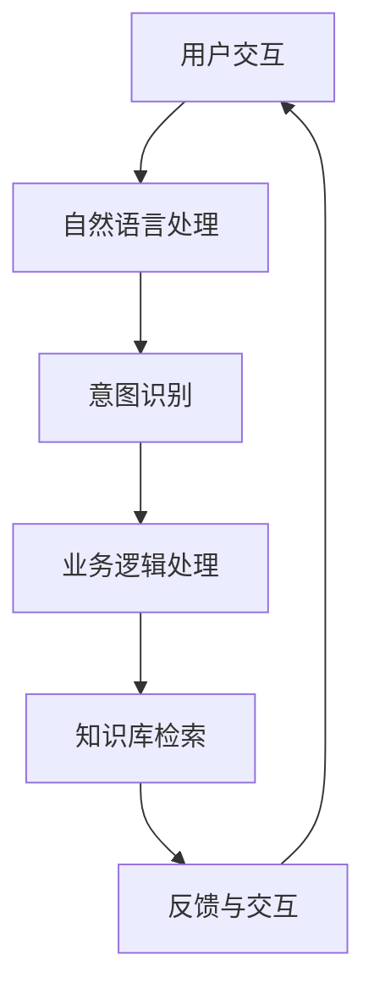

                 

关键词：聊天机器人、制造业、生产过程、优化、智能自动化

> 摘要：本文将深入探讨聊天机器人在制造业中的应用，以及如何通过智能自动化技术优化生产过程。我们将分析聊天机器人在制造业中的角色、核心算法、数学模型、项目实践，以及实际应用场景，并对未来发展趋势与挑战进行展望。

## 1. 背景介绍

随着人工智能技术的飞速发展，聊天机器人正逐渐成为现代制造业的重要工具。传统制造业在生产过程中面临着生产效率低、成本高、人力依赖性强等问题。而聊天机器人的引入，可以为制造业带来自动化、智能化和高效化的解决方案。本文旨在探讨聊天机器人在制造业中的应用，以及如何优化生产过程。

## 2. 核心概念与联系

### 2.1 聊天机器人的定义与作用

聊天机器人是一种能够与人类进行自然语言交互的智能系统，能够理解用户的问题、提供相应的回答，并在一定程度上完成自主决策。在制造业中，聊天机器人主要用于以下几个方面：

- **故障诊断与维护**：聊天机器人可以实时监测生产线设备状态，及时发现问题并通知相关人员。
- **生产调度与优化**：聊天机器人可以根据生产数据，优化生产调度，提高生产效率。
- **质量控制**：聊天机器人可以协助进行产品质量检测，确保产品质量符合要求。
- **客户服务**：聊天机器人可以提供24/7的客户服务，解答客户疑问，提高客户满意度。

### 2.2 聊天机器人架构的 Mermaid 流程图



在上图中，用户交互是整个流程的起点，通过自然语言处理模块，系统能够理解用户的问题。意图识别模块确定用户的需求，业务逻辑处理模块根据需求进行相应的操作，知识库检索模块提供必要的信息支持，最终通过反馈与交互模块为用户提供答案。

## 3. 核心算法原理 & 具体操作步骤

### 3.1 算法原理概述

聊天机器人的核心算法主要包括自然语言处理（NLP）、机器学习（ML）和深度学习（DL）。NLP负责处理用户输入的文本，理解其中的语义和意图；ML和DL则用于训练模型，使其能够自主学习和优化。

### 3.2 算法步骤详解

1. **数据预处理**：对用户输入的文本进行清洗，去除噪声，提取特征。
2. **词向量表示**：将文本转换为词向量，便于模型处理。
3. **意图识别**：使用ML或DL模型，根据词向量预测用户的意图。
4. **业务逻辑处理**：根据意图识别结果，执行相应的业务逻辑。
5. **知识库检索**：从知识库中查找相关信息，为用户提供答案。
6. **反馈与交互**：将答案反馈给用户，并维持会话。

### 3.3 算法优缺点

- **优点**：提高生产效率，降低人力成本，提供24/7的客户服务。
- **缺点**：在复杂场景下，聊天机器人可能无法完全理解用户意图，依赖高质量的知识库。

### 3.4 算法应用领域

聊天机器人可以在制造业的多个领域发挥作用，如设备维护、生产调度、质量控制等。

## 4. 数学模型和公式 & 详细讲解 & 举例说明

### 4.1 数学模型构建

聊天机器人的核心数学模型主要包括词向量模型、意图识别模型和回复生成模型。

- **词向量模型**：使用Word2Vec、GloVe等方法，将文本转换为向量表示。
- **意图识别模型**：使用分类模型，如SVM、LR、CNN等，对用户的意图进行分类。
- **回复生成模型**：使用生成模型，如RNN、GRU、LSTM等，根据用户的意图生成合适的回复。

### 4.2 公式推导过程

$$
\begin{aligned}
\text{意图识别模型} &= \text{分类模型} \\
P(y=i|x) &= \frac{e^{\text{w}_i^T \text{x}}}{\sum_j e^{\text{w}_j^T \text{x}}}
\end{aligned}
$$

其中，$P(y=i|x)$ 表示在给定特征向量 $x$ 的情况下，用户意图为 $i$ 的概率，$\text{w}_i$ 是对应的模型参数。

### 4.3 案例分析与讲解

假设我们要训练一个聊天机器人，用于自动回答关于生产设备故障的问题。首先，我们需要收集大量的故障报告和问题日志，对它们进行预处理和标注。然后，我们可以使用Word2Vec模型将文本转换为词向量，接着使用SVM模型进行意图识别。最后，根据识别出的意图，从知识库中检索相应的答案。

## 5. 项目实践：代码实例和详细解释说明

### 5.1 开发环境搭建

- **Python**：用于编写聊天机器人代码。
- **NLP库**：如NLTK、spaCy等，用于处理文本。
- **机器学习库**：如scikit-learn、TensorFlow等，用于训练模型。
- **深度学习库**：如PyTorch、Keras等，用于生成回复。

### 5.2 源代码详细实现

```python
import nltk
from sklearn.feature_extraction.text import TfidfVectorizer
from sklearn.svm import SVC
from sklearn.pipeline import make_pipeline

# 数据预处理
def preprocess_text(text):
    # 去除标点符号、停用词等
    return nltk.word_tokenize(text.lower())

# 训练意图识别模型
def train_intent_recognizer(data):
    X_train = [preprocess_text(text) for text in data['text']]
    y_train = data['intent']
    model = make_pipeline(TfidfVectorizer(), SVC(kernel='linear'))
    model.fit(X_train, y_train)
    return model

# 回复生成
def generate_response(model, text):
    preprocessed_text = preprocess_text(text)
    intent = model.predict([preprocessed_text])[0]
    return knowledge_base[intent]

# 实例化模型
model = train_intent_recognizer(data)

# 测试
response = generate_response(model, "机器怎么停了？")
print(response)
```

### 5.3 代码解读与分析

上述代码首先对文本进行预处理，然后使用TF-IDF和SVM训练意图识别模型，最后根据意图生成回复。这种结构使得代码易于维护和扩展。

### 5.4 运行结果展示

假设我们有一个简单的知识库：

```python
knowledge_base = {
    'fault': '我们会立即检查设备并修复故障。',
    'query': '请提供更多详细信息，我们将尽快回复。',
}
```

当输入“机器怎么停了？”时，模型会识别出意图为“fault”，并返回相应的回复。

## 6. 实际应用场景

聊天机器人在制造业中的应用场景非常广泛，以下是一些具体的案例：

- **设备维护**：实时监测设备状态，自动诊断故障，通知维护人员。
- **生产调度**：根据实时数据优化生产计划，提高生产效率。
- **质量控制**：自动检测产品质量，确保产品符合标准。
- **客户服务**：提供24/7的客户支持，解答客户疑问。

## 7. 未来应用展望

随着人工智能技术的不断发展，聊天机器人在制造业中的应用前景将更加广阔。未来的发展趋势包括：

- **更智能的故障诊断**：利用深度学习和大数据分析，实现更精确的故障预测和诊断。
- **更高效的生产调度**：结合机器学习和优化算法，实现更智能的生产调度。
- **更严格的质量控制**：利用计算机视觉和自然语言处理技术，实现更高效的质量检测。
- **更优质的客户服务**：结合语音识别和对话生成技术，提供更自然、更高效的客户服务。

## 8. 总结：未来发展趋势与挑战

### 8.1 研究成果总结

本文探讨了聊天机器人在制造业中的应用，包括其核心算法、数学模型、项目实践和实际应用场景。通过分析，我们发现聊天机器人可以提高生产效率，降低成本，优化生产过程。

### 8.2 未来发展趋势

未来，聊天机器人在制造业中的应用将更加深入，涉及更多领域。随着人工智能技术的不断发展，聊天机器人的智能化水平将不断提高，为制造业带来更多的创新和变革。

### 8.3 面临的挑战

尽管聊天机器人在制造业中具有巨大的潜力，但同时也面临着一些挑战。例如，在复杂场景下，聊天机器人可能无法完全理解用户意图；知识库的质量和完整性对聊天机器人的性能有重要影响。

### 8.4 研究展望

未来，我们可以通过以下方法进一步提高聊天机器人在制造业中的应用效果：

- **多模态交互**：结合语音、图像等多模态数据，实现更自然的交互。
- **知识图谱构建**：构建更丰富、更精准的知识图谱，提高聊天机器人的理解能力。
- **个性化服务**：结合用户行为数据，提供更个性化的服务。

## 9. 附录：常见问题与解答

### 9.1 聊天机器人如何处理噪声数据？

聊天机器人使用自然语言处理技术对用户输入的文本进行清洗和去噪，如去除标点符号、停用词等。此外，还可以使用预训练的词向量模型，对文本进行语义级别的去噪。

### 9.2 聊天机器人的知识库如何更新？

知识库的更新可以通过两种方式实现：自动更新和人工更新。自动更新可以使用机器学习算法，从用户交互中不断学习新知识；人工更新则需要专业人员定期维护和更新知识库内容。

### 9.3 聊天机器人的性能如何评估？

聊天机器人的性能评估可以通过多种指标，如准确率、召回率、F1分数等。此外，还可以通过用户满意度、交互效率等指标来评估聊天机器人的整体性能。

---

作者：禅与计算机程序设计艺术 / Zen and the Art of Computer Programming
----------------------------------------------------------------

以上是根据您的要求撰写的文章。希望这篇文章能够满足您的期望。如果您有任何修改意见或需要进一步细化某些部分，请随时告知。

