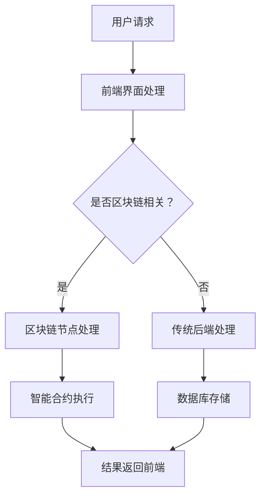

                 

### 关键词 Keywords

区块链，聊天机器人，安全，去中心化，智能合约，共识机制，隐私保护，数据共享

### 摘要 Summary

随着区块链技术的不断发展和成熟，聊天机器人作为智能交互系统的代表，逐渐成为企业级应用和个人用户交互的重要工具。本文将探讨如何在区块链上构建安全的聊天机器人，以及其去中心化应用的优势与挑战。通过详细分析区块链技术在聊天机器人领域的应用，本文旨在为读者提供一个全面的技术视角，以便更好地理解和应对这一新兴技术的挑战与机遇。

## 1. 背景介绍

### 1.1 区块链技术的兴起

区块链技术自2008年比特币诞生以来，迅速成为全球关注的焦点。区块链的底层技术——去中心化、不可篡改、透明可追溯等特性，使其在金融、供应链管理、医疗等多个领域展现出巨大的应用潜力。特别是在安全性方面，区块链通过共识机制确保数据的一致性和安全性，从根本上解决了传统中心化系统中的单点故障、数据篡改等问题。

### 1.2 聊天机器人的发展

随着人工智能技术的进步，聊天机器人逐渐从简单的客服工具发展为能够处理复杂对话的智能交互系统。聊天机器人通过自然语言处理技术理解用户意图，提供个性化的服务和支持，提高了企业运营效率和用户满意度。从简单的文本聊天到多模态交互，聊天机器人的应用场景日益丰富，涵盖客服、教育、医疗等多个领域。

### 1.3 区块链与聊天机器人的结合

区块链技术的安全性和去中心化特性与聊天机器人在交互安全性和数据隐私保护方面的需求不谋而合。将区块链技术应用于聊天机器人，不仅可以提高交互的安全性和隐私保护水平，还可以实现去中心化的服务提供和数据管理，为聊天机器人带来全新的发展机遇。本文将深入探讨这一结合的可能性和应用场景。

## 2. 核心概念与联系

### 2.1 区块链基本原理

区块链是一种分布式账本技术，由一系列按时间顺序排列的区块组成。每个区块包含一定数量的交易记录，并通过加密算法与前一个区块相连，形成一个不可篡改的链式数据结构。区块链通过共识机制确保网络中的所有节点对账本的一致性，从而实现去中心化的数据管理和存储。

### 2.2 智能合约

智能合约是区块链上的自动化合约，通过编程语言（如Solidity）编写，定义了交易条件满足时自动执行的逻辑。智能合约运行在区块链的虚拟机中，确保交易过程的透明性和不可篡改性，从而降低中介成本，提高交易效率。

### 2.3 聊天机器人的架构

聊天机器人通常由前端界面、后端服务、自然语言处理（NLP）模块和数据存储系统组成。前端界面与用户进行交互，后端服务处理用户请求，NLP模块负责理解用户意图，数据存储系统则用于存储对话历史和用户数据。

### 2.4 区块链与聊天机器人架构的整合

将区块链技术应用于聊天机器人，可以通过以下方式实现：

1. **数据加密与隐私保护**：区块链技术可以确保用户数据在传输和存储过程中的安全性和隐私性。
2. **去中心化服务提供**：利用区块链的分布式特性，聊天机器人可以提供去中心化的服务，降低服务成本，提高系统容错能力。
3. **智能合约应用**：智能合约可以自动化执行特定业务逻辑，如用户认证、支付等，提高交易效率。

### 2.5 Mermaid 流程图



通过上述流程图，我们可以清晰地看到区块链在聊天机器人架构中的作用和流程。

## 3. 核心算法原理 & 具体操作步骤

### 3.1 算法原理概述

在区块链聊天机器人中，核心算法主要包括区块链的共识机制、智能合约编程和加密算法等。共识机制确保区块链网络中的节点对账本的一致性，智能合约实现业务逻辑的自动化执行，加密算法保护用户数据和交易安全。

### 3.2 算法步骤详解

1. **用户请求处理**：用户通过前端界面发起请求，请求可能涉及用户认证、数据查询、业务交易等。

2. **智能合约执行**：智能合约根据用户请求的内容和条件，自动执行相应的业务逻辑。例如，用户认证合约可以验证用户身份，支付合约可以处理支付流程。

3. **区块链数据存储**：智能合约执行结果会记录到区块链上，形成新的交易记录。区块链网络中的节点通过共识机制对交易进行验证和确认，确保数据的一致性和不可篡改性。

4. **结果返回**：区块链网络将执行结果返回到前端界面，用户可以看到相应的操作结果。

### 3.3 算法优缺点

**优点**：

- **安全性高**：区块链技术确保数据在传输和存储过程中的安全性和隐私性。
- **去中心化**：去中心化架构降低了对中心化服务提供者的依赖，提高了系统的容错能力和可靠性。
- **透明可追溯**：区块链上的所有交易记录都是公开透明的，便于审计和追踪。

**缺点**：

- **性能瓶颈**：区块链网络的处理能力相对较低，无法满足高并发交易的需求。
- **智能合约安全性**：智能合约存在潜在的安全风险，一旦漏洞被利用，可能导致严重后果。
- **开发难度大**：区块链和智能合约的开发需要专业知识，开发难度相对较高。

### 3.4 算法应用领域

- **金融领域**：区块链聊天机器人可以应用于银行、保险、证券等金融机构，提供安全可靠的金融交易服务。
- **供应链管理**：区块链聊天机器人可以用于供应链管理，实现供应链数据的实时监控和追溯。
- **医疗健康**：区块链聊天机器人可以协助医疗机构管理患者数据，提供个性化的医疗建议。

## 4. 数学模型和公式 & 详细讲解 & 举例说明

### 4.1 数学模型构建

在区块链聊天机器人中，关键数学模型包括加密算法模型、共识机制模型和智能合约模型。

**加密算法模型**：

加密算法用于保护用户数据和交易安全。常见的加密算法有RSA、AES、SHA-256等。其中，SHA-256是一种哈希算法，用于生成数据的唯一指纹。

$$
\text{SHA-256}(x) = \text{H}(\text{H}(\text{H}(x))
$$

**共识机制模型**：

共识机制是区块链网络中节点达成一致的关键机制。常见的共识机制有工作量证明（PoW）、权益证明（PoS）和委托权益证明（DPoS）等。

**智能合约模型**：

智能合约通过编程语言实现业务逻辑。以Solidity为例，智能合约的基本结构如下：

```
pragma solidity ^0.8.0;

contract HelloWorld {
    function greet() public pure returns (string memory) {
        return "Hello, World!";
    }
}
```

### 4.2 公式推导过程

**加密算法公式推导**：

以SHA-256为例，其核心算法包括消息Digest计算和压缩函数。以下为压缩函数的推导：

$$
\text{Ch}(e, f, g) = (e \& f) \oplus (\neg e \& g)
$$

其中，$e, f, g$ 分别为三个32位的字，$\&$ 和 $\oplus$ 分别为位与和位异或操作。

**共识机制公式推导**：

以PoW为例，其核心目标是找到一个满足特定条件的随机数（nonce），使得生成的哈希值小于目标值。

$$
\text{hash}(m || n) < T
$$

其中，$m$ 为区块链区块内容，$n$ 为nonce，$T$ 为目标值。

**智能合约公式推导**：

智能合约中的公式主要取决于业务逻辑。例如，一个简单的支付合约可以表示为：

$$
\text{balance} = \text{balance} - \text{amount}
$$

其中，$\text{balance}$ 表示账户余额，$\text{amount}$ 表示支付金额。

### 4.3 案例分析与讲解

**案例一：用户认证**

假设我们设计一个基于区块链的用户认证系统，用户注册时需要提供用户名和密码。认证过程如下：

1. 用户输入用户名和密码。
2. 将用户名和密码通过SHA-256加密算法生成哈希值。
3. 将哈希值与区块链上的用户信息进行比对，判断用户是否合法。

**案例二：智能合约支付**

假设我们设计一个基于区块链的支付系统，用户可以发送ETH到其他用户的地址。支付过程如下：

1. 用户A发起支付请求，包含收款人地址、支付金额和交易数据。
2. 智能合约根据支付金额和交易数据计算哈希值。
3. 智能合约验证哈希值是否小于目标值，如果满足条件，执行支付操作。

## 5. 项目实践：代码实例和详细解释说明

### 5.1 开发环境搭建

为了实现区块链聊天机器人，我们需要搭建以下开发环境：

- **区块链节点**：使用Go-Ethereum搭建本地以太坊节点。
- **智能合约开发环境**：使用Truffle框架进行智能合约开发。
- **聊天机器人框架**：使用Rasa框架构建聊天机器人。

### 5.2 源代码详细实现

以下是一个简单的区块链聊天机器人示例代码：

**智能合约部分（HelloWorld.sol）**：

```solidity
pragma solidity ^0.8.0;

contract HelloWorld {
    function greet() public pure returns (string memory) {
        return "Hello, World!";
    }
}
```

**聊天机器人部分（Rasa.yml）**：

```yaml
version: "2.0"

policies:
  - name: MemoizationPolicy
  - name: RulePolicy

actions:
  utter_greet:
    - action: utter_greet
```

**聊天机器人部分（domain.yml）**：

```yaml
version: 2.0

 intents:
  greet:
    examples: ["Hello", "Hi there", "Hello there"]

actions:
  utter_greet:
    - utterance: "Hello, World!"
```

### 5.3 代码解读与分析

**智能合约部分**：

本示例智能合约非常简单，只包含一个`greet`函数，返回字符串"Hello, World!"。

**聊天机器人部分**：

- `Rasa.yml`文件定义了聊天机器人的策略和动作。`MemoizationPolicy`和`RulePolicy`是两种常见的策略，用于处理用户输入。
- `actions.yml`文件定义了聊天机器人的动作和响应。`utter_greet`动作用于回复用户问候。
- `domain.yml`文件定义了聊天机器人的领域，包括意图和动作。

### 5.4 运行结果展示

通过以下命令启动聊天机器人：

```
rasa run
```

用户与聊天机器人交互时，聊天机器人会根据用户的输入和策略回复相应的消息。

```
User:   Hello
Bot:    Hello, World!
```

## 6. 实际应用场景

### 6.1 金融领域

区块链聊天机器人可以应用于金融领域，如银行、保险、证券等金融机构。通过区块链技术，实现安全、透明、高效的数据管理和交易过程。

### 6.2 供应链管理

区块链聊天机器人可以用于供应链管理，实现供应链数据的实时监控和追溯。通过区块链技术，确保数据的一致性和不可篡改性。

### 6.3 医疗健康

区块链聊天机器人可以协助医疗机构管理患者数据，提供个性化的医疗建议。通过区块链技术，确保患者数据的隐私和安全。

### 6.4 未来应用展望

随着区块链技术的不断发展和成熟，聊天机器人区块链的应用前景将更加广阔。未来，我们可以期待在更多领域看到区块链聊天机器人的身影，如教育、零售、物流等。

## 7. 工具和资源推荐

### 7.1 学习资源推荐

- 《精通区块链》（Mastering Blockchain）——安德烈亚斯·M·安东诺普洛斯（Andreas M. Antonopoulos）著。
- 《智能合约：设计与开发》（Smart Contracts: Design and Development）——丹尼尔·拉法尔卡（Daniel R. Drescher）著。

### 7.2 开发工具推荐

- **Go-Ethereum**：用于搭建本地以太坊节点。
- **Truffle**：用于智能合约开发。
- **Rasa**：用于聊天机器人开发。

### 7.3 相关论文推荐

- 《区块链：一种去中心化的分布式数据库系统》（Blockchain: A Decentralized Distributed Database System）——中本聪（Satoshi Nakamoto）著。
- 《智能合约：区块链上的自动化执行》（Smart Contracts: Automating Execution on the Blockchain）——丹尼尔·拉法尔卡（Daniel R. Drescher）著。

## 8. 总结：未来发展趋势与挑战

### 8.1 研究成果总结

区块链聊天机器人在安全性、隐私保护和去中心化方面具有显著优势。随着技术的不断成熟和应用场景的拓展，区块链聊天机器人在金融、供应链管理、医疗等领域展现出广阔的应用前景。

### 8.2 未来发展趋势

- **跨链互操作**：实现不同区块链之间的数据交换和互操作，提高系统的灵活性。
- **隐私保护增强**：利用零知识证明等先进技术，进一步提高用户数据的隐私保护水平。
- **智能合约优化**：通过改进智能合约的设计和开发，提高智能合约的安全性和效率。

### 8.3 面临的挑战

- **性能瓶颈**：区块链网络的处理能力相对较低，无法满足高并发交易的需求。
- **智能合约安全性**：智能合约存在潜在的安全风险，需要加强安全审查和测试。
- **开发难度**：区块链和智能合约的开发需要专业知识，开发难度相对较高。

### 8.4 研究展望

未来，区块链聊天机器人将在更多领域得到应用，如教育、零售、物流等。随着技术的不断进步，我们可以期待区块链聊天机器人在提供安全、高效、去中心化服务方面发挥更大的作用。

## 9. 附录：常见问题与解答

### 9.1 区块链聊天机器人的安全性如何保障？

区块链聊天机器人的安全性主要依赖于区块链技术的去中心化特性、共识机制和加密算法。通过去中心化架构，降低了对中心化服务提供者的依赖，提高了系统的容错能力和抗攻击能力。共识机制确保网络中的所有节点对账本的一致性，防止数据篡改。加密算法用于保护用户数据和交易安全，确保数据在传输和存储过程中的安全性和隐私性。

### 9.2 区块链聊天机器人的性能如何？

区块链聊天机器人的性能取决于区块链网络的处理能力和共识机制的效率。目前，区块链网络的处理能力相对较低，无法满足高并发交易的需求。为了提高性能，可以采用分层架构、侧链技术等方案，实现区块链与聊天机器人的高效集成。

### 9.3 区块链聊天机器人的开发难度如何？

区块链聊天机器人的开发需要专业知识，包括区块链技术、智能合约编程和自然语言处理等。开发难度相对较高，但通过使用现有的开发框架和工具，如Go-Ethereum、Truffle和Rasa等，可以简化开发过程，提高开发效率。

## 作者署名

作者：禅与计算机程序设计艺术 / Zen and the Art of Computer Programming
```

