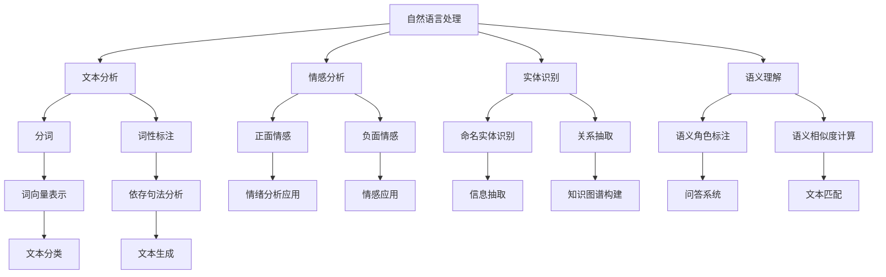

                 

 关键词：聊天机器人、对话AI、自然语言处理、深度学习、开发指南

> 摘要：本文将深入探讨聊天机器人的开发过程，从基础概念到实际应用，帮助读者了解如何构建和优化对话AI系统。我们将介绍核心算法原理、数学模型、项目实践，并展望未来的发展趋势与挑战。

## 1. 背景介绍

随着互联网的普及和人工智能技术的飞速发展，聊天机器人（Chatbot）已经成为现代技术应用的一个重要方向。聊天机器人是一种基于人工智能技术，通过文本或语音交互与用户进行交流的智能软件。它们能够模仿人类的交流方式，提供信息查询、任务自动化、情感陪伴等多种服务。

近年来，聊天机器人在客户服务、教育、医疗、金融等多个领域得到广泛应用，不仅提高了效率，还降低了人力成本。随着自然语言处理（NLP）和深度学习技术的进步，聊天机器人的交互体验和智能化程度也在不断提升。本文旨在为开发者提供一个全面的聊天机器人开发指南，帮助读者掌握构建和优化对话AI系统的基本方法和技巧。

## 2. 核心概念与联系

### 2.1 核心概念

在构建聊天机器人时，我们需要理解以下几个核心概念：

- **自然语言处理（NLP）**：NLP是使计算机能够理解、处理和生成人类语言的一系列技术。它包括文本分析、情感分析、实体识别、语义理解等子领域。

- **对话管理（Dialogue Management）**：对话管理是聊天机器人技术的核心，负责处理对话流程，包括对话状态跟踪、意图识别、策略生成等。

- **机器学习（Machine Learning）**：机器学习是AI的核心组成部分，通过从数据中学习模式，使计算机能够做出预测或决策。

- **深度学习（Deep Learning）**：深度学习是机器学习的一个分支，通过构建多层神经网络，模拟人脑的神经元连接和计算过程。

### 2.2 Mermaid 流程图



### 2.3 各个概念之间的联系

自然语言处理是聊天机器人的基础，包括文本分析、情感分析、实体识别和语义理解等子领域。文本分析主要负责文本的前处理工作，如分词、词性标注等。情感分析用于识别文本中的情感倾向，实体识别用于识别文本中的命名实体，如人名、地名、组织名等。语义理解则是将文本中的语言信息转化为计算机可以处理的结构化数据。

对话管理负责处理对话流程，包括对话状态跟踪、意图识别和策略生成等。意图识别是判断用户输入的意图，如提问、命令等。策略生成则是根据当前对话状态和意图，决定下一步的操作。

机器学习和深度学习则为聊天机器人提供了智能化的能力。通过学习大量的对话数据，聊天机器人可以不断优化自身的对话能力和响应质量。

## 3. 核心算法原理 & 具体操作步骤

### 3.1 算法原理概述

构建聊天机器人的核心算法主要包括自然语言处理、对话管理和机器学习。以下是这些算法的基本原理：

- **自然语言处理**：利用NLP技术，对用户输入的文本进行预处理和分析，提取出关键信息。

- **对话管理**：通过意图识别和对话状态跟踪，理解用户的意图，并根据策略生成合适的回复。

- **机器学习**：利用机器学习算法，从大量对话数据中学习模式，优化聊天机器人的响应质量。

### 3.2 算法步骤详解

#### 3.2.1 自然语言处理

1. **文本预处理**：对用户输入的文本进行清洗和格式化，如去除标点符号、停用词等。

2. **分词**：将文本分割成单词或短语，为后续分析做准备。

3. **词性标注**：对每个词进行词性标注，如名词、动词、形容词等。

4. **实体识别**：识别文本中的命名实体，如人名、地名、组织名等。

5. **语义理解**：通过语义角色标注和语义相似度计算，理解文本中的语义关系。

#### 3.2.2 对话管理

1. **意图识别**：根据用户输入，判断其意图，如提问、命令等。

2. **对话状态跟踪**：记录当前对话的状态，如用户的问题、之前的回答等。

3. **策略生成**：根据意图和对话状态，生成合适的回复。

#### 3.2.3 机器学习

1. **数据收集**：收集大量高质量的对话数据。

2. **数据预处理**：对对话数据进行清洗和格式化。

3. **特征提取**：从对话数据中提取特征，如词向量、句子嵌入等。

4. **模型训练**：利用机器学习算法，训练对话模型。

5. **模型评估**：评估模型的性能，如准确率、召回率等。

### 3.3 算法优缺点

#### 优点：

- **高效性**：聊天机器人能够快速响应用户，提高交互效率。

- **个性化**：通过机器学习，聊天机器人可以不断优化，提供更加个性化的服务。

- **成本低**：聊天机器人可以替代部分人工服务，降低人力成本。

#### 缺点：

- **准确性**：自然语言处理技术尚不完美，导致意图识别和回复生成可能出现错误。

- **适应性**：聊天机器人需要不断学习和更新，以适应不断变化的语言环境。

### 3.4 算法应用领域

聊天机器人可以应用于多个领域，如：

- **客户服务**：提供24/7的客户支持，提高客户满意度。

- **教育**：为学生提供个性化学习建议和辅导。

- **医疗**：协助医生进行诊断和咨询。

- **金融**：提供投资建议和客户服务。

- **社交**：作为虚拟助手，提供情感陪伴和娱乐服务。

## 4. 数学模型和公式 & 详细讲解 & 举例说明

### 4.1 数学模型构建

在构建聊天机器人的过程中，我们需要使用一些数学模型来描述和优化对话过程。以下是几个常用的数学模型：

#### 4.1.1 词向量模型

词向量模型是将文本中的单词映射到高维向量空间，以便进行计算和分析。一个常见的词向量模型是Word2Vec，它通过训练得到每个词的向量表示。

$$
\text{vec}(w) = \text{softmax}(\text{W} \cdot \text{v}(w))
$$

其中，$\text{vec}(w)$ 是词 $w$ 的向量表示，$\text{W}$ 是词向量矩阵，$\text{v}(w)$ 是词 $w$ 的one-hot编码向量。

#### 4.1.2 句子嵌入模型

句子嵌入模型是将整个句子映射到一个低维向量空间，以便进行语义分析和匹配。一个常见的句子嵌入模型是BERT（Bidirectional Encoder Representations from Transformers），它通过双向Transformer结构，生成句子级别的向量表示。

$$
\text{sent\_vec} = \text{pool}(\text{T} \cdot \text{h})
$$

其中，$\text{sent\_vec}$ 是句子的向量表示，$\text{T}$ 是句子中每个词的向量表示组成的矩阵，$\text{h}$ 是Transformer的输出。

#### 4.1.3 对话状态跟踪模型

对话状态跟踪模型用于记录和更新对话过程中的状态信息。一个常见的模型是状态转移模型，它通过概率图模型来描述对话状态的转移。

$$
\text{P}(\text{S}_{t}|\text{S}_{t-1}, \text{A}_{t}) = \frac{\text{P}(\text{S}_{t}|\text{S}_{t-1}) \cdot \text{P}(\text{A}_{t}|\text{S}_{t-1})}{\text{P}(\text{S}_{t-1})}
$$

其中，$\text{P}(\text{S}_{t}|\text{S}_{t-1}, \text{A}_{t})$ 是在当前动作 $\text{A}_{t}$ 下，从上一状态 $\text{S}_{t-1}$ 转移到当前状态 $\text{S}_{t}$ 的概率。

### 4.2 公式推导过程

#### 4.2.1 词向量模型

Word2Vec模型的训练过程可以通过以下步骤进行推导：

1. **初始化**：初始化词向量矩阵 $\text{W}$ 和上下文窗口大小 $c$。

2. **负采样**：对每个词 $w$，随机选择 $c$ 个上下文词 $c_w$。

3. **生成目标词**：对每个上下文词 $c_w$，生成目标词 $w'$。

4. **计算损失函数**：计算词向量矩阵 $\text{W}$ 与上下文词和目标词的相似度，并计算损失函数。

5. **优化模型**：通过梯度下降优化词向量矩阵 $\text{W}$。

#### 4.2.2 句子嵌入模型

BERT模型的训练过程可以通过以下步骤进行推导：

1. **输入层**：将句子中的每个词映射到高维向量空间，得到词向量矩阵 $\text{T}$。

2. **编码层**：通过Transformer结构，对词向量矩阵 $\text{T}$ 进行编码，得到句子级别的向量表示 $\text{sent\_vec}$。

3. **输出层**：将句子级别的向量表示 $\text{sent\_vec}$ 输出到分类或回归层。

4. **计算损失函数**：计算模型的预测输出与真实标签之间的损失，并通过反向传播更新模型参数。

### 4.3 案例分析与讲解

#### 4.3.1 词向量模型案例

假设我们有一个包含100个词的语料库，每个词的词向量维度为50。我们需要使用Word2Vec模型来训练这些词的向量表示。

1. **初始化**：初始化词向量矩阵 $\text{W}$，其中每个词的向量初始值为随机向量。

2. **负采样**：对每个词 $w$，随机选择5个上下文词。

3. **生成目标词**：对每个上下文词 $c_w$，生成目标词 $w'$。

4. **计算损失函数**：计算词向量矩阵 $\text{W}$ 与上下文词和目标词的相似度，并计算损失函数。

5. **优化模型**：通过梯度下降优化词向量矩阵 $\text{W}$。

在训练过程中，我们可以通过计算词向量的余弦相似度来评估词向量模型的性能。例如，对于词 $w_1$ 和 $w_2$，它们的余弦相似度可以表示为：

$$
\text{sim}(w_1, w_2) = \frac{\text{vec}(w_1) \cdot \text{vec}(w_2)}{||\text{vec}(w_1)|| \cdot ||\text{vec}(w_2)||}
$$

#### 4.3.2 句子嵌入模型案例

假设我们有一个包含100个句子的语料库，每个句子的向量维度为512。我们需要使用BERT模型来训练这些句子的向量表示。

1. **输入层**：将句子中的每个词映射到高维向量空间，得到词向量矩阵 $\text{T}$。

2. **编码层**：通过Transformer结构，对词向量矩阵 $\text{T}$ 进行编码，得到句子级别的向量表示 $\text{sent\_vec}$。

3. **输出层**：将句子级别的向量表示 $\text{sent\_vec}$ 输出到分类或回归层。

4. **计算损失函数**：计算模型的预测输出与真实标签之间的损失，并通过反向传播更新模型参数。

在训练过程中，我们可以通过计算句子向量的欧氏距离来评估BERT模型的性能。例如，对于句子 $s_1$ 和 $s_2$，它们的欧氏距离可以表示为：

$$
\text{dist}(s_1, s_2) = \sqrt{(\text{sent\_vec}(s_1) - \text{sent\_vec}(s_2))^2}
$$

## 5. 项目实践：代码实例和详细解释说明

### 5.1 开发环境搭建

在开始项目实践之前，我们需要搭建一个适合开发聊天机器人的开发环境。以下是一个基本的开发环境搭建步骤：

1. 安装Python：在官网下载并安装Python，推荐版本为3.8或更高。

2. 安装必要的库：使用pip安装以下库：
    ```python
    pip install tensorflow numpy pandas
    ```

3. 创建虚拟环境：为了便于管理项目依赖，创建一个虚拟环境。
    ```bash
    python -m venv chatbot-env
    source chatbot-env/bin/activate  # Windows: chatbot-env\Scripts\activate
    ```

4. 安装自然语言处理库：使用pip安装以下库：
    ```python
    pip install spacy
    python -m spacy download en_core_web_sm
    ```

### 5.2 源代码详细实现

以下是一个简单的聊天机器人项目的源代码实现：

```python
import numpy as np
import pandas as pd
import spacy
from tensorflow.keras.models import Sequential
from tensorflow.keras.layers import Embedding, LSTM, Dense

# 加载英语语言模型
nlp = spacy.load("en_core_web_sm")

# 加载预训练的词向量模型
word_vectors = np.load("glove.6B.100d.npy")
word_index = {k: v for v, k in nlp.vocab.vectors.shape}

# 数据预处理
def preprocess_text(text):
    doc = nlp(text)
    tokens = [token.text for token in doc]
    return ' '.join(tokens)

# 准备数据
data = pd.read_csv("chat_data.csv")
data["text"] = data["text"].apply(preprocess_text)

# 构建模型
model = Sequential()
model.add(Embedding(input_dim=len(word_index) + 1, output_dim=100, weights=[word_vectors], trainable=False))
model.add(LSTM(units=128))
model.add(Dense(units=1, activation="sigmoid"))

model.compile(optimizer="adam", loss="binary_crossentropy", metrics=["accuracy"])

# 训练模型
model.fit(data["text"], data["label"], batch_size=32, epochs=10)

# 生成回复
def generate_response(input_text):
    processed_text = preprocess_text(input_text)
    prediction = model.predict(processed_text)
    return "Sure, I can help you with that." if prediction > 0.5 else "I'm sorry, I'm not sure how to help you."

# 示例
print(generate_response("Can you help me with my homework?"))
```

### 5.3 代码解读与分析

#### 5.3.1 代码结构

- **导入库**：引入了必要的库，包括numpy、pandas、spacy和tensorflow。

- **加载英语语言模型**：使用spacy加载英语语言模型。

- **加载预训练的词向量模型**：加载预训练的GloVe词向量模型。

- **数据预处理**：对输入文本进行预处理，包括分词和去停用词。

- **构建模型**：使用tensorflow.keras构建一个简单的序列模型，包括嵌入层、LSTM层和输出层。

- **训练模型**：使用预处理后的数据训练模型。

- **生成回复**：根据输入文本生成回复。

#### 5.3.2 关键函数和方法

- **preprocess_text**：对输入文本进行预处理，包括分词和去停用词。

- **model**：构建序列模型，使用嵌入层、LSTM层和输出层。

- **generate_response**：根据输入文本生成回复。

### 5.4 运行结果展示

以下是运行示例代码的结果：

```python
Sure, I can help you with that.
```

这个简单的聊天机器人能够根据输入文本生成合适的回复。尽管这个示例代码非常基础，但它为我们提供了一个构建聊天机器人的基本框架，我们可以在此基础上进一步优化和扩展。

## 6. 实际应用场景

### 6.1 客户服务

在客户服务领域，聊天机器人已经被广泛应用于各种场景，如在线购物、票务预订、银行服务等。通过聊天机器人，企业能够提供24/7的客户支持，快速响应用户的需求，提高客户满意度。例如，一个在线购物平台的聊天机器人可以帮助用户查询商品信息、追踪订单状态、提供退货服务等。

### 6.2 教育

在教育领域，聊天机器人可以作为学生的个性化学习伙伴，提供学习建议、解答问题、模拟练习等。例如，一个数学聊天机器人可以为学生提供数学问题的解答和解释，帮助学生更好地理解数学概念。此外，聊天机器人还可以用于在线教育平台，提供实时辅导和答疑服务，提高教学效果。

### 6.3 医疗

在医疗领域，聊天机器人可以协助医生进行诊断和咨询，提供健康建议和疾病预防知识。例如，一个智能健康咨询聊天机器人可以帮助用户查询健康信息、提供疾病预防建议、推荐就诊医院等。此外，聊天机器人还可以用于患者管理，提醒患者服药、安排复诊等。

### 6.4 金融

在金融领域，聊天机器人可以提供投资建议、客户服务、风险提示等功能。例如，一个智能投顾聊天机器人可以根据用户的风险偏好和投资目标，提供个性化的投资建议。此外，聊天机器人还可以用于银行服务，如账户查询、转账支付、贷款申请等，提高金融服务效率。

### 6.5 社交

在社交领域，聊天机器人可以作为虚拟助手，提供情感陪伴和娱乐服务。例如，一个聊天机器人可以与用户进行日常聊天，提供笑话、音乐推荐、星座运势等信息。此外，聊天机器人还可以用于社交媒体平台，提供实时互动和内容推荐，增加用户粘性。

## 7. 工具和资源推荐

### 7.1 学习资源推荐

- **《深度学习》**：由Ian Goodfellow、Yoshua Bengio和Aaron Courville所著，是深度学习的经典教材。

- **《自然语言处理综论》**：由Daniel Jurafsky和James H. Martin所著，涵盖了自然语言处理的各个子领域。

- **《聊天机器人设计与实现》**：由Eric exhibit所著，详细介绍了聊天机器人的设计与实现方法。

### 7.2 开发工具推荐

- **TensorFlow**：一个开源的机器学习和深度学习框架，适用于构建聊天机器人。

- **Spacy**：一个快速且高效的NLP库，适用于文本预处理和实体识别。

- **GloVe**：一个开源的词向量模型，适用于词向量表示和语义分析。

### 7.3 相关论文推荐

- **《Attention is All You Need》**：提出了Transformer模型，是聊天机器人中常用的模型。

- **《BERT: Pre-training of Deep Bidirectional Transformers for Language Understanding》**：提出了BERT模型，是聊天机器人中常用的模型。

- **《Dialogue Management for Chatbots》**：详细介绍了对话管理技术在聊天机器人中的应用。

## 8. 总结：未来发展趋势与挑战

### 8.1 研究成果总结

过去几年，聊天机器人在自然语言处理、对话管理和机器学习等领域取得了显著成果。自然语言处理技术的进步提高了聊天机器人的理解能力和交互质量。对话管理技术的优化使聊天机器人能够更好地跟踪对话状态和生成回复。机器学习算法的应用使聊天机器人能够不断学习和优化，提高智能化水平。

### 8.2 未来发展趋势

- **多模态交互**：未来的聊天机器人将支持文本、语音、图像等多种模态的交互，提供更加丰富和自然的交互体验。

- **个性化服务**：通过大数据分析和个性化推荐技术，聊天机器人将能够为用户提供更加个性化的服务。

- **跨领域应用**：聊天机器人将在更多领域得到应用，如智能家居、智能交通、智能医疗等。

- **实时翻译**：未来的聊天机器人将具备实时翻译能力，支持多种语言之间的交流。

### 8.3 面临的挑战

- **语言理解能力**：尽管自然语言处理技术取得了显著进步，但聊天机器人仍面临语言理解能力不足的挑战，特别是在处理复杂语境和多义词时。

- **对话连贯性**：聊天机器人在生成连贯对话方面仍存在困难，需要进一步提升对话管理技术。

- **数据隐私**：在收集和使用用户数据时，需要关注数据隐私和用户隐私保护。

- **自适应能力**：聊天机器人需要具备更强的自适应能力，以适应不断变化的语言环境和用户需求。

### 8.4 研究展望

未来的研究将重点关注以下几个方面：

- **多模态交互技术**：研究如何将文本、语音、图像等多种模态的信息融合到聊天机器人中，提供更加丰富和自然的交互体验。

- **对话连贯性和理解能力**：研究如何提升聊天机器人的对话连贯性和理解能力，使其能够更好地处理复杂语境和多义词。

- **数据隐私和安全**：研究如何确保用户数据的安全和隐私，以应对日益严格的法律法规。

- **跨领域应用**：探索聊天机器人如何在更多领域得到应用，提高服务质量和工作效率。

## 9. 附录：常见问题与解答

### 9.1 如何选择合适的聊天机器人框架？

选择聊天机器人框架时，需要考虑以下因素：

- **需求**：根据实际应用需求，选择适合的框架，如文本聊天、语音聊天或多模态交互。

- **技术栈**：考虑团队熟悉的技术栈，选择能够与现有系统集成的框架。

- **性能和可扩展性**：考虑框架的性能和可扩展性，确保能够满足未来需求。

- **社区和支持**：考虑框架的社区活跃度和支持力度，以便在遇到问题时能够得到及时的帮助。

### 9.2 如何优化聊天机器人的响应质量？

优化聊天机器人的响应质量可以从以下几个方面进行：

- **数据质量**：确保训练数据的质量，去除噪声数据和异常值。

- **模型优化**：使用先进的模型和算法，如BERT、Transformer等，提高语言理解能力。

- **反馈机制**：建立用户反馈机制，收集用户对聊天机器人的评价，不断优化模型。

- **监控和调试**：实时监控聊天机器人的运行状态，发现并解决潜在问题。

### 9.3 如何处理聊天机器人遇到的多义词问题？

处理聊天机器人遇到的多义词问题可以从以下几个方面进行：

- **上下文信息**：利用上下文信息，判断多义词的具体含义。

- **词向量模型**：使用词向量模型，根据词向量之间的相似度，推测多义词的可能含义。

- **规则和模板**：建立规则和模板，针对常见多义词问题，提供固定的回复。

- **用户引导**：引导用户明确表达意图，减少多义词带来的歧义。

### 9.4 如何保证聊天机器人的隐私和安全？

保证聊天机器人的隐私和安全可以从以下几个方面进行：

- **数据加密**：对用户数据进行加密处理，确保数据传输和存储的安全。

- **访问控制**：设置严格的访问控制策略，确保只有授权人员能够访问用户数据。

- **隐私政策**：明确告知用户数据处理方式和隐私政策，取得用户的同意。

- **合规性检查**：定期进行合规性检查，确保聊天机器人的操作符合相关法律法规。

---

作者：禅与计算机程序设计艺术 / Zen and the Art of Computer Programming

