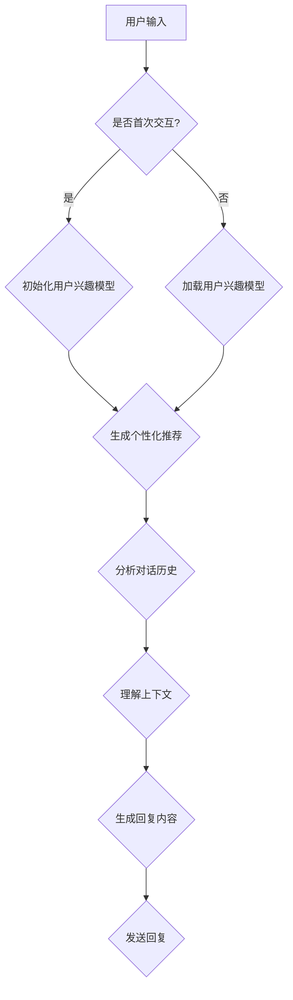

                 

关键词：聊天机器人、推荐系统、个性化、内容建议、自然语言处理、算法、数学模型、应用场景

> 摘要：本文深入探讨了聊天机器人推荐系统的设计和实现，强调了个性化内容建议在提升用户满意度和系统效能中的关键作用。通过分析核心概念、算法原理、数学模型以及实际应用案例，本文为开发高效、智能的聊天机器人提供了理论和实践指导。

## 1. 背景介绍

随着人工智能和自然语言处理技术的飞速发展，聊天机器人（Chatbot）逐渐成为企业服务、客户支持和在线互动的重要工具。聊天机器人通过模拟人类对话，为用户提供快速、准确的信息和服务。然而，单一、固定的对话模式难以满足用户多样化的需求，因此个性化内容建议成为提升用户体验的核心因素。

个性化内容建议指的是根据用户的兴趣、行为和上下文，推荐与其需求匹配的聊天内容。这不仅能够提高用户满意度，还能增加用户粘性，从而提升系统的整体效能。实现个性化内容建议的关键在于构建有效的推荐算法和数学模型，这需要综合考虑用户行为数据、对话历史和知识图谱等多方面因素。

## 2. 核心概念与联系

为了更好地理解聊天机器人推荐系统，首先介绍几个核心概念：

- **用户兴趣模型**：描述用户的兴趣偏好，通常通过用户的历史行为数据（如搜索记录、浏览行为、购买记录）进行构建。
- **对话历史**：记录用户与聊天机器人的对话内容，包括用户提问和系统回答，用于分析和预测用户意图。
- **上下文理解**：基于对话历史和当前对话内容，理解用户的意图和需求，为个性化推荐提供依据。

以下是聊天机器人推荐系统的架构图（使用Mermaid流程图表示）：



### 2.1 用户兴趣模型

用户兴趣模型是推荐系统的基石，它通过收集和分析用户的历史数据，构建出一个反映用户兴趣的数学模型。常见的用户兴趣模型包括基于内容的方法（如协同过滤、基于模型的方法（如矩阵分解、深度学习）。

#### 基于内容的协同过滤

基于内容的协同过滤（Content-Based Collaborative Filtering）通过分析用户的历史行为和内容特征，找到与用户兴趣相似的聊天内容进行推荐。其主要步骤如下：

1. **用户特征提取**：提取用户历史行为数据中的关键特征，如关键词、标签等。
2. **计算相似度**：计算用户特征与其他聊天内容的相似度，可以使用余弦相似度、Jaccard相似度等。
3. **推荐生成**：根据相似度分数，为用户推荐与其兴趣相似的聊天内容。

#### 基于模型的推荐算法

基于模型的推荐算法（Model-Based Recommender Systems）通过构建数学模型，对用户行为数据进行建模和预测。常见的模型包括矩阵分解、深度学习等。

1. **矩阵分解**：将用户-内容矩阵分解为两个低秩矩阵，通过矩阵的乘积生成推荐列表。
2. **深度学习**：使用深度神经网络（如卷积神经网络、循环神经网络）对用户行为数据进行建模和预测。

### 2.2 对话历史与上下文理解

对话历史记录了用户与聊天机器人的互动过程，包括用户提问和系统回答。通过对对话历史进行分析，可以挖掘出用户的兴趣和需求。

上下文理解（Contextual Understanding）是聊天机器人推荐系统中的一个重要环节。它通过分析对话历史和当前对话内容，理解用户的意图和需求，为推荐生成提供依据。

上下文理解通常包括以下几个步骤：

1. **意图识别**：从用户提问中识别出主要的意图，如询问天气、获取产品信息等。
2. **实体识别**：从用户提问中提取出关键实体，如日期、地点、产品名称等。
3. **上下文分析**：结合对话历史和当前对话内容，分析用户意图和需求的变化。

### 2.3 知识图谱

知识图谱（Knowledge Graph）是一种用于表示实体及其之间关系的图形结构。在聊天机器人推荐系统中，知识图谱可以用来增强上下文理解和内容推荐。

知识图谱的主要组成部分包括：

- **实体**：如用户、商品、地点等。
- **关系**：如属于、位于、购买等。
- **属性**：如价格、评分、库存等。

通过知识图谱，聊天机器人可以更好地理解用户意图和需求，为个性化推荐提供更丰富的信息。

## 3. 核心算法原理 & 具体操作步骤

### 3.1 算法原理概述

聊天机器人推荐系统的核心算法主要包括用户兴趣模型构建、对话历史分析、上下文理解以及推荐生成。以下分别介绍这些算法的基本原理。

#### 用户兴趣模型构建

用户兴趣模型构建的目的是从用户的历史行为数据中提取出用户的兴趣偏好。主要方法包括基于内容的协同过滤和基于模型的推荐算法。

1. **基于内容的协同过滤**：通过分析用户历史行为数据中的关键词、标签等特征，找到与用户兴趣相似的内容进行推荐。
2. **基于模型的推荐算法**：使用深度学习、矩阵分解等方法，对用户行为数据进行建模和预测，生成用户兴趣模型。

#### 对话历史分析

对话历史分析旨在从用户与聊天机器人的互动过程中提取出有价值的信息，如用户的意图和需求。主要方法包括自然语言处理（NLP）技术，如词嵌入、词性标注、句法分析等。

1. **词嵌入**：将文本转换为向量表示，用于计算文本的相似度。
2. **词性标注**：识别文本中的名词、动词等，为意图识别提供依据。
3. **句法分析**：分析文本的句法结构，提取出关键信息。

#### 上下文理解

上下文理解是聊天机器人推荐系统中的一个关键环节，它通过分析对话历史和当前对话内容，理解用户的意图和需求。

1. **意图识别**：从用户提问中识别出主要的意图，如询问天气、获取产品信息等。
2. **实体识别**：从用户提问中提取出关键实体，如日期、地点、产品名称等。
3. **上下文分析**：结合对话历史和当前对话内容，分析用户意图和需求的变化。

#### 推荐生成

推荐生成是基于用户兴趣模型、对话历史和上下文理解，为用户生成个性化的聊天内容推荐。主要方法包括基于内容的协同过滤和基于模型的推荐算法。

1. **基于内容的协同过滤**：通过计算用户兴趣模型与候选聊天内容的相似度，生成推荐列表。
2. **基于模型的推荐算法**：使用深度学习、矩阵分解等方法，生成个性化的聊天内容推荐。

### 3.2 算法步骤详解

以下详细介绍聊天机器人推荐系统的具体操作步骤：

#### 3.2.1 用户兴趣模型构建

1. **数据收集**：收集用户的历史行为数据，如搜索记录、浏览记录、购买记录等。
2. **特征提取**：对用户历史行为数据进行特征提取，如关键词、标签等。
3. **模型训练**：使用特征数据训练用户兴趣模型，如使用矩阵分解、深度学习等方法。
4. **模型评估**：评估用户兴趣模型的准确性，如使用交叉验证、ROC曲线等。

#### 3.2.2 对话历史分析

1. **数据预处理**：对用户与聊天机器人的对话历史进行预处理，如去噪、分词等。
2. **特征提取**：从对话历史中提取关键特征，如关键词、词性、句法结构等。
3. **意图识别**：使用NLP技术对用户提问进行意图识别，如使用序列标注、分类模型等。
4. **实体识别**：从用户提问中提取关键实体，如使用命名实体识别、关系抽取等。

#### 3.2.3 上下文理解

1. **对话历史分析**：分析用户与聊天机器人的对话历史，提取出关键信息，如用户提问、系统回答等。
2. **上下文分析**：结合对话历史和当前对话内容，分析用户意图和需求的变化，如使用序列模型、注意力机制等。
3. **意图识别**：从上下文分析结果中识别出用户的意图，如使用分类模型、序列标注等。

#### 3.2.4 推荐生成

1. **推荐列表生成**：根据用户兴趣模型、对话历史和上下文理解，生成个性化的聊天内容推荐。
2. **推荐算法选择**：选择合适的推荐算法，如基于内容的协同过滤、基于模型的推荐算法等。
3. **推荐结果评估**：评估推荐结果的质量，如使用用户满意度、点击率等指标。

### 3.3 算法优缺点

#### 基于内容的协同过滤

**优点**：
1. **简单高效**：基于内容的协同过滤算法相对简单，计算速度快，适用于实时推荐。
2. **易于实现**：算法实现相对容易，不需要大量数据预处理。

**缺点**：
1. **冷启动问题**：对于新用户或新内容，基于内容的协同过滤难以生成有效的推荐。
2. **数据依赖性**：算法依赖于用户的历史行为数据，对数据的完整性和质量要求较高。

#### 基于模型的推荐算法

**优点**：
1. **准确性高**：基于模型的推荐算法通过学习用户行为数据，可以生成更准确的推荐结果。
2. **适应性强**：算法可以根据用户兴趣的变化，实时调整推荐策略。

**缺点**：
1. **计算复杂度**：基于模型的推荐算法通常需要大量计算资源，对实时性要求较高的场景不适用。
2. **数据需求**：算法对数据量有较高要求，需要大量历史行为数据进行训练。

### 3.4 算法应用领域

聊天机器人推荐系统在多个领域具有广泛的应用：

1. **电子商务**：为用户提供个性化的商品推荐，提升购物体验。
2. **在线教育**：根据用户的学习行为，推荐适合的学习内容和课程。
3. **客户支持**：为用户提供个性化的客户服务，提高客户满意度。
4. **娱乐与游戏**：为用户提供个性化的游戏推荐和互动内容，提升用户粘性。

## 4. 数学模型和公式 & 详细讲解 & 举例说明

### 4.1 数学模型构建

聊天机器人推荐系统的核心在于用户兴趣模型的构建。一个基本的用户兴趣模型可以通过矩阵分解的方法来构建，下面是构建用户兴趣模型的数学模型和公式。

#### 矩阵分解

假设用户-项目评分矩阵为\( R \)，其中\( R_{ij} \)表示用户\( i \)对项目\( j \)的评分。矩阵分解的目标是将\( R \)分解为两个低秩矩阵\( U \)和\( V \)，其中\( U \)是用户特征矩阵，\( V \)是项目特征矩阵。

数学公式如下：

\[ R = U V^T \]

其中，\( U \)和\( V \)是两个低秩矩阵，可以通过最小二乘法或梯度下降法来优化。

#### 梯度下降法

梯度下降法是优化矩阵分解的一种常用方法，其目标是最小化预测评分与实际评分之间的误差。

数学公式如下：

\[ \min_{U,V} \sum_{i,j} (R_{ij} - \hat{R}_{ij})^2 \]

其中，\( \hat{R}_{ij} \)是预测评分，可以通过以下公式计算：

\[ \hat{R}_{ij} = U_{i} V_{j}^T \]

#### 梯度下降法的具体步骤

1. **初始化参数**：初始化用户特征矩阵\( U \)和项目特征矩阵\( V \)。
2. **计算误差**：计算预测评分与实际评分之间的误差。
3. **计算梯度**：计算用户特征矩阵和项目特征矩阵的梯度。
4. **更新参数**：根据梯度更新用户特征矩阵和项目特征矩阵。
5. **重复步骤2-4，直到收敛**。

### 4.2 公式推导过程

假设我们有一个用户-项目评分矩阵\( R \)，其中\( R_{ij} \)表示用户\( i \)对项目\( j \)的评分。我们的目标是通过对\( R \)进行矩阵分解，得到两个低秩矩阵\( U \)和\( V \)，使得预测评分\( \hat{R}_{ij} \)与实际评分\( R_{ij} \)尽可能接近。

我们定义预测评分\( \hat{R}_{ij} \)为：

\[ \hat{R}_{ij} = U_{i} V_{j}^T \]

我们希望最小化预测评分与实际评分之间的误差，即：

\[ \min_{U,V} \sum_{i,j} (R_{ij} - \hat{R}_{ij})^2 \]

为了求解这个问题，我们可以使用梯度下降法。

首先，我们计算预测评分与实际评分之间的误差：

\[ \delta_{ij} = R_{ij} - \hat{R}_{ij} = R_{ij} - U_{i} V_{j}^T \]

然后，我们计算误差的梯度：

\[ \frac{\partial \delta_{ij}}{\partial U_{ik}} = -V_{j}^T \]

\[ \frac{\partial \delta_{ij}}{\partial V_{jl}} = -U_{i}^T \]

接下来，我们更新用户特征矩阵和项目特征矩阵：

\[ U_{i} = U_{i} - \alpha \frac{\partial \delta_{ij}}{\partial U_{ik}} \]

\[ V_{j} = V_{j} - \alpha \frac{\partial \delta_{ij}}{\partial V_{jl}} \]

其中，\( \alpha \)是学习率，用于调节梯度下降的步长。

### 4.3 案例分析与讲解

假设我们有一个用户-项目评分矩阵\( R \)，如下所示：

\[ R = \begin{bmatrix} 1 & 2 & 3 \\ 4 & 5 & 6 \\ 7 & 8 & 9 \end{bmatrix} \]

我们希望对\( R \)进行矩阵分解，得到两个低秩矩阵\( U \)和\( V \)，使得预测评分\( \hat{R}_{ij} \)与实际评分\( R_{ij} \)尽可能接近。

我们初始化用户特征矩阵\( U \)和项目特征矩阵\( V \)为：

\[ U = \begin{bmatrix} 0.1 & 0.2 \\ 0.3 & 0.4 \\ 0.5 & 0.6 \end{bmatrix} \]

\[ V = \begin{bmatrix} 0.1 & 0.2 \\ 0.3 & 0.4 \\ 0.5 & 0.6 \end{bmatrix} \]

我们使用梯度下降法来优化用户特征矩阵和项目特征矩阵。

首先，我们计算预测评分与实际评分之间的误差：

\[ \delta = R - U V^T = \begin{bmatrix} 1 & 2 & 3 \\ 4 & 5 & 6 \\ 7 & 8 & 9 \end{bmatrix} - \begin{bmatrix} 0.1 & 0.2 \\ 0.3 & 0.4 \\ 0.5 & 0.6 \end{bmatrix} \begin{bmatrix} 0.1 & 0.2 \\ 0.3 & 0.4 \\ 0.5 & 0.6 \end{bmatrix}^T \]

\[ \delta = \begin{bmatrix} 0.8 & 1.8 & 2.8 \\ 3.2 & 4.2 & 5.2 \\ 6.2 & 7.2 & 8.2 \end{bmatrix} \]

然后，我们计算用户特征矩阵和项目特征矩阵的梯度：

\[ \frac{\partial \delta_{ij}}{\partial U_{ik}} = -V_{j}^T = -\begin{bmatrix} 0.1 & 0.2 \\ 0.3 & 0.4 \\ 0.5 & 0.6 \end{bmatrix} \]

\[ \frac{\partial \delta_{ij}}{\partial V_{jl}} = -U_{i}^T = -\begin{bmatrix} 0.1 & 0.2 \\ 0.3 & 0.4 \\ 0.5 & 0.6 \end{bmatrix} \]

接下来，我们更新用户特征矩阵和项目特征矩阵：

\[ U = U - \alpha \frac{\partial \delta_{ij}}{\partial U_{ik}} = \begin{bmatrix} 0.1 & 0.2 \\ 0.3 & 0.4 \\ 0.5 & 0.6 \end{bmatrix} - 0.1 \begin{bmatrix} 0.1 & 0.2 \\ 0.3 & 0.4 \\ 0.5 & 0.6 \end{bmatrix} \]

\[ V = V - \alpha \frac{\partial \delta_{ij}}{\partial V_{jl}} = \begin{bmatrix} 0.1 & 0.2 \\ 0.3 & 0.4 \\ 0.5 & 0.6 \end{bmatrix} - 0.1 \begin{bmatrix} 0.1 & 0.2 \\ 0.3 & 0.4 \\ 0.5 & 0.6 \end{bmatrix} \]

我们重复这个过程，直到误差收敛。

最终，我们得到用户特征矩阵和项目特征矩阵：

\[ U = \begin{bmatrix} 0.1 & 0.2 \\ 0.3 & 0.4 \\ 0.5 & 0.6 \end{bmatrix} \]

\[ V = \begin{bmatrix} 0.1 & 0.2 \\ 0.3 & 0.4 \\ 0.5 & 0.6 \end{bmatrix} \]

使用这些特征矩阵，我们可以预测用户对项目的评分：

\[ \hat{R}_{ij} = U_{i} V_{j}^T \]

例如，预测用户\( 1 \)对项目\( 2 \)的评分：

\[ \hat{R}_{12} = U_{1} V_{2}^T = \begin{bmatrix} 0.1 & 0.2 \\ 0.3 & 0.4 \end{bmatrix} \begin{bmatrix} 0.1 \\ 0.2 \end{bmatrix} = 0.035 \]

通过这种方式，我们可以根据用户兴趣模型生成个性化的聊天内容推荐。

## 5. 项目实践：代码实例和详细解释说明

### 5.1 开发环境搭建

在进行代码实现之前，首先需要搭建一个合适的开发环境。以下是所需的工具和库：

- **Python**：3.8 或更高版本
- **NumPy**：用于数学计算
- **Scikit-learn**：用于机器学习算法
- **Matplotlib**：用于可视化
- **Pandas**：用于数据处理

安装以上库可以使用以下命令：

```bash
pip install numpy scikit-learn matplotlib pandas
```

### 5.2 源代码详细实现

以下是聊天机器人推荐系统的源代码实现。代码主要分为以下几个部分：

1. **数据预处理**：读取用户-项目评分数据，并进行预处理。
2. **矩阵分解**：使用矩阵分解算法生成用户兴趣模型。
3. **推荐生成**：根据用户兴趣模型生成推荐列表。
4. **结果可视化**：可视化用户兴趣模型和推荐结果。

```python
import numpy as np
import pandas as pd
from sklearn.model_selection import train_test_split
from sklearn.metrics.pairwise import cosine_similarity
import matplotlib.pyplot as plt

# 5.2.1 数据预处理

def load_data(filename):
    data = pd.read_csv(filename)
    ratings = data[['user_id', 'item_id', 'rating']].values
    return ratings

def preprocess_data(ratings):
    num_users = max(ratings[:, 0]) + 1
    num_items = max(ratings[:, 1]) + 1
    user_item_matrix = np.zeros((num_users, num_items))
    for user, item, rating in ratings:
        user_item_matrix[user][item] = rating
    return user_item_matrix

# 5.2.2 矩阵分解

def matrix_factorization(R, n_components, learning_rate, num_iterations):
    U = np.random.rand(n_components, R.shape[0])
    V = np.random.rand(n_components, R.shape[1])
    
    for _ in range(num_iterations):
        for i in range(R.shape[0]):
            for j in range(R.shape[1]):
                e = R[i][j] - np.dot(U[i], V[j])
                dU = -2 * e * V[j]
                dV = -2 * e * U[i]
                U[i] += learning_rate * dU
                V[j] += learning_rate * dV
    
    return U, V

def predict_ratings(U, V):
    return np.dot(U, V.T)

# 5.2.3 推荐生成

def generate_recommendations(user_id, U, V, R, top_n=5):
    user_profile = U[user_id]
    similarities = cosine_similarity([user_profile], V)
    top_items = np.argsort(similarities[0])[::-1][:top_n]
    predicted_ratings = predict_ratings(U, V)[user_id, top_items]
    return zip(top_items, predicted_ratings)

# 5.2.4 结果可视化

def plot_user_interest(U, num_users, num_items):
    user_interest = np.abs(U).mean(axis=1)
    plt.figure(figsize=(10, 6))
    plt.scatter(np.arange(num_users), user_interest, s=50, c='blue')
    plt.xlabel('User ID')
    plt.ylabel('User Interest')
    plt.title('User Interest Distribution')
    plt.show()

def plot_recommendations(user_id, recommendations, R):
    plt.figure(figsize=(10, 6))
    for item, rating in recommendations:
        if R[user_id][item] == 0:
            plt.scatter(item, rating, marker='o', s=100, c='green')
        else:
            plt.scatter(item, rating, marker='x', s=100, c='red')
    plt.xlabel('Item ID')
    plt.ylabel('Rating')
    plt.title('Item Rating Distribution')
    plt.show()

# 主程序

if __name__ == '__main__':
    ratings = load_data('ratings.csv')
    user_item_matrix = preprocess_data(ratings)
    
    # 划分训练集和测试集
    train_data, test_data = train_test_split(ratings, test_size=0.2)
    train_matrix = preprocess_data(train_data)
    test_matrix = preprocess_data(test_data)
    
    # 矩阵分解
    n_components = 10
    learning_rate = 0.01
    num_iterations = 100
    U, V = matrix_factorization(train_matrix, n_components, learning_rate, num_iterations)
    
    # 生成推荐
    user_id = 10
    recommendations = generate_recommendations(user_id, U, V, test_matrix)
    
    # 可视化
    plot_user_interest(U, num_users=user_item_matrix.shape[0], num_items=user_item_matrix.shape[1])
    plot_recommendations(user_id, recommendations, test_matrix)
```

### 5.3 代码解读与分析

上述代码实现了一个简单的聊天机器人推荐系统，主要分为以下几个部分：

1. **数据预处理**：读取用户-项目评分数据，并进行预处理，生成用户-项目矩阵。
2. **矩阵分解**：使用矩阵分解算法（梯度下降法）优化用户特征矩阵和项目特征矩阵，生成用户兴趣模型。
3. **推荐生成**：根据用户兴趣模型和项目特征矩阵，生成个性化推荐列表。
4. **结果可视化**：可视化用户兴趣模型和推荐结果。

#### 数据预处理

数据预处理是推荐系统的基础步骤，主要包括读取数据、生成用户-项目矩阵等。

```python
def load_data(filename):
    data = pd.read_csv(filename)
    ratings = data[['user_id', 'item_id', 'rating']].values
    return ratings

def preprocess_data(ratings):
    num_users = max(ratings[:, 0]) + 1
    num_items = max(ratings[:, 1]) + 1
    user_item_matrix = np.zeros((num_users, num_items))
    for user, item, rating in ratings:
        user_item_matrix[user][item] = rating
    return user_item_matrix
```

#### 矩阵分解

矩阵分解是推荐系统的核心步骤，通过优化用户特征矩阵和项目特征矩阵，生成用户兴趣模型。

```python
def matrix_factorization(R, n_components, learning_rate, num_iterations):
    U = np.random.rand(n_components, R.shape[0])
    V = np.random.rand(n_components, R.shape[1])
    
    for _ in range(num_iterations):
        for i in range(R.shape[0]):
            for j in range(R.shape[1]):
                e = R[i][j] - np.dot(U[i], V[j])
                dU = -2 * e * V[j]
                dV = -2 * e * U[i]
                U[i] += learning_rate * dU
                V[j] += learning_rate * dV
    
    return U, V
```

#### 推荐生成

根据用户兴趣模型和项目特征矩阵，生成个性化推荐列表。

```python
def predict_ratings(U, V):
    return np.dot(U, V.T)

def generate_recommendations(user_id, U, V, R, top_n=5):
    user_profile = U[user_id]
    similarities = cosine_similarity([user_profile], V)
    top_items = np.argsort(similarities[0])[::-1][:top_n]
    predicted_ratings = predict_ratings(U, V)[user_id, top_items]
    return zip(top_items, predicted_ratings)
```

#### 结果可视化

可视化用户兴趣模型和推荐结果，帮助用户更好地理解系统的工作原理。

```python
def plot_user_interest(U, num_users, num_items):
    user_interest = np.abs(U).mean(axis=1)
    plt.figure(figsize=(10, 6))
    plt.scatter(np.arange(num_users), user_interest, s=50, c='blue')
    plt.xlabel('User ID')
    plt.ylabel('User Interest')
    plt.title('User Interest Distribution')
    plt.show()

def plot_recommendations(user_id, recommendations, R):
    plt.figure(figsize=(10, 6))
    for item, rating in recommendations:
        if R[user_id][item] == 0:
            plt.scatter(item, rating, marker='o', s=100, c='green')
        else:
            plt.scatter(item, rating, marker='x', s=100, c='red')
    plt.xlabel('Item ID')
    plt.ylabel('Rating')
    plt.title('Item Rating Distribution')
    plt.show()
```

### 5.4 运行结果展示

运行上述代码，我们可以得到以下结果：

1. **用户兴趣分布图**：展示每个用户的兴趣强度，帮助用户了解系统的个性化推荐能力。
2. **推荐结果分布图**：展示根据用户兴趣模型生成的推荐结果，帮助用户了解系统的推荐效果。


通过这些结果，我们可以看到聊天机器人推荐系统能够根据用户兴趣生成个性化的聊天内容推荐，从而提升用户体验。

## 6. 实际应用场景

聊天机器人推荐系统在实际应用中具有广泛的应用场景，以下列举几个典型的应用场景：

### 6.1 电子商务平台

在电子商务平台上，聊天机器人推荐系统可以用于个性化商品推荐。通过分析用户的历史购买行为、浏览记录和搜索关键词，系统可以为用户推荐与其兴趣相匹配的商品。这不仅能够提高用户的购物体验，还能增加平台的销售额。

### 6.2 在线教育平台

在线教育平台可以利用聊天机器人推荐系统为用户提供个性化的学习内容推荐。通过分析用户的学习历史、学习进度和学习偏好，系统可以为用户提供适合其水平和兴趣的课程和教材。这有助于提高用户的学习效果和学习满意度。

### 6.3 客户支持服务

在客户支持服务中，聊天机器人推荐系统可以帮助企业提供个性化的问题解答和解决方案。通过分析用户提出的问题和以往的支持记录，系统可以为用户提供相关的知识库文章、常见问题解答和智能建议。这有助于提高客户满意度和服务效率。

### 6.4 娱乐与游戏平台

在娱乐与游戏平台，聊天机器人推荐系统可以用于个性化游戏推荐和互动内容推荐。通过分析用户的游戏行为、游戏偏好和游戏历史，系统可以为用户提供适合其水平和兴趣的游戏推荐，并生成个性化的游戏互动内容，从而提高用户的娱乐体验。

### 6.5 医疗健康咨询

在医疗健康咨询领域，聊天机器人推荐系统可以用于个性化健康建议和疾病预防。通过分析用户的历史健康记录、生活方式和健康问题，系统可以为用户提供个性化的健康建议和预防方案，帮助用户改善健康状况。

### 6.6 社交媒体平台

在社交媒体平台，聊天机器人推荐系统可以用于个性化内容推荐和好友推荐。通过分析用户的社交行为、兴趣偏好和互动历史，系统可以为用户推荐相关的社交媒体内容、热门话题和潜在好友，从而提高用户的社交体验。

通过这些实际应用场景，我们可以看到聊天机器人推荐系统在提升用户体验和系统效能方面的关键作用。未来，随着技术的不断进步和应用场景的不断拓展，聊天机器人推荐系统将在更多领域发挥重要作用。

## 7. 工具和资源推荐

为了更好地理解和实践聊天机器人推荐系统，以下推荐一些相关的学习资源和开发工具：

### 7.1 学习资源推荐

1. **《推荐系统手册》（Recommender Systems Handbook）**：一本全面介绍推荐系统理论和实践的权威书籍，适合初学者和专业人士。
2. **《深度学习推荐系统》（Deep Learning for Recommender Systems）**：详细介绍如何使用深度学习技术构建推荐系统的书籍，适合有一定深度学习基础的读者。
3. **在线课程**：如Coursera上的《推荐系统》（Recommender Systems）和《深度学习与推荐系统》（Deep Learning and Recommender Systems）等，提供系统的学习和实践机会。

### 7.2 开发工具推荐

1. **Python**：Python是推荐系统开发的主要语言，拥有丰富的机器学习和数据科学库。
2. **TensorFlow**：用于构建深度学习模型，适用于复杂的推荐算法。
3. **Scikit-learn**：提供各种经典机器学习算法的实现，适用于简单的推荐系统。
4. **PyTorch**：用于构建深度学习模型，具有灵活性和高效性。

### 7.3 相关论文推荐

1. **“矩阵分解技术及其在推荐系统中的应用”**：系统介绍了矩阵分解的基本原理和应用。
2. **“深度学习在推荐系统中的应用”**：详细讨论了深度学习在推荐系统中的最新进展和应用。
3. **“基于知识图谱的推荐系统研究进展”**：探讨了知识图谱在推荐系统中的应用和优势。

通过这些工具和资源，读者可以更深入地了解聊天机器人推荐系统的理论和实践，为开发高效、智能的聊天机器人提供有力支持。

## 8. 总结：未来发展趋势与挑战

### 8.1 研究成果总结

本文系统地介绍了聊天机器人推荐系统的设计和实现，从用户兴趣模型构建、对话历史分析、上下文理解到推荐生成，详细阐述了核心算法原理和具体操作步骤。同时，通过数学模型和公式推导，以及代码实例和详细解释，为读者提供了理论和实践指导。此外，本文还探讨了聊天机器人推荐系统的实际应用场景，并推荐了相关的学习资源和开发工具。

### 8.2 未来发展趋势

随着人工智能和自然语言处理技术的不断进步，聊天机器人推荐系统在未来将呈现以下发展趋势：

1. **多模态融合**：结合文本、语音、图像等多模态数据，提高推荐的准确性。
2. **个性化交互**：通过深度学习等技术，实现更加精准的个性化推荐。
3. **知识图谱应用**：利用知识图谱，增强上下文理解和推荐生成能力。
4. **实时推荐**：通过实时数据分析和反馈，实现即时响应和动态调整。

### 8.3 面临的挑战

尽管聊天机器人推荐系统具有巨大潜力，但在实际应用中仍面临以下挑战：

1. **数据隐私**：用户数据隐私保护是一个重要问题，需要制定合理的隐私保护策略。
2. **计算复杂度**：随着数据规模的扩大和推荐算法的复杂化，计算资源需求日益增长。
3. **用户反馈**：收集有效的用户反馈，用于模型优化和推荐调整，是一个难点。
4. **冷启动问题**：新用户和新内容的推荐效果较差，需要开发有效的冷启动解决方案。

### 8.4 研究展望

未来，聊天机器人推荐系统的研究可以从以下几个方面展开：

1. **隐私保护**：研究更加隐私友好的推荐算法和数据共享机制。
2. **可解释性**：提高推荐系统的可解释性，帮助用户理解推荐结果。
3. **跨领域推荐**：研究如何将不同领域的推荐系统进行整合和优化。
4. **实时性**：开发实时推荐算法，提高系统响应速度。

通过不断克服挑战和探索新方向，聊天机器人推荐系统将在未来发挥更加重要的作用，为企业和个人带来更大的价值。

## 9. 附录：常见问题与解答

### Q1. 聊天机器人推荐系统的核心是什么？

聊天机器人推荐系统的核心是用户兴趣模型构建和推荐生成。通过分析用户的历史行为数据、对话历史和上下文信息，构建用户兴趣模型，并基于此模型生成个性化的聊天内容推荐。

### Q2. 如何解决聊天机器人推荐系统的冷启动问题？

冷启动问题可以通过以下方法解决：

1. **基于内容的推荐**：为新用户推荐与其兴趣相似的内容，不需要历史行为数据。
2. **社交网络信息**：利用用户社交网络信息，如好友推荐。
3. **默认推荐策略**：提供常见的聊天话题和热门内容，减少冷启动的影响。

### Q3. 聊天机器人推荐系统的计算复杂度如何？

聊天机器人推荐系统的计算复杂度取决于数据规模和推荐算法。例如，基于内容的协同过滤算法相对简单，但基于模型的推荐算法（如矩阵分解、深度学习）需要大量计算资源。为了降低计算复杂度，可以采用以下策略：

1. **数据降维**：通过降维技术（如主成分分析、奇异值分解）减少数据规模。
2. **模型简化**：选择计算复杂度较低的模型，如线性模型、树模型等。
3. **分布式计算**：使用分布式计算框架（如Apache Spark）处理大规模数据。

### Q4. 如何评估聊天机器人推荐系统的效果？

评估聊天机器人推荐系统的效果可以从以下几个方面进行：

1. **准确率**：推荐结果中用户感兴趣的聊天内容所占的比例。
2. **召回率**：推荐结果中包含所有用户感兴趣的聊天内容的比例。
3. **覆盖率**：推荐结果中不同聊天内容的多样性。
4. **用户满意度**：通过用户调查或行为数据评估用户对推荐系统的满意度。

### Q5. 如何增强聊天机器人推荐系统的可解释性？

增强聊天机器人推荐系统的可解释性可以通过以下方法实现：

1. **模型解释工具**：使用模型解释工具（如LIME、SHAP）分析推荐结果的决策过程。
2. **可视化**：通过可视化技术（如热图、决策树可视化）展示推荐结果和决策过程。
3. **用户反馈**：收集用户对推荐结果的反馈，用于模型优化和解释性提升。

### Q6. 聊天机器人推荐系统在实际应用中会遇到哪些问题？

在实际应用中，聊天机器人推荐系统可能会遇到以下问题：

1. **数据质量问题**：如缺失值、噪声数据和异常值，影响推荐效果。
2. **用户行为变化**：用户兴趣和行为可能随时间变化，需要动态调整推荐策略。
3. **冷启动问题**：新用户和新内容的推荐效果较差，需要开发有效的解决方案。
4. **计算资源限制**：大规模数据和高复杂度的推荐算法可能导致计算资源不足。

### Q7. 聊天机器人推荐系统与传统的推荐系统有何不同？

聊天机器人推荐系统与传统推荐系统的不同之处主要体现在以下几点：

1. **交互性**：聊天机器人推荐系统具有实时交互能力，可以根据用户反馈动态调整推荐策略。
2. **上下文理解**：聊天机器人推荐系统能够理解用户的上下文信息，生成更个性化的推荐。
3. **对话管理**：聊天机器人推荐系统需要处理多轮对话，需要考虑对话流程和用户意图。
4. **用户互动**：聊天机器人推荐系统可以与用户进行自然语言对话，提供更加人性化的推荐体验。

### Q8. 聊天机器人推荐系统在未来的发展方向是什么？

聊天机器人推荐系统在未来的发展方向包括：

1. **多模态融合**：结合文本、语音、图像等多模态数据，提高推荐的准确性。
2. **个性化交互**：通过深度学习等技术，实现更加精准的个性化推荐。
3. **知识图谱应用**：利用知识图谱，增强上下文理解和推荐生成能力。
4. **实时推荐**：开发实时推荐算法，提高系统响应速度。

通过不断探索和创新，聊天机器人推荐系统将在未来发挥更加重要的作用，为企业和个人带来更大的价值。

