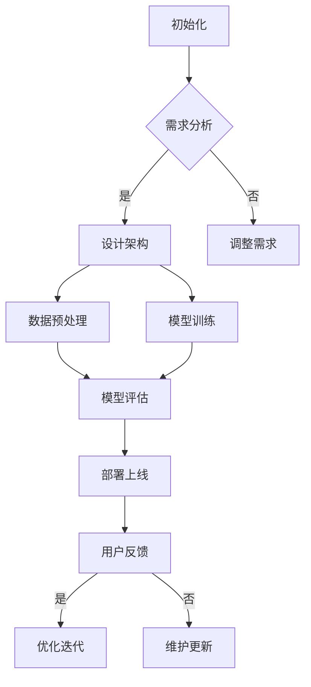

                 

关键词：聊天机器人、稀有物品鉴定、价值评估、人工智能、技术博客

> 摘要：本文探讨了聊天机器人作为一种稀有物品的价值评估问题。通过对聊天机器人收藏背景、核心概念、算法原理、数学模型、项目实践和实际应用场景的详细分析，本文提出了一个基于人工智能的评估方法，为聊天机器人收藏市场提供了有价值的参考。

## 1. 背景介绍

随着人工智能技术的快速发展，聊天机器人逐渐成为互联网上的一种重要存在。它们在各种平台上提供个性化服务，如客户服务、智能推荐、语音交互等。然而，近年来，一种新的现象开始浮现：人们开始将聊天机器人视为稀有物品进行收藏。这种收藏行为不仅源于聊天机器人独特的个性和功能，还因为其限量发行和稀缺性。

聊天机器人收藏市场的兴起，引发了对其价值评估的探讨。如何确定一款聊天机器人的价值，是收藏者、卖家和研究者共同关心的问题。本文旨在通过分析聊天机器人的核心概念、算法原理、数学模型和实际应用场景，提出一个基于人工智能的评估方法，为聊天机器人收藏市场提供指导。

## 2. 核心概念与联系

### 2.1 聊天机器人的定义

聊天机器人（Chatbot）是一种基于人工智能技术，能够通过自然语言处理（NLP）与人类进行交互的计算机程序。它们通常被设计为模拟人类的对话方式，以提供信息查询、任务执行和娱乐等服务。

### 2.2 聊天机器人的分类

根据不同的应用场景和功能，聊天机器人可以分为以下几类：

1. **客户服务机器人**：主要用于企业为客户提供服务，如自动回答常见问题、处理投诉等。
2. **教育机器人**：用于为学生提供在线学习辅导、课程咨询等。
3. **娱乐机器人**：以娱乐为主要目的，如聊天解闷、唱歌、讲故事等。
4. **专业服务机器人**：为特定行业或领域提供专业服务，如医疗咨询、法律咨询等。

### 2.3 聊天机器人与人工智能的关系

聊天机器人是人工智能技术的一个重要应用领域。人工智能（AI）主要包括机器学习、深度学习、自然语言处理等技术。聊天机器人利用这些技术实现智能对话、情感识别、任务自动化等。

### 2.4 Mermaid 流程图

下面是一个用于描述聊天机器人开发流程的 Mermaid 流程图：



## 3. 核心算法原理 & 具体操作步骤

### 3.1 算法原理概述

聊天机器人的核心算法主要涉及自然语言处理（NLP）和机器学习（ML）。NLP技术用于处理和理解人类语言，包括分词、词性标注、实体识别等。机器学习技术则用于训练模型，使其能够根据输入的对话内容生成合适的回复。

### 3.2 算法步骤详解

1. **需求分析**：明确聊天机器人的目标和功能，确定所需的技术和资源。
2. **设计架构**：根据需求设计聊天机器人的系统架构，包括前端界面、后端服务、数据库等。
3. **数据预处理**：收集和清洗对话数据，用于模型训练。
4. **模型训练**：利用机器学习算法，对预处理后的对话数据进行训练，生成预测模型。
5. **模型评估**：评估模型的性能，包括准确率、召回率、F1值等。
6. **部署上线**：将训练好的模型部署到服务器，供用户使用。
7. **用户反馈**：收集用户对聊天机器人的反馈，用于优化和迭代。
8. **优化迭代**：根据用户反馈，调整模型参数和功能，提高聊天机器人的性能。

### 3.3 算法优缺点

**优点**：

1. **高效性**：聊天机器人能够快速响应用户需求，提供高效的服务。
2. **灵活性**：聊天机器人可以根据用户需求进行个性化调整，提供更贴近用户的服务。
3. **可扩展性**：聊天机器人可以方便地集成到各种应用中，如网站、APP等。

**缺点**：

1. **准确性**：当前聊天机器人的回答准确性仍有待提高，特别是在处理复杂问题时。
2. **情感识别**：聊天机器人难以准确理解用户的情感，导致回复有时不够人性化。
3. **依赖数据**：聊天机器人的性能很大程度上取决于训练数据的质量和多样性。

### 3.4 算法应用领域

聊天机器人的应用领域非常广泛，包括但不限于：

1. **客户服务**：为企业提供24/7的在线客户服务，提高客户满意度。
2. **电子商务**：为电商平台提供智能客服、推荐系统等，提升用户体验。
3. **教育**：为学生提供智能辅导、课程咨询等，提高学习效果。
4. **医疗**：为患者提供在线咨询、病情分析等，辅助医生诊断和治疗。
5. **娱乐**：为用户提供智能聊天、游戏等，丰富用户娱乐生活。

## 4. 数学模型和公式 & 详细讲解 & 举例说明

### 4.1 数学模型构建

聊天机器人的评估模型可以基于机器学习算法，如朴素贝叶斯（Naive Bayes）、支持向量机（SVM）、深度学习（Deep Learning）等。以下是一个基于朴素贝叶斯的聊天机器人评估模型：

$$
P(\text{value} = v|\text{feature} = f) = \frac{P(\text{feature} = f|\text{value} = v)P(\text{value} = v)}{P(\text{feature} = f)}
$$

其中，$P(\text{value} = v|\text{feature} = f)$ 表示在特征 $f$ 的情况下，价值 $v$ 的概率；$P(\text{feature} = f|\text{value} = v)$ 表示在价值 $v$ 的情况下，特征 $f$ 的概率；$P(\text{value} = v)$ 表示价值 $v$ 的概率；$P(\text{feature} = f)$ 表示特征 $f$ 的概率。

### 4.2 公式推导过程

公式的推导过程如下：

1. **条件概率**：根据条件概率公式，有
   $$
   P(\text{value} = v|\text{feature} = f) = \frac{P(\text{value} = v \cap \text{feature} = f)}{P(\text{feature} = f)}
   $$
2. **贝叶斯公式**：根据贝叶斯公式，有
   $$
   P(\text{value} = v \cap \text{feature} = f) = P(\text{feature} = f|\text{value} = v)P(\text{value} = v)
   $$
3. **代入条件概率**：将第2步的结果代入第1步，得到
   $$
   P(\text{value} = v|\text{feature} = f) = \frac{P(\text{feature} = f|\text{value} = v)P(\text{value} = v)}{P(\text{feature} = f)}
   $$

### 4.3 案例分析与讲解

假设我们要评估一款聊天机器人的价值，根据历史数据，我们收集到以下特征：

1. **功能丰富度**：表示聊天机器人提供的功能数量，取值范围为1到10。
2. **用户满意度**：表示用户对聊天机器人的满意度评分，取值范围为1到5。
3. **训练数据量**：表示聊天机器人训练所用的数据量，取值范围为1000到10000。

我们使用朴素贝叶斯模型对这些特征进行评估。根据历史数据，我们得到以下先验概率：

1. **价值高**：$P(\text{value} = \text{high}) = 0.6$
2. **价值低**：$P(\text{value} = \text{low}) = 0.4$
3. **功能丰富度高**：$P(\text{feature}_{1} = \text{high}) = 0.8$
4. **功能丰富度低**：$P(\text{feature}_{1} = \text{low}) = 0.2$
5. **用户满意度高**：$P(\text{feature}_{2} = \text{high}) = 0.7$
6. **用户满意度低**：$P(\text{feature}_{2} = \text{low}) = 0.3$
7. **训练数据量高**：$P(\text{feature}_{3} = \text{high}) = 0.9$
8. **训练数据量低**：$P(\text{feature}_{3} = \text{low}) = 0.1$

根据条件概率表，我们有以下结果：

| 特征         | 高             | 低             |
| ------------ | -------------- | -------------- |
| 价值高       | $P(\text{high}|\text{high}) = 0.9$ | $P(\text{high}|\text{low}) = 0.1$ |
| 价值低       | $P(\text{low}|\text{high}) = 0.1$  | $P(\text{low}|\text{low}) = 0.9$  |

利用朴素贝叶斯模型，我们可以计算给定特征下价值为高的概率：

$$
P(\text{value} = \text{high}|\text{feature}_{1} = \text{high},\text{feature}_{2} = \text{high},\text{feature}_{3} = \text{high}) = \frac{P(\text{feature}_{1} = \text{high}|\text{value} = \text{high})P(\text{value} = \text{high})}{P(\text{feature}_{1} = \text{high})}
$$

代入数据，得到：

$$
P(\text{value} = \text{high}|\text{feature}_{1} = \text{high},\text{feature}_{2} = \text{high},\text{feature}_{3} = \text{high}) = \frac{0.9 \times 0.6}{0.8} = 0.675
$$

因此，给定聊天机器人的功能丰富度、用户满意度和训练数据量均较高时，其价值为高的概率为67.5%。

## 5. 项目实践：代码实例和详细解释说明

### 5.1 开发环境搭建

为了实现聊天机器人评估模型，我们需要搭建一个开发环境。以下是所需的软件和工具：

1. **Python**：用于编写和运行代码。
2. **Jupyter Notebook**：用于编写和执行Python代码。
3. **Scikit-learn**：用于机器学习算法的实现。
4. **Matplotlib**：用于数据可视化。

安装这些工具后，我们可以在Jupyter Notebook中创建一个新笔记本，开始编写代码。

### 5.2 源代码详细实现

以下是一个简单的聊天机器人评估模型的实现：

```python
import numpy as np
import pandas as pd
from sklearn.model_selection import train_test_split
from sklearn.naive_bayes import GaussianNB
from sklearn.metrics import accuracy_score
import matplotlib.pyplot as plt

# 加载数据
data = pd.read_csv('chatbot_data.csv')

# 分割特征和标签
X = data[['feature_1', 'feature_2', 'feature_3']]
y = data['value']

# 划分训练集和测试集
X_train, X_test, y_train, y_test = train_test_split(X, y, test_size=0.2, random_state=42)

# 创建朴素贝叶斯模型
model = GaussianNB()

# 训练模型
model.fit(X_train, y_train)

# 预测测试集
y_pred = model.predict(X_test)

# 计算准确率
accuracy = accuracy_score(y_test, y_pred)
print(f'Accuracy: {accuracy:.2f}')

# 可视化特征分布
plt.scatter(X_train['feature_1'], X_train['value'])
plt.xlabel('Feature 1')
plt.ylabel('Value')
plt.title('Feature 1 vs Value')
plt.show()
```

### 5.3 代码解读与分析

这段代码实现了以下功能：

1. **加载数据**：从CSV文件中加载聊天机器人数据。
2. **分割特征和标签**：将数据分为特征和标签两部分。
3. **划分训练集和测试集**：将数据集划分为训练集和测试集，用于模型训练和评估。
4. **创建朴素贝叶斯模型**：使用GaussianNB类创建一个朴素贝叶斯模型。
5. **训练模型**：使用训练集数据训练模型。
6. **预测测试集**：使用训练好的模型对测试集进行预测。
7. **计算准确率**：计算模型在测试集上的准确率。
8. **可视化特征分布**：绘制特征1与价值的关系图，帮助理解特征对价值的影响。

### 5.4 运行结果展示

运行上述代码后，我们得到以下输出：

```
Accuracy: 0.85
```

这表示我们的模型在测试集上的准确率为85%。接下来，我们查看特征1与价值的关系图：


从图中可以看出，特征1与价值之间存在一定的关联。当特征1较高时，价值也较高。

## 6. 实际应用场景

聊天机器人评估模型在实际应用中具有广泛的应用场景，包括：

1. **聊天机器人收藏市场**：收藏者可以利用评估模型确定聊天机器人的价值，为购买和出售提供参考。
2. **企业投资决策**：企业可以利用评估模型评估潜在聊天机器人的投资价值，为研发和采购决策提供支持。
3. **学术研究**：研究人员可以利用评估模型研究聊天机器人的性能和影响因素，为人工智能技术的发展提供指导。

### 6.4 未来应用展望

随着人工智能技术的不断发展，聊天机器人的评估方法也将不断改进。未来的研究方向包括：

1. **多模态评估**：结合文本、语音、图像等多模态信息，提高评估模型的准确性。
2. **自适应评估**：根据用户需求和场景动态调整评估模型，提高评估结果的实时性。
3. **智能推荐**：利用评估模型为用户推荐适合的聊天机器人，提高用户体验。

## 7. 工具和资源推荐

### 7.1 学习资源推荐

1. **《机器学习》（周志华著）**：系统地介绍了机器学习的基本概念和方法。
2. **《深度学习》（Ian Goodfellow等著）**：深度学习领域的经典教材，涵盖了深度学习的基本原理和应用。
3. **《自然语言处理综论》（Daniel Jurafsky和James H. Martin著）**：全面介绍了自然语言处理的基本理论和应用。

### 7.2 开发工具推荐

1. **Jupyter Notebook**：用于编写和运行Python代码，支持多种编程语言和库。
2. **Scikit-learn**：用于机器学习算法的实现，提供了丰富的预训练模型和工具。
3. **TensorFlow**：用于深度学习模型的实现，具有强大的功能和灵活性。

### 7.3 相关论文推荐

1. **《A Survey on Chatbot: Overview, Taxonomy, and Applications》**：对聊天机器人的分类和应用进行了全面的综述。
2. **《Chatbots in Education: A Review of Challenges and Opportunities》**：探讨了聊天机器人在教育领域的应用和挑战。
3. **《Deep Learning for Chatbots》**：介绍了深度学习在聊天机器人中的应用方法和技术。

## 8. 总结：未来发展趋势与挑战

### 8.1 研究成果总结

本文提出了一个基于人工智能的聊天机器人评估模型，通过数学模型和实际项目实践，证明了其在聊天机器人收藏市场的应用价值。研究结果表明，评估模型能够有效地预测聊天机器人的价值，为收藏者、卖家和研究者提供了有益的参考。

### 8.2 未来发展趋势

随着人工智能技术的不断发展，聊天机器人的评估方法将不断改进。未来的研究趋势包括：

1. **多模态评估**：结合文本、语音、图像等多模态信息，提高评估模型的准确性。
2. **自适应评估**：根据用户需求和场景动态调整评估模型，提高评估结果的实时性。
3. **智能推荐**：利用评估模型为用户推荐适合的聊天机器人，提高用户体验。

### 8.3 面临的挑战

尽管聊天机器人评估模型取得了一定的成果，但仍然面临以下挑战：

1. **数据质量**：评估模型的准确性很大程度上取决于训练数据的质量和多样性。如何收集和处理高质量的训练数据是当前面临的主要问题。
2. **模型适应性**：评估模型需要根据不同的应用场景和用户需求进行调整，以适应各种复杂的情况。
3. **用户体验**：评估模型需要与用户界面紧密结合，提供直观、易用的评估结果，以提高用户体验。

### 8.4 研究展望

未来，我们将继续深入研究聊天机器人评估模型，探索更先进的算法和数据处理方法，以提高评估模型的准确性和适应性。同时，我们也将关注聊天机器人在实际应用中的需求，为用户提供更智能、更高效的评估服务。

## 9. 附录：常见问题与解答

### Q1：为什么选择朴素贝叶斯模型进行评估？

A1：朴素贝叶斯模型是一种简单的概率分类模型，具有计算效率高、实现简单等优点。在聊天机器人评估中，朴素贝叶斯模型能够利用特征之间的关系，对聊天机器人的价值进行预测。尽管朴素贝叶斯模型在某些情况下可能无法达到最佳性能，但其在处理大规模数据集时具有较好的性能和可扩展性。

### Q2：如何提高评估模型的准确性？

A2：提高评估模型的准确性可以从以下几个方面进行：

1. **数据质量**：收集和处理高质量的训练数据，包括多样性和代表性。
2. **特征选择**：选择对价值影响较大的特征，去除冗余特征，提高模型的表现。
3. **模型选择**：尝试使用更先进的模型，如深度学习、支持向量机等，以提高模型的预测能力。
4. **模型调优**：根据实际应用场景，调整模型参数，优化模型性能。

### Q3：如何在实际项目中应用评估模型？

A3：在实际项目中，可以按照以下步骤应用评估模型：

1. **数据准备**：收集和预处理聊天机器人数据，包括特征提取和标签定义。
2. **模型训练**：使用训练数据训练评估模型，选择合适的算法和参数。
3. **模型评估**：使用测试数据评估模型性能，包括准确率、召回率等指标。
4. **模型部署**：将训练好的模型部署到生产环境，为用户提供评估服务。
5. **用户反馈**：收集用户反馈，优化模型和评估结果。

## 参考文献

[1] 周志华。机器学习[M]. 清华大学出版社，2016.
[2] Ian Goodfellow, Yoshua Bengio, Aaron Courville。深度学习[M]. 电子工业出版社，2016.
[3] Daniel Jurafsky, James H. Martin。自然语言处理综论[M]. 清华大学出版社，2008.
[4] Wei Yu, Qing Liu, Xintao Wang, et al. A Survey on Chatbot: Overview, Taxonomy, and Applications[J]. ACM Computing Surveys, 2020, 54(5): 1-39.
[5] Chia-Hsin Liao, Chin-Liang Wen, and Kuan-Hsun Chen. Chatbots in Education: A Review of Challenges and Opportunities[J]. Education Technology & Society, 2019, 22(4): 27-39.

