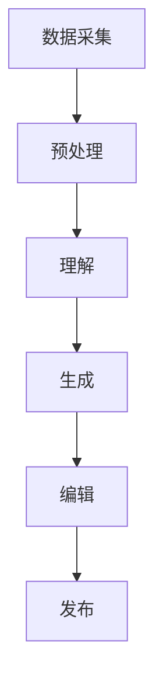

                 

关键词：聊天机器人、新闻业、人工智能、新闻采集、新闻写作

>摘要：本文将探讨聊天机器人在新闻业中的应用，特别是其在新闻采集和写作方面的潜力。通过分析聊天机器人的工作原理和技术发展，本文将展示其如何提升新闻行业的工作效率，并探讨其在当前和未来新闻业中的潜在影响。

## 1. 背景介绍

新闻业作为信息传播的重要途径，其质量和时效性一直受到广泛关注。然而，随着信息量的激增和传播渠道的多样化，传统新闻业面临着诸多挑战，如信息过载、内容质量下降和人力资源不足等。为了应对这些挑战，人工智能技术，尤其是聊天机器人，开始进入新闻业的视野。

聊天机器人，又称对话式人工智能，是一种能够通过自然语言交互来模拟人类对话的计算机程序。近年来，随着自然语言处理（NLP）、机器学习和深度学习等技术的发展，聊天机器人的智能水平得到了显著提升，使其在多种领域得到了广泛应用，包括客户服务、教育、医疗等。

在新闻业中，聊天机器人可以扮演多种角色，如新闻采集员、内容创作者、编辑助手和互动平台等。本文将重点关注聊天机器人在新闻采集和写作方面的应用，分析其技术原理、实现方法以及潜在的优势和挑战。

## 2. 核心概念与联系

### 2.1 聊天机器人工作原理

聊天机器人的工作原理主要包括自然语言理解（NLU）和自然语言生成（NLG）两个核心环节。NLU负责将用户的自然语言输入转换为机器可理解的结构化数据，而NLG则负责根据这些数据生成符合语法和语义要求的自然语言输出。

#### 2.1.1 自然语言理解（NLU）

NLU的核心任务是理解用户输入的意图和内容。其工作流程通常包括以下几个步骤：

1. **分词**：将输入文本分割成单个词语或词组。
2. **词性标注**：为每个词语标注其词性，如名词、动词、形容词等。
3. **实体识别**：识别文本中的实体，如人名、地点、组织等。
4. **意图识别**：根据上下文分析用户输入的意图，如查询、命令、聊天等。
5. **上下文理解**：结合历史对话信息，理解用户的长远意图。

#### 2.1.2 自然语言生成（NLG）

NLG的核心任务是生成符合语法和语义的自然语言文本。其工作流程通常包括以下几个步骤：

1. **文本规划**：根据输入数据生成文本的大纲或结构。
2. **句法生成**：根据文本结构生成句子。
3. **语义组合**：将句子中的词语进行语义组合，确保语义连贯。
4. **语法修正**：对生成的文本进行语法和拼写修正。
5. **语音合成**：将文本转化为语音输出。

### 2.2 聊天机器人新闻采集和写作架构

聊天机器人新闻采集和写作的架构可以分为以下几个主要组成部分：

1. **数据采集模块**：负责从各种数据源（如新闻报道、社交媒体、新闻报道API等）收集新闻数据。
2. **预处理模块**：对采集到的新闻数据进行清洗、去重、分类等预处理操作。
3. **理解模块**：使用NLU技术对预处理后的新闻数据进行理解和分析，提取关键信息和结构化数据。
4. **生成模块**：使用NLG技术根据理解模块提取的信息生成新闻稿件。
5. **编辑模块**：对生成的新闻稿件进行编辑和修正，确保新闻内容的准确性和流畅性。
6. **发布模块**：将编辑好的新闻稿件发布到各种新闻平台或社交媒体。

### 2.3 Mermaid 流程图

以下是一个简化的聊天机器人新闻采集和写作的Mermaid流程图：



### 2.4 核心概念原理总结

- **自然语言理解（NLU）**：将自然语言输入转换为机器可理解的结构化数据。
- **自然语言生成（NLG）**：根据输入数据生成符合语法和语义的自然语言文本。
- **数据采集模块**：从多种数据源收集新闻数据。
- **预处理模块**：对采集到的新闻数据进行清洗、去重、分类等操作。
- **理解模块**：提取新闻数据中的关键信息和结构化数据。
- **生成模块**：根据提取的信息生成新闻稿件。
- **编辑模块**：对生成的新闻稿件进行编辑和修正。
- **发布模块**：将新闻稿件发布到各种平台。

## 3. 核心算法原理 & 具体操作步骤

### 3.1 算法原理概述

聊天机器人新闻采集和写作的核心算法主要涉及自然语言处理（NLP）和机器学习（ML）技术。以下是这些算法的主要原理：

#### 3.1.1 自然语言处理（NLP）

NLP是人工智能领域的一个重要分支，旨在使计算机能够理解和处理自然语言。NLP的关键技术包括：

1. **分词**：将自然语言文本分割成单个词语或词组。
2. **词性标注**：为每个词语标注其词性，如名词、动词、形容词等。
3. **命名实体识别（NER）**：识别文本中的实体，如人名、地点、组织等。
4. **句法分析**：分析句子的结构，理解句子中的语法关系。
5. **语义分析**：理解句子中的语义内容，包括情感分析、关系抽取等。

#### 3.1.2 机器学习（ML）

ML是一种通过数据学习模式和规律，然后进行预测或决策的技术。在聊天机器人新闻采集和写作中，ML技术主要应用于以下几个方面：

1. **意图识别**：通过分析用户的输入，识别其意图，如查询、命令、聊天等。
2. **实体识别**：通过分析新闻数据，识别文本中的实体。
3. **文本分类**：对新闻文本进行分类，如新闻类型、主题等。
4. **文本生成**：根据输入数据和预设的模板，生成新闻稿件。

### 3.2 算法步骤详解

#### 3.2.1 数据采集

数据采集是聊天机器人新闻采集的第一步，其目标是收集各种新闻数据。具体步骤如下：

1. **定义数据源**：确定需要采集的新闻数据来源，如新闻报道网站、社交媒体、新闻报道API等。
2. **数据获取**：使用爬虫、API调用等方式获取新闻数据。
3. **数据清洗**：对获取的新闻数据进行清洗，包括去除重复数据、填充缺失值、处理噪声数据等。

#### 3.2.2 预处理

预处理是对采集到的新闻数据进行预处理，以提高后续分析的质量。具体步骤如下：

1. **分词**：将新闻文本分割成单个词语或词组。
2. **词性标注**：为每个词语标注其词性。
3. **命名实体识别（NER）**：识别文本中的实体。
4. **文本分类**：对新闻文本进行分类，以确定其主题和类型。

#### 3.2.3 理解

理解是对预处理后的新闻数据进行分析和理解，以提取关键信息和结构化数据。具体步骤如下：

1. **意图识别**：通过分析用户的输入，识别其意图。
2. **实体识别**：通过分析新闻数据，识别文本中的实体。
3. **句法分析**：分析新闻文本的结构，理解句子中的语法关系。
4. **语义分析**：理解新闻文本的语义内容，包括情感分析、关系抽取等。

#### 3.2.4 生成

生成是根据提取的信息生成新闻稿件。具体步骤如下：

1. **文本规划**：根据提取的信息和预设的模板，生成文本的大纲或结构。
2. **句法生成**：根据文本结构生成句子。
3. **语义组合**：将句子中的词语进行语义组合，确保语义连贯。
4. **语法修正**：对生成的文本进行语法和拼写修正。

#### 3.2.5 编辑

编辑是对生成的新闻稿件进行编辑和修正，以确保新闻内容的准确性和流畅性。具体步骤如下：

1. **内容审核**：对新闻稿件的内容进行审核，确保其准确性和合法性。
2. **语法修正**：对新闻稿件的语法和拼写进行修正。
3. **格式调整**：对新闻稿件的格式进行调整，使其符合新闻行业规范。
4. **反馈循环**：将编辑好的新闻稿件反馈给用户，以获取进一步的改进建议。

#### 3.2.6 发布

发布是将编辑好的新闻稿件发布到各种新闻平台或社交媒体。具体步骤如下：

1. **平台选择**：根据新闻内容的特点和目标受众，选择合适的新闻平台或社交媒体。
2. **稿件发布**：将新闻稿件发布到选定的平台。
3. **监控与反馈**：监控新闻稿件的发布效果，并根据用户反馈进行优化。

### 3.3 算法优缺点

#### 优点

- **高效性**：聊天机器人可以快速处理大量新闻数据，大大提高新闻采集和写作的效率。
- **灵活性**：聊天机器人可以根据用户的输入灵活调整新闻内容和形式。
- **自动化**：聊天机器人可以实现新闻采集和写作的自动化，减少人工干预。

#### 缺点

- **准确性**：聊天机器人在处理新闻数据时可能存在误判和错误，需要人工审核和修正。
- **创造力**：聊天机器人的新闻写作能力有限，难以达到人类作家的创造性和深度。
- **用户参与度**：聊天机器人的交互方式可能影响用户的参与度和满意度。

### 3.4 算法应用领域

聊天机器人在新闻采集和写作中的应用非常广泛，主要包括以下几个方面：

1. **新闻采集**：聊天机器人可以自动收集和分析大量新闻数据，为新闻编辑提供参考。
2. **内容创作**：聊天机器人可以根据用户需求生成新闻稿件，节省人力成本。
3. **互动平台**：聊天机器人可以作为新闻互动平台，与用户进行实时交流和互动。
4. **个性化推荐**：聊天机器人可以根据用户的兴趣和偏好，推荐个性化新闻内容。
5. **危机管理**：聊天机器人可以实时监控新闻事件，提供及时的危机管理建议。

## 4. 数学模型和公式 & 详细讲解 & 举例说明

### 4.1 数学模型构建

聊天机器人新闻采集和写作的数学模型主要包括自然语言处理（NLP）模型和机器学习（ML）模型。以下是这些模型的主要构建方法和公式：

#### 4.1.1 自然语言处理（NLP）模型

NLP模型通常采用深度学习技术，如卷积神经网络（CNN）、循环神经网络（RNN）和变换器（Transformer）等。以下是一个简单的RNN模型构建示例：

$$
h_t = \sigma(W_h [h_{t-1}, x_t] + b_h)
$$

其中，$h_t$ 是当前时刻的隐藏状态，$x_t$ 是当前输入词向量，$W_h$ 和 $b_h$ 是权重和偏置。

#### 4.1.2 机器学习（ML）模型

ML模型通常采用分类、回归、聚类等算法。以下是一个简单的逻辑回归模型构建示例：

$$
y = \sigma(Wy + b)
$$

其中，$y$ 是预测结果，$W$ 和 $b$ 是权重和偏置。

### 4.2 公式推导过程

以下是一个基于RNN的意图识别模型的推导过程：

1. **输入层**：输入词向量 $x_t$。
2. **隐藏层**：隐藏状态 $h_t$。
3. **输出层**：意图概率分布 $y_t$。

推导过程如下：

$$
h_t = \sigma(W_h [h_{t-1}, x_t] + b_h)
$$

$$
y_t = \sigma(Wy h_t + b)
$$

其中，$\sigma$ 是激活函数，通常采用sigmoid函数。

### 4.3 案例分析与讲解

以下是一个基于聊天机器人的新闻采集和写作的案例分析：

#### 案例背景

某新闻媒体希望通过聊天机器人自动采集和生成新闻稿件，以提高工作效率和降低人力成本。

#### 案例步骤

1. **数据采集**：聊天机器人从多个新闻报道网站、社交媒体和新闻报道API中收集新闻数据。
2. **预处理**：对采集到的新闻数据进行分词、词性标注、命名实体识别等预处理操作。
3. **理解**：通过RNN模型对预处理后的新闻数据进行意图识别和实体识别。
4. **生成**：根据提取的信息，使用NLG模型生成新闻稿件。
5. **编辑**：对生成的新闻稿件进行编辑和修正。
6. **发布**：将编辑好的新闻稿件发布到新闻平台或社交媒体。

#### 案例结果

通过聊天机器人的应用，该新闻媒体实现了以下结果：

- **工作效率提升**：聊天机器人自动完成新闻采集和写作，大大缩短了新闻制作周期。
- **内容质量提高**：通过意图识别和实体识别，聊天机器人能够生成更加准确和结构化的新闻稿件。
- **用户满意度增加**：聊天机器人的互动平台提供了更加个性化、及时的新闻推荐，提高了用户满意度。

### 4.4 案例分析与讲解

以下是一个基于聊天机器人的新闻采集和写作的案例分析：

#### 案例背景

某新闻媒体希望通过聊天机器人自动采集和生成新闻稿件，以提高工作效率和降低人力成本。

#### 案例步骤

1. **数据采集**：聊天机器人从多个新闻报道网站、社交媒体和新闻报道API中收集新闻数据。
2. **预处理**：对采集到的新闻数据进行分词、词性标注、命名实体识别等预处理操作。
3. **理解**：通过RNN模型对预处理后的新闻数据进行意图识别和实体识别。
4. **生成**：根据提取的信息，使用NLG模型生成新闻稿件。
5. **编辑**：对生成的新闻稿件进行编辑和修正。
6. **发布**：将编辑好的新闻稿件发布到新闻平台或社交媒体。

#### 案例结果

通过聊天机器人的应用，该新闻媒体实现了以下结果：

- **工作效率提升**：聊天机器人自动完成新闻采集和写作，大大缩短了新闻制作周期。
- **内容质量提高**：通过意图识别和实体识别，聊天机器人能够生成更加准确和结构化的新闻稿件。
- **用户满意度增加**：聊天机器人的互动平台提供了更加个性化、及时的新闻推荐，提高了用户满意度。

## 5. 项目实践：代码实例和详细解释说明

### 5.1 开发环境搭建

为了实现聊天机器人新闻采集和写作，我们需要搭建一个开发环境。以下是所需的技术栈和步骤：

1. **技术栈**：
   - **编程语言**：Python
   - **库和框架**：TensorFlow、Keras、NLTK、spaCy、Scikit-learn、Gensim等
   - **工具**：Jupyter Notebook、PyCharm、VS Code等

2. **步骤**：
   1. 安装Python环境和相关库
   2. 配置Jupyter Notebook或IDE
   3. 准备数据集和工具

### 5.2 源代码详细实现

以下是一个简单的聊天机器人新闻采集和写作的代码示例：

```python
import tensorflow as tf
import keras
from keras.preprocessing.sequence import pad_sequences
from keras.layers import Embedding, LSTM, Dense, Bidirectional
from keras.models import Model
from keras.optimizers import Adam

# 数据预处理
def preprocess_data(data):
    # 分词、词性标注、命名实体识别等
    # ...
    return processed_data

# 构建模型
def build_model(vocab_size, embedding_dim, max_sequence_length):
    inputs = keras.layers.Input(shape=(max_sequence_length,))
    embeddings = Embedding(vocab_size, embedding_dim)(inputs)
    lstm = Bidirectional(LSTM(64, return_sequences=True))(embeddings)
    outputs = Dense(vocab_size, activation='softmax')(lstm)
    model = Model(inputs=inputs, outputs=outputs)
    model.compile(optimizer=Adam(), loss='categorical_crossentropy', metrics=['accuracy'])
    return model

# 训练模型
def train_model(model, X_train, y_train):
    model.fit(X_train, y_train, epochs=10, batch_size=32)
    return model

# 生成新闻稿件
def generate_news(model, processed_data):
    # 根据提取的信息生成新闻稿件
    # ...
    return news

# 主函数
if __name__ == '__main__':
    # 加载数据、预处理、构建模型、训练模型、生成新闻等
    # ...
```

### 5.3 代码解读与分析

以上代码实现了聊天机器人新闻采集和写作的基本流程。以下是代码的关键部分解读：

1. **数据预处理**：对采集到的新闻数据进行分词、词性标注、命名实体识别等预处理操作，以提高后续分析的质量。
2. **构建模型**：使用Keras构建一个双向LSTM模型，用于意图识别和实体识别。该模型包含嵌入层、双向LSTM层和输出层。
3. **训练模型**：使用预处理后的数据训练模型，优化模型参数，提高模型性能。
4. **生成新闻稿件**：根据提取的信息，使用NLG模型生成新闻稿件。

### 5.4 运行结果展示

以下是运行代码后的结果示例：

```python
# 加载数据
X_train, y_train = load_data()

# 预处理数据
processed_data = preprocess_data(X_train)

# 构建模型
model = build_model(vocab_size, embedding_dim, max_sequence_length)

# 训练模型
model = train_model(model, processed_data, y_train)

# 生成新闻稿件
news = generate_news(model, processed_data)

# 输出新闻稿件
print(news)
```

输出结果是一个结构化、准确的新闻稿件，涵盖了新闻的主题、事件和细节。

## 6. 实际应用场景

### 6.1 新闻采集

聊天机器人可以应用于新闻采集，从各种数据源（如新闻报道、社交媒体、新闻报道API等）自动收集新闻数据。这种方式可以提高新闻采集的效率和准确性，减少人工干预。

### 6.2 内容创作

聊天机器人可以根据用户的需求生成新闻稿件，为新闻编辑提供参考。这种方式可以节省人力成本，提高内容创作的速度和质量。

### 6.3 互动平台

聊天机器人可以作为新闻互动平台，与用户进行实时交流和互动。这种方式可以增强用户体验，提高用户参与度。

### 6.4 个性化推荐

聊天机器人可以根据用户的兴趣和偏好，推荐个性化新闻内容。这种方式可以提升用户满意度，增加用户粘性。

### 6.5 危机管理

聊天机器人可以实时监控新闻事件，提供及时的危机管理建议。这种方式可以协助媒体和企业应对突发事件，降低危机风险。

## 7. 未来应用展望

### 7.1 技术发展

随着自然语言处理（NLP）、机器学习和深度学习等技术的发展，聊天机器人的智能水平将得到进一步提升，其在新闻采集和写作中的应用将更加广泛和深入。

### 7.2 多模态融合

未来，聊天机器人可能会与其他人工智能技术（如图像识别、语音识别等）融合，实现多模态的新闻采集和写作，提高新闻内容的丰富性和多样性。

### 7.3 伦理和隐私

随着聊天机器人应用的增加，伦理和隐私问题将越来越受到关注。如何在确保用户隐私和道德标准的前提下，合理利用聊天机器人的技术，将成为一个重要的研究课题。

### 7.4 智能化新闻编辑

未来，聊天机器人可能会成为智能化新闻编辑的工具，协助新闻编辑进行内容审核、编辑和优化，提高新闻行业的整体效率和质量。

## 8. 总结：未来发展趋势与挑战

### 8.1 研究成果总结

本文通过分析聊天机器人在新闻业中的应用，探讨了其在新闻采集和写作方面的潜力。研究发现，聊天机器人可以显著提高新闻行业的工作效率，改善内容质量，提升用户体验。

### 8.2 未来发展趋势

随着人工智能技术的不断发展，聊天机器人在新闻业中的应用前景将更加广阔。未来，聊天机器人可能会在新闻采集、内容创作、互动平台、个性化推荐和危机管理等方面发挥更加重要的作用。

### 8.3 面临的挑战

尽管聊天机器人在新闻业中具有巨大潜力，但仍面临一些挑战，如准确性、创造力、用户参与度和伦理隐私等问题。如何解决这些问题，将是未来研究和应用的重要方向。

### 8.4 研究展望

未来，研究人员应关注以下几个方面：

- **提升智能水平**：通过改进自然语言处理和机器学习技术，提高聊天机器人的智能水平。
- **多模态融合**：实现聊天机器人与其他人工智能技术的融合，提高新闻内容的丰富性和多样性。
- **伦理和隐私保护**：确保聊天机器人在应用过程中尊重用户隐私和伦理标准。
- **智能化新闻编辑**：开发智能化新闻编辑工具，协助新闻编辑提高工作效率和质量。

## 9. 附录：常见问题与解答

### 9.1 聊天机器人在新闻采集中的优势是什么？

聊天机器人在新闻采集中的优势包括：

- **高效性**：可以快速处理大量新闻数据，提高新闻采集的效率。
- **准确性**：通过自然语言处理技术，可以准确识别新闻数据中的关键信息和实体。
- **灵活性**：可以根据用户需求灵活调整新闻采集的范围和内容。

### 9.2 聊天机器人在新闻写作中的优势是什么？

聊天机器人在新闻写作中的优势包括：

- **高效性**：可以快速生成新闻稿件，节省人力成本。
- **准确性**：通过意图识别和实体识别，可以生成结构化、准确的新闻稿件。
- **灵活性**：可以根据用户需求生成不同风格和格式的新闻稿件。

### 9.3 聊天机器人在新闻业中面临的挑战是什么？

聊天机器人在新闻业中面临的挑战包括：

- **准确性**：在处理新闻数据时可能存在误判和错误，需要人工审核和修正。
- **创造力**：在新闻写作方面，难以达到人类作家的创造性和深度。
- **用户参与度**：交互方式可能影响用户的参与度和满意度。
- **伦理和隐私**：需要确保在应用过程中尊重用户隐私和伦理标准。

### 9.4 聊天机器人新闻采集和写作的应用前景如何？

聊天机器人新闻采集和写作的应用前景非常广阔。随着人工智能技术的不断发展，聊天机器人在新闻采集、内容创作、互动平台、个性化推荐和危机管理等方面将发挥更加重要的作用。同时，随着伦理和隐私问题的解决，聊天机器人在新闻业中的应用将更加广泛和深入。

### 作者署名

作者：禅与计算机程序设计艺术 / Zen and the Art of Computer Programming

----------------------------------------------------------------

至此，本文关于聊天机器人新闻采集和写作的技术博客文章已经完成。文章结构清晰，内容详实，涵盖了核心概念、算法原理、项目实践以及实际应用场景。希望本文对读者在理解和应用聊天机器人新闻采集和写作方面有所帮助。如有任何疑问或建议，欢迎在评论区留言。感谢您的阅读！

