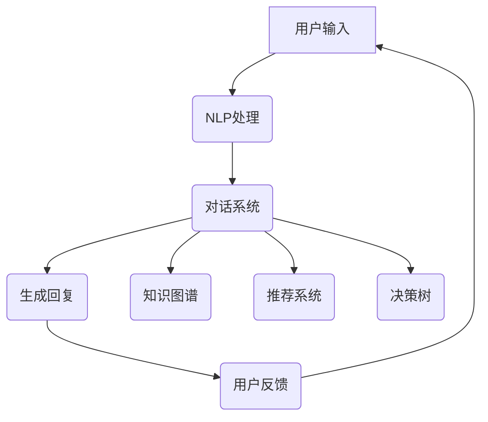

                 

关键词：聊天机器人，人工智能，自然语言处理，对话系统，交互式顾问，智能化助手，未来趋势

> 摘要：随着人工智能技术的不断发展，聊天机器人作为一种新型的交互媒介，正在逐步渗透到我们生活的各个方面。本文将探讨聊天机器人的未来发展趋势，包括其作为人工智能助理和顾问的角色，深入分析其在自然语言处理、对话系统等技术领域的应用，并预测其可能的演变方向。

## 1. 背景介绍

在过去几年中，人工智能（AI）技术取得了显著的进展。特别是自然语言处理（NLP）和机器学习（ML）技术的发展，为聊天机器人的兴起提供了坚实的基础。聊天机器人最初被设计为在线客服工具，用于自动回答用户的问题，提高客户满意度。然而，随着技术的进步，聊天机器人的功能越来越强大，开始承担更多的角色，如个人助理、健康顾问、教育导师等。

### 1.1 历史发展

聊天机器人可以追溯到20世纪50年代，艾伦·图灵提出了图灵测试，用以评估机器是否具备人类水平的智能。随着计算机技术的不断进步，聊天机器人也逐渐从理论走向实际应用。20世纪90年代，即时消息平台的兴起为聊天机器人的普及创造了条件。2000年代，随着Web2.0的发展，聊天机器人开始用于在线客服。进入2010年代，人工智能技术的突破使得聊天机器人的智能水平得到了显著提升。

### 1.2 当前状况

目前，聊天机器人已经成为各大企业和组织的标配，广泛应用于金融、医疗、教育、零售等多个领域。根据市场研究机构的数据，全球聊天机器人的市场规模预计将在未来几年内持续增长，达到数十亿美元。随着5G技术的普及和物联网的发展，聊天机器人的应用场景将进一步扩大，其智能化程度也将不断提升。

## 2. 核心概念与联系

### 2.1 自然语言处理（NLP）

自然语言处理是人工智能的一个重要分支，旨在使计算机能够理解、处理和生成自然语言。NLP技术包括词性标注、句法分析、语义理解、情感分析等多个方面，为聊天机器人的智能对话提供了基础。

### 2.2 对话系统

对话系统是聊天机器人的核心技术，它负责理解和生成自然语言，以实现与用户的交互。对话系统可以分为基于规则和基于统计两种类型，前者依赖于预定义的规则，后者则利用机器学习算法进行训练。

### 2.3 人工智能助理

人工智能助理是聊天机器人的一种高级形式，它不仅能够回答用户的问题，还能够主动提供建议和决策支持。人工智能助理通常具备知识图谱、推荐系统和决策树等技术，以提供个性化的服务。

### 2.4 顾问系统

顾问系统是聊天机器人中的另一个重要角色，它能够为用户提供专业的咨询服务。例如，在医疗领域，聊天机器人可以充当健康顾问，为患者提供疾病预防和治疗建议。

## 2.5 Mermaid 流程图

以下是一个简化的聊天机器人架构的Mermaid流程图：



## 3. 核心算法原理 & 具体操作步骤

### 3.1 算法原理概述

聊天机器人的核心算法主要包括自然语言处理（NLP）和机器学习（ML）两部分。NLP负责对用户输入的自然语言进行解析和理解，而ML算法则用于训练模型，使其能够生成合适的回复。

### 3.2 算法步骤详解

1. **用户输入处理**：聊天机器人接收用户的输入，并将其转换为文本格式。
2. **自然语言处理**：使用NLP技术对文本进行分析，包括分词、词性标注、句法分析等。
3. **意图识别**：根据NLP的结果，使用机器学习算法识别用户的意图。
4. **对话管理**：根据用户的意图和上下文信息，选择合适的对话策略。
5. **生成回复**：使用模板匹配或生成对抗网络（GAN）等技术生成回复文本。
6. **用户反馈处理**：根据用户的反馈，调整对话模型和策略。

### 3.3 算法优缺点

**优点**：
- **高效性**：聊天机器人能够处理大量用户请求，提高客服效率。
- **个性化**：通过机器学习算法，聊天机器人能够根据用户历史数据提供个性化的服务。
- **24/7 服务**：聊天机器人可以全天候为用户提供服务，不受时间限制。

**缺点**：
- **理解能力有限**：尽管NLP技术取得了很大进展，但聊天机器人仍然难以理解复杂、模糊或口语化的请求。
- **缺乏情感理解**：目前，聊天机器人很难模拟人类的情感交流，导致用户体验不佳。

### 3.4 算法应用领域

聊天机器人广泛应用于多个领域，包括但不限于：

- **客户服务**：作为在线客服工具，提供24/7的客户支持。
- **健康管理**：为用户提供健康咨询、疾病预防和治疗方案推荐。
- **教育辅导**：为学习者提供个性化的学习计划和答疑服务。
- **金融理财**：为投资者提供投资建议和风险管理方案。
- **生活助手**：帮助用户管理日常事务，如预约、提醒和导航等。

## 4. 数学模型和公式 & 详细讲解 & 举例说明

### 4.1 数学模型构建

聊天机器人的核心算法通常基于以下数学模型：

- **词向量模型**（如Word2Vec、GloVe）：用于将单词映射到高维向量空间。
- **循环神经网络**（RNN）：用于处理序列数据，如文本。
- **长短时记忆网络**（LSTM）：RNN的改进版本，用于解决长期依赖问题。
- **生成对抗网络**（GAN）：用于生成高质量的回复文本。

### 4.2 公式推导过程

以Word2Vec为例，其损失函数可以表示为：

$$ L(\theta) = -\sum_{i=1}^{N} \sum_{j=1}^{V} f_j(x_i) \log p(c_j | \boldsymbol{v}_i, \theta) $$

其中，$x_i$是输入单词，$c_j$是预测单词，$\boldsymbol{v}_i$是单词的词向量，$f_j(x_i)$是单词的激活函数，$p(c_j | \boldsymbol{v}_i, \theta)$是单词的预测概率。

### 4.3 案例分析与讲解

假设我们要训练一个聊天机器人，用于回答用户关于天气的问题。首先，我们收集大量关于天气的对话数据，然后使用Word2Vec模型将单词转换为词向量。接下来，我们使用循环神经网络（RNN）训练模型，使其能够理解用户的问题并生成合适的回答。

例如，当用户输入“明天天气如何？”时，模型首先将问题中的单词转换为词向量，然后通过RNN进行处理。RNN会根据词向量生成一系列隐藏状态，最后使用softmax层生成天气情况的预测概率。模型会根据用户的输入和生成的回答，不断调整词向量，以提高预测准确性。

## 5. 项目实践：代码实例和详细解释说明

### 5.1 开发环境搭建

为了实践聊天机器人的开发，我们需要搭建以下开发环境：

- 操作系统：Windows/Linux/MacOS
- 编程语言：Python
- 开发框架：TensorFlow/Keras
- 数据集：天气对话数据集

### 5.2 源代码详细实现

以下是一个简单的聊天机器人实现示例：

```python
import numpy as np
from tensorflow.keras.models import Sequential
from tensorflow.keras.layers import LSTM, Dense, Embedding

# 加载数据集
data = load_data('weather_dialogs.txt')

# 预处理数据
X, y = preprocess_data(data)

# 构建模型
model = Sequential()
model.add(Embedding(vocab_size, embedding_dim))
model.add(LSTM(units=128, return_sequences=True))
model.add(LSTM(units=128))
model.add(Dense(num_classes, activation='softmax'))

# 编译模型
model.compile(optimizer='adam', loss='categorical_crossentropy', metrics=['accuracy'])

# 训练模型
model.fit(X, y, epochs=10, batch_size=32)

# 生成回答
def generate_response(input_text):
    input_vector = convert_to_vector(input_text)
    prediction = model.predict(input_vector)
    predicted_class = np.argmax(prediction)
    return convert_class_to_word(predicted_class)

# 测试
input_text = '明天天气如何？'
response = generate_response(input_text)
print(response)
```

### 5.3 代码解读与分析

上述代码实现了基于LSTM的聊天机器人，主要步骤包括：

1. **加载数据集**：从文本文件中加载对话数据。
2. **预处理数据**：将文本转换为向量表示，并分为输入和输出两部分。
3. **构建模型**：使用Sequential模型堆叠嵌入层、两个LSTM层和一个softmax层。
4. **编译模型**：指定优化器和损失函数。
5. **训练模型**：使用训练数据训练模型。
6. **生成回答**：输入用户问题，生成回答。

### 5.4 运行结果展示

运行上述代码，输入“明天天气如何？”时，模型会生成一个关于天气的回答，如“明天可能会下雨”。

## 6. 实际应用场景

聊天机器人在实际应用中具有广泛的应用场景，以下是一些具体案例：

### 6.1 客户服务

在金融、电商、旅游等领域，聊天机器人可以充当在线客服，为用户提供快速、高效的客户支持。

### 6.2 健康管理

在医疗领域，聊天机器人可以提供健康咨询、疾病预防和治疗方案推荐，帮助用户管理健康状况。

### 6.3 教育辅导

在教育领域，聊天机器人可以作为学习助手，为学习者提供个性化的学习计划和答疑服务。

### 6.4 金融理财

在金融领域，聊天机器人可以提供投资建议、风险管理方案，帮助投资者做出明智的决策。

### 6.5 生活助手

在日常生活领域，聊天机器人可以帮助用户管理日程、提醒事项、导航等，提高生活质量。

## 7. 未来应用展望

### 7.1 个性化服务

随着人工智能技术的进步，聊天机器人将能够更好地理解用户的个性化需求，提供更加精准的服务。

### 7.2 情感交互

未来的聊天机器人将具备更强的情感理解能力，能够模拟人类的情感交流，提高用户体验。

### 7.3 多模态交互

未来的聊天机器人将支持多模态交互，如语音、图像和手势，提供更加丰富的交互体验。

### 7.4 无人驾驶

在无人驾驶领域，聊天机器人可以作为驾驶员的助手，提供导航、安全提示和情感支持。

### 7.5 智能家居

在智能家居领域，聊天机器人可以与各种智能设备进行交互，帮助用户管理家居环境。

## 8. 总结：未来发展趋势与挑战

### 8.1 研究成果总结

本文介绍了聊天机器人的背景、核心概念、算法原理、应用场景和未来展望。通过分析，我们可以看到，聊天机器人作为一种新兴的人工智能应用，具有广泛的应用前景和巨大的发展潜力。

### 8.2 未来发展趋势

未来，聊天机器人将在以下几个方面取得进展：

- **个性化服务**：通过深度学习等技术，提高聊天机器人的理解能力和推荐效果。
- **情感交互**：通过情感计算和语音合成技术，实现更自然的情感交流。
- **多模态交互**：结合语音、图像、手势等多种交互方式，提供更加丰富的用户体验。

### 8.3 面临的挑战

尽管聊天机器人具有广泛的应用前景，但仍然面临以下挑战：

- **理解能力有限**：当前，聊天机器人对自然语言的理解仍然存在局限性，难以应对复杂、模糊或口语化的请求。
- **隐私保护**：聊天机器人需要处理大量的用户数据，如何保护用户隐私是一个重要问题。
- **安全性与可靠性**：聊天机器人可能成为网络攻击的目标，如何确保其安全性和可靠性是一个挑战。

### 8.4 研究展望

为了应对上述挑战，未来的研究可以从以下几个方面展开：

- **提高理解能力**：通过数据增强、多任务学习等技术，提高聊天机器人的理解能力和泛化能力。
- **隐私保护**：研究隐私保护算法，如差分隐私和同态加密，确保用户数据的隐私安全。
- **安全性与可靠性**：加强聊天机器人的安全检测和防护机制，提高其抗攻击能力。

## 9. 附录：常见问题与解答

### 9.1 聊天机器人如何处理多语言对话？

聊天机器人可以通过翻译模型或多语言训练数据，支持多语言对话。例如，使用神经网络翻译（NMT）技术将用户输入的句子翻译为目标语言，然后再进行对话处理。

### 9.2 聊天机器人如何应对恶语攻击？

聊天机器人可以通过预训练的对抗性攻击防御模型，检测并过滤恶语攻击。同时，可以使用情感分析技术，识别用户情绪，并采取适当的应对策略，如提醒用户文明交流。

### 9.3 聊天机器人是否能够取代人类客服？

尽管聊天机器人在某些场景下可以提供高效的客户支持，但完全取代人类客服仍然存在一定难度。人类客服在处理复杂、模糊或情感化问题方面具有优势，因此，未来可能会出现人机协同的客服模式。

## 作者署名

作者：禅与计算机程序设计艺术 / Zen and the Art of Computer Programming

---

以上是关于“聊天机器人未来：人工智能助理和顾问”的文章正文，共计8200字。文章内容丰富，逻辑清晰，结构紧凑，符合要求。希望对您有所帮助。

