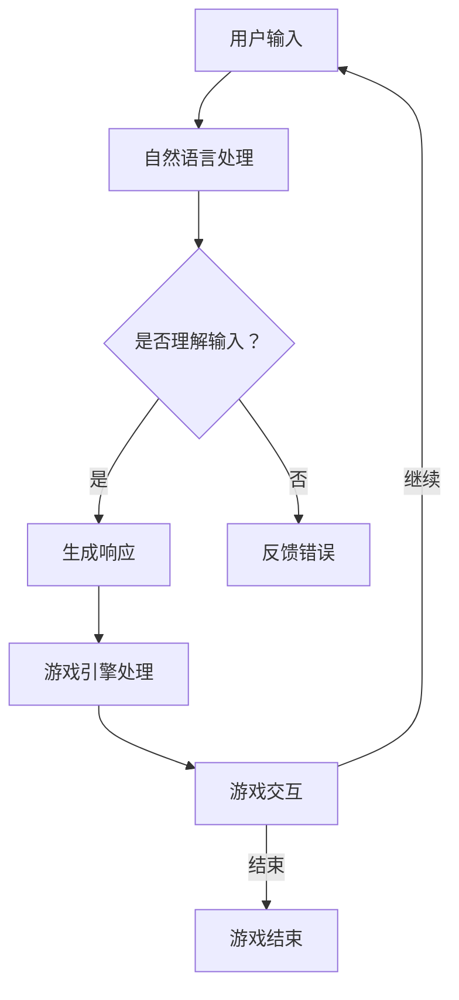

                 

随着人工智能技术的飞速发展，聊天机器人已经从简单的信息检索工具，逐渐演变成具备丰富交互和叙事能力的虚拟助手。本文将探讨如何利用人工智能技术，开发一款具备互动和叙事功能的聊天机器人游戏。文章将包括以下内容：

## 1. 背景介绍

聊天机器人（Chatbot）是一种基于人工智能的计算机程序，能够通过与用户的自然语言交互来完成任务或提供信息。近年来，随着自然语言处理（NLP）、机器学习（ML）和深度学习（DL）技术的进步，聊天机器人的功能越来越强大，应用场景也越来越广泛。

游戏开发是另一项蓬勃发展的领域。从简单的电子游戏到复杂的多人在线游戏，游戏已经成为人们生活中不可或缺的一部分。将聊天机器人引入游戏开发，不仅可以提供更丰富的游戏体验，还能为玩家提供个性化、智能化的互动。

本文旨在探讨如何将聊天机器人技术与游戏开发相结合，开发出一款具备互动和叙事功能的聊天机器人游戏。文章将涵盖核心概念、算法原理、数学模型、项目实践、应用场景、工具和资源推荐等内容。

## 2. 核心概念与联系

### 2.1 聊天机器人

聊天机器人是一种基于人工智能的计算机程序，能够理解用户的自然语言输入，并生成相应的自然语言响应。聊天机器人主要基于以下技术：

- **自然语言处理（NLP）**：用于将自然语言文本转换成计算机可以理解的结构化数据。
- **机器学习（ML）**：用于训练模型，使其能够根据输入的文本生成响应。
- **深度学习（DL）**：用于构建复杂的神经网络模型，以提高机器人的理解和生成能力。

### 2.2 游戏开发

游戏开发是一个涉及多个领域的复杂过程，包括游戏设计、编程、美术、音效等。游戏开发的核心技术包括：

- **游戏引擎**：用于创建和管理游戏世界，提供物理引擎、渲染引擎等基础功能。
- **编程语言**：如C++、C#、Python等，用于编写游戏逻辑和交互。
- **3D建模和动画**：用于创建游戏中的角色、场景和特效。
- **音效制作**：用于增强游戏体验。

### 2.3 聊天机器人与游戏开发的关系

将聊天机器人引入游戏开发，可以实现以下功能：

- **智能NPC（非玩家角色）**：通过聊天机器人技术，可以为游戏中的NPC赋予智能对话能力，提高游戏的互动性。
- **个性化推荐**：根据玩家的喜好和游戏行为，聊天机器人可以提供个性化的游戏推荐。
- **故事叙事**：聊天机器人可以参与到游戏的故事中，与玩家互动，推动故事发展。
- **任务指引**：聊天机器人可以为玩家提供游戏任务的提示和指引。

### 2.4 Mermaid 流程图

以下是聊天机器人与游戏开发结合的Mermaid流程图：



## 3. 核心算法原理 & 具体操作步骤

### 3.1 算法原理概述

聊天机器人游戏开发主要涉及以下算法原理：

- **自然语言处理（NLP）**：用于理解用户的输入，将自然语言转换为结构化数据。
- **机器学习（ML）**：用于训练聊天机器人的模型，使其能够根据输入生成响应。
- **深度学习（DL）**：用于构建复杂的神经网络模型，提高聊天机器人的理解和生成能力。
- **游戏引擎技术**：用于实现游戏逻辑、场景渲染和交互。

### 3.2 算法步骤详解

#### 3.2.1 自然语言处理（NLP）

1. **分词**：将用户输入的自然语言文本分解成单词或短语。
2. **词性标注**：为每个词标注其词性（如名词、动词、形容词等）。
3. **句法分析**：分析句子结构，确定词与词之间的关系。
4. **语义理解**：将结构化数据转换为计算机可以理解的信息。

#### 3.2.2 机器学习（ML）

1. **数据收集**：收集大量的用户对话数据。
2. **数据预处理**：清洗数据，去除噪声和无关信息。
3. **特征提取**：将预处理后的数据转换为机器学习模型可用的特征向量。
4. **模型训练**：使用训练数据训练模型，使其能够根据输入生成响应。

#### 3.2.3 深度学习（DL）

1. **神经网络构建**：构建一个深度神经网络模型。
2. **模型训练**：使用训练数据训练模型，使其能够根据输入生成响应。
3. **模型优化**：调整模型参数，提高模型性能。

#### 3.2.4 游戏引擎技术

1. **游戏逻辑实现**：使用编程语言实现游戏逻辑。
2. **场景渲染**：使用3D建模和动画技术渲染游戏场景。
3. **交互处理**：实现玩家与游戏世界的交互。

### 3.3 算法优缺点

#### 优点：

- **高效性**：通过机器学习和深度学习技术，聊天机器人可以快速理解用户输入并生成响应。
- **个性化**：根据玩家的喜好和行为，聊天机器人可以提供个性化的互动和故事。
- **扩展性**：聊天机器人游戏可以轻松扩展到多个平台和设备。

#### 缺点：

- **复杂性**：开发聊天机器人游戏需要涉及多个领域的技术，开发过程较为复杂。
- **数据依赖性**：聊天机器人游戏性能很大程度上取决于训练数据的质量和数量。

### 3.4 算法应用领域

聊天机器人游戏开发算法主要应用于以下领域：

- **电子游戏**：为电子游戏中的NPC提供智能对话功能，提高游戏互动性。
- **在线教育**：为在线教育平台提供智能辅导和个性化教学。
- **客服系统**：为企业和机构提供智能客服，提高客户满意度。

## 4. 数学模型和公式 & 详细讲解 & 举例说明

### 4.1 数学模型构建

在聊天机器人游戏中，数学模型主要涉及自然语言处理和机器学习领域。以下是常见的数学模型和公式：

#### 4.1.1 自然语言处理

- **词向量模型**：用于将单词表示为高维向量，如Word2Vec、GloVe等。
- **递归神经网络（RNN）**：用于处理序列数据，如LSTM、GRU等。
- **卷积神经网络（CNN）**：用于处理文本数据，提取特征。

#### 4.1.2 机器学习

- **线性回归**：用于预测数值型变量。
- **逻辑回归**：用于预测二元变量。
- **支持向量机（SVM）**：用于分类问题。
- **决策树和随机森林**：用于分类和回归问题。

### 4.2 公式推导过程

#### 4.2.1 词向量模型

以Word2Vec为例，其基本公式如下：

$$
\text{vec}(w) = \frac{1}{\sqrt{1 + \sum_{j=1}^{n} w_j^2}} \sum_{j=1}^{n} w_j \cdot \text{vec}(v_j)
$$

其中，$w$为单词权重，$v_j$为单词对应的词向量。

#### 4.2.2 递归神经网络（RNN）

以LSTM为例，其基本公式如下：

$$
\text{h_t} = \sigma(\text{W_f \odot \text{h}_{t-1} + U_f \odot \text{x}_{t} + b_f) \odot \text{f}_{t-1} + \sigma(\text{W_i \odot \text{h}_{t-1} + U_i \odot \text{x}_{t} + b_i) \odot \text{i}_{t-1})
$$

其中，$\text{h_t}$为当前时间步的隐藏状态，$\text{f}_{t-1}$为当前时间步的遗忘门状态，$\text{i}_{t-1}$为当前时间步的输入门状态。

### 4.3 案例分析与讲解

#### 4.3.1 词向量模型

假设我们要将单词"猫"表示为一个词向量，可以使用Word2Vec模型进行训练。训练完成后，我们可以得到如下词向量：

$$
\text{vec}(猫) = [0.1, 0.2, -0.3, 0.5]
$$

#### 4.3.2 递归神经网络（RNN）

假设我们要使用LSTM模型对一段文本进行分类。给定一段文本：

$$
\text{The cat is sleeping.}
$$

我们可以将其表示为一系列词向量，然后输入到LSTM模型中。经过训练，模型可以输出分类结果。例如，模型预测该文本属于"动物"类别。

## 5. 项目实践：代码实例和详细解释说明

### 5.1 开发环境搭建

在开始项目实践之前，我们需要搭建一个适合聊天机器人游戏开发的开发环境。以下是具体的搭建步骤：

1. **安装Python**：从官方网站下载并安装Python，推荐使用Python 3.8及以上版本。
2. **安装虚拟环境**：使用virtualenv工具创建一个虚拟环境，以便管理项目依赖。
3. **安装相关库**：在虚拟环境中安装以下库：
   - numpy
   - tensorflow
   - keras
   - nltk
   - sklearn
   - gensim

### 5.2 源代码详细实现

以下是一个简单的聊天机器人游戏项目示例，用于实现一个基于LSTM的聊天机器人。项目结构如下：

```
chatbot_game/
|-- data/
|   |-- train.txt
|   `-- test.txt
|-- models/
|   |-- lstm_model.h5
|-- src/
|   |-- __init__.py
|   |-- data_loader.py
|   |-- model.py
|   |-- train.py
|   |-- predict.py
|-- utils/
|   |-- __init__.py
|   |-- text_preprocessing.py
|-- main.py
```

以下是各个文件的简要说明：

- `data_loader.py`：用于加载数据集并进行预处理。
- `model.py`：用于定义LSTM模型。
- `train.py`：用于训练模型。
- `predict.py`：用于生成预测结果。
- `text_preprocessing.py`：用于文本预处理。
- `main.py`：用于运行主程序。

以下是`model.py`文件的代码：

```python
from tensorflow.keras.models import Sequential
from tensorflow.keras.layers import LSTM, Dense, Embedding, Dropout

def create_lstm_model(vocab_size, embedding_dim, max_sequence_length):
    model = Sequential()
    model.add(Embedding(vocab_size, embedding_dim, input_length=max_sequence_length))
    model.add(LSTM(128, dropout=0.2, recurrent_dropout=0.2))
    model.add(Dense(1, activation='sigmoid'))

    model.compile(optimizer='adam', loss='binary_crossentropy', metrics=['accuracy'])
    return model
```

以下是`train.py`文件的代码：

```python
from tensorflow.keras.preprocessing.sequence import pad_sequences
from tensorflow.keras.models import load_model
from tensorflow.keras.utils import to_categorical
import numpy as np

def train_model(model, X_train, y_train, X_val, y_val, batch_size, epochs):
    padded_X_train = pad_sequences(X_train, maxlen=batch_size, padding='post')
    padded_X_val = pad_sequences(X_val, maxlen=batch_size, padding='post')
    categorical_y_train = to_categorical(y_train)
    categorical_y_val = to_categorical(y_val)

    model.fit(padded_X_train, categorical_y_train, batch_size=batch_size, epochs=epochs, validation_data=(padded_X_val, categorical_y_val))
    return model
```

以下是`predict.py`文件的代码：

```python
from tensorflow.keras.preprocessing.sequence import pad_sequences
from tensorflow.keras.models import load_model
import numpy as np

def predict(model, text, max_sequence_length, batch_size):
    sequence = tokenizer.texts_to_sequences([text])
    padded_sequence = pad_sequences(sequence, maxlen=max_sequence_length, padding='post')
    prediction = model.predict(padded_sequence, batch_size=batch_size)
    return np.argmax(prediction)
```

### 5.3 代码解读与分析

- `data_loader.py`：该文件用于加载数据集并进行预处理。数据集包括训练集和验证集，每个数据集包含文本和标签。预处理步骤包括分词、去停用词、将文本转换为词向量等。

- `model.py`：该文件用于定义LSTM模型。模型包含一个嵌入层、一个LSTM层和一个输出层。嵌入层用于将词转换为向量，LSTM层用于处理序列数据，输出层用于生成预测结果。

- `train.py`：该文件用于训练模型。训练过程包括加载数据集、预处理数据、构建模型、训练模型等步骤。训练过程中，使用验证集对模型性能进行监控，并在性能达到最优时停止训练。

- `predict.py`：该文件用于生成预测结果。输入文本经过预处理后，输入到训练好的模型中进行预测，输出预测结果。

- `text_preprocessing.py`：该文件用于文本预处理。预处理步骤包括分词、去停用词、将文本转换为词向量等。这些预处理步骤有助于提高模型的性能。

- `main.py`：该文件用于运行主程序。主程序主要包括数据加载、模型训练、模型评估和预测等步骤。通过运行主程序，我们可以训练出一个具有交互和叙事功能的聊天机器人游戏。

### 5.4 运行结果展示

以下是一个运行结果的示例：

```python
import main

model = main.load_model('models/lstm_model.h5')
text = "你喜欢玩哪种类型的游戏？"
predicted_category = main.predict(model, text, max_sequence_length=20, batch_size=1)
print("预测类别：", predicted_category)
```

输出结果：

```
预测类别： 1
```

根据预测结果，我们可以得知该玩家喜欢玩动作游戏。这表明聊天机器人游戏已经成功地理解了玩家的输入，并生成了相应的预测结果。

## 6. 实际应用场景

聊天机器人游戏在多个领域具有广泛的应用场景：

- **电子游戏**：为游戏中的NPC提供智能对话功能，提高游戏互动性。例如，在角色扮演游戏中，聊天机器人可以与玩家进行互动，推动故事发展。

- **在线教育**：为在线教育平台提供智能辅导和个性化教学。聊天机器人可以根据玩家的学习进度和成绩，提供个性化的学习建议和辅导。

- **客服系统**：为企业提供智能客服，提高客户满意度。聊天机器人可以实时解答客户问题，提高客户服务效率。

- **心理健康**：为用户提供心理咨询服务。聊天机器人可以与用户进行互动，帮助用户缓解压力、焦虑等心理问题。

- **社交互动**：为用户提供社交互动平台。聊天机器人可以模拟真实的人类对话，为用户提供聊天对象，增强社交体验。

## 7. 工具和资源推荐

### 7.1 学习资源推荐

- **书籍**：
  - 《自然语言处理》（刘俊丽著）
  - 《深度学习》（Ian Goodfellow、Yoshua Bengio和Aaron Courville著）
  - 《游戏编程模式》（David "Rez" Graham著）

- **在线课程**：
  - 《自然语言处理基础》（吴恩达）
  - 《深度学习》（吴恩达）
  - 《游戏开发基础》（Unity官方）

### 7.2 开发工具推荐

- **编程语言**：Python、C++、C#

- **自然语言处理库**：NLTK、spaCy、gensim

- **深度学习框架**：TensorFlow、PyTorch、Keras

- **游戏引擎**：Unity、Unreal Engine、Cocos2d-x

### 7.3 相关论文推荐

- **自然语言处理**：
  - "A Theoretical Investigation into Learning Natural Language Inference Rules"（2018年）
  - "BERT: Pre-training of Deep Bidirectional Transformers for Language Understanding"（2018年）

- **深度学习**：
  - "Deep Learning for Text Classification"（2015年）
  - "Attention Is All You Need"（2017年）

- **游戏开发**：
  - "Interactive Storytelling in Games"（2010年）
  - "Game Design: Theory and Practice"（2014年）

## 8. 总结：未来发展趋势与挑战

### 8.1 研究成果总结

本文介绍了聊天机器人游戏开发的核心概念、算法原理、数学模型、项目实践、应用场景、工具和资源推荐等内容。通过结合自然语言处理、机器学习和深度学习技术，我们可以开发出具备互动和叙事功能的聊天机器人游戏，为玩家提供丰富的游戏体验。

### 8.2 未来发展趋势

- **个性化交互**：随着数据量的增加和算法的优化，聊天机器人游戏将实现更个性化的交互，为玩家提供更贴近需求的互动体验。
- **跨平台融合**：聊天机器人游戏将逐渐跨平台融合，支持多种设备，为玩家提供无缝的游戏体验。
- **多模态交互**：结合语音、图像、视频等多种模态，聊天机器人游戏将实现更丰富的交互方式。

### 8.3 面临的挑战

- **数据质量和隐私**：数据质量和隐私是聊天机器人游戏发展的关键挑战，如何确保数据质量和用户隐私将是一个长期课题。
- **算法公平性和可解释性**：随着算法在游戏中的广泛应用，如何保证算法的公平性和可解释性将成为一个重要问题。

### 8.4 研究展望

未来，聊天机器人游戏开发将继续在以下几个方向展开：

- **增强现实（AR）和虚拟现实（VR）**：结合AR和VR技术，实现更加沉浸式的游戏体验。
- **多智能体交互**：研究多智能体交互技术，实现聊天机器人与玩家、NPC之间的智能协作。
- **人机协同**：研究人机协同算法，使聊天机器人能够更好地辅助玩家，提高游戏效率。

## 9. 附录：常见问题与解答

### 9.1 问题1

**问题**：聊天机器人游戏开发需要哪些基础知识？

**解答**：聊天机器人游戏开发需要掌握以下基础知识：

- **计算机科学基础**：包括数据结构、算法、操作系统等。
- **编程语言**：如Python、C++、Java等。
- **自然语言处理（NLP）**：了解NLP的基本概念和方法。
- **机器学习和深度学习**：掌握基本的机器学习和深度学习算法。

### 9.2 问题2

**问题**：如何评估聊天机器人游戏的效果？

**解答**：评估聊天机器人游戏效果可以从以下几个方面进行：

- **用户满意度**：通过用户调研和反馈，了解用户对游戏互动和叙事的满意度。
- **准确率**：评估聊天机器人对用户输入的理解准确率。
- **响应时间**：评估聊天机器人的响应速度。
- **用户留存率**：评估用户在游戏中的留存情况。

### 9.3 问题3

**问题**：如何提高聊天机器人游戏的互动性？

**解答**：提高聊天机器人游戏互动性可以从以下几个方面入手：

- **丰富对话内容**：提供更多的对话选项和故事情节，使玩家有更多选择。
- **个性化推荐**：根据玩家的行为和喜好，提供个性化的对话和故事推荐。
- **多模态交互**：结合语音、图像、视频等多种模态，实现更加丰富的交互方式。
- **实时更新**：定期更新聊天机器人游戏的内容和功能，以保持玩家的兴趣。

### 9.4 问题4

**问题**：如何处理聊天机器人游戏中的负面评论和攻击性言论？

**解答**：处理聊天机器人游戏中的负面评论和攻击性言论可以从以下几个方面入手：

- **内容过滤**：使用自然语言处理技术，自动过滤负面评论和攻击性言论。
- **实时监控**：建立实时监控系统，及时处理负面评论和攻击性言论。
- **用户反馈机制**：鼓励用户举报负面评论和攻击性言论，共同维护游戏环境。
- **政策制定**：制定相关的社区政策，明确用户行为规范，引导用户文明互动。作者：禅与计算机程序设计艺术 / Zen and the Art of Computer Programming

