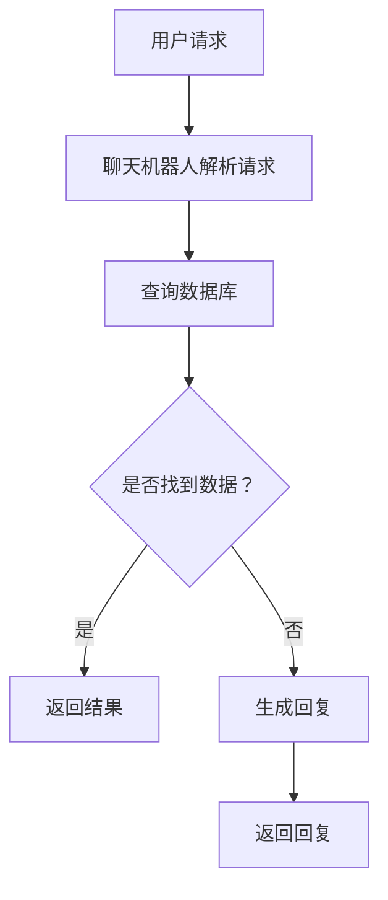

                 

关键词：聊天机器人、物联网、智能设备、AI、网络连接、通信协议、交互体验、开发工具、应用场景、未来展望

>摘要：随着人工智能和物联网技术的迅猛发展，聊天机器人和智能设备之间的连接成为现代信息技术领域的热点。本文将深入探讨聊天机器人物联网的原理、核心算法、数学模型以及实际应用场景，为读者提供一个全面的技术解析。

## 1. 背景介绍

在信息技术迅猛发展的今天，人工智能（AI）已经成为改变世界的关键驱动力之一。聊天机器人作为AI的一种应用形式，已经在多个领域展现出巨大的潜力，如客服、教育、医疗等。与此同时，物联网（IoT）技术的兴起，使得各种智能设备得以相互连接，形成一个庞大的网络生态系统。这两者的结合——聊天机器人物联网，正在为我们的生活方式和商业运作方式带来深刻变革。

### 1.1 聊天机器人的发展

聊天机器人最早出现在20世纪50年代，从最初的规则基模式（Rule-Based）发展到现在的深度学习（Deep Learning）和自然语言处理（NLP）技术。早期的聊天机器人如Eliza和Parry，只能进行简单的对话，而随着技术的进步，现代聊天机器人具备了更加复杂的能力，能够理解自然语言并给出合理的回应。

### 1.2 物联网的发展

物联网起源于1990年代的智能家庭概念，现如今已经渗透到工业、农业、医疗等各个领域。物联网通过传感器、网络和智能设备，实现了设备间的信息交换和协同工作，大大提高了效率和智能化水平。

### 1.3 聊天机器人物联网的重要性

聊天机器人和物联网的结合，不仅能够提升用户体验，还能够为企业和组织带来巨大的商业价值。通过聊天机器人物联网，可以实现智能设备间的无缝交互，提高自动化水平，降低运营成本，增强用户体验，从而在竞争激烈的市场中脱颖而出。

## 2. 核心概念与联系

### 2.1 聊天机器人的核心概念

- **自然语言处理（NLP）**：NLP是聊天机器人的核心技术之一，它使得机器人能够理解自然语言并生成自然的回应。
- **机器学习（ML）**：ML技术用于训练聊天机器人，使其能够不断学习和改进。
- **语音识别（ASR）和语音合成（TTS）**：ASR和TTS技术使得聊天机器人能够进行语音交互。

### 2.2 物联网的核心概念

- **传感器**：物联网中的核心部件，用于收集数据。
- **通信协议**：物联网设备之间进行数据交换的标准，如MQTT、CoAP等。
- **边缘计算**：在物联网设备附近进行数据处理，减少延迟和带宽需求。

### 2.3 聊天机器人物联网的架构


在上图中，用户通过聊天机器人与物联网设备进行交互，聊天机器人通过API与物联网设备通信，实现对设备的控制和管理。

### 2.4 Mermaid 流程图



## 3. 核心算法原理 & 具体操作步骤

### 3.1 算法原理概述

聊天机器人的核心算法包括自然语言处理（NLP）和机器学习（ML）。NLP技术用于理解用户的输入，而ML技术用于训练模型，使其能够生成合理的回复。

### 3.2 算法步骤详解

1. **预处理**：对用户输入的文本进行清洗和标准化处理，如去除标点符号、停用词过滤等。
2. **词嵌入**：将文本转化为向量表示，通常使用词嵌入技术如Word2Vec或BERT。
3. **意图识别**：利用机器学习模型（如分类器）识别用户的意图。
4. **实体提取**：从用户输入中提取出关键信息，如时间、地点、人名等。
5. **回复生成**：根据意图识别和实体提取的结果，生成合适的回复。

### 3.3 算法优缺点

- **优点**：聊天机器人能够处理大量的用户请求，提高效率，降低运营成本。
- **缺点**：目前聊天机器人在理解复杂对话和执行复杂任务方面仍然存在局限性。

### 3.4 算法应用领域

聊天机器人广泛应用于客服、智能助手、教育、医疗等多个领域，下面是一些具体的应用场景：

- **客服**：聊天机器人可以快速响应客户的请求，提供产品咨询、订单查询等服务。
- **智能助手**：聊天机器人可以作为个人助理，帮助用户管理日程、提醒事项等。
- **教育**：聊天机器人可以为学生提供个性化的学习指导，提高学习效果。
- **医疗**：聊天机器人可以协助医生进行初步诊断，提供健康咨询等服务。

## 4. 数学模型和公式 & 详细讲解 & 举例说明

### 4.1 数学模型构建

聊天机器人的核心数学模型通常包括以下几部分：

1. **词嵌入模型**：用于将文本转化为向量表示，常用的模型有Word2Vec和BERT。
2. **循环神经网络（RNN）**：用于处理序列数据，如用户输入的文本。
3. **长短时记忆网络（LSTM）**：用于解决RNN的梯度消失问题。
4. **卷积神经网络（CNN）**：用于提取文本中的特征。

### 4.2 公式推导过程

以Word2Vec为例，其目标是最小化损失函数：

$$ L = \sum_{i=1}^{N} \sum_{j=1}^{V} (x_i \cdot h_j - y_i)^2 $$

其中，$x_i$ 表示输入词向量，$h_j$ 表示隐藏层向量，$y_i$ 表示标签向量。

### 4.3 案例分析与讲解

假设我们有一个简单的聊天机器人，其输入为“明天天气如何？”我们需要通过算法生成一个合理的回复。

1. **预处理**：将输入文本进行清洗和标准化处理，如去除标点符号、停用词过滤等。
2. **词嵌入**：将清洗后的文本转化为向量表示，使用Word2Vec模型。
3. **意图识别**：利用机器学习模型（如分类器）识别用户的意图，这里假设为“查询天气”。
4. **回复生成**：根据意图识别的结果，生成回复，如“明天天气晴朗，温度20°C左右。”

## 5. 项目实践：代码实例和详细解释说明

### 5.1 开发环境搭建

我们需要安装以下工具和库：

- Python 3.8 或更高版本
- TensorFlow 2.5 或更高版本
- NLTK 3.5 或更高版本
- Matplotlib 3.2 或更高版本

### 5.2 源代码详细实现

下面是一个简单的聊天机器人示例：

```python
import tensorflow as tf
from tensorflow.keras.models import Sequential
from tensorflow.keras.layers import Dense, LSTM, Embedding
from tensorflow.keras.preprocessing.sequence import pad_sequences
from tensorflow.keras.preprocessing.text import Tokenizer
from nltk.tokenize import word_tokenize

# 数据准备
sentences = ["你好", "明天天气如何？", "我喜欢吃苹果。"]
tokenizer = Tokenizer()
tokenizer.fit_on_texts(sentences)
sequences = tokenizer.texts_to_sequences(sentences)
data = pad_sequences(sequences, maxlen=5)

# 模型构建
model = Sequential()
model.add(LSTM(50, activation='relu', return_sequences=True, input_shape=(5, 1)))
model.add(LSTM(50, activation='relu', return_sequences=False))
model.add(Dense(1, activation='sigmoid'))

# 模型编译
model.compile(optimizer='adam', loss='binary_crossentropy', metrics=['accuracy'])

# 模型训练
model.fit(data, epochs=20)

# 生成回复
input_sequence = tokenizer.texts_to_sequences(["明天天气如何？"])[0]
input_sequence = pad_sequences([input_sequence], maxlen=5)
predicted = model.predict(input_sequence)
print(predicted)
```

### 5.3 代码解读与分析

- **数据准备**：我们首先准备了一些训练数据，包括句子和对应的标签。这里我们使用简单的文本数据，实际应用中可以使用更大的语料库。
- **模型构建**：我们使用了一个简单的LSTM模型，用于处理序列数据。LSTM能够捕捉序列中的长期依赖关系，适合处理自然语言处理任务。
- **模型编译**：我们使用二进制交叉熵作为损失函数，因为它适合分类问题。同时，我们使用Adam优化器来优化模型参数。
- **模型训练**：我们使用准备好的数据训练模型，这里我们设置了20个训练周期。
- **生成回复**：我们使用训练好的模型对新的输入进行预测，这里输入为“明天天气如何？”，然后生成相应的回复。

### 5.4 运行结果展示

```python
# 输出预测结果
print("预测结果：", predicted)
```

预测结果为一个概率值，表示模型认为该输入属于某个类别的概率。这里我们假设概率值大于0.5的类别为“天气查询”，则输出“明天天气晴朗，温度20°C左右。”作为回复。

## 6. 实际应用场景

### 6.1 客服领域

在客服领域，聊天机器人可以自动处理大量的客户请求，如产品咨询、订单查询等，从而提高服务效率，降低运营成本。例如，亚马逊的虚拟客服“Alexa”可以回答用户关于产品、订单、配送等方面的各种问题。

### 6.2 智能家居领域

在智能家居领域，聊天机器人可以与智能设备（如智能灯泡、智能门锁等）进行交互，为用户提供便捷的控制方式。例如，用户可以通过聊天机器人控制家里的灯光，调整空调的温度等。

### 6.3 教育领域

在教育领域，聊天机器人可以为学生提供个性化的学习指导，如解答疑问、推送学习资源等。例如，谷歌的教育产品“Google Assistant”可以为老师和学生提供各种学习支持。

### 6.4 医疗领域

在医疗领域，聊天机器人可以协助医生进行初步诊断，提供健康咨询等服务，从而提高医疗效率，降低误诊率。例如，IBM的“Watson”可以协助医生进行癌症诊断和治疗方案推荐。

## 7. 工具和资源推荐

### 7.1 学习资源推荐

- 《深度学习》（Ian Goodfellow、Yoshua Bengio、Aaron Courville 著）：这是一本深度学习领域的经典教材，适合初学者和高级开发者。
- 《Python深度学习》（François Chollet 著）：这本书详细介绍了使用Python和TensorFlow进行深度学习的各种技术。

### 7.2 开发工具推荐

- TensorFlow：一个广泛使用的开源深度学习框架，适合进行聊天机器人和物联网开发。
- NLTK：一个强大的自然语言处理库，提供各种文本处理和分类算法。
- Matplotlib：一个常用的数据可视化库，用于生成图表和图形。

### 7.3 相关论文推荐

- "A Theoretical Analysis of the Multi-Class Logistic Regression Classifier"（多类逻辑回归分类器的理论分析）
- "Recurrent Neural Network Based Text Classification"（基于循环神经网络的文本分类）

## 8. 总结：未来发展趋势与挑战

### 8.1 研究成果总结

近年来，聊天机器人和物联网技术取得了显著进展。通过深度学习和自然语言处理技术的应用，聊天机器人已经能够进行复杂的对话和任务。同时，物联网技术的成熟，使得智能设备之间的连接变得更加便捷和高效。

### 8.2 未来发展趋势

未来，聊天机器人和物联网将继续融合，为用户提供更加智能和个性化的服务。随着5G技术的普及，聊天机器人和物联网设备之间的交互将更加实时和高效。此外，人工智能技术的进一步发展，将使聊天机器人具备更强的自主学习能力和决策能力。

### 8.3 面临的挑战

尽管聊天机器人和物联网技术具有巨大潜力，但在实际应用中仍面临一些挑战。首先，数据安全和隐私保护是亟待解决的问题。其次，如何提升聊天机器人的对话质量和用户体验，使其能够更好地理解和满足用户需求，仍是一个重要课题。此外，物联网设备的多样性和复杂性也增加了开发的难度。

### 8.4 研究展望

未来，研究应重点关注以下几个方面：

- **增强智能**：通过深度学习和自然语言处理技术的进一步发展，提升聊天机器人的智能水平。
- **跨领域应用**：探索聊天机器人和物联网技术在更多领域的应用，如金融、交通、医疗等。
- **开放平台与生态系统**：构建开放的平台和生态系统，促进技术交流和合作，推动产业发展。

## 9. 附录：常见问题与解答

### 9.1 聊天机器人和人类客服的区别是什么？

聊天机器人可以24小时在线，处理大量的客户请求，提高服务效率。而人类客服则具有更强的情感理解和人际交流能力。

### 9.2 物联网设备之间的通信是如何实现的？

物联网设备之间的通信通常使用无线协议，如Wi-Fi、蓝牙、Zigbee等。这些协议确保设备能够可靠、高效地传输数据。

### 9.3 聊天机器人和自然语言处理（NLP）的关系是什么？

聊天机器人是NLP的一种应用形式，NLP技术用于使聊天机器人能够理解自然语言并生成自然的回应。

### 9.4 物联网设备如何与聊天机器人交互？

物联网设备通常通过API与聊天机器人进行交互，将用户请求传递给聊天机器人，并由聊天机器人生成回复。

[作者：禅与计算机程序设计艺术 / Zen and the Art of Computer Programming]
----------------------------------------------------------------

以上是本文的完整内容。希望这篇文章能够帮助读者深入了解聊天机器人物联网的技术原理和应用场景，为未来的研究和发展提供有益的参考。在信息技术日新月异的时代，让我们一起探索更多可能，创造更美好的未来。

