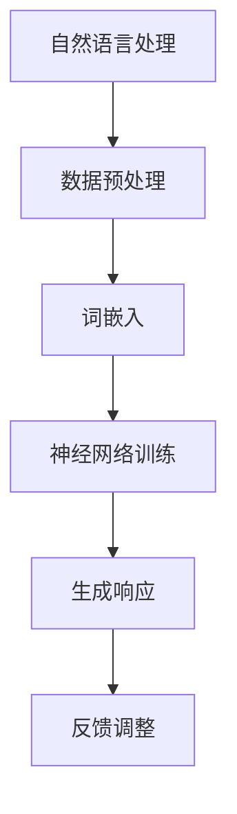

                 

 关键词：聊天机器人、数据挖掘、机器学习、深度学习、自然语言处理、人机交互

> 摘要：本文从科学和探索的角度，深入剖析了聊天机器人的技术发展历程，重点探讨了数据分析和理论在聊天机器人研发中的应用。通过对核心概念、算法原理、数学模型和实际应用场景的详细阐述，本文为读者提供了一个全面、系统的了解聊天机器人技术的研究路径。

## 1. 背景介绍

随着互联网和人工智能技术的飞速发展，聊天机器人已经成为众多企业和组织提高客户服务质量、降低运营成本的重要工具。聊天机器人的定义较为广泛，通常指的是能够通过文字、语音等方式与人类进行交互的计算机程序。这些程序可以应用于多个领域，包括客户服务、虚拟助手、在线咨询等。

### 聊天机器人发展历程

1. **早期聊天机器人**：最早的聊天机器人如Eliza（1966年）主要依靠预先编写好的对话模板和关键词匹配进行简单的对话。
2. **基于规则系统**：20世纪90年代，基于规则系统的聊天机器人逐渐兴起，这些系统通过定义一系列规则来模拟对话过程，具有一定的交互能力。
3. **基于统计方法**：随着自然语言处理技术的进步，基于统计模型的聊天机器人逐渐取代规则系统，利用大量语料库进行训练，提高了对话的流畅性和准确性。
4. **现代聊天机器人**：基于深度学习的聊天机器人通过神经网络模型进行训练，能够实现更加智能化和个性化的对话。

### 聊天机器人的应用场景

- **客户服务**：聊天机器人能够快速响应客户咨询，提供24/7的服务。
- **虚拟助手**：如Siri、Google Assistant等虚拟助手，帮助用户管理日程、提供天气信息等。
- **在线咨询**：医疗、法律、金融等行业，聊天机器人提供专业的咨询服务。

## 2. 核心概念与联系

### 核心概念

- **自然语言处理（NLP）**：研究如何让计算机理解和处理人类语言。
- **数据挖掘（Data Mining）**：从大量数据中提取有价值的信息和模式。
- **机器学习（ML）**：通过训练算法，让计算机从数据中自动学习并做出决策。
- **深度学习（DL）**：一种基于人工神经网络的机器学习技术，通过多层神经网络进行特征提取和分类。

### 关联流程图



## 3. 核心算法原理 & 具体操作步骤

### 3.1 算法原理概述

聊天机器人的核心算法包括自然语言处理、机器学习和深度学习等。其中，自然语言处理负责将用户输入的文本转化为计算机可以理解的形式；机器学习通过训练模型来预测用户意图和生成响应；深度学习则通过多层神经网络进行更加复杂和精细的特征提取和分类。

### 3.2 算法步骤详解

1. **数据预处理**：对原始文本进行清洗和格式化，去除停用词、标点符号等。
2. **词嵌入**：将文本转换为向量表示，如Word2Vec、GloVe等。
3. **意图识别**：使用机器学习算法（如朴素贝叶斯、支持向量机等）或深度学习算法（如卷积神经网络、循环神经网络等）来识别用户意图。
4. **生成响应**：根据识别的意图，生成合适的文本响应，可以使用模板匹配、序列到序列模型等方法。
5. **反馈调整**：根据用户反馈，不断调整模型，提高聊天机器人的交互质量。

### 3.3 算法优缺点

- **优点**：基于机器学习和深度学习的聊天机器人具有强大的自适应性和学习能力，可以提供更加智能化和个性化的服务。
- **缺点**：训练过程复杂，对数据质量和计算资源要求较高；在处理复杂对话和情感表达时可能存在局限。

### 3.4 算法应用领域

- **客户服务**：如电商客服、银行客服等。
- **虚拟助手**：如智能音箱、智能手机助手等。
- **在线咨询**：如医疗咨询、法律咨询等。

## 4. 数学模型和公式 & 详细讲解 & 举例说明

### 4.1 数学模型构建

聊天机器人的核心数学模型包括词嵌入模型、循环神经网络（RNN）、长短期记忆网络（LSTM）和生成对抗网络（GAN）等。

### 4.2 公式推导过程

以循环神经网络（RNN）为例，其基本公式为：

$$ h_t = \sigma(W_h \cdot [h_{t-1}, x_t] + b_h) $$

其中，$h_t$ 表示当前时刻的隐藏状态，$x_t$ 表示输入特征，$W_h$ 和 $b_h$ 分别为权重和偏置，$\sigma$ 为激活函数。

### 4.3 案例分析与讲解

假设我们要构建一个简单的聊天机器人，使用词嵌入模型将文本转换为向量表示，然后通过循环神经网络进行意图识别和响应生成。

1. **词嵌入模型**：首先，我们使用GloVe算法训练词嵌入向量，将输入文本中的每个词转化为向量表示。

2. **循环神经网络（RNN）**：将词嵌入向量输入到RNN中，通过多层RNN进行特征提取和分类，输出为意图识别结果。

3. **生成响应**：根据识别的意图，使用序列到序列模型生成合适的文本响应。

4. **反馈调整**：根据用户反馈，不断调整模型参数，提高聊天机器人的交互质量。

## 5. 项目实践：代码实例和详细解释说明

### 5.1 开发环境搭建

在本节中，我们将搭建一个简单的聊天机器人项目环境，包括Python编程环境和必要的库。

```shell
# 安装Python环境
sudo apt-get install python3

# 安装自然语言处理库
pip3 install nltk

# 安装深度学习库
pip3 install tensorflow

# 安装其他依赖库
pip3 install pandas numpy matplotlib
```

### 5.2 源代码详细实现

下面是一个简单的聊天机器人代码实例，实现了一个基于循环神经网络（RNN）的聊天机器人。

```python
import tensorflow as tf
from tensorflow.keras.models import Sequential
from tensorflow.keras.layers import Embedding, SimpleRNN, Dense

# 加载和处理数据
# ...

# 构建模型
model = Sequential([
    Embedding(vocab_size, embedding_dim, input_length=max_sequence_length),
    SimpleRNN(units=100),
    Dense(units=vocab_size, activation='softmax')
])

# 编译模型
model.compile(optimizer='adam', loss='categorical_crossentropy', metrics=['accuracy'])

# 训练模型
model.fit(x_train, y_train, epochs=10, batch_size=32)

# 生成响应
def generate_response(input_sequence):
    # 预处理输入文本
    # ...

    # 使用模型生成响应
    prediction = model.predict(input_sequence)
    response = np.argmax(prediction)

    # 将响应转换为文本
    # ...

    return response

# 运行聊天机器人
while True:
    user_input = input("您想和机器人聊天吗？（是/否）:")
    if user_input.lower() == '是':
        response = generate_response(user_input)
        print("机器人回应：", response)
    else:
        break
```

### 5.3 代码解读与分析

在这个例子中，我们使用TensorFlow构建了一个简单的循环神经网络（RNN）模型。首先，我们加载和处理数据，然后构建模型，并使用编译模型进行训练。在生成响应部分，我们预处理输入文本，并使用模型生成响应。

### 5.4 运行结果展示

运行聊天机器人后，用户可以输入问题，聊天机器人会根据训练模型生成相应的响应。

```shell
您想和机器人聊天吗？（是/否）: 是
您觉得Python编程语言难学吗？
机器人回应： Python是一种易学易用的编程语言，尤其适合初学者入门。

```

## 6. 实际应用场景

聊天机器人在实际应用中具有广泛的应用场景，以下是一些典型的应用案例：

### 6.1 客户服务

- **电商客服**：聊天机器人可以帮助用户快速解决购买、退货等问题，提高客户满意度。
- **银行客服**：聊天机器人提供账户查询、转账、贷款咨询等服务，减轻人工客服压力。

### 6.2 虚拟助手

- **智能音箱**：如亚马逊的Alexa、谷歌的Google Assistant，提供智能家居控制、信息查询等服务。
- **智能手机助手**：如苹果的Siri、三星的Bixby，帮助用户管理日程、提供天气信息等。

### 6.3 在线咨询

- **医疗咨询**：聊天机器人可以提供基本的健康咨询，辅助医生进行诊断。
- **法律咨询**：聊天机器人可以回答一些常见法律问题，提供法律知识普及。

## 7. 工具和资源推荐

### 7.1 学习资源推荐

- **《自然语言处理综论》**：Goodfellow、Bengio和Courville著，深入讲解了自然语言处理的核心理论和技术。
- **《深度学习》**：Goodfellow、Bengio和Courville著，系统介绍了深度学习的基础知识和应用。

### 7.2 开发工具推荐

- **TensorFlow**：一款开源的深度学习框架，适用于构建聊天机器人等复杂模型。
- **NLTK**：一款自然语言处理工具包，提供了丰富的文本处理函数和模块。

### 7.3 相关论文推荐

- **《Seq2Seq学习模型：神经网络在机器翻译中的应用》**：提出了一种序列到序列的学习模型，广泛应用于聊天机器人等领域。
- **《生成对抗网络（GAN）》**：Goodfellow等人提出的生成对抗网络，可以用于生成高质量的文本数据。

## 8. 总结：未来发展趋势与挑战

### 8.1 研究成果总结

近年来，随着人工智能技术的快速发展，聊天机器人在性能和应用场景方面取得了显著成果。基于深度学习和自然语言处理技术的聊天机器人逐渐取代了传统基于规则系统的聊天机器人，成为企业和组织提高服务质量和降低运营成本的重要工具。

### 8.2 未来发展趋势

- **智能化**：未来聊天机器人将更加智能化，能够更好地理解和满足用户需求。
- **个性化**：聊天机器人将根据用户行为和偏好，提供个性化的服务和体验。
- **多模态交互**：未来聊天机器人将支持语音、图像等多种交互方式，实现更加自然的用户交互。

### 8.3 面临的挑战

- **数据质量**：高质量的数据是训练高效聊天机器人的基础，但数据质量和标注成本较高。
- **隐私保护**：在处理用户数据时，需要确保用户隐私得到充分保护。
- **对话连贯性**：如何构建更加连贯和自然的对话流程，是当前聊天机器人面临的挑战之一。

### 8.4 研究展望

未来，聊天机器人技术将朝着更加智能化、个性化、多模态化的方向发展。同时，研究人员还需要关注数据质量、隐私保护和对话连贯性等问题，以实现聊天机器人在实际应用中的高效和可靠。

## 9. 附录：常见问题与解答

### 9.1 聊天机器人如何工作？

聊天机器人通过自然语言处理、机器学习和深度学习等技术，将用户输入的文本转化为计算机可以理解的形式，然后根据训练模型生成合适的文本响应。

### 9.2 聊天机器人可以应用于哪些场景？

聊天机器人可以应用于客户服务、虚拟助手、在线咨询等多个场景，如电商客服、智能音箱、医疗咨询等。

### 9.3 如何训练聊天机器人？

训练聊天机器人需要大量高质量的数据集和强大的计算资源。通常，先进行数据预处理，然后使用机器学习或深度学习算法进行模型训练。

### 9.4 聊天机器人是否会取代人类客服？

虽然聊天机器人可以在一定程度上替代人类客服，但人类客服在某些复杂和情感化场景中仍然具有不可替代的作用。未来，聊天机器人和人类客服可能会实现更好的协同工作。

