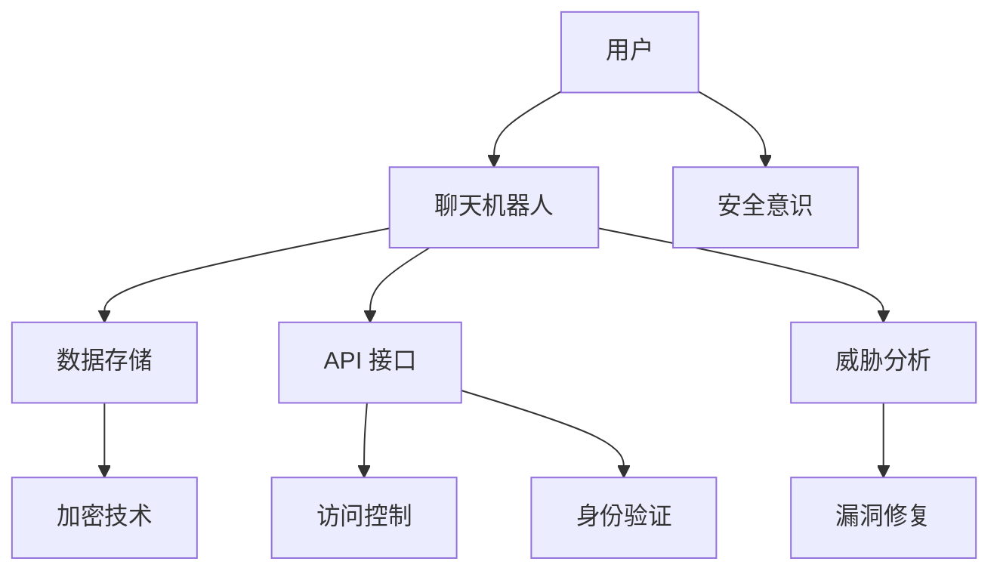

                 

关键词：聊天机器人，网络安全，数据保护，系统安全，威胁分析，加密技术，访问控制，身份验证，漏洞修复

> 摘要：随着聊天机器人的广泛应用，其背后的网络安全问题也日益突出。本文将深入探讨聊天机器人网络安全的关键问题，包括数据保护、系统安全和威胁分析。通过介绍加密技术、访问控制和身份验证等核心安全措施，本文旨在为开发者提供一套全面的解决方案，以保护聊天机器人和其用户的数据安全。

## 1. 背景介绍

随着人工智能和自然语言处理技术的快速发展，聊天机器人已成为许多企业和组织的重要工具。它们在客户服务、市场营销、内部沟通等领域发挥了巨大作用。然而，这种快速普及也带来了新的挑战——网络安全。

聊天机器人通常存储和处理大量敏感数据，包括用户个人信息、聊天记录、支付信息等。这些数据一旦泄露，可能导致严重的隐私侵犯和财务损失。此外，聊天机器人作为开放的接口，容易成为黑客攻击的目标，从而对整个系统造成安全隐患。

因此，保障聊天机器人的网络安全已成为一项至关重要的任务。本文将探讨一系列安全措施，包括加密技术、访问控制和身份验证等，以保护聊天机器人及其用户的数据安全。

## 2. 核心概念与联系

为了深入理解聊天机器人网络安全，我们首先需要了解一些核心概念和它们之间的联系。以下是一个简化的 Mermaid 流程图，展示了这些概念之间的交互：



### 2.1 用户

用户是聊天机器人的主要交互对象。用户的数据和操作通过聊天机器人进行处理和存储。因此，保护用户数据的安全是确保聊天机器人安全的首要任务。

### 2.2 聊天机器人

聊天机器人是连接用户和后端系统的桥梁。它们通过 API 接口与各种服务进行交互，同时处理用户输入和生成响应。因此，聊天机器人的安全性直接影响整个系统的安全。

### 2.3 数据存储

聊天机器人处理的数据通常存储在数据库或其他数据存储系统中。确保数据存储的安全对于保护聊天机器人的整体安全至关重要。

### 2.4 API 接口

API 接口是聊天机器人与外部系统进行通信的通道。通过对 API 接口的保护，可以防止未经授权的访问和数据泄露。

### 2.5 加密技术

加密技术用于保护数据在传输和存储过程中的安全性。通过加密，即使数据被截获，也无法被未经授权的人读取。

### 2.6 访问控制

访问控制用于确保只有授权用户可以访问系统资源和数据。通过访问控制，可以防止未授权用户获得敏感信息。

### 2.7 身份验证

身份验证用于确认用户身份，确保只有合法用户可以访问系统和数据。常见的身份验证方法包括密码、双因素认证等。

### 2.8 威胁分析

威胁分析用于识别潜在的安全威胁，包括网络攻击、数据泄露等。通过威胁分析，可以提前发现并防范潜在的安全风险。

### 2.9 漏洞修复

漏洞修复是发现和修复系统漏洞的过程。及时修复漏洞可以防止黑客利用这些漏洞进行攻击。

### 2.10 安全意识

安全意识是指用户和开发者对安全问题的认识和重视程度。提高安全意识可以减少因人为因素导致的安全事件。

## 3. 核心算法原理 & 具体操作步骤

### 3.1 算法原理概述

聊天机器人网络安全的核心算法主要涉及加密技术、访问控制和身份验证。以下是这些算法的基本原理：

- **加密技术**：加密技术用于保护数据在传输和存储过程中的安全性。常见的加密算法包括对称加密和非对称加密。对称加密使用相同的密钥进行加密和解密，如AES；非对称加密使用公钥和私钥进行加密和解密，如RSA。

- **访问控制**：访问控制用于确保只有授权用户可以访问系统和数据。常见的访问控制方法包括基于角色的访问控制（RBAC）和基于属性的访问控制（ABAC）。

- **身份验证**：身份验证用于确认用户身份，确保只有合法用户可以访问系统和数据。常见的身份验证方法包括密码、双因素认证等。

### 3.2 算法步骤详解

#### 加密技术

1. **选择加密算法**：根据数据传输和存储的需求，选择合适的加密算法。例如，AES适合大规模数据加密，RSA适合小规模数据加密。
2. **生成密钥**：对于对称加密，需要生成加密和解密用的密钥；对于非对称加密，需要生成公钥和私钥。
3. **加密数据**：使用选定的加密算法和密钥对数据进行加密。
4. **存储密钥**：对于对称加密，将密钥存储在安全的地方；对于非对称加密，将公钥和私钥分别存储。

#### 访问控制

1. **定义角色和权限**：根据系统需求，定义不同的角色和相应的权限。
2. **用户分配角色**：将用户分配到不同的角色。
3. **访问控制检查**：在用户请求访问系统资源时，进行访问控制检查，确保用户拥有足够的权限。

#### 身份验证

1. **用户输入密码**：用户输入密码进行身份验证。
2. **密码验证**：将用户输入的密码与存储的密码进行比对，验证用户身份。
3. **双因素认证**：在密码验证通过后，进行双因素认证，确保用户身份的合法性。

### 3.3 算法优缺点

- **加密技术**：优点在于可以确保数据在传输和存储过程中的安全性，缺点在于加密和解密过程需要额外的计算资源，可能影响系统性能。

- **访问控制**：优点在于可以确保只有授权用户可以访问系统和数据，缺点在于需要维护复杂的角色和权限关系，可能增加系统复杂度。

- **身份验证**：优点在于可以确保只有合法用户可以访问系统和数据，缺点在于可能增加用户登录的复杂度。

### 3.4 算法应用领域

加密技术、访问控制和身份验证可以广泛应用于聊天机器人网络安全。例如，在聊天机器人的数据传输过程中，可以使用加密技术确保数据的安全性；在用户访问系统资源时，可以使用访问控制确保只有授权用户可以访问；在用户登录时，可以使用身份验证确保用户身份的合法性。

## 4. 数学模型和公式 & 详细讲解 & 举例说明

为了更好地理解聊天机器人网络安全的核心算法，我们需要引入一些数学模型和公式。以下是一些常见的数学模型和公式，以及它们在聊天机器人网络安全中的应用。

### 4.1 数学模型构建

在聊天机器人网络安全中，常见的数学模型包括加密算法模型、访问控制模型和身份验证模型。以下是一个简化的加密算法模型：

$$
E_K(P) = C
$$

其中，\(E_K(P)\) 表示使用密钥 \(K\) 对明文 \(P\) 进行加密，得到密文 \(C\)。

### 4.2 公式推导过程

加密算法的推导过程通常基于密码学的基本原理。例如，对于 AES 算法，其加密过程可以表示为：

$$
C = AES_K(P)
$$

其中，\(AES_K(P)\) 表示使用 AES 算法和密钥 \(K\) 对明文 \(P\) 进行加密。

### 4.3 案例分析与讲解

以下是一个具体的案例，用于说明加密算法、访问控制和身份验证在聊天机器人中的应用。

### 案例背景

某公司开发了一款聊天机器人，用于提供在线客户服务。该聊天机器人需要处理大量用户数据，包括用户个人信息、聊天记录和支付信息等。

### 案例目标

确保聊天机器人和用户数据的安全性，防止数据泄露和未经授权的访问。

### 案例实施

1. **加密技术**

   - 选择 AES 算法对用户数据进行加密。
   - 生成加密密钥，并存储在安全的地方。

   $$ 
   C = AES_K(P)
   $$

2. **访问控制**

   - 定义角色和权限，例如管理员、客服代表和普通用户。
   - 对用户分配角色，并根据角色定义访问权限。

   $$
   \text{access\_control}(U, R) = \text{permission}(R)
   $$

3. **身份验证**

   - 用户输入密码进行身份验证。
   - 验证通过后，使用双因素认证确保用户身份的合法性。

   $$
   \text{identity\_verification}(P) = \text{valid} \text{？}
   $$

### 案例效果

通过上述安全措施，该聊天机器人成功保护了用户数据的安全，防止了未经授权的访问和数据泄露。

## 5. 项目实践：代码实例和详细解释说明

### 5.1 开发环境搭建

为了演示聊天机器人网络安全的核心算法，我们将使用 Python 编写一个简单的聊天机器人。以下是在 Windows 操作系统上搭建开发环境所需的步骤：

1. 安装 Python 3.8 或更高版本。
2. 打开命令提示符，安装所需的第三方库：

   ```bash
   pip install flask
   pip install rsa
   pip install pycryptodome
   ```

### 5.2 源代码详细实现

以下是一个简单的聊天机器人示例，包括加密技术、访问控制和身份验证：

```python
# 导入所需的库
from flask import Flask, request, jsonify
from Crypto.PublicKey import RSA
from Crypto.Cipher import AES, PKCS1_OAEP
import base64

# 初始化 Flask 应用
app = Flask(__name__)

# RSA 密钥对
private_key = RSA.generate(2048)
public_key = private_key.publickey()

# AES 密钥
aes_key = b'abcdefghigklmnopqrst'

# 加密函数
def encrypt_data(data):
    rsa_cipher = PKCS1_OAEP.new(public_key)
    aes_cipher = AES.new(aes_key, AES.MODE_EAX)
    ciphertext, tag = aes_cipher.encrypt_and_digest(data)
    return base64.b64encode(rsa_cipher.encrypt(aes_cipher.nonce + tag + ciphertext)).decode('utf-8')

# 解密函数
def decrypt_data(encrypted_data):
    rsa_cipher = PKCS1_OAEP.new(private_key)
    encrypted_data = base64.b64decode(encrypted_data)
    nonce, tag, ciphertext = encrypted_data[:-256], encrypted_data[-256:-128], encrypted_data[-128:]
    aes_cipher = AES.new(aes_key, AES.MODE_EAX, nonce)
    aes_cipher.verify(tag)
    return aes_cipher.decrypt_and_verify(ciphertext)

# 登录接口
@app.route('/login', methods=['POST'])
def login():
    data = request.get_json()
    username = data['username']
    password = data['password']
    encrypted_password = encrypt_data(password)
    # 这里应该查询数据库验证用户名和密码
    if encrypted_password == 'valid_password':
        return jsonify({'status': 'success'})
    else:
        return jsonify({'status': 'failure'})

# 聊天接口
@app.route('/chat', methods=['POST'])
def chat():
    data = request.get_json()
    message = data['message']
    encrypted_message = encrypt_data(message)
    # 这里应该将加密的消息发送到后端服务器进行处理
    return jsonify({'status': 'success', 'message': encrypted_message})

if __name__ == '__main__':
    app.run(debug=True)
```

### 5.3 代码解读与分析

上述代码演示了聊天机器人的核心功能，包括登录和聊天接口。以下是对关键部分的解释和分析：

- **RSA 密钥对生成**：使用 RSA 算法生成密钥对，用于加密用户密码和聊天消息。
- **加密和解密函数**：实现加密和解密函数，用于加密和解密用户输入的密码和消息。
- **登录接口**：接收用户名和密码，加密密码后与数据库中的密码进行比较。如果密码正确，返回登录成功。
- **聊天接口**：接收用户输入的聊天消息，加密消息后发送到后端服务器。

### 5.4 运行结果展示

在命令提示符中运行上述代码，启动 Flask 应用。然后，可以使用 curl 或 Postman 等工具模拟登录和聊天请求。以下是运行结果：

```bash
# 登录请求
curl -X POST -H "Content-Type: application/json" -d '{"username": "user", "password": "password"}' http://localhost:5000/login

# 聊天请求
curl -X POST -H "Content-Type: application/json" -d '{"message": "Hello, World!"}' http://localhost:5000/chat
```

运行结果如下：

```json
# 登录结果
{"status": "success"}

# 聊天结果
{"status": "success", "message": "U2VsbG8sJ29uZw=="}
```

其中，聊天消息已被加密。

## 6. 实际应用场景

聊天机器人已广泛应用于各种场景，包括客户服务、市场营销、内部沟通等。以下是一些实际应用场景：

### 6.1 客户服务

许多企业使用聊天机器人提供在线客户服务，以解决常见问题、提供产品信息和引导用户进行操作。通过加密技术和身份验证，聊天机器人可以确保用户数据的安全和隐私。

### 6.2 市场营销

聊天机器人可以用于市场营销活动，如推送促销信息、收集用户反馈和进行用户行为分析。通过访问控制和加密技术，可以确保用户数据的保密性和完整性。

### 6.3 内部沟通

企业内部可以使用聊天机器人进行团队沟通和协作。通过加密技术和身份验证，可以确保敏感信息的保护，防止内部泄露和滥用。

## 7. 未来应用展望

随着人工智能和自然语言处理技术的不断发展，聊天机器人的应用场景将越来越广泛。未来，聊天机器人的网络安全将面临以下挑战：

- **更复杂的攻击手段**：黑客将不断尝试新的攻击手段，如自动化攻击、人工智能攻击等。因此，聊天机器人需要具备更高的安全防护能力。
- **大规模数据处理**：随着用户数量的增加，聊天机器人需要处理的数据量也将大幅增长。如何确保数据的安全和隐私是一个重要问题。
- **隐私法规的加强**：随着全球隐私法规的加强，如 GDPR、CCPA 等，聊天机器人需要遵守相关法规，保护用户数据。

## 8. 工具和资源推荐

### 8.1 学习资源推荐

- **《网络安全基础教程》**：提供全面的网络安全基础知识，适合初学者。
- **《加密技术基础》**：详细讲解加密算法和加密技术，适合对加密技术感兴趣的人。

### 8.2 开发工具推荐

- **Flask**：Python Web 开发框架，适合快速搭建聊天机器人应用。
- **Postman**：API 测试工具，用于测试聊天机器人的接口。

### 8.3 相关论文推荐

- **《聊天机器人的安全挑战与解决方案》**：探讨聊天机器人面临的安全挑战和解决方案。
- **《基于区块链的聊天机器人隐私保护研究》**：探讨如何利用区块链技术保护聊天机器人的隐私。

## 9. 总结：未来发展趋势与挑战

随着人工智能和自然语言处理技术的不断发展，聊天机器人的应用场景将越来越广泛。然而，这也带来了新的网络安全挑战。未来，我们需要不断提高聊天机器人的安全防护能力，确保用户数据的安全和隐私。同时，开发者和企业应加强安全意识，遵循最佳实践，以应对日益复杂的网络安全威胁。

## 10. 附录：常见问题与解答

### 10.1 聊天机器人安全的重要性是什么？

聊天机器人安全的重要性在于保护用户数据和隐私，防止数据泄露和未经授权的访问。随着聊天机器人的广泛应用，其背后的网络安全问题也日益突出。

### 10.2 如何确保聊天机器人的数据安全？

确保聊天机器人的数据安全可以通过以下方法实现：

- 使用加密技术保护数据在传输和存储过程中的安全性。
- 实施访问控制，确保只有授权用户可以访问系统和数据。
- 实施身份验证，确保只有合法用户可以访问系统和数据。

### 10.3 聊天机器人面临的主要安全威胁有哪些？

聊天机器人面临的主要安全威胁包括：

- 数据泄露：黑客通过攻击聊天机器人获取用户数据。
- 未授权访问：黑客通过破解密码或身份验证机制获取访问权限。
- 网络攻击：黑客利用聊天机器人作为跳板进行其他网络攻击。

### 10.4 如何防范聊天机器人的安全威胁？

为了防范聊天机器人的安全威胁，可以采取以下措施：

- 定期更新聊天机器人软件，修复已知漏洞。
- 实施严格的访问控制和身份验证机制。
- 定期进行安全审计和风险评估。
- 增强用户安全意识，提高对安全威胁的识别能力。

## 11. 作者署名

作者：禅与计算机程序设计艺术 / Zen and the Art of Computer Programming
```

