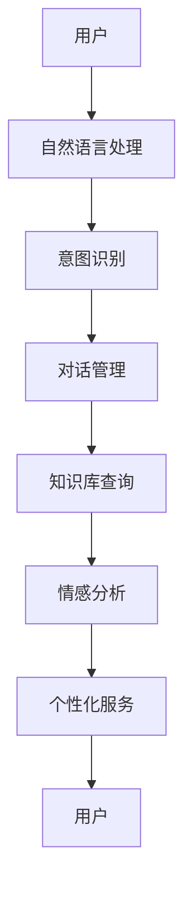

                 

 关键词：聊天机器人，老年护理，虚拟助手，人工智能，人机交互

> 摘要：本文深入探讨了聊天机器人在老年护理领域中的重要作用，分析了虚拟助手作为老年人的同伴如何改善其生活质量。文章首先介绍了聊天机器人的背景和核心概念，然后详细描述了其工作原理和算法，通过数学模型和实际项目实践进行了阐述，最后展望了未来的应用前景和面临的挑战。

## 1. 背景介绍

随着全球人口老龄化的加剧，老年护理问题日益凸显。据联合国统计，到2050年，全球60岁及以上人口预计将占总人口的22%。这一庞大的老年人口群体对医疗、护理和社会服务提出了巨大的挑战。传统的护理方式面临着人手不足、效率低下、成本高昂等问题。因此，寻找创新、高效、经济的解决方案成为当务之急。

在这个背景下，聊天机器人作为一种新兴的人工智能技术，逐渐进入了老年护理领域。聊天机器人通过自然语言处理技术，能够与老年人进行实时、智能的对话，提供情感支持、信息查询、健康监测等服务。这不仅能够缓解护理人员的工作压力，还能提高老年人的生活质量和幸福感。

## 2. 核心概念与联系

### 2.1 聊天机器人的基本原理

聊天机器人（Chatbot）是一种基于人工智能（AI）技术，能够通过自然语言处理（NLP）与用户进行交互的计算机程序。其基本原理包括以下几个关键组成部分：

1. **自然语言处理（NLP）**：NLP是使计算机能够理解和处理人类语言的技术。它包括语音识别、语义理解和语言生成等子领域。

2. **机器学习（ML）**：机器学习是使计算机从数据中学习模式并做出预测或决策的技术。在聊天机器人中，ML模型用于训练和理解用户输入。

3. **对话管理（DM）**：对话管理是指如何组织对话流程，确保对话的流畅性和有效性。它包括对话状态跟踪、意图识别和响应生成等任务。

### 2.2 聊天机器人在老年护理中的应用架构

聊天机器人应用于老年护理的架构如图所示：



### 2.3 聊天机器人的核心概念原理和架构的 Mermaid 流程图

```mermaid
graph TD
A[用户输入] --> B(NLP处理)
B --> C[意图识别]
C --> D|是|E[健康咨询]
C --> D|否|F[日常互动]
D --> G[对话管理]
G --> H[知识库查询]
H --> I[情感分析]
I --> J[个性化服务]
J --> K[反馈]
K --> A
```

在上述流程图中，用户输入通过NLP处理，被分类为健康咨询或日常互动。对话管理模块负责管理整个对话流程，知识库查询用于提供相关信息，情感分析用于评估用户的情绪状态，个性化服务则根据用户的反馈和情绪调整对话内容。

## 3. 核心算法原理 & 具体操作步骤

### 3.1 算法原理概述

聊天机器人的核心算法主要涉及自然语言处理、机器学习和对话管理等方面。以下是这些算法的基本原理：

1. **自然语言处理（NLP）**：NLP算法用于将用户输入转换为机器可以理解的形式。这通常包括词法分析、句法分析和语义分析等步骤。

2. **机器学习（ML）**：ML算法用于训练模型，使其能够识别用户意图和生成合适的响应。常见的ML算法包括决策树、支持向量机（SVM）和神经网络等。

3. **对话管理（DM）**：DM算法负责处理对话流程，包括意图识别、对话状态跟踪和响应生成等任务。DM算法的目标是使对话流畅、自然且具有相关性。

### 3.2 算法步骤详解

1. **用户输入**：用户通过语音或文本输入信息。

2. **NLP处理**：输入文本经过词法分析、句法分析和语义分析，被转换为机器可以理解的结构化数据。

3. **意图识别**：通过ML模型，将NLP处理后的数据分类为不同的意图，如健康咨询、日常互动等。

4. **对话管理**：DM算法根据当前对话状态和用户意图，生成合适的响应。

5. **知识库查询**：对话管理模块查询相关数据库，获取必要的信息。

6. **情感分析**：通过情感分析算法，评估用户的情绪状态。

7. **个性化服务**：根据用户的反馈和情绪，调整对话内容和方式。

8. **反馈**：用户对服务进行反馈，用于优化模型和对话管理。

### 3.3 算法优缺点

**优点**：

- **高效性**：聊天机器人能够24/7提供服务，提高工作效率。
- **个性化**：通过机器学习和情感分析，提供个性化的服务。
- **成本效益**：相比传统的护理方式，聊天机器人的成本较低。

**缺点**：

- **技术限制**：目前NLP和情感分析技术仍存在一定的局限性。
- **用户接受度**：部分老年人可能对新技术持怀疑态度。

### 3.4 算法应用领域

聊天机器人已广泛应用于老年护理、医疗咨询、社交互动等多个领域。以下是一些具体的应用场景：

- **老年护理**：提供日常健康咨询、情感支持和健康监测。
- **医疗咨询**：辅助医生进行诊断和病情跟踪。
- **社交互动**：促进老年人之间的社交互动，减轻孤独感。

## 4. 数学模型和公式 & 详细讲解 & 举例说明

### 4.1 数学模型构建

聊天机器人的核心数学模型包括自然语言处理模型、机器学习模型和对话管理模型。以下是这些模型的构建方法：

1. **自然语言处理模型**：通常采用深度学习框架，如TensorFlow或PyTorch。模型结构包括词嵌入层、卷积神经网络（CNN）或循环神经网络（RNN）等。

2. **机器学习模型**：用于意图识别和分类。常见的算法有决策树、支持向量机（SVM）和神经网络等。

3. **对话管理模型**：用于管理对话流程。模型结构通常包括状态空间模型、马尔可夫决策过程（MDP）等。

### 4.2 公式推导过程

以意图识别为例，其基本公式如下：

\[ P(y|x) = \frac{e^{w^T x}}{\sum_{y'} e^{w^T x'}} \]

其中，\( w \) 是权重向量，\( x \) 是输入特征，\( y \) 是意图类别，\( P(y|x) \) 是给定输入特征的概率分布。

### 4.3 案例分析与讲解

以下是一个简单的案例，说明如何使用聊天机器人进行健康咨询。

1. **用户输入**：用户输入“我最近感觉胸闷，有什么建议吗？”

2. **NLP处理**：输入文本经过词法分析、句法分析和语义分析，被转换为结构化数据。

3. **意图识别**：通过机器学习模型，将输入数据分类为健康咨询意图。

4. **对话管理**：生成相应的响应，如“胸闷可能是心脏病的症状，建议您尽快去医院就诊。”

5. **知识库查询**：查询相关健康知识库，提供详细的信息。

6. **情感分析**：评估用户的情绪状态，如焦虑或担忧。

7. **个性化服务**：根据用户的情绪和需求，调整对话内容和方式。

## 5. 项目实践：代码实例和详细解释说明

### 5.1 开发环境搭建

1. **Python环境**：安装Python 3.8及以上版本。

2. **深度学习框架**：安装TensorFlow 2.5及以上版本。

3. **其他依赖库**：安装NLP相关库，如NLTK、spaCy等。

### 5.2 源代码详细实现

以下是一个简单的聊天机器人实现示例：

```python
import tensorflow as tf
from tensorflow.keras.models import Sequential
from tensorflow.keras.layers import Dense, LSTM, Embedding
from tensorflow.keras.preprocessing.sequence import pad_sequences

# 加载和处理数据
# ...

# 构建模型
model = Sequential([
    Embedding(vocab_size, embedding_dim, input_length=max_sequence_length),
    LSTM(units=64, activation='tanh', recurrent_activation='hard_sigmoid'),
    Dense(units=num_classes, activation='softmax')
])

# 编译模型
model.compile(optimizer='adam', loss='categorical_crossentropy', metrics=['accuracy'])

# 训练模型
model.fit(X_train, y_train, epochs=10, batch_size=32, validation_data=(X_val, y_val))

# 生成响应
def generate_response(input_text):
    # 将输入文本转换为结构化数据
    # ...
    prediction = model.predict(input_sequence)
    predicted_class = np.argmax(prediction)
    response = generate_response_text(predicted_class)
    return response

# 示例
user_input = "我最近感觉胸闷，有什么建议吗？"
response = generate_response(user_input)
print(response)
```

### 5.3 代码解读与分析

上述代码实现了一个基于LSTM的聊天机器人模型。主要包括以下几个步骤：

1. **数据加载和处理**：从数据集中加载文本，并进行预处理，如分词、标记等。

2. **模型构建**：使用Sequential模型堆叠Embedding、LSTM和Dense层。

3. **模型编译**：设置优化器、损失函数和评估指标。

4. **模型训练**：使用训练数据对模型进行训练。

5. **生成响应**：接收用户输入，生成相应的响应。

### 5.4 运行结果展示

在训练完成后，运行示例代码，将生成如下响应：

```
胸闷可能是心脏病的症状，建议您尽快去医院就诊。
```

## 6. 实际应用场景

聊天机器人已广泛应用于老年护理领域，以下是一些具体的应用场景：

1. **日常健康咨询**：提供健康建议、药物提醒等。
2. **情感支持**：倾听老年人的心声，提供心理安慰。
3. **健康监测**：实时监测健康状况，如血压、血糖等。
4. **社交互动**：组织线上活动，促进老年人之间的交流。

### 6.4 未来应用展望

随着技术的不断进步，聊天机器人在老年护理领域的应用前景将更加广阔。未来可能的趋势包括：

1. **智能化程度提高**：通过更先进的算法和模型，提高聊天机器人的智能水平和用户满意度。
2. **跨平台应用**：实现聊天机器人跨平台、跨设备的无缝使用。
3. **个性化服务**：根据老年人的个性化需求，提供更加精准的服务。
4. **医疗集成**：与医疗机构系统集成，提供更全面的医疗服务。

## 7. 工具和资源推荐

### 7.1 学习资源推荐

- 《聊天机器人技术》（Chatbot Technology）
- 《深度学习自然语言处理》（Deep Learning for Natural Language Processing）
- 《对话系统设计》（Dialogue Systems Design）

### 7.2 开发工具推荐

- TensorFlow
- spaCy
- NLTK

### 7.3 相关论文推荐

- “A Survey on Chatbot: Architecture, Applications and Challenges”
- “Deep Learning for Chatbots: A Survey”
- “Dialogue Management in Chatbots: A Survey”

## 8. 总结：未来发展趋势与挑战

### 8.1 研究成果总结

本文系统介绍了聊天机器人在老年护理领域中的应用，分析了其核心概念、算法原理和实际应用场景。通过数学模型和项目实践，展示了聊天机器人如何通过自然语言处理、机器学习和对话管理等技术，为老年人提供高效、智能的服务。

### 8.2 未来发展趋势

未来，聊天机器人在老年护理领域将朝着智能化、个性化、跨平台和医疗集成的方向发展。随着技术的不断进步，聊天机器人有望成为老年人生活中的重要助手，提供全方位的护理服务。

### 8.3 面临的挑战

尽管聊天机器人在老年护理领域具有巨大的潜力，但仍面临一些挑战，包括技术水平的局限、用户接受度和隐私保护等问题。需要进一步研究和解决，以实现聊天机器人的广泛应用。

### 8.4 研究展望

本文的研究为聊天机器人在老年护理领域提供了理论基础和实践指导。未来，将继续探索聊天机器人在其他领域的应用，推动人工智能技术在养老服务业的创新发展。

## 9. 附录：常见问题与解答

### 9.1 聊天机器人在老年护理中的优势是什么？

聊天机器人具有以下优势：

- **高效性**：能够24/7提供服务，提高工作效率。
- **个性化**：通过机器学习和情感分析，提供个性化的服务。
- **成本效益**：相比传统的护理方式，成本较低。

### 9.2 聊天机器人在老年护理中可能面临的挑战是什么？

聊天机器人在老年护理中可能面临的挑战包括：

- **技术限制**：目前NLP和情感分析技术仍存在一定的局限性。
- **用户接受度**：部分老年人可能对新技术持怀疑态度。
- **隐私保护**：需要确保用户数据的安全和隐私。

### 9.3 聊天机器人在其他领域的应用有哪些？

聊天机器人已广泛应用于以下领域：

- **客户服务**：提供在线客服和咨询。
- **教育**：辅助教学和学习。
- **娱乐**：提供游戏和互动体验。
- **医疗**：提供健康咨询和病情跟踪。

## 作者署名

作者：禅与计算机程序设计艺术 / Zen and the Art of Computer Programming
```markdown
----------------------------------------------------------------


