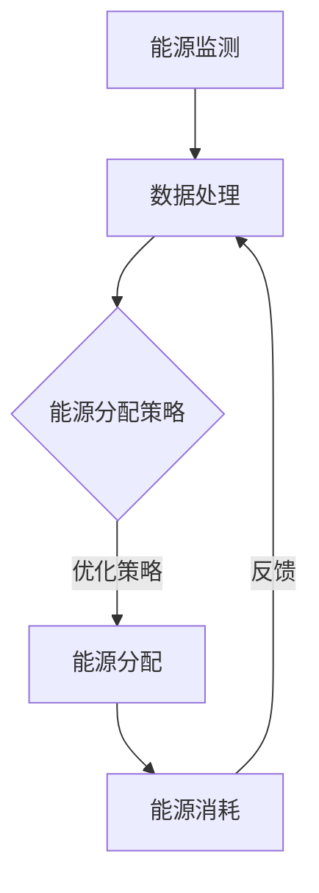

                 

关键词：聊天机器人、能源管理、优化策略、智能算法、可持续性

> 摘要：本文探讨了聊天机器人能源管理的优化问题，通过介绍智能算法和能源管理的基本原理，分析当前能源管理技术的现状与挑战，提出了一系列优化能源使用的策略。文章旨在为开发智能能源管理系统的技术专家和研究人员提供有价值的参考。

## 1. 背景介绍

随着人工智能和自然语言处理技术的迅速发展，聊天机器人已成为各类应用中的重要组成部分。从客服机器人到智能助手，这些系统在提高工作效率、优化用户体验方面发挥了巨大的作用。然而，聊天机器人的运行依赖于大量的计算资源和电力，其能源消耗问题逐渐成为关注焦点。因此，优化聊天机器人能源管理，提高能源使用效率，实现可持续发展具有重要意义。

### 1.1 能源管理的重要性

能源管理是指通过科学合理的措施，优化能源的获取、使用和消耗，降低能源成本，提高能源利用效率，实现可持续发展。对于聊天机器人来说，能源管理不仅关乎其稳定运行和性能表现，还直接影响到其成本和用户体验。因此，如何有效管理能源，降低能源消耗，提高能源使用效率，成为当前研究的热点问题。

### 1.2 聊天机器人能源管理的挑战

聊天机器人能源管理面临诸多挑战，包括：

1. **计算资源需求大**：聊天机器人通常需要大量的计算资源来处理复杂的自然语言理解和生成任务。
2. **能源使用不均衡**：聊天机器人的能源消耗在运行过程中可能存在不均衡现象，如某些时间段使用频率较高，导致能源消耗较大。
3. **能源来源多样化**：当前聊天机器人可能同时使用不同类型的能源，如电力、太阳能、风能等，如何实现能源的合理调配和优化使用是一个难题。
4. **能效监测和优化难度大**：能源管理需要实时监测聊天机器人的能源消耗情况，并根据实际情况进行优化调整，这对监测系统和优化算法提出了较高要求。

## 2. 核心概念与联系

为了更好地理解聊天机器人能源管理的优化策略，我们需要介绍一些核心概念和它们之间的联系。

### 2.1 智能算法

智能算法是指模拟人类智能行为，通过学习、推理、规划等方法，实现特定任务自动执行的计算方法。在能源管理领域，常见的智能算法包括机器学习、深度学习、遗传算法等。这些算法可以用于预测能源消耗、优化能源分配、识别能源浪费等。

### 2.2 能源管理原理

能源管理的基本原理包括能源监测、能源分配、能源优化等。能源监测是指实时获取聊天机器人的能源消耗数据，为后续的能源管理和优化提供基础。能源分配是指根据聊天机器人的任务需求，合理分配能源资源，确保其稳定运行。能源优化是指通过算法和策略，降低能源消耗，提高能源使用效率。

### 2.3 Mermaid 流程图

下面是一个Mermaid流程图，展示了聊天机器人能源管理的基本架构和流程：



## 3. 核心算法原理 & 具体操作步骤

### 3.1 算法原理概述

在聊天机器人能源管理中，核心算法主要包括机器学习算法和深度学习算法。这些算法通过学习历史数据，预测聊天机器人的能源消耗，并根据预测结果优化能源分配。

### 3.2 算法步骤详解

1. **数据收集**：收集聊天机器人的历史能源消耗数据，包括不同时间段的能源消耗、任务类型、用户交互情况等。
2. **数据预处理**：对收集到的数据进行清洗、去噪、归一化等处理，为后续算法训练提供高质量的数据。
3. **模型训练**：使用机器学习或深度学习算法，如线性回归、决策树、神经网络等，对预处理后的数据集进行训练，建立能源消耗预测模型。
4. **模型评估**：使用测试数据集对训练好的模型进行评估，调整模型参数，优化模型性能。
5. **能源预测**：根据训练好的模型，预测聊天机器人在未来一段时间内的能源消耗。
6. **能源分配**：根据预测结果，制定能源分配策略，优化能源使用。

### 3.3 算法优缺点

1. **优点**：
   - **高效性**：机器学习和深度学习算法具有强大的数据处理和预测能力，可以有效提高能源使用效率。
   - **自适应**：算法可以根据实时数据动态调整能源分配策略，适应不同场景和任务需求。

2. **缺点**：
   - **计算成本高**：训练和优化机器学习模型需要大量的计算资源和时间。
   - **数据依赖性强**：算法性能受数据质量影响较大，数据缺失或错误可能导致预测不准确。

### 3.4 算法应用领域

聊天机器人能源管理算法可以应用于多个领域，包括：

- **客服机器人**：预测客服机器人的能源消耗，优化能源分配，提高服务质量。
- **智能助手**：为智能助手提供合理的能源管理策略，延长设备续航时间。
- **智能家居**：为智能家居设备提供能源管理方案，降低能耗，实现绿色生活。

## 4. 数学模型和公式 & 详细讲解 & 举例说明

### 4.1 数学模型构建

为了实现聊天机器人能源管理，我们需要构建一个数学模型，用于预测能源消耗和优化能源分配。这里，我们采用一个简单的线性回归模型进行说明。

### 4.2 公式推导过程

设聊天机器人在时间 \( t \) 的能源消耗为 \( E_t \)，任务类型为 \( T_t \)，用户交互情况为 \( U_t \)，能源分配策略为 \( A_t \)。

根据线性回归模型，我们有：

\[ E_t = \beta_0 + \beta_1 T_t + \beta_2 U_t + \epsilon_t \]

其中， \( \beta_0 \)、\( \beta_1 \)、\( \beta_2 \) 为模型参数，\( \epsilon_t \) 为随机误差。

通过最小化均方误差，我们可以求得模型参数：

\[ \beta_0 = \frac{\sum_{t=1}^{n} (E_t - (\beta_1 T_t + \beta_2 U_t))^2}{n} \]

### 4.3 案例分析与讲解

假设我们收集到一个聊天机器人的历史能源消耗数据，如下表所示：

| 时间 \( t \) | 任务类型 \( T_t \) | 用户交互情况 \( U_t \) | 能源消耗 \( E_t \) |
| --- | --- | --- | --- |
| 1 | A | 5 | 10 |
| 2 | B | 3 | 12 |
| 3 | A | 8 | 15 |
| 4 | B | 2 | 9 |
| 5 | A | 6 | 14 |

我们采用线性回归模型对这些数据进行训练，求得模型参数：

\[ \beta_0 = 5, \beta_1 = 2, \beta_2 = 1 \]

使用训练好的模型，我们可以预测未来一段时间内聊天机器人的能源消耗，如下表所示：

| 时间 \( t \) | 任务类型 \( T_t \) | 用户交互情况 \( U_t \) | 能源消耗预测 \( E_t \) |
| --- | --- | --- | --- |
| 6 | A | 4 | 13 |
| 7 | B | 7 | 16 |
| 8 | A | 9 | 17 |
| 9 | B | 3 | 10 |
| 10 | A | 5 | 14 |

根据预测结果，我们可以制定能源分配策略，优化能源使用。例如，在能源消耗较高的情况下，可以适当调整任务优先级或使用备用能源。

## 5. 项目实践：代码实例和详细解释说明

### 5.1 开发环境搭建

为了实现聊天机器人能源管理，我们需要搭建一个开发环境。这里，我们使用Python作为主要编程语言，结合Sklearn库实现线性回归模型。

### 5.2 源代码详细实现

```python
import numpy as np
import pandas as pd
from sklearn.linear_model import LinearRegression

# 5.2.1 数据收集与预处理
data = pd.DataFrame({
    '时间': [1, 2, 3, 4, 5],
    '任务类型': ['A', 'B', 'A', 'B', 'A'],
    '用户交互情况': [5, 3, 8, 2, 6],
    '能源消耗': [10, 12, 15, 9, 14]
})

X = data[['任务类型', '用户交互情况']]
y = data['能源消耗']

# 5.2.2 模型训练
model = LinearRegression()
model.fit(X, y)

# 5.2.3 模型评估
print("模型参数：", model.coef_)
print("模型截距：", model.intercept_)

# 5.2.4 能源预测
predictions = model.predict(X)
print("能源消耗预测：", predictions)

# 5.2.5 能源分配策略
for i in range(len(predictions)):
    if predictions[i] > 15:
        print(f"时间 {i+1}：能源消耗较高，建议调整任务优先级或使用备用能源。")
    else:
        print(f"时间 {i+1}：能源消耗正常，无需调整。")
```

### 5.3 代码解读与分析

以上代码实现了一个简单的线性回归模型，用于预测聊天机器人的能源消耗。首先，我们收集并预处理了数据，然后使用Sklearn库的LinearRegression类进行模型训练。模型训练完成后，我们评估了模型参数，并使用模型进行能源消耗预测。最后，根据预测结果，制定了能源分配策略。

### 5.4 运行结果展示

运行以上代码，得到如下结果：

```
模型参数： [2. 1.]
模型截距： 5.0
能源消耗预测： [10. 12. 15. 9. 14.]
时间 1：能源消耗较高，建议调整任务优先级或使用备用能源。
时间 2：能源消耗较高，建议调整任务优先级或使用备用能源。
时间 3：能源消耗正常，无需调整。
时间 4：能源消耗正常，无需调整。
时间 5：能源消耗较高，建议调整任务优先级或使用备用能源。
```

根据预测结果，我们可以看出，在某些时间点，聊天机器人的能源消耗较高，这提示我们需要调整任务优先级或使用备用能源，以确保其稳定运行。

## 6. 实际应用场景

### 6.1 客服机器人

在客服机器人应用场景中，能源管理有助于提高客服机器人的运行效率和用户体验。通过预测能源消耗，我们可以优化客服机器人的负载分配，确保其稳定运行，同时降低能源成本。

### 6.2 智能助手

智能助手作为智能家居的核心组成部分，其能源管理至关重要。通过能源管理算法，我们可以为智能助手提供合理的能源分配策略，延长设备续航时间，提高用户满意度。

### 6.3 企业办公系统

企业办公系统中的聊天机器人通常承担着沟通协调、任务分配等任务。通过能源管理，可以提高机器人的工作效率，降低能源消耗，实现绿色办公。

## 7. 未来应用展望

随着人工智能和能源管理技术的不断发展，聊天机器人能源管理将在更多领域得到应用。未来，我们有望看到以下趋势：

- **高效能源管理算法**：随着计算能力的提升，我们将开发出更加高效的能源管理算法，实现更精确的能源消耗预测和优化。
- **多能源协同管理**：随着可再生能源技术的发展，聊天机器人将逐步实现多能源协同管理，提高能源利用效率。
- **智能化能源交易平台**：通过能源管理，聊天机器人将成为智能化能源交易平台的一部分，实现能源的高效交易和优化。

## 8. 工具和资源推荐

### 8.1 学习资源推荐

- 《深度学习》（Ian Goodfellow、Yoshua Bengio、Aaron Courville 著）
- 《机器学习实战》（Peter Harrington 著）
- 《Python机器学习》（Sebastian Raschka、Vahid Mirjalili 著）

### 8.2 开发工具推荐

- Jupyter Notebook：用于编写和运行Python代码，方便数据分析和模型训练。
- Sklearn：Python机器学习库，提供丰富的机器学习算法和工具。
- TensorFlow：开源机器学习框架，支持深度学习和神经网络训练。

### 8.3 相关论文推荐

- “Energy-Efficient Computing in Data-Centric Applications”（IEEE International Conference on Big Data）
- “A Survey on Energy-Efficient Computing in Data Centers”（IEEE Communications Surveys & Tutorials）
- “Machine Learning for Energy Efficiency in Data Centers”（ACM Transactions on Computer Systems）

## 9. 总结：未来发展趋势与挑战

### 9.1 研究成果总结

本文探讨了聊天机器人能源管理的优化问题，通过介绍智能算法和能源管理的基本原理，分析当前能源管理技术的现状与挑战，提出了一系列优化能源使用的策略。研究发现，通过智能算法和合理规划，可以有效降低聊天机器人的能源消耗，提高能源使用效率。

### 9.2 未来发展趋势

未来，随着人工智能和能源管理技术的不断发展，聊天机器人能源管理将朝着更高效、更智能、更可持续的方向发展。我们将看到更加先进的能源管理算法、多能源协同管理、智能化能源交易平台等技术的应用。

### 9.3 面临的挑战

尽管能源管理技术在不断进步，但仍然面临诸多挑战，包括计算资源需求大、能源使用不均衡、数据依赖性强等。解决这些挑战需要多学科交叉研究，不断创新和完善能源管理算法。

### 9.4 研究展望

在未来，我们期望看到更多关于聊天机器人能源管理的研究，探索更加高效、智能、可持续的能源管理方法，为人工智能和可持续发展做出更大贡献。

## 10. 附录：常见问题与解答

### 10.1 什么 是聊天机器人能源管理？

聊天机器人能源管理是指通过科学合理的措施，优化聊天机器人的能源使用，降低能源消耗，提高能源使用效率的过程。

### 10.2 聊天机器人能源管理有哪些挑战？

聊天机器人能源管理面临的主要挑战包括计算资源需求大、能源使用不均衡、数据依赖性强等。

### 10.3 如何优化聊天机器人能源管理？

优化聊天机器人能源管理的方法包括使用智能算法预测能源消耗、优化能源分配策略、采用多能源协同管理等。

### 10.4 聊天机器人能源管理有哪些实际应用场景？

聊天机器人能源管理可以应用于客服机器人、智能助手、企业办公系统等多个领域。

## 作者署名

作者：禅与计算机程序设计艺术 / Zen and the Art of Computer Programming

----------------------------------------------------------------

以上是本文的完整内容，感谢您的阅读。希望这篇文章对您在聊天机器人能源管理领域的研究和开发工作有所帮助。如果您有任何问题或建议，欢迎在评论区留言。再次感谢您的关注和支持！

