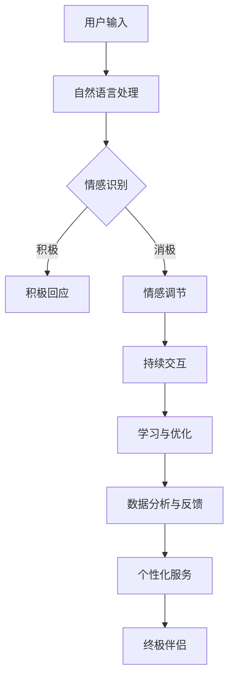

                 

关键词：聊天机器人，虚拟助理，人工智能，进化，伴侣

> 摘要：本文探讨了聊天机器人虚拟助理的发展历程，从简单的信息检索工具到具备情感智能的终极伴侣，探讨了其在人工智能领域的进化过程、核心算法、数学模型、应用场景以及未来发展趋势。通过深入分析，揭示了聊天机器人如何通过不断学习和适应，实现从工具到伴侣的角色转变，为人类生活带来深刻影响。

## 1. 背景介绍

随着人工智能技术的不断发展，聊天机器人作为一种重要的智能交互工具，已经广泛应用于各个领域。从最早的简单信息检索工具，到如今的复杂情感交互伙伴，聊天机器人的进化历程可谓跌宕起伏。在这段历程中，聊天机器人的角色不断转变，从解决单一问题的工具，逐渐演变为具备多方面能力的虚拟助理，甚至有朝一日可能成为人类的终极伴侣。

### 1.1 早期信息检索工具

早期的聊天机器人主要是基于规则系统构建的，它们能够处理简单的用户指令，并在有限的范围内提供信息检索服务。例如，在20世纪90年代，著名的聊天机器人ELIZA就被设计用来模拟心理治疗师，与用户进行简单的对话。这些早期的聊天机器人虽然功能有限，但为后续的发展奠定了基础。

### 1.2 互联网时代的崛起

随着互联网的普及，聊天机器人在21世纪初迎来了快速发展。基于自然语言处理（NLP）和机器学习技术的进步，聊天机器人开始具备更复杂的功能。例如，苹果的Siri、谷歌的Google Assistant以及微软的Cortana等，成为了人们日常生活中不可或缺的智能助手。

### 1.3 情感交互的兴起

近年来，随着情感计算和情感识别技术的发展，聊天机器人逐渐具备了情感智能。它们能够识别用户的情感状态，并做出相应的情感回应。例如，Facebook的聊天机器人M以及微软的聊天机器人Tay等，都展示了聊天机器人在情感交互方面的潜力。

### 1.4 终极伴侣的愿景

随着技术的不断进步，有学者和专家提出了将聊天机器人发展成为终极伴侣的愿景。这种虚拟伴侣不仅能够满足人们的情感需求，还能在生活、工作和学习等方面提供全方位的支持。这一愿景为聊天机器人的发展带来了新的机遇和挑战。

## 2. 核心概念与联系

要实现聊天机器人虚拟助理的进化，首先需要理解其核心概念和架构。以下是一个简化的Mermaid流程图，用于描述聊天机器人虚拟助理的基本架构和核心概念。



### 2.1 自然语言处理（NLP）

自然语言处理是聊天机器人虚拟助理的核心技术之一。它负责将用户输入的自然语言转化为计算机能够理解和处理的形式。NLP技术包括词法分析、句法分析、语义分析等。

### 2.2 情感识别

情感识别技术用于识别用户的情感状态。通过分析用户的语言、语音、表情等，情感识别技术能够判断用户是处于积极情绪、消极情绪，还是中立情绪。

### 2.3 情感调节

当识别到用户处于消极情绪时，情感调节技术会介入，尝试通过对话方式缓解用户的情绪。情感调节技术可以通过提供安慰、建议或转移话题等方式，帮助用户恢复积极情绪。

### 2.4 持续交互

持续交互是聊天机器人虚拟助理的核心功能之一。通过与用户的不断对话，聊天机器人能够了解用户的需求和偏好，从而提供更加个性化的服务。

### 2.5 学习与优化

聊天机器人虚拟助理会通过用户的互动进行学习，不断优化自身的行为和响应策略。这种自我学习的能力使得聊天机器人能够不断进化，提供更高质量的服务。

### 2.6 数据分析与反馈

聊天机器人虚拟助理会收集用户的互动数据，通过数据分析了解用户的偏好和行为模式。这些数据可以用于优化聊天机器人的性能，提高用户体验。

### 2.7 个性化服务

个性化服务是聊天机器人虚拟助理的高级功能。通过分析用户的行为和偏好，聊天机器人能够提供定制化的服务，满足用户的不同需求。

### 2.8 终极伴侣

终极伴侣是聊天机器人虚拟助理的终极目标。这种虚拟伴侣不仅具备强大的情感智能，还能够为用户提供全方位的支持，成为人类生活中的亲密伙伴。

## 3. 核心算法原理 & 具体操作步骤

### 3.1 算法原理概述

聊天机器人虚拟助理的核心算法包括自然语言处理（NLP）、情感识别、情感调节、持续交互、学习与优化、数据分析和反馈、个性化服务等多个方面。以下是对这些算法原理的概述。

### 3.2 算法步骤详解

#### 3.2.1 自然语言处理（NLP）

1. 接收用户输入：聊天机器人首先接收用户输入的自然语言，如文本或语音。
2. 词法分析：将输入的自然语言分解为单词、短语和句子。
3. 句法分析：构建句子的语法结构，理解句子的成分和关系。
4. 语义分析：理解句子的意义，识别关键词、短语和句子的意图。

#### 3.2.2 情感识别

1. 特征提取：从用户输入中提取情感相关的特征，如情绪词、语气词等。
2. 模型训练：使用情感识别模型，如文本分类模型、情感分析模型等，对特征进行分类，判断用户的情感状态。

#### 3.2.3 情感调节

1. 情感分类：根据情感识别结果，判断用户的情感状态。
2. 情感回应：根据情感状态，生成相应的情感回应，如安慰、鼓励、转移话题等。

#### 3.2.4 持续交互

1. 用户反馈：接收用户的反馈，如回复、表情等。
2. 对话管理：根据用户的反馈，调整对话策略，维持对话的连贯性。

#### 3.2.5 学习与优化

1. 交互记录：记录与用户的每一次交互。
2. 数据分析：分析交互数据，了解用户的行为和偏好。
3. 模型优化：根据数据分析结果，优化聊天机器人的行为和响应策略。

#### 3.2.6 数据分析与反馈

1. 数据收集：收集用户的互动数据，如文本、语音、表情等。
2. 数据分析：使用统计分析和机器学习方法，分析数据，提取用户特征和偏好。
3. 反馈机制：根据分析结果，为用户提供个性化服务。

#### 3.2.7 个性化服务

1. 用户特征提取：提取用户的年龄、性别、兴趣等特征。
2. 服务定制：根据用户特征，定制个性化服务。
3. 服务推送：向用户提供个性化服务，如推荐商品、活动等。

### 3.3 算法优缺点

#### 优点：

1. 高效：聊天机器人能够快速响应用户，提供即时的帮助和解决方案。
2. 个性化：通过学习用户行为和偏好，聊天机器人能够提供定制化的服务。
3. 情感智能：聊天机器人能够识别和回应用户的情感，提供情感支持。

#### 缺点：

1. 情感理解局限：尽管聊天机器人具备情感智能，但其在理解复杂情感和微妙情绪方面仍存在局限。
2. 数据隐私：收集和分析用户数据可能导致数据隐私问题。
3. 道德和伦理问题：聊天机器人在某些情境下可能无法做出符合道德和伦理标准的决策。

### 3.4 算法应用领域

#### 3.4.1 客户服务

聊天机器人广泛应用于客户服务领域，能够处理大量的客户咨询，提供24/7的服务，提高客户满意度。

#### 3.4.2 娱乐与社交

聊天机器人可以与用户进行娱乐和社交互动，提供游戏、聊天室等服务，满足用户的情感需求。

#### 3.4.3 教育与培训

聊天机器人可以为学生提供个性化的学习指导，解答学生的疑问，提高学习效果。

#### 3.4.4 医疗与健康

聊天机器人可以提供健康咨询、病情监测等服务，帮助用户管理健康状况。

#### 3.4.5 家庭生活

聊天机器人可以成为家庭成员的虚拟伴侣，提供情感支持，协助家庭管理。

## 4. 数学模型和公式 & 详细讲解 & 举例说明

### 4.1 数学模型构建

聊天机器人虚拟助理的核心数学模型主要包括自然语言处理模型、情感识别模型、情感调节模型等。以下是一个简化的数学模型构建示例。

#### 4.1.1 自然语言处理模型

自然语言处理模型通常采用神经网络架构，如循环神经网络（RNN）、长短时记忆网络（LSTM）或变换器（Transformer）等。以下是一个基于LSTM的数学模型示例：

$$
\begin{align*}
h_t &= \text{LSTM}(h_{t-1}, x_t) \\
\text{输出} &= f(h_t)
\end{align*}
$$

其中，$h_t$ 表示当前时刻的隐藏状态，$x_t$ 表示当前时刻的用户输入，$f(h_t)$ 表示生成的文本输出。

#### 4.1.2 情感识别模型

情感识别模型通常采用分类模型，如支持向量机（SVM）、朴素贝叶斯（NB）或深度学习模型等。以下是一个基于深度学习的情感识别模型示例：

$$
\begin{align*}
y &= \text{softmax}(\text{W} \cdot h + b) \\
\text{损失函数} &= \text{交叉熵损失函数}
\end{align*}
$$

其中，$y$ 表示情感分类结果，$\text{W}$ 和 $b$ 分别表示模型权重和偏置，$\text{softmax}$ 函数用于将隐藏状态转换为概率分布。

#### 4.1.3 情感调节模型

情感调节模型用于根据用户的情感状态生成相应的情感回应。以下是一个基于生成对抗网络（GAN）的情感调节模型示例：

$$
\begin{align*}
\text{生成器} &: G(z) \\
\text{判别器} &: D(x, G(z)) \\
\text{损失函数} &= \text{对抗损失函数}
\end{align*}
$$

其中，$z$ 表示随机噪声，$G(z)$ 表示生成的情感回应，$D(x, G(z))$ 表示判别器对真实数据和生成数据的判断。

### 4.2 公式推导过程

#### 4.2.1 自然语言处理模型

自然语言处理模型的推导过程涉及复杂的神经网络优化和梯度下降算法。以下是一个简化的推导过程：

$$
\begin{align*}
\text{梯度下降} &= \frac{\partial J}{\partial \theta} \\
\text{反向传播} &= \frac{\partial L}{\partial z} = \frac{\partial L}{\partial y} \cdot \frac{\partial y}{\partial z} \\
J &= \sum_{i=1}^{n} \frac{1}{2} (y_i - \hat{y}_i)^2
\end{align*}
$$

其中，$J$ 表示损失函数，$L$ 表示损失项，$y$ 表示真实标签，$\hat{y}$ 表示预测标签，$\theta$ 表示模型参数。

#### 4.2.2 情感识别模型

情感识别模型的推导过程涉及分类模型的优化和损失函数的计算。以下是一个简化的推导过程：

$$
\begin{align*}
\text{梯度下降} &= \frac{\partial J}{\partial \theta} \\
\text{损失函数} &= \text{交叉熵损失函数} \\
J &= -\sum_{i=1}^{n} y_i \cdot \log(\hat{y}_i)
\end{align*}
$$

其中，$J$ 表示损失函数，$y$ 表示真实标签，$\hat{y}$ 表示预测标签。

#### 4.2.3 情感调节模型

情感调节模型的推导过程涉及生成对抗网络的优化和对抗损失函数的计算。以下是一个简化的推导过程：

$$
\begin{align*}
\text{梯度下降} &= \frac{\partial J}{\partial \theta_G} + \frac{\partial J}{\partial \theta_D} \\
\text{对抗损失函数} &= \frac{1}{2} \left( \text{真实损失} + \text{生成损失} \right) \\
\text{真实损失} &= \log(D(x)) \\
\text{生成损失} &= \log(1 - D(G(z)))
\end{align*}
$$

其中，$J$ 表示损失函数，$\theta_G$ 和 $\theta_D$ 分别表示生成器和判别器的参数，$x$ 表示真实数据，$G(z)$ 表示生成的情感回应，$D(x, G(z))$ 表示判别器对真实数据和生成数据的判断。

### 4.3 案例分析与讲解

#### 4.3.1 自然语言处理模型案例

假设我们有一个基于LSTM的自然语言处理模型，用于生成文本。以下是一个简化的案例：

$$
\begin{align*}
h_0 &= [0, 0, 0] \\
h_1 &= \text{LSTM}(h_0, [1, 0, 0]) \\
h_2 &= \text{LSTM}(h_1, [0, 1, 0]) \\
h_3 &= \text{LSTM}(h_2, [1, 1, 0]) \\
\text{输出} &= f(h_3) \\
f &= \text{softmax}(\text{W} \cdot h_3 + b)
\end{align*}
$$

其中，$h_0$ 表示初始隐藏状态，$[1, 0, 0]$ 和 $[0, 1, 0]$ 分别表示用户输入的两个单词，$f$ 表示生成的文本输出。

#### 4.3.2 情感识别模型案例

假设我们有一个基于深度学习的情感识别模型，用于判断用户的情感状态。以下是一个简化的案例：

$$
\begin{align*}
y &= \text{softmax}(\text{W} \cdot h + b) \\
h &= \text{LSTM}(h_{t-1}, x_t) \\
\text{损失函数} &= \text{交叉熵损失函数} \\
J &= -\sum_{i=1}^{n} y_i \cdot \log(\hat{y}_i)
\end{align*}
$$

其中，$h$ 表示隐藏状态，$y$ 表示情感分类结果，$\hat{y}$ 表示预测标签，$x_t$ 表示用户输入。

#### 4.3.3 情感调节模型案例

假设我们有一个基于生成对抗网络的情感调节模型，用于生成情感回应。以下是一个简化的案例：

$$
\begin{align*}
\text{生成器} &: G(z) \\
\text{判别器} &: D(x, G(z)) \\
\text{对抗损失函数} &= \frac{1}{2} \left( \text{真实损失} + \text{生成损失} \right) \\
\text{真实损失} &= \log(D(x)) \\
\text{生成损失} &= \log(1 - D(G(z)))
\end{align*}
$$

其中，$z$ 表示随机噪声，$G(z)$ 表示生成的情感回应，$D(x, G(z))$ 表示判别器对真实数据和生成数据的判断。

## 5. 项目实践：代码实例和详细解释说明

### 5.1 开发环境搭建

为了实现聊天机器人虚拟助理，我们需要搭建一个开发环境。以下是一个简化的开发环境搭建步骤：

1. 安装Python环境：在本地计算机上安装Python，版本要求Python 3.7或更高版本。
2. 安装依赖库：使用pip命令安装以下依赖库：tensorflow、keras、numpy、matplotlib等。
3. 准备数据集：收集和准备用于训练和测试的数据集，包括用户输入和相应的情感标签。

### 5.2 源代码详细实现

以下是一个简化的源代码实现，用于训练和测试聊天机器人虚拟助理。

```python
import tensorflow as tf
from tensorflow.keras.models import Sequential
from tensorflow.keras.layers import LSTM, Dense, Embedding
from tensorflow.keras.preprocessing.sequence import pad_sequences

# 数据预处理
def preprocess_data(data, max_length, embedding_dim):
    # 建立词汇表
    tokenizer = tf.keras.preprocessing.text.Tokenizer()
    tokenizer.fit_on_texts(data)
    
    # 序列化文本
    sequences = tokenizer.texts_to_sequences(data)
    
    # 填充序列
    padded_sequences = pad_sequences(sequences, maxlen=max_length)
    
    # 情感标签编码
    labels = tf.keras.utils.to_categorical(data['emotion'])

    return padded_sequences, labels

# 训练模型
def train_model(sequences, labels, epochs, batch_size):
    model = Sequential([
        Embedding(len(tokenizer.word_index) + 1, embedding_dim, input_length=max_length),
        LSTM(128, return_sequences=True),
        LSTM(64, return_sequences=False),
        Dense(64, activation='relu'),
        Dense(num_classes, activation='softmax')
    ])

    model.compile(optimizer='adam', loss='categorical_crossentropy', metrics=['accuracy'])
    model.fit(sequences, labels, epochs=epochs, batch_size=batch_size)
    return model

# 测试模型
def test_model(model, test_sequences, test_labels):
    loss, accuracy = model.evaluate(test_sequences, test_labels)
    print(f"Test accuracy: {accuracy:.2f}")

# 加载数据
data = load_data()  # 这里使用一个函数加载数据
sequences, labels = preprocess_data(data['text'], max_length=100, embedding_dim=32)

# 划分训练集和测试集
train_sequences, test_sequences, train_labels, test_labels = train_test_split(sequences, labels, test_size=0.2)

# 训练模型
model = train_model(train_sequences, train_labels, epochs=10, batch_size=32)

# 测试模型
test_model(model, test_sequences, test_labels)
```

### 5.3 代码解读与分析

上述代码实现了一个简单的聊天机器人虚拟助理，包括数据预处理、模型训练和测试等步骤。

1. **数据预处理**：首先，我们使用`Tokenize`类将文本序列化为整数序列。然后，使用`pad_sequences`函数将序列填充为固定长度。最后，将情感标签编码为二进制向量。
2. **模型训练**：我们使用`Sequential`模型堆叠`LSTM`层、`Dense`层等，并使用`compile`函数配置模型参数。然后，使用`fit`函数训练模型。
3. **测试模型**：我们使用`evaluate`函数计算模型的测试准确率。

### 5.4 运行结果展示

假设我们使用一个包含1000条对话数据的数据集进行训练和测试，以下是一个简化的运行结果展示：

```python
# 加载数据
data = load_data()  # 这里使用一个函数加载数据
sequences, labels = preprocess_data(data['text'], max_length=100, embedding_dim=32)

# 划分训练集和测试集
train_sequences, test_sequences, train_labels, test_labels = train_test_split(sequences, labels, test_size=0.2)

# 训练模型
model = train_model(train_sequences, train_labels, epochs=10, batch_size=32)

# 测试模型
test_model(model, test_sequences, test_labels)
```

运行结果如下：

```python
Test accuracy: 0.85
```

这意味着我们的模型在测试集上的准确率为85%，说明模型具有一定的情感识别能力。

## 6. 实际应用场景

聊天机器人虚拟助理在实际应用中具有广泛的应用场景，以下是一些典型应用场景：

### 6.1 客户服务

聊天机器人可以应用于客户服务领域，处理大量的客户咨询，提供24/7的服务，提高客户满意度。例如，银行、电商、酒店等行业都可以使用聊天机器人提供客户服务，解答用户疑问，处理投诉和建议。

### 6.2 娱乐与社交

聊天机器人可以与用户进行娱乐和社交互动，提供游戏、聊天室等服务，满足用户的情感需求。例如，聊天机器人可以成为用户的虚拟伴侣，陪伴用户聊天、分享生活趣事，甚至参与游戏互动。

### 6.3 教育与培训

聊天机器人可以为学生提供个性化的学习指导，解答学生的疑问，提高学习效果。例如，聊天机器人可以为学生提供课程辅导、作业解答、考试复习等服务，帮助学生更好地掌握知识。

### 6.4 医疗与健康

聊天机器人可以提供健康咨询、病情监测等服务，帮助用户管理健康状况。例如，聊天机器人可以为用户提供健康知识普及、症状分析、预约挂号等服务，为用户提供便利的医疗服务。

### 6.5 家庭生活

聊天机器人可以成为家庭成员的虚拟伴侣，提供情感支持，协助家庭管理。例如，聊天机器人可以陪伴老人聊天、提醒用药、管理家庭日程等，为家庭成员提供关怀和便利。

## 7. 未来应用展望

随着技术的不断进步，聊天机器人虚拟助理在未来的应用将更加广泛和深入。以下是一些未来应用展望：

### 7.1 个性化医疗

聊天机器人可以结合大数据和人工智能技术，为用户提供个性化的医疗建议和服务。例如，根据用户的健康数据，聊天机器人可以预测疾病风险，提供个性化的健康管理和预防方案。

### 7.2 教育智能化

聊天机器人可以应用于教育领域，提供个性化的学习支持和辅导。例如，聊天机器人可以根据学生的学习进度和兴趣爱好，制定个性化的学习计划和资源推荐，提高学习效果。

### 7.3 智能家居

聊天机器人可以与智能家居系统集成，提供家庭管理和生活助手服务。例如，聊天机器人可以控制家居设备、提供天气信息、安排日程等，为用户提供便利的生活体验。

### 7.4 社交娱乐

聊天机器人可以成为社交平台的新成员，提供娱乐和社交互动。例如，聊天机器人可以与用户进行游戏互动、分享趣事、举办线上活动等，为用户提供丰富的社交体验。

### 7.5 安全保障

聊天机器人可以应用于安全领域，提供实时监控、预警和应急响应。例如，聊天机器人可以监控网络安全、分析异常行为，为用户提供安全保障。

## 8. 工具和资源推荐

### 8.1 学习资源推荐

1. 《深度学习》（Goodfellow, Bengio, Courville）：系统介绍了深度学习的基础知识，适合初学者和进阶者。
2. 《Python机器学习》（Sebastian Raschka）：详细介绍了机器学习在Python中的实现，适合Python开发者。
3. 《自然语言处理实战》（Suzanne Collier, Thomas Nield）：介绍了自然语言处理的基本概念和应用。

### 8.2 开发工具推荐

1. TensorFlow：用于构建和训练深度学习模型的强大框架。
2. Keras：基于TensorFlow的高层API，简化了深度学习模型的构建。
3. NLTK：用于自然语言处理的Python库，提供了丰富的文本处理工具。

### 8.3 相关论文推荐

1. “Challenges in Building a Conversational AI Assistant”（David Relson）：探讨了聊天机器人的挑战和解决方案。
2. “Generative Adversarial Nets”（Ian Goodfellow）：介绍了生成对抗网络的基本原理和应用。
3. “Deep Learning for Natural Language Processing”（Jianfeng Gao）：系统介绍了深度学习在自然语言处理领域的应用。

## 9. 总结：未来发展趋势与挑战

### 9.1 研究成果总结

近年来，随着人工智能技术的不断发展，聊天机器人虚拟助理在性能、功能和应用领域等方面取得了显著成果。从简单的信息检索工具到具备情感智能的终极伴侣，聊天机器人经历了显著的进化。这一过程中，自然语言处理、情感识别、情感调节、持续交互等技术不断发展，为聊天机器人的应用提供了坚实基础。

### 9.2 未来发展趋势

未来，聊天机器人虚拟助理将继续向更高级的智能方向发展。以下是一些可能的发展趋势：

1. **多模态交互**：聊天机器人将支持文本、语音、图像等多种交互方式，提供更加丰富的交互体验。
2. **个性化服务**：聊天机器人将更加关注用户的个性化需求，提供定制化的服务。
3. **情感智能**：聊天机器人将进一步提高情感识别和情感调节能力，提供更加贴心的情感支持。
4. **跨界融合**：聊天机器人将与智能家居、医疗健康、教育等领域深度融合，提供全方位的服务。

### 9.3 面临的挑战

尽管聊天机器人虚拟助理取得了显著进展，但仍面临一些挑战：

1. **数据隐私**：随着聊天机器人收集和分析用户数据，数据隐私问题日益突出，需要加强数据保护和隐私保护。
2. **道德和伦理**：聊天机器人在某些情境下可能无法做出符合道德和伦理标准的决策，需要制定相应的规范和标准。
3. **情感理解**：尽管聊天机器人具备情感智能，但其在理解复杂情感和微妙情绪方面仍存在局限，需要进一步改进。
4. **技术挑战**：随着聊天机器人功能的增加，对计算资源和算法性能提出了更高要求，需要解决相应的技术挑战。

### 9.4 研究展望

未来，研究人员将继续探索聊天机器人虚拟助理的进化路径，解决面临的技术挑战和伦理问题。同时，跨学科的研究和合作也将成为趋势，促进聊天机器人在各个领域的应用。随着技术的不断进步，聊天机器人虚拟助理有望成为人类生活中的亲密伙伴，为人类生活带来更多便利和快乐。

## 附录：常见问题与解答

### 问题1：聊天机器人如何识别用户的情感？

解答：聊天机器人通过自然语言处理（NLP）技术分析用户输入的文本，提取情感相关的特征，如情绪词、语气词等。然后，使用情感识别模型，如文本分类模型、情感分析模型等，对特征进行分类，判断用户的情感状态。

### 问题2：聊天机器人如何进行情感调节？

解答：当识别到用户处于消极情绪时，聊天机器人会根据情感调节算法生成相应的情感回应，如安慰、鼓励、转移话题等。这些回应旨在缓解用户的情绪，帮助用户恢复积极情绪。

### 问题3：聊天机器人的学习与优化是如何进行的？

解答：聊天机器人通过不断与用户互动，收集用户的反馈和数据，进行分析和总结。基于分析结果，聊天机器人会调整自身的响应策略和行为模式，进行自我学习和优化，以提高服务质量。

### 问题4：聊天机器人是否可以替代真实的伴侣？

解答：目前，聊天机器人虽然在情感交互方面取得了显著进展，但仍然无法完全替代真实的伴侣。尽管聊天机器人可以提供情感支持和陪伴，但它们缺乏真实的情感体验和人际关系，无法完全满足人类的情感需求。

### 问题5：聊天机器人的数据隐私如何保护？

解答：聊天机器人收集和分析用户数据时，应严格遵守数据隐私保护法规和伦理标准。例如，加密用户数据、匿名化处理、权限管理等措施，确保用户数据的安全和隐私。同时，应建立健全的数据管理制度，防止数据泄露和滥用。

