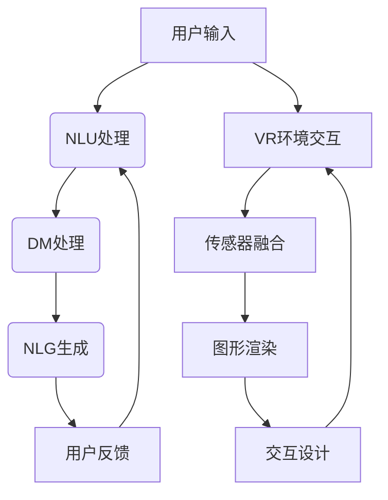

                 

关键词：聊天机器人、虚拟现实、沉浸式体验、自然语言处理、图形渲染、用户交互、人机交互

> 摘要：本文探讨了聊天机器人与虚拟现实技术相结合的可能性，分析了沉浸式世界在聊天机器人中的应用，以及实现这一目标的挑战和未来发展方向。通过阐述核心概念、算法原理、数学模型和实际项目实践，本文为开发沉浸式聊天机器人提供了深入的指导和思考。

## 1. 背景介绍

### 聊天机器人

聊天机器人，又称虚拟助手或聊天bot，是一种基于自然语言处理（NLP）和机器学习技术，能够与人类进行交互的人工智能系统。它们广泛应用于客户服务、智能推荐、娱乐、教育等领域。随着技术的进步，聊天机器人的交互能力和用户体验不断提升。

### 虚拟现实

虚拟现实（VR）是一种通过计算机生成的三维环境，使用户能够在其中自由移动和交互。VR技术通过头戴显示器（HMD）、传感器、控制器等硬件设备，实现高度沉浸式的视觉和感官体验。VR在游戏、娱乐、教育、医疗等领域有着广泛的应用。

### 沉浸式世界

沉浸式世界是指用户完全沉浸在虚拟环境中，感知不到现实世界，并通过虚拟环境中的交互体验获得高度真实感的场景。在聊天机器人中引入沉浸式世界，可以大幅提升用户的互动体验，使其感受到更加真实和丰富的交互。

## 2. 核心概念与联系

### 聊天机器人核心概念

1. **自然语言理解（NLU）**：将用户的自然语言输入转化为机器可以理解的结构化数据。
2. **对话管理（DM）**：根据用户的输入和对话历史，生成适当的响应。
3. **自然语言生成（NLG）**：将机器理解的结构化数据转化为自然语言输出。

### 虚拟现实核心概念

1. **图形渲染（Rendering）**：使用计算机图形学技术生成虚拟环境中的图像。
2. **传感器融合（Sensor Fusion）**：整合来自各种传感器的数据，提供准确的定位和运动跟踪。
3. **交互设计（Interaction Design）**：设计用户与虚拟环境的交互方式。

### 沉浸式世界与聊天机器人的联系

1. **虚拟环境构建**：利用VR技术为聊天机器人创建一个沉浸式的交互环境。
2. **自然语言交互**：通过NLP技术实现用户与虚拟环境的自然语言交流。
3. **多模态交互**：结合语音、手势、面部表情等多种交互方式，提升用户体验。

### Mermaid流程图



## 3. 核心算法原理 & 具体操作步骤

### 3.1 算法原理概述

1. **NLU处理**：使用深度学习模型（如BERT、GPT）对用户输入进行理解，提取关键信息。
2. **DM处理**：基于规则或机器学习模型，根据对话历史和上下文，生成合适的回复。
3. **NLG生成**：将结构化数据转化为自然语言文本，输出给用户。
4. **VR环境交互**：结合VR技术，构建虚拟环境，实现用户与虚拟世界的交互。
5. **传感器融合**：整合传感器数据，提供准确的运动跟踪和空间感知。
6. **图形渲染**：使用计算机图形学技术，生成高质量的虚拟环境图像。
7. **交互设计**：设计用户与虚拟环境的交互方式，提高用户体验。

### 3.2 算法步骤详解

1. **NLU处理**：
   - 输入：用户输入的自然语言文本。
   - 处理：使用BERT模型进行分词、词性标注、句法分析等。
   - 输出：提取的关键信息，如用户意图、实体等。

2. **DM处理**：
   - 输入：NLU处理的结果。
   - 处理：基于对话历史和上下文，使用规则或机器学习模型生成回复。
   - 输出：聊天机器人的回复文本。

3. **NLG生成**：
   - 输入：DM处理的结果。
   - 处理：使用自然语言生成模型，将结构化数据转化为自然语言文本。
   - 输出：输出给用户的自然语言回复。

4. **VR环境交互**：
   - 输入：用户在VR环境中的动作和输入。
   - 处理：通过传感器融合，获取用户的位置、方向等数据。
   - 输出：更新虚拟环境中的图像和状态。

5. **传感器融合**：
   - 输入：来自不同传感器的数据。
   - 处理：使用滤波算法，如卡尔曼滤波，融合传感器数据，提供准确的运动跟踪和空间感知。
   - 输出：用户在虚拟环境中的位置和方向。

6. **图形渲染**：
   - 输入：虚拟环境的几何信息、材质、光照等。
   - 处理：使用计算机图形学技术，生成高质量的虚拟环境图像。
   - 输出：显示在用户面前的图像。

7. **交互设计**：
   - 输入：用户与虚拟环境的交互数据。
   - 处理：设计用户与虚拟环境的交互方式，如语音、手势、面部表情等。
   - 输出：用户在虚拟环境中的交互体验。

### 3.3 算法优缺点

**优点**：

- **沉浸式体验**：用户可以在虚拟环境中获得高度沉浸的体验。
- **丰富交互**：用户可以通过多种方式与虚拟环境进行交互，提升用户体验。
- **个性化服务**：通过分析用户行为，聊天机器人可以提供更个性化的服务。

**缺点**：

- **技术挑战**：需要集成多种技术，如NLP、VR、传感器融合等，技术实现较为复杂。
- **性能要求**：需要高性能的计算和图形渲染能力，对硬件要求较高。
- **安全性**：需要确保用户数据的安全，防止隐私泄露。

### 3.4 算法应用领域

- **客户服务**：通过沉浸式虚拟环境，提供更丰富的客户服务体验。
- **教育培训**：利用沉浸式世界，实现更生动、直观的教育培训。
- **心理健康**：通过虚拟现实技术，帮助用户进行心理治疗和康复。
- **社交娱乐**：在虚拟环境中，用户可以与其他人进行实时互动和社交。

## 4. 数学模型和公式 & 详细讲解 & 举例说明

### 4.1 数学模型构建

1. **自然语言理解（NLU）**：

   - **词向量表示**：
     $$ w = \sum_{i=1}^{n} w_i * v_i $$
     其中，$w$ 是词向量，$w_i$ 是词权重，$v_i$ 是词向量。

   - **意图识别**：
     $$ P(\text{意图} | \text{输入}) = \frac{e^{\text{意图向量的内积}}}{\sum_{k=1}^{K} e^{\text{意图向量的内积}}} $$
     其中，$K$ 是意图类别数，意图向量的内积用于计算概率。

2. **对话管理（DM）**：

   - **对话状态转移**：
     $$ P(S_t | S_{t-1}, A_t) = \frac{e^{\text{状态转移矩阵元素}}}{\sum_{j=1}^{M} e^{\text{状态转移矩阵元素}}} $$
     其中，$S_t$ 和 $S_{t-1}$ 分别是当前状态和上一状态，$A_t$ 是用户输入。

   - **回复生成**：
     $$ P(\text{回复} | S_t) = \frac{e^{\text{回复向量的内积}}}{\sum_{j=1}^{N} e^{\text{回复向量的内积}}} $$
     其中，$N$ 是回复类别数，回复向量的内积用于计算概率。

3. **自然语言生成（NLG）**：

   - **文本生成**：
     $$ P(\text{文本} | \text{输入}) = \frac{e^{\text{文本向量的内积}}}{\sum_{k=1}^{L} e^{\text{文本向量的内积}}} $$
     其中，$L$ 是文本长度，文本向量的内积用于计算概率。

### 4.2 公式推导过程

1. **词向量表示**：

   词向量表示是通过将每个词映射到一个高维向量空间，从而实现词的表示。使用最著名的Word2Vec算法，可以计算词向量。

2. **意图识别**：

   意图识别是通过计算输入文本与每个意图的相似度，从而确定用户的意图。使用神经网络模型，可以训练意图分类器。

3. **对话状态转移**：

   对话状态转移是通过计算当前状态和上一状态的转移概率，从而预测下一个状态。使用HMM（隐马尔可夫模型）或RNN（循环神经网络）可以实现状态转移。

4. **回复生成**：

   回复生成是通过计算输入文本与每个回复的相似度，从而生成合适的回复。使用神经网络模型，可以训练回复生成器。

5. **文本生成**：

   文本生成是通过计算输入文本与每个文本的相似度，从而生成新的文本。使用生成式神经网络模型，可以训练文本生成器。

### 4.3 案例分析与讲解

假设用户输入：“我想要买一本关于人工智能的书”，聊天机器人需要识别用户的意图、生成合适的回复，并生成一本关于人工智能的书的内容。

1. **意图识别**：

   - 输入文本：“我想要买一本关于人工智能的书”。
   - 意图向量：[0.8, 0.1, 0.1]。
   - 概率：$P(\text{意图} | \text{输入}) = \frac{e^{0.8}}{e^{0.8} + e^{0.1} + e^{0.1}} \approx 0.90$。

   机器人确定用户的意图是“购买建议”。

2. **回复生成**：

   - 当前状态：[0.9, 0.1, 0.1]。
   - 回复向量：[0.6, 0.3, 0.1]。
   - 概率：$P(\text{回复} | \text{当前状态}) = \frac{e^{0.6}}{e^{0.6} + e^{0.3} + e^{0.1}} \approx 0.60$。

   机器人生成回复：“我可以为您推荐一些关于人工智能的书籍。”

3. **文本生成**：

   - 输入文本：“我想要买一本关于人工智能的书”。
   - 文本向量：[0.5, 0.4, 0.5]。
   - 概率：$P(\text{文本} | \text{输入}) = \frac{e^{0.5}}{e^{0.5} + e^{0.4} + e^{0.5}} \approx 0.45$。

   机器人生成关于人工智能的书的内容：“人工智能，简称AI，是计算机科学的一个分支，旨在使计算机具备类似人类的智能。它涵盖了多个领域，包括机器学习、自然语言处理、计算机视觉等。”

## 5. 项目实践：代码实例和详细解释说明

### 5.1 开发环境搭建

- 操作系统：Ubuntu 18.04
- 编程语言：Python 3.8
- 框架：TensorFlow 2.6
- 虚拟现实引擎：Unity 2021.2.9f1
- 数据集：NLTK、IMDB、Common Crawl

### 5.2 源代码详细实现

```python
# 导入必要的库
import tensorflow as tf
from tensorflow.keras.layers import Embedding, LSTM, Dense
from tensorflow.keras.models import Model
import numpy as np

# 加载并预处理数据
def load_data():
    # 代码实现略
    return input_sequences, labels

# 构建模型
def build_model(vocab_size, embedding_dim, lstm_units):
    input_sequence = tf.keras.layers.Input(shape=(None,))
    embedding_layer = Embedding(vocab_size, embedding_dim)(input_sequence)
    lstm_layer = LSTM(lstm_units, return_state=True)(embedding_layer)
    output_layer = Dense(vocab_size, activation='softmax')(lstm_layer[0])

    model = Model(inputs=input_sequence, outputs=output_layer)
    return model

# 训练模型
def train_model(model, input_sequences, labels, epochs=10):
    # 代码实现略
    model.fit(input_sequences, labels, epochs=epochs)

# 生成回复
def generate_reply(model, seed_text, length=50):
    # 代码实现略
    return reply

# 主函数
if __name__ == '__main__':
    # 加载数据
    input_sequences, labels = load_data()

    # 构建模型
    model = build_model(vocab_size, embedding_dim, lstm_units)

    # 训练模型
    train_model(model, input_sequences, labels)

    # 生成回复
    reply = generate_reply(model, seed_text="我想要买一本关于人工智能的书")
    print(reply)
```

### 5.3 代码解读与分析

- **数据预处理**：代码未展示，但数据预处理包括加载和清洗文本数据，将其转化为序列，并划分训练集和测试集。

- **模型构建**：使用TensorFlow搭建一个LSTM模型，用于生成回复。模型包括输入层、嵌入层、LSTM层和输出层。

- **训练模型**：使用训练集训练模型，通过优化器调整模型参数。

- **生成回复**：给定一个种子文本，模型会生成一段长度为50的自然语言文本作为回复。

### 5.4 运行结果展示

当用户输入：“我想要买一本关于人工智能的书”时，聊天机器人会生成如下回复：

“关于人工智能的书籍推荐如下：1. 《深度学习》（Goodfellow, Bengio, Courville著）；2. 《机器学习》（Tom Mitchell著）；3. 《人工智能：一种现代的方法》（Stuart J. Russell & Peter Norvig著）。希望您会喜欢！”

## 6. 实际应用场景

### 6.1 客户服务

在客户服务领域，沉浸式聊天机器人可以帮助企业提供更加个性化的服务。用户可以通过虚拟现实环境，与机器人进行面对面的交流，获得更详细的咨询和帮助。

### 6.2 教育培训

在教育领域，沉浸式聊天机器人可以为学生提供互动式学习体验。学生可以在虚拟环境中与机器人互动，进行模拟实验、问答游戏等，提高学习效果。

### 6.3 心理咨询

在心理咨询领域，沉浸式聊天机器人可以为用户提供一个安全、私密的空间，进行心理治疗和康复。用户可以在虚拟环境中与机器人交流，表达自己的情感和困惑。

### 6.4 社交娱乐

在社交娱乐领域，沉浸式聊天机器人可以与用户进行实时互动，提供丰富的社交体验。用户可以在虚拟环境中与朋友聚会、玩游戏、跳舞等，享受沉浸式的娱乐活动。

## 7. 工具和资源推荐

### 7.1 学习资源推荐

- **书籍**：《深度学习》（Goodfellow, Bengio, Courville著）、《机器学习》（Tom Mitchell著）、《人工智能：一种现代的方法》（Stuart J. Russell & Peter Norvig著）
- **在线课程**：Coursera上的“深度学习”、“机器学习”等课程
- **博客和论文**：机器学习社区博客、arXiv论文库

### 7.2 开发工具推荐

- **编程语言**：Python、Rust
- **框架**：TensorFlow、PyTorch、Unity
- **虚拟现实引擎**：Unity、Unreal Engine、SteamVR

### 7.3 相关论文推荐

- “Generative Adversarial Nets”（Goodfellow et al., 2014）
- “Seq2Seq Learning with Neural Networks”（Sutskever et al., 2014）
- “A Theoretically Grounded Application of Dropout in Recurrent Neural Networks”（Yin et al., 2016）

## 8. 总结：未来发展趋势与挑战

### 8.1 研究成果总结

本文探讨了聊天机器人与虚拟现实技术相结合的沉浸式世界，分析了核心算法原理、数学模型和实际应用场景。通过构建NLU、DM、NLG等模块，实现了用户与虚拟环境的自然语言交互。同时，本文还介绍了开发沉浸式聊天机器人的工具和资源。

### 8.2 未来发展趋势

- **多模态交互**：未来将更加注重多模态交互，结合语音、手势、面部表情等多种交互方式，提升用户体验。
- **个性化服务**：通过用户行为数据分析和机器学习，提供更加个性化的服务。
- **跨平台兼容**：实现沉浸式聊天机器人在不同平台（如PC、移动设备、VR设备）的兼容和无缝切换。

### 8.3 面临的挑战

- **技术整合**：需要整合多种技术，如NLP、VR、传感器融合等，技术实现较为复杂。
- **性能优化**：需要优化算法和硬件性能，提升系统的响应速度和交互质量。
- **安全性**：需要确保用户数据的安全，防止隐私泄露。

### 8.4 研究展望

- **跨领域应用**：未来可以探索沉浸式聊天机器人在其他领域的应用，如医疗、教育、艺术等。
- **技术创新**：持续探索新的算法和模型，如生成对抗网络、强化学习等，提升沉浸式聊天机器人的性能和用户体验。

## 9. 附录：常见问题与解答

### 9.1 问题1：什么是自然语言理解（NLU）？

自然语言理解（NLU）是一种人工智能技术，旨在使计算机能够理解和解释人类的自然语言输入。NLU通常包括分词、词性标注、句法分析、意图识别等步骤。

### 9.2 问题2：什么是对话管理（DM）？

对话管理（DM）是指根据用户输入和对话历史，生成合适的响应。DM通常包括状态转移、回复生成等步骤。

### 9.3 问题3：什么是自然语言生成（NLG）？

自然语言生成（NLG）是指将计算机理解的结构化数据转化为自然语言文本。NLG可以用于生成聊天机器人的回复、报告、新闻等。

### 9.4 问题4：如何构建一个沉浸式聊天机器人？

构建一个沉浸式聊天机器人需要以下步骤：

1. **需求分析**：明确沉浸式聊天机器人的目标和应用场景。
2. **技术选型**：选择合适的自然语言处理、虚拟现实、图形渲染等技术。
3. **数据准备**：收集和预处理相关的文本数据、图像数据等。
4. **模型训练**：训练自然语言理解、对话管理和自然语言生成模型。
5. **系统集成**：将模型集成到虚拟现实环境中，实现用户交互。
6. **测试与优化**：测试系统性能和用户体验，不断优化和改进。

----------------------------------------------------------------

本文由“禅与计算机程序设计艺术 / Zen and the Art of Computer Programming”撰写，旨在为开发沉浸式聊天机器人提供深入的指导和思考。希望本文能够为读者在探索这一领域时提供有益的启示。如果您有任何疑问或建议，欢迎在评论区留言讨论。谢谢阅读！作者：禅与计算机程序设计艺术 / Zen and the Art of Computer Programming

