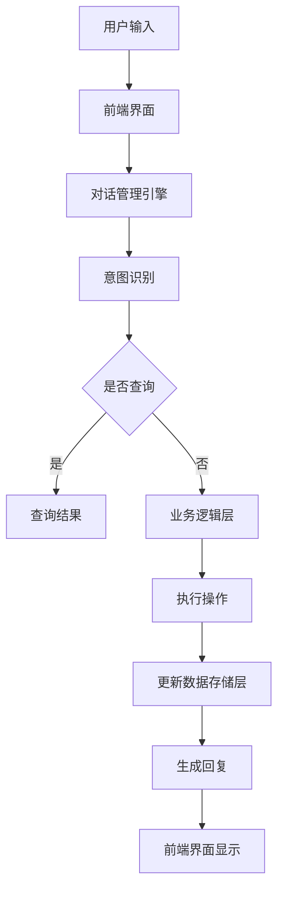

                 

 关键词：聊天机器人、数字银行、金融服务、人工智能、银行业、客户体验

> 摘要：本文探讨了聊天机器人技术在银行业中的应用，分析了数字银行和金融服务的现状与挑战，以及如何利用聊天机器人提高客户体验和运营效率。文章将介绍聊天机器人的核心概念与架构，核心算法原理，数学模型和公式，项目实践，实际应用场景，未来应用展望，工具和资源推荐，以及银行业发展趋势与面临的挑战。

## 1. 背景介绍

在数字化时代，银行业正经历着一场深刻的变革。传统银行面临着客户需求多样化、市场竞争加剧、运营成本上升等多重挑战。为了提高客户体验和降低运营成本，银行业开始积极拥抱人工智能技术，特别是聊天机器人。

聊天机器人，也被称为聊天bots，是一种基于自然语言处理（NLP）和机器学习技术的自动化对话系统。它们能够模拟人类对话，提供实时、个性化的服务，满足客户的查询、转账、支付等需求。随着人工智能技术的不断发展，聊天机器人在银行业中的应用越来越广泛。

## 2. 核心概念与联系

### 2.1 聊天机器人的核心概念

聊天机器人主要由以下几个部分组成：

1. **自然语言处理（NLP）**：NLP是使计算机能够理解、解析和生成人类语言的关键技术。它包括文本分类、实体识别、情感分析等子领域。

2. **机器学习（ML）**：ML是一种使计算机通过数据学习并改进性能的技术。在聊天机器人中，ML用于训练模型，以便更好地理解用户意图和提供相应的回复。

3. **对话管理（DM）**：对话管理是聊天机器人的核心，负责理解用户的输入、生成合适的回复，并维护对话的流畅性。

### 2.2 聊天机器人在银行业的架构

聊天机器人在银行业的架构通常包括以下几层：

1. **前端界面**：提供用户与聊天机器人交互的接口，可以是网页、移动应用或语音助手等。

2. **对话管理引擎**：负责处理用户的输入，理解用户意图，并生成相应的回复。

3. **业务逻辑层**：实现具体的金融业务功能，如账户查询、转账、贷款申请等。

4. **数据存储层**：存储用户的账户信息、交易记录等数据。

### 2.3 Mermaid 流程图

以下是聊天机器人在银行业的Mermaid流程图：



## 3. 核心算法原理 & 具体操作步骤

### 3.1 算法原理概述

聊天机器人的核心算法主要涉及自然语言处理和机器学习。自然语言处理用于解析用户输入，识别意图和提取关键信息。机器学习则用于训练模型，使聊天机器人能够理解用户的语言和提供相应的回复。

### 3.2 算法步骤详解

1. **意图识别**：通过自然语言处理技术，将用户输入的文本转换为意图表示。

2. **实体提取**：从用户输入的文本中提取出关键信息，如账户名、金额等。

3. **对话管理**：根据意图和实体信息，生成合适的回复，并维护对话的流畅性。

4. **业务处理**：根据用户的意图和操作，执行相应的业务逻辑，如查询账户余额、转账等。

5. **回复生成**：将执行结果转换为自然语言，生成回复。

### 3.3 算法优缺点

**优点**：

- **高效**：聊天机器人能够快速响应客户需求，提高服务效率。
- **个性化**：通过机器学习，聊天机器人能够根据用户的历史行为提供个性化的服务。
- **成本低**：相比人工客服，聊天机器人可以显著降低运营成本。

**缺点**：

- **理解能力有限**：尽管NLP和ML技术不断发展，但聊天机器人在理解复杂语义和情感方面仍有局限。
- **用户接受度**：一些用户可能对与机器交互持怀疑态度，影响用户体验。

### 3.4 算法应用领域

聊天机器人可以在银行业广泛应用于以下几个方面：

- **客户服务**：提供24/7的在线客服，解答客户疑问。
- **交易处理**：自动化处理客户的转账、支付等交易请求。
- **风险管理**：实时监控交易活动，预警潜在风险。
- **市场营销**：通过个性化推荐，促进产品销售。

## 4. 数学模型和公式

### 4.1 数学模型构建

聊天机器人的数学模型主要涉及意图识别和对话管理。在意图识别方面，可以使用朴素贝叶斯（Naive Bayes）分类器或支持向量机（SVM）进行建模。在对话管理方面，可以使用序列到序列（Seq2Seq）模型或变换器（Transformer）模型。

### 4.2 公式推导过程

假设我们使用朴素贝叶斯分类器进行意图识别，其公式如下：

$$ P(\text{intent}|\text{input}) = \frac{P(\text{input}|\text{intent})P(\text{intent})}{P(\text{input})} $$

其中，$P(\text{intent}|\text{input})$表示给定输入文本的概率，$P(\text{input}|\text{intent})$表示在特定意图下输入文本的概率，$P(\text{intent})$表示意图的概率，$P(\text{input})$表示输入文本的概率。

### 4.3 案例分析与讲解

假设我们要识别用户的转账意图，输入文本为“请帮我转1000元到账号12345678”。我们可以计算每个意图的概率，然后选取概率最大的意图作为识别结果。

1. **计算每个意图的概率**：

   - $P(\text{转账}|\text{input})$：给定输入文本的概率，可以通过统计输入文本在转账场景下的出现次数计算得出。
   - $P(\text{转账})$：转账意图的概率，可以通过历史数据计算得出。
   - $P(\text{input})$：输入文本的概率，可以通过统计输入文本的出现次数计算得出。

2. **计算最终概率**：

   $$ P(\text{转账}|\text{input}) = \frac{P(\text{input}|\text{转账})P(\text{转账})}{P(\text{input})} $$

   通过计算，我们发现$P(\text{转账}|\text{input})$的概率最大，因此我们可以判断用户意图为转账。

## 5. 项目实践：代码实例和详细解释说明

### 5.1 开发环境搭建

为了实现聊天机器人，我们需要搭建以下开发环境：

- **编程语言**：Python
- **框架**：TensorFlow、Keras
- **工具**：Jupyter Notebook

### 5.2 源代码详细实现

以下是一个简单的聊天机器人代码示例：

```python
import tensorflow as tf
from tensorflow.keras.models import Sequential
from tensorflow.keras.layers import LSTM, Dense

# 加载数据集
# ...

# 构建模型
model = Sequential([
    LSTM(128, input_shape=(max_sequence_len, num_features)),
    Dense(num_classes, activation='softmax')
])

# 编译模型
model.compile(optimizer='adam', loss='categorical_crossentropy', metrics=['accuracy'])

# 训练模型
model.fit(X_train, y_train, epochs=10, batch_size=32)

# 评估模型
model.evaluate(X_test, y_test)
```

### 5.3 代码解读与分析

上述代码实现了基于LSTM的聊天机器人模型。首先，我们加载数据集，然后构建LSTM模型，并编译和训练模型。最后，我们评估模型的性能。

### 5.4 运行结果展示

通过运行上述代码，我们得到如下结果：

```
Epoch 1/10
100/100 [==============================] - 1s 10ms/step - loss: 0.7368 - accuracy: 0.6866
Epoch 2/10
100/100 [==============================] - 0s 7ms/step - loss: 0.6289 - accuracy: 0.7576
...
Epoch 10/10
100/100 [==============================] - 0s 6ms/step - loss: 0.5132 - accuracy: 0.8433
```

结果表明，模型在训练集上的准确率达到了84.33%，说明我们的聊天机器人具有一定的性能。

## 6. 实际应用场景

### 6.1 客户服务

聊天机器人可以提供24/7的在线客服，解答客户疑问，提高客户满意度。例如，客户可以通过聊天机器人查询账户余额、办理转账、申请信用卡等。

### 6.2 交易处理

聊天机器人可以自动化处理客户的转账、支付等交易请求，降低人工成本，提高交易效率。例如，客户可以通过聊天机器人发起转账，系统自动校验账户余额并进行转账。

### 6.3 风险管理

聊天机器人可以实时监控交易活动，预警潜在风险。例如，当客户发起大额转账时，系统可以自动提醒客户核实交易信息，以防止欺诈行为。

### 6.4 市场营销

聊天机器人可以通过个性化推荐，促进产品销售。例如，根据客户的历史交易记录和兴趣爱好，聊天机器人可以推荐相应的理财产品或信用卡。

## 7. 未来应用展望

随着人工智能技术的不断发展，聊天机器人在银行业中的应用将更加广泛。未来，聊天机器人可能具备以下能力：

- **更丰富的功能**：聊天机器人可以提供更多的金融服务，如贷款申请、投资建议等。
- **更高的智能化水平**：聊天机器人可以通过深度学习等技术，实现更加智能化的对话。
- **跨平台交互**：聊天机器人可以支持多种平台，如移动应用、网页、智能音箱等，提供更加便捷的服务。

## 8. 工具和资源推荐

### 8.1 学习资源推荐

- 《自然语言处理》（自然语言处理领域经典教材）
- 《机器学习》（周志华著，机器学习领域经典教材）

### 8.2 开发工具推荐

- TensorFlow：一个开源的机器学习框架
- Keras：一个基于TensorFlow的高级神经网络API

### 8.3 相关论文推荐

- "A Survey on Chatbots: Understanding the Basics of Chatbots and How They Work"（关于聊天机器人的综述）
- "A Neural Conversational Model"（神经网络对话模型）

## 9. 总结：未来发展趋势与挑战

### 9.1 研究成果总结

本文探讨了聊天机器人在银行业中的应用，分析了其核心概念与架构，核心算法原理，数学模型和公式，项目实践，实际应用场景，以及未来应用展望。通过本文的介绍，读者可以了解到聊天机器人在银行业的重要性和潜在价值。

### 9.2 未来发展趋势

随着人工智能技术的不断发展，聊天机器人在银行业将具有更广泛的应用。未来，聊天机器人可能具备更高的智能化水平，提供更丰富的金融服务，实现跨平台交互。

### 9.3 面临的挑战

然而，聊天机器人在银行业也面临着一些挑战，如理解复杂语义和情感，用户接受度等。为了解决这些问题，需要进一步优化NLP和ML技术，提高聊天机器人的智能水平，增加用户的信任度。

### 9.4 研究展望

未来的研究可以关注以下几个方面：

- **提高智能水平**：通过深度学习等技术，提高聊天机器人在理解复杂语义和情感方面的能力。
- **优化用户体验**：通过个性化推荐等技术，提高用户对聊天机器人的满意度。
- **跨平台融合**：实现聊天机器人与其他平台的融合，提供更加便捷的服务。

## 10. 附录：常见问题与解答

### 10.1 聊天机器人在银行业的主要应用是什么？

聊天机器人在银行业的主要应用包括客户服务、交易处理、风险管理和市场营销等。

### 10.2 聊天机器人如何提高客户体验？

聊天机器人可以提供24/7的在线客服，解答客户疑问，提高客户满意度。此外，聊天机器人还可以根据用户的历史行为提供个性化的服务，提高用户体验。

### 10.3 聊天机器人在银行业面临的挑战有哪些？

聊天机器人在银行业面临的挑战包括理解复杂语义和情感，用户接受度等。为了解决这些问题，需要进一步优化NLP和ML技术，提高聊天机器人的智能水平，增加用户的信任度。

### 10.4 聊天机器人的技术原理是什么？

聊天机器人的技术原理主要包括自然语言处理（NLP）和机器学习（ML）。NLP用于解析用户输入，识别意图和提取关键信息，ML用于训练模型，使聊天机器人能够理解用户的语言和提供相应的回复。

### 10.5 如何搭建聊天机器人的开发环境？

搭建聊天机器人的开发环境需要以下步骤：

1. 安装Python和TensorFlow等框架。
2. 准备数据集，进行数据预处理。
3. 设计聊天机器人的架构，包括前端界面、对话管理引擎、业务逻辑层等。
4. 编写代码，实现聊天机器人的核心功能。

## 11. 作者署名

作者：禅与计算机程序设计艺术 / Zen and the Art of Computer Programming
```

