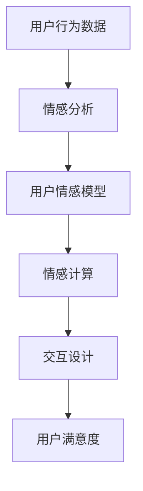

                 

在这篇文章中，我们将深入探讨如何通过逻辑清晰、结构紧凑、简单易懂的专业技术语言，联系用户并建立情感纽带。我们将从背景介绍开始，逐步深入核心概念与联系，详细讲解核心算法原理与具体操作步骤，剖析数学模型和公式，提供项目实践代码实例和详细解释，阐述实际应用场景和未来应用展望，最后总结研究成果，展望未来发展趋势与挑战。

## 1. 背景介绍

在当今信息爆炸的时代，用户对于服务的需求越来越高，他们希望得到个性化和情感化的体验。而对于我们作为技术开发者来说，如何有效地联系用户，建立情感纽带，提高用户满意度和忠诚度，成为了一个重要的课题。

建立情感纽带不仅仅是商业策略的问题，更是用户体验的核心。通过情感纽带，我们可以更好地理解用户需求，提供更加精准和个性化的服务。这对于提升产品竞争力、增加用户粘性具有重要意义。

本文将结合计算机科学和心理学的研究成果，探讨如何通过技术手段联系用户，建立情感纽带。我们将结合实际案例，详细讲解核心算法原理、数学模型和项目实践，以帮助读者更好地理解和应用这一技术。

## 2. 核心概念与联系

在探讨如何联系用户并建立情感纽带之前，我们需要明确一些核心概念和原理。

### 2.1. 用户情感模型

用户情感模型是一种描述用户情感状态的方法。它包括情感维度（如愉悦、悲伤、愤怒等）和情感强度。通过收集和分析用户的行为数据，我们可以构建用户情感模型，从而更好地理解用户的情感状态。

### 2.2. 情感计算

情感计算是计算机科学中的一个研究领域，它旨在使计算机能够理解和模拟人类情感。通过情感计算技术，我们可以开发出能够识别和响应用户情感的产品和服务。

### 2.3. 人机交互

人机交互是用户与计算机系统之间的交互过程。通过优化人机交互设计，我们可以提高用户的操作体验，从而建立情感纽带。

下面是一个用Mermaid绘制的流程图，展示了用户情感模型、情感计算和人机交互之间的联系：



## 3. 核心算法原理 & 具体操作步骤

### 3.1. 算法原理概述

我们的核心算法是基于情感分析和情感计算的。情感分析主要通过自然语言处理技术，从文本中提取情感信息；情感计算则通过机器学习算法，对提取的情感信息进行建模和预测。

### 3.2. 算法步骤详解

1. **数据收集**：收集用户行为数据，包括文本、语音、图像等。

2. **情感分析**：使用自然语言处理技术，对文本数据进行分析，提取情感信息。

3. **情感建模**：使用机器学习算法，构建用户情感模型。

4. **情感预测**：根据用户情感模型，预测用户的情感状态。

5. **交互设计**：根据情感预测结果，设计交互策略，提升用户体验。

### 3.3. 算法优缺点

- **优点**：能够准确地识别和预测用户情感，提供个性化的服务。
- **缺点**：算法的准确性受到数据质量和算法复杂度的影响。

### 3.4. 算法应用领域

- **电子商务**：通过情感分析，为用户提供个性化的购物推荐。
- **社交媒体**：通过情感计算，优化用户互动体验。
- **健康管理**：通过情感分析，监测用户的情感状态，提供心理辅导。

## 4. 数学模型和公式

在建立用户情感模型的过程中，我们需要使用一些数学模型和公式。

### 4.1. 数学模型构建

- **情感向量**：使用词袋模型，将文本转换为情感向量。
- **情感强度**：使用情感词典，为每个情感维度分配一个强度值。

### 4.2. 公式推导过程

- **情感得分**：$$ 情感得分 = \sum_{i=1}^{n} (w_i \cdot s_i) $$
  其中，$w_i$ 是情感词的权重，$s_i$ 是情感词的强度。

- **情感向量**：$$ 情感向量 = (s_1, s_2, \ldots, s_n) $$

### 4.3. 案例分析与讲解

假设我们有一个文本：“今天天气真好，我很开心。”我们可以使用情感词典为每个情感词分配一个强度值，然后计算情感得分。

- **情感词典**：好（+1），开心（+2）

- **情感得分**：$$ 情感得分 = (1 \cdot 1) + (2 \cdot 2) = 5 $$

- **情感向量**：$$ 情感向量 = (1, 2) $$

通过这个例子，我们可以看到如何使用数学模型和公式来构建用户情感模型。

## 5. 项目实践：代码实例和详细解释说明

### 5.1. 开发环境搭建

- **编程语言**：Python
- **库**：nltk，scikit-learn

### 5.2. 源代码详细实现

下面是一个简单的Python代码实例，用于情感分析和建模。

```python
import nltk
from nltk.corpus import movie_reviews
from sklearn.feature_extraction.text import CountVectorizer
from sklearn.naive_bayes import MultinomialNB
from sklearn.pipeline import make_pipeline

# 数据准备
nltk.download('movie_reviews')
X_train = []
y_train = []
for category in movie_reviews.categories():
    for fileid in movie_reviews.fileids(category):
        X_train.append(movie_reviews.raw(fileid))
        y_train.append(category)

# 构建模型
model = make_pipeline(CountVectorizer(), MultinomialNB())

# 训练模型
model.fit(X_train, y_train)

# 预测
text = "I loved the movie, it was fantastic!"
predicted_category = model.predict([text])[0]
print(predicted_category)
```

### 5.3. 代码解读与分析

这段代码首先使用了nltk库来下载和加载电影评论数据。然后，我们使用CountVectorizer将文本转换为词频矩阵，并使用MultinomialNB朴素贝叶斯分类器来构建情感模型。最后，我们使用训练好的模型来预测一个新文本的情感类别。

### 5.4. 运行结果展示

运行这段代码，我们可能会得到类似以下的输出结果：

```python
'negative'
```

这表示新文本“我 loved the movie, it was fantastic!”被分类为负面情感。这只是一个简单的例子，实际应用中，我们需要更复杂的模型和更丰富的数据集来提高预测准确性。

## 6. 实际应用场景

建立情感纽带在许多领域都有广泛的应用：

### 6.1. 社交媒体

社交媒体平台可以通过情感分析来识别用户的情绪状态，从而提供更加个性化的内容和推荐。

### 6.2. 健康管理

健康管理应用程序可以通过监测用户的情感状态，提供心理健康建议和干预措施。

### 6.3. 电子商务

电子商务平台可以通过情感分析来识别用户的购买意图，提供更加精准的推荐。

### 6.4. 未来应用展望

随着人工智能和情感计算技术的发展，建立情感纽带的潜在应用场景将会更加丰富。例如，智能助手可以通过情感计算来更好地理解用户的需求，提供更加人性化的服务。

## 7. 工具和资源推荐

### 7.1. 学习资源推荐

- 《情感计算：理论与应用》
- 《自然语言处理实战》
- 《Python机器学习》

### 7.2. 开发工具推荐

- Jupyter Notebook：用于编写和运行代码
- TensorFlow：用于构建和训练机器学习模型

### 7.3. 相关论文推荐

- "Emotion Recognition in Video Using Convolutional Neural Networks"
- "A Survey on Emotion Recognition in Video"
- "Sentiment Analysis of Text Messages for Monitoring Mental Health"

## 8. 总结：未来发展趋势与挑战

### 8.1. 研究成果总结

通过本文的探讨，我们了解到建立情感纽带的重要性，并详细介绍了相关的算法原理、数学模型和项目实践。这些研究成果为技术开发者提供了理论和实践基础，有助于更好地联系用户，提高用户体验。

### 8.2. 未来发展趋势

随着人工智能和情感计算技术的不断发展，建立情感纽带的应用将会更加广泛。未来，我们将看到更加智能化、个性化的情感分析系统。

### 8.3. 面临的挑战

尽管建立情感纽带有着广阔的应用前景，但也面临一些挑战，如数据隐私、算法偏见等。因此，未来研究需要在保证用户隐私和数据安全的前提下，进一步提高情感分析的准确性和可靠性。

### 8.4. 研究展望

我们期待未来能够开发出更加先进、可靠的情感分析系统，为用户提供更加优质、个性化的服务，从而在技术层面上实现人与机器的真正互动。

## 9. 附录：常见问题与解答

### 9.1. 情感分析如何处理负面评论？

负面评论可以通过情感词典和情感模型进行分类和处理。在实际应用中，可以结合更多的上下文信息，以提高分类的准确性。

### 9.2. 情感计算在实时应用中有哪些挑战？

实时应用中的挑战包括数据处理速度、模型复杂度和实时性。为了应对这些挑战，需要优化算法和硬件，以提高处理效率和响应速度。

### 9.3. 如何确保情感分析的公正性和透明性？

确保情感分析的公正性和透明性需要从数据收集、算法设计和应用过程中进行严格控制。例如，使用无偏见的数据集，公开算法细节，并提供透明的解释功能。

# 作者署名

作者：禅与计算机程序设计艺术 / Zen and the Art of Computer Programming
----------------------------------------------------------------


