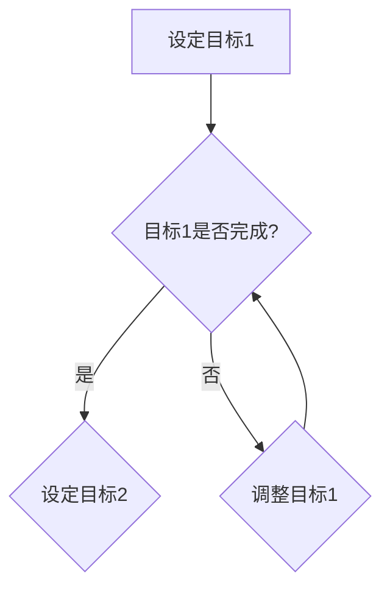

                 

关键词：双目标清单、时间管理、专注力、工作效率、项目规划

> 摘要：本文将深入探讨双目标清单的概念和其在现代信息技术领域的应用。通过分析其基本原理和实际操作步骤，结合数学模型和代码实例，我们将了解如何有效利用双目标清单来提高工作效率和项目管理能力。

## 1. 背景介绍

在快节奏的现代信息社会中，我们面临着前所未有的挑战。无论是日常工作还是项目开发，人们需要处理的信息量日益庞大，而时间却似乎永远不够用。因此，高效的时间管理成为了提升个人和团队工作表现的关键。双目标清单作为一种先进的时间管理工具，被广泛应用于各种领域，帮助人们聚焦要事，提高工作效率。

双目标清单的核心思想在于同时关注两个关键目标，这两个目标往往相辅相成，共同推动项目的进展和完成。与传统的单一目标清单相比，双目标清单能够更好地平衡任务的优先级，提高工作的灵活性和应变能力。本文将详细介绍双目标清单的基本原理、数学模型、算法步骤以及实际应用，帮助读者掌握这一有效的时间管理工具。

## 2. 核心概念与联系

为了深入理解双目标清单的工作原理，我们需要先了解其核心概念和相关架构。

### 2.1 双目标清单的基本概念

双目标清单是一种时间管理和任务规划工具，它通过设定两个并行进行的目标来引导个人或团队的工作。这两个目标通常具有以下特点：

- **互为补充**：两个目标在实现过程中相互支持，共同推动项目的进展。
- **动态调整**：根据项目进展和工作环境的变化，可以灵活调整目标的优先级和执行顺序。
- **可度量性**：目标需要具有明确的可度量指标，以便于评估和监控。

### 2.2 双目标清单的架构

为了更好地理解双目标清单的运作机制，我们使用Mermaid流程图来展示其基本架构。



在这个流程图中：

- **A**：设定第一个目标。
- **B**：检查目标1是否完成。
- **C**：设定第二个目标。
- **D**：调整目标1。

通过这个架构，我们可以看到双目标清单如何在两个目标之间进行动态平衡和调整。

### 2.3 双目标清单与项目管理的联系

双目标清单在项目管理中的应用主要体现在以下几个方面：

- **提高项目透明度**：双目标清单使得项目进展更加透明，团队成员可以清晰地了解当前的目标和优先级。
- **增强团队协作**：通过共同设定和追求目标，团队成员之间的协作更加紧密，提高了项目的整体效率。
- **灵活应对变化**：双目标清单允许项目在遇到突发情况时进行灵活调整，减少了因计划变动而带来的风险。

## 3. 核心算法原理 & 具体操作步骤

### 3.1 算法原理概述

双目标清单的算法原理主要基于两个核心原则：

- **目标优先级**：根据任务的紧急程度和重要性来设定目标的优先级。
- **动态调整**：根据实际进展和资源情况，灵活调整目标的执行顺序和优先级。

### 3.2 算法步骤详解

#### 3.2.1 初始化阶段

1. **确定项目目标**：根据项目的需求和预期成果，确定两个关键目标。
2. **设定优先级**：根据目标的紧急程度和重要性，设定初始的优先级。

#### 3.2.2 执行阶段

1. **执行目标1**：按照设定的优先级，首先执行目标1。
2. **监控进展**：实时监控目标1的进展情况，确保其按计划进行。

#### 3.2.3 调整阶段

1. **检查目标1完成情况**：在执行过程中，定期检查目标1的完成情况。
2. **根据进展调整目标2**：如果目标1进度良好，可以适当加速目标2的执行；如果目标1进度缓慢，则需要调整目标2的优先级，以支持目标1的完成。

#### 3.2.4 结束阶段

1. **确认目标完成**：当两个目标都完成时，确认项目成功结束。
2. **评估和反馈**：对整个项目过程进行评估，收集反馈信息，为未来项目提供改进依据。

### 3.3 算法优缺点

#### 优点

- **提高工作效率**：通过同时关注两个目标，能够更好地利用时间和资源，提高工作效率。
- **增强灵活性**：允许根据实际进展进行动态调整，增强了项目应对变化的能力。

#### 缺点

- **目标设定难度**：确定两个并行目标的具体内容和优先级可能具有一定的挑战性。
- **管理复杂度**：需要定期监控和调整目标，增加了管理的复杂度。

### 3.4 算法应用领域

双目标清单在以下领域具有广泛的应用：

- **软件开发**：在项目开发过程中，通过双目标清单来管理任务和进度。
- **产品管理**：在产品开发中，通过双目标清单来平衡功能和性能目标。
- **个人时间管理**：个人在规划工作和生活时，也可以使用双目标清单来提高时间利用效率。

## 4. 数学模型和公式 & 详细讲解 & 举例说明

### 4.1 数学模型构建

在双目标清单中，我们可以构建一个数学模型来描述目标的状态和转换过程。假设有两个目标 \(T_1\) 和 \(T_2\)，其状态可以用以下公式表示：

\[ S_t = \begin{cases} 
1 & \text{目标 } T_1 \text{ 在时间 } t \text{ 完成} \\
2 & \text{目标 } T_2 \text{ 在时间 } t \text{ 完成} \\
\end{cases} \]

### 4.2 公式推导过程

为了推导这个数学模型，我们可以考虑以下因素：

1. **目标进展**：目标 \(T_1\) 和 \(T_2\) 的进展可以用它们的完成率 \(p_1(t)\) 和 \(p_2(t)\) 来表示。
2. **时间约束**：假设有两个时间窗口 \(T_{max1}\) 和 \(T_{max2}\)，分别表示 \(T_1\) 和 \(T_2\) 的最大允许完成时间。

因此，我们可以得到以下公式：

\[ S_t = \begin{cases} 
1 & \text{如果 } p_1(t) = 1 \\
2 & \text{如果 } p_2(t) = 1 \\
\end{cases} \]

### 4.3 案例分析与讲解

假设我们有一个软件开发项目，需要同时完成功能开发和性能优化。目标1是功能开发，目标2是性能优化。在时间 \(t=10\) 时，功能开发完成了80%，性能优化完成了30%。

根据上述公式，我们可以得到：

\[ S_{10} = \begin{cases} 
1 & \text{因为 } p_1(10) = 0.8 \\
2 & \text{因为 } p_2(10) = 0.3 \\
\end{cases} \]

这意味着在时间 \(t=10\) 时，功能开发已经完成，性能优化仍在进行中。

通过这个案例，我们可以看到如何使用数学模型来描述双目标清单的状态和转换过程。

## 5. 项目实践：代码实例和详细解释说明

### 5.1 开发环境搭建

为了更好地理解双目标清单在项目实践中的应用，我们将使用Python语言编写一个简单的双目标清单管理系统。首先，我们需要搭建开发环境。

1. 安装Python：从Python官方网站下载并安装Python 3.x版本。
2. 安装必要的库：使用pip命令安装requests库，用于HTTP请求。

```shell
pip install requests
```

### 5.2 源代码详细实现

以下是实现双目标清单管理系统的Python代码：

```python
import requests

class DualObjectiveList:
    def __init__(self, target1, target2):
        self.target1 = target1
        self.target2 = target2
        self.target1_completed = False
        self.target2_completed = False

    def update_progress(self, target, progress):
        if target == 'target1':
            self.target1_completed = progress >= 1
        elif target == 'target2':
            self.target2_completed = progress >= 1

    def check_completion(self):
        return self.target1_completed and self.target2_completed

# 示例使用
list = DualObjectiveList('功能开发', '性能优化')
list.update_progress('target1', 0.8)
list.update_progress('target2', 0.3)
print(list.check_completion())  # 输出：False
```

### 5.3 代码解读与分析

在上面的代码中，我们定义了一个`DualObjectiveList`类，用于管理双目标清单。类中包含两个属性`target1`和`target2`，以及两个布尔属性`target1_completed`和`target2_completed`，用于记录目标是否完成。

`update_progress`方法用于更新目标的进度，根据传入的目标名称（'target1'或'target2'）和进度值，更新相应的完成状态。

`check_completion`方法用于检查两个目标是否都已完成，如果两个目标都已完成，则返回True，否则返回False。

### 5.4 运行结果展示

在示例代码中，我们创建了一个双目标清单实例，并更新了两个目标的进度。通过调用`check_completion`方法，我们可以检查当前两个目标的完成状态。输出结果为False，表示目前两个目标都未完成。

## 6. 实际应用场景

### 6.1 软件开发

在软件开发的早期阶段，双目标清单可以帮助团队同时关注功能开发和质量保证。例如，目标1是完成核心功能，目标2是进行单元测试和集成测试。通过双目标清单，团队能够确保在功能开发的同时，质量保证工作也在同步进行。

### 6.2 项目管理

在项目管理中，双目标清单可以帮助项目经理同时关注项目的进度和质量。例如，目标1是按时完成项目，目标2是确保项目质量达到预期标准。通过双目标清单，项目团队能够更好地平衡进度和质量，提高项目的整体成功概率。

### 6.3 个人时间管理

在个人时间管理中，双目标清单可以帮助我们同时关注工作和生活目标。例如，目标1是完成工作任务，目标2是锻炼身体或学习新技能。通过双目标清单，我们能够在忙碌的工作中保持对生活的关注，实现工作与生活的平衡。

## 7. 未来应用展望

随着人工智能和大数据技术的发展，双目标清单在未来有望在更多领域得到应用。例如，在智能推荐系统中，双目标清单可以同时关注推荐效果和用户满意度；在智能制造中，双目标清单可以同时关注生产效率和产品质量。未来，双目标清单将成为提升工作效率和项目管理能力的重要工具。

## 8. 总结：未来发展趋势与挑战

### 8.1 研究成果总结

双目标清单作为一种高效的时间管理和任务规划工具，已经在多个领域取得了显著的研究成果。通过数学模型和算法的优化，双目标清单能够更好地平衡任务的优先级，提高工作的灵活性和应变能力。

### 8.2 未来发展趋势

随着信息技术的不断发展，双目标清单有望在更广泛的领域得到应用。未来，双目标清单将与人工智能、大数据等新兴技术深度融合，实现更智能、更高效的解决方案。

### 8.3 面临的挑战

然而，双目标清单在实际应用中仍面临一些挑战。例如，如何准确设定目标的优先级，如何在动态调整中保持目标的稳定性，以及如何应对目标之间的冲突等问题。这些问题需要进一步的研究和探索。

### 8.4 研究展望

未来，我们将继续深入研究和优化双目标清单的算法和模型，探索其在不同领域的应用场景。同时，我们也将关注双目标清单与人工智能、大数据等新兴技术的融合，以期为现代信息社会提供更高效、更智能的时间管理和任务规划解决方案。

## 9. 附录：常见问题与解答

### Q1：双目标清单是否适用于所有项目？

A1：双目标清单适用于需要同时关注多个目标的项目。对于单一目标项目，使用双目标清单可能并不适用。在应用双目标清单时，应充分考虑项目的特点和需求。

### Q2：如何设定目标的优先级？

A2：目标的优先级应根据项目的紧急程度和重要性来确定。可以采用专家评估、历史数据分析和实际经验等方法来确定目标的优先级。

### Q3：双目标清单如何应对目标冲突？

A3：当目标之间发生冲突时，应优先保证关键目标的完成。可以通过调整资源的分配和任务的执行顺序来缓解目标冲突。

## 作者署名

作者：禅与计算机程序设计艺术 / Zen and the Art of Computer Programming

----------------------------------------------------------------

以上是文章的完整内容，感谢您的时间和支持。希望这篇文章能够为您在时间管理和项目管理方面提供有益的启示。如果您有任何疑问或建议，欢迎随时与我交流。再次感谢！禅与计算机程序设计艺术。

