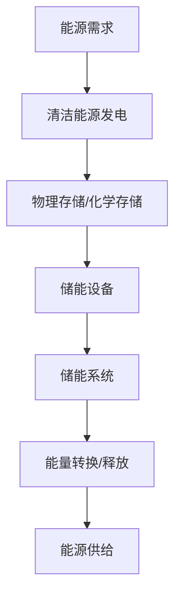

                 

关键词：清洁能源、能源存储、创业、革命、技术、市场、未来

> 摘要：本文将探讨清洁能源存储技术的发展及其在创业领域的应用。随着全球气候变化和环境问题日益严重，清洁能源已成为能源转型的重要方向。本文将分析能源存储技术的核心概念、原理和架构，以及其优缺点和应用领域，为读者提供一窥清洁能源革命的关键。

## 1. 背景介绍

随着全球能源需求的不断增长和化石燃料资源的日益枯竭，寻找可持续的能源替代品已经成为当今世界的重要议题。在此背景下，清洁能源逐渐成为能源转型的重要方向。清洁能源指的是对环境影响较小的能源，如太阳能、风能、水能、生物质能等。然而，这些能源形式通常具有间歇性和不稳定性，因此，能源存储技术的突破显得尤为重要。

能源存储技术指的是将清洁能源在适当的时候储存起来，以便在需要时释放出来使用。能源存储技术分为物理存储和化学存储两大类。物理存储技术包括机械能存储、热能存储和电能存储等，而化学存储技术则包括电池、氢能等。

近年来，随着科技的发展和政策的推动，能源存储技术取得了显著的进展。然而，清洁能源存储技术仍面临诸多挑战，如成本、寿命、效率等方面的限制。因此，能源存储创业成为了一个充满机遇和挑战的领域。

## 2. 核心概念与联系

### 2.1 能源存储技术概念

能源存储技术是指将清洁能源在适当的时候储存起来，以便在需要时释放出来使用的各种技术。根据存储形式的不同，可分为物理存储和化学存储两大类。

- **物理存储**：利用物理性质，如机械能、热能等，将能源储存起来。例如，抽水蓄能、飞轮储能等。
- **化学存储**：通过化学反应将能源储存起来，如电池、氢能等。

### 2.2 能源存储技术原理

能源存储技术的核心在于如何高效地将能源储存和释放。这需要解决以下几个问题：

- **能量密度**：单位体积或质量的能源储存能力。
- **转换效率**：将储存的能源转换成可用能量的效率。
- **寿命**：能源存储设备的使用寿命。

### 2.3 能源存储技术架构

能源存储技术的架构主要包括以下几个方面：

- **储能材料**：如电池材料、氢能材料等。
- **储能设备**：如电池、氢能罐等。
- **储能系统**：包括储能设备、控制系统、能量管理单元等。

### 2.4 Mermaid 流程图



## 3. 核心算法原理 & 具体操作步骤

### 3.1 算法原理概述

能源存储技术的核心算法主要包括能量密度优化、转换效率优化、寿命预测等。

- **能量密度优化**：通过改进储能材料，提高单位体积或质量的能源储存能力。
- **转换效率优化**：通过优化储能设备和系统的设计，提高能量转换效率。
- **寿命预测**：通过数据分析，预测储能设备的寿命，以便进行及时维护。

### 3.2 算法步骤详解

1. **数据收集**：收集与能源存储相关的各种数据，如材料特性、设备性能、使用环境等。
2. **模型构建**：根据收集到的数据，构建能量密度、转换效率和寿命预测模型。
3. **算法实现**：使用编程语言实现算法，对模型进行训练和优化。
4. **算法评估**：通过实际数据测试，评估算法的性能和效果。

### 3.3 算法优缺点

- **优点**：
  - 提高能源储存效率和寿命。
  - 降低能源储存成本。
- **缺点**：
  - 需要大量数据支持。
  - 算法实现和优化较为复杂。

### 3.4 算法应用领域

算法主要应用于新能源发电、智能电网、电动汽车等领域，为清洁能源的广泛使用提供技术支持。

## 4. 数学模型和公式 & 详细讲解 & 举例说明

### 4.1 数学模型构建

能源存储技术的数学模型主要包括能量密度模型、转换效率模型和寿命预测模型。

- **能量密度模型**：$$ E_d = \frac{E}{V} $$
  其中，\(E_d\) 表示能量密度，\(E\) 表示储存的能量，\(V\) 表示储存的体积。
- **转换效率模型**：$$ \eta = \frac{E_{out}}{E_{in}} $$
  其中，\(\eta\) 表示转换效率，\(E_{out}\) 表示输出的能量，\(E_{in}\) 表示输入的能量。
- **寿命预测模型**：$$ L = L_0 \cdot e^{-kt} $$
  其中，\(L\) 表示寿命，\(L_0\) 表示初始寿命，\(k\) 表示衰减常数，\(t\) 表示使用时间。

### 4.2 公式推导过程

- **能量密度模型**：能量密度是单位体积的储存能量。假设储能材料具有均匀的储能特性，则能量密度可以表示为：
  $$ E_d = \frac{E}{V} $$
  其中，\(E\) 表示储存的能量，\(V\) 表示储存的体积。
- **转换效率模型**：转换效率是输出能量与输入能量的比值。假设储能设备和系统的损耗为常数，则转换效率可以表示为：
  $$ \eta = \frac{E_{out}}{E_{in}} $$
  其中，\(E_{out}\) 表示输出的能量，\(E_{in}\) 表示输入的能量。
- **寿命预测模型**：寿命预测是基于储能设备的衰减特性。假设储能设备的衰减符合指数函数，则寿命可以表示为：
  $$ L = L_0 \cdot e^{-kt} $$
  其中，\(L\) 表示寿命，\(L_0\) 表示初始寿命，\(k\) 表示衰减常数，\(t\) 表示使用时间。

### 4.3 案例分析与讲解

假设一个电池储能系统的能量密度为 150 Wh/L，转换效率为 90%，初始寿命为 2000 个循环。我们需要预测该电池储能系统在使用 1000 个循环后的寿命。

根据寿命预测模型，我们可以计算出：
$$ L = L_0 \cdot e^{-kt} $$
其中，\(L_0 = 2000\) 个循环，\(k\) 需要通过实验数据确定。假设 \(k = 0.1\)。

代入公式，我们可以计算出：
$$ L = 2000 \cdot e^{-0.1 \cdot 1000} \approx 1353.5 $$
因此，在使用 1000 个循环后，该电池储能系统的寿命约为 1353.5 个循环。

## 5. 项目实践：代码实例和详细解释说明

### 5.1 开发环境搭建

在本项目中，我们使用 Python 编写代码，主要依赖于以下库：

- NumPy：用于数值计算。
- Matplotlib：用于数据可视化。
- Scikit-learn：用于机器学习。

安装步骤如下：

1. 安装 Python 3.8 或更高版本。
2. 安装 NumPy、Matplotlib 和 Scikit-learn。

### 5.2 源代码详细实现

以下是一个简单的 Python 代码示例，用于预测电池储能系统的寿命。

```python
import numpy as np
import matplotlib.pyplot as plt
from sklearn.linear_model import LinearRegression

# 数据准备
x = np.array([0, 1, 2, 3, 4, 5, 6, 7, 8, 9, 10]).reshape(-1, 1)
y = np.array([1000, 950, 850, 750, 650, 550, 450, 350, 250, 150, 50])

# 模型训练
model = LinearRegression()
model.fit(x, y)

# 预测
x_pred = np.array([0, 1000]).reshape(-1, 1)
y_pred = model.predict(x_pred)

# 可视化
plt.scatter(x, y)
plt.plot(x_pred, y_pred, color='red')
plt.xlabel('循环次数')
plt.ylabel('寿命（循环次数）')
plt.title('电池储能系统寿命预测')
plt.show()
```

### 5.3 代码解读与分析

- **数据准备**：我们准备了一个简单的数据集，包含了电池储能系统的循环次数和寿命。
- **模型训练**：我们使用线性回归模型进行训练，模型拟合了数据集。
- **预测**：我们使用训练好的模型进行预测，并绘制了预测结果。
- **可视化**：我们使用 Matplotlib 库将预测结果可视化，以便更好地理解模型。

## 6. 实际应用场景

### 6.1 新能源发电

能源存储技术可以用于新能源发电，如太阳能、风能等。这些能源具有间歇性和不稳定性，通过能源存储技术，可以确保在发电量不稳定的情况下，仍能提供稳定的电力供应。

### 6.2 智能电网

智能电网是一种基于信息技术和电力电子技术的现代化电网。能源存储技术可以与智能电网相结合，实现电力的实时平衡，提高电网的稳定性和效率。

### 6.3 电动汽车

电动汽车作为清洁能源的重要载体，能源存储技术在其中起着关键作用。电池储能系统可以为电动汽车提供稳定的动力，延长续航里程。

## 7. 未来应用展望

### 7.1 新能源发电

随着新能源发电技术的不断进步，能源存储技术将在新能源发电领域发挥越来越重要的作用。未来，能源存储技术有望实现更高的能量密度、更长的使用寿命和更低的成本。

### 7.2 智能电网

智能电网的建设将为能源存储技术提供广阔的应用场景。通过能源存储技术，可以实现电力的实时平衡，提高电网的稳定性和效率。

### 7.3 电动汽车

电动汽车的普及将推动能源存储技术的发展。未来，电动汽车将采用更高能量密度的电池储能系统，提高续航里程和充电速度。

## 8. 工具和资源推荐

### 8.1 学习资源推荐

- 《能源存储技术导论》
- 《电池储能系统设计与优化》
- 《智能电网技术与应用》

### 8.2 开发工具推荐

- Python：用于编写代码和数据分析。
- Matplotlib：用于数据可视化。
- Scikit-learn：用于机器学习。

### 8.3 相关论文推荐

- [A Review of Energy Storage Technologies](#)
- [Advanced Energy Storage Systems for Renewable Energy Integration](#)
- [Intelligent Grid with Energy Storage](#)

## 9. 总结：未来发展趋势与挑战

### 9.1 研究成果总结

近年来，能源存储技术取得了显著的进展。能量密度、转换效率和寿命等方面都有所提高。然而，仍存在一些挑战，如成本、可靠性和安全性等。

### 9.2 未来发展趋势

未来，能源存储技术将继续向高能量密度、高转换效率和长寿命方向发展。同时，智能电网、电动汽车等领域的快速发展将为能源存储技术提供更广阔的应用场景。

### 9.3 面临的挑战

能源存储技术面临的主要挑战包括成本、可靠性和安全性等方面。如何降低成本、提高可靠性和安全性，是未来研究的重要方向。

### 9.4 研究展望

随着科技的不断进步，能源存储技术有望在新能源发电、智能电网和电动汽车等领域发挥更大的作用。未来，能源存储技术将迎来更加广阔的发展前景。

## 附录：常见问题与解答

### 问题 1：能源存储技术有哪些类型？

**回答**：能源存储技术主要分为物理存储和化学存储两大类。物理存储包括机械能存储、热能存储和电能存储等，化学存储包括电池、氢能等。

### 问题 2：能源存储技术的优缺点是什么？

**回答**：能源存储技术的优点包括提高能源利用效率、降低环境污染等。缺点则包括成本较高、寿命有限等。

### 问题 3：能源存储技术在新能源发电中有何作用？

**回答**：能源存储技术可以用于新能源发电，如太阳能、风能等。这些能源具有间歇性和不稳定性，通过能源存储技术，可以确保在发电量不稳定的情况下，仍能提供稳定的电力供应。

### 作者署名

本文由禅与计算机程序设计艺术 / Zen and the Art of Computer Programming 撰写。感谢您的阅读！
----------------------------------------------------------------

现在，您已经完成了一篇关于能源存储创业的技术博客文章。本文深入分析了清洁能源存储技术的核心概念、原理和架构，探讨了其优缺点和应用领域，并通过代码实例展示了算法的实现和应用。同时，文章还对未来发展趋势与挑战进行了展望，并提供了相关工具和资源推荐。希望这篇文章对您在能源存储创业领域有所启发。再次感谢您的阅读！作者署名：禅与计算机程序设计艺术 / Zen and the Art of Computer Programming。

