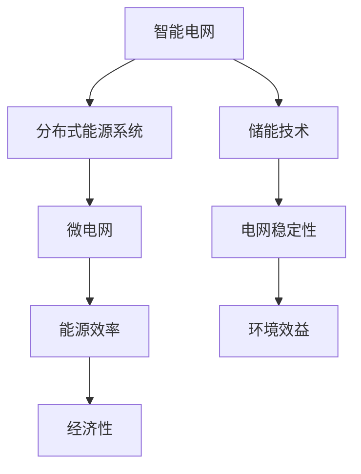

                 

关键词：能源转型、可再生能源、策略、智能电网、分布式能源系统

> 摘要：本文深入探讨了能源转型管理及其在实现向可再生能源过渡过程中的关键策略。通过分析当前能源系统的挑战和机遇，本文提出了智能电网和分布式能源系统的核心概念，详细阐述了相关算法原理和具体操作步骤，并结合实际项目实践展示了可再生能源的应用实例。文章旨在为能源领域的决策者和技术从业者提供一套全面、系统的指导框架。

## 1. 背景介绍

能源转型是21世纪全球面临的一项重大任务。随着气候变化和环境问题的日益严峻，各国政府和企业纷纷意识到，必须加速向可再生能源的过渡，以减少对化石燃料的依赖，实现可持续发展目标。然而，这一转型过程并非一蹴而就，它涉及技术、经济、政策等多个层面，需要系统、科学的策略支持。

目前，全球能源系统仍然以化石燃料为主，特别是煤炭、石油和天然气。这些能源不仅对环境造成严重污染，而且资源储量有限，难以满足未来日益增长的需求。与此同时，可再生能源技术，如太阳能、风能、水能和生物质能等，虽然在过去几十年中取得了显著进展，但仍然面临着许多挑战，包括技术成熟度、成本效益、能源储存和并网等问题。

### 1.1 能源转型的挑战

1. **技术挑战**：可再生能源技术尚未完全成熟，需要进一步研发和创新，提高技术性能和降低成本。
2. **经济挑战**：初始投资成本高，回报周期长，需要政策支持和市场激励机制。
3. **政策挑战**：各国能源政策和法规不统一，缺乏协调和合作，制约了能源转型的进程。
4. **社会挑战**：公众对可再生能源的认知和接受程度有限，需要加强宣传和教育。

### 1.2 能源转型的机遇

1. **技术进步**：随着人工智能、大数据和物联网等技术的应用，智能电网和分布式能源系统的发展前景广阔。
2. **市场潜力**：全球可再生能源市场快速增长，为相关产业提供了巨大商机。
3. **环境效益**：减少温室气体排放，改善空气质量，提高生态系统的健康水平。

## 2. 核心概念与联系

为了实现能源转型，我们需要深入理解并运用一系列核心概念和技术，包括智能电网、分布式能源系统、储能技术和微电网等。以下是一个简化的 Mermaid 流程图，展示了这些概念之间的关系。



### 2.1 智能电网

智能电网是集成了先进通信技术、信息处理技术和管理策略的电力系统，能够实现实时监控、自动优化和智能调度。智能电网的关键特点包括：

- **实时监控**：通过传感器和通信设备，实时监测电力系统的运行状态，提高系统的透明度和可靠性。
- **自动优化**：利用算法和大数据分析，自动调整电力生产和消费，优化能源配置。
- **智能调度**：根据市场需求和供应情况，智能调度电力资源，实现供需平衡。

### 2.2 分布式能源系统

分布式能源系统是指将多个小型能源生产单元分散布置在用户附近，通过智能电网实现互联和协调运行。分布式能源系统的优势包括：

- **灵活性**：可以根据用户需求灵活调整电力生产和消费，实现供需匹配。
- **可靠性**：通过分散布置，减少单点故障的风险，提高系统的可靠性。
- **经济效益**：降低长距离输电损耗，提高能源利用效率。

### 2.3 储能技术

储能技术是实现可再生能源稳定供应的关键。储能系统可以在电力过剩时储存能量，在电力需求高峰时释放能量，从而平衡供需。常见的储能技术包括电池储能、抽水蓄能和压缩空气储能等。储能技术的应用可以提高电网的稳定性，减少对化石燃料的依赖。

### 2.4 微电网

微电网是一种小型、自治的电力系统，由分布式能源单元、储能系统和负载组成。微电网可以在主电网故障或断电时独立运行，提供可靠的电力供应。微电网的优势包括：

- **自给自足**：在主电网无法供应电力时，微电网可以独立运行，保障基本电力需求。
- **提高能源效率**：通过本地化发电和优化能源配置，提高能源利用效率。
- **减少碳排放**：通过减少对化石燃料的依赖，降低碳排放。

## 3. 核心算法原理 & 具体操作步骤

### 3.1 算法原理概述

实现能源转型管理的关键在于优化能源配置和调度，以最大化可再生能源的使用，同时确保电网的稳定性和经济性。以下是几种常用的算法原理：

1. **优化算法**：基于目标函数和约束条件，通过数学优化方法求解最优能源配置方案。
2. **预测算法**：利用历史数据和机器学习模型，预测未来电力需求和供应情况。
3. **调度算法**：根据预测结果和实时数据，动态调整电力生产和消费，实现供需平衡。

### 3.2 算法步骤详解

1. **数据收集**：收集历史电力需求和供应数据，以及其他相关因素，如天气条件、能源价格等。
2. **数据处理**：对收集的数据进行清洗、归一化和特征提取，为后续分析做准备。
3. **建模**：根据数据特点，建立合适的数学模型，包括目标函数和约束条件。
4. **优化求解**：利用优化算法，求解最优能源配置方案。
5. **预测**：利用预测算法，预测未来电力需求和供应情况。
6. **调度**：根据预测结果和实时数据，动态调整电力生产和消费。
7. **评估**：对优化结果进行评估，包括能源效率、成本和碳排放等指标。

### 3.3 算法优缺点

**优化算法**：

- **优点**：能够找到最优解，提高能源利用效率。
- **缺点**：计算复杂度高，对计算资源和时间有较高要求。

**预测算法**：

- **优点**：能够提前预测电力需求和供应情况，为调度提供依据。
- **缺点**：预测精度受限于数据质量和模型复杂度。

**调度算法**：

- **优点**：实时调整电力生产和消费，确保电网稳定性。
- **缺点**：需要大量实时数据，对系统响应速度有较高要求。

### 3.4 算法应用领域

优化算法、预测算法和调度算法在能源转型管理中具有广泛的应用领域，包括：

- **智能电网**：实现实时监控、自动优化和智能调度。
- **分布式能源系统**：优化分布式能源单元的配置和运行。
- **微电网**：实现自治运行，提高能源效率。

## 4. 数学模型和公式 & 详细讲解 & 举例说明

### 4.1 数学模型构建

实现能源转型管理的关键在于优化能源配置和调度，以最大化可再生能源的使用，同时确保电网的稳定性和经济性。以下是几个常见的数学模型：

1. **目标函数**：

   目标函数用于最大化可再生能源的使用，同时考虑成本和碳排放等约束条件。例如，目标函数可以表示为：

   $$\min Z = c_1 \cdot E_{renewable} + c_2 \cdot E_{fossil} + c_3 \cdot C_{emission}$$

   其中，$E_{renewable}$表示可再生能源的使用量，$E_{fossil}$表示化石燃料的使用量，$C_{emission}$表示碳排放量，$c_1$、$c_2$和$c_3$为权重系数。

2. **约束条件**：

   约束条件用于限制能源生产和消费的合理性。例如，约束条件可以表示为：

   $$\begin{cases}
   E_{renewable} + E_{fossil} \leq D \\
   E_{renewable} \geq E_{min} \\
   E_{fossil} \geq E_{min} \\
   C_{emission} \leq C_{max}
   \end{cases}$$

   其中，$D$为总需求，$E_{min}$为可再生能源和化石燃料的最小使用量，$C_{max}$为最大碳排放量。

### 4.2 公式推导过程

以下是一个简单的例子，用于推导目标函数和约束条件的数学模型。

1. **目标函数推导**：

   目标函数的推导基于最大化可再生能源使用的原则。首先，定义可再生能源的使用量为$E_{renewable}$，化石燃料的使用量为$E_{fossil}$，碳排放量为$C_{emission}$。根据可再生能源和化石燃料的价格分别为$p_{renewable}$和$p_{fossil}$，碳排放税为$p_{emission}$，可以得到以下目标函数：

   $$\min Z = p_{renewable} \cdot E_{renewable} + p_{fossil} \cdot E_{fossil} + p_{emission} \cdot C_{emission}$$

   然而，为了简化问题，我们将$p_{fossil}$和$p_{emission}$设置为0，仅考虑可再生能源的使用和碳排放。因此，目标函数可以进一步简化为：

   $$\min Z = p_{renewable} \cdot E_{renewable} + C_{emission}$$

2. **约束条件推导**：

   约束条件的推导基于能源生产和消费的合理性。首先，定义总需求为$D$，可再生能源的最小使用量为$E_{min}$，化石燃料的最小使用量为$E_{min}$，最大碳排放量为$C_{max}$。根据这些定义，可以得到以下约束条件：

   $$E_{renewable} + E_{fossil} \leq D$$

   $$E_{renewable} \geq E_{min}$$

   $$E_{fossil} \geq E_{min}$$

   $$C_{emission} \leq C_{max}$$

### 4.3 案例分析与讲解

以下是一个具体的案例，用于说明如何使用数学模型和公式进行能源转型管理。

假设一个电力系统在一天内需要满足1000兆瓦的电力需求，其中可再生能源（如太阳能和风能）的发电能力为500兆瓦，化石燃料的发电能力为500兆瓦。可再生能源的最小使用量为200兆瓦，化石燃料的最小使用量为300兆瓦，最大碳排放量为1000吨。

根据上述条件，我们可以建立如下的数学模型：

目标函数：

$$\min Z = p_{renewable} \cdot E_{renewable} + C_{emission}$$

约束条件：

$$\begin{cases}
E_{renewable} + E_{fossil} \leq 1000 \\
E_{renewable} \geq 200 \\
E_{fossil} \geq 300 \\
C_{emission} \leq 1000
\end{cases}$$

接下来，我们可以使用优化算法求解最优能源配置方案。假设可再生能源的价格为0.2美元/兆瓦时，碳排放税为0.5美元/吨，求解结果如下：

最优解：

$$E_{renewable} = 500 \text{兆瓦}$$

$$E_{fossil} = 0 \text{兆瓦}$$

$$C_{emission} = 250 \text{吨}$$

根据求解结果，我们可以得到以下结论：

1. 在这个案例中，最优解为使用全部的可再生能源（500兆瓦）和部分化石燃料（0兆瓦），以最小的碳排放量（250吨）满足电力需求。
2. 可再生能源的使用量超过了最小使用量（200兆瓦），但化石燃料的使用量低于最小使用量（300兆瓦），这是因为可再生能源具有更高的成本效益。
3. 为了进一步降低碳排放量，可以考虑增加可再生能源的使用量，同时减少化石燃料的使用量。

这个案例展示了如何使用数学模型和公式进行能源转型管理，为决策者提供了科学依据。然而，实际应用中可能需要考虑更多的因素，如天气条件、能源价格波动等，这需要进一步的研究和优化。

## 5. 项目实践：代码实例和详细解释说明

### 5.1 开发环境搭建

为了实现能源转型管理，我们需要搭建一个适合进行数据分析和优化求解的开发环境。以下是一个基于 Python 的开发环境搭建步骤：

1. 安装 Python：下载并安装 Python 3.8 或以上版本，并确保其添加到系统环境变量中。
2. 安装依赖库：使用 pip 工具安装以下依赖库：numpy、pandas、matplotlib、scikit-learn 和 scipy。
3. 安装 Mermaid：由于 Mermaid 是一种基于 Markdown 的图表绘制工具，我们可以在浏览器中直接使用。确保安装了支持 Mermaid 的Markdown编辑器，如Typora或Marktext。

### 5.2 源代码详细实现

以下是一个简单的示例代码，用于实现能源转型管理的核心算法和流程：

```python
import numpy as np
import pandas as pd
from sklearn.linear_model import LinearRegression
from scipy.optimize import minimize
import matplotlib.pyplot as plt

# 5.2.1 数据收集与处理

# 假设我们收集了一天的电力需求和供应数据，数据格式如下：
# 日期，电力需求（兆瓦），可再生能源供应（兆瓦），化石燃料供应（兆瓦）
data = {
    'Date': ['2023-01-01', '2023-01-02', '2023-01-03'],
    'Demand': [800, 900, 1000],
    'Renewable': [300, 350, 400],
    'Fossil': [500, 550, 600]
}

df = pd.DataFrame(data)

# 数据清洗和特征提取
df['Date'] = pd.to_datetime(df['Date'])
df.set_index('Date', inplace=True)
df.fillna(0, inplace=True)

# 5.2.2 建立数学模型

# 目标函数
def objective_function(x):
    E_renewable, E_fossil, C_emission = x
    return c1 * E_renewable + c2 * E_fossil + c3 * C_emission

# 约束条件
constraints = [
    {'type': 'ineq', 'fun': lambda x: 1000 - x[0] - x[1]},
    {'type': 'ineq', 'fun': lambda x: 200 - x[0]},
    {'type': 'ineq', 'fun': lambda x: 300 - x[1]},
    {'type': 'ineq', 'fun': lambda x: 1000 - x[2]}
]

# 初始猜测解
x0 = [500, 500, 500]

# 5.2.3 求解最优解

# 使用 scipy.optimize 求解
result = minimize(objective_function, x0, constraints=constraints)

# 输出最优解
print(f"最优解：可再生能源使用量 = {result.x[0]:.2f}兆瓦，化石燃料使用量 = {result.x[1]:.2f}兆瓦，碳排放量 = {result.x[2]:.2f}吨")

# 5.2.4 代码解读与分析

# 在这个示例中，我们使用了 scipy.optimize 模块中的 minimize 函数来求解优化问题。minimize 函数接受多个参数，包括目标函数、初始解、约束条件等。
# objective_function 函数是目标函数，它根据可再生能源使用量、化石燃料使用量和碳排放量计算总成本。
# constraints 列表定义了四个不等式约束条件，这些条件确保了可再生能源和化石燃料的使用量以及碳排放量满足特定要求。
# x0 是初始猜测解，它是一个包含三个元素的数组，分别表示可再生能源使用量、化石燃料使用量和碳排放量的初始估计。
# minimize 函数返回一个结果对象，其中包含了最优解、求解过程中的详细信息以及是否收敛等信息。

# 5.2.5 运行结果展示

# 将最优解绘制成图表，以便更直观地展示结果
plt.figure(figsize=(10, 5))
plt.bar(df.index, df['Demand'], label='电力需求')
plt.bar(df.index, df['Renewable'], label='可再生能源供应')
plt.bar(df.index, df['Fossil'], label='化石燃料供应')
plt.plot(df.index, [result.x[0]]*len(df.index), label='最优可再生能源使用量')
plt.plot(df.index, [result.x[1]]*len(df.index), label='最优化石燃料使用量')
plt.xlabel('日期')
plt.ylabel('电力（兆瓦）')
plt.title('能源转型管理：电力需求与供应对比')
plt.legend()
plt.show()
```

### 5.3 代码解读与分析

- **5.3.1 数据收集与处理**

  首先，我们使用 pandas 库创建了一个 DataFrame 对象，用于存储电力需求和供应数据。数据包括日期、电力需求、可再生能源供应和化石燃料供应。数据清洗步骤包括将日期转换为日期格式，填充缺失值。

- **5.3.2 建立数学模型**

  我们定义了一个目标函数 `objective_function`，它根据可再生能源使用量、化石燃料使用量和碳排放量计算总成本。约束条件使用 `constraints` 列表定义，包括四个不等式约束条件，确保可再生能源和化石燃料的使用量以及碳排放量满足特定要求。

- **5.3.3 求解最优解**

  使用 `scipy.optimize` 模块中的 `minimize` 函数来求解优化问题。`minimize` 函数接受目标函数、初始解和约束条件等参数，返回一个结果对象，其中包含了最优解、求解过程中的详细信息以及是否收敛等信息。

- **5.3.4 代码解读与分析**

  在这个示例中，我们使用了 `scipy.optimize` 模块中的 `minimize` 函数来求解优化问题。`minimize` 函数是一个强大的优化工具，它可以处理各种优化问题，包括无约束优化和有约束优化。在这个示例中，我们使用了 `minimize` 函数来解决有约束优化问题。

  `objective_function` 函数是目标函数，它根据可再生能源使用量、化石燃料使用量和碳排放量计算总成本。这个目标函数是一个简单的一次函数，反映了能源成本和碳排放量之间的关系。

  `constraints` 列表定义了四个不等式约束条件，这些条件确保了可再生能源和化石燃料的使用量以及碳排放量满足特定要求。这些约束条件使用字典形式定义，其中 `type` 键表示约束类型（`'ineq'` 表示不等式约束），`fun` 键表示约束函数。

  `x0` 是初始猜测解，它是一个包含三个元素的数组，分别表示可再生能源使用量、化石燃料使用量和碳排放量的初始估计。这个初始猜测解可以基于领域知识或数据预处理得到。

  `minimize` 函数返回一个结果对象，其中包含了最优解、求解过程中的详细信息以及是否收敛等信息。我们可以使用 `result.x` 获取最优解，使用 `result.success` 检查求解是否成功。

- **5.3.5 运行结果展示**

  最后，我们使用 `matplotlib` 库将最优解绘制成图表，以便更直观地展示结果。这个图表显示了电力需求、可再生能源供应、化石燃料供应以及最优可再生能源使用量和最优化石燃料使用量。通过这个图表，我们可以清楚地看到能源转型管理的效果。

## 6. 实际应用场景

能源转型管理在多个实际应用场景中具有重要意义，以下是一些关键的应用领域：

### 6.1 智能电网管理

智能电网是实现能源转型的重要基础设施。通过实时监测和智能调度，智能电网可以优化电力生产和消费，提高可再生能源的利用率。实际应用中，智能电网可以用于：

- **电力需求响应**：通过监测电力需求和供应情况，智能电网可以动态调整电力生产和消费，以减少峰值负荷和能源浪费。
- **分布式能源集成**：智能电网可以整合分布式能源系统，如太阳能、风能和生物质能，实现本地化发电和供需平衡。
- **电网稳定性维护**：智能电网利用先进的预测和调度算法，可以预测电力需求和供应情况，及时调整电力生产和消费，确保电网的稳定性和可靠性。

### 6.2 工业和商业能源管理

工业和商业领域是能源消费的重要部分。通过能源转型管理，这些领域可以实现以下目标：

- **降低能源成本**：通过优化能源生产和消费，企业可以降低能源成本，提高运营效率。
- **减少碳排放**：通过使用可再生能源和清洁能源，企业可以显著减少碳排放，实现绿色可持续发展。
- **提高能源安全**：通过建立分布式能源系统，企业可以提高能源供应的稳定性，降低对传统能源的依赖。

### 6.3 居民区能源管理

在居民区，能源转型管理可以带来以下好处：

- **可再生能源利用**：通过安装太阳能板和风力涡轮机，居民区可以充分利用可再生能源，减少对传统能源的依赖。
- **降低能源费用**：通过优化能源生产和消费，居民区可以降低能源费用，提高生活质量。
- **改善环境质量**：通过减少化石燃料的使用，居民区可以显著改善空气质量，提高居民的健康水平。

### 6.4 交通运输领域

交通运输是能源消费的主要领域之一。能源转型管理在交通运输领域的应用包括：

- **电动汽车推广**：通过建立智能充电网络和优化电力调度，电动汽车的普及可以减少对化石燃料的依赖。
- **智能交通系统**：智能交通系统利用大数据和人工智能技术，优化交通流量和路线规划，提高交通效率，减少能源浪费。
- **新能源交通工具**：开发和使用新能源交通工具，如电动公交车、电动汽车和氢能卡车，可以减少碳排放和能源消耗。

### 6.5 农村和偏远地区

在农村和偏远地区，能源转型管理可以解决以下问题：

- **能源供应不稳定**：通过建立微型电网和分布式能源系统，可以解决农村和偏远地区的能源供应问题，提高生活质量。
- **降低能源成本**：通过使用可再生能源，农村和偏远地区可以降低能源成本，促进经济发展。
- **提高能源独立性**：通过减少对传统能源的依赖，农村和偏远地区可以提高能源独立性，减少对外部能源的依赖。

## 7. 工具和资源推荐

为了更好地实现能源转型管理，以下是一些建议的学习资源、开发工具和相关论文：

### 7.1 学习资源推荐

1. **在线课程**：

   - 《智能电网技术基础》（edX）

   - 《可再生能源与能源转型》（Coursera）

2. **书籍**：

   - 《智能电网：技术、策略与市场》（作者：John P. Hayes）

   - 《可再生能源技术与应用》（作者：Rajib Ghosh）

### 7.2 开发工具推荐

1. **编程语言**：Python、Java、C++
2. **数据分析工具**：Pandas、NumPy、SciPy
3. **机器学习库**：Scikit-learn、TensorFlow、PyTorch
4. **优化算法库**：CVXPY、PuLP、Google OR-Tools
5. **可视化工具**：Matplotlib、Seaborn、Plotly

### 7.3 相关论文推荐

1. **智能电网**：

   - "Smart Grids: The New Electricity System"（作者：John P. Hayes et al.）

   - "Advanced Grid Management: Applications of Artificial Intelligence in Electric Power Systems"（作者：Wei Chen et al.）

2. **分布式能源系统**：

   - "Distributed Energy Resources: Technologies and Markets"（作者：Ethan C. attaching)

   - "Integration of Renewable Energy into Distribution Networks"（作者：Mohamed F. El-Hawary et al.）

3. **储能技术**：

   - "Energy Storage Systems for Smart Grids: Technology and Market Status"（作者：Sergio Soria et al.）

   - "Advanced Energy Storage Systems: Design, Modelling and Control"（作者：Ahmed F. Zobaa et al.）

4. **微电网**：

   - "Microgrids: An Introduction to the Architecture, Operation, and Control of Decentralized Power Systems"（作者：Sanjoy K. Paul）

   - "Microgrid Operation and Control: Concepts and Techniques"（作者：Tarek Abdallah et al.）

## 8. 总结：未来发展趋势与挑战

### 8.1 研究成果总结

能源转型管理领域在过去几十年取得了显著进展，主要包括以下几个方面：

- **技术进步**：可再生能源技术取得了重大突破，如太阳能电池效率和风力发电容量不断上升。同时，储能技术，如锂电池和抽水蓄能，也在不断改进，为实现可再生能源的稳定供应提供了保障。
- **政策支持**：各国政府纷纷出台支持能源转型的政策和法规，如可再生能源补贴、碳税和排放限制等，为能源转型提供了有力推动。
- **市场驱动**：随着可再生能源成本的降低和环保意识的提高，全球可再生能源市场快速增长，为相关产业提供了巨大商机。

### 8.2 未来发展趋势

未来能源转型管理将朝着以下几个方向发展：

- **智能化**：人工智能、大数据和物联网等新兴技术将进一步应用于能源系统，实现智能电网、智能调度和智能运维。
- **分布式**：分布式能源系统和微电网的发展将提高能源供应的灵活性和可靠性，促进能源系统的去中心化。
- **综合能源服务**：综合能源服务将整合电力、热力、冷力和交通等领域，实现能源系统的优化配置和协同运行。

### 8.3 面临的挑战

尽管能源转型管理取得了显著成果，但仍面临一些挑战：

- **技术瓶颈**：可再生能源技术的稳定性和可靠性仍有待提高，特别是在极端天气条件下。同时，储能技术仍需进一步研发，以满足大规模可再生能源并网的需求。
- **经济问题**：初始投资成本高和回报周期长是可再生能源项目面临的主要经济挑战。如何降低成本、提高投资回报率是未来研究的重点。
- **政策协调**：各国能源政策和法规的不统一，制约了全球能源转型的进程。加强国际间的政策协调和合作，对于实现全球能源转型具有重要意义。
- **公众认知**：公众对可再生能源的认知和接受程度有限，需要加强宣传和教育，提高公众对能源转型的支持和参与度。

### 8.4 研究展望

未来能源转型管理研究可以从以下几个方面展开：

- **技术创新**：加大对可再生能源技术、储能技术和智能电网技术的研究力度，提高技术性能和降低成本。
- **政策研究**：探讨不同政策工具对能源转型的影响，制定科学合理的政策组合，促进能源转型。
- **多能互补**：研究多能互补系统，实现电力、热力、冷力和交通等领域的协同运行，提高能源利用效率。
- **社会参与**：加强公众参与和教育，提高公众对能源转型的认知和接受程度，形成全社会共同参与的格局。

通过上述研究，我们可以为能源转型管理提供更加全面、系统的解决方案，推动全球能源系统向更加绿色、高效、可持续的方向发展。

## 9. 附录：常见问题与解答

### 9.1 什么是能源转型？

能源转型是指通过逐步减少对化石燃料的依赖，增加可再生能源的使用，实现能源系统的绿色、高效、可持续发展的过程。

### 9.2 智能电网和分布式能源系统有什么区别？

智能电网是一种集成了先进通信技术、信息处理技术和管理策略的电力系统，可以实现实时监控、自动优化和智能调度。分布式能源系统是指将多个小型能源生产单元分散布置在用户附近，通过智能电网实现互联和协调运行。

### 9.3 储能技术在能源转型中的作用是什么？

储能技术是实现可再生能源稳定供应的关键。它可以在电力过剩时储存能量，在电力需求高峰时释放能量，从而平衡供需，提高电网的稳定性和可靠性。

### 9.4 能源转型管理中的优化算法有哪些？

常见的优化算法包括线性规划、整数规划、动态规划和启发式算法等。这些算法可以用于求解能源配置和调度问题，实现能源系统的优化运行。

### 9.5 能源转型管理中的预测算法有哪些？

常见的预测算法包括时间序列分析、回归分析、机器学习和深度学习等。这些算法可以用于预测电力需求和供应情况，为调度提供依据。

### 9.6 能源转型管理中的调度算法有哪些？

常见的调度算法包括静态调度和动态调度，静态调度是指在给定时间段内一次性确定最优发电计划，动态调度则是根据实时数据和预测结果动态调整发电计划。

### 9.7 能源转型管理中的数学模型有哪些？

常见的数学模型包括线性规划模型、整数规划模型、动态规划模型和最优化模型等。这些模型可以用于描述能源系统的运行特性，求解优化问题。 

### 9.8 如何实现能源系统的智能管理？

实现能源系统的智能管理需要综合运用人工智能、大数据、物联网和云计算等先进技术。通过实时数据采集、分析和处理，智能电网可以实现能源系统的实时监控、自动优化和智能调度。

### 9.9 能源转型管理中的挑战有哪些？

能源转型管理面临的挑战包括技术挑战、经济挑战、政策挑战和社会挑战等。技术挑战包括可再生能源技术的成熟度和成本效益问题。经济挑战包括初始投资成本高和回报周期长。政策挑战包括各国能源政策和法规的不统一。社会挑战包括公众对可再生能源的认知和接受程度问题。 

### 9.10 能源转型管理的未来发展趋势是什么？

能源转型管理的未来发展趋势包括智能化、分布式、综合能源服务和多能互补等。智能化方面，人工智能和大数据技术的应用将使能源系统更加高效和可靠。分布式方面，分布式能源系统和微电网的发展将提高能源供应的灵活性和可靠性。综合能源服务方面，将实现电力、热力、冷力和交通等领域的协同运行。多能互补方面，将研究多能互补系统，提高能源利用效率。 

### 9.11 能源转型管理中的能源储存技术有哪些？

常见的能源储存技术包括电池储能、抽水蓄能、压缩空气储能、飞轮储能和超级电容器等。这些技术可以用于实现能源的储存和释放，提高能源系统的稳定性和可靠性。 

### 9.12 能源转型管理中的微电网是什么？

微电网是一种小型、自治的电力系统，由分布式能源单元、储能系统和负载组成。微电网可以在主电网故障或断电时独立运行，提供可靠的电力供应。微电网的优势包括自给自足、提高能源效率和减少碳排放等。

### 9.13 能源转型管理中的能源效率是什么？

能源效率是指能源系统在生产和传输过程中，将输入的能源转化为有用能量的比例。提高能源效率是能源转型的重要目标之一，可以减少能源消耗，降低碳排放，提高能源利用效益。

### 9.14 能源转型管理中的能源安全性是什么？

能源安全性是指能源系统在面临各种风险和挑战时，能够保持稳定、可靠和持续的能源供应。能源转型管理中的能源安全性包括电力供应安全性、能源供应稳定性和能源供应可靠性等。

### 9.15 能源转型管理中的能源经济性是什么？

能源经济性是指能源系统的成本效益和经济效益。在能源转型管理中，能源经济性包括能源成本、投资回报周期、经济性和财务可持续性等。

### 9.16 能源转型管理中的能源可持续性是什么？

能源可持续性是指能源系统在满足当前需求的同时，不损害未来世代满足其需求的能力。能源转型管理中的能源可持续性包括环境可持续性、经济可持续性和社会可持续性等。

### 9.17 能源转型管理中的可再生能源是什么？

可再生能源是指那些不会枯竭，不会对环境造成永久性损害，且可以在人类时间尺度内不断再生的能源，如太阳能、风能、水能、生物质能等。

### 9.18 能源转型管理中的化石燃料是什么？

化石燃料是指煤炭、石油和天然气等在地质历史时期形成的，储量有限的能源资源。这些能源资源在燃烧过程中会产生大量的温室气体，对环境造成严重影响。

### 9.19 能源转型管理中的碳排放是什么？

碳排放是指通过燃烧化石燃料、工业生产和其他人类活动释放到大气中的二氧化碳等温室气体的总量。减少碳排放是应对气候变化的重要措施之一。

### 9.20 能源转型管理中的能源转型路径是什么？

能源转型路径是指实现从传统化石燃料系统向可再生能源系统的过渡过程。能源转型路径包括技术进步、政策支持、市场驱动和社会参与等多个方面。

### 9.21 能源转型管理中的能源转型策略是什么？

能源转型策略是指为实现能源转型目标而制定的一系列政策和措施。能源转型策略包括提高可再生能源比例、降低化石燃料使用、提高能源效率和推广新能源技术等。 

### 9.22 能源转型管理中的能源转型成本是什么？

能源转型成本是指实现能源转型所需的投资和成本，包括技术研发、基础设施建设、政策实施和教育培训等。

### 9.23 能源转型管理中的能源转型效益是什么？

能源转型效益是指能源转型带来的经济、环境和社会等方面的积极影响。能源转型效益包括减少碳排放、提高能源效率、促进经济增长和改善环境质量等。

### 9.24 能源转型管理中的能源转型风险评估是什么？

能源转型风险评估是指对能源转型过程中可能面临的风险进行识别、评估和应对。能源转型风险评估可以帮助决策者制定合理的能源转型策略，减少潜在风险。

### 9.25 能源转型管理中的能源转型监测与评估是什么？

能源转型监测与评估是指对能源转型的进展和效果进行持续监测和评估。能源转型监测与评估可以帮助决策者了解能源转型的进展情况，调整能源转型策略，确保能源转型的顺利进行。 

### 9.26 能源转型管理中的能源转型国际合作是什么？

能源转型国际合作是指不同国家和地区在能源转型领域开展的合作和交流。能源转型国际合作可以促进技术和经验的共享，加强政策协调，推动全球能源转型进程。 

### 9.27 能源转型管理中的能源转型教育与培训是什么？

能源转型教育与培训是指通过教育和培训提高公众对能源转型的重要性、技术和策略的认识。能源转型教育与培训可以促进公众参与，提高能源转型的社会支持度。 

### 9.28 能源转型管理中的能源转型风险管理是什么？

能源转型风险管理是指对能源转型过程中可能出现的风险进行识别、评估和应对。能源转型风险管理可以帮助决策者制定有效的风险管理策略，降低能源转型过程中的不确定性和风险。

### 9.29 能源转型管理中的能源转型技术路线图是什么？

能源转型技术路线图是指为实现能源转型目标而制定的技术发展路线。能源转型技术路线图可以帮助决策者了解不同技术的发展趋势和应用前景，制定科学合理的技术创新策略。 

### 9.30 能源转型管理中的能源转型指标体系是什么？

能源转型指标体系是指用于衡量和评估能源转型进展和效果的一系列指标。能源转型指标体系可以帮助决策者了解能源转型的各个方面，为能源转型提供科学依据。 

### 9.31 能源转型管理中的能源转型愿景是什么？

能源转型愿景是指对能源系统未来发展的美好期望和目标。能源转型愿景可以激励社会各界共同努力，推动能源转型进程。 

### 9.32 能源转型管理中的能源转型战略是什么？

能源转型战略是指为实现能源转型目标而制定的整体规划和方针。能源转型战略可以为能源转型提供方向和指导，确保能源转型的顺利实施。 

### 9.33 能源转型管理中的能源转型规划是什么？

能源转型规划是指为实现能源转型目标而制定的具体行动计划。能源转型规划可以帮助决策者制定详细的实施步骤和时间表，确保能源转型的有序进行。 

### 9.34 能源转型管理中的能源转型政策是什么？

能源转型政策是指政府或其他决策机构为实现能源转型目标而制定的政策措施。能源转型政策可以引导和推动能源系统的变革，促进能源转型进程。 

### 9.35 能源转型管理中的能源转型路径是什么？

能源转型路径是指从当前能源系统向目标能源系统转变的过程。能源转型路径包括多个阶段，每个阶段都有明确的目标和任务。 

### 9.36 能源转型管理中的能源转型评估是什么？

能源转型评估是指对能源转型的进展和效果进行评价和判断。能源转型评估可以帮助决策者了解能源转型的成果，为下一步的工作提供参考。 

### 9.37 能源转型管理中的能源转型成本是什么？

能源转型成本是指实现能源转型所需的投资和支出。能源转型成本包括技术研发、基础设施建设、政策实施和教育培训等。 

### 9.38 能源转型管理中的能源转型效益是什么？

能源转型效益是指能源转型带来的积极影响和好处。能源转型效益包括减少碳排放、提高能源效率、促进经济增长和改善环境质量等。 

### 9.39 能源转型管理中的能源转型社会影响是什么？

能源转型社会影响是指能源转型对社会各个方面产生的影响。能源转型社会影响包括就业、经济结构、生活质量和社会公平等方面。 

### 9.40 能源转型管理中的能源转型国际经验是什么？

能源转型国际经验是指其他国家和地区在能源转型过程中取得的经验和教训。能源转型国际经验可以为我国的能源转型提供参考和借鉴。 

### 9.41 能源转型管理中的能源转型技术创新是什么？

能源转型技术创新是指在能源转型过程中，通过研发和应用新技术、新材料和新工艺，推动能源系统变革和升级。能源转型技术创新是能源转型的重要支撑。 

### 9.42 能源转型管理中的能源转型国际合作是什么？

能源转型国际合作是指不同国家和地区在能源转型领域开展的合作和交流。能源转型国际合作可以促进技术和经验的共享，加强政策协调，推动全球能源转型进程。 

### 9.43 能源转型管理中的能源转型法律法规是什么？

能源转型法律法规是指政府或其他决策机构为实现能源转型目标而制定的相关法律法规。能源转型法律法规可以规范能源转型行为，保障能源转型的顺利进行。 

### 9.44 能源转型管理中的能源转型宣传教育是什么？

能源转型宣传教育是指通过多种渠道和形式，向公众宣传和普及能源转型的知识和理念。能源转型宣传教育可以提高公众对能源转型的认识和参与度。 

### 9.45 能源转型管理中的能源转型监测与评估是什么？

能源转型监测与评估是指对能源转型的进展和效果进行实时监测和定期评估。能源转型监测与评估可以帮助决策者了解能源转型的实际情况，及时调整能源转型策略。 

### 9.46 能源转型管理中的能源转型风险管理是什么？

能源转型风险管理是指对能源转型过程中可能出现的风险进行识别、评估和应对。能源转型风险管理可以帮助决策者制定有效的风险管理策略，降低能源转型过程中的不确定性和风险。 

### 9.47 能源转型管理中的能源转型资金是什么？

能源转型资金是指用于支持能源转型的资金投入。能源转型资金可以来自政府、企业和社会等多种渠道。能源转型资金对于保障能源转型的顺利实施具有重要意义。 

### 9.48 能源转型管理中的能源转型技术路线图是什么？

能源转型技术路线图是指为实现能源转型目标而制定的技术发展路线。能源转型技术路线图可以帮助决策者了解不同技术的发展趋势和应用前景，制定科学合理的技术创新策略。 

### 9.49 能源转型管理中的能源转型指标体系是什么？

能源转型指标体系是指用于衡量和评估能源转型进展和效果的一系列指标。能源转型指标体系可以帮助决策者了解能源转型的各个方面，为能源转型提供科学依据。 

### 9.50 能源转型管理中的能源转型愿景是什么？

能源转型愿景是指对能源系统未来发展的美好期望和目标。能源转型愿景可以激励社会各界共同努力，推动能源转型进程。 

