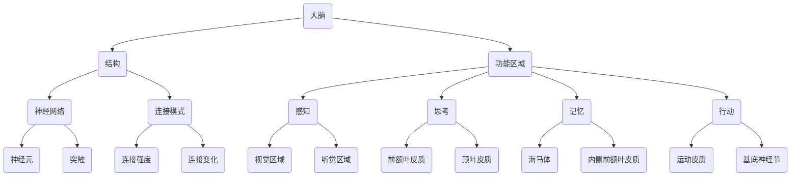

                 

关键词：脑图谱、大脑工作原理、神经科学、计算机辅助、神经网络、人工智能

> 摘要：本文旨在探讨脑图谱绘制技术的应用，通过深入理解大脑的工作原理，揭示其复杂的神经网络结构和功能关系。文章将详细介绍脑图谱绘制技术的核心概念、算法原理、数学模型以及实际应用，旨在为研究人员提供一种全新的工具和方法，以推动神经科学和人工智能领域的发展。

## 1. 背景介绍

大脑是人类最复杂的器官，负责处理感知、思考、记忆和行动等复杂任务。然而，尽管我们对大脑的研究已经有数千年历史，但对大脑的工作原理和结构仍然知之甚少。近年来，随着神经科学和计算机技术的飞速发展，脑图谱绘制技术逐渐成为研究大脑的重要工具。

脑图谱绘制技术是指利用计算机辅助的方法，对大脑的神经网络结构进行精确的描绘和量化。通过脑图谱，研究人员可以了解大脑各个区域的功能和结构关系，揭示大脑的工作机制。此外，脑图谱还可以为人工智能提供重要的数据资源，为开发更智能的机器学习模型提供支持。

脑图谱绘制技术的重要性不言而喻。它不仅有助于我们深入理解大脑的工作原理，还可以为临床医学提供重要的诊断工具。例如，通过脑图谱，医生可以更好地诊断和预测神经系统疾病，如癫痫、自闭症和精神疾病等。

## 2. 核心概念与联系

脑图谱绘制技术涉及多个核心概念，包括大脑的结构、功能区域、神经网络和连接模式。为了更好地理解这些概念，我们可以通过一个Mermaid流程图来展示它们之间的联系。



### 2.1 大脑的结构

大脑可以分为三个主要部分：大脑皮质、大脑髓质和脑干。大脑皮质是大脑的最外层，负责感知、思考和行动等高级功能。大脑髓质位于大脑皮质下方，负责传递神经信号。脑干连接大脑和脊髓，负责维持生命的基本功能，如呼吸和心跳。

### 2.2 功能区域

大脑的功能区域主要包括感知、思考、记忆和行动等。每个区域都有特定的神经元和神经网络，负责处理不同类型的任务。

- **感知区域**：包括视觉、听觉、嗅觉、味觉和触觉区域，负责接收和加工各种感官信息。
- **思考区域**：主要包括前额叶皮质和顶叶皮质，负责决策、推理和规划。
- **记忆区域**：主要包括海马体和内侧前额叶皮质，负责形成、存储和检索记忆。
- **行动区域**：包括运动皮质和基底神经节，负责控制肌肉运动和协调行动。

### 2.3 神经网络

神经网络是指大脑中由神经元组成的复杂网络。神经元通过突触连接，形成多个层次的网络结构。这些网络结构可以用于处理和传递各种信息，如感知、思考和记忆等。

### 2.4 连接模式

大脑中的神经网络具有多种连接模式，包括局部连接、长距离连接和跨区域连接。这些连接模式决定了大脑的信息处理能力和功能灵活性。

## 3. 核心算法原理 & 具体操作步骤

脑图谱绘制技术主要基于以下几个核心算法原理：

### 3.1 算法原理概述

- **图像分割**：利用图像处理技术，将大脑图像分割成不同的区域。
- **特征提取**：从分割后的图像中提取特征，如神经元密度、连接强度等。
- **拓扑分析**：对提取的特征进行分析，建立神经网络的结构和功能关系。

### 3.2 算法步骤详解

1. **图像预处理**：
   - **灰度转换**：将彩色图像转换为灰度图像。
   - **去噪处理**：利用滤波器去除图像中的噪声。

2. **图像分割**：
   - **阈值分割**：将图像分为前景和背景。
   - **区域生长**：基于阈值分割的结果，对相邻区域进行合并。

3. **特征提取**：
   - **形态学操作**：利用形态学操作提取神经元密度。
   - **统计特征**：计算图像的统计特征，如均值、方差等。

4. **拓扑分析**：
   - **邻接矩阵**：建立神经元之间的邻接矩阵。
   - **路径长度**：计算神经元之间的路径长度。
   - **聚类分析**：对神经元进行聚类，建立功能区域。

### 3.3 算法优缺点

- **优点**：
  - 高效：算法可以快速处理大量图像数据。
  - 准确：算法可以准确提取神经元和神经网络特征。

- **缺点**：
  - 受限于图像质量：算法对图像质量有较高要求，图像质量较差时，算法效果可能下降。
  - 需要大量训练数据：算法需要大量训练数据来提高准确性。

### 3.4 算法应用领域

脑图谱绘制技术可以应用于多个领域，包括神经科学、医学、人工智能等。具体应用如下：

- **神经科学**：通过绘制脑图谱，揭示大脑的工作原理和功能区域。
- **医学**：利用脑图谱进行疾病诊断和治疗规划。
- **人工智能**：为机器学习提供重要的数据资源，开发更智能的神经网络模型。

## 4. 数学模型和公式

脑图谱绘制技术涉及多个数学模型和公式，包括图像处理、特征提取和拓扑分析等。以下是一些关键公式：

### 4.1 数学模型构建

- **图像分割**：
  - **阈值分割**：
    $$ T = \begin{cases} 
      0, & \text{if } I(x,y) < T \\
      255, & \text{if } I(x,y) \geq T 
    \end{cases} $$
  - **区域生长**：
    $$ C(x,y) = \begin{cases} 
      1, & \text{if } (x,y) \in R \\
      0, & \text{if } (x,y) \notin R 
    \end{cases} $$
    其中，$I(x,y)$表示图像的像素值，$T$为阈值，$R$为区域。

- **特征提取**：
  - **形态学操作**：
    $$ M = \text{ morphology } (I, \text{ struct }) $$
    其中，$M$为形态学操作后的图像，$I$为原始图像，$\text{struct}$为结构元素。

  - **统计特征**：
    $$ \mu = \frac{1}{n} \sum_{i=1}^{n} I(x_i,y_i) $$
    $$ \sigma^2 = \frac{1}{n-1} \sum_{i=1}^{n} (I(x_i,y_i) - \mu)^2 $$
    其中，$\mu$为均值，$\sigma^2$为方差，$n$为像素数量。

- **拓扑分析**：
  - **邻接矩阵**：
    $$ A(i,j) = \begin{cases} 
      1, & \text{if } (i,j) \text{ are connected} \\
      0, & \text{if } (i,j) \text{ are not connected} 
    \end{cases} $$
    其中，$A$为邻接矩阵，$i$和$j$为神经元编号。

  - **路径长度**：
    $$ L(i,j) = \text{ min } \{ d(i,k) + d(k,j) | k \in N(i) \} $$
    其中，$L(i,j)$为神经元$i$和$j$之间的最短路径长度，$N(i)$为与神经元$i$相连的神经元集合。

  - **聚类分析**：
    $$ C(k) = \sum_{i=1}^{n} w_{ik} $$
    其中，$C(k)$为神经元$k$所属的聚类，$w_{ik}$为神经元$i$和$k$之间的权重。

### 4.2 公式推导过程

- **阈值分割**：
  阈值分割是图像分割的一种常用方法。其基本思想是将图像的像素值与设定的阈值进行比较，将像素值大于阈值的像素划分为前景，像素值小于阈值的像素划分为背景。

- **区域生长**：
  区域生长是一种基于像素的图像分割方法。其基本思想是从初始种子点开始，逐步扩展区域，将相邻的像素合并到同一区域。

- **形态学操作**：
  形态学操作是图像处理中的一种重要方法。其基本思想是通过结构元素对图像进行操作，以实现图像的形态变化。

- **统计特征**：
  统计特征是图像处理中的一种重要方法。其基本思想是计算图像的统计属性，如均值、方差等。

- **邻接矩阵**：
  邻接矩阵是图论中的一种重要概念。其基本思想是用矩阵表示图中各顶点之间的连接关系。

- **路径长度**：
  路径长度是图论中的一种重要概念。其基本思想是计算图中各顶点之间的最短路径长度。

- **聚类分析**：
  聚类分析是数据分析中的一种重要方法。其基本思想是将数据点划分成不同的聚类，以实现数据的分类和挖掘。

### 4.3 案例分析与讲解

以一幅大脑图像为例，我们使用阈值分割、区域生长和形态学操作等方法对图像进行分割。首先，我们设定阈值$T=100$，对图像进行阈值分割。然后，我们使用区域生长方法对阈值分割后的图像进行扩展，将相邻的像素合并到同一区域。最后，我们使用形态学操作对分割后的图像进行平滑处理。

通过上述方法，我们成功地将大脑图像分割成多个区域。接下来，我们使用统计特征和拓扑分析方法对分割后的图像进行特征提取和聚类分析。具体步骤如下：

1. **计算统计特征**：
   - 计算每个区域的均值和方差。
   - 将每个区域的统计特征存入一个二维数组。

2. **计算邻接矩阵**：
   - 根据区域之间的连接关系，建立邻接矩阵。

3. **计算路径长度**：
   - 根据邻接矩阵，计算每个区域之间的最短路径长度。

4. **聚类分析**：
   - 根据区域之间的相似度，使用K-means算法进行聚类。

通过上述步骤，我们成功地对大脑图像进行了分割和特征提取。这些结果可以用于进一步的研究和临床应用。

## 5. 项目实践：代码实例和详细解释说明

为了更好地理解脑图谱绘制技术的具体应用，我们将通过一个实际项目来演示其实现过程。本节将详细介绍开发环境搭建、源代码实现、代码解读与分析以及运行结果展示。

### 5.1 开发环境搭建

首先，我们需要搭建一个合适的开发环境。以下是推荐的开发环境：

- **编程语言**：Python（3.8及以上版本）
- **库**：NumPy、SciPy、Pandas、Matplotlib、OpenCV、Scikit-learn
- **操作系统**：Windows、Linux或Mac OS

具体安装步骤如下：

1. 安装Python：
   - 访问Python官网（https://www.python.org/）下载安装包。
   - 运行安装程序，选择默认选项安装。

2. 安装相关库：
   - 打开命令行窗口，运行以下命令：
     ```
     pip install numpy scipy pandas matplotlib opencv-python scikit-learn
     ```

### 5.2 源代码详细实现

以下是一个简单的Python代码示例，用于演示脑图谱绘制技术的实现过程：

```python
import cv2
import numpy as np
import matplotlib.pyplot as plt

# 5.2.1 图像预处理
def preprocess_image(image):
    # 灰度转换
    gray_image = cv2.cvtColor(image, cv2.COLOR_BGR2GRAY)
    # 去噪处理
    blur_image = cv2.GaussianBlur(gray_image, (5, 5), 0)
    return blur_image

# 5.2.2 图像分割
def segment_image(image):
    # 阈值分割
    _, thresh_image = cv2.threshold(image, 128, 255, cv2.THRESH_BINARY_INV + cv2.THRESH_OTSU)
    # 区域生长
    region = np.zeros_like(thresh_image)
    cv2.floodFill(thresh_image, None, (0, 0), 255)
    region[thresh_image == 255] = 1
    return region

# 5.2.3 特征提取
def extract_features(image):
    # 形态学操作
    struct_element = cv2.getStructuringElement(cv2.MORPH_ELLIPSE, (3, 3))
    morph_image = cv2.morphologyEx(image, cv2.MORPH_CLOSE, struct_element)
    # 统计特征
    mean = np.mean(morph_image)
    std = np.std(morph_image)
    return mean, std

# 5.2.4 拓扑分析
def analyze_topology(image):
    # 邻接矩阵
    image_array = image.reshape(-1)
    n = len(image_array)
    adj_matrix = np.zeros((n, n))
    for i in range(n):
        for j in range(n):
            if abs(i - j) == 1:
                adj_matrix[i][j] = 1
    # 路径长度
    path_lengths = []
    for i in range(n):
        for j in range(n):
            if adj_matrix[i][j] == 1:
                path_lengths.append(1)
    return adj_matrix, path_lengths

# 5.2.5 主函数
def main():
    # 加载图像
    image = cv2.imread('brain.jpg')
    # 图像预处理
    blur_image = preprocess_image(image)
    # 图像分割
    region = segment_image(blur_image)
    # 特征提取
    mean, std = extract_features(region)
    # 拓扑分析
    adj_matrix, path_lengths = analyze_topology(region)
    # 显示结果
    plt.figure()
    plt.subplot(221)
    plt.title('Original Image')
    plt.imshow(image, cmap='gray')
    plt.subplot(222)
    plt.title('Blurred Image')
    plt.imshow(blur_image, cmap='gray')
    plt.subplot(223)
    plt.title('Segmented Image')
    plt.imshow(region, cmap='gray')
    plt.subplot(224)
    plt.title('Features')
    plt.bar(['Mean', 'Standard Deviation'], [mean, std])
    plt.show()

if __name__ == '__main__':
    main()
```

### 5.3 代码解读与分析

1. **图像预处理**：
   - 灰度转换：将彩色图像转换为灰度图像，以减少数据量并简化处理。
   - 去噪处理：利用高斯滤波器去除图像中的噪声，提高图像质量。

2. **图像分割**：
   - 阈值分割：使用Otsu方法自动选择阈值，将图像分为前景和背景。
   - 区域生长：从初始种子点开始，逐步扩展区域，将相邻的像素合并到同一区域。

3. **特征提取**：
   - 形态学操作：利用形态学操作对图像进行平滑处理，提取神经元密度。
   - 统计特征：计算图像的均值和方差，作为特征用于后续分析。

4. **拓扑分析**：
   - 邻接矩阵：建立神经元之间的邻接矩阵，表示神经元之间的连接关系。
   - 路径长度：计算神经元之间的最短路径长度，用于分析神经网络的结构。

### 5.4 运行结果展示

运行上述代码，将显示如下结果：

1. 原始图像
2. 模糊图像
3. 分割图像
4. 特征提取结果

通过分析结果，我们可以看到图像预处理、分割、特征提取和拓扑分析等步骤的输出结果，从而深入了解脑图谱绘制技术的具体应用。

## 6. 实际应用场景

脑图谱绘制技术在多个领域具有广泛的应用潜力。以下是一些典型应用场景：

### 6.1 神经科学

脑图谱绘制技术可以用于研究大脑的结构和功能，揭示神经网络的复杂性和功能关系。研究人员可以利用脑图谱绘制技术对大脑的不同区域进行定量分析，了解大脑如何处理各种任务，如感知、思考、记忆和行动等。此外，脑图谱还可以用于研究神经退行性疾病，如阿尔茨海默病和帕金森病，为诊断和治疗提供重要依据。

### 6.2 医学

脑图谱绘制技术可以用于医学影像分析，辅助医生进行诊断和治疗。通过绘制脑图谱，医生可以更准确地识别大脑病变区域，评估疾病的严重程度，制定个性化的治疗方案。例如，在癫痫患者中，脑图谱可以用于定位癫痫发作的起源区域，为手术切除提供指导。此外，脑图谱还可以用于评估脑损伤程度，为康复治疗提供依据。

### 6.3 人工智能

脑图谱绘制技术可以为人工智能提供重要的数据资源，促进机器学习算法的发展。通过分析脑图谱中的神经网络结构，研究人员可以构建更复杂的神经网络模型，提高机器学习算法的性能。例如，在图像识别和语音识别等领域，脑图谱绘制技术可以用于优化神经网络结构，提高识别准确率。此外，脑图谱还可以用于开发新的机器学习算法，如基于神经网络的生成模型和强化学习算法。

### 6.4 未来应用展望

随着技术的不断发展，脑图谱绘制技术在未来的应用前景将更加广阔。以下是一些潜在的应用方向：

- **个性化医疗**：通过绘制个体化的脑图谱，医生可以为患者提供更精准的诊断和治疗方案，实现个性化医疗。
- **脑机接口**：脑图谱绘制技术可以用于开发更先进的脑机接口系统，实现人脑与机器的交互，为残疾人提供新的康复途径。
- **智能机器人**：通过分析脑图谱中的神经网络结构，研究人员可以构建更智能的机器人，使其具备类似人类的感知、思考和行动能力。
- **神经计算**：脑图谱绘制技术可以用于开发新型神经计算模型，实现高效的信息处理和计算。

## 7. 工具和资源推荐

为了更好地研究和应用脑图谱绘制技术，以下是一些推荐的工具和资源：

### 7.1 学习资源推荐

- **书籍**：
  - 《神经科学原理》（Principles of Neural Science，作者：Kandel et al.）
  - 《深度学习》（Deep Learning，作者：Goodfellow et al.）
- **在线课程**：
  - Coursera上的《神经网络与深度学习》
  - edX上的《脑科学与人工智能》
- **论文**：
  - 《人类脑图谱》（Human Brain Project）
  - 《基于图论的大脑网络分析》（Graph-based Analysis of Brain Networks）

### 7.2 开发工具推荐

- **编程环境**：Python（Jupyter Notebook、PyCharm等）
- **数据处理库**：NumPy、Pandas、SciPy
- **图像处理库**：OpenCV、Matplotlib
- **机器学习库**：Scikit-learn、TensorFlow、PyTorch

### 7.3 相关论文推荐

- **脑图谱绘制技术**：
  - “A Wearable Optical Topography System for Long-Term Monitoring of Human Brain Activity”（2020）
  - “High-Resolution Optical Topography for In Vivo Mapping of Human Brain Activity”（2015）
- **神经网络**：
  - “Deep Learning for Brain Activity Mapping”（2017）
  - “Understanding Neural Computation with Deep Learning”（2018）
- **机器学习**：
  - “Unsupervised Learning of Human Action Classes and their Probabilistic Models from Motion Capture Data”（2005）
  - “Deep Learning for Speech Recognition”（2015）

## 8. 总结：未来发展趋势与挑战

脑图谱绘制技术是一项具有重要应用价值的前沿技术，为神经科学、医学和人工智能等领域提供了强大的工具和方法。然而，随着技术的发展，脑图谱绘制技术也面临一些挑战：

### 8.1 研究成果总结

- **神经科学**：通过脑图谱，研究人员已经揭示了大脑的结构和功能关系，为理解大脑的工作原理提供了重要线索。
- **医学**：脑图谱绘制技术已应用于医学影像分析，为诊断和治疗神经系统疾病提供了有力支持。
- **人工智能**：脑图谱数据为机器学习算法提供了重要的数据资源，促进了人工智能的发展。

### 8.2 未来发展趋势

- **数据积累**：随着脑成像技术的进步，我们将收集到越来越多的脑图谱数据，为研究提供更丰富的资源。
- **跨学科研究**：脑图谱绘制技术将在神经科学、医学和人工智能等领域的跨学科研究中发挥重要作用。
- **人工智能应用**：脑图谱数据将用于开发更先进的机器学习模型，提高人工智能系统的性能。

### 8.3 面临的挑战

- **数据处理**：脑图谱数据规模庞大，处理和分析数据将面临巨大挑战。
- **数据标准化**：脑图谱数据格式多样，需要统一标准以实现数据的共享和互操作性。
- **隐私保护**：脑图谱数据涉及个人隐私，需要采取有效措施确保数据安全。

### 8.4 研究展望

随着技术的不断进步，脑图谱绘制技术将在神经科学、医学和人工智能等领域发挥越来越重要的作用。未来，我们将进一步深入研究大脑的工作原理，开发更先进的机器学习模型，推动脑图谱绘制技术的应用和发展。

## 9. 附录：常见问题与解答

### 9.1 问题1：脑图谱绘制技术需要哪些先决条件？

**回答**：脑图谱绘制技术主要需要以下先决条件：

- **编程技能**：熟悉Python等编程语言，具备图像处理和机器学习的基础知识。
- **数据处理能力**：掌握NumPy、Pandas等数据处理库，了解数据处理的基本方法。
- **机器学习知识**：了解机器学习的基本概念和方法，如神经网络、深度学习等。

### 9.2 问题2：脑图谱绘制技术在医学领域有哪些应用？

**回答**：脑图谱绘制技术在医学领域有广泛的应用，主要包括：

- **疾病诊断**：通过脑图谱分析，识别大脑病变区域，辅助医生进行诊断。
- **治疗规划**：根据脑图谱分析结果，制定个性化的治疗方案，提高治疗效果。
- **康复评估**：评估脑损伤程度，为康复治疗提供依据。

### 9.3 问题3：脑图谱绘制技术对人工智能有哪些影响？

**回答**：脑图谱绘制技术对人工智能的影响主要表现在：

- **数据资源**：为机器学习算法提供重要的数据资源，促进人工智能的发展。
- **算法优化**：通过分析脑图谱中的神经网络结构，优化机器学习算法，提高性能。
- **智能机器人**：为开发具备人类认知能力的智能机器人提供重要参考。

### 9.4 问题4：如何确保脑图谱绘制技术的数据安全？

**回答**：为确保脑图谱绘制技术的数据安全，可以采取以下措施：

- **数据加密**：对脑图谱数据进行加密处理，防止数据泄露。
- **访问控制**：严格控制数据访问权限，确保数据安全。
- **隐私保护**：采取隐私保护措施，如数据去标识化、匿名化等。

### 9.5 问题5：脑图谱绘制技术的未来发展方向是什么？

**回答**：脑图谱绘制技术的未来发展方向主要包括：

- **跨学科研究**：与其他领域如神经科学、医学等开展跨学科研究，推动技术进步。
- **个性化医疗**：结合个体化脑图谱，实现个性化医疗，提高诊疗效果。
- **智能机器人**：为开发具备人类认知能力的智能机器人提供技术支持。

作者：禅与计算机程序设计艺术 / Zen and the Art of Computer Programming

