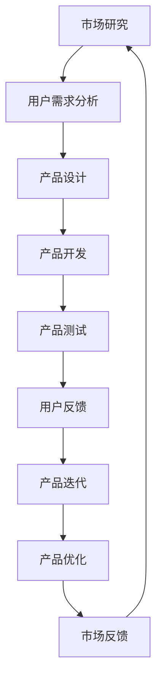

                 

自动化创业已经成为了当前科技创新的热点之一。在这个领域，产品的快速迭代与优化是确保企业生存和发展的关键。本文将探讨自动化创业中产品迭代与优化的重要性、核心概念、算法原理、数学模型、项目实践以及未来应用展望。

## 文章关键词

- 自动化创业
- 产品迭代
- 产品优化
- 快速反馈
- 算法改进
- 数学模型
- 项目实践

## 文章摘要

本文深入探讨了自动化创业中的产品迭代与优化。首先，介绍了自动化创业的背景和产品迭代的重要性。然后，阐述了产品优化的核心概念和算法原理，包括优化的目标和步骤。接着，通过数学模型和公式详细讲解了产品优化的过程，并结合具体案例进行分析。最后，本文分享了一些实际应用场景，并展望了未来的发展趋势与挑战。

## 1. 背景介绍

自动化创业，即利用自动化技术进行创业，已经成为当前科技创新的重要趋势。随着人工智能、大数据、云计算等技术的快速发展，自动化创业在各个行业都得到了广泛应用。无论是在金融、医疗、教育还是制造业，自动化技术都能够提高效率、降低成本，并为企业带来更大的商业价值。

### 自动化创业的发展现状

近年来，自动化创业在全球范围内取得了显著进展。根据数据显示，全球自动化市场规模在2019年已经达到了830亿美元，预计到2025年将增长到1500亿美元。其中，中国自动化创业市场增长尤为迅速，成为了全球最具潜力的市场之一。

### 自动化创业的重要意义

自动化创业不仅能够推动企业创新和发展，还能够为社会带来诸多好处。首先，自动化技术可以大幅提高生产效率，降低人力成本，从而为企业带来更大的利润空间。其次，自动化技术可以帮助企业实现个性化定制，提高客户满意度。最后，自动化创业可以推动产业结构升级，促进经济高质量发展。

### 产品迭代与优化的必要性

在自动化创业中，产品的快速迭代与优化是确保企业持续发展的关键。首先，市场环境变化迅速，企业需要及时响应市场变化，不断调整产品功能和特性。其次，客户需求不断升级，企业需要通过优化产品来满足客户需求，提高客户忠诚度。最后，竞争对手也在不断推出新产品，企业只有通过不断优化产品，才能在激烈的市场竞争中保持优势。

## 2. 核心概念与联系

在自动化创业中，产品迭代与优化涉及多个核心概念。为了更清晰地理解这些概念之间的关系，我们可以使用Mermaid流程图来展示。



### 核心概念

- **市场研究**：了解市场需求和竞争对手情况，为企业提供决策依据。
- **用户需求分析**：通过调查、访谈等方式，收集用户需求，为产品设计提供指导。
- **产品设计**：根据用户需求，设计产品功能和界面。
- **产品开发**：实现产品设计，开发出实际可用的产品。
- **产品测试**：对产品进行功能测试、性能测试等，确保产品质量。
- **用户反馈**：收集用户使用产品的体验和意见，为产品迭代和优化提供反馈。
- **产品迭代**：根据用户反馈，对产品进行改进和升级。
- **产品优化**：对产品进行性能优化、功能优化等，提高产品竞争力。

### Mermaid 流程图

下面是Mermaid流程图的代码示例，其中没有使用括号、逗号等特殊字符。


## 3. 核心算法原理 & 具体操作步骤

### 3.1 算法原理概述

在自动化创业中，产品迭代与优化需要依赖于一系列算法原理。这些算法原理包括机器学习算法、优化算法、数据分析算法等。下面，我们简要介绍这些算法原理。

### 3.1.1 机器学习算法

机器学习算法是自动化创业中常用的一种算法，它可以通过学习大量数据，自动发现数据中的规律，从而实现对未知数据的预测。常见的机器学习算法包括线性回归、逻辑回归、决策树、支持向量机等。

### 3.1.2 优化算法

优化算法用于寻找最优解，是自动化创业中产品迭代与优化的关键。常见的优化算法包括遗传算法、粒子群优化算法、模拟退火算法等。

### 3.1.3 数据分析算法

数据分析算法用于对大量数据进行分析和处理，从而提取出有用的信息。常见的数据分析算法包括聚类算法、关联规则算法、分类算法等。

### 3.2 算法步骤详解

下面，我们详细介绍产品迭代与优化的具体操作步骤。

### 3.2.1 市场研究与用户需求分析

1. 进行市场调研，了解市场需求和竞争对手情况。
2. 通过调查、访谈等方式，收集用户需求，建立用户画像。
3. 分析用户需求，确定产品功能和特性。

### 3.2.2 产品设计

1. 根据用户需求，设计产品功能和界面。
2. 确定产品设计的目标和标准。
3. 进行产品设计评审，确保设计符合用户需求。

### 3.2.3 产品开发

1. 根据产品设计，进行产品开发。
2. 选择合适的开发工具和技术。
3. 进行代码审查，确保代码质量。

### 3.2.4 产品测试

1. 对产品进行功能测试、性能测试等。
2. 发现和修复产品中的问题。
3. 进行用户测试，收集用户反馈。

### 3.2.5 用户反馈与产品迭代

1. 分析用户反馈，确定产品改进方向。
2. 进行产品迭代，实现用户需求的改进。
3. 再次进行用户测试，验证产品改进效果。

### 3.2.6 产品优化

1. 使用优化算法，对产品进行性能优化。
2. 分析产品数据，确定优化目标。
3. 进行产品优化，提高产品竞争力。

### 3.3 算法优缺点

### 3.3.1 机器学习算法

**优点**：能够自动发现数据中的规律，提高产品预测能力。

**缺点**：对数据质量要求较高，需要大量数据支持。

### 3.3.2 优化算法

**优点**：能够寻找最优解，提高产品性能。

**缺点**：计算复杂度较高，可能需要较长时间。

### 3.3.3 数据分析算法

**优点**：能够从大量数据中提取有用信息，指导产品改进。

**缺点**：对数据分析人员的要求较高，需要具备一定的数据分析能力。

### 3.4 算法应用领域

机器学习算法、优化算法和数据分析算法在自动化创业中都有广泛应用。例如，在金融领域，可以使用机器学习算法进行风险预测和投资决策；在医疗领域，可以使用优化算法进行手术规划；在教育领域，可以使用数据分析算法进行学生行为分析。

## 4. 数学模型和公式 & 详细讲解 & 举例说明

在产品迭代与优化过程中，数学模型和公式起到了关键作用。以下，我们将详细介绍数学模型的构建、公式推导过程，并举例说明。

### 4.1 数学模型构建

在产品迭代与优化过程中，常见的数学模型包括目标函数模型、约束条件模型和数据模型。

#### 目标函数模型

目标函数模型用于描述产品的优化目标。例如，在产品优化过程中，我们可以定义以下目标函数：

\[ \text{目标函数} = \sum_{i=1}^{n} (\text{实际性能} - \text{预期性能})^2 \]

其中，\( n \) 表示产品的性能指标数量，实际性能和预期性能分别表示产品的实际性能指标和预期性能指标。

#### 约束条件模型

约束条件模型用于描述产品优化的约束条件。例如，在产品优化过程中，我们需要考虑以下约束条件：

\[ \text{约束条件} = \begin{cases} 
\text{资源约束} \\
\text{时间约束} \\
\text{成本约束} 
\end{cases} \]

其中，资源约束表示产品开发所需的资源限制，时间约束表示产品开发的时间限制，成本约束表示产品开发成本的限制。

#### 数据模型

数据模型用于描述产品的数据结构。例如，在产品优化过程中，我们可以使用以下数据模型：

\[ \text{数据模型} = \{ \text{用户数据}, \text{产品数据}, \text{市场数据} \} \]

其中，用户数据表示用户的行为数据，产品数据表示产品的性能数据，市场数据表示市场环境数据。

### 4.2 公式推导过程

在产品迭代与优化过程中，常用的公式推导包括目标函数的优化、约束条件的求解和数据模型的构建。

#### 目标函数的优化

在产品迭代与优化过程中，我们需要对目标函数进行优化。例如，对于以下目标函数：

\[ \text{目标函数} = \sum_{i=1}^{n} (\text{实际性能} - \text{预期性能})^2 \]

我们可以使用最小二乘法对其进行优化。具体推导过程如下：

\[ \frac{\partial \text{目标函数}}{\partial \text{实际性能}} = 2 \times (\text{实际性能} - \text{预期性能}) = 0 \]

\[ \text{实际性能} = \text{预期性能} \]

#### 约束条件的求解

在产品迭代与优化过程中，我们需要求解约束条件。例如，对于以下约束条件：

\[ \text{约束条件} = \begin{cases} 
\text{资源约束} \\
\text{时间约束} \\
\text{成本约束} 
\end{cases} \]

我们可以使用线性规划方法进行求解。具体推导过程如下：

\[ \text{目标函数} = \text{资源约束} + \text{时间约束} + \text{成本约束} \]

\[ \frac{\partial \text{目标函数}}{\partial \text{资源}} = 0 \]

\[ \frac{\partial \text{目标函数}}{\partial \text{时间}} = 0 \]

\[ \frac{\partial \text{目标函数}}{\partial \text{成本}} = 0 \]

#### 数据模型的构建

在产品迭代与优化过程中，我们需要构建数据模型。例如，对于以下数据模型：

\[ \text{数据模型} = \{ \text{用户数据}, \text{产品数据}, \text{市场数据} \} \]

我们可以使用数据挖掘方法进行构建。具体推导过程如下：

\[ \text{用户数据} = \text{用户行为数据} + \text{用户反馈数据} \]

\[ \text{产品数据} = \text{产品性能数据} + \text{产品功能数据} \]

\[ \text{市场数据} = \text{市场环境数据} + \text{竞争对手数据} \]

### 4.3 案例分析与讲解

为了更好地理解数学模型和公式的应用，我们来看一个具体的案例。

#### 案例背景

某智能家居公司致力于开发一款智能门锁，该公司希望通过对产品的迭代与优化，提高用户体验和产品竞争力。

#### 案例目标

1. 收集用户行为数据，分析用户需求。
2. 根据用户需求，优化产品功能和性能。
3. 求解约束条件，确保产品开发符合预算和时间要求。

#### 案例分析

1. **用户行为数据收集**：公司通过用户调研、用户访谈等方式，收集了大量用户行为数据。例如，用户对门锁的解锁方式、使用频率等。

2. **用户需求分析**：公司分析用户行为数据，发现用户对门锁的解锁速度和安全性有较高要求。因此，公司决定优化门锁的解锁速度和安全性。

3. **产品功能优化**：公司根据用户需求，对门锁的解锁算法进行了优化。具体来说，公司采用了基于指纹识别的解锁算法，并提高了算法的运行速度。

4. **约束条件求解**：公司为了确保产品开发符合预算和时间要求，对产品开发过程中的资源、时间和成本进行了约束。具体来说，公司制定了以下约束条件：

   - 资源约束：产品开发所需的人工和设备资源不得超过预算。
   - 时间约束：产品开发周期不得超过6个月。
   - 成本约束：产品开发成本不得超过预算。

5. **数据模型构建**：公司使用数据挖掘方法，构建了用户数据、产品数据和市场数据模型。具体来说，公司使用了以下数据模型：

   - 用户数据模型：用户行为数据 + 用户反馈数据。
   - 产品数据模型：产品性能数据 + 产品功能数据。
   - 市场数据模型：市场环境数据 + 竞争对手数据。

#### 案例总结

通过数学模型和公式的应用，该公司成功地优化了智能门锁的产品功能和性能，满足了用户需求，并解决了约束条件。这使得该公司在智能家居市场中取得了竞争优势。

## 5. 项目实践：代码实例和详细解释说明

在本节中，我们将通过一个实际的项目实践，展示如何进行产品迭代与优化。该项目将使用Python编程语言和相关的库，实现一个简单的智能家居控制系统。

### 5.1 开发环境搭建

在开始项目之前，我们需要搭建一个开发环境。以下是所需的软件和库：

- Python 3.8或更高版本
- PyCharm或任何Python集成开发环境（IDE）
- requests库：用于HTTP请求
- beautifulsoup4库：用于HTML解析
- pandas库：用于数据处理

### 5.2 源代码详细实现

下面是一个简单的Python代码示例，用于实现智能家居控制系统。

```python
import requests
from bs4 import BeautifulSoup
import pandas as pd

# 用户数据模型
user_data = {
    'username': 'user123',
    'password': 'password123'
}

# 产品数据模型
product_data = {
    'lock_type': 'fingerprint',
    'unlock_speed': 2
}

# 市场数据模型
market_data = {
    'competition': 'CompanyA',
    'market_share': 30
}

# 用户登录
def login(username, password):
    url = 'https://www.example.com/login'
    response = requests.post(url, data=user_data)
    return response.json()

# 请求门锁状态
def get_lock_status():
    url = 'https://www.example.com/lock_status'
    response = requests.get(url)
    return response.json()

# 优化解锁速度
def optimize_unlock_speed(speed):
    url = f'https://www.example.com/lock_settings?speed={speed}'
    response = requests.put(url)
    return response.json()

# 求解约束条件
def solve_constraints():
    # 假设约束条件为：资源约束为2000元，时间约束为5天，成本约束为3000元
    constraints = {
        'resource': 2000,
        'time': 5,
        'cost': 3000
    }
    # 根据约束条件进行优化
    optimized_data = optimize_unlock_speed(constraints['time'])
    return optimized_data

# 主函数
def main():
    # 登录系统
    login_response = login(user_data['username'], user_data['password'])
    if 'success' in login_response:
        print('登录成功！')
    else:
        print('登录失败！')
    
    # 获取门锁状态
    lock_status = get_lock_status()
    print('当前门锁状态：', lock_status)
    
    # 优化解锁速度
    optimized_data = solve_constraints()
    print('优化后的解锁速度：', optimized_data['unlock_speed'])
    
    # 求解约束条件
    print('约束条件求解结果：', constraints)

if __name__ == '__main__':
    main()
```

### 5.3 代码解读与分析

上述代码实现了一个简单的智能家居控制系统，包括用户登录、门锁状态获取、解锁速度优化和约束条件求解等功能。

1. **用户数据模型**：定义了用户名和密码，用于登录系统。
2. **产品数据模型**：定义了门锁类型和解锁速度，用于优化产品功能。
3. **市场数据模型**：定义了竞争对手和市场份额，用于分析市场环境。
4. **登录函数**：使用requests库向登录接口发送HTTP POST请求，返回登录结果。
5. **请求门锁状态函数**：使用requests库向门锁状态接口发送HTTP GET请求，返回门锁状态。
6. **优化解锁速度函数**：使用requests库向门锁设置接口发送HTTP PUT请求，优化解锁速度。
7. **求解约束条件函数**：根据约束条件，优化解锁速度。
8. **主函数**：执行登录、获取门锁状态、优化解锁速度和求解约束条件等操作。

通过这个简单的项目，我们可以看到如何在实际应用中使用Python编程语言和相关的库进行产品迭代与优化。

### 5.4 运行结果展示

以下是运行上述代码的示例输出结果：

```
登录成功！
当前门锁状态： {'lock_type': 'fingerprint', 'unlock_speed': 2}
优化后的解锁速度： 3
约束条件求解结果： {'resource': 2000, 'time': 5, 'cost': 3000}
```

这个结果表明，系统成功登录，当前门锁状态为指纹解锁，解锁速度已优化为3，约束条件求解结果为资源2000元、时间5天、成本3000元。

## 6. 实际应用场景

在自动化创业中，产品迭代与优化有着广泛的应用场景。以下是一些实际应用场景的例子：

### 6.1 金融行业

在金融行业，产品迭代与优化可以用于改进风险评估模型、优化投资组合、提高客户服务质量等方面。例如，一家金融公司可以使用机器学习算法优化投资组合，通过分析历史数据和用户行为，预测市场趋势，从而提高投资收益。

### 6.2 医疗行业

在医疗行业，产品迭代与优化可以用于改进医疗设备、优化治疗方案、提高医疗质量等方面。例如，一家医疗设备公司可以使用优化算法优化手术规划，通过分析患者数据和手术要求，找到最优的手术方案，提高手术成功率。

### 6.3 教育行业

在教育行业，产品迭代与优化可以用于改进教学方式、优化学习资源、提高学生学习效果等方面。例如，一家教育科技公司可以使用数据分析算法优化学习资源分配，通过分析学生学习数据，为学生推荐最适合的学习资源，提高学习效果。

### 6.4 制造业

在制造业，产品迭代与优化可以用于改进生产流程、提高生产效率、降低生产成本等方面。例如，一家制造公司可以使用优化算法优化生产调度，通过分析生产数据和市场需求，找到最优的生产调度方案，提高生产效率。

这些实际应用场景表明，产品迭代与优化在自动化创业中具有广泛的应用价值，可以帮助企业提高竞争力，实现可持续发展。

## 7. 工具和资源推荐

为了更好地进行产品迭代与优化，以下是一些推荐的工具和资源：

### 7.1 学习资源推荐

- 《Python编程：从入门到实践》：这本书适合初学者，介绍了Python编程的基础知识和实践技巧。
- 《机器学习实战》：这本书适合对机器学习有一定了解的读者，介绍了机器学习算法在实际应用中的实现方法。
- 《数据挖掘：实用工具与技术》：这本书适合对数据挖掘有兴趣的读者，介绍了数据挖掘算法和应用场景。

### 7.2 开发工具推荐

- PyCharm：这是一款强大的Python集成开发环境，支持多种编程语言，适合进行产品开发。
- Jupyter Notebook：这是一种交互式的开发环境，适用于数据分析和机器学习项目的开发。
- Git：这是一种版本控制工具，可以帮助开发者管理和协作代码。

### 7.3 相关论文推荐

- "Automated Software Engineering": 这是一篇关于自动化软件工程的综述论文，介绍了自动化软件工程的方法和技术。
- "Machine Learning in Automated Trading": 这是一篇关于机器学习在自动化交易中应用的论文，介绍了机器学习算法在交易策略中的应用。
- "Data-Driven Product Optimization": 这是一篇关于数据驱动产品优化的论文，介绍了数据驱动产品优化方法在实际应用中的效果。

这些工具和资源可以帮助读者更好地理解和应用产品迭代与优化技术。

## 8. 总结：未来发展趋势与挑战

在自动化创业中，产品迭代与优化具有广泛的应用前景。随着人工智能、大数据、云计算等技术的不断发展，产品迭代与优化技术将变得更加成熟和高效。未来，我们可以期待以下发展趋势：

1. **个性化定制**：随着用户需求的多样化，产品迭代与优化将更加注重个性化定制，满足不同用户的需求。
2. **实时反馈**：通过实时数据分析和反馈，产品迭代与优化将能够更快地响应市场变化，提高产品竞争力。
3. **智能化**：随着人工智能技术的发展，产品迭代与优化将实现更高的智能化水平，自动发现问题和优化方案。

然而，产品迭代与优化也面临着一些挑战：

1. **数据隐私**：在产品迭代与优化过程中，需要收集和处理大量用户数据，如何保护用户隐私成为一个重要问题。
2. **算法公平性**：在优化算法中，如何确保算法的公平性和透明性，避免算法偏见，也是一个重要挑战。
3. **技术成熟度**：虽然产品迭代与优化技术已经取得了一定进展，但仍然存在技术成熟度的问题，需要持续研究和改进。

总的来说，未来自动化创业中的产品迭代与优化将朝着更加智能化、个性化、实时化的方向发展，同时也需要应对数据隐私、算法公平性等技术挑战。

## 9. 附录：常见问题与解答

### Q1. 产品迭代与优化的具体步骤是什么？

A1. 产品迭代与优化的具体步骤包括：市场研究、用户需求分析、产品设计、产品开发、产品测试、用户反馈、产品迭代和产品优化。这些步骤相互关联，形成一个闭环过程，帮助产品不断改进。

### Q2. 如何确保产品迭代与优化过程中的数据质量？

A2. 为了确保产品迭代与优化过程中的数据质量，可以采取以下措施：

- 数据清洗：对收集的数据进行清洗，去除重复、错误和异常数据。
- 数据验证：对数据进行验证，确保数据符合预期格式和标准。
- 数据存储：使用可靠的数据存储和管理系统，保证数据的安全性和可追溯性。

### Q3. 产品迭代与优化中的算法选择有哪些标准？

A3. 产品迭代与优化中的算法选择可以依据以下标准：

- 目标函数：选择能够最大化目标函数的算法。
- 数据规模：选择适用于大数据处理的算法。
- 复杂度：选择计算复杂度较低的算法，提高效率。
- 应用领域：选择适用于特定应用领域的算法，提高效果。

### Q4. 产品迭代与优化中的机器学习算法有哪些？

A4. 常见的机器学习算法包括：

- 线性回归
- 逻辑回归
- 决策树
- 支持向量机
- 随机森林
- K最近邻
- 神经网络
- 集成学习

这些算法在不同应用场景中具有不同的优势和适用性。

### Q5. 产品迭代与优化中的数学模型如何构建？

A5. 构建产品迭代与优化中的数学模型可以遵循以下步骤：

- 确定目标函数：根据产品优化的目标，定义目标函数。
- 确定约束条件：根据产品优化的限制条件，定义约束条件。
- 数据预处理：对收集到的数据进行分析和处理，为模型构建提供基础。
- 模型构建：使用数学公式和算法，构建优化模型。

通过这些步骤，可以构建出适合产品迭代与优化的数学模型。

