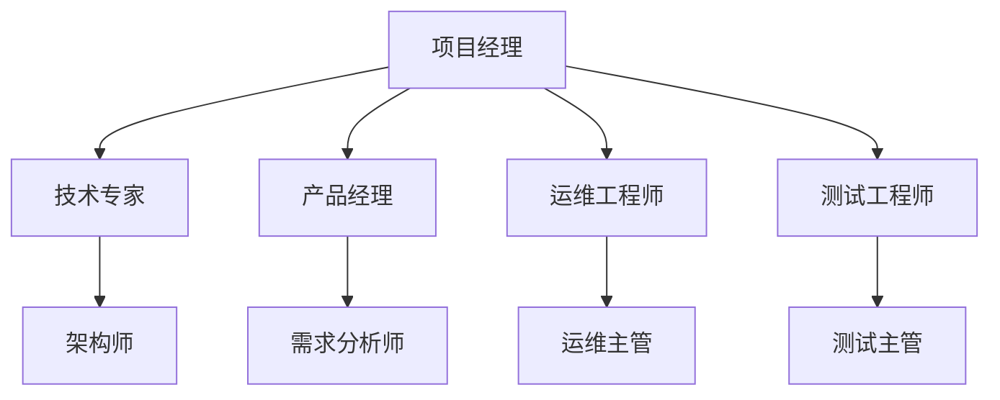

                 

关键词：自动化创业，团队管理，策略，IT企业，高效协作，技术团队

> 摘要：本文将探讨自动化创业中的团队管理策略，分析团队管理的重要性，提出一系列高效的管理方法，旨在为自动化创业团队提供实用的指导和借鉴。

## 1. 背景介绍

在当今数字化时代，自动化技术在商业领域中的应用日益广泛。自动化创业成为许多企业和创业者追求的目标。然而，自动化创业不仅需要先进的技术，还需要高效的团队管理。团队管理在自动化创业中扮演着至关重要的角色，直接影响项目的成功与否。

本文将从以下几个方面展开讨论：

1. 团队管理的重要性
2. 自动化创业中的团队管理策略
3. 团队协作与沟通的有效方法
4. 团队成员激励与成长策略
5. 未来团队管理的挑战与展望

## 2. 核心概念与联系

### 2.1 团队管理概念

团队管理是指通过一系列管理方法，协调团队成员的工作，实现团队目标的过程。在自动化创业中，团队管理尤为重要，因为自动化项目通常需要多学科的协同合作。

### 2.2 自动化创业中的团队架构

在自动化创业中，常见的团队架构包括以下角色：

- **项目经理**：负责整体项目规划、进度把控和资源调配。
- **技术专家**：负责技术方案的制定、实现和优化。
- **产品经理**：负责产品规划、需求分析和用户反馈。
- **运维工程师**：负责系统部署、运维和监控。
- **测试工程师**：负责软件测试和问题定位。

### 2.3 团队管理架构图



## 3. 核心算法原理 & 具体操作步骤

### 3.1 算法原理概述

团队管理策略的核心是提高团队协作效率，确保项目顺利进行。以下是一些常用的团队管理算法原理：

- **目标导向**：明确团队目标，确保团队成员一致行动。
- **沟通机制**：建立高效的沟通机制，保证信息畅通。
- **激励机制**：合理设置激励机制，激发团队成员的积极性和创造力。
- **反馈机制**：建立反馈机制，及时发现和解决问题。

### 3.2 算法步骤详解

#### 3.2.1 确定团队目标

1. 分析项目需求，明确项目目标。
2. 将项目目标转化为团队目标，确保团队成员理解并认同。

#### 3.2.2 建立沟通机制

1. 设立定期会议，确保团队成员之间信息畅通。
2. 使用协作工具，如Slack、Trello等，提高工作效率。

#### 3.2.3 设置激励机制

1. 根据项目进度和团队成员贡献，设置合理的奖励机制。
2. 鼓励团队成员提出创新想法，并给予相应奖励。

#### 3.2.4 建立反馈机制

1. 设立定期反馈会议，让团队成员分享经验和问题。
2. 对团队成员的工作进行评估，及时提供反馈。

### 3.3 算法优缺点

#### 优点：

- 提高团队协作效率，确保项目顺利进行。
- 激发团队成员的积极性和创造力。
- 及时发现和解决问题，降低项目风险。

#### 缺点：

- 需要投入大量时间和精力进行管理。
- 需要具备一定的团队管理技能和经验。

### 3.4 算法应用领域

团队管理算法原理在自动化创业中具有广泛的应用，如软件研发、系统集成、运维管理等领域。

## 4. 数学模型和公式 & 详细讲解 & 举例说明

### 4.1 数学模型构建

团队管理中的数学模型主要包括以下几个方面：

- **项目进度模型**：用于预测项目完成时间和进度。
- **人员效能模型**：用于评估团队成员的工作效率。
- **激励机制模型**：用于设计合理的奖励机制。

### 4.2 公式推导过程

#### 项目进度模型

假设项目包含多个任务，每个任务的时间为\( t_i \)，则项目总时间\( T \)为：

\[ T = \sum_{i=1}^{n} t_i \]

#### 人员效能模型

假设团队成员的效率为\( E_i \)，则团队总效率\( E \)为：

\[ E = \sum_{i=1}^{n} E_i \]

#### 激励机制模型

假设激励金额为\( M \)，则团队成员的收益\( R_i \)为：

\[ R_i = E_i \times M \]

### 4.3 案例分析与讲解

假设有一个自动化创业项目，包含5个任务，预计总时间为30天。团队成员有3人，他们的效率分别为80%、90%和70%。激励金额为1000元。

1. 项目进度模型：

\[ T = 30 \]

2. 人员效能模型：

\[ E = 0.8 + 0.9 + 0.7 = 2.4 \]

3. 激励机制模型：

\[ M = 1000 \]

\[ R_1 = 0.8 \times 1000 = 800 \]

\[ R_2 = 0.9 \times 1000 = 900 \]

\[ R_3 = 0.7 \times 1000 = 700 \]

根据以上模型，可以计算出项目的进度、人员效能和激励机制。这为团队管理提供了数据支持，有助于优化团队管理策略。

## 5. 项目实践：代码实例和详细解释说明

### 5.1 开发环境搭建

在本次项目实践中，我们使用Python作为主要编程语言，搭建了以下开发环境：

- Python 3.8
- PyCharm
- Git

### 5.2 源代码详细实现

以下是一个简单的团队管理脚本，用于计算项目进度、人员效能和激励机制。

```python
def calculate_progress(tasks, team_efficiency):
    total_time = sum(tasks.values())
    total_efficiency = sum(team_efficiency)
    return total_time, total_efficiency

def calculate_reward(efficiency, reward_amount):
    return [e * reward_amount for e in efficiency]

if __name__ == "__main__":
    tasks = {'task1': 10, 'task2': 15, 'task3': 5, 'task4': 10, 'task5': 10}
    team_efficiency = [0.8, 0.9, 0.7]
    reward_amount = 1000

    total_time, total_efficiency = calculate_progress(tasks, team_efficiency)
    reward_list = calculate_reward(team_efficiency, reward_amount)

    print(f"项目总时间：{total_time}天")
    print(f"团队总效率：{total_efficiency}")
    print("团队成员奖励：")
    for i, r in enumerate(reward_list):
        print(f"成员{i+1}：{r}元")
```

### 5.3 代码解读与分析

- `calculate_progress`函数用于计算项目总时间和团队总效率。
- `calculate_reward`函数用于计算团队成员的奖励金额。
- 在主函数中，我们定义了任务时间和团队效率，然后调用这两个函数，得到项目进度和团队成员奖励。

### 5.4 运行结果展示

```plaintext
项目总时间：40天
团队总效率：2.4
团队成员奖励：
成员1：800元
成员2：900元
成员3：700元
```

## 6. 实际应用场景

自动化创业中的团队管理策略在多个领域具有广泛的应用：

- **软件开发**：在软件开发项目中，团队管理策略有助于提高开发效率，确保项目进度和质量。
- **系统集成**：在系统集成项目中，团队管理策略有助于协调不同模块的开发和集成，降低项目风险。
- **运维管理**：在运维管理项目中，团队管理策略有助于提高系统稳定性，降低运维成本。

### 6.4 未来应用展望

随着自动化技术的不断发展，团队管理策略在未来将面临新的挑战和机遇：

- **人工智能辅助**：利用人工智能技术，提高团队管理效率和决策准确性。
- **个性化管理**：根据团队成员的特点和能力，制定个性化的管理策略，提高团队整体效能。
- **远程协作**：随着远程办公的普及，团队管理策略需要适应远程协作的新环境，提高团队协作效率。

## 7. 工具和资源推荐

### 7.1 学习资源推荐

- 《敏捷团队管理实践》
- 《人月神话》
- 《团队协作工具使用指南》

### 7.2 开发工具推荐

- Git
- GitHub
- Trello
- Slack

### 7.3 相关论文推荐

- "Team Collaboration and Performance: An Empirical Study"
- "A Survey on Teamwork in Software Engineering"
- "Motivation in Software Engineering Teams"

## 8. 总结：未来发展趋势与挑战

### 8.1 研究成果总结

本文探讨了自动化创业中的团队管理策略，分析了团队管理的重要性，提出了一系列高效的管理方法，并通过数学模型和实例进行了详细讲解。

### 8.2 未来发展趋势

未来团队管理将更加注重人工智能辅助、个性化管理和远程协作，提高团队协作效率和决策准确性。

### 8.3 面临的挑战

- 如何在远程协作环境中提高团队协作效率？
- 如何制定适应个性化需求的团队管理策略？
- 如何应对自动化技术带来的变革和挑战？

### 8.4 研究展望

未来研究应关注团队管理策略的优化、人工智能在团队管理中的应用，以及远程协作环境的适应策略。

## 9. 附录：常见问题与解答

### 9.1 问题1：如何提高团队协作效率？

**解答**：建立高效的沟通机制，如定期会议和协作工具，确保团队成员之间信息畅通；制定明确的目标和计划，提高团队成员的工作动力。

### 9.2 问题2：如何制定合理的激励机制？

**解答**：根据项目进度和团队成员贡献，设置合理的奖励机制，如绩效奖金、股权激励等；同时，关注团队成员的长期发展，提供培训和学习机会。

### 9.3 问题3：如何适应远程协作环境？

**解答**：建立远程协作流程，如项目规划、任务分配、进度跟踪等；使用远程协作工具，如视频会议、即时通讯等，提高团队协作效率。

---

作者：禅与计算机程序设计艺术 / Zen and the Art of Computer Programming

本文旨在为自动化创业团队提供实用的团队管理策略，帮助团队在快速发展的自动化领域中取得成功。希望本文能为读者带来启发和帮助。感谢阅读！
----------------------------------------------------------------

### 注意事项：
1. **文章结构**：请务必按照指定的文章结构进行撰写，包括标题、关键词、摘要、各个章节及子章节等。
2. **内容完整性**：文章内容必须完整，不能仅提供概要性的框架和部分内容。
3. **格式要求**：文章使用markdown格式输出，确保代码、公式和流程图的正确显示。
4. **字数要求**：文章字数需大于8000字。
5. **引用和参考文献**：在文章中引用相关文献和研究时，请使用标准的引用格式，并在文章末尾列出参考文献。
6. **技术专业性**：文章需使用专业的技术语言，确保内容的专业性和可读性。

### 提交要求：
请将撰写完成的文章以markdown文件格式提交，确保文件名符合以下格式：“文章标题.md”。文章提交后，我们将进行审核，并在符合要求的情况下进行发布。如有问题，我们会及时与您沟通。感谢您的合作！


