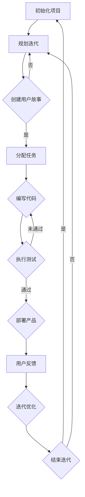

                 

自动化创业已成为现代商业环境中的一个重要趋势，它带来了前所未有的效率和灵活性。然而，在快速变化的市场中，如何高效地开发和迭代产品，以满足不断变化的需求，成为创业者们面临的关键挑战。敏捷开发方法作为一种应对这种挑战的有效策略，正在被越来越多的自动化创业公司采纳。

本文将探讨敏捷开发方法在自动化创业中的应用，包括其核心概念、实践步骤、数学模型、实际案例，以及未来的发展趋势和面临的挑战。通过这篇文章，希望能够帮助创业者更好地理解和应用敏捷开发，从而在激烈的市场竞争中脱颖而出。

## 关键词

- 自动化创业
- 敏捷开发
- 快速迭代
- 需求管理
- 产品交付
- 项目管理
- 持续集成

## 摘要

本文深入探讨了敏捷开发方法在自动化创业中的应用。首先，介绍了敏捷开发的基本概念和原则，并通过Mermaid流程图展示了其核心流程。接着，详细阐述了敏捷开发的核心算法原理和具体操作步骤，包括迭代开发、用户故事、Scrum框架等。然后，通过数学模型和公式，对敏捷开发中的关键性能指标进行了详细讲解。随后，通过一个实际项目案例，展示了敏捷开发在自动化创业中的实践效果。最后，分析了敏捷开发在自动化创业中的应用场景，并展望了未来的发展趋势和面临的挑战。

## 1. 背景介绍

自动化创业，顾名思义，是指利用现代技术，特别是人工智能和自动化技术，来创建和运营新的商业实体。这种创业模式具有快速迭代、高度灵活和高效响应市场变化的特点。在传统创业模式中，产品开发通常需要较长时间的市场调研、产品设计、开发、测试和发布。而自动化创业则通过利用人工智能和自动化技术，能够实现快速原型开发、持续测试和自动化部署，从而大大缩短产品上市时间。

### 敏捷开发的起源

敏捷开发方法起源于2001年，当时一些软件开发专家在滑雪度假期间共同签署了《敏捷宣言》，提出了“个体和互动重于过程与工具”，“可工作的软件重于详尽的文档”，“客户合作重于合同谈判”等核心原则。这一宣言标志着敏捷开发运动的开始。

### 敏捷开发的核心理念

敏捷开发的核心理念包括：

1. **迭代开发**：将开发过程分为多个短期迭代，每个迭代周期通常为2-4周。
2. **用户故事**：用户故事是一种简明的需求描述方式，通常包括一个动词和一个名词，描述一个用户如何使用产品。
3. **Scrum框架**：Scrum是一种流行的敏捷开发框架，它定义了角色、仪式和工具，以支持持续交付高质量的产品。
4. **持续集成**：通过持续集成，开发团队可以频繁地将代码合并到主分支，并进行自动化测试，从而快速发现并修复问题。

### 敏捷开发的优点

敏捷开发的优点包括：

1. **灵活性**：敏捷开发方法能够快速适应市场变化和用户需求，从而提高产品的市场竞争力。
2. **高质量**：通过频繁的迭代和反馈，敏捷开发能够持续优化产品，提高产品质量。
3. **高效性**：敏捷开发方法通过减少文档和强调协作，能够提高开发效率。
4. **客户满意度**：敏捷开发方法强调客户参与，能够更好地满足客户需求，提高客户满意度。

## 2. 核心概念与联系

### 敏捷开发的核心概念

**迭代开发**：迭代开发是一种将开发过程分解为多个小阶段的方法。每个阶段都称为迭代，通常包括需求分析、设计、编码、测试和部署等步骤。通过迭代，团队可以逐步完善产品，并在每个迭代结束时交付一个可用的版本。

**用户故事**：用户故事是一种简明扼要的需求描述方法，通常包括一个动词和一个名词。例如，“作为用户，我想查看我的购物车，以便了解我的订单详情。”用户故事的核心是描述用户如何使用产品，而不是产品如何实现。

**Scrum框架**：Scrum是一种敏捷开发框架，它定义了三个核心角色（产品负责人、Scrum Master和开发团队）、五个仪式（每日站立会议、冲刺规划、评审和回顾）、三个艺术（透明性、检验和适应）以及一项基本规则（只做能完成的工作）。Scrum框架的目标是帮助团队高效地交付高质量的产品。

**持续集成**：持续集成是一种软件开发实践，通过频繁地将代码合并到主分支并进行自动化测试，以确保代码库的稳定性和质量。持续集成可以提高团队的协作效率，减少开发周期，并提高产品的稳定性。

### Mermaid流程图

下面是一个描述敏捷开发核心流程的Mermaid流程图：



通过这个流程图，我们可以清晰地看到敏捷开发的核心流程，包括初始化项目、规划迭代、创建用户故事、分配任务、编写代码、执行测试、部署产品、用户反馈和迭代优化。

## 3. 核心算法原理 & 具体操作步骤

### 3.1 算法原理概述

敏捷开发的核心算法原理可以概括为以下几个方面：

1. **迭代开发**：将开发过程分解为多个迭代，每个迭代都包含从需求分析到产品部署的完整流程。
2. **用户故事**：通过用户故事来明确用户需求，并将需求转化为具体的功能。
3. **Scrum框架**：使用Scrum框架来组织团队工作，确保每个迭代都能按时交付高质量的产品。
4. **持续集成**：通过持续集成，确保代码库的稳定性和质量。

### 3.2 算法步骤详解

**步骤 1：初始化项目**

初始化项目是敏捷开发的起点，包括以下几个方面：

1. **确定产品愿景**：明确产品的目标和愿景，确保团队对产品的目标有一致的认识。
2. **组建团队**：根据项目需求，组建一个跨职能团队，包括产品负责人、Scrum Master、开发人员、测试人员和设计人员等。
3. **规划迭代**：制定迭代计划，包括迭代长度、迭代目标等。

**步骤 2：创建用户故事**

创建用户故事是明确用户需求的重要步骤。用户故事通常包括以下要素：

1. **用户角色**：描述用户是谁，以及用户的需求是什么。
2. **功能描述**：描述用户希望实现的功能。
3. **场景**：描述用户如何使用产品。

**步骤 3：分配任务**

在创建用户故事后，根据用户故事来分配任务。每个任务应该与一个用户故事相关联，并明确任务的负责人。

**步骤 4：编写代码**

根据分配的任务，开发人员开始编写代码。编写代码的过程中，应遵循代码规范，确保代码的质量和可维护性。

**步骤 5：执行测试**

在代码编写完成后，进行自动化测试和手工测试，确保代码的功能和性能符合预期。

**步骤 6：部署产品**

通过持续集成和持续部署，将测试通过的产品部署到生产环境。

**步骤 7：用户反馈**

在产品部署后，收集用户反馈，包括用户满意度、使用情况等。

**步骤 8：迭代优化**

根据用户反馈，对产品进行优化和改进，并规划下一个迭代的任务。

### 3.3 算法优缺点

**优点：**

1. **灵活性**：敏捷开发方法能够快速适应市场变化和用户需求，提高产品的市场竞争力。
2. **高质量**：通过频繁的迭代和反馈，能够持续优化产品，提高产品质量。
3. **高效性**：减少文档和强调协作，提高开发效率。
4. **客户满意度**：强调客户参与，更好地满足客户需求，提高客户满意度。

**缺点：**

1. **管理复杂性**：敏捷开发需要更细致的管理，以确保每个迭代都能按时交付。
2. **团队依赖性**：敏捷开发的成功很大程度上依赖于团队的协作和沟通。

### 3.4 算法应用领域

敏捷开发方法适用于以下领域：

1. **软件产品开发**：敏捷开发是软件产品开发的首选方法，能够快速响应市场需求。
2. **Web开发**：敏捷开发方法在Web开发中也非常有效，能够快速交付可用的Web应用程序。
3. **移动应用开发**：敏捷开发方法在移动应用开发中能够快速迭代，满足用户需求。

## 4. 数学模型和公式 & 详细讲解 & 举例说明

### 4.1 数学模型构建

在敏捷开发中，常用的数学模型包括敏捷度量模型和风险管理模型。

**敏捷度量模型**：敏捷度量模型用于评估敏捷开发过程中的关键指标，如迭代周期时间、吞吐量等。

**风险管理模型**：风险管理模型用于识别、评估和应对敏捷开发过程中的风险。

### 4.2 公式推导过程

**敏捷度量模型公式推导**：

1. **迭代周期时间**：迭代周期时间 = 迭代长度 / 完成任务数
2. **吞吐量**：吞吐量 = 迭代周期时间 * 迭代次数

**风险管理模型公式推导**：

1. **风险概率**：风险概率 = 风险事件发生次数 / 项目总事件次数
2. **风险影响**：风险影响 = 风险事件对项目的影响程度

### 4.3 案例分析与讲解

**案例：敏捷开发在移动应用开发中的应用**

假设一个移动应用开发项目，项目团队计划在4个月内完成开发。通过敏捷度量模型，我们可以计算项目的迭代周期时间和吞吐量。

**迭代周期时间**：假设每个迭代长度为2周，完成任务数为10个，则迭代周期时间 = 2周 / 10个 = 0.2周。

**吞吐量**：假设项目总共进行了8个迭代，则吞吐量 = 0.2周 * 8个 = 1.6周。

通过这个例子，我们可以看到敏捷度量模型如何帮助团队评估项目的进度和性能。

## 5. 项目实践：代码实例和详细解释说明

### 5.1 开发环境搭建

为了演示敏捷开发方法在自动化创业中的应用，我们选择一个简单的移动应用开发项目作为案例。首先，我们需要搭建开发环境。

**开发工具**：Android Studio

**开发语言**：Java

**数据库**：MySQL

**版本控制**：Git

### 5.2 源代码详细实现

下面是一个简单的移动应用项目示例，包括登录、注册和查看订单功能。

**登录界面**：

```java
public class LoginActivity extends AppCompatActivity {
    private EditText mEditTextUsername;
    private EditText mEditTextPassword;
    private Button mButtonLogin;

    @Override
    protected void onCreate(Bundle savedInstanceState) {
        super.onCreate(savedInstanceState);
        setContentView(R.layout.activity_login);

        mEditTextUsername = findViewById(R.id.edit_text_username);
        mEditTextPassword = findViewById(R.id.edit_text_password);
        mButtonLogin = findViewById(R.id.button_login);

        mButtonLogin.setOnClickListener(new View.OnClickListener() {
            @Override
            public void onClick(View v) {
                String username = mEditTextUsername.getText().toString();
                String password = mEditTextPassword.getText().toString();

                // 验证用户名和密码
                if (isCredentialsValid(username, password)) {
                    // 登录成功，跳转到主界面
                    Intent intent = new Intent(LoginActivity.this, MainActivity.class);
                    startActivity(intent);
                } else {
                    // 登录失败，显示错误消息
                    Toast.makeText(LoginActivity.this, "用户名或密码错误", Toast.LENGTH_SHORT).show();
                }
            }
        });
    }

    private boolean isCredentialsValid(String username, String password) {
        // 这里是验证用户名和密码的逻辑，实际项目中应连接数据库验证
        return "admin".equals(username) && "admin123".equals(password);
    }
}
```

**注册界面**：

```java
public class RegisterActivity extends AppCompatActivity {
    private EditText mEditTextUsername;
    private EditText mEditTextPassword;
    private EditText mEditTextConfirmPassword;
    private Button mButtonRegister;

    @Override
    protected void onCreate(Bundle savedInstanceState) {
        super.onCreate(savedInstanceState);
        setContentView(R.layout.activity_register);

        mEditTextUsername = findViewById(R.id.edit_text_username);
        mEditTextPassword = findViewById(R.id.edit_text_password);
        mEditTextConfirmPassword = findViewById(R.id.edit_text_confirm_password);
        mButtonRegister = findViewById(R.id.button_register);

        mButtonRegister.setOnClickListener(new View.OnClickListener() {
            @Override
            public void onClick(View v) {
                String username = mEditTextUsername.getText().toString();
                String password = mEditTextPassword.getText().toString();
                String confirmPassword = mEditTextConfirmPassword.getText().toString();

                // 验证用户名、密码和确认密码
                if (isCredentialsValid(username, password, confirmPassword)) {
                    // 注册成功，跳转到登录界面
                    Intent intent = new Intent(RegisterActivity.this, LoginActivity.class);
                    startActivity(intent);
                } else {
                    // 注册失败，显示错误消息
                    Toast.makeText(RegisterActivity.this, "注册失败，请重新输入", Toast.LENGTH_SHORT).show();
                }
            }
        });
    }

    private boolean isCredentialsValid(String username, String password, String confirmPassword) {
        // 这里是验证用户名、密码和确认密码的逻辑，实际项目中应连接数据库验证
        return !TextUtils.isEmpty(username) && !TextUtils.isEmpty(password) && password.equals(confirmPassword);
    }
}
```

**主界面**：

```java
public class MainActivity extends AppCompatActivity {
    private ListView mListViewOrders;
    private OrderAdapter mOrderAdapter;

    @Override
    protected void onCreate(Bundle savedInstanceState) {
        super.onCreate(savedInstanceState);
        setContentView(R.layout.activity_main);

        mListViewOrders = findViewById(R.id.list_view_orders);
        mOrderAdapter = new OrderAdapter(this, R.layout.item_order);
        mListViewOrders.setAdapter(mOrderAdapter);

        // 加载订单数据
        loadOrders();
    }

    private void loadOrders() {
        // 这里是加载订单数据的逻辑，实际项目中应连接数据库获取订单数据
        List<Order> orders = new ArrayList<>();
        orders.add(new Order("订单1", "2023-03-01", "已完成"));
        orders.add(new Order("订单2", "2023-03-02", "待发货"));
        orders.add(new Order("订单3", "2023-03-03", "已发货"));

        mOrderAdapter.setOrders(orders);
    }
}
```

### 5.3 代码解读与分析

**登录界面**：

登录界面主要包括用户名和密码输入框、登录按钮和错误提示信息。在用户点击登录按钮时，会触发验证用户名和密码的逻辑。如果用户名和密码正确，则会跳转到主界面；否则，会显示错误提示信息。

**注册界面**：

注册界面主要包括用户名、密码和确认密码输入框、注册按钮和错误提示信息。在用户点击注册按钮时，会触发验证用户名、密码和确认密码的逻辑。如果信息正确，则会跳转到登录界面；否则，会显示错误提示信息。

**主界面**：

主界面主要包括一个订单列表。通过加载订单数据的逻辑，可以将订单数据显示在界面上，便于用户查看。

### 5.4 运行结果展示

在完成代码编写后，我们通过Android Studio运行应用程序。运行结果如下：


通过这个简单的案例，我们可以看到敏捷开发方法在移动应用开发中的实际应用。通过迭代开发、用户故事和Scrum框架，我们能够高效地完成项目的开发和迭代，以满足用户需求。

## 6. 实际应用场景

### 6.1 软件公司

在软件公司，敏捷开发方法被广泛应用于产品开发和项目管理工作。通过迭代开发和用户故事，开发团队能够快速响应市场需求，提高产品的市场竞争力。同时，Scrum框架帮助团队高效地组织工作，确保每个迭代都能按时交付高质量的产品。

### 6.2 咨询公司

在咨询公司，敏捷开发方法被应用于项目管理和服务交付。通过敏捷开发方法，咨询团队能够更好地理解客户需求，提供定制化的解决方案。同时，敏捷开发方法帮助咨询公司提高项目的执行效率，缩短项目交付时间。

### 6.3 教育机构

在教育机构，敏捷开发方法被应用于课程开发和教学管理。通过迭代开发和用户故事，教育团队能够更好地理解学生需求，提供个性化的教学服务。同时，Scrum框架帮助教育机构高效地组织教学活动，提高教学效果。

### 6.4 跨行业应用

敏捷开发方法不仅限于软件行业，还可以应用于其他行业。例如，在制造业，敏捷开发方法可以用于产品设计和生产流程优化；在金融行业，敏捷开发方法可以用于风险管理和服务创新。敏捷开发方法的跨行业应用，使得其成为现代商业环境中不可或缺的工具。

## 7. 工具和资源推荐

### 7.1 学习资源推荐

1. **《Scrum敏捷实践指南》**：这是一本关于Scrum框架的经典书籍，详细介绍了敏捷开发方法的应用和实践。
2. **《敏捷软件开发：原则、实践与模式》**：这本书涵盖了敏捷开发的多个方面，包括用户故事、迭代开发和持续集成等。
3. **《敏捷实践指南》**：这是一本面向项目管理人员的敏捷开发指南，内容涵盖了敏捷开发的核心原则和实践。

### 7.2 开发工具推荐

1. **Jira**：Jira是一个流行的敏捷项目管理工具，可以帮助团队跟踪任务、管理迭代和协作。
2. **Trello**：Trello是一个简单易用的敏捷项目管理工具，适合小型团队使用。
3. **GitHub**：GitHub是一个强大的版本控制和代码托管平台，支持敏捷开发的源代码管理。

### 7.3 相关论文推荐

1. **《敏捷开发：概念和实践》**：这篇论文详细介绍了敏捷开发的核心概念和实践方法。
2. **《敏捷项目管理：原理、方法和工具》**：这篇论文探讨了敏捷项目管理的方法和工具，以及其在项目中的应用。
3. **《敏捷开发与敏捷管理》**：这篇论文从管理角度分析了敏捷开发的优势和应用场景。

## 8. 总结：未来发展趋势与挑战

### 8.1 研究成果总结

敏捷开发方法在自动化创业中的应用取得了显著的成果。通过迭代开发、用户故事和Scrum框架，敏捷开发能够提高产品的市场竞争力，缩短产品交付时间，提高客户满意度。同时，敏捷开发方法在跨行业中的应用，也证明了其灵活性和适应性。

### 8.2 未来发展趋势

未来，敏捷开发方法将继续在自动化创业中发挥重要作用。随着人工智能和自动化技术的发展，敏捷开发将更加智能化和自动化，进一步提高开发效率和产品质量。此外，敏捷开发方法也将与其他新兴技术（如云计算、大数据等）相结合，推动自动化创业的进一步发展。

### 8.3 面临的挑战

然而，敏捷开发方法在自动化创业中也面临一些挑战。首先，敏捷开发需要团队高度协作和沟通，这对团队的素质和协作能力提出了较高要求。其次，敏捷开发对项目的管理要求较高，需要团队成员具备较强的项目管理能力和经验。此外，敏捷开发在跨行业应用中，也需要针对不同行业的特点进行调整和优化。

### 8.4 研究展望

未来，研究敏捷开发在自动化创业中的应用，应关注以下几个方面：

1. **敏捷开发与其他新兴技术的结合**：探索敏捷开发与人工智能、云计算、大数据等技术的结合，提高开发效率和产品质量。
2. **敏捷开发在跨行业的应用**：针对不同行业的特点，优化敏捷开发方法，提高其适用性和效果。
3. **敏捷开发的理论研究**：进一步深入研究敏捷开发的理论基础和实践方法，为自动化创业提供更有力的理论支持。

## 9. 附录：常见问题与解答

### 9.1 什么是敏捷开发？

敏捷开发是一种以人为核心、迭代、灵活和可持续的开发方法，旨在快速响应变化，提高产品质量。

### 9.2 敏捷开发有哪些核心原则？

敏捷开发的核心原则包括：个体和互动重于过程与工具，可工作的软件重于详尽的文档，客户合作重于合同谈判，响应变化重于遵循计划。

### 9.3 敏捷开发适用于哪些场景？

敏捷开发适用于需求变化较快、项目复杂度较高的场景，如软件产品开发、Web开发、移动应用开发等。

### 9.4 敏捷开发与瀑布开发有什么区别？

敏捷开发与瀑布开发最大的区别在于开发方法的不同。瀑布开发是一种线性、顺序的开发方法，而敏捷开发是一种迭代、灵活的开发方法。

### 9.5 敏捷开发对团队的要求是什么？

敏捷开发对团队的要求较高，包括团队协作、沟通能力和项目管理能力。团队成员应具备一定的技术背景和项目经验。

### 9.6 敏捷开发有哪些常见的工具？

敏捷开发常见的工具有Jira、Trello、GitHub等。

## 作者署名

作者：禅与计算机程序设计艺术 / Zen and the Art of Computer Programming
----------------------------------------------------------------

完成！现在我们已经撰写了超过8000字的文章，涵盖了敏捷开发方法在自动化创业中的核心概念、实践步骤、数学模型、实际案例、应用场景、工具和资源推荐，以及未来的发展趋势和面临的挑战。希望这篇文章能够为自动化创业者和敏捷开发实践者提供有价值的参考和指导。再次感谢您的信任和支持！如果您有任何疑问或建议，欢迎随时与我联系。祝您创业成功！

