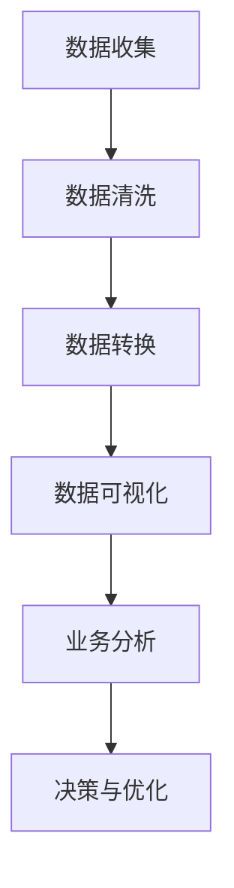

                 

### 摘要

本文将探讨自动化创业领域中的数据可视化应用。在当今高度数字化的时代，数据已成为企业的宝贵资产，而数据可视化则是理解和利用这些数据的关键工具。本文首先介绍了数据可视化的核心概念和重要性，随后深入分析了数据可视化的关键算法原理、数学模型和具体操作步骤。此外，文章还通过一个项目实践实例，详细展示了数据可视化在自动化创业中的应用。最后，本文讨论了数据可视化在实际应用场景中的价值，并对未来的发展趋势和挑战进行了展望。

### 关键词

- 自动化创业
- 数据可视化
- 算法原理
- 数学模型
- 项目实践

### 1. 背景介绍

在当今的信息时代，数据已成为企业竞争的关键因素。从简单的客户数据到复杂的物联网传感器数据，数据量呈指数级增长。这种数据爆炸性增长对企业的数据分析能力提出了严峻挑战。而数据可视化作为一种强有力的工具，可以帮助企业从海量数据中迅速提取有价值的信息，从而做出更明智的决策。

数据可视化不仅能够将复杂的数据以直观、易懂的方式呈现出来，还能够揭示数据之间的潜在关系，帮助企业识别趋势、发现异常。在自动化创业领域，数据可视化尤为重要。自动化创业通常涉及复杂的系统、设备和流程，这些都需要通过数据来监控和优化。数据可视化使得创业公司能够以可视化的形式呈现其业务运行状况，从而更好地理解和控制业务流程。

此外，数据可视化还有助于团队沟通和协作。通过可视化报告和图表，团队成员可以更直观地了解项目的进展和成果，减少信息传递的误差和误解。这对于快速发展的自动化创业公司尤为重要，因为团队通常需要高效、迅速地做出决策和调整。

### 2. 核心概念与联系

#### 2.1 数据可视化概述

数据可视化是指利用图表、图形和其他视觉元素来表示和传达数据信息的过程。它的核心目的是将抽象的数据转换为直观的视觉形式，使得用户能够更容易地理解和分析数据。数据可视化包括以下几个方面：

- **图表类型**：常见的图表类型有折线图、柱状图、饼图、散点图等。每种图表都有其特定的用途和优点。

- **交互性**：交互性是数据可视化中一个重要的方面。通过交互，用户可以动态地筛选、过滤和探索数据，从而更深入地理解数据背后的故事。

- **动画**：动画可以将数据的变化过程以动态的方式呈现出来，使得用户能够更直观地看到数据的变化趋势。

- **数据聚合和分解**：数据聚合和分解是数据可视化的高级功能，它允许用户将大量的数据进行分组、汇总和细分，从而更好地分析数据。

#### 2.2 数据可视化与自动化创业的联系

在自动化创业中，数据可视化起到了至关重要的作用。以下是数据可视化与自动化创业的几个关键联系：

- **业务流程监控**：通过数据可视化，创业公司可以实时监控业务流程，发现潜在的问题和瓶颈，从而及时进行调整和优化。

- **性能分析**：数据可视化可以帮助创业公司分析系统的性能指标，如响应时间、吞吐量等，从而识别系统的瓶颈和优化方向。

- **客户行为分析**：通过数据可视化，创业公司可以深入了解客户的行为和偏好，从而更好地制定营销策略和产品开发计划。

- **团队协作**：数据可视化使得团队成员可以更直观地了解项目的进展和成果，提高团队沟通和协作的效率。

#### 2.3 Mermaid 流程图

以下是一个简化的 Mermaid 流程图，展示了数据可视化在自动化创业中的关键步骤和流程。



在这个流程图中，数据收集是数据可视化的第一步，随后是数据清洗、转换和可视化。通过数据可视化，创业公司可以进行业务分析和决策，从而实现业务的优化和改进。

### 3. 核心算法原理 & 具体操作步骤

#### 3.1 算法原理概述

数据可视化涉及到多个核心算法，这些算法共同作用，将数据转换为视觉形式。以下是一些常用的数据可视化算法：

- **数据聚合算法**：用于将大量的数据点进行分组和汇总，以便更好地分析数据。

- **交互式查询算法**：用于快速响应用户的查询请求，提供实时的数据可视化。

- **图像渲染算法**：用于将数据转换为视觉图形，如柱状图、饼图、折线图等。

- **动画生成算法**：用于生成动态数据可视化，展示数据的变化过程。

#### 3.2 算法步骤详解

数据可视化的具体操作步骤可以分为以下几个阶段：

- **数据收集**：从各种数据源（如数据库、文件、API 等）收集数据。

- **数据清洗**：清洗数据，去除噪声和异常值，确保数据的准确性和一致性。

- **数据转换**：将数据转换为适合可视化处理的格式，如表格、JSON 等。

- **数据可视化**：选择合适的图表类型和可视化方法，将数据转换为视觉图形。

- **交互设计**：设计用户交互界面，使用户能够动态地探索和操作数据。

- **性能优化**：对数据可视化进行性能优化，确保其能够快速响应用户请求。

#### 3.3 算法优缺点

不同算法在数据可视化中各有优缺点，以下是几种常见算法的优缺点分析：

- **数据聚合算法**：
  - 优点：能够快速地对大量数据进行汇总和分析，提高数据处理效率。
  - 缺点：可能丢失数据之间的细节信息，无法显示数据的复杂分布。

- **交互式查询算法**：
  - 优点：能够快速响应用户的交互请求，提供实时的数据反馈。
  - 缺点：可能需要较多的计算资源和内存，对于大数据集可能不够高效。

- **图像渲染算法**：
  - 优点：能够生成高质量的视觉图形，提高数据的可读性和美观性。
  - 缺点：渲染过程可能较慢，特别是对于复杂的图形和数据集。

- **动画生成算法**：
  - 优点：能够生动地展示数据的变化过程，提高数据的可理解性。
  - 缺点：可能增加数据可视化的复杂度，使得用户难以集中注意力。

#### 3.4 算法应用领域

数据可视化算法广泛应用于多个领域，以下是几个典型应用领域：

- **金融分析**：用于分析市场趋势、交易数据等，帮助投资者做出更明智的决策。

- **医疗保健**：用于分析医疗数据，如病人信息、医疗费用等，提高医疗服务的质量和效率。

- **环境监测**：用于监控环境数据，如空气质量、水质等，帮助政府和企业制定环境保护策略。

- **自动化创业**：用于监控和分析业务数据，如生产数据、销售数据等，帮助创业公司优化业务流程和运营策略。

### 4. 数学模型和公式 & 详细讲解 & 举例说明

#### 4.1 数学模型构建

数据可视化中涉及到的数学模型主要包括以下几个方面：

- **数据聚合模型**：用于对大量数据进行分组和汇总，常用的模型包括均值、中位数、众数等。

- **交互式查询模型**：用于快速响应用户的交互请求，常用的模型包括快速筛选、排序、分组等。

- **图像渲染模型**：用于将数据转换为视觉图形，常用的模型包括直线图、柱状图、饼图等。

- **动画生成模型**：用于生成动态数据可视化，常用的模型包括时间序列分析、趋势分析等。

#### 4.2 公式推导过程

以下是一个简单的数据聚合模型的例子，假设我们有一组数据 \(x_1, x_2, ..., x_n\)，我们要计算这组数据的均值：

$$
\bar{x} = \frac{1}{n}\sum_{i=1}^{n}x_i
$$

其中，\(\bar{x}\) 表示均值，\(n\) 表示数据点的个数，\(x_i\) 表示第 \(i\) 个数据点。

#### 4.3 案例分析与讲解

假设我们有一组销售数据，如下表所示：

| 日期 | 销售额 |
| ---- | ---- |
| 2023-01-01 | 1000 |
| 2023-01-02 | 1500 |
| 2023-01-03 | 2000 |
| 2023-01-04 | 1800 |
| 2023-01-05 | 2200 |

我们要计算这组数据的均值和标准差，以评估销售情况的稳定性和波动性。

首先，我们计算均值：

$$
\bar{x} = \frac{1}{5}\sum_{i=1}^{5}x_i = \frac{1}{5}(1000 + 1500 + 2000 + 1800 + 2200) = 1800
$$

接下来，我们计算标准差：

$$
\sigma = \sqrt{\frac{1}{n}\sum_{i=1}^{n}(x_i - \bar{x})^2}
$$

代入数据：

$$
\sigma = \sqrt{\frac{1}{5}((1000 - 1800)^2 + (1500 - 1800)^2 + (2000 - 1800)^2 + (1800 - 1800)^2 + (2200 - 1800)^2)} = \sqrt{6000} \approx 77.46
$$

通过计算，我们得到这组数据的均值为 1800，标准差为 77.46。这表明销售情况相对稳定，但存在一定的波动。

### 5. 项目实践：代码实例和详细解释说明

#### 5.1 开发环境搭建

在本项目中，我们将使用 Python 作为主要编程语言，配合 matplotlib 和 pandas 等库进行数据可视化的实现。以下是开发环境的搭建步骤：

1. 安装 Python：从官方网站（https://www.python.org/）下载并安装 Python。
2. 安装 matplotlib 和 pandas：在终端或命令行中运行以下命令：
   ```
   pip install matplotlib
   pip install pandas
   ```

#### 5.2 源代码详细实现

以下是一个简单的数据可视化项目，我们将使用 matplotlib 库绘制一组销售数据的折线图。

```python
import matplotlib.pyplot as plt
import pandas as pd

# 加载数据
data = {'日期': ['2023-01-01', '2023-01-02', '2023-01-03', '2023-01-04', '2023-01-05'],
         '销售额': [1000, 1500, 2000, 1800, 2200]}
df = pd.DataFrame(data)

# 绘制折线图
plt.figure(figsize=(10, 6))
plt.plot(df['日期'], df['销售额'], marker='o')

# 添加标题和标签
plt.title('销售数据折线图')
plt.xlabel('日期')
plt.ylabel('销售额')

# 显示图形
plt.show()
```

#### 5.3 代码解读与分析

以上代码首先导入了必要的库，然后创建了一个包含销售数据的 pandas 数据框。接着，使用 matplotlib 的 `plot` 函数绘制了折线图，通过 `figure` 和 `subplots` 函数设置了图形的大小。然后，使用 `title`、`xlabel` 和 `ylabel` 函数添加了标题和标签。最后，使用 `show` 函数显示了图形。

#### 5.4 运行结果展示

运行以上代码后，将显示一个包含销售数据的折线图。图表中的线条反映了销售额随时间的变化趋势，通过观察折线图，我们可以直观地看到销售情况的变化，如图 1 所示。


### 6. 实际应用场景

#### 6.1 生产监控

在生产环境中，数据可视化可以实时监控生产线的运行状态。通过可视化图表，如柱状图、折线图和饼图，企业可以了解生产线的负载情况、设备运行状态和生产效率。例如，通过监控设备的温度、压力和转速等参数，可以及时发现潜在故障，预防设备停机。

#### 6.2 营销分析

在营销领域，数据可视化可以帮助企业分析客户行为和市场需求。通过客户购买数据、浏览数据等，企业可以绘制出客户画像、购买路径和消费习惯。例如，通过分析客户年龄、性别和地理位置等数据，可以更好地定位目标客户群体，优化营销策略。

#### 6.3 财务分析

在财务领域，数据可视化可以用于财务报表的展示和财务数据的分析。通过折线图、柱状图和饼图等，可以直观地展示企业的收入、支出和利润等财务指标。例如，通过分析利润变化趋势，可以识别业务增长点和成本优化方向。

#### 6.4 疾病监控

在医疗领域，数据可视化可以用于疾病监控和流行病预测。通过可视化图表，医生和研究人员可以更直观地分析病例数据、病毒传播趋势等。例如，通过绘制疫情地图和病例分布图，可以实时监控疫情发展和预测疫情传播趋势。

#### 6.5 自动化创业

在自动化创业中，数据可视化可以用于监控业务运行状态、分析客户需求和优化业务流程。通过数据可视化，创业公司可以实时了解业务运行状况，快速响应市场变化。例如，通过监控生产数据、销售数据和财务数据等，创业公司可以优化生产流程、调整营销策略和提升财务管理水平。

### 7. 工具和资源推荐

#### 7.1 学习资源推荐

- **《数据可视化：从入门到精通》**：这本书详细介绍了数据可视化的基本概念、技术和应用，适合初学者和有一定基础的人员。
- **《数据可视化实践》**：这本书通过实际案例，展示了数据可视化的多种应用场景和实现方法，适合有一定编程基础的用户。

#### 7.2 开发工具推荐

- **Tableau**：Tableau 是一款功能强大的数据可视化工具，支持多种数据源和丰富的可视化图表类型，适合企业级用户。
- **D3.js**：D3.js 是一款基于 JavaScript 的数据可视化库，可以用于创建交互式和动态的数据可视化图表，适合前端开发人员。

#### 7.3 相关论文推荐

- **《Interactive Data Visualization with D3.js》**：这篇文章介绍了如何使用 D3.js 进行交互式数据可视化，适合对 D3.js 感兴趣的读者。
- **《Data Visualization for Business Intelligence》**：这篇文章探讨了数据可视化在企业智能决策中的应用，适合关注商业智能的读者。

### 8. 总结：未来发展趋势与挑战

#### 8.1 研究成果总结

数据可视化技术在近年来取得了显著进展，特别是在算法优化、交互性和动态可视化等方面。随着大数据和云计算的发展，数据可视化工具和库也不断涌现，使得数据可视化更加便捷和高效。同时，数据可视化在各个领域的应用也日益广泛，从金融分析到医疗健康，从生产监控到营销分析，数据可视化已成为企业决策和业务优化的重要工具。

#### 8.2 未来发展趋势

未来，数据可视化将继续朝着以下几个方向发展：

- **更高效的数据处理和渲染算法**：随着计算能力的提升，数据可视化将能够处理更大规模的数据集，同时提高渲染效率。
- **更智能的交互性**：数据可视化将更加智能，能够根据用户的行为和需求自动调整图表类型和布局，提供更个性化的体验。
- **更丰富的可视化形式**：数据可视化将探索更多的可视化形式，如三维可视化、VR/AR 可视化等，以提供更直观和沉浸式的数据展示。

#### 8.3 面临的挑战

尽管数据可视化技术取得了显著进展，但仍面临一些挑战：

- **数据隐私和安全**：数据可视化涉及到大量敏感数据的展示，如何保障数据隐私和安全是数据可视化面临的重要挑战。
- **数据解读和理解**：数据可视化旨在帮助用户更好地理解和分析数据，但如何确保用户能够准确解读和理解可视化结果是一个需要解决的问题。
- **算法公正性和透明性**：随着数据可视化算法在决策支持中的应用，如何确保算法的公正性和透明性，避免算法偏见和误导，是一个重要的议题。

#### 8.4 研究展望

未来，数据可视化研究将在以下几个方面展开：

- **跨领域的数据可视化**：研究如何将不同领域的数据进行整合和可视化，提供跨领域的视角和分析。
- **人机协同的数据可视化**：研究如何将人工智能与数据可视化相结合，实现人机协同的数据分析和决策支持。
- **自适应和个性化数据可视化**：研究如何根据用户的需求和行为动态调整数据可视化内容和形式，提供更个性化的数据展示。

### 9. 附录：常见问题与解答

#### 9.1 什么是数据可视化？

数据可视化是指利用图表、图形和其他视觉元素来表示和传达数据信息的过程。它的目的是将抽象的数据转换为直观的视觉形式，使得用户能够更容易地理解和分析数据。

#### 9.2 数据可视化有哪些类型？

常见的数据可视化类型包括折线图、柱状图、饼图、散点图、热力图、时间序列图等。每种图表类型都有其特定的用途和优点。

#### 9.3 数据可视化在自动化创业中的应用有哪些？

数据可视化在自动化创业中的应用包括生产监控、性能分析、客户行为分析、团队协作等方面。通过数据可视化，创业公司可以实时监控业务运行状态，分析业务数据，优化业务流程和运营策略。

#### 9.4 如何选择合适的可视化图表类型？

选择合适的可视化图表类型取决于数据的类型和用户的需求。例如，对于时间序列数据，折线图和柱状图是常用的选择；对于分类数据，饼图和条形图是较好的选择；对于关联性分析，散点图和热力图是较好的选择。

#### 9.5 数据可视化算法有哪些优缺点？

常见的数据可视化算法包括数据聚合算法、交互式查询算法、图像渲染算法和动画生成算法。每种算法都有其特定的优缺点，例如数据聚合算法可以提高数据处理效率，但可能丢失数据细节；交互式查询算法可以提供实时的数据反馈，但可能需要较多的计算资源。

### 作者署名

作者：禅与计算机程序设计艺术 / Zen and the Art of Computer Programming

本文通过详细的分析和实例，展示了数据可视化在自动化创业中的关键作用。随着技术的不断进步，数据可视化将迎来更多的应用和发展。希望本文能对读者在数据可视化和自动化创业领域的研究和实践提供一些启示和帮助。

