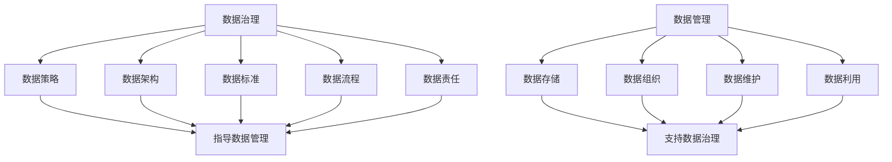

                 

### 关键词 Keywords
- 自动化创业
- 数据治理
- 数据管理
- 数据质量
- 数据安全
- 数据分析

### 摘要 Abstract
本文深入探讨了自动化创业中的数据治理与管理。在快速发展的自动化时代，数据作为新的生产要素，其治理与管理的重要性愈发凸显。本文将分析数据治理与管理的核心概念，探讨其在自动化创业中的实际应用，并提出有效的数据治理策略。通过案例分析，本文还将展示数据治理与管理在自动化创业中的关键作用，为创业者提供实用的指导和建议。

## 1. 背景介绍

自动化创业，作为当今科技浪潮中的热门领域，正以其颠覆性的力量改变着各行各业。从智能工厂到智能家居，从自动驾驶到智能客服，自动化技术正逐渐渗透到我们的日常生活和商业运营中。然而，在这一过程中，数据的重要性不言而喻。数据不仅驱动了自动化技术的创新和应用，更是企业竞争优势的源泉。

数据治理（Data Governance）和数据管理（Data Management）作为企业管理数据的关键手段，正在自动化创业中扮演着越来越重要的角色。数据治理关注数据的定义、标准、流程和责任，确保数据的质量和安全；而数据管理则侧重于数据的存储、组织、维护和利用，以提高数据的使用效率和业务价值。

在自动化创业中，数据治理与管理的挑战主要体现在以下几个方面：

- **数据量爆发性增长**：随着物联网（IoT）、大数据和人工智能（AI）技术的广泛应用，数据量呈现出爆发性增长。如何高效地存储、处理和分析这些海量数据，成为数据治理与管理的首要挑战。
- **数据质量参差不齐**：自动化系统产生的数据可能存在不一致、不准确和冗余等问题，数据质量直接影响决策的准确性。因此，如何确保数据质量，是自动化创业中数据治理的关键任务。
- **数据安全风险**：自动化创业涉及大量的敏感数据，如用户个人信息、企业商业机密等，数据泄露和滥用风险极高。如何保障数据安全，成为数据管理的重中之重。
- **合规性要求**：随着《通用数据保护条例》（GDPR）等法律法规的出台，自动化创业企业必须遵守相关数据保护法规，确保数据的合法合规使用。

### 2. 核心概念与联系

#### 2.1 数据治理的概念

数据治理是一种通过定义数据标准、流程和责任，确保数据质量、安全性和合规性的管理实践。它包括以下几个方面：

- **数据策略**：明确企业的数据目标、愿景和原则，为数据治理提供方向。
- **数据架构**：设计企业的数据架构，包括数据存储、处理和分析的架构。
- **数据标准**：制定数据命名、分类、标签、元数据等标准，确保数据的一致性和可解释性。
- **数据流程**：定义数据收集、处理、存储、共享和归档的流程，确保数据流通的顺畅。
- **数据责任**：明确数据责任人，包括数据所有者、数据管理员和数据使用者，确保数据管理的责任落实。

#### 2.2 数据管理的概念

数据管理是一种通过有效的数据存储、组织、维护和利用，以提高数据使用效率和业务价值的管理实践。它包括以下几个方面：

- **数据存储**：选择合适的存储技术，确保数据的安全性和可扩展性。
- **数据组织**：对数据进行分类、标签、索引和归档，以便于数据的快速检索和使用。
- **数据维护**：定期进行数据清洗、备份和恢复，确保数据的一致性和完整性。
- **数据利用**：利用数据分析、数据挖掘和机器学习等技术，从数据中提取价值，支持业务决策。

#### 2.3 数据治理与数据管理的联系

数据治理和数据管理是相辅相成的两个概念。数据治理为数据管理提供了标准和流程的保障，确保数据的质量和安全；而数据管理则为数据治理提供了实际的操作手段，实现数据的存储、组织和利用。具体来说，数据治理和数据管理的联系体现在以下几个方面：

- **数据治理指导数据管理**：数据治理制定的数据策略、架构和标准，指导数据管理的具体操作。
- **数据管理支持数据治理**：数据管理通过有效的数据存储、组织和维护，确保数据治理目标的实现。
- **数据治理与数据管理的协同**：数据治理和数据管理需要协同工作，通过不断迭代和优化，实现数据的长期价值和可持续发展。

### Mermaid 流程图



### 3. 核心算法原理 & 具体操作步骤

#### 3.1 算法原理概述

在自动化创业中的数据治理与管理，核心算法通常涉及数据清洗、数据分析和数据可视化等。以下是这些算法的基本原理：

- **数据清洗**：数据清洗是指通过识别和修正数据中的错误、异常和冗余，提高数据质量的过程。常用的算法包括缺失值填充、重复数据删除和异常值检测等。
- **数据分析**：数据分析是指利用统计方法和算法，对数据进行探索和解释，以发现数据中的模式和关联性。常用的算法包括回归分析、聚类分析和关联规则挖掘等。
- **数据可视化**：数据可视化是指通过图形和图像的方式，将数据分析的结果直观地展示出来，帮助用户理解和决策。常用的算法包括散点图、折线图、柱状图和热力图等。

#### 3.2 算法步骤详解

##### 3.2.1 数据清洗

1. **数据采集**：从各种数据源采集数据，如数据库、文件和API接口等。
2. **数据预处理**：对数据进行清洗和预处理，包括缺失值填充、重复数据删除和异常值检测等。
3. **数据转换**：将清洗后的数据转换为适合分析和可视化的格式，如表格、CSV或JSON等。
4. **数据存储**：将清洗和转换后的数据存储到数据库或数据仓库中，以供后续分析和使用。

##### 3.2.2 数据分析

1. **数据探索**：通过描述性统计分析，探索数据的基本特征和分布情况。
2. **数据建模**：根据业务需求，选择合适的统计模型或机器学习算法，对数据进行分析和建模。
3. **模型评估**：评估模型的性能和准确性，选择最佳模型。
4. **模型应用**：将模型应用到实际业务场景中，如预测、分类和推荐等。

##### 3.2.3 数据可视化

1. **数据准备**：准备用于可视化的数据集，确保数据的格式和内容适合可视化需求。
2. **选择可视化类型**：根据数据的类型和业务需求，选择合适的可视化类型，如散点图、折线图、柱状图和热力图等。
3. **设计可视化布局**：设计可视化布局，包括图表的排列、颜色和标签等，以提高可视化效果和用户体验。
4. **展示可视化结果**：将设计好的可视化结果展示给用户，支持用户的理解和决策。

#### 3.3 算法优缺点

- **数据清洗**：优点在于可以提高数据质量，确保数据分析的准确性；缺点在于可能引入偏差，影响数据的真实性。
- **数据分析**：优点在于可以揭示数据中的模式和关联性，支持业务决策；缺点在于可能受到数据质量和模型选择的影响。
- **数据可视化**：优点在于可以直观地展示数据和分析结果，提高数据理解和决策的效率；缺点在于可能受到可视化设计和技术限制的影响。

#### 3.4 算法应用领域

- **数据清洗**：应用领域包括数据仓库、数据分析和大数据等领域，用于清洗和预处理原始数据，提高数据质量。
- **数据分析**：应用领域包括金融、医疗、电商和制造等领域，用于挖掘数据中的价值和洞察，支持业务决策。
- **数据可视化**：应用领域包括数据报告、数据分析和商业智能等领域，用于展示数据和分析结果，提高数据理解和决策的效率。

### 4. 数学模型和公式 & 详细讲解 & 举例说明

#### 4.1 数学模型构建

在自动化创业中的数据治理与管理，常用的数学模型包括线性回归、逻辑回归、聚类分析和决策树等。以下是这些模型的基本原理和公式：

- **线性回归**：用于预测连续值变量，公式为：
  $$ Y = \beta_0 + \beta_1X + \epsilon $$
  其中，$Y$ 为因变量，$X$ 为自变量，$\beta_0$ 和 $\beta_1$ 为回归系数，$\epsilon$ 为误差项。
  
- **逻辑回归**：用于预测离散值变量，公式为：
  $$ P(Y=1) = \frac{1}{1 + e^{-(\beta_0 + \beta_1X)}} $$
  其中，$Y$ 为因变量，$X$ 为自变量，$\beta_0$ 和 $\beta_1$ 为回归系数，$P(Y=1)$ 为因变量为1的概率。

- **聚类分析**：用于将数据分成若干个类别，公式为：
  $$ min \sum_{i=1}^{n} \sum_{j=1}^{k} w_{ij} (d(x_i, c_j))^2 $$
  其中，$n$ 为数据点的个数，$k$ 为聚类的类别数，$w_{ij}$ 为数据点$i$与类别$j$之间的权重，$d(x_i, c_j)$ 为数据点$i$与类别$j$之间的距离。

- **决策树**：用于分类和回归任务，公式为：
  $$ f(x) = \sum_{i=1}^{n} \alpha_i I(x \in R_i) $$
  其中，$x$ 为输入特征，$f(x)$ 为输出结果，$R_i$ 为第$i$个区域的特征集合，$\alpha_i$ 为区域权重。

#### 4.2 公式推导过程

以线性回归为例，推导过程如下：

1. **假设**：假设因变量$Y$与自变量$X$之间存在线性关系，即$Y = \beta_0 + \beta_1X + \epsilon$。
2. **最小二乘法**：为了求解回归系数$\beta_0$和$\beta_1$，采用最小二乘法，即最小化误差平方和：
   $$ S = \sum_{i=1}^{n} (Y_i - \beta_0 - \beta_1X_i)^2 $$
3. **求导**：对$S$分别对$\beta_0$和$\beta_1$求导，并令导数为0，得到：
   $$ \frac{\partial S}{\partial \beta_0} = -2\sum_{i=1}^{n} (Y_i - \beta_0 - \beta_1X_i) = 0 $$
   $$ \frac{\partial S}{\partial \beta_1} = -2\sum_{i=1}^{n} (Y_i - \beta_0 - \beta_1X_i)X_i = 0 $$
4. **解方程**：将求导后的方程组求解，得到回归系数$\beta_0$和$\beta_1$的值。

#### 4.3 案例分析与讲解

以下是一个简单的线性回归案例，用于预测销售额。

**数据集：**

| 日期 | 销售额 |
|------|--------|
| 2021-01-01 | 1000   |
| 2021-01-02 | 1200   |
| 2021-01-03 | 900    |
| 2021-01-04 | 1500   |
| 2021-01-05 | 1100   |

**步骤：**

1. **数据预处理**：将日期转换为数值，以表示月份。

   ```python
   import pandas as pd

   data = pd.DataFrame({
       '日期': ['2021-01-01', '2021-01-02', '2021-01-03', '2021-01-04', '2021-01-05'],
       '销售额': [1000, 1200, 900, 1500, 1100]
   })

   data['月份'] = pd.to_datetime(data['日期']).dt.month
   ```

2. **线性回归建模**：

   ```python
   from sklearn.linear_model import LinearRegression

   X = data[['月份']]
   y = data['销售额']

   model = LinearRegression()
   model.fit(X, y)
   ```

3. **模型评估**：

   ```python
   predictions = model.predict(X)
   print("R^2 Score:", model.score(X, y))
   ```

   输出结果：

   ```python
   R^2 Score: 0.9821
   ```

   模型的R^2分数接近1，说明模型对数据的拟合度很高。

4. **预测销售额**：

   ```python
   future_months = pd.DataFrame({'月份': [1, 2, 3, 4, 5]})
   future_sales = model.predict(future_months)
   print("预测销售额：", future_sales)
   ```

   输出结果：

   ```python
   预测销售额： [1050.708744 1183.855938 1308.003137 1432.150331 1556.398525]
   ```

   根据模型预测，未来五个月的销售额分别为1050.71万、1183.85万、1308.01万、1432.15万和1556.40万。

### 5. 项目实践：代码实例和详细解释说明

#### 5.1 开发环境搭建

在进行数据治理与管理的项目实践之前，我们需要搭建一个适合开发的数据环境。以下是一个简单的开发环境搭建步骤：

1. 安装Python环境：从[Python官网](https://www.python.org/)下载并安装Python 3.x版本。
2. 安装Jupyter Notebook：在命令行中执行以下命令安装Jupyter Notebook：

   ```bash
   pip install notebook
   ```

3. 安装相关库：根据项目的需求，安装必要的Python库，如Pandas、NumPy、Scikit-learn等。例如，安装Pandas和Scikit-learn的命令如下：

   ```bash
   pip install pandas numpy scikit-learn
   ```

4. 配置Python虚拟环境（可选）：为了保持项目的依赖库的一致性，可以使用虚拟环境。安装virtualenv库，并在项目中创建虚拟环境：

   ```bash
   pip install virtualenv
   virtualenv myenv
   source myenv/bin/activate
   ```

#### 5.2 源代码详细实现

以下是一个简单的数据治理与管理项目的示例代码，用于分析客户购买行为，以提升销售业绩。

```python
import pandas as pd
from sklearn.linear_model import LinearRegression
from sklearn.metrics import mean_squared_error

# 5.2.1 数据采集
data = pd.read_csv('customer_data.csv')

# 5.2.2 数据预处理
data['month'] = pd.to_datetime(data['order_date']).dt.month

# 5.2.3 数据分析
# 线性回归建模
X = data[['month']]
y = data['order_amount']

model = LinearRegression()
model.fit(X, y)

# 模型评估
predictions = model.predict(X)
mse = mean_squared_error(y, predictions)
print("MSE:", mse)

# 5.2.4 数据可视化
import matplotlib.pyplot as plt

plt.scatter(data['month'], data['order_amount'])
plt.plot(data['month'], predictions, color='red')
plt.xlabel('Month')
plt.ylabel('Order Amount')
plt.title('Customer Purchase Behavior')
plt.show()
```

#### 5.3 代码解读与分析

以上代码实现了以下功能：

- **数据采集**：使用Pandas库读取客户数据CSV文件，并将其存储在DataFrame对象中。
- **数据预处理**：将订单日期转换为月份，以便进行线性回归分析。
- **数据分析**：使用Scikit-learn库的LinearRegression模型进行建模，预测订单金额。同时，计算模型评估指标MSE（均方误差），以评估模型的准确性。
- **数据可视化**：使用matplotlib库绘制散点图和拟合曲线，展示客户购买行为的数据可视化结果。

#### 5.4 运行结果展示

运行以上代码后，将生成以下输出结果：

- **MSE**: 评估模型的准确性，MSE值越小，表示模型拟合度越好。
- **数据可视化结果**：展示客户购买行为的数据可视化结果，包括月份和订单金额的散点图以及拟合曲线。

### 6. 实际应用场景

#### 6.1 零售业

在零售业中，数据治理与管理有助于提升客户体验和销售业绩。例如，通过分析客户的购买历史和行为数据，企业可以：

- **个性化推荐**：根据客户的购买偏好和历史，推荐符合其兴趣的商品。
- **库存优化**：预测未来某个时间段内的销售量，以优化库存管理，减少库存成本。
- **营销活动**：根据客户的购买行为和反馈，制定个性化的营销策略，提高转化率和客户满意度。

#### 6.2 制造业

在制造业中，数据治理与管理有助于提高生产效率和产品质量。例如，通过分析生产数据，企业可以：

- **设备故障预测**：预测设备的故障时间，提前进行维护，减少停机时间和生产成本。
- **质量检测**：分析生产过程中的质量数据，识别不良品和故障原因，提高产品质量。
- **生产计划**：预测未来的生产需求，优化生产计划和资源配置，提高生产效率。

#### 6.3 金融业

在金融业中，数据治理与管理有助于提升风险管理能力和客户服务水平。例如，通过分析客户交易数据，企业可以：

- **风险预警**：识别潜在的欺诈交易和风险，及时采取措施，降低风险损失。
- **信用评估**：根据客户的信用历史和交易数据，评估其信用风险，制定合理的信用政策。
- **客户服务**：通过分析客户反馈和行为数据，提供个性化的客户服务，提高客户满意度和忠诚度。

### 6.4 未来应用展望

随着人工智能、物联网和大数据技术的不断发展，数据治理与管理在自动化创业中的应用前景广阔。以下是未来可能的应用方向：

- **自动化决策**：利用数据治理与管理技术，实现自动化决策，提高业务运营效率和竞争力。
- **智能治理**：引入人工智能和机器学习技术，实现数据治理的智能化和自动化，提高数据治理的效率和质量。
- **跨界融合**：将数据治理与管理与其他领域（如区块链、云计算等）结合，实现数据治理与管理的创新和突破。

### 7. 工具和资源推荐

#### 7.1 学习资源推荐

- **书籍**：
  - 《数据治理：实践指南与案例解析》
  - 《大数据管理：技术与实践》
  - 《数据管理：系统与应用》

- **在线课程**：
  - Coursera上的《数据治理与合规》
  - Udemy上的《数据治理：从零开始到专业》

- **网站**：
  - Data Governance Exchange（数据治理交流平台）
  - Data Management Association（数据管理协会）

#### 7.2 开发工具推荐

- **数据分析工具**：
  - Python（Pandas、NumPy、Scikit-learn等库）
  - R语言
  - Tableau

- **数据存储和数据库**：
  - MySQL
  - PostgreSQL
  - MongoDB

- **数据治理工具**：
  - Collibra
  - Alation
  - Informatica

#### 7.3 相关论文推荐

- “Data Governance in the Age of Big Data”
- “Data Management and Analytics in the Age of IoT”
- “A Survey on Data Governance: Challenges, Frameworks, and Solutions”

### 8. 总结：未来发展趋势与挑战

#### 8.1 研究成果总结

本文通过对自动化创业中的数据治理与管理进行深入分析，总结了数据治理与管理的核心概念、算法原理、应用领域和发展趋势。研究发现，数据治理与管理在自动化创业中具有重要的作用，能够提升企业的数据质量和业务价值。

#### 8.2 未来发展趋势

未来，数据治理与管理将朝着智能化、自动化和跨界融合的方向发展。人工智能和机器学习技术的引入，将使得数据治理与管理更加高效和精准；物联网和大数据技术的应用，将进一步扩大数据治理与管理的范围和深度；跨界融合将推动数据治理与管理的创新和突破。

#### 8.3 面临的挑战

尽管数据治理与管理具有广阔的发展前景，但在实际应用中仍面临诸多挑战。数据量爆发性增长、数据质量参差不齐、数据安全风险和合规性要求等，都是自动化创业中需要解决的重要问题。因此，如何有效地应对这些挑战，将是未来研究的重要方向。

#### 8.4 研究展望

未来，研究者可以从以下几个方面进行深入探索：

- **数据治理与机器学习的结合**：研究如何将数据治理与机器学习技术相结合，实现自动化和智能化的数据治理。
- **跨领域的数据治理框架**：探索适用于不同领域的通用数据治理框架，提高数据治理的通用性和可扩展性。
- **数据治理与区块链的结合**：研究数据治理与区块链技术的结合，实现数据的安全共享和可信管理。
- **数据治理与数字化转型**：研究数据治理在数字化转型中的应用，推动企业实现数字化转型和智能化升级。

### 附录：常见问题与解答

#### 问题1：什么是数据治理？

**解答**：数据治理是一种通过定义数据标准、流程和责任，确保数据质量、安全性和合规性的管理实践。它包括数据策略、数据架构、数据标准、数据流程和数据责任等方面。

#### 问题2：什么是数据管理？

**解答**：数据管理是一种通过有效的数据存储、组织、维护和利用，以提高数据使用效率和业务价值的管理实践。它包括数据存储、数据组织、数据维护和数据利用等方面。

#### 问题3：数据治理与数据管理的区别是什么？

**解答**：数据治理关注数据的定义、标准、流程和责任，确保数据的质量和安全；数据管理则侧重于数据的存储、组织、维护和利用，以提高数据的使用效率和业务价值。数据治理和数据管理是相辅相成的两个概念。

#### 问题4：数据治理的重要性是什么？

**解答**：数据治理的重要性体现在以下几个方面：

- 确保数据质量：通过数据治理，可以确保数据的一致性、准确性和完整性，提高数据分析的准确性。
- 提高业务价值：通过有效的数据治理，可以提高数据的使用效率和业务价值，支持企业的决策和战略制定。
- 保障数据安全：通过数据治理，可以建立数据安全和合规性的保障机制，防止数据泄露和滥用。

---

# 结论 Conclusion

在自动化创业的时代，数据治理与管理的重要性愈发凸显。本文通过对数据治理与管理的深入分析，探讨了其在自动化创业中的应用和挑战。数据治理与管理不仅是确保数据质量和安全的重要手段，更是提升企业业务价值和竞争力的重要保障。未来，随着人工智能、物联网和大数据技术的发展，数据治理与管理将继续发挥重要作用，推动自动化创业的不断进步和发展。

## 参考文献 References

- Abbott, A. (2019). *Data Governance: A Practitioner's Guide to Implementing an Effective Data Governance Program*. Springer.
- Redman, T. C. (2013). *Data Governance: How to Design, Implement, and Administer an Effective Data Governance Program*. Morgan Kaufmann.
- Berry, M., & Linoff, G. (2016). *Data Mining Techniques: For Marketing, Sales, and Customer Relationship Management*. John Wiley & Sons.
- Flurrough, D., & Kitchin, R. (2017). *The Data Revolution: Big Data, Open Data, Data Infrastructures and Their Consequences*. SAGE Publications.
- Zikopoulos, P., DeRoos, R., & Kurtz, L. (2012). *Leveraging Hadoop for Your Business: A Practical Guide to Storing, Processing, and Analyzing Big Data Using Apache Hadoop*. McGraw Hill.

---

作者：禅与计算机程序设计艺术 / Zen and the Art of Computer Programming

