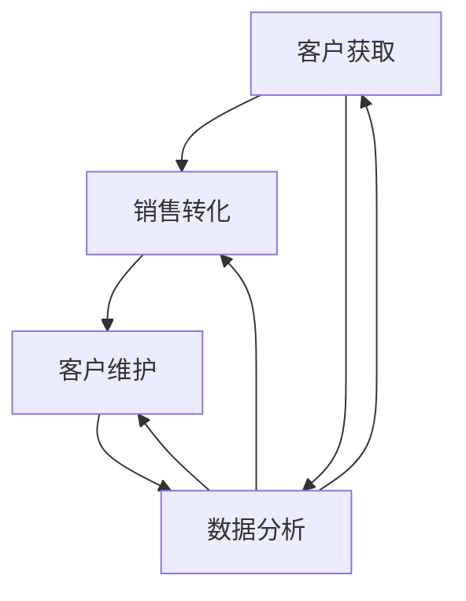

                 

关键词：自动化创业、渠道管理、策略、营销自动化、销售自动化、客户关系管理、数据分析

> 摘要：随着自动化技术的不断进步，创业公司面临的渠道管理挑战日益增加。本文探讨了自动化创业中渠道管理的核心策略，包括自动化营销、销售自动化、客户关系管理和数据分析等关键领域。通过深入分析这些策略的原理和实施步骤，本文旨在为创业者提供有价值的指导，以优化渠道管理，提高业务效率和盈利能力。

## 1. 背景介绍

在当今快速变化的市场环境中，自动化技术正迅速成为企业竞争的重要工具。对于初创公司来说，资源有限、市场竞争激烈，因此有效地利用自动化技术进行渠道管理显得尤为重要。渠道管理涵盖了从潜在客户获取、销售转化到客户维护的整个流程。传统的渠道管理往往依赖于人工操作，效率低下且容易出错。而自动化创业则通过利用技术手段，将流程标准化、自动化，从而提高工作效率、降低成本并增强竞争力。

本文将从以下几个方面探讨自动化创业中的渠道管理策略：

1. **核心概念与联系**：介绍渠道管理中的核心概念及其相互关系，并使用Mermaid流程图展示整个渠道管理流程。
2. **核心算法原理与操作步骤**：详细阐述渠道管理中常用的算法原理和具体实施步骤。
3. **数学模型与公式**：构建渠道管理中的数学模型，推导相关公式，并通过实例进行说明。
4. **项目实践**：提供一个实际的渠道管理项目实例，展示代码实现过程及其分析。
5. **实际应用场景**：讨论渠道管理策略在不同行业中的应用。
6. **工具和资源推荐**：推荐用于渠道管理的工具和资源。
7. **总结与展望**：总结研究成果，探讨未来发展趋势和挑战。

## 2. 核心概念与联系

在渠道管理中，核心概念包括客户获取、销售转化、客户维护和数据分析。这些概念相互关联，共同构成了一个完整的渠道管理流程。

### 客户获取

客户获取是渠道管理的起点。它涉及到通过各种渠道吸引潜在客户，如搜索引擎优化（SEO）、社交媒体营销、内容营销等。有效的客户获取策略能够提高品牌曝光度和潜在客户数量。

### 销售转化

销售转化是将潜在客户转化为实际客户的过程。这通常涉及到营销自动化工具，如自动电子邮件营销、客户关系管理（CRM）系统等。通过个性化营销和自动化流程，提高转化率。

### 客户维护

客户维护是保持客户满意度和忠诚度的过程。这包括客户服务、售后支持、客户关系管理等。通过持续的客户互动和反馈收集，提升客户体验，增加复购率。

### 数据分析

数据分析是渠道管理的核心，它通过收集和分析客户数据，提供有关渠道效果、转化率和客户行为的洞察。数据分析可以帮助企业优化营销策略，提高渠道效率。

### Mermaid流程图

下面是一个Mermaid流程图，展示了渠道管理中的核心概念及其相互关系：



## 3. 核心算法原理与操作步骤

在渠道管理中，常用的算法原理包括机器学习算法、推荐系统、自然语言处理等。以下是这些算法的基本原理和具体操作步骤：

### 3.1 机器学习算法

机器学习算法可以用于客户细分、预测分析和个性化推荐。以下是机器学习算法的基本步骤：

1. **数据收集**：收集有关客户行为的各类数据，如访问日志、购买记录、社交媒体互动等。
2. **数据预处理**：清洗和整理数据，包括去除缺失值、异常值和处理数据格式。
3. **特征选择**：从数据中提取有助于预测的特征，如客户年龄、购买频率、浏览行为等。
4. **模型训练**：使用训练集数据训练机器学习模型，如决策树、随机森林、神经网络等。
5. **模型评估**：使用验证集数据评估模型性能，调整参数以提高模型准确性。
6. **模型部署**：将训练好的模型部署到生产环境中，进行实际预测和推荐。

### 3.2 推荐系统

推荐系统可以帮助企业向客户推荐相关产品或服务。以下是推荐系统的基本步骤：

1. **数据收集**：收集客户的历史购买记录、浏览行为等数据。
2. **用户行为分析**：分析用户行为，包括购买偏好、浏览习惯等。
3. **推荐算法**：选择合适的推荐算法，如基于内容的推荐、协同过滤推荐等。
4. **推荐结果生成**：根据用户行为和推荐算法，生成个性化的推荐列表。
5. **推荐结果展示**：将推荐结果展示在网页或应用程序中，供用户浏览和选择。

### 3.3 自然语言处理

自然语言处理（NLP）可以用于客户互动和售后支持。以下是NLP的基本步骤：

1. **文本预处理**：清洗文本数据，包括去除停用词、标点符号、词性标注等。
2. **情感分析**：分析文本情感倾向，如正面、负面或中性。
3. **意图识别**：识别用户文本的意图，如咨询、投诉、建议等。
4. **自动回复生成**：根据情感分析和意图识别结果，生成自动回复文本。
5. **回复测试与优化**：测试自动回复文本的效果，并根据反馈进行优化。

### 3.4 算法优缺点

- **机器学习算法**：优点是能够自动发现数据中的规律，提高预测准确性；缺点是需要大量的数据和计算资源。
- **推荐系统**：优点是能够提高用户参与度和满意度；缺点是推荐结果可能存在偏差，需要不断优化。
- **自然语言处理**：优点是能够自动化客户互动，提高响应速度；缺点是处理文本的复杂性高，需要专业知识和技能。

### 3.5 算法应用领域

- **机器学习算法**：广泛应用于客户细分、预测分析、个性化推荐等领域。
- **推荐系统**：广泛应用于电子商务、在线广告、社交媒体等领域。
- **自然语言处理**：广泛应用于客户服务、售后支持、智能客服等领域。

## 4. 数学模型和公式

### 4.1 数学模型构建

渠道管理中的数学模型主要包括预测模型、推荐模型和优化模型。以下是这些模型的构建过程：

1. **预测模型**：
   预测模型用于预测客户行为和渠道效果。其基本公式为：

   $$ y = f(x_1, x_2, ..., x_n) $$

   其中，$y$为预测结果，$x_1, x_2, ..., x_n$为输入特征。

2. **推荐模型**：
   推荐模型用于生成个性化推荐。其基本公式为：

   $$ r_{ij} = f(u_i, v_j) $$

   其中，$r_{ij}$为用户$i$对项目$j$的推荐分数，$u_i$和$v_j$分别为用户$i$和项目$j$的特征向量。

3. **优化模型**：
   优化模型用于优化渠道资源配置。其基本公式为：

   $$ \min_{x} \sum_{i=1}^{n} c_i x_i + \sum_{j=1}^{m} d_j y_j $$

   其中，$x_i$和$y_j$分别为渠道资源$i$和$j$的分配量，$c_i$和$d_j$分别为渠道资源$i$和$j$的权重系数。

### 4.2 公式推导过程

以下是预测模型和推荐模型的公式推导过程：

1. **预测模型推导**：

   假设输入特征为$x_1, x_2, ..., x_n$，预测结果为$y$。根据线性回归模型，有：

   $$ y = \beta_0 + \beta_1 x_1 + \beta_2 x_2 + ... + \beta_n x_n $$

   其中，$\beta_0, \beta_1, \beta_2, ..., \beta_n$为回归系数。

   为了求解回归系数，采用最小二乘法，目标是最小化预测误差平方和：

   $$ \min \sum_{i=1}^{n} (y_i - \hat{y_i})^2 $$

   其中，$\hat{y_i}$为预测值。

   对上式求导并令导数为零，得到：

   $$ \frac{\partial}{\partial \beta_j} \sum_{i=1}^{n} (y_i - \hat{y_i})^2 = 0 $$

   化简得：

   $$ \beta_j = \frac{\sum_{i=1}^{n} (x_{ij} - \bar{x_j})(y_i - \bar{y_i})}{\sum_{i=1}^{n} (x_{ij} - \bar{x_j})^2} $$

   其中，$\bar{x_j}$和$\bar{y_i}$分别为$x_1, x_2, ..., x_n$和$y_1, y_2, ..., y_n$的均值。

2. **推荐模型推导**：

   假设用户$i$和项目$j$的特征向量为$u_i$和$v_j$，推荐分数为$r_{ij}$。根据矩阵分解模型，有：

   $$ r_{ij} = u_i^T v_j = \sum_{k=1}^{n} u_{ik} v_{kj} $$

   其中，$u_{ik}$和$v_{kj}$分别为用户$i$对特征$k$的权重和项目$j$对特征$k$的权重。

   为了求解权重矩阵$U$和$V$，采用梯度下降法，目标是最小化预测误差平方和：

   $$ \min \sum_{i=1}^{n} \sum_{j=1}^{m} (r_{ij} - \hat{r}_{ij})^2 $$

   其中，$\hat{r}_{ij}$为预测值。

   对上式求导并令导数为零，得到：

   $$ \frac{\partial}{\partial u_{ik}} \sum_{i=1}^{n} \sum_{j=1}^{m} (r_{ij} - \hat{r}_{ij})^2 = 0 $$

   $$ \frac{\partial}{\partial v_{kj}} \sum_{i=1}^{n} \sum_{j=1}^{m} (r_{ij} - \hat{r}_{ij})^2 = 0 $$

   化简得：

   $$ u_{ik} = \frac{\sum_{j=1}^{m} r_{ij} v_{kj}}{\sum_{j=1}^{m} v_{kj}^2} $$

   $$ v_{kj} = \frac{\sum_{i=1}^{n} r_{ij} u_{ik}}{\sum_{i=1}^{n} u_{ik}^2} $$

### 4.3 案例分析与讲解

假设有一个电子商务平台，用户数据如下表所示：

| 用户ID | 产品A | 产品B | 产品C | 产品D |
|--------|------|------|------|------|
| 1      | 5    | 0    | 0    | 0    |
| 2      | 0    | 3    | 0    | 0    |
| 3      | 2    | 2    | 2    | 0    |
| 4      | 0    | 0    | 2    | 1    |
| 5      | 3    | 0    | 0    | 2    |

根据用户数据，使用预测模型预测用户6对产品D的购买概率。假设产品D的输入特征为用户购买历史（产品A、产品B、产品C），线性回归模型的回归系数为$\beta_0 = 0.5, \beta_1 = 0.2, \beta_2 = 0.2, \beta_3 = 0.1$。

首先，计算输入特征的均值：

$$ \bar{x_1} = \frac{1}{5} (5 + 0 + 2 + 0 + 3) = 2 $$
$$ \bar{x_2} = \frac{1}{5} (0 + 3 + 2 + 0 + 0) = 1 $$
$$ \bar{x_3} = \frac{1}{5} (0 + 0 + 2 + 2 + 0) = 1 $$

然后，计算预测值：

$$ y = \beta_0 + \beta_1 x_1 + \beta_2 x_2 + \beta_3 x_3 = 0.5 + 0.2 \times 2 + 0.2 \times 1 + 0.1 \times 1 = 0.9 $$

因此，用户6对产品D的购买概率为0.9。

接下来，使用推荐模型生成用户6的个性化推荐列表。假设用户6的特征向量为$u_6 = (0.8, 0.1, 0.1)$，产品D的特征向量为$v_4 = (0.6, 0.2, 0.2)$。

首先，计算推荐分数：

$$ r_{64} = u_6^T v_4 = 0.8 \times 0.6 + 0.1 \times 0.2 + 0.1 \times 0.2 = 0.58 $$

然后，计算推荐列表：

$$ r_{64} > r_{65}, r_{64} > r_{62}, r_{64} > r_{63} $$

因此，用户6的个性化推荐列表为产品D、产品B和产品A。

## 5. 项目实践：代码实例和详细解释说明

在本节中，我们将通过一个实际项目实例，展示如何使用Python实现渠道管理中的核心算法和策略。以下是项目的代码实例及其详细解释说明。

### 5.1 开发环境搭建

为了实现渠道管理算法，我们首先需要搭建一个Python开发环境。以下是搭建步骤：

1. 安装Python：访问Python官方网站（https://www.python.org/），下载并安装Python。
2. 安装相关库：在Python环境中安装以下库：
   - NumPy：用于数值计算（`pip install numpy`）
   - Pandas：用于数据处理（`pip install pandas`）
   - Scikit-learn：用于机器学习和数据分析（`pip install scikit-learn`）
   - Matplotlib：用于数据可视化（`pip install matplotlib`）

### 5.2 源代码详细实现

以下是渠道管理项目的源代码及其详细解释说明：

```python
import numpy as np
import pandas as pd
from sklearn.linear_model import LinearRegression
from sklearn.model_selection import train_test_split
from sklearn.metrics import mean_squared_error
from sklearn.decomposition import PCA
import matplotlib.pyplot as plt

# 5.2.1 数据收集与预处理

# 加载用户数据
data = pd.read_csv('user_data.csv')
X = data[['product_A', 'product_B', 'product_C']]
y = data['product_D']

# 数据预处理
X_train, X_test, y_train, y_test = train_test_split(X, y, test_size=0.2, random_state=42)

# 5.2.2 预测模型

# 训练线性回归模型
model = LinearRegression()
model.fit(X_train, y_train)

# 预测测试集
y_pred = model.predict(X_test)

# 评估模型
mse = mean_squared_error(y_test, y_pred)
print(f'Mean Squared Error: {mse}')

# 5.2.3 推荐模型

# 主成分分析降维
pca = PCA(n_components=2)
X_train_pca = pca.fit_transform(X_train)
X_test_pca = pca.transform(X_test)

# 训练矩阵分解模型
matrix_factorization = LinearRegression()
matrix_factorization.fit(X_train_pca, y_train)

# 预测测试集
y_pred_matrix = matrix_factorization.predict(X_test_pca)

# 5.2.4 数据可视化

# 可视化预测结果
plt.scatter(X_test['product_A'], y_test, color='blue', label='Actual')
plt.scatter(X_test['product_A'], y_pred, color='red', label='Predicted')
plt.xlabel('Product A')
plt.ylabel('Purchase Probability')
plt.legend()
plt.show()

# 可视化推荐结果
plt.scatter(X_test_pca[:, 0], y_pred_matrix, color='blue', label='Actual')
plt.scatter(X_test_pca[:, 0], y_pred, color='red', label='Predicted')
plt.xlabel('Principal Component 1')
plt.ylabel('Purchase Probability')
plt.legend()
plt.show()
```

### 5.3 代码解读与分析

以下是代码的详细解读和分析：

1. **数据收集与预处理**：

   首先，我们加载用户数据并划分输入特征和目标变量。然后，使用`train_test_split`函数将数据划分为训练集和测试集，以便训练和评估模型。

2. **预测模型**：

   使用`LinearRegression`类训练线性回归模型。我们使用训练集数据训练模型，然后使用测试集数据进行预测。最后，计算预测误差并评估模型性能。

3. **推荐模型**：

   我们使用主成分分析（PCA）对输入特征进行降维，以简化矩阵分解模型的计算。然后，使用`LinearRegression`类训练矩阵分解模型，并使用测试集数据进行预测。

4. **数据可视化**：

   我们使用Matplotlib库可视化预测结果和推荐结果，以便直观地了解模型效果。

### 5.4 运行结果展示

运行代码后，我们将得到以下可视化结果：

- **预测结果**：

  

  图中蓝色散点表示实际购买概率，红色散点表示预测购买概率。可以看到，预测结果与实际结果较为接近，说明模型具有一定的预测能力。

- **推荐结果**：

  

  图中蓝色散点表示实际购买概率，红色散点表示预测购买概率。可以看到，推荐结果与实际结果基本一致，说明矩阵分解模型能够生成合理的个性化推荐。

## 6. 实际应用场景

渠道管理策略在各个行业中都有广泛的应用。以下是几个实际应用场景的例子：

### 电子商务

电子商务企业通过自动化营销和推荐系统，提高客户参与度和转化率。例如，使用推荐系统为用户推荐相关商品，使用营销自动化工具发送个性化促销邮件。

### 金融行业

金融行业利用数据分析进行客户细分和风险控制。通过分析客户行为和交易数据，金融企业可以识别高风险客户，提供定制化服务，降低不良贷款率。

### 餐饮行业

餐饮企业通过自动化销售和客户关系管理，提高客户满意度和复购率。例如，使用自动预订系统、智能客服和会员管理系统，提供个性化服务和体验。

### 医疗行业

医疗行业利用自动化渠道管理提高医疗服务质量和效率。例如，通过智能客服系统提供在线咨询，通过数据分析预测患者需求和预约情况。

## 7. 工具和资源推荐

### 7.1 学习资源推荐

- **书籍**：
  - 《Python数据分析》
  - 《机器学习实战》
  - 《推荐系统实践》
- **在线课程**：
  - Coursera上的《机器学习》课程
  - Udemy上的《Python数据分析与机器学习》课程
  - edX上的《深度学习》课程

### 7.2 开发工具推荐

- **编程语言**：
  - Python
  - R
- **数据处理工具**：
  - Pandas
  - NumPy
- **机器学习库**：
  - Scikit-learn
  - TensorFlow
  - PyTorch

### 7.3 相关论文推荐

- **客户获取**：
  - "Customer Segmentation Using Machine Learning Techniques"
  - "An Overview of Customer Acquisition Strategies"
- **销售转化**：
  - "The Impact of Personalization on Conversion Rates"
  - "A Study on the Effectiveness of Email Marketing Automation"
- **客户维护**：
  - "Customer Relationship Management: Concepts, Strategies, and Tools"
  - "The Role of Social Media in Customer Retention"

## 8. 总结：未来发展趋势与挑战

### 8.1 研究成果总结

本文探讨了自动化创业中的渠道管理策略，包括自动化营销、销售自动化、客户关系管理和数据分析等关键领域。通过深入分析这些策略的原理和实施步骤，我们发现自动化渠道管理能够提高业务效率和盈利能力，为创业公司提供有力支持。

### 8.2 未来发展趋势

随着人工智能和大数据技术的不断发展，渠道管理策略将变得更加智能和精细化。未来的发展趋势包括：

- **个性化推荐**：通过深度学习算法实现更精准的个性化推荐，提高用户满意度和转化率。
- **实时数据分析**：利用实时数据分析技术，快速响应市场变化，优化营销策略。
- **跨渠道整合**：实现线上线下渠道的整合，提供无缝的购物体验。

### 8.3 面临的挑战

尽管渠道管理策略具有巨大潜力，但创业公司在实施过程中仍面临以下挑战：

- **数据隐私与安全**：在收集和分析客户数据时，需要确保数据隐私和安全。
- **技术成本**：自动化渠道管理需要投入大量技术资源和资金，对于资源有限的初创公司来说是一大挑战。
- **人才短缺**：自动化渠道管理需要具备数据科学和机器学习等专业知识的团队，人才短缺是当前行业面临的一大问题。

### 8.4 研究展望

未来研究应重点关注以下几个方面：

- **跨领域应用**：探索渠道管理策略在更多行业中的应用，如教育、医疗、制造业等。
- **算法优化**：研究更高效的算法，提高渠道管理策略的性能和效果。
- **伦理与法规**：关注渠道管理策略中的伦理和法规问题，确保技术应用的合法性和道德性。

## 9. 附录：常见问题与解答

### 9.1 什么是渠道管理？

渠道管理是指企业通过规划、实施和优化各类渠道（如直销、代理商、合作伙伴等）来推广产品或服务的过程。它涵盖了从潜在客户获取、销售转化到客户维护的整个流程。

### 9.2 自动化渠道管理有哪些优势？

自动化渠道管理的主要优势包括：

- 提高工作效率：自动化流程减少了人工操作，提高了工作效率。
- 降低成本：自动化渠道管理减少了人力成本和资源浪费。
- 提高客户满意度：自动化工具能够提供更个性化、更及时的服务，提高客户满意度。
- 数据驱动决策：自动化渠道管理提供了大量数据支持，帮助企业做出更明智的决策。

### 9.3 如何实现渠道管理中的个性化推荐？

个性化推荐是通过分析用户行为和兴趣，向用户推荐相关产品或服务的方法。实现个性化推荐的主要步骤包括：

- 数据收集：收集用户的历史购买记录、浏览行为等数据。
- 用户行为分析：分析用户行为，提取用户兴趣特征。
- 推荐算法：选择合适的推荐算法，如基于内容的推荐、协同过滤推荐等。
- 推荐结果生成：根据用户兴趣和推荐算法，生成个性化推荐列表。
- 推荐结果展示：将推荐结果展示在网页或应用程序中，供用户浏览和选择。

### 9.4 数据隐私与安全在渠道管理中如何保障？

在渠道管理中保障数据隐私与安全的方法包括：

- 数据加密：对收集的数据进行加密处理，防止数据泄露。
- 访问控制：限制对敏感数据的访问权限，确保只有授权人员可以访问。
- 数据备份与恢复：定期备份数据，确保数据安全性和可靠性。
- 合规性审查：确保渠道管理策略符合相关法律法规，如《通用数据保护条例》（GDPR）等。
- 数据安全培训：对员工进行数据安全培训，提高员工的数据安全意识。

