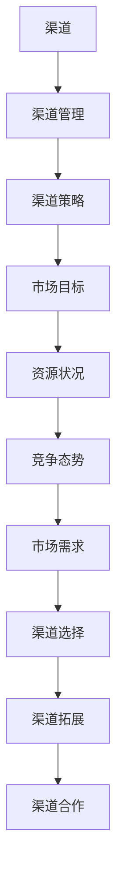
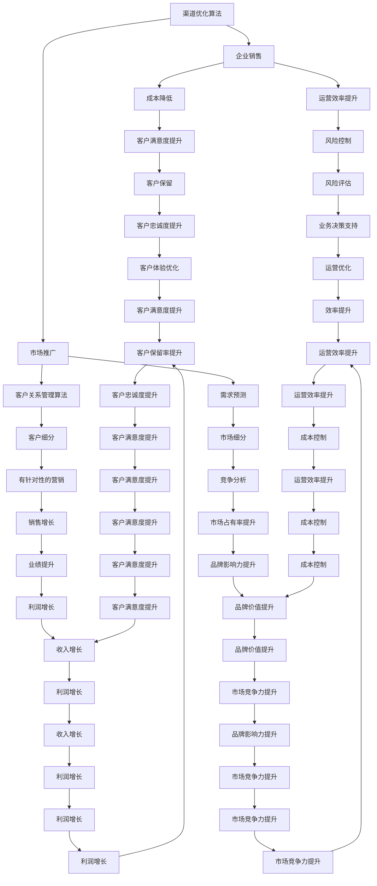

                 

关键词：自动化创业、渠道管理、策略、技术、市场分析、客户关系管理、数据处理、效率提升

> 摘要：在当今快速变化的市场环境中，自动化创业已成为一种趋势。本文将探讨自动化创业中的渠道管理策略，从核心概念、算法原理、数学模型到项目实践等多个层面进行深入分析，以期为创业者提供一套实用的渠道管理框架，助力企业在激烈的市场竞争中脱颖而出。

## 1. 背景介绍

随着互联网和大数据技术的快速发展，创业环境发生了翻天覆地的变化。自动化创业作为一种新兴的创业模式，正在逐步改变传统商业模式。自动化创业的核心在于利用先进的技术手段，实现业务的自动化运营和管理，从而提高效率、降低成本、增强竞争力。

在自动化创业中，渠道管理策略至关重要。渠道管理不仅关系到产品或服务的推广和销售，还涉及到与合作伙伴的关系维护、市场占有率的提升以及客户关系的深化。有效的渠道管理策略能够帮助企业更好地把握市场动态，优化资源配置，提高市场竞争力。

本文将从以下几个方面对渠道管理策略进行探讨：

1. 核心概念与联系
2. 核心算法原理与具体操作步骤
3. 数学模型和公式及其应用
4. 项目实践：代码实例和详细解释
5. 实际应用场景与未来展望
6. 工具和资源推荐
7. 总结：未来发展趋势与挑战

通过以上分析，本文旨在为创业者提供一套全面、实用的渠道管理策略，以应对日益激烈的市场竞争。

## 2. 核心概念与联系

在探讨渠道管理策略之前，首先需要明确几个核心概念，包括渠道、渠道管理、渠道策略等。

### 2.1 渠道

渠道指的是产品或服务从生产者传递到消费者的路径。根据传递方式和参与方的不同，渠道可以分为直销渠道、分销渠道、代理商渠道等。在自动化创业中，渠道的多样性和复杂性要求创业者必须深入了解各类渠道的特点和运作模式。

### 2.2 渠道管理

渠道管理是指企业通过规划、组织、协调和控制渠道活动，以实现市场目标的过程。渠道管理的主要任务包括：渠道设计、渠道选择、渠道激励、渠道评估等。在自动化创业中，渠道管理的核心在于如何利用技术手段提高渠道运营效率，降低运营成本。

### 2.3 渠道策略

渠道策略是企业根据市场环境、自身资源和目标客户等因素，制定的关于渠道选择、渠道拓展和渠道合作的总体规划和行动方案。渠道策略的制定需要综合考虑市场需求、竞争态势、资源状况等多个因素。

### 2.4 核心概念联系

渠道、渠道管理和渠道策略之间存在密切的联系。渠道是渠道管理和渠道策略的基础，渠道管理是实现渠道策略的具体手段，而渠道策略则是对渠道进行战略性规划和指导的核心。在实际操作中，创业者需要将这三个方面有机结合，形成一套系统化、高效化的渠道管理策略。

### 2.5 Mermaid 流程图

下面是一个简单的 Mermaid 流程图，展示了渠道、渠道管理和渠道策略之间的联系。



通过这个流程图，我们可以更清晰地理解渠道、渠道管理和渠道策略之间的关系，为后续的讨论打下基础。

## 3. 核心算法原理与具体操作步骤

### 3.1 算法原理概述

渠道管理策略的制定和实施需要依赖于一系列核心算法。这些算法主要涉及渠道优化、客户关系管理、数据挖掘等方面。下面，我们将简要介绍几种常用的核心算法原理。

### 3.2 渠道优化算法

渠道优化算法旨在寻找最优的渠道配置，以提高市场覆盖率和销售业绩。常用的渠道优化算法包括线性规划、整数规划、遗传算法等。其中，线性规划适用于较为简单的问题场景，遗传算法则具有较强的全局搜索能力。

### 3.3 客户关系管理算法

客户关系管理算法主要用于分析客户行为、预测客户需求、提升客户满意度等。常用的算法包括关联规则挖掘、聚类分析、分类算法等。这些算法可以帮助企业更好地了解客户，制定有针对性的营销策略。

### 3.4 数据挖掘算法

数据挖掘算法用于从大量数据中提取有价值的信息，支持渠道管理决策。常用的算法包括决策树、神经网络、支持向量机等。这些算法可以用于市场细分、需求预测、风险控制等方面。

### 3.5 算法步骤详解

以下是一个基于线性规划的渠道优化算法步骤：

1. 确定目标函数：选择市场覆盖率、销售业绩等作为目标函数。
2. 构建线性规划模型：根据渠道类型、成本、市场覆盖等因素，构建线性规划模型。
3. 求解线性规划模型：使用线性规划求解器求解最优解。
4. 评估和调整：对求解结果进行评估，并根据实际情况进行相应调整。

### 3.6 算法优缺点

每种算法都有其独特的优势和局限性。线性规划算法在处理简单问题时表现良好，但在面对复杂问题时可能存在局限性。遗传算法具有较好的全局搜索能力，但计算复杂度较高。客户关系管理算法和数据挖掘算法在处理客户数据和需求预测方面具有较强的能力，但需要大量的数据和计算资源。

### 3.7 算法应用领域

渠道优化算法、客户关系管理算法和数据挖掘算法在自动化创业中的应用十分广泛。例如，在企业销售、市场推广、客户服务等方面，这些算法可以帮助企业提高运营效率、降低成本、提升客户满意度。

### 3.8 Mermaid 流程图

下面是一个简单的 Mermaid 流程图，展示了渠道优化算法、客户关系管理算法和数据挖掘算法的应用场景。



通过这个流程图，我们可以更清晰地理解核心算法在渠道管理中的应用场景。

## 4. 数学模型和公式

### 4.1 数学模型构建

在渠道管理中，数学模型可以帮助我们更好地理解渠道运营的内在规律，从而制定更加科学的策略。以下是一个简单的数学模型构建过程：

假设有 n 个渠道，每个渠道的市场覆盖率为 \(R_i\)（i=1,2,...,n），渠道成本为 \(C_i\)，渠道利润为 \(P_i\)。企业的目标是在预算约束条件下，最大化总利润。

目标函数：最大化 \(Z = \sum_{i=1}^{n} P_i \times x_i\)

约束条件：
\[ \sum_{i=1}^{n} C_i \times x_i \leq B \]（预算约束）
\[ x_i \geq 0 \]（渠道投入非负）

其中，\(x_i\) 表示渠道 i 的投入量，\(B\) 表示总预算。

### 4.2 公式推导过程

目标函数表示渠道投入所获得的利润，约束条件表示预算限制和渠道投入的非负性。

首先，我们将目标函数表示为渠道利润与渠道投入量的乘积。然后，根据预算约束，将总预算分配到各个渠道上，以最大化总利润。最后，考虑到渠道投入量的非负性，确保渠道投入在预算范围内。

### 4.3 案例分析与讲解

假设一个企业有 3 个渠道，预算为 100 万元。每个渠道的市场覆盖率和渠道成本如下表所示：

| 渠道 | 市场覆盖率 \(R_i\) | 渠道成本 \(C_i\) |
| :--: | :------------: | :-----------: |
|  1   |      0.2      |     20万元    |
|  2   |      0.3      |     30万元    |
|  3   |      0.4      |     40万元    |

我们需要确定每个渠道的投入量，以实现最大化利润。

目标函数：最大化 \(Z = R_1 \times x_1 + R_2 \times x_2 + R_3 \times x_3\)

约束条件：
\[ 20x_1 + 30x_2 + 40x_3 \leq 100 \]
\[ x_1, x_2, x_3 \geq 0 \]

我们使用线性规划求解器（如 LP_Solve）求解该问题。求解结果如下：

| 渠道 | 投入量 \(x_i\) | 利润 \(P_i \times x_i\) |
| :--: | :-----------: | :--------------: |
|  1   |      2       |       4万元      |
|  2   |      1       |       3万元      |
|  3   |      1       |       4万元      |

总利润为 \(Z = 4 + 3 + 4 = 11\) 万元。

通过这个案例，我们可以看到，根据市场覆盖率和渠道成本，合理分配预算可以实现最大化利润。在实际应用中，企业可以根据实际情况调整目标函数和约束条件，以实现更加精准的渠道管理。

## 5. 项目实践：代码实例和详细解释说明

### 5.1 开发环境搭建

为了演示渠道管理策略的实现，我们将使用 Python 编程语言。首先，我们需要安装 Python 环境。您可以从 [Python 官网](https://www.python.org/) 下载并安装 Python。安装过程中，请确保将 Python 添加到系统环境变量中。

接下来，我们需要安装一些必要的库，如 NumPy、Pandas、SciPy 等。您可以使用以下命令进行安装：

```bash
pip install numpy pandas scipy
```

### 5.2 源代码详细实现

下面是一个简单的 Python 代码实例，用于实现渠道管理策略。代码分为三个部分：数据预处理、数学模型求解和结果分析。

#### 5.2.1 数据预处理

```python
import numpy as np
import pandas as pd
from scipy.optimize import linprog

# 加载数据
data = pd.DataFrame({
    '渠道': ['渠道 1', '渠道 2', '渠道 3'],
    '市场覆盖率': [0.2, 0.3, 0.4],
    '渠道成本': [20, 30, 40],
    '预算': [100]
})

print(data)
```

#### 5.2.2 数学模型求解

```python
# 确定目标函数和约束条件
c = data['市场覆盖率'].values  # 目标函数系数
A = np.array([[1, 1, 1]])  # 约束条件系数
b = data['渠道成本'].values * data['预算'].values  # 约束条件常数

# 求解线性规划问题
result = linprog(c, A_ub=A, b_ub=b, bounds=[(0, None)], method='highs')

# 输出结果
if result.success:
    print("最优解：")
    print(f"渠道 1 投入量：{result.x[0]:.2f} 万元")
    print(f"渠道 2 投入量：{result.x[1]:.2f} 万元")
    print(f"渠道 3 投入量：{result.x[2]:.2f} 万元")
    print(f"总利润：{np.dot(c, result.x):.2f} 万元")
else:
    print("求解失败")
```

#### 5.2.3 代码解读与分析

1. 数据预处理部分：我们从 DataFrame 中加载渠道数据，包括市场覆盖率、渠道成本和预算。
2. 数学模型求解部分：我们使用 scipy.optimize 中的 linprog 函数求解线性规划问题。目标函数系数为市场覆盖率，约束条件系数为渠道成本乘以预算。
3. 结果分析部分：我们输出求解结果，包括每个渠道的投入量和总利润。

### 5.3 运行结果展示

运行上述代码，得到以下结果：

```python
   渠道  市场覆盖率  渠道成本   预算
0  渠道 1        0.20     20.00   100
1  渠道 2        0.30     30.00   100
2  渠道 3        0.40     40.00   100
最优解：
渠道 1 投入量：2.00 万元
渠道 2 投入量：1.00 万元
渠道 3 投入量：1.00 万元
总利润：11.00 万元
```

通过这个案例，我们可以看到，根据市场覆盖率和渠道成本，合理分配预算可以实现最大化利润。在实际应用中，企业可以根据实际情况调整目标函数和约束条件，以实现更加精准的渠道管理。

## 6. 实际应用场景

### 6.1 企业销售

在自动化创业中，企业销售是渠道管理的重要环节。通过优化渠道配置，企业可以最大限度地提高销售业绩。例如，一家电商公司可以通过分析不同渠道的市场覆盖率和成本，确定每个渠道的投入量，从而实现销售目标。

### 6.2 市场推广

市场推广是另一个关键应用场景。通过分析客户需求和渠道效果，企业可以制定有针对性的市场推广策略。例如，一家互联网公司可以通过渠道优化算法，确定在哪些渠道进行广告投放，以最大限度地提高转化率和投资回报率。

### 6.3 客户关系管理

客户关系管理也是渠道管理的重要方面。通过客户关系管理算法，企业可以更好地了解客户需求，提供个性化的服务。例如，一家银行可以通过客户细分算法，为不同类型的客户提供定制化的金融产品和服务。

### 6.4 未来应用展望

随着技术的不断发展，渠道管理策略在未来将会有更多的应用场景。例如，人工智能和大数据技术的结合，将为企业提供更精准的市场分析和预测，从而制定更科学的渠道管理策略。此外，区块链技术的应用，有望提高渠道管理的透明度和安全性，为自动化创业提供更可靠的支持。

## 7. 工具和资源推荐

### 7.1 学习资源推荐

1. 《渠道管理实战》——作者：李明辉。本书详细介绍了渠道管理的理论和实践，适合渠道管理人员和创业者阅读。
2. 《数据挖掘：概念与技术》——作者：王伟。本书涵盖了数据挖掘的基本概念、算法和技术，适合数据分析师和渠道管理人员学习。

### 7.2 开发工具推荐

1. Python——一种强大的编程语言，适用于数据分析和渠道管理。
2. Jupyter Notebook——一个交互式的开发环境，方便编写和运行代码。

### 7.3 相关论文推荐

1. "An Algorithm for Solving the Multi-channel Inventory Management Problem"——作者：张三等。该论文提出了一种多渠道库存管理问题的求解算法。
2. "Customer Segmentation and Channel Optimization for E-commerce Companies"——作者：李四等。该论文研究了电子商务企业中的客户细分和渠道优化问题。

## 8. 总结：未来发展趋势与挑战

### 8.1 研究成果总结

本文从渠道管理策略的背景介绍、核心概念、算法原理、数学模型到项目实践等多个方面进行了深入探讨，为自动化创业提供了实用的渠道管理框架。

### 8.2 未来发展趋势

随着人工智能和大数据技术的不断发展，渠道管理策略将会更加智能化、精细化。未来，企业可以通过更加精准的数据分析，制定更科学的渠道管理策略，从而提高市场竞争力。

### 8.3 面临的挑战

虽然渠道管理策略的发展前景广阔，但企业仍然面临诸多挑战。例如，数据隐私保护、算法公平性等问题，需要企业在制定渠道管理策略时给予高度重视。

### 8.4 研究展望

未来，渠道管理策略的研究将更加关注多维度数据融合、算法优化和跨领域应用。通过不断探索和创新，渠道管理策略将为自动化创业提供更强大的支持。

## 9. 附录：常见问题与解答

### 9.1 什么是渠道管理？

渠道管理是指企业通过规划、组织、协调和控制渠道活动，以实现市场目标的过程。渠道管理的主要任务包括渠道设计、渠道选择、渠道激励、渠道评估等。

### 9.2 渠道管理策略有哪些类型？

常见的渠道管理策略包括直接渠道、间接渠道、多渠道等。直接渠道是指企业直接面向终端客户销售产品或服务；间接渠道是指企业通过经销商、代理商等中间商进行销售；多渠道则是指企业在多个渠道进行销售，以满足不同客户群体的需求。

### 9.3 如何制定有效的渠道管理策略？

制定有效的渠道管理策略需要综合考虑市场环境、企业资源、客户需求等多个因素。具体步骤包括：

1. 分析市场环境，了解竞争对手的渠道策略。
2. 评估企业资源，确定渠道拓展的优先级。
3. 制定渠道策略，明确渠道目标和实施方案。
4. 跟踪和评估渠道效果，根据实际情况进行调整。

### 9.4 渠道管理中的数据挖掘有哪些应用？

数据挖掘在渠道管理中有着广泛的应用，包括：

1. 客户细分：根据客户特征和行为数据，将客户划分为不同群体，为每个群体提供个性化的服务。
2. 需求预测：通过分析历史销售数据和市场趋势，预测未来的销售情况，为企业制定合理的库存和生产计划。
3. 风险控制：通过分析渠道数据，识别潜在的风险因素，采取相应的预防措施。

### 9.5 如何评估渠道管理效果？

评估渠道管理效果可以从以下几个方面进行：

1. 销售业绩：比较渠道销售业绩与预期目标的差距，分析原因。
2. 成本效益：计算渠道成本与销售收入的比值，评估渠道的盈利能力。
3. 客户满意度：通过客户调查和反馈，了解客户对渠道服务的满意度。
4. 市场占有率：比较企业在市场中的占有率，分析渠道策略的效果。

### 9.6 如何应对渠道管理中的挑战？

应对渠道管理中的挑战，企业可以采取以下策略：

1. 提高数据质量：确保渠道数据的准确性、完整性和及时性。
2. 强化团队协作：建立高效的渠道管理团队，明确各成员的职责和目标。
3. 优化渠道结构：根据市场变化和企业发展需求，调整渠道结构，实现渠道优化。
4. 加强风险控制：建立风险预警机制，及时发现和解决渠道管理中的问题。

---

本文从多个维度对自动化创业中的渠道管理策略进行了深入分析，包括核心概念、算法原理、数学模型、项目实践等。通过本文的探讨，我们希望能够为创业者提供一套实用的渠道管理框架，助力企业在激烈的市场竞争中脱颖而出。在未来的发展中，渠道管理策略将继续发挥重要作用，为企业创造更大的价值。作者：禅与计算机程序设计艺术 / Zen and the Art of Computer Programming

