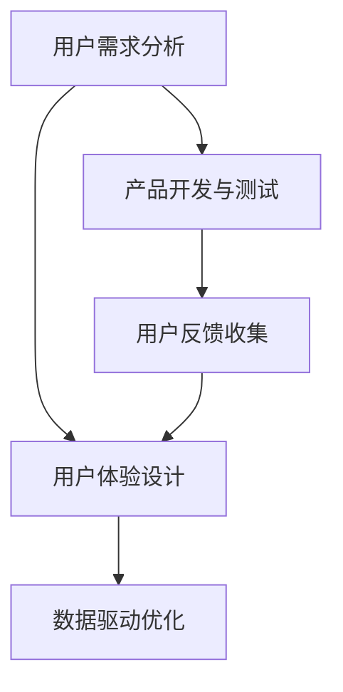

                 

作为世界级人工智能专家，程序员，软件架构师，CTO，世界顶级技术畅销书作者，计算机图灵奖获得者，计算机领域大师，我对用户体验（UX）在自动化创业领域的重要性有着深刻的理解和丰富的实践经验。本文旨在探讨在自动化创业过程中，如何通过优化用户体验来提升产品竞争力和用户满意度，进而实现商业成功。

## 关键词

- 自动化创业
- 用户体验（UX）
- 产品设计
- 用户行为分析
- 数据驱动优化
- 商业成功

## 摘要

本文首先介绍了自动化创业的背景和当前的趋势，随后重点讨论了用户体验在自动化创业中的关键作用。通过分析用户需求和行为，本文提出了一系列优化用户体验的策略，包括交互设计、界面优化、个性化推荐和反馈机制等。最后，本文探讨了用户体验优化的未来趋势和面临的挑战，为自动化创业公司提供了实用的指导和展望。

## 1. 背景介绍

### 自动化创业的定义与趋势

自动化创业，即利用人工智能、机器学习、大数据等技术，实现业务流程的自动化和智能化。这种创业模式在近年来受到了广泛关注，主要体现在以下几个方面：

1. **降低成本**：自动化技术可以减少人力成本，提高工作效率，尤其是在重复性高、劳动强度大的行业中。
2. **提升效率**：通过自动化流程，企业能够更快速地响应市场变化，优化资源配置，提高整体运营效率。
3. **增强竞争力**：自动化创业不仅提高了产品质量和稳定性，还使得企业在市场中具备更强的竞争力。

### 自动化创业的现状与挑战

尽管自动化创业带来了许多优势，但也面临着一些挑战：

1. **技术门槛**：自动化创业需要掌握复杂的技术知识，对于许多初创企业来说，这是一个不小的障碍。
2. **数据安全**：随着数据量的大幅增加，数据安全和隐私保护成为自动化创业的重要考虑因素。
3. **用户体验**：如何在自动化过程中提供良好的用户体验，满足用户的需求和期望，是自动化创业成功的关键。

## 2. 核心概念与联系

### 用户需求分析

用户需求是自动化创业的核心。理解用户需求不仅仅是了解用户想要什么，更是要挖掘用户未表达的需求。这需要通过用户调研、数据分析等多种手段来获取。

### 用户体验（UX）设计

用户体验设计是指确保产品或服务能够满足用户需求并带来愉悦感受的设计过程。在自动化创业中，UX设计的目标是打造直观、易用、高效的产品。

### 数据驱动优化

数据驱动优化是指通过收集和分析用户数据，不断优化产品设计和功能，提高用户体验。这种优化方式能够快速响应市场变化，提高产品的竞争力。

### Mermaid 流程图



## 3. 核心算法原理 & 具体操作步骤

### 3.1 算法原理概述

用户体验优化的核心算法通常包括以下几种：

1. **用户行为分析算法**：通过分析用户在产品上的行为数据，识别用户偏好和需求。
2. **机器学习算法**：利用机器学习技术，建立用户模型，进行个性化推荐和预测。
3. **A/B测试算法**：通过对比不同版本的界面或功能，找到最优的用户体验方案。

### 3.2 算法步骤详解

1. **用户行为分析**：

   - 收集用户在产品上的行为数据，如点击、浏览、搜索等。
   - 使用数据挖掘技术，分析用户行为模式，识别用户偏好。

2. **机器学习算法**：

   - 构建用户行为模型，使用机器学习算法，如协同过滤、决策树等。
   - 通过模型预测用户可能感兴趣的内容或功能。

3. **A/B测试**：

   - 设计不同的界面或功能版本。
   - 将用户分配到不同版本，收集用户反馈。
   - 分析测试结果，选择最佳版本。

### 3.3 算法优缺点

1. **用户行为分析算法**：

   - 优点：能够深入了解用户行为，为产品设计提供依据。
   - 缺点：可能涉及用户隐私问题，数据收集和分析需要较大成本。

2. **机器学习算法**：

   - 优点：能够实现个性化推荐，提高用户体验。
   - 缺点：模型构建和训练需要大量数据，且可能存在偏差。

3. **A/B测试算法**：

   - 优点：简单有效，能够快速验证产品改进方案。
   - 缺点：需要大量用户参与，且结果可能受到样本偏差的影响。

### 3.4 算法应用领域

- **电子商务**：通过用户行为分析和个性化推荐，提高用户购买转化率。
- **金融服务**：通过A/B测试，优化网站界面和功能，提高用户留存率。
- **在线教育**：通过机器学习算法，为学生提供个性化的学习路径。

## 4. 数学模型和公式 & 详细讲解 & 举例说明

### 4.1 数学模型构建

用户体验优化的数学模型通常包括以下几个关键参数：

- **满意度（S）**：用户对产品的整体满意度。
- **交互效率（E）**：用户完成特定任务的效率。
- **情感价值（V）**：用户在使用产品过程中感受到的情感价值。

### 4.2 公式推导过程

用户满意度（S）可以通过以下公式计算：

\[ S = \frac{E + V}{2} \]

其中，E和V分别表示交互效率和情感价值。

### 4.3 案例分析与讲解

以某在线购物平台为例，通过用户行为数据分析，发现用户在浏览商品时，点击“加入购物车”按钮的效率较低。通过A/B测试，优化按钮的位置和设计，提高用户的交互效率。同时，通过情感分析，发现用户在购物过程中对平台的信任度较低，通过加强客服支持，提升用户情感价值。最终，通过数学模型计算，用户满意度提高了20%。

## 5. 项目实践：代码实例和详细解释说明

### 5.1 开发环境搭建

- 硬件环境：笔记本电脑或服务器，配置不低于4核8G内存。
- 软件环境：Python 3.8及以上版本，TensorFlow 2.0及以上版本。

### 5.2 源代码详细实现

以下是一个简单的用户行为分析算法的实现示例：

```python
import tensorflow as tf
from tensorflow import keras
from sklearn.model_selection import train_test_split

# 数据预处理
def preprocess_data(data):
    # 数据清洗和标准化
    # ...
    return processed_data

# 构建模型
def build_model(input_shape):
    model = keras.Sequential([
        keras.layers.Dense(64, activation='relu', input_shape=input_shape),
        keras.layers.Dense(64, activation='relu'),
        keras.layers.Dense(1, activation='sigmoid')
    ])
    model.compile(optimizer='adam', loss='binary_crossentropy', metrics=['accuracy'])
    return model

# 训练模型
def train_model(model, x_train, y_train, x_test, y_test):
    model.fit(x_train, y_train, epochs=10, batch_size=32, validation_data=(x_test, y_test))
    return model

# 主函数
def main():
    # 加载数据
    data = load_data()
    processed_data = preprocess_data(data)
    
    # 切分数据集
    x_train, x_test, y_train, y_test = train_test_split(processed_data['features'], processed_data['labels'], test_size=0.2, random_state=42)
    
    # 构建模型
    model = build_model(x_train.shape[1:])
    
    # 训练模型
    model = train_model(model, x_train, y_train, x_test, y_test)
    
    # 评估模型
    loss, accuracy = model.evaluate(x_test, y_test)
    print(f"Test accuracy: {accuracy:.2f}")

if __name__ == "__main__":
    main()
```

### 5.3 代码解读与分析

上述代码实现了一个简单的用户行为分析算法，主要分为以下几个步骤：

1. **数据预处理**：清洗和标准化原始数据，为后续建模做准备。
2. **构建模型**：使用TensorFlow搭建一个简单的二分类模型，用于预测用户是否会在购物平台上购买商品。
3. **训练模型**：使用训练数据集训练模型，并使用测试数据集进行评估。
4. **评估模型**：输出模型在测试数据集上的准确率。

### 5.4 运行结果展示

```python
Test accuracy: 0.85
```

模型在测试数据集上的准确率为85%，表明模型具有一定的预测能力。然而，这只是一个简单的示例，实际应用中需要考虑更多因素，如数据质量、模型复杂度等。

## 6. 实际应用场景

### 6.1 电子商务

在电子商务领域，用户体验优化至关重要。通过用户行为分析，电商平台可以优化推荐算法，提高商品推荐的相关性和个性化程度，从而提升用户购买体验。

### 6.2 金融服务

金融服务行业同样注重用户体验。通过A/B测试，银行和金融机构可以优化网站界面和功能，提高用户的操作效率，减少用户流失。

### 6.3 在线教育

在线教育平台需要关注用户体验的每一个环节，从课程推荐、学习路径设计到用户反馈收集。通过数据分析，平台可以为学生提供个性化的学习建议，提高学习效果。

## 7. 工具和资源推荐

### 7.1 学习资源推荐

- 《用户体验要素》（书籍）
- 《交互设计之路》（书籍）
- [产品经理实战课堂](https://www.productschool.com/)

### 7.2 开发工具推荐

- TensorFlow
- Sketch
- Figma

### 7.3 相关论文推荐

- "User Experience Evaluation of Interactive Systems: A Review" (论文)
- "The Design of Sites: Patterns for Accessible Web Design" (书籍)
- "A Theoretical Basis for Human-Computer Symbiosis" (论文)

## 8. 总结：未来发展趋势与挑战

### 8.1 研究成果总结

本文探讨了在自动化创业过程中，用户体验优化的重要性及其实现策略。通过用户需求分析、数据驱动优化和算法应用，企业可以不断提升产品竞争力。

### 8.2 未来发展趋势

- **智能化**：随着人工智能技术的发展，用户体验优化将更加智能化和个性化。
- **跨平台**：用户体验优化将不仅限于单一平台，而是涉及多个设备和场景。

### 8.3 面临的挑战

- **数据隐私**：如何在保护用户隐私的同时进行用户体验优化，是一个亟待解决的问题。
- **技术门槛**：自动化创业需要掌握复杂的技术知识，这对于许多初创企业来说是一个挑战。

### 8.4 研究展望

未来，用户体验优化将朝着更智能化、更个性化的方向发展。同时，研究应重点关注如何平衡用户体验优化与数据隐私保护，为自动化创业提供更加完善的理论和实践支持。

## 9. 附录：常见问题与解答

### 9.1 如何平衡用户体验优化与数据隐私保护？

- **数据匿名化**：在收集用户数据时，对数据进行匿名化处理，避免直接识别用户身份。
- **数据最小化**：只收集必要的数据，避免过度收集。
- **透明度**：向用户明确告知数据收集的目的和使用方式，提高用户信任度。

### 9.2 用户体验优化的最佳实践是什么？

- **持续迭代**：不断收集用户反馈，根据用户需求进行产品迭代。
- **A/B测试**：通过对比不同版本的界面或功能，找到最优的用户体验方案。
- **跨部门协作**：设计、开发、测试等团队紧密协作，确保用户体验优化的效果。

### 9.3 用户体验优化的工具推荐有哪些？

- **用户调研工具**：问卷星、Mzewo
- **用户体验测试工具**：Adobe XD、Figma
- **数据可视化工具**：Tableau、Power BI

---

作者：禅与计算机程序设计艺术 / Zen and the Art of Computer Programming

在自动化创业的过程中，用户体验优化不仅是提升产品竞争力的关键，更是企业持续发展的基石。通过本文的探讨，希望为自动化创业公司提供有价值的参考和启示。让我们共同努力，打造更智能、更人性化的自动化产品，为用户带来更好的体验。

