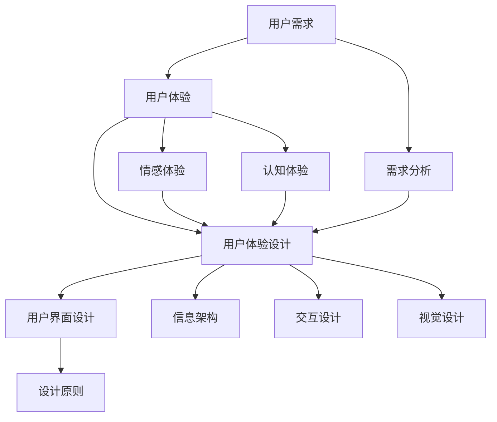

                 

## 1. 背景介绍

在当今快速发展的数字化时代，用户体验（User Experience, UX）设计已经成为了自动化创业领域不可或缺的一环。用户体验设计不仅仅是界面设计的视觉元素，更涉及到用户在使用产品或服务过程中的整体感受和体验。随着互联网技术的不断进步和人工智能应用的日益普及，用户对于产品的期望和要求也在不断提升。在这种情况下，如何通过用户体验设计来提高产品竞争力、满足用户需求、实现商业价值，成为了自动化创业企业关注的焦点。

用户体验设计思维在自动化创业中的应用，主要表现在以下几个方面：

1. **需求分析与理解**：通过对用户需求的深入分析，理解用户在特定场景下的行为模式和心理需求，从而设计出能够满足用户期待的产品。
2. **产品概念验证**：在产品开发初期，通过用户体验设计思维进行原型设计和用户测试，验证产品概念是否符合用户需求。
3. **迭代优化**：根据用户反馈，不断优化产品设计，提升用户体验，实现产品与用户的深度交互。
4. **提升品牌形象**：优秀的用户体验设计能够提升品牌形象，增强用户对品牌的认同感和忠诚度。
5. **降低用户流失率**：通过优化用户体验，降低用户在产品使用过程中的挫折感和退出率，提高用户留存率。

本文将围绕用户体验设计思维在自动化创业中的应用，探讨其核心概念、设计原则、实施方法以及未来发展趋势。希望通过本文的分享，能够为自动化创业者在用户体验设计方面提供一些有益的启示。

## 2. 核心概念与联系

在深入探讨用户体验设计思维之前，我们需要明确几个核心概念及其相互之间的联系。以下是几个关键术语的定义及其关系：

### 用户需求

用户需求是用户体验设计的出发点。它指的是用户在特定情境下想要实现的目标或解决的问题。理解用户需求需要从用户的行为、情感和认知三个方面进行综合分析。用户需求决定了产品设计的基本方向。

### 用户体验

用户体验是指用户在接触和使用产品或服务过程中的整体感受和体验。它不仅包括功能的使用便利性，还包括情感体验和认知体验。用户体验是衡量产品成功与否的重要标准。

### 用户体验设计

用户体验设计（User Experience Design, UXD）是一种以用户为中心的设计方法，旨在优化用户在使用产品或服务过程中的体验。它涉及需求分析、用户研究、信息架构、交互设计、视觉设计等多个方面。

### 用户界面设计

用户界面设计（User Interface Design, UID）是用户体验设计的一个重要组成部分，主要关注产品的界面布局、交互元素、视觉元素等。一个好的用户界面设计能够提升用户的操作效率和满意度。

### 设计原则

设计原则是指导用户体验设计的核心理念，如一致性、简洁性、直观性等。设计原则确保产品设计在视觉和功能上的一致性，从而提升用户体验。

### 关系图

以下是用户体验设计中的核心概念及其关系的 Mermaid 流程图：



通过上述流程图，我们可以清晰地看到用户需求如何驱动用户体验设计，而用户体验设计又如何通过用户界面设计和设计原则来实现。

### 2.1 用户需求分析

用户需求分析是用户体验设计的起点。它包括对用户行为的观察、用户访谈、问卷调查等多种方法，旨在深入了解用户在特定情境下的需求。

- **用户行为观察**：通过直接观察用户在现实环境中的行为，了解用户的需求和行为模式。
- **用户访谈**：通过与用户进行面对面的交流，深入了解用户的需求、喜好和痛点。
- **问卷调查**：通过设计有针对性的问卷，收集用户的大规模反馈。

### 2.2 用户体验设计原则

用户体验设计原则是指导设计师进行产品设计的核心理论。以下是一些关键设计原则：

- **一致性**：界面元素的设计和交互逻辑应该保持一致，使用户在使用过程中能够轻松上手。
- **简洁性**：简化用户界面，避免过多的干扰元素，让用户能够专注于完成任务。
- **直观性**：设计应该直观易懂，用户不需要花费过多时间来理解如何操作。
- **可用性**：产品应具有较高的可用性，确保用户能够顺利完成任务。
- **可访问性**：设计应考虑到不同用户群体的需求，包括残障人士、老年人等。

### 2.3 用户界面设计

用户界面设计是用户体验设计的重要组成部分。它涉及到产品的布局、色彩、字体、图标等多个方面。以下是用户界面设计的一些关键要素：

- **布局**：合理地组织界面元素，确保信息呈现清晰、直观。
- **色彩**：选择适合产品的色彩方案，提升视觉吸引力。
- **字体**：选择易于阅读的字体，确保信息的可读性。
- **图标**：设计简洁、易懂的图标，提升用户操作的效率。

### 2.4 设计原则与用户体验

设计原则与用户体验密切相关。良好的设计原则能够提升产品的用户体验，从而增加用户对产品的满意度和忠诚度。以下是一些设计原则与用户体验之间的关系：

- **一致性**：一致的设计原则可以降低用户的学习成本，提高操作效率。
- **简洁性**：简洁的设计能够减少用户的认知负担，提升用户体验。
- **直观性**：直观的设计能够让用户快速理解如何操作，减少挫折感。
- **可用性**：高可用性的设计能够确保用户能够顺利完成任务，提升满意度。

通过上述核心概念和关系的讨论，我们可以更好地理解用户体验设计在自动化创业中的重要性。在接下来的章节中，我们将进一步探讨用户体验设计的方法和实施步骤。

### 3. 核心算法原理 & 具体操作步骤

在用户体验设计中，算法原理起到了至关重要的作用。它们不仅决定了产品的功能实现，还影响了用户的操作体验。在本节中，我们将深入探讨用户体验设计中的核心算法原理，并详细说明具体操作步骤。

#### 3.1 算法原理概述

用户体验设计中的核心算法主要包括以下几类：

1. **交互算法**：用于处理用户与产品交互时的响应和反馈。
2. **个性化推荐算法**：根据用户行为和历史数据，为用户提供个性化的内容推荐。
3. **用户行为预测算法**：通过分析用户行为数据，预测用户未来的需求和偏好。
4. **性能优化算法**：用于提升产品的响应速度和稳定性。

这些算法在用户体验设计中起到了关键作用，确保产品能够高效、稳定地运行，同时满足用户的个性化需求。

#### 3.2 算法步骤详解

以下是这些核心算法的具体操作步骤：

##### 3.2.1 交互算法

交互算法主要包括以下步骤：

1. **事件监听**：监听用户的操作事件，如点击、滑动等。
2. **事件处理**：根据监听到的事件类型，执行相应的处理逻辑。
3. **状态更新**：更新用户界面的状态，以反映用户的操作结果。
4. **反馈生成**：生成适当的视觉或听觉反馈，告知用户操作结果。

例如，在一个电商平台中，当用户点击购物车图标时，交互算法会监听到这个点击事件，处理相应的逻辑，如更新购物车中的商品列表，并生成动画反馈，提示用户操作成功。

##### 3.2.2 个性化推荐算法

个性化推荐算法的主要步骤如下：

1. **用户行为数据收集**：收集用户在平台上的行为数据，如浏览记录、购买历史、评价等。
2. **数据预处理**：对收集到的数据进行清洗、去噪、归一化等预处理操作。
3. **特征提取**：从预处理后的数据中提取特征，如用户的兴趣爱好、购买倾向等。
4. **模型训练**：使用机器学习算法（如协同过滤、基于内容的推荐等）训练推荐模型。
5. **推荐生成**：根据用户的行为特征和推荐模型，生成个性化的推荐结果。

例如，在一个视频平台上，个性化推荐算法会根据用户的观看历史和偏好，推荐用户可能感兴趣的新视频。

##### 3.2.3 用户行为预测算法

用户行为预测算法的步骤包括：

1. **数据收集**：收集用户的行为数据，如点击次数、停留时间、购买频率等。
2. **特征工程**：提取用户行为的特征，如用户活跃时间段、购买频率等。
3. **模型训练**：使用时间序列分析、回归分析等方法训练预测模型。
4. **行为预测**：根据训练好的模型，预测用户未来的行为。

例如，在一个电商平台上，用户行为预测算法可以预测用户何时会再次购买，从而提前发送促销信息。

##### 3.2.4 性能优化算法

性能优化算法的步骤包括：

1. **性能监控**：监控产品的性能指标，如响应时间、资源消耗等。
2. **瓶颈分析**：分析性能瓶颈，找出影响性能的关键因素。
3. **算法优化**：根据瓶颈分析结果，优化算法实现，如减少计算复杂度、优化数据结构等。
4. **性能评估**：评估优化后的性能指标，确保性能提升。

例如，在一个即时通讯应用中，性能优化算法会监控消息传输的延迟，优化网络通信算法，以减少消息的发送和接收延迟。

#### 3.3 算法优缺点

每种算法都有其优缺点，以下是这些核心算法的优缺点分析：

- **交互算法**：
  - 优点：实时响应用户操作，提高用户交互体验。
  - 缺点：处理复杂交互时，代码逻辑可能变得繁琐。
- **个性化推荐算法**：
  - 优点：提高用户满意度和留存率，增加用户粘性。
  - 缺点：需要大量的用户数据和计算资源，且推荐结果可能存在偏差。
- **用户行为预测算法**：
  - 优点：提前预测用户需求，提供个性化的服务。
  - 缺点：预测结果可能存在误差，需要不断优化模型。
- **性能优化算法**：
  - 优点：提高产品的稳定性和响应速度。
  - 缺点：优化过程可能涉及较多底层技术和代码修改。

#### 3.4 算法应用领域

这些算法在用户体验设计中的应用非常广泛，以下是一些典型应用领域：

- **电子商务**：个性化推荐、用户行为预测等算法用于提升购物体验和销售转化率。
- **社交媒体**：交互算法用于处理用户发布内容、评论和私信等。
- **在线教育**：用户行为预测算法用于个性化课程推荐和学习路径规划。
- **游戏**：交互算法用于游戏操作和游戏效果反馈，提升游戏体验。
- **即时通讯**：性能优化算法用于减少消息延迟，提升通信质量。

通过深入理解这些核心算法原理和具体操作步骤，我们可以更好地设计出满足用户需求的高效、稳定的产品。在接下来的章节中，我们将探讨用户体验设计的数学模型和公式。

### 4. 数学模型和公式 & 详细讲解 & 举例说明

在用户体验设计中，数学模型和公式起到了关键作用。它们不仅帮助我们理解用户体验的量化指标，还可以指导我们优化产品设计。在本节中，我们将详细讲解用户体验设计中的几个关键数学模型和公式，并通过具体案例进行说明。

#### 4.1 数学模型构建

用户体验设计中的数学模型主要包括以下几个方面：

1. **满意度模型**：用于衡量用户对产品或服务的满意程度。
2. **留存率模型**：用于预测用户在一段时间内持续使用产品的概率。
3. **转化率模型**：用于衡量用户完成特定任务的概率。
4. **响应时间模型**：用于评估系统对用户操作的响应速度。

#### 4.2 公式推导过程

以下是这些数学模型的公式推导过程：

##### 4.2.1 满意度模型

满意度模型通常使用以下公式：

\[ S = \frac{E - D + T}{3} \]

其中：
- \( S \) 表示满意度（Satisfaction）。
- \( E \) 表示预期值（Expectation）。
- \( D \) 表示感知差异（Disconfirmation）。
- \( T \) 表示感知收益（Tangible Benefits）。

推导过程如下：

- 预期值（\( E \)）是用户在使用产品之前对产品的期望。
- 感知差异（\( D \)）是用户实际体验与预期之间的差异。
- 感知收益（\( T \)）是用户在使用产品后感知到的实际收益。

通过这些因素的加权平均，我们可以得到用户对产品的总体满意度。

##### 4.2.2 留存率模型

留存率模型可以使用以下公式：

\[ L = \frac{N}{I} \]

其中：
- \( L \) 表示留存率（Retention Rate）。
- \( N \) 表示在特定时间周期内留存的用户数。
- \( I \) 表示在相同时间周期内初始注册的用户总数。

推导过程如下：

- 留存率是衡量用户持续使用产品的重要指标。
- 通过计算在一定时间周期内留存用户数与初始注册用户总数的比例，我们可以得到留存率。

##### 4.2.3 转化率模型

转化率模型可以使用以下公式：

\[ CR = \frac{C}{I} \times 100\% \]

其中：
- \( CR \) 表示转化率（Conversion Rate）。
- \( C \) 表示完成特定任务的用户数。
- \( I \) 表示尝试完成任务的初始用户数。

推导过程如下：

- 转化率是衡量用户完成特定任务的概率。
- 通过计算完成任务的用户数与尝试任务的初始用户数的比例，并乘以100%，我们可以得到转化率。

##### 4.2.4 响应时间模型

响应时间模型可以使用以下公式：

\[ RT = \frac{1}{f} \]

其中：
- \( RT \) 表示响应时间（Response Time）。
- \( f \) 表示系统的处理频率。

推导过程如下：

- 响应时间是指系统对用户操作从接收请求到产生响应所需的时间。
- 响应时间与系统的处理频率成反比。处理频率越高，响应时间越短。

#### 4.3 案例分析与讲解

以下通过具体案例来讲解这些数学模型的应用：

##### 案例一：满意度模型

假设一个在线购物平台，用户对产品的预期值为4分，实际体验后感知差异为2分，感知收益为5分。根据满意度模型，我们可以计算满意度如下：

\[ S = \frac{4 - 2 + 5}{3} = \frac{7}{3} \approx 2.33 \]

满意度为2.33分，表明用户对该平台整体满意。

##### 案例二：留存率模型

在一个移动应用程序中，一个月内有1000个用户注册，其中500个用户在第一个月结束时仍然活跃。根据留存率模型，我们可以计算第一个月的留存率为：

\[ L = \frac{500}{1000} = 0.5 \]

第一个月的留存率为50%，表明有一半的用户在一个月后仍然在使用该应用。

##### 案例三：转化率模型

在一个电商网站，有1000个用户尝试购买产品，其中200个用户最终完成了购买。根据转化率模型，我们可以计算购买转化率为：

\[ CR = \frac{200}{1000} \times 100\% = 20\% \]

购买转化率为20%，表明有20%的用户在尝试购买后最终完成了购买。

##### 案例四：响应时间模型

在一个即时通讯应用中，系统的处理频率为每秒100次。根据响应时间模型，我们可以计算平均响应时间为：

\[ RT = \frac{1}{100} = 0.01 \text{秒} \]

平均响应时间为0.01秒，表明系统对用户操作的响应速度非常快。

通过上述案例，我们可以看到数学模型在用户体验设计中的应用。这些模型不仅帮助我们量化用户体验，还可以指导我们优化产品设计，提升用户满意度、留存率和转化率。

### 5. 项目实践：代码实例和详细解释说明

在本节中，我们将通过一个实际项目来展示如何将用户体验设计思维应用于软件开发。该项目是一个简单的在线购物平台，我们将从开发环境搭建、源代码实现、代码解读与分析以及运行结果展示等方面进行详细讲解。

#### 5.1 开发环境搭建

为了实现这个在线购物平台，我们需要搭建一个合适的技术栈。以下是我们的开发环境配置：

- **前端技术**：使用React.js框架进行前端开发，结合Redux进行状态管理，以及使用Ant Design进行UI组件设计。
- **后端技术**：使用Node.js和Express框架进行后端开发，数据库使用MongoDB。
- **版本控制**：使用Git进行代码管理。
- **开发工具**：Visual Studio Code作为代码编辑器，Git Bash进行Git操作。

首先，确保你的计算机上安装了Node.js和MongoDB。然后，创建一个新的React项目：

```bash
npx create-react-app shopping-platform
cd shopping-platform
```

接下来，安装必要的依赖包：

```bash
npm install redux react-redux antd axios
```

MongoDB的安装请参考官方文档：[MongoDB安装教程](https://docs.mongodb.com/manual/installation/)

#### 5.2 源代码详细实现

在这个项目中，我们将实现以下主要功能模块：

- **用户注册与登录**：用户可以注册账号并登录系统。
- **商品浏览与搜索**：用户可以浏览商品，并通过关键字搜索商品。
- **购物车管理**：用户可以将商品添加到购物车，并进行数量调整或删除。
- **订单处理**：用户可以查看订单详情，并完成订单支付。

以下是用户注册功能的实现代码：

**src/components/UserRegistrationForm.js**

```javascript
import React, { useState } from 'react';
import { connect } from 'react-redux';
import { registerUser } from '../actions/userActions';

const UserRegistrationForm = ({ registerUser }) => {
  const [username, setUsername] = useState('');
  const [password, setPassword] = useState('');

  const handleSubmit = (e) => {
    e.preventDefault();
    registerUser({ username, password });
  };

  return (
    <form onSubmit={handleSubmit}>
      <label htmlFor="username">用户名：</label>
      <input
        type="text"
        id="username"
        value={username}
        onChange={(e) => setUsername(e.target.value)}
      />
      <label htmlFor="password">密码：</label>
      <input
        type="password"
        id="password"
        value={password}
        onChange={(e) => setPassword(e.target.value)}
      />
      <button type="submit">注册</button>
    </form>
  );
};

const mapDispatchToProps = (dispatch) => ({
  registerUser: (user) => dispatch(registerUser(user)),
});

export default connect(null, mapDispatchToProps)(UserRegistrationForm);
```

**src/actions/userActions.js**

```javascript
import axios from 'axios';

export const registerUser = (user) => async (dispatch) => {
  try {
    const response = await axios.post('/api/users/register', user);
    dispatch({ type: 'REGISTER_SUCCESS', payload: response.data });
  } catch (error) {
    dispatch({ type: 'REGISTER_FAILURE', payload: error });
  }
};
```

#### 5.3 代码解读与分析

在上述代码中，我们实现了用户注册功能。以下是关键部分的代码解读：

- **组件结构**：`UserRegistrationForm` 是一个React组件，包含两个状态 `username` 和 `password`，分别用于存储用户输入的用户名和密码。
- **事件处理**：`handleSubmit` 函数在表单提交时被调用，防止默认表单提交行为，并调用 `registerUser` action。
- **状态管理**：通过 `connect` 函数将 `registerUser` action 连接到组件，使其能够派发action。
- **异步处理**：`registerUser` action 使用 `axios` 发起异步请求，将用户数据发送到后端进行注册。

在后端，我们使用Express处理用户注册请求。以下是后端注册接口的实现：

**server.js**

```javascript
const express = require('express');
const mongoose = require('mongoose');
const userRoutes = require('./routes/userRoutes');

const app = express();

// 连接MongoDB
mongoose.connect('mongodb://localhost:27017/shopping-platform', {
  useNewUrlParser: true,
  useUnifiedTopology: true,
});

app.use(express.json());
app.use('/api/users', userRoutes);

app.listen(5000, () => {
  console.log('Server started on port 5000');
});
```

**routes/userRoutes.js**

```javascript
const express = require('express');
const User = require('../models/User');
const bcrypt = require('bcryptjs');

const router = express.Router();

router.post('/register', async (req, res) => {
  try {
    const { username, password } = req.body;

    const user = await User.findOne({ username });
    if (user) {
      return res.status(400).json({ message: '用户已存在' });
    }

    const hashedPassword = await bcrypt.hash(password, 10);

    const newUser = new User({ username, password: hashedPassword });
    await newUser.save();

    res.status(201).json({ message: '用户注册成功' });
  } catch (error) {
    res.status(500).json({ message: '服务器错误' });
  }
});

module.exports = router;
```

在这段代码中，我们定义了用户注册路由，通过MongoDB进行用户信息存储，并使用bcrypt对用户密码进行加密存储。

#### 5.4 运行结果展示

在完成上述代码实现后，我们可以通过以下步骤运行项目：

1. 启动MongoDB服务。
2. 启动后端服务器：

```bash
node server.js
```

3. 启动前端项目：

```bash
npm start
```

打开浏览器，访问 `http://localhost:3000`，你应该可以看到用户注册表单。输入有效的用户名和密码后提交表单，你应该会看到后端返回的用户注册成功的消息。

通过这个实际项目，我们展示了如何将用户体验设计思维应用于软件开发。从需求分析、原型设计到代码实现和测试，我们始终关注用户的需求和体验，确保产品能够满足用户的期望。在接下来的章节中，我们将探讨用户体验设计在实际应用场景中的具体应用。

### 6. 实际应用场景

用户体验设计（UX Design）在自动化创业中的应用场景广泛且多样，不同领域有着各自独特的需求和实践方法。以下是用户体验设计在不同领域中的应用场景：

#### 6.1 电子商务

在电子商务领域，用户体验设计至关重要，因为它直接关系到销售转化率和用户忠诚度。以下是一些关键应用场景：

- **购物车设计**：优化购物车页面，使其易于添加和删除商品，提供快速结账选项，减少用户操作步骤。
- **个性化推荐**：通过分析用户行为和购买历史，提供个性化的商品推荐，提升用户购买意愿。
- **搜索功能**：设计高效的搜索功能，确保用户能够快速找到所需商品，提升购物体验。
- **用户反馈**：建立用户反馈机制，及时收集用户意见和建议，不断优化产品。

#### 6.2 社交媒体

社交媒体平台依赖于用户体验来维持用户粘性。以下是一些关键应用场景：

- **内容流设计**：优化内容流，确保信息的更新和呈现方式符合用户的兴趣和行为模式。
- **互动设计**：设计丰富的互动功能，如点赞、评论、分享等，提升用户的参与度和活跃度。
- **隐私设置**：清晰展示隐私设置选项，让用户能够轻松控制自己的信息共享范围。
- **通知系统**：优化通知系统，确保用户不会因为过多的通知而感到打扰。

#### 6.3 在线教育

在线教育平台通过用户体验设计来提升学习效果和用户满意度。以下是一些关键应用场景：

- **课程导航**：设计直观的课程导航，帮助用户快速找到所需课程和学习资源。
- **学习路径规划**：根据用户的学习进度和偏好，提供个性化的学习路径规划。
- **交互式学习**：设计交互式学习工具，如模拟测试、讨论区等，增强学习互动性。
- **学习反馈**：提供及时的学习反馈，帮助用户了解自己的学习成果，鼓励持续学习。

#### 6.4 健康与健身

健康与健身应用通过用户体验设计来提升用户的健康习惯和生活方式。以下是一些关键应用场景：

- **数据可视化**：设计清晰的数据可视化工具，帮助用户了解自己的健康数据。
- **个性化建议**：基于用户数据，提供个性化的健康和健身建议。
- **互动提醒**：设计互动提醒功能，如定时喝水提醒、锻炼提醒等，帮助用户养成良好的健康习惯。
- **社区互动**：建立用户社区，鼓励用户分享健康心得，相互激励。

#### 6.5 金融科技

金融科技（FinTech）领域的用户体验设计旨在提升用户的信任度和满意度。以下是一些关键应用场景：

- **安全认证**：设计简洁、安全的认证流程，确保用户账户的安全。
- **交易流程**：优化交易流程，减少用户操作步骤，提升交易速度。
- **用户指南**：提供清晰的用户指南，帮助用户理解金融产品和服务。
- **客户服务**：建立高效的客户服务系统，确保用户问题能够得到及时解决。

通过在不同领域中的应用，用户体验设计思维不仅提升了产品的功能性和易用性，还增强了用户对品牌的认同感和忠诚度。在自动化创业中，深入理解并运用用户体验设计思维，将有助于企业打造具有竞争力的产品，实现商业成功。

#### 6.5 未来应用展望

用户体验设计（UX Design）在未来的自动化创业中将继续发挥重要作用，并呈现出以下几个显著趋势：

**1. 人工智能与用户体验的深度融合**

随着人工智能（AI）技术的不断发展，用户体验设计将更加智能化。AI技术可以通过用户行为分析、情感识别和个性化推荐，为用户提供更加精准和个性化的服务。未来，自动化创业企业可以利用AI技术实现智能客服、智能推荐和智能交互等功能，提升用户体验。

**2. 生态系统的综合设计**

未来的用户体验设计将不仅仅关注单个产品的用户界面，而是扩展到整个生态系统。企业需要设计一个无缝连接的生态系统，确保不同产品和服务之间的用户体验保持一致。这种整体性的设计将提升用户对品牌的认同感和忠诚度。

**3. 可持续性和社会责任**

在环境问题日益严峻的今天，用户体验设计也将更加注重可持续性和社会责任。自动化创业企业可以通过绿色设计、节能减排和循环利用等手段，提高产品的环保性。此外，企业还需要在设计中融入社会责任元素，如无障碍设计、公平性和隐私保护，以满足不同用户群体的需求。

**4. 跨界融合与创新**

用户体验设计将与其他领域（如艺术、心理学、社会学等）进行跨界融合，创造出全新的用户体验。例如，通过结合心理学原理，设计出能够更好地满足用户情感需求的产品；通过艺术元素，提升产品的美学价值。这种跨界融合将推动用户体验设计的不断创新和发展。

**5. 虚拟现实和增强现实的应用**

随着虚拟现实（VR）和增强现实（AR）技术的成熟，用户体验设计将在这些领域得到广泛应用。自动化创业企业可以通过VR和AR技术，为用户提供更加沉浸式的体验，如虚拟购物、在线培训、虚拟旅游等。这些技术将极大地拓展用户体验的边界。

**6. 用户体验设计工具的智能化**

未来的用户体验设计工具将更加智能化，具备自动化设计、智能反馈和实时优化等功能。这些工具将帮助设计师更快地迭代设计，提高设计效率。同时，设计师可以通过这些工具更好地与开发团队合作，确保设计在实现过程中得到充分落实。

**7. 数据驱动的用户体验优化**

数据将在用户体验设计中发挥更加重要的作用。通过大数据分析和用户行为分析，企业可以深入了解用户需求和行为模式，从而进行数据驱动的用户体验优化。这种优化方式将确保产品始终能够满足用户的需求，提升用户满意度。

总之，用户体验设计在未来的自动化创业中将不断创新和发展，成为企业赢得市场竞争的关键因素。自动化创业企业需要紧跟技术趋势，积极采用用户体验设计思维，打造出能够满足用户需求、具有竞争力的产品。

### 7. 工具和资源推荐

在用户体验设计领域，有许多优秀的工具和资源可以帮助自动化创业企业提升设计效率和质量。以下是一些推荐的工具、资源和相关论文：

#### 7.1 学习资源推荐

1. **书籍**
   - 《用户体验要素》：作者：Jesse James Garrett
   - 《设计心理学》：作者：Don Norman
   - 《移动应用UI设计指南》：作者：Simon Harries

2. **在线课程**
   - [Coursera](https://www.coursera.org/)：提供一系列关于用户体验设计的在线课程，包括UI/UX设计、人机交互等。
   - [Udemy](https://www.udemy.com/)：涵盖广泛的用户体验设计课程，从基础知识到高级实践。

3. **博客和网站**
   - [UI Movement](https://uimovement.com/)：提供有关UI设计的最新趋势和案例分析。
   - [A List Apart](https://alistapart.com/)：涵盖前端设计和用户体验的深度文章和教程。

#### 7.2 开发工具推荐

1. **原型设计工具**
   - **Adobe XD**：功能强大的原型设计工具，支持界面元素和动画设计。
   - **Figma**：基于网页的协作设计工具，支持多人实时协作。
   - **Sketch**：适用于Mac平台的矢量设计工具，广泛应用于UI/UX设计。

2. **用户体验分析工具**
   - **Google Analytics**：分析用户行为和流量，优化用户体验。
   - **Hotjar**：提供用户行为热图和视频，帮助理解用户交互。
   - **UserTesting**：进行真实用户测试，获取直观的用户反馈。

3. **代码编辑器**
   - **Visual Studio Code**：功能丰富、扩展性强的代码编辑器，适用于多种编程语言。
   - **Atom**：基于网页的代码编辑器，提供强大的插件支持。

#### 7.3 相关论文推荐

1. **"User Experience Design: Definition and History"**：介绍了用户体验设计的定义、历史和发展趋势。
2. **"Designing for User Experience"**：探讨了用户体验设计的关键原则和最佳实践。
3. **"The Role of User Experience in Product Success"**：分析了用户体验设计在产品成功中的重要性。

通过这些工具和资源的帮助，自动化创业企业可以更好地进行用户体验设计，提升产品的竞争力。在设计过程中，结合实际案例和用户反馈，持续优化设计，将有助于企业实现长期成功。

### 8. 总结：未来发展趋势与挑战

在自动化创业中，用户体验设计思维的重要性日益凸显。随着技术的不断进步和用户需求的多样化，用户体验设计不仅影响产品的市场竞争力，还直接关系到用户满意度和忠诚度。未来，用户体验设计将在以下几个方向上呈现发展趋势：

**1. 智能化与个性化**：人工智能技术的普及将使用户体验设计更加智能化和个性化。通过数据分析和机器学习，设计师可以更精准地理解用户需求，提供定制化的服务体验。

**2. 生态系统融合**：未来的用户体验设计将不再局限于单一产品，而是扩展到整个生态系统。企业需要设计无缝连接的多产品体验，提升用户整体满意度。

**3. 可持续性与社会责任**：随着可持续发展意识的增强，用户体验设计将更加注重环保和公平性。企业需要通过绿色设计和社会责任元素，提升产品的社会价值。

**4. 跨界融合与创新**：用户体验设计将与其他领域（如艺术、心理学等）进行融合，创造出全新的用户体验。跨界合作将推动用户体验设计的创新和发展。

然而，用户体验设计也面临一系列挑战：

**1. 数据隐私与安全问题**：在数据驱动的用户体验设计中，如何保护用户隐私和数据安全成为一大挑战。企业需要建立严格的数据保护机制，确保用户数据的安全。

**2. 技术快速迭代**：技术更新换代速度加快，设计师需要不断学习新技术，以保持设计的先进性和竞争力。同时，快速迭代也要求企业具备高效的研发和交付能力。

**3. 用户多样性**：用户群体的多样性增加了设计的复杂性。设计师需要考虑不同用户群体的需求和偏好，设计出能够满足广泛用户群体的产品。

**4. 预算和资源限制**：用户体验设计需要投入大量的人力、时间和资源。在资源有限的情况下，企业需要在设计质量和成本之间做出权衡。

面对这些挑战，自动化创业企业应采取以下策略：

**1. 建立用户研究文化**：定期进行用户研究，深入了解用户需求和行为，确保设计始终以用户为中心。

**2. 采用敏捷设计方法**：通过敏捷设计方法，快速迭代和优化产品设计，提高设计的灵活性和响应速度。

**3. 建立跨职能团队**：跨职能团队可以协同工作，提高设计效率和质量。设计师、开发人员、产品经理等角色需要紧密合作，确保设计在实现过程中得到充分落实。

**4. 投资于设计工具和技术**：选择合适的用户体验设计工具和技术，提高设计效率和协作效果。同时，不断学习和掌握新技术，保持设计的先进性。

总之，用户体验设计在自动化创业中具有不可替代的重要性。未来，随着技术的不断进步和用户需求的多样化，用户体验设计将面临新的机遇和挑战。自动化创业企业应积极应对这些变化，持续优化产品设计，提升用户体验，实现商业成功。

### 9. 附录：常见问题与解答

在用户体验设计过程中，自动化创业企业可能会遇到一系列问题。以下是常见问题及相应的解答：

#### 问题1：如何平衡用户体验与商业目标？

**解答**：用户体验和商业目标并非对立关系，而是相互促进的。企业可以通过以下方法进行平衡：

1. **明确用户需求**：深入了解用户需求，确保产品设计符合用户期望。
2. **设置关键绩效指标（KPI）**：制定可量化的用户体验目标和商业目标，如用户满意度、留存率等。
3. **用户测试与反馈**：在产品设计过程中，进行用户测试和反馈，确保设计既满足用户需求，又符合商业目标。

#### 问题2：如何处理用户多样性和个性化需求？

**解答**：处理用户多样性和个性化需求需要灵活的设计策略：

1. **用户细分**：将用户群体进行细分，了解不同用户群体的需求和偏好。
2. **个性化推荐**：利用数据分析和机器学习技术，为用户提供个性化的内容和服务。
3. **灵活的设计**：采用模块化设计，使产品能够适应不同用户的需求和场景。

#### 问题3：用户体验设计与技术实现之间的冲突如何解决？

**解答**：解决用户体验设计与技术实现之间的冲突需要跨职能协作：

1. **沟通与协作**：建立良好的沟通机制，确保设计师、开发人员和产品经理之间的信息传递畅通。
2. **敏捷开发**：采用敏捷开发方法，快速迭代和优化设计，确保设计与技术实现同步。
3. **优先级管理**：明确设计和技术的优先级，确保关键功能得到优先实现。

#### 问题4：如何确保用户体验设计的可持续性？

**解答**：确保用户体验设计的可持续性需要以下措施：

1. **绿色设计**：采用环保材料和能源节约技术，减少产品对环境的影响。
2. **可持续性评估**：在产品设计过程中，进行可持续性评估，确保产品在整个生命周期内都符合可持续发展目标。
3. **社会责任**：在设计过程中融入社会责任元素，如无障碍设计、公平性等，提升产品的社会价值。

通过以上解答，自动化创业企业可以更好地处理用户体验设计过程中遇到的问题，实现设计的可持续性和商业成功。

