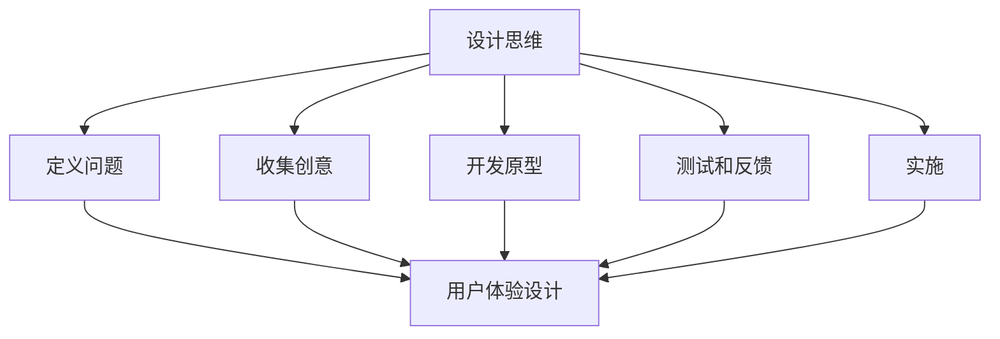

                 

关键词：自动化创业、用户体验设计、设计思维、创新、技术实现、用户参与、数据驱动

> 摘要：本文旨在探讨自动化创业中用户体验设计思维的重要性，分析设计思维在创业过程中的应用，以及如何通过用户参与和数据驱动来提升用户体验，进而推动创业项目的发展。

## 1. 背景介绍

在当今快速发展的科技时代，自动化技术在各个领域的应用越来越广泛。从制造业到服务业，自动化技术的引入不仅提高了生产效率，还大大改变了人们的生活方式。然而，随着技术的不断进步，用户对于产品的期望也在不断提高。用户体验设计（User Experience Design，简称UXD）作为一种以用户为中心的设计方法，逐渐成为自动化创业中不可或缺的一部分。

用户体验设计关注的是用户在使用产品或服务过程中的感受和体验。它不仅涉及产品的外观和功能，更关注用户在使用过程中的情感和心理需求。在自动化创业中，用户体验设计的重要性体现在以下几个方面：

1. **提升用户满意度**：良好的用户体验设计能够满足用户的需求，提高用户满意度，从而增加用户粘性和忠诚度。
2. **增强品牌形象**：用户体验设计不仅影响用户对产品的评价，还直接影响品牌形象和声誉。
3. **促进创新**：用户体验设计可以帮助创业团队发现新的需求和改进空间，推动产品的持续创新。
4. **降低运营成本**：通过优化用户体验，减少用户在使用产品过程中的困扰，从而降低客户支持成本。

## 2. 核心概念与联系

### 2.1 设计思维

设计思维（Design Thinking）是一种以人为本的解决问题的方法，强调通过用户研究和原型测试来迭代产品。设计思维的五个核心步骤如下：

1. **定义问题**：通过用户研究来理解用户的需求和问题，明确设计目标。
2. **收集创意**：通过头脑风暴和创意收集会议来生成解决方案。
3. **开发原型**：快速构建可测试的原型，以验证创意的有效性。
4. **测试和反馈**：对原型进行测试，收集用户的反馈，以进一步改进设计。
5. **实施**：将最终的设计转化为实际的产品或服务。

### 2.2 用户体验设计

用户体验设计包括以下几个方面：

1. **可用性**：确保产品易于使用，用户能够顺利完成操作。
2. **易用性**：产品应满足用户的预期，提供直观和舒适的交互体验。
3. **情感体验**：设计应考虑用户在情感层面的需求，如愉悦、信任和归属感。
4. **内容**：提供有价值、准确和易于理解的内容。

### 2.3 Mermaid 流程图

下面是一个简单的 Mermaid 流程图，展示了设计思维和用户体验设计之间的联系：



## 3. 核心算法原理 & 具体操作步骤

### 3.1 算法原理概述

在用户体验设计中，算法原理主要用于优化用户交互流程和提高产品的可用性。以下是一些核心算法原理：

1. **用户行为分析算法**：通过分析用户的操作行为，识别用户的偏好和使用习惯，从而优化产品设计。
2. **推荐算法**：基于用户的兴趣和行为数据，为用户推荐相关的内容或功能，提高用户粘性。
3. **响应式算法**：根据用户的输入和行为动态调整界面布局和功能，提供个性化的用户体验。

### 3.2 算法步骤详解

1. **用户行为分析**：
   - 收集用户操作数据。
   - 数据清洗和预处理。
   - 构建用户行为模型。
   - 分析用户行为，提取关键特征。

2. **推荐算法**：
   - 构建用户-物品相似度矩阵。
   - 利用协同过滤或基于内容的推荐方法生成推荐列表。
   - 对推荐结果进行排序和过滤，优化推荐效果。

3. **响应式算法**：
   - 监听用户输入和行为。
   - 根据用户输入和行为调整界面布局和功能。
   - 通过A/B测试评估算法效果，持续优化。

### 3.3 算法优缺点

1. **用户行为分析算法**：
   - 优点：能够深入了解用户需求，优化产品设计。
   - 缺点：数据收集和处理复杂，存在隐私和安全问题。

2. **推荐算法**：
   - 优点：提高用户粘性，增加用户参与度。
   - 缺点：可能产生信息过载，降低用户体验。

3. **响应式算法**：
   - 优点：提供个性化的用户体验，提高用户满意度。
   - 缺点：算法实现复杂，需要大量测试和优化。

### 3.4 算法应用领域

1. **电子商务**：通过用户行为分析和推荐算法，提高用户购买转化率。
2. **社交媒体**：利用响应式算法，提供个性化的内容推荐和交互体验。
3. **金融科技**：通过用户行为分析，发现潜在风险和欺诈行为。

## 4. 数学模型和公式

### 4.1 数学模型构建

在用户体验设计中，常用的数学模型包括用户满意度模型和交互效率模型。以下是一个简化的用户满意度模型：

$$
S = f(U, E, C)
$$

其中，$S$ 表示用户满意度，$U$ 表示用户需求满足程度，$E$ 表示用户期望水平，$C$ 表示用户成本。

### 4.2 公式推导过程

用户满意度模型的推导基于以下假设：

1. 用户满意度与需求满足程度正相关。
2. 用户满意度与期望水平负相关。
3. 用户满意度与成本正相关。

根据以上假设，可以推导出：

$$
S = U - E + C
$$

### 4.3 案例分析与讲解

假设一个用户在使用一款在线购物应用，其需求满足程度为80%，期望水平为70%，成本为10%。代入公式得：

$$
S = 80\% - 70\% + 10\% = 20\%
$$

这意味着用户的满意度为20%，说明该应用在用户体验方面还有很大的改进空间。

## 5. 项目实践：代码实例

### 5.1 开发环境搭建

- Python 3.8+
- pandas
- numpy
- matplotlib

### 5.2 源代码详细实现

```python
import pandas as pd
import numpy as np
import matplotlib.pyplot as plt

# 用户满意度计算函数
def calculate_satisfaction(U, E, C):
    S = U - E + C
    return S

# 用户数据
user_data = {
    'U': [80, 70, 60, 90],
    'E': [70, 60, 50, 80],
    'C': [10, 15, 20, 5]
}

# 构建数据框
user_df = pd.DataFrame(user_data)

# 计算满意度
user_df['S'] = user_df.apply(lambda row: calculate_satisfaction(row['U'], row['E'], row['C']), axis=1)

# 绘图
plt.scatter(user_df['U'], user_df['S'])
plt.xlabel('User Satisfaction')
plt.ylabel('Satisfaction')
plt.title('User Satisfaction vs. Cost')
plt.show()
```

### 5.3 代码解读与分析

- `calculate_satisfaction` 函数：用于计算用户满意度。
- `user_data`：存储用户数据。
- `user_df`：构建数据框，用于存储和处理用户数据。
- `apply` 方法：用于计算每个用户的满意度。
- `plt.scatter`：用于绘制用户满意度与成本之间的关系图。

通过代码实例，我们可以直观地看到如何利用数学模型来计算用户满意度，并可视化分析用户满意度与成本之间的关系。

## 6. 实际应用场景

### 6.1 电子商务

在电子商务领域，用户体验设计可以通过以下方式提升用户满意度：

1. **个性化推荐**：通过用户行为分析和推荐算法，为用户推荐相关商品，提高购买转化率。
2. **简化购物流程**：优化购物流程，减少用户操作步骤，提高购物效率。
3. **情感化设计**：在页面布局和视觉设计方面，注重情感化设计，提升用户购物体验。

### 6.2 金融科技

在金融科技领域，用户体验设计的重要性尤为突出。以下是一些实际应用场景：

1. **移动支付**：优化移动支付流程，提高支付效率和安全性。
2. **金融理财**：通过个性化推荐和风险提示，帮助用户更好地管理财务。
3. **智能客服**：利用自然语言处理和机器学习技术，提供智能化的客户服务。

### 6.3 教育科技

在教育科技领域，用户体验设计可以应用于在线学习平台和在线教育课程。以下是一些应用场景：

1. **互动教学**：通过互动模块和多媒体资源，提高学生的学习兴趣和参与度。
2. **学习路径推荐**：根据学生的学习进度和兴趣，推荐合适的课程和学习路径。
3. **学习数据分析**：通过学习数据分析，为学生提供个性化的学习建议和反馈。

## 7. 工具和资源推荐

### 7.1 学习资源推荐

1. 《设计思维：创新者的策略》（Design Thinking: A Common Sense Approach to Problem Solving and Product Development）
2. 《用户体验要素》（The Elements of User Experience）
3. 《用户体验设计：理论与实践》（User Experience Design: Theory and Practice）

### 7.2 开发工具推荐

1. Figma：一款强大的界面设计工具，支持团队协作。
2. Sketch：一款流行的界面设计工具，适用于移动端和网页设计。
3. Adobe XD：一款功能全面的用户体验设计工具，支持多种平台的设计。

### 7.3 相关论文推荐

1. "Design Thinking for Entrepreneurs: Creating and Managing Successful Reputations"
2. "User Experience Design: User-Centered Design for the Web and Beyond"
3. "Design Principles for the Age of Abundance"

## 8. 总结：未来发展趋势与挑战

### 8.1 研究成果总结

用户体验设计在自动化创业中的应用取得了显著成果，包括提升用户满意度、增强品牌形象和推动产品创新等方面。通过设计思维和算法原理的运用，创业团队能够更好地满足用户需求，提高产品的竞争力。

### 8.2 未来发展趋势

1. **人工智能与用户体验设计相结合**：随着人工智能技术的发展，个性化用户体验和智能化产品设计将成为未来趋势。
2. **跨界融合**：用户体验设计将与其他领域（如心理学、社会学等）进行跨界融合，推动设计思维的不断创新。
3. **数据驱动**：用户体验设计将更加依赖于数据分析和用户行为分析，实现更加精准的用户洞察。

### 8.3 面临的挑战

1. **数据隐私和安全**：在数据收集和处理过程中，如何保护用户隐私和安全是一个重要挑战。
2. **算法偏见**：推荐算法和用户行为分析算法可能存在偏见，如何消除算法偏见是一个亟待解决的问题。
3. **资源限制**：小型创业团队在资源有限的情况下，如何高效地实施用户体验设计是一个挑战。

### 8.4 研究展望

未来的用户体验设计研究将更加注重用户参与、数据驱动和人工智能的融合。通过不断探索和创新，用户体验设计将在自动化创业中发挥更大的作用，推动创业项目的成功发展。

## 9. 附录：常见问题与解答

### 9.1 如何在自动化创业中应用用户体验设计？

在自动化创业中，用户体验设计可以通过以下步骤实施：

1. **用户研究**：通过用户访谈、问卷调查等方法了解用户需求。
2. **需求分析**：将用户需求转化为产品需求，制定产品设计方案。
3. **原型设计**：构建产品原型，进行用户测试和反馈。
4. **迭代优化**：根据用户反馈不断优化产品设计，提高用户体验。

### 9.2 用户体验设计中的数据驱动如何实现？

数据驱动在用户体验设计中的实现主要包括以下步骤：

1. **数据收集**：收集用户行为数据，如操作记录、访问日志等。
2. **数据分析**：对数据进行分析，提取有价值的信息。
3. **数据应用**：将分析结果应用于产品设计，如个性化推荐、交互优化等。
4. **持续迭代**：根据数据分析结果不断优化产品设计，提高用户体验。

### 9.3 用户体验设计与人工智能如何结合？

用户体验设计与人工智能的结合可以通过以下方式实现：

1. **个性化推荐**：利用人工智能算法为用户提供个性化推荐。
2. **智能客服**：利用自然语言处理和机器学习技术提供智能化的客户服务。
3. **交互优化**：利用人工智能技术优化用户交互流程，提高用户体验。

通过以上方式，用户体验设计可以与人工智能相互融合，共同推动自动化创业的发展。

---

以上是《自动化创业中的用户体验设计思维》的完整文章内容。文章围绕用户体验设计在自动化创业中的应用进行了深入探讨，从设计思维、核心算法、数学模型到项目实践，全面阐述了用户体验设计的重要性及其实现方法。同时，文章也展望了用户体验设计的未来发展趋势和面临的挑战，为创业团队提供了有益的指导和建议。

---

作者：禅与计算机程序设计艺术 / Zen and the Art of Computer Programming

