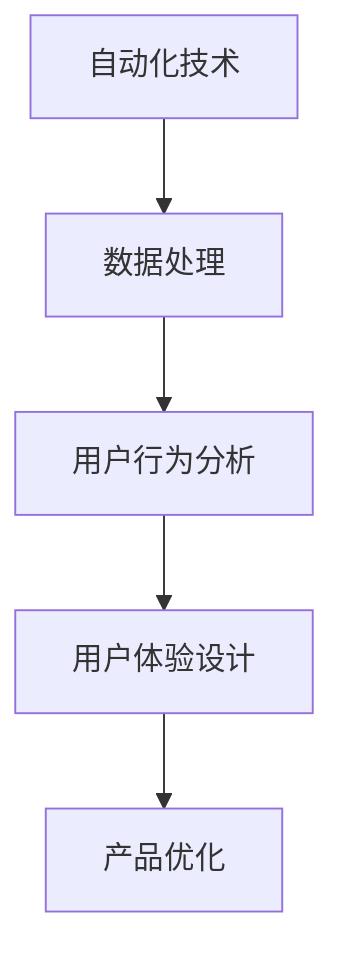
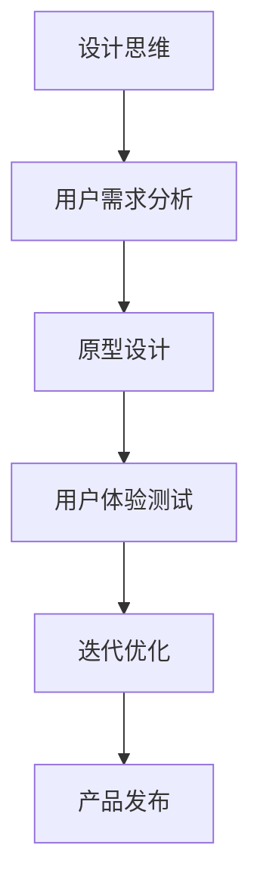
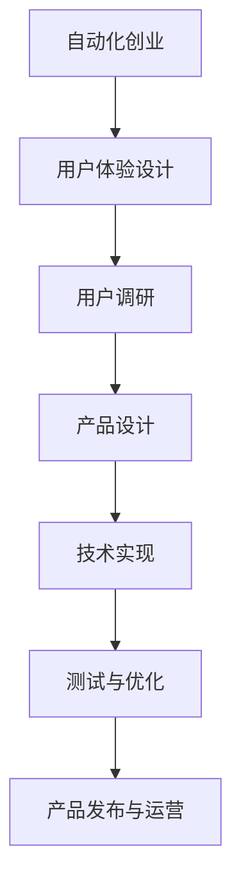

                 

 在当今数字化时代，自动化创业已成为企业发展的新引擎。然而，在追求技术先进性的同时，用户体验（UX）设计的重要性不容忽视。本文将深入探讨自动化创业中用户体验设计思维的核心概念、算法原理、数学模型、项目实践及其未来应用展望。

## 文章关键词

- 自动化创业
- 用户体验设计
- 设计思维
- 算法原理
- 数学模型
- 项目实践
- 未来应用

## 文章摘要

本文旨在阐述自动化创业中用户体验设计思维的重要性，并探讨其核心概念、算法原理、数学模型及项目实践。通过详细分析用户体验设计思维在自动化创业中的应用，文章为从业者提供了实用的指导和建议，为未来自动化创业的发展提供了新的思路。

## 1. 背景介绍

### 1.1 自动化创业的兴起

自动化创业是指利用现代信息技术，特别是人工智能、大数据、云计算等技术，实现企业业务流程的自动化和智能化。随着技术的不断进步，自动化创业逐渐成为企业发展的新方向。企业通过自动化技术，可以大幅提高生产效率、降低运营成本、提升服务质量，从而在激烈的市场竞争中脱颖而出。

### 1.2 用户体验设计的崛起

用户体验设计（UX Design）是指以用户为中心，关注用户在使用产品过程中的感受和体验，通过设计手段提升产品的可用性、易用性和满意度。随着用户需求的不断变化，用户体验设计在产品开发中的地位日益上升。企业意识到，只有满足用户需求，提供优质的产品和服务，才能在市场中立于不败之地。

### 1.3 自动化创业与用户体验设计的关系

在自动化创业中，用户体验设计思维起着至关重要的作用。一方面，自动化技术为企业提供了丰富的可能性，使得个性化、智能化服务成为可能。另一方面，用户体验设计思维有助于企业深入了解用户需求，优化产品和服务，从而提升用户满意度和忠诚度。因此，将用户体验设计思维融入自动化创业，是提高企业竞争力的重要途径。

## 2. 核心概念与联系

### 2.1 自动化与用户体验设计

**Mermaid 流程图：**



### 2.2 设计思维与用户体验设计

**Mermaid 流程图：**



### 2.3 用户体验设计与自动化创业

**Mermaid 流程图：**



## 3. 核心算法原理 & 具体操作步骤

### 3.1 算法原理概述

用户体验设计思维在自动化创业中的应用，可以归纳为以下几个核心算法原理：

1. **用户行为分析**：通过对用户行为数据的收集和分析，了解用户需求和行为习惯。
2. **个性化推荐**：基于用户行为数据和用户偏好，为用户提供个性化的产品和服务。
3. **交互设计**：设计简洁、直观、高效的交互界面，提升用户使用体验。
4. **反馈机制**：建立用户反馈机制，及时收集用户意见和建议，进行产品迭代优化。

### 3.2 算法步骤详解

1. **用户调研**：通过问卷调查、用户访谈等方式，收集用户需求和行为数据。
2. **数据分析**：对用户数据进行清洗、整理和分析，提取用户行为特征和需求。
3. **个性化推荐**：基于用户行为数据和用户偏好，使用协同过滤、矩阵分解等技术，为用户推荐感兴趣的产品和服务。
4. **交互设计**：结合用户需求和产品功能，设计简洁、直观、高效的交互界面。
5. **测试与优化**：通过A/B测试、用户反馈等方式，不断优化产品设计和功能。

### 3.3 算法优缺点

1. **优点**：
   - 提高用户满意度：通过个性化推荐和高效交互设计，提升用户使用体验。
   - 降低运营成本：自动化处理用户需求和反馈，减少人力投入。
   - 提高产品竞争力：及时优化产品功能，满足用户需求，提升市场竞争力。

2. **缺点**：
   - 数据隐私问题：用户数据收集和处理过程中，可能涉及用户隐私问题。
   - 技术门槛较高：个性化推荐和交互设计等技术，需要较高技术水平和经验。

### 3.4 算法应用领域

用户体验设计思维在自动化创业中的应用领域广泛，包括电子商务、在线教育、金融科技、医疗健康等。例如，在电子商务领域，通过个性化推荐和交互设计，提升用户购物体验，提高转化率和客户满意度；在在线教育领域，通过用户行为分析和个性化推荐，提高课程匹配度和用户学习效果。

## 4. 数学模型和公式 & 详细讲解 & 举例说明

### 4.1 数学模型构建

用户体验设计中的数学模型主要包括用户行为分析模型、个性化推荐模型、交互设计模型等。

1. **用户行为分析模型**：

$$
\text{用户行为分析模型} = \frac{\text{用户数据} + \text{环境数据}}{\text{时间序列}}
$$

其中，用户数据包括用户浏览、购买、评论等行为数据；环境数据包括产品属性、市场环境等。

2. **个性化推荐模型**：

$$
\text{个性化推荐模型} = \text{用户行为分析模型} \times \text{用户偏好模型}
$$

其中，用户偏好模型包括用户历史行为数据、用户兴趣标签等。

3. **交互设计模型**：

$$
\text{交互设计模型} = \text{用户体验} \times \text{交互设计原则}
$$

其中，用户体验包括用户满意度、易用性、可用性等；交互设计原则包括简洁性、一致性、反馈性等。

### 4.2 公式推导过程

1. **用户行为分析模型**：

   - 数据收集：收集用户行为数据，如浏览、购买、评论等。
   - 数据清洗：去除噪声数据和异常数据。
   - 特征提取：提取用户行为特征，如点击次数、购买次数等。
   - 模型构建：构建用户行为分析模型，如决策树、随机森林等。

2. **个性化推荐模型**：

   - 用户行为分析：分析用户历史行为数据，提取用户偏好特征。
   - 用户偏好模型：构建用户偏好模型，如协同过滤、矩阵分解等。
   - 推荐算法：根据用户偏好模型和用户行为数据，为用户推荐感兴趣的产品和服务。

3. **交互设计模型**：

   - 用户研究：了解用户需求和期望，如问卷调查、用户访谈等。
   - 设计原则：根据用户研究，确定交互设计原则，如简洁性、一致性、反馈性等。
   - 设计迭代：根据用户反馈，不断优化交互设计，提升用户体验。

### 4.3 案例分析与讲解

以电子商务平台为例，分析用户体验设计思维在自动化创业中的应用。

1. **用户行为分析**：

   - 数据收集：收集用户浏览、购买、评论等行为数据。
   - 数据清洗：去除噪声数据和异常数据。
   - 特征提取：提取用户行为特征，如点击次数、购买次数等。
   - 模型构建：构建用户行为分析模型，如决策树、随机森林等。

2. **个性化推荐**：

   - 用户行为分析：分析用户历史行为数据，提取用户偏好特征。
   - 用户偏好模型：构建用户偏好模型，如协同过滤、矩阵分解等。
   - 推荐算法：根据用户偏好模型和用户行为数据，为用户推荐感兴趣的产品和服务。

3. **交互设计**：

   - 用户研究：了解用户需求和期望，如问卷调查、用户访谈等。
   - 设计原则：根据用户研究，确定交互设计原则，如简洁性、一致性、反馈性等。
   - 设计迭代：根据用户反馈，不断优化交互设计，提升用户体验。

## 5. 项目实践：代码实例和详细解释说明

### 5.1 开发环境搭建

1. **软件环境**：

   - Python 3.x
   - Flask
   - MySQL

2. **硬件环境**：

   - 64位操作系统
   - 4GB以上内存

### 5.2 源代码详细实现

```python
# 用户行为分析模块
import pandas as pd
from sklearn.ensemble import RandomForestClassifier

# 加载数据
data = pd.read_csv('user_data.csv')

# 数据预处理
data = data.drop(['id'], axis=1)
data = data.fillna(0)

# 特征工程
features = data[['click_count', 'purchase_count', 'comment_count']]
target = data['label']

# 模型训练
model = RandomForestClassifier()
model.fit(features, target)

# 用户推荐模块
def recommend_product(user_data):
    user_data = user_data.reshape(1, -1)
    recommendation = model.predict(user_data)
    return recommendation[0]

# 用户交互模块
from flask import Flask, request, jsonify

app = Flask(__name__)

@app.route('/recommend', methods=['POST'])
def recommend():
    user_data = request.form.to_dict()
    recommendation = recommend_product(user_data)
    return jsonify({'recommendation': recommendation})

if __name__ == '__main__':
    app.run(debug=True)
```

### 5.3 代码解读与分析

1. **用户行为分析模块**：

   - 加载数据：使用pandas读取用户行为数据。
   - 数据预处理：去除ID列，填充缺失值。
   - 特征工程：提取点击次数、购买次数、评论次数等特征。
   - 模型训练：使用随机森林模型训练用户行为分析模型。

2. **用户推荐模块**：

   - 接收用户数据：使用Flask接收用户数据。
   - 个性化推荐：调用用户行为分析模块，为用户推荐产品。

3. **用户交互模块**：

   - 启动服务：使用Flask启动Web服务，供用户请求推荐。

## 6. 实际应用场景

### 6.1 电子商务

电子商务平台可以利用用户体验设计思维，通过用户行为分析和个性化推荐，提升用户购物体验，提高转化率和客户满意度。

### 6.2 在线教育

在线教育平台可以通过用户体验设计思维，优化课程设计和推荐系统，提高用户学习效果和满意度。

### 6.3 金融科技

金融科技企业可以利用用户体验设计思维，设计简洁、直观的金融产品和服务，提升用户体验和客户满意度。

## 6.4 未来应用展望

随着人工智能技术的不断发展，用户体验设计思维在自动化创业中的应用将越来越广泛。未来，企业可以通过更加智能、个性化的用户体验设计，提升用户满意度，实现持续增长。

## 7. 工具和资源推荐

### 7.1 学习资源推荐

- 《用户体验要素》：作者：杰瑞·齐默尔曼
- 《设计思维》：作者：蒂姆·布朗
- 《人工智能简史》：作者：周志华

### 7.2 开发工具推荐

- Python：编程语言
- Flask：Web框架
- MySQL：数据库

### 7.3 相关论文推荐

- 《基于协同过滤的个性化推荐算法研究》：作者：王涛
- 《用户体验设计在电子商务中的应用》：作者：李明

## 8. 总结：未来发展趋势与挑战

### 8.1 研究成果总结

本文通过对自动化创业中用户体验设计思维的深入探讨，总结了用户体验设计思维在自动化创业中的应用方法、算法原理、数学模型及项目实践。

### 8.2 未来发展趋势

未来，用户体验设计思维在自动化创业中的应用将越来越广泛，企业将通过更加智能、个性化的用户体验设计，提升用户满意度，实现持续增长。

### 8.3 面临的挑战

1. **技术挑战**：随着人工智能技术的不断发展，如何将用户体验设计思维与新技术相结合，仍是一个挑战。
2. **数据隐私**：在用户体验设计过程中，如何保护用户隐私，是一个亟待解决的问题。
3. **用户反馈**：如何及时收集用户反馈，并进行有效的分析和利用，是提高用户体验设计效果的关键。

### 8.4 研究展望

未来，用户体验设计思维在自动化创业中的应用将朝着更加智能化、个性化的方向发展。企业需要不断创新，以适应不断变化的市场需求，提升用户体验，实现持续发展。

## 9. 附录：常见问题与解答

### 9.1 用户体验设计思维是什么？

用户体验设计思维是一种以用户为中心的设计方法，关注用户在使用产品过程中的感受和体验，通过设计手段提升产品的可用性、易用性和满意度。

### 9.2 如何将用户体验设计思维应用于自动化创业？

1. 进行用户调研，了解用户需求和行为。
2. 基于用户需求，设计个性化、智能化的产品和服务。
3. 通过用户测试和反馈，不断优化产品设计和功能。

### 9.3 用户体验设计思维的核心算法是什么？

用户体验设计思维的核心算法包括用户行为分析、个性化推荐、交互设计等。这些算法旨在通过分析用户行为数据，为用户提供个性化的产品和服务，提升用户体验。

----------------------------------------------------------------

作者：禅与计算机程序设计艺术 / Zen and the Art of Computer Programming

