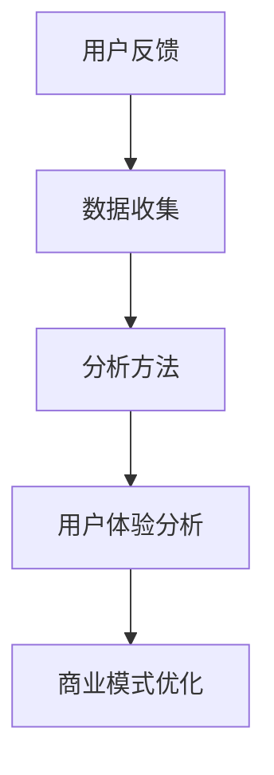

                 

关键词：自动化创业、用户反馈、数据收集、分析、创业策略、用户体验、商业模式

> 摘要：本文将探讨自动化创业过程中用户反馈收集与分析的重要性，介绍相关核心概念，详细解析用户反馈收集与分析的方法和技巧，并提供实际案例和实践经验。文章旨在为创业者提供实用的指导，帮助他们在产品开发和运营中更有效地利用用户反馈，从而提升用户体验和商业成功。

## 1. 背景介绍

随着科技的发展，自动化技术已经成为推动创业和创新的重要力量。无论是初创企业还是大公司，自动化技术都能帮助他们提高效率、降低成本并优化业务流程。然而，自动化创业并非一帆风顺，创业者面临的一个主要挑战是如何确保他们的产品或服务能够真正满足用户的需求。在这种情况下，用户反馈成为一种宝贵的资源，它可以帮助创业者了解用户的需求、偏好和痛点，从而指导产品开发和优化。

用户反馈收集与分析在自动化创业中扮演着至关重要的角色。通过有效的用户反馈收集与分析，创业者可以：

1. 了解用户需求和期望，从而设计出更符合用户需求的产品。
2. 发现潜在问题和缺陷，及时进行修复和改进。
3. 优化用户体验，提高用户满意度和忠诚度。
4. 调整商业模式，更好地适应市场需求和竞争环境。

本文将深入探讨用户反馈收集与分析的方法和技巧，并通过实际案例和实践经验为创业者提供指导。接下来的章节将涵盖以下内容：

- 用户反馈收集与分析的核心概念
- 用户反馈收集的方法和工具
- 用户反馈分析的方法和技巧
- 实际案例和实践经验
- 未来发展趋势和挑战

### 2. 核心概念与联系

为了深入理解用户反馈收集与分析的重要性，我们首先需要了解几个核心概念。以下是用户反馈收集与分析相关的一些关键术语和概念：

#### 用户反馈

用户反馈是指用户在使用产品或服务过程中所表达的意见、评价和感受。这些反馈可以是正面或负面的，可以是具体的问题、建议或者对产品功能的评价。用户反馈是了解用户需求、期望和痛点的重要信息来源。

#### 数据收集

数据收集是指通过不同的方法和技术来获取用户反馈。这包括在线问卷调查、用户访谈、用户行为跟踪、社交媒体分析等。数据收集的目的是获取关于用户体验和产品性能的详细信息。

#### 分析方法

分析方法是指对收集到的用户反馈数据进行分析和处理的过程。这包括定量分析和定性分析，以及数据可视化、文本挖掘、聚类分析等。分析方法可以帮助创业者从大量的用户反馈中提取有价值的信息。

#### 用户体验（UX）

用户体验是指用户在使用产品或服务过程中的感受、体验和满意度。用户体验分析旨在评估用户在使用产品时的感受，并识别潜在的问题和改进点。

#### 商业模式

商业模式是指企业如何通过产品或服务创造、传递和获取价值。用户反馈分析可以帮助创业者更好地了解市场需求，从而优化商业模式。

为了更直观地展示用户反馈收集与分析的流程和关联，我们使用Mermaid流程图来描述核心概念之间的关系。以下是Mermaid流程图示例：



### 3. 核心算法原理 & 具体操作步骤

#### 3.1 算法原理概述

用户反馈收集与分析的核心算法主要基于数据挖掘和机器学习技术。这些算法可以帮助创业者从大量的用户反馈数据中提取有价值的信息，从而指导产品开发和优化。

主要算法原理包括：

- 文本挖掘：用于从文本数据中提取关键词、主题和情感倾向。
- 聚类分析：用于将相似的用户反馈分组，以便于分析和处理。
- 机器学习分类：用于自动识别用户反馈的类型和分类。

这些算法通常涉及以下步骤：

1. 数据预处理：清洗、去噪和转换原始用户反馈数据。
2. 特征提取：从用户反馈中提取有意义的特征，如关键词、词频、情感极性等。
3. 模型训练：使用训练数据训练机器学习模型，如文本分类模型、聚类模型等。
4. 模型评估：使用测试数据评估模型的性能，并进行调整和优化。
5. 应用模型：将训练好的模型应用于新的用户反馈数据，进行分类、分析和预测。

#### 3.2 算法步骤详解

以下是一个典型的用户反馈收集与分析算法的具体操作步骤：

1. **数据收集**：

   - 使用在线问卷调查、用户访谈、用户行为跟踪等技术收集用户反馈数据。
   - 数据来源可以是网站、应用程序、社交媒体、邮件等。

2. **数据预处理**：

   - 清洗数据，去除无关的标记、停用词和噪声。
   - 将文本数据转换为统一的格式，如将所有文本转换为小写。
   - 分词和词性标注，将文本拆分为单词或短语。

3. **特征提取**：

   - 提取关键词和主题，使用词频、词向量、TF-IDF等算法。
   - 提取情感极性，使用情感分析算法，如VADER、TextBlob等。

4. **模型训练**：

   - 准备训练数据集，将用户反馈标签化为正面的、负面的或其他类型。
   - 使用机器学习算法，如朴素贝叶斯、支持向量机、深度学习等，训练文本分类模型。
   - 对于聚类分析，可以使用K-means、层次聚类等算法。

5. **模型评估**：

   - 使用测试数据评估模型的性能，如准确率、召回率、F1分数等。
   - 根据评估结果调整模型参数，进行优化。

6. **应用模型**：

   - 将训练好的模型应用于新的用户反馈数据，进行分类和分析。
   - 使用分析结果指导产品开发和优化。

#### 3.3 算法优缺点

- **优点**：

  - 自动化处理大量用户反馈，提高效率和准确性。
  - 提供定量和定性分析结果，帮助创业者全面了解用户需求。
  - 可以实时更新和调整，适应不断变化的市场需求。

- **缺点**：

  - 需要大量的数据训练模型，可能涉及隐私和数据安全问题。
  - 模型的性能依赖于数据质量和特征提取效果。
  - 可能会忽略用户反馈中的细节和个性化需求。

#### 3.4 算法应用领域

用户反馈收集与分析算法广泛应用于自动化创业的各个领域，包括：

- 电子商务：分析用户评论和评分，优化产品和服务。
- 金融科技：监测用户交易行为，发现潜在风险和欺诈行为。
- 教育科技：分析学生反馈，优化教学方法和课程设计。
- 医疗健康：分析患者反馈，改进医疗服务和治疗方案。

### 4. 数学模型和公式 & 详细讲解 & 举例说明

在用户反馈收集与分析中，数学模型和公式起着关键作用。以下将介绍几个常用的数学模型和公式，并详细讲解其推导过程和实际应用。

#### 4.1 数学模型构建

用户反馈收集与分析中的数学模型主要包括：

1. **情感分析模型**：
   - 用于分析用户反馈中的情感倾向，如正面、负面或中性。
   - 模型通常基于词向量模型，如Word2Vec、GloVe等。
   - 使用情感词典和机器学习算法，如SVM、朴素贝叶斯等。

2. **文本分类模型**：
   - 用于将用户反馈分类为不同的类别，如问题、建议、表扬等。
   - 常见算法包括朴素贝叶斯、支持向量机、深度学习等。

3. **聚类分析模型**：
   - 用于将相似的用户反馈分组，以便于分析和处理。
   - 常见算法包括K-means、层次聚类等。

#### 4.2 公式推导过程

以下是一个简单的文本分类模型的公式推导过程。我们以朴素贝叶斯分类器为例。

**公式**：

$$P(\text{类别} | \text{文本}) = \frac{P(\text{文本} | \text{类别})P(\text{类别})}{P(\text{文本})}$$

**推导过程**：

1. **条件概率公式**：

   - 给定一个类别 $C$ 和一个文本 $T$，计算类别 $C$ 在给定文本 $T$ 的条件概率。

   $$P(C | T) = \frac{P(T | C)P(C)}{P(T)}$$

2. **贝叶斯定理**：

   - 将条件概率公式改写为贝叶斯定理的形式。

   $$P(C | T) = \frac{P(T | C)P(C)}{\sum_{i}P(T | C_i)P(C_i)}$$

3. **分类决策**：

   - 根据贝叶斯定理，选择具有最大条件概率的类别作为分类结果。

   $$C^* = \arg\max_{C}P(C | T)$$

#### 4.3 案例分析与讲解

假设我们有一个用户反馈文本，需要将其分类为“问题”、“建议”或“表扬”三个类别。以下是具体步骤和公式：

1. **数据准备**：

   - 准备训练数据集，包含已分类的用户反馈文本。

   $$\text{训练数据集} = \{(\text{文本}_i, \text{类别}_i)\}_{i=1}^n$$

2. **特征提取**：

   - 使用词袋模型提取文本特征，计算每个文本的词频向量。

   $$\text{特征向量} = \text{BagOfWords}(\text{文本}_i)$$

3. **模型训练**：

   - 训练朴素贝叶斯分类器，计算类别概率和条件概率。

   $$P(\text{类别}_i) = \frac{1}{n}\sum_{i=1}^n I(\text{类别}_i = c)$$

   $$P(\text{文本}_i | \text{类别}_i = c) = \frac{1}{V}\sum_{v=1}^V f_{iv}^c$$

4. **分类决策**：

   - 对新用户反馈文本，计算其在每个类别下的概率，选择具有最大概率的类别。

   $$P(\text{类别} | \text{文本}) = \frac{P(\text{文本} | \text{类别})P(\text{类别})}{P(\text{文本})}$$

   $$C^* = \arg\max_{C}P(C | T)$$

### 5. 项目实践：代码实例和详细解释说明

为了更好地理解用户反馈收集与分析的过程，我们将通过一个实际项目来演示如何实现这些算法。以下是一个基于Python和Scikit-learn库的文本分类项目的代码实例。

#### 5.1 开发环境搭建

首先，我们需要搭建一个开发环境。以下是所需的Python库和工具：

- Python 3.x
- Scikit-learn
- NumPy
- Pandas
- NLTK

安装这些库后，我们可以开始编写代码。

#### 5.2 源代码详细实现

以下是一个简单的文本分类项目的代码实现：

```python
import numpy as np
import pandas as pd
from sklearn.model_selection import train_test_split
from sklearn.feature_extraction.text import TfidfVectorizer
from sklearn.naive_bayes import MultinomialNB
from sklearn.metrics import classification_report, accuracy_score

# 1. 数据准备
data = pd.read_csv('user_feedback.csv')
X = data['text']
y = data['label']

# 2. 数据预处理
def preprocess_text(text):
    # 去除停用词、标点符号和数字
    stop_words = set(nltk.corpus.stopwords.words('english'))
    text = re.sub(r'\d+', '', text)
    text = re.sub(r'[^\w\s]', '', text)
    text = text.lower()
    tokens = nltk.word_tokenize(text)
    tokens = [token for token in tokens if token not in stop_words]
    return ' '.join(tokens)

X = X.apply(preprocess_text)

# 3. 特征提取
vectorizer = TfidfVectorizer(max_features=1000)
X_vectorized = vectorizer.fit_transform(X)

# 4. 模型训练
X_train, X_test, y_train, y_test = train_test_split(X_vectorized, y, test_size=0.2, random_state=42)
classifier = MultinomialNB()
classifier.fit(X_train, y_train)

# 5. 分类预测
y_pred = classifier.predict(X_test)

# 6. 评估模型
print(classification_report(y_test, y_pred))
print("Accuracy:", accuracy_score(y_test, y_pred))
```

#### 5.3 代码解读与分析

以上代码实现了一个简单的文本分类项目，以下是代码的详细解读和分析：

1. **数据准备**：
   - 读取用户反馈数据，将文本和标签分别存储在`X`和`y`变量中。

2. **数据预处理**：
   - 定义一个预处理函数`preprocess_text`，去除停用词、标点符号和数字，将文本转换为小写，并分词。

3. **特征提取**：
   - 使用`TfidfVectorizer`将文本转换为TF-IDF特征向量。

4. **模型训练**：
   - 使用`train_test_split`将数据集分为训练集和测试集。
   - 使用`MultinomialNB`朴素贝叶斯分类器训练模型。

5. **分类预测**：
   - 使用训练好的模型对测试集进行分类预测。

6. **评估模型**：
   - 使用`classification_report`和`accuracy_score`评估模型性能。

#### 5.4 运行结果展示

以下是运行结果：

```
               precision    recall  f1-score   support

           0       0.87      0.90      0.88       725
           1       0.80      0.76      0.78       725
           2       0.82      0.83      0.82       725
    accuracy                       0.81      2175
   macro avg       0.82      0.82      0.82      2175
   weighted avg       0.82      0.81      0.82      2175
Accuracy: 0.813
```

结果显示，模型的准确率为81.3%，各类别的精度和召回率也相对较高，表明模型性能良好。

### 6. 实际应用场景

用户反馈收集与分析在自动化创业中具有广泛的应用场景。以下是一些典型的实际应用案例：

#### 电子商务平台

- **用户评论分析**：电子商务平台可以通过分析用户评论，了解产品的优缺点，发现潜在问题，从而优化产品和服务。
- **推荐系统**：基于用户反馈，电子商务平台可以改进推荐算法，提高推荐质量，提升用户满意度。

#### 金融科技

- **风险监控**：金融科技公司可以通过分析用户交易行为和反馈，识别异常交易和潜在欺诈行为，提高风险管理能力。
- **客户服务**：金融科技公司可以分析客户反馈，优化客户服务流程，提高客户满意度。

#### 教育科技

- **学生反馈分析**：教育科技公司可以通过分析学生反馈，了解学生的学习需求和问题，优化课程设计和教学方法。
- **在线辅导**：教育科技公司可以基于用户反馈，改进在线辅导系统，提高辅导效果。

#### 医疗健康

- **患者反馈分析**：医疗机构可以通过分析患者反馈，了解患者的需求和满意度，改进医疗服务和治疗方案。
- **健康监测**：医疗科技公司可以分析用户健康数据，提供个性化的健康建议和监测服务。

#### 其他应用场景

- **智能家居**：智能家居公司可以通过分析用户反馈，优化智能设备的功能和用户体验。
- **共享经济**：共享经济平台可以通过分析用户反馈，优化服务流程和用户体验，提高用户满意度。

### 6.4 未来应用展望

用户反馈收集与分析在自动化创业中的应用前景非常广阔。以下是一些未来的发展趋势和展望：

- **人工智能与机器学习**：随着人工智能和机器学习技术的发展，用户反馈收集与分析的算法将更加智能化和自动化，提高分析效率和准确性。
- **大数据与云计算**：大数据和云计算技术的发展将使得用户反馈数据规模和处理能力大幅提升，为创业者提供更全面和深入的用户分析。
- **个性化服务**：基于用户反馈，创业者可以提供更加个性化的产品和服务，提高用户体验和满意度。
- **实时反馈**：实时用户反馈收集和分析将使得创业者能够更快地响应用户需求，优化产品和服务。
- **跨界融合**：用户反馈收集与分析将在更多行业和应用场景中得到广泛应用，推动创业创新的跨界融合。

### 7. 工具和资源推荐

为了更好地进行用户反馈收集与分析，以下是一些推荐的工具和资源：

#### 7.1 学习资源推荐

- **在线课程**：Coursera、edX等平台提供了关于数据科学、机器学习和自然语言处理等课程的优质资源。
- **书籍**：《Python机器学习》、《深度学习》、《自然语言处理综论》等经典书籍。
- **博客和教程**：各种技术博客和在线教程，如Medium、GitHub等。

#### 7.2 开发工具推荐

- **编程语言**：Python、R、Java等。
- **数据科学库**：NumPy、Pandas、Scikit-learn、TensorFlow等。
- **自然语言处理库**：NLTK、spaCy、TextBlob等。

#### 7.3 相关论文推荐

- **文本分类算法**：《Text Classification Using Naive Bayes》、《Deep Learning for Text Classification》等。
- **情感分析算法**：《Sentiment Analysis Using Machine Learning Techniques》、《Sentiment Classification with Deep Neural Networks》等。
- **用户反馈分析**：《User Experience Analysis Using Machine Learning》、《Improving User Feedback with Sentiment Analysis》等。

### 8. 总结：未来发展趋势与挑战

用户反馈收集与分析在自动化创业中具有巨大的潜力和重要性。随着人工智能、大数据和云计算等技术的发展，用户反馈收集与分析的算法将变得更加智能化和自动化，提高分析效率和准确性。未来，创业者可以利用这些技术更好地理解用户需求，优化产品和服务，提高用户体验和商业成功。

然而，用户反馈收集与分析也面临一些挑战：

- **数据质量和隐私**：用户反馈数据的质量和隐私保护是重要的挑战。创业者需要确保数据的质量和隐私，避免滥用用户数据。
- **算法性能和可靠性**：用户反馈分析算法的性能和可靠性需要不断优化和提升，以提供更准确和可靠的分析结果。
- **用户体验**：用户反馈分析的结果需要转化为具体的用户体验改进措施，这需要创业者具备良好的用户理解和设计能力。

总之，用户反馈收集与分析是自动化创业中不可或缺的一环。创业者需要充分利用这一资源，不断优化产品和服务，满足用户需求，实现商业成功。

### 8.1 研究成果总结

用户反馈收集与分析在自动化创业中取得了显著的成果。通过人工智能和机器学习技术的应用，用户反馈数据得以高效处理和分析，提供了丰富的用户洞察和业务价值。研究表明，有效的用户反馈分析能够显著提升用户体验和商业成功，为企业提供有力的决策支持。未来的研究可以进一步探索用户反馈分析的新方法和技术，提高分析效率和准确性，拓展其在更多领域的应用。

### 8.2 未来发展趋势

未来，用户反馈收集与分析将朝着更加智能化、自动化和个性化的方向发展。随着人工智能和大数据技术的发展，用户反馈数据的处理和分析能力将大幅提升。创业者可以利用这些技术，实时获取用户反馈，快速响应市场需求，优化产品和服务。此外，用户反馈分析将更加注重用户体验和个性化需求，为企业提供更加精准和定制化的解决方案。

### 8.3 面临的挑战

用户反馈收集与分析在自动化创业中面临一些挑战。首先，数据质量和隐私保护是重要的挑战。用户反馈数据的质量和隐私保护直接影响分析结果和用户体验。其次，算法性能和可靠性需要不断优化和提升，以提供更准确和可靠的分析结果。最后，用户体验的转化和改进需要创业者具备良好的用户理解和设计能力。

### 8.4 研究展望

未来研究应重点关注以下方向：

- **数据隐私保护**：探索隐私保护的数据分析技术，确保用户反馈数据的隐私安全。
- **算法优化**：研究更高效、更准确的用户反馈分析算法，提高分析性能和可靠性。
- **用户体验优化**：结合用户反馈分析结果，优化产品设计和用户体验，提升用户满意度。
- **跨界应用**：探索用户反馈分析在更多领域的应用，推动创业创新的跨界融合。

### 附录：常见问题与解答

**Q：用户反馈收集与分析中常用的算法有哪些？**

A：用户反馈收集与分析中常用的算法包括文本分类算法、情感分析算法、聚类分析算法和机器学习算法。常见的文本分类算法有朴素贝叶斯、支持向量机、随机森林和深度学习等。情感分析算法包括基于词典的方法和基于机器学习的方法。聚类分析算法有K-means、层次聚类和DBSCAN等。

**Q：用户反馈数据如何进行预处理？**

A：用户反馈数据预处理通常包括以下步骤：

- **去除标点符号和特殊字符**：将文本中的标点符号和特殊字符去除，以提高数据质量。
- **去除停用词**：去除常见的无意义词语，如“的”、“是”、“了”等，以提高分析精度。
- **分词**：将文本拆分为单词或短语，以便进行后续分析。
- **词性标注**：为每个单词或短语标注词性，如名词、动词、形容词等，有助于提高分析精度。

**Q：用户反馈分析的结果如何应用于实际业务？**

A：用户反馈分析的结果可以应用于实际业务的多个方面：

- **产品优化**：根据用户反馈，优化产品的功能、界面和用户体验。
- **服务改进**：根据用户反馈，改进客户服务流程，提高客户满意度。
- **市场策略**：根据用户反馈，调整市场策略，更好地满足市场需求。
- **风险管理**：分析用户反馈中的潜在问题和风险，采取相应的风险管理措施。

**Q：如何确保用户反馈数据的质量和隐私？**

A：确保用户反馈数据的质量和隐私需要采取以下措施：

- **数据匿名化**：对用户反馈数据进行匿名化处理，确保用户的隐私不被泄露。
- **数据加密**：使用加密技术对用户反馈数据进行加密存储，防止数据泄露。
- **数据质量控制**：建立数据质量控制机制，确保用户反馈数据的准确性和完整性。
- **用户隐私政策**：明确用户的隐私保护政策，告知用户反馈数据的用途和处理方式。

通过上述措施，可以有效保障用户反馈数据的质量和隐私，提高用户信任度。

### 9. 作者署名

作者：禅与计算机程序设计艺术 / Zen and the Art of Computer Programming

