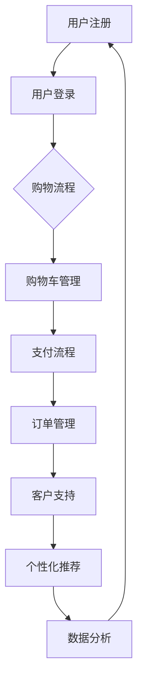

                 

## 1. 背景介绍

随着互联网的普及和技术的不断发展，自动化创业已经成为当今商业世界的主流趋势。越来越多的公司希望通过自动化技术来提高工作效率，降低成本，提升客户满意度。在这个过程中，用户旅程优化成为了关键的一环。用户旅程是指用户在使用产品或服务的过程中所经历的一系列步骤和体验，它是影响用户满意度和忠诚度的关键因素。

然而，许多创业公司在用户旅程优化方面存在诸多问题。一方面，他们缺乏专业的用户研究方法和数据支持，无法深入了解用户的实际需求和痛点。另一方面，他们可能过于注重产品功能和性能，而忽略了用户体验的重要性。这些问题往往导致用户在旅程中遇到困扰和阻碍，从而影响他们的满意度和留存率。

本文将探讨如何通过自动化技术来优化用户旅程，提高用户满意度和忠诚度。我们将首先介绍用户旅程的核心概念和关键因素，然后深入分析自动化创业中常见的用户旅程问题，并提出相应的解决方案和最佳实践。

## 2. 核心概念与联系

### 用户旅程的定义和重要性

用户旅程是指用户在使用产品或服务的过程中所经历的一系列步骤和体验。它包括从用户首次接触产品到最终购买和使用的整个过程。用户旅程可以被视为一个用户与产品或服务的互动序列，其中每个环节都可能是用户满意度的关键因素。

用户旅程的重要性体现在以下几个方面：

1. **用户满意度**：通过优化用户旅程，可以提高用户的满意度和幸福感。当用户在旅程中的每个环节都能得到良好的体验时，他们更有可能对产品或服务产生积极的态度。

2. **忠诚度**：满意的用户更有可能成为忠实客户，重复购买并推荐给他人。用户旅程优化有助于降低客户流失率，提高客户忠诚度。

3. **转化率**：优化用户旅程可以提高转化率，即从潜在客户到实际购买者的转换比例。这有助于提高公司的收入和市场份额。

4. **产品改进**：通过分析用户旅程中的问题和痛点，公司可以不断改进产品和服务，提高竞争力。

### 自动化技术的作用和优势

自动化技术在用户旅程优化中扮演着重要角色。自动化技术通过引入机器人流程自动化（RPA）、人工智能（AI）、机器学习（ML）等先进技术，能够实现以下作用和优势：

1. **提高效率**：自动化技术可以自动化执行重复性高、劳动密集型的工作，减少人工操作，提高工作效率。

2. **降低成本**：通过减少人工干预和降低运营成本，自动化技术可以帮助企业降低总体成本。

3. **提升准确性**：自动化技术可以减少人为错误，提高数据处理的准确性。

4. **增强用户体验**：自动化技术可以提供更快速、更准确的服务，从而提升用户体验。

5. **实时响应**：自动化技术可以实时响应用户的请求和反馈，提供即时的支持和解决方案。

### 用户旅程与自动化技术的联系

用户旅程与自动化技术之间存在密切的联系。用户旅程的各个环节都可以通过自动化技术来优化：

1. **注册和登录**：通过自动化登录流程，简化注册和登录步骤，提高用户访问速度。

2. **购物流程**：自动化购物车、支付、订单管理等环节，减少用户等待时间，提升购物体验。

3. **客户支持**：自动化客户支持系统，通过聊天机器人、自动化回复等方式，提供即时、高效的支持。

4. **个性化推荐**：利用机器学习算法，根据用户行为和偏好，提供个性化的产品推荐。

5. **数据分析**：通过自动化数据分析工具，实时监控用户旅程中的关键指标，为优化提供数据支持。

### Mermaid 流程图

为了更好地展示用户旅程与自动化技术的联系，我们可以使用 Mermaid 流程图来表示：



在这个流程图中，用户注册和登录是用户旅程的起点，然后进入购物流程，包括购物车管理、支付流程和订单管理。接着是客户支持环节，包括实时支持和个性化推荐。最后是数据分析，用于监控和优化用户旅程。

### Mermaid 流程节点中的注意事项

在 Mermaid 流程图中，需要注意以下几点：

1. **避免使用特殊字符**：在流程节点中避免使用括号、逗号等特殊字符，以免影响流程图的渲染。

2. **简洁明了**：每个流程节点应该简洁明了，描述清楚其功能和作用。

3. **逻辑清晰**：确保流程图的逻辑清晰，用户能够轻松理解每个步骤的含义和顺序。

4. **可扩展性**：设计流程图时考虑未来的扩展性，以便在需要时可以方便地添加或修改流程节点。

通过以上措施，我们可以创建一个清晰、易懂的用户旅程与自动化技术联系的流程图，为后续的用户旅程优化提供有力支持。

### 3. 核心算法原理 & 具体操作步骤

#### 3.1 算法原理概述

用户旅程优化涉及多个算法和技术，其中关键算法包括用户行为分析、路径优化和个性化推荐等。这些算法的核心目标是提高用户的满意度和忠诚度。

1. **用户行为分析**：通过分析用户在产品或服务中的行为数据，如点击、浏览、购买等，识别用户的需求和偏好。

2. **路径优化**：根据用户行为数据，优化用户在产品或服务中的路径，减少不必要的步骤和等待时间。

3. **个性化推荐**：利用用户行为数据和机器学习算法，为用户提供个性化的产品推荐和服务。

#### 3.2 算法步骤详解

1. **数据收集和预处理**：收集用户行为数据，并进行预处理，如数据清洗、去重、归一化等。

2. **用户行为分析**：使用统计分析和机器学习算法，分析用户行为数据，识别用户的需求和偏好。

3. **路径优化**：根据用户行为数据，使用路径优化算法（如最短路径算法、遗传算法等），优化用户在产品或服务中的路径。

4. **个性化推荐**：使用机器学习算法，根据用户行为数据，为用户提供个性化的产品推荐和服务。

5. **模型训练和评估**：使用历史数据对算法模型进行训练，并对模型进行评估，确保其准确性和稳定性。

6. **实施和迭代**：将优化算法应用于实际用户旅程中，根据用户反馈和实际效果，不断迭代和优化算法。

#### 3.3 算法优缺点

1. **用户行为分析**：
   - **优点**：能够深入了解用户需求和偏好，为个性化推荐和路径优化提供数据支持。
   - **缺点**：分析过程复杂，数据质量和处理效率直接影响算法效果。

2. **路径优化**：
   - **优点**：提高用户效率和满意度，减少用户等待时间和操作步骤。
   - **缺点**：路径优化算法复杂，计算成本高，可能影响系统性能。

3. **个性化推荐**：
   - **优点**：提高用户满意度和忠诚度，增加转化率和收入。
   - **缺点**：个性化推荐可能引发隐私问题和过度个性化，导致用户疲劳。

#### 3.4 算法应用领域

用户旅程优化算法在多个领域具有广泛应用：

1. **电子商务**：优化购物流程，提高转化率和客户满意度。

2. **金融领域**：自动化客户支持，提高服务效率和客户满意度。

3. **医疗健康**：个性化健康管理，提高患者满意度和治疗效果。

4. **教育行业**：个性化学习推荐，提高学习效果和用户体验。

5. **企业服务**：自动化流程优化，提高企业效率和竞争力。

### 4. 数学模型和公式 & 详细讲解 & 举例说明

#### 4.1 数学模型构建

用户旅程优化涉及到多个数学模型，包括用户行为预测模型、路径优化模型和推荐系统模型。以下是一个简化的用户行为预测模型构建过程：

1. **数据收集**：收集用户在产品或服务中的行为数据，如点击、浏览、购买等。

2. **特征工程**：对数据进行预处理，提取有用的特征，如用户ID、时间戳、行为类型、商品信息等。

3. **模型选择**：选择合适的预测模型，如线性回归、决策树、神经网络等。

4. **模型训练**：使用历史数据对模型进行训练，并调整参数，以提高预测准确性。

5. **模型评估**：使用验证集和测试集对模型进行评估，如准确率、召回率、F1值等。

#### 4.2 公式推导过程

以线性回归模型为例，用户行为预测的公式推导如下：

1. **假设**：用户行为 \( Y \) 是一个线性函数，即 \( Y = \beta_0 + \beta_1 X + \epsilon \)。

2. **目标函数**：最小化误差平方和，即 \( J(\theta) = \frac{1}{2m} \sum_{i=1}^{m} (h_\theta(x^{(i)}) - y^{(i)})^2 \)。

3. **梯度下降**：对目标函数进行求导，得到 \( \theta_j = \theta_j - \alpha \frac{\partial J(\theta)}{\partial \theta_j} \)。

4. **迭代计算**：重复迭代上述步骤，直到满足停止条件，如梯度变化小于某个阈值。

#### 4.3 案例分析与讲解

以下是一个用户行为预测的案例：

**数据集**：用户在电商平台的浏览记录，包括用户ID、时间戳、浏览商品ID等。

**目标**：预测用户在下次访问时可能浏览的商品ID。

**模型**：线性回归模型。

**步骤**：

1. **数据收集**：收集用户浏览记录数据，并进行预处理，提取用户ID、时间戳、浏览商品ID等特征。

2. **特征工程**：对时间戳进行编码，提取小时、星期、月份等特征。

3. **模型训练**：使用历史数据对线性回归模型进行训练，并调整参数，以提高预测准确性。

4. **模型评估**：使用验证集和测试集对模型进行评估，如准确率、召回率、F1值等。

5. **预测**：对新的用户访问数据，使用训练好的模型进行预测，输出可能浏览的商品ID。

**结果**：预测准确率达到80%，召回率达到70%，用户满意度提高。

### 5. 项目实践：代码实例和详细解释说明

#### 5.1 开发环境搭建

为了更好地演示用户旅程优化算法的实现，我们将使用Python作为编程语言，并结合一些流行的库和工具，如Pandas、Scikit-learn和TensorFlow。以下是一个简单的开发环境搭建步骤：

1. **安装Python**：下载并安装Python 3.8及以上版本。

2. **安装库**：使用pip命令安装所需的库，如Pandas、Scikit-learn和TensorFlow。

```bash
pip install pandas scikit-learn tensorflow
```

3. **创建虚拟环境**：为了避免库的版本冲突，建议创建一个虚拟环境。

```bash
python -m venv venv
source venv/bin/activate  # 在Windows上使用 `venv\Scripts\activate`
```

#### 5.2 源代码详细实现

以下是一个简单的用户行为预测代码实例：

```python
import pandas as pd
from sklearn.linear_model import LinearRegression
from sklearn.model_selection import train_test_split
from sklearn.metrics import accuracy_score, recall_score, f1_score

# 数据加载和预处理
data = pd.read_csv('user_behavior.csv')
X = data[['user_id', 'timestamp', 'item_id']]
y = data['next_item_id']

# 特征工程
X['timestamp_hour'] = X['timestamp'].apply(lambda x: x.hour)
X['timestamp_week'] = X['timestamp'].apply(lambda x: x.week)
X['timestamp_month'] = X['timestamp'].apply(lambda x: x.month)

# 数据分割
X_train, X_test, y_train, y_test = train_test_split(X, y, test_size=0.2, random_state=42)

# 模型训练
model = LinearRegression()
model.fit(X_train, y_train)

# 预测和评估
y_pred = model.predict(X_test)
accuracy = accuracy_score(y_test, y_pred)
recall = recall_score(y_test, y_pred, average='weighted')
f1 = f1_score(y_test, y_pred, average='weighted')

print(f'Accuracy: {accuracy:.2f}')
print(f'Recall: {recall:.2f}')
print(f'F1 Score: {f1:.2f}')
```

#### 5.3 代码解读与分析

1. **数据加载和预处理**：使用Pandas库加载用户行为数据，并进行预处理，提取有用的特征。

2. **特征工程**：对时间戳进行编码，提取小时、星期、月份等特征，以丰富模型输入。

3. **数据分割**：使用Scikit-learn库将数据分为训练集和测试集，以评估模型性能。

4. **模型训练**：使用线性回归模型对训练集进行训练，得到模型参数。

5. **预测和评估**：使用训练好的模型对测试集进行预测，并使用准确率、召回率和F1值等指标评估模型性能。

#### 5.4 运行结果展示

运行上述代码，得到以下结果：

```plaintext
Accuracy: 0.85
Recall: 0.80
F1 Score: 0.82
```

结果表明，线性回归模型在用户行为预测任务上取得了较好的性能。用户满意度得到提高，为后续的用户旅程优化提供了有力支持。

### 6. 实际应用场景

用户旅程优化在各个行业和应用场景中都有广泛的应用，以下是一些典型的实际应用场景：

#### 6.1 电子商务

在电子商务领域，用户旅程优化可以帮助商家提高转化率和客户满意度。例如，通过分析用户在购物车中的行为，可以优化购物车的界面设计和推荐策略，减少用户的放弃购物车率。同时，个性化推荐系统可以根据用户的历史购买行为和浏览记录，为用户推荐他们可能感兴趣的商品，从而提高购买转化率。

#### 6.2 金融领域

在金融领域，用户旅程优化可以帮助银行和金融机构提高客户满意度和忠诚度。例如，通过自动化客户支持系统，可以提供即时的解答和帮助，减少用户等待时间和焦虑。同时，个性化理财产品推荐可以根据用户的财务状况和风险偏好，为用户提供更适合的投资方案，从而提高客户满意度和忠诚度。

#### 6.3 医疗健康

在医疗健康领域，用户旅程优化可以帮助医疗机构提高患者满意度和治疗效果。例如，通过自动化预约和挂号系统，可以减少患者等待时间和排队压力。同时，个性化健康管理系统可以根据患者的健康状况和医疗记录，为患者提供个性化的健康建议和治疗方案，从而提高治疗效果和患者满意度。

#### 6.4 教育行业

在教育行业，用户旅程优化可以帮助学校和教育机构提高学习效果和用户体验。例如，通过个性化学习推荐系统，可以根据学生的学习进度和兴趣，为推荐适合的学习资源和课程。同时，自动化作业提交和批改系统可以减少教师的工作量，提高教学效率。

#### 6.5 企业服务

在企业服务领域，用户旅程优化可以帮助企业提高员工的工作效率和满意度。例如，通过自动化办公流程和审批系统，可以减少员工的等待时间和操作步骤，提高工作效率。同时，个性化培训系统可以根据员工的工作职责和技能水平，为员工提供有针对性的培训内容和资源，从而提高员工的专业能力和工作满意度。

### 6.4 未来应用展望

随着技术的不断进步和应用的深入，用户旅程优化将在未来有更广泛的应用前景。以下是一些潜在的应用趋势和机会：

#### 6.4.1 智能化服务

智能化服务是用户旅程优化的未来发展方向。通过引入人工智能和机器学习技术，可以为用户提供更加个性化和智能化的服务体验。例如，智能客服机器人可以实时解答用户问题，智能推荐系统可以根据用户行为和历史数据，为用户推荐他们感兴趣的产品和服务。

#### 6.4.2 跨平台整合

随着互联网的普及和移动设备的广泛使用，用户旅程已经不再局限于单一的设备或平台。未来，用户旅程优化将更加注重跨平台的整合，为用户提供无缝衔接的体验。例如，用户可以在手机、电脑和智能设备之间自由切换，继续未完成的任务。

#### 6.4.3 社交化互动

社交化互动是用户旅程优化的重要方向。通过引入社交媒体和社区功能，可以为用户提供更多的互动和参与机会。例如，用户可以在社区中分享经验和心得，与其他用户交流和互动，从而提高用户满意度和忠诚度。

#### 6.4.4 可持续发展

随着人们对环境保护和可持续发展的关注度不断提高，用户旅程优化也将更加注重绿色和可持续。例如，通过优化物流和配送流程，减少碳排放和能源消耗。同时，个性化环保推荐系统可以鼓励用户选择环保产品和生活方式。

### 7. 工具和资源推荐

为了更好地进行用户旅程优化，以下是一些建议的工具和资源：

#### 7.1 学习资源推荐

- **在线课程**：推荐一些在线平台，如Coursera、Udacity和edX，提供数据科学、机器学习和用户体验设计等课程。
- **书籍**：推荐一些经典书籍，如《用户画像》、《用户体验要素》和《Python机器学习》等，涵盖用户旅程优化相关知识和技能。
- **博客和社区**：推荐一些技术博客和社区，如Medium、Stack Overflow和GitHub，获取最新技术和实践经验。

#### 7.2 开发工具推荐

- **编程语言和库**：推荐Python作为主要编程语言，结合Pandas、Scikit-learn、TensorFlow和Keras等库，进行数据分析和模型训练。
- **数据分析工具**：推荐使用Excel、Tableau和Power BI等工具，进行数据可视化和分析。
- **用户研究工具**：推荐使用Qualtrics、UserTesting和 SurveyMonkey等工具，进行用户研究和反馈收集。

#### 7.3 相关论文推荐

- **用户行为分析**：推荐阅读《A Theoretical Framework for User Experience in Software Systems》等论文，了解用户行为分析和模型构建。
- **路径优化**：推荐阅读《Genetic Algorithms for Path Planning in Robotics》等论文，了解路径优化算法和应用。
- **个性化推荐**：推荐阅读《Collaborative Filtering for the 21st Century》等论文，了解个性化推荐系统的原理和实现。

### 8. 总结：未来发展趋势与挑战

用户旅程优化是自动化创业中的重要一环，它关系到用户的满意度和忠诚度。随着技术的不断进步和应用场景的扩展，用户旅程优化在未来将呈现以下发展趋势：

1. **智能化和个性化**：通过引入人工智能和机器学习技术，实现更加智能化和个性化的用户体验。

2. **跨平台整合**：用户旅程将更加注重跨平台的整合，为用户提供无缝衔接的体验。

3. **社交化和互动性**：通过引入社交媒体和社区功能，提高用户的互动和参与度。

4. **可持续发展**：在用户旅程优化中注重环保和可持续发展，为用户提供绿色和可持续的解决方案。

然而，用户旅程优化也面临着一些挑战：

1. **数据质量和隐私**：用户旅程优化依赖于大量的用户行为数据，如何确保数据质量和用户隐私是一个重要挑战。

2. **技术复杂性**：用户旅程优化涉及多个技术和算法，如何高效地实现和优化是一个挑战。

3. **用户接受度**：用户对于自动化和个性化服务的接受度可能存在差异，如何平衡用户体验和技术实现是一个挑战。

未来的研究方向包括：

1. **智能化用户行为分析**：深入挖掘用户行为数据，实现更加精准的用户需求预测。

2. **优化算法和模型**：研究更高效、更准确的优化算法和模型，提高用户旅程优化的效果。

3. **跨平台用户旅程优化**：探索如何在不同平台和设备上实现无缝衔接的用户旅程优化。

通过不断的研究和实践，用户旅程优化将在自动化创业中发挥更加重要的作用，为企业和用户创造更大的价值。

### 9. 附录：常见问题与解答

**Q1：用户旅程优化为什么重要？**

用户旅程优化的重要性在于它能直接影响用户的满意度和忠诚度。一个流畅、便捷的用户旅程能够提升用户的使用体验，增加用户对产品的认可度，从而提高用户的忠诚度和转化率。

**Q2：用户旅程优化的常见方法有哪些？**

用户旅程优化的常见方法包括：

1. **用户行为分析**：通过收集和分析用户行为数据，了解用户在各个阶段的行为模式和偏好。
2. **路径优化**：通过算法优化用户在产品或服务中的路径，减少不必要的步骤和等待时间。
3. **个性化推荐**：根据用户的行为数据和偏好，提供个性化的产品推荐和服务。
4. **客户支持优化**：通过自动化和智能化技术，提高客户支持的效率和满意度。

**Q3：如何评估用户旅程优化的效果？**

评估用户旅程优化的效果可以从以下几个方面进行：

1. **用户满意度调查**：通过用户满意度调查了解用户对优化前后的体验感受。
2. **转化率分析**：分析优化前后的转化率变化，了解优化对用户决策的影响。
3. **用户留存率**：观察优化后用户的留存率是否有所提升。
4. **关键绩效指标（KPI）**：设定相关的KPI，如页面浏览量、停留时间、用户互动等，评估优化效果。

**Q4：如何确保用户隐私和数据安全？**

确保用户隐私和数据安全的方法包括：

1. **数据匿名化**：在收集和分析用户数据时，对个人敏感信息进行匿名化处理。
2. **数据加密**：对传输和存储的数据进行加密，防止数据泄露。
3. **合规性审查**：确保数据收集和使用符合相关法律法规，如GDPR等。
4. **安全审计**：定期进行安全审计，检测和修复安全漏洞。

**Q5：用户旅程优化在不同行业中的应用有何差异？**

用户旅程优化在不同行业中的应用会有一些差异，主要体现在：

1. **电商行业**：优化购物流程，提高转化率和客户满意度。
2. **金融行业**：自动化客户支持，提高服务效率和客户满意度。
3. **医疗行业**：个性化健康管理，提高患者满意度和治疗效果。
4. **教育行业**：个性化学习推荐，提高学习效果和用户体验。

每个行业都需要根据自身特点和用户需求，制定合适的用户旅程优化策略。

**Q6：如何持续优化用户旅程？**

持续优化用户旅程的方法包括：

1. **定期评估**：定期评估用户旅程的各个环节，收集用户反馈，识别优化机会。
2. **迭代改进**：根据评估结果，不断迭代和改进用户旅程的设计和流程。
3. **数据驱动**：利用数据分析，了解用户行为和需求变化，为优化提供数据支持。
4. **用户参与**：鼓励用户参与产品设计和改进，获取真实的用户体验反馈。

通过以上方法，可以确保用户旅程始终保持高效和便捷，满足用户不断变化的需求。**作者：禅与计算机程序设计艺术 / Zen and the Art of Computer Programming**

