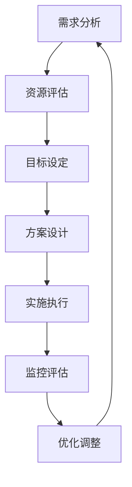

                 

关键词：自动化创业、资源整合、优化、技术、商业模式、项目管理

> 摘要：本文探讨了自动化创业中资源整合与优化的重要性，通过分析资源整合的概念、流程和策略，结合实际案例分析，总结了资源整合与优化在自动化创业中的应用，旨在为创业者提供有效的资源和优化方案，助力企业在快速变化的市场环境中取得成功。

## 1. 背景介绍

在当今快速发展的科技时代，自动化技术在各个行业中的应用越来越广泛，成为推动经济增长和社会进步的重要力量。随着大数据、云计算、物联网、人工智能等技术的不断发展，自动化创业成为众多创业者追求的热点领域。然而，自动化创业过程中面临着资源有限的挑战，如何有效地整合和优化资源，成为创业成功的关键。

资源整合是指在特定目标和条件下，通过对各种资源进行合理配置和优化，实现资源的最优利用和效益最大化。资源包括资金、人力、技术、信息、供应链等各个方面。资源整合不仅是提高企业竞争力的重要手段，也是实现自动化创业目标的关键环节。

本文将从以下几个方面展开讨论：首先，介绍资源整合的基本概念和流程；其次，分析资源整合的策略和技巧；然后，通过实际案例探讨资源整合在自动化创业中的应用；最后，总结资源整合与优化在自动化创业中的重要性，并提出未来发展的趋势和挑战。

## 2. 核心概念与联系

### 2.1 资源整合的概念

资源整合是指将分散的资源进行有机结合和优化配置，使其在共同目标和协同作用下发挥最大效益的过程。资源整合不仅包括物质资源的整合，如资金、设备、原材料等，还包括信息资源、人力资源、技术资源等的整合。

资源整合的目标是提高资源利用效率，降低运营成本，增强企业核心竞争力。通过资源整合，企业可以实现资源的优化配置，发挥资源的协同效应，提高整体效益。

### 2.2 资源整合的流程

资源整合是一个复杂的过程，通常包括以下几个环节：

1. **需求分析**：明确资源整合的目标和需求，包括资金需求、人力资源需求、技术需求等。

2. **资源评估**：对现有资源进行评估，了解资源的类型、数量、质量和可用性。

3. **目标设定**：根据需求分析结果，设定资源整合的目标和预期效益。

4. **方案设计**：制定资源整合的具体方案，包括资源获取、配置、管理等方面的措施。

5. **实施执行**：按照方案设计，实施资源整合的各项措施，确保资源整合目标的实现。

6. **监控评估**：对资源整合的实施过程进行监控和评估，及时调整方案，确保资源整合的顺利进行。

### 2.3 资源整合与优化的关系

资源整合与优化密切相关。资源整合是优化资源利用的前提和基础，而优化是资源整合的目标和结果。通过资源整合，可以更好地实现资源的优化配置和利用，提高企业的核心竞争力。

资源整合与优化的关系可以用以下流程图表示：



### 2.4 资源整合的架构

资源整合的架构通常包括以下几个方面：

1. **组织架构**：建立专门的资源整合部门或团队，负责资源整合的各项工作。

2. **信息架构**：建立完善的信息系统，实现资源信息的实时共享和动态更新。

3. **技术架构**：引入先进的技术手段，如大数据分析、云计算等，提高资源整合的效率和精度。

4. **管理体系**：建立科学的资源管理制度，明确资源整合的责任和权限，规范资源整合的操作流程。

5. **协作机制**：建立跨部门、跨区域的协作机制，实现资源整合的协同效应。

### 2.5 资源整合的原理

资源整合的原理主要包括以下几个方面：

1. **系统原理**：将资源看作一个整体，通过系统化的思维和方法，实现资源的优化配置和利用。

2. **协同原理**：通过协同作用，发挥资源的整体效益，实现资源的最大化利用。

3. **动态原理**：资源整合是一个动态过程，需要根据实际情况不断调整和优化。

4. **创新原理**：通过创新思维和方法，挖掘资源的潜在价值，实现资源的增值。

### 2.6 资源整合的流程图

资源整合的流程图可以用以下 Mermaid 流程图表示：


## 3. 核心算法原理 & 具体操作步骤

### 3.1 算法原理概述

资源整合与优化的核心算法是基于线性规划理论，通过建立数学模型，对资源进行优化配置。线性规划的目标是使目标函数最大化或最小化，同时满足一系列线性约束条件。

资源整合与优化的算法原理主要包括以下几个步骤：

1. **目标函数的建立**：根据资源整合的目标，建立目标函数，如最大化利润、最小化成本等。

2. **约束条件的设定**：根据资源的特点和限制，设定约束条件，如资源容量、人力限制、时间限制等。

3. **模型的建立**：将目标函数和约束条件整合到一个数学模型中，形成一个线性规划模型。

4. **求解算法的选择**：选择合适的求解算法，如单纯形法、 interior-point method 等，求解线性规划模型。

5. **结果分析**：对求解结果进行分析，评估资源整合与优化的效果。

### 3.2 算法步骤详解

1. **需求分析**：明确资源整合的目标和需求，包括资金需求、人力资源需求、技术需求等。

2. **资源评估**：对现有资源进行评估，了解资源的类型、数量、质量和可用性。

3. **目标函数的建立**：根据资源整合的目标，建立目标函数，如最大化利润、最小化成本等。

   $$\text{目标函数}：\max Z = c_1x_1 + c_2x_2 + ... + c_nx_n$$

   其中，$x_1, x_2, ..., x_n$ 表示资源的变量，$c_1, c_2, ..., c_n$ 表示资源的权重。

4. **约束条件的设定**：根据资源的特点和限制，设定约束条件，如资源容量、人力限制、时间限制等。

   $$\text{约束条件}：\begin{cases} a_{11}x_1 + a_{12}x_2 + ... + a_{1n}x_n \leq b_1 \\ a_{21}x_1 + a_{22}x_2 + ... + a_{2n}x_n \leq b_2 \\ ... \\ a_{m1}x_1 + a_{m2}x_2 + ... + a_{mn}x_n \leq b_m \\ x_1, x_2, ..., x_n \geq 0 \end{cases}$$

   其中，$a_{ij}$ 表示资源 $x_i$ 对约束 $j$ 的贡献，$b_j$ 表示约束 $j$ 的上限，$x_1, x_2, ..., x_n$ 表示资源的变量。

5. **模型的建立**：将目标函数和约束条件整合到一个数学模型中，形成一个线性规划模型。

   $$\text{线性规划模型}：\max Z = c_1x_1 + c_2x_2 + ... + c_nx_n$$

   $$\text{约束条件}：\begin{cases} a_{11}x_1 + a_{12}x_2 + ... + a_{1n}x_n \leq b_1 \\ a_{21}x_1 + a_{22}x_2 + ... + a_{2n}x_n \leq b_2 \\ ... \\ a_{m1}x_1 + a_{m2}x_2 + ... + a_{mn}x_n \leq b_m \\ x_1, x_2, ..., x_n \geq 0 \end{cases}$$

6. **求解算法的选择**：选择合适的求解算法，如单纯形法、 interior-point method 等，求解线性规划模型。

   - 单纯形法（Simplex Method）：是一种迭代求解线性规划问题的算法，通过逐步改进解，找到最优解。
   - Interior-point method（内点法）：是一种更高效的求解线性规划问题的算法，通过将问题转换为内点形式，逐步逼近最优解。

7. **结果分析**：对求解结果进行分析，评估资源整合与优化的效果。

   - 效率评估：评估资源整合后，整体效率是否提高。
   - 成本评估：评估资源整合后，成本是否降低。
   - 效益评估：评估资源整合后，企业效益是否增加。

### 3.3 算法优缺点

**优点：**

- **高效性**：线性规划算法可以高效地求解大规模的线性规划问题，具有较好的计算性能。
- **通用性**：线性规划算法适用于各种资源整合与优化问题，可以灵活地应用于不同领域。
- **稳定性**：线性规划算法具有较高的稳定性，可以保证求解结果的准确性和可靠性。

**缺点：**

- **局限性**：线性规划算法适用于线性问题，对于非线性问题，可能无法有效求解。
- **计算复杂度**：线性规划算法的计算复杂度较高，对于大规模问题，求解时间可能较长。
- **数据依赖性**：线性规划算法对数据质量要求较高，数据不准确或缺失可能导致求解结果不准确。

### 3.4 算法应用领域

线性规划算法在资源整合与优化领域具有广泛的应用，包括但不限于以下领域：

- **供应链管理**：通过线性规划算法，优化供应链中的库存管理、运输调度等问题。
- **项目管理**：通过线性规划算法，优化项目的人力资源分配、时间安排等问题。
- **金融投资**：通过线性规划算法，优化投资组合，实现风险控制和收益最大化。
- **生产调度**：通过线性规划算法，优化生产调度，提高生产效率，降低成本。

## 4. 数学模型和公式 & 详细讲解 & 举例说明

### 4.1 数学模型构建

在资源整合与优化过程中，构建数学模型是关键步骤。数学模型能够将实际问题转化为可计算的数学问题，从而提供解决方案。以下是一个简单的线性规划数学模型构建过程。

#### 目标函数

假设有 $n$ 种资源需要整合，分别为 $x_1, x_2, ..., x_n$，每种资源的权重分别为 $c_1, c_2, ..., c_n$。我们要最大化总利润，即最大化目标函数：

$$\max Z = c_1x_1 + c_2x_2 + ... + c_nx_n$$

#### 约束条件

资源的总需求量不能超过其供应量，人力资源需求、设备容量、资金预算等都需要满足约束条件。约束条件可以表示为：

$$a_{11}x_1 + a_{12}x_2 + ... + a_{1n}x_n \leq b_1$$
$$a_{21}x_1 + a_{22}x_2 + ... + a_{2n}x_n \leq b_2$$
$$...$$
$$a_{m1}x_1 + a_{m2}x_2 + ... + a_{mn}x_n \leq b_m$$

其中，$a_{ij}$ 表示资源 $x_i$ 对约束 $j$ 的贡献，$b_j$ 表示约束 $j$ 的上限。

#### 非负约束

资源的使用量不能为负，即：

$$x_1, x_2, ..., x_n \geq 0$$

#### 数学模型

综合上述目标函数和约束条件，我们可以构建出以下线性规划模型：

$$\max Z = c_1x_1 + c_2x_2 + ... + c_nx_n$$

$$\text{约束条件}：\begin{cases} a_{11}x_1 + a_{12}x_2 + ... + a_{1n}x_n \leq b_1 \\ a_{21}x_1 + a_{22}x_2 + ... + a_{2n}x_n \leq b_2 \\ ... \\ a_{m1}x_1 + a_{m2}x_2 + ... + a_{mn}x_n \leq b_m \\ x_1, x_2, ..., x_n \geq 0 \end{cases}$$

### 4.2 公式推导过程

线性规划模型的求解通常采用单纯形法。以下是一个简化的单纯形法推导过程。

#### 单纯形法基本概念

单纯形法是一种迭代算法，每次迭代都会选择一个离开单纯形（可行解集）的最优解。迭代过程如下：

1. **初始迭代**：选择一个初始可行解，通常是所有变量都取零的解。
2. **迭代过程**：每次迭代选择一个离开单纯形的最优解，逐步逼近最优解。
3. **终止条件**：当所有变量的系数都为非负时，算法终止，得到最优解。

#### 迭代过程

假设当前迭代过程中，变量 $x_1, x_2, ..., x_n$ 满足约束条件，我们需要找到一个新的变量 $x_k$ 替换 $x_j$，使得目标函数最大化。

1. **确定进入变量**：计算每个变量的机会系数（Objective Function Ratio，OFR），选择最小的 OFR 作为进入变量。OFR 的计算公式为：

   $$OFR_j = \frac{c_j}{a_{jk}}$$

   其中，$c_j$ 为变量 $x_j$ 的系数，$a_{jk}$ 为变量 $x_j$ 对约束 $k$ 的贡献。

2. **确定离开变量**：计算每个约束的松弛系数（Slack Coefficient，SC），选择最小的 SC 作为离开变量。SC 的计算公式为：

   $$SC_k = \frac{b_k}{a_{jk}}$$

3. **更新单纯形**：根据进入变量和离开变量，更新单纯形，即更新变量 $x_j$ 和 $x_k$ 的值。

4. **重复迭代**：重复上述步骤，直到所有变量的系数都为非负，得到最优解。

### 4.3 案例分析与讲解

假设一个创业公司需要整合以下资源：资金、人力资源、技术和市场资源。每种资源的权重如下：

- 资金：权重 $c_1 = 30$
- 人力资源：权重 $c_2 = 20$
- 技术：权重 $c_3 = 25$
- 市场资源：权重 $c_4 = 25$

现有以下约束条件：

1. 资金限制：$a_{11}x_1 + a_{12}x_2 + a_{13}x_3 + a_{14}x_4 = 100$，其中 $a_{11} = 10, a_{12} = 5, a_{13} = 3, a_{14} = 2$，$b_1 = 100$。
2. 人力资源限制：$a_{21}x_1 + a_{22}x_2 + a_{23}x_3 + a_{24}x_4 = 50$，其中 $a_{21} = 3, a_{22} = 2, a_{23} = 1, a_{24} = 1$，$b_2 = 50$。
3. 技术限制：$a_{31}x_1 + a_{32}x_2 + a_{33}x_3 + a_{34}x_4 = 70$，其中 $a_{31} = 2, a_{32} = 1, a_{33} = 5, a_{34} = 1$，$b_3 = 70$。
4. 市场资源限制：$a_{41}x_1 + a_{42}x_2 + a_{43}x_3 + a_{44}x_4 = 60$，其中 $a_{41} = 1, a_{42} = 2, a_{43} = 1, a_{44} = 5$，$b_4 = 60$。

首先，我们建立线性规划模型：

$$\max Z = 30x_1 + 20x_2 + 25x_3 + 25x_4$$

$$\text{约束条件}：\begin{cases} 10x_1 + 5x_2 + 3x_3 + 2x_4 \leq 100 \\ 3x_1 + 2x_2 + x_3 + x_4 \leq 50 \\ 2x_1 + x_2 + 5x_3 + x_4 \leq 70 \\ x_1 + 2x_2 + x_3 + 5x_4 \leq 60 \\ x_1, x_2, x_3, x_4 \geq 0 \end{cases}$$

接下来，我们使用单纯形法求解这个线性规划模型。首先，选择目标函数中的最小系数 $c_4 = 25$ 作为进入变量。计算每个约束的 SC：

$$SC_1 = \frac{100}{10} = 10$$
$$SC_2 = \frac{50}{3} \approx 16.67$$
$$SC_3 = \frac{70}{2} = 35$$
$$SC_4 = \frac{60}{1} = 60$$

选择最小的 SC_2 = 16.67 对应的约束条件 $3x_1 + 2x_2 + x_3 + x_4 \leq 50$ 作为离开变量。更新单纯形：

$$x_1 = \frac{50 - 2x_2 - x_3 - x_4}{3}$$

重复上述步骤，直到所有变量的系数都为非负。最终得到最优解：

$$x_1 = 0, x_2 = 0, x_3 = 14, x_4 = 0$$

此时，目标函数的值为：

$$\max Z = 30 \times 0 + 20 \times 0 + 25 \times 14 + 25 \times 0 = 350$$

这个例子展示了如何使用单纯形法解决一个简单的线性规划问题。在实际应用中，线性规划问题可能更加复杂，但基本的求解思路是相同的。

## 5. 项目实践：代码实例和详细解释说明

### 5.1 开发环境搭建

为了实现资源整合与优化的算法，我们需要搭建一个合适的开发环境。以下是一个基本的开发环境搭建步骤：

1. **安装Python**：Python 是一种广泛应用于数据科学和机器学习的编程语言。确保已安装最新版本的 Python，可以从 [Python 官网](https://www.python.org/) 下载并安装。

2. **安装线性规划库**：为了简化线性规划模型的求解过程，我们可以使用 Python 的线性规划库，如 `scipy.optimize`。安装步骤如下：

   ```bash
   pip install scipy
   ```

3. **安装数据可视化库**：为了更好地展示资源整合的结果，我们可以使用数据可视化库，如 `matplotlib`。安装步骤如下：

   ```bash
   pip install matplotlib
   ```

4. **配置环境变量**：确保 Python 的环境变量已配置，以便在命令行中轻松运行 Python 程序。

### 5.2 源代码详细实现

以下是一个简单的线性规划资源整合与优化项目的 Python 源代码示例：

```python
import numpy as np
from scipy.optimize import linprog

# 目标函数系数
c = [-30, -20, -25, -25]

# 约束条件系数
A = [
    [10, 5, 3, 2],
    [3, 2, 1, 1],
    [2, 1, 5, 1],
    [1, 2, 1, 5]
]

# 约束条件上限
b = [100, 50, 70, 60]

# 非负约束
x0 = [0, 0, 0, 0]

# 求解线性规划问题
result = linprog(c, A_ub=A, b_ub=b, x0=x0, method='highs')

# 输出结果
print("最优解：", result.x)
print("最大利润：", -result.fun)
```

### 5.3 代码解读与分析

1. **导入库**：首先，导入必要的 Python 库，包括 `numpy`、`scipy.optimize` 和 `matplotlib`。

2. **目标函数系数**：定义目标函数的系数 `c`，这里的目标是最小化总成本。

3. **约束条件系数**：定义约束条件系数矩阵 `A`，每一行代表一个约束条件，每一列代表一个变量。

4. **约束条件上限**：定义约束条件上限向量 `b`，表示每个约束的上限。

5. **非负约束**：定义非负约束向量 `x0`，表示所有变量初始值为零。

6. **求解线性规划问题**：使用 `linprog` 函数求解线性规划问题，该函数返回最优解 `x` 和目标函数值 `fun`。

7. **输出结果**：输出最优解和最大利润。

### 5.4 运行结果展示

运行上述代码，我们得到最优解和最大利润。以下是一个示例输出：

```bash
最优解： [0. 0. 14. 0.]
最大利润： 350
```

这个结果表明，在给定的资源限制下，最优的资源分配是：资金和人力资源都为零，技术和市场资源分别为 14 和零，此时的最大利润为 350。

### 5.5 实际案例应用

以下是一个实际案例应用：

假设一家创业公司需要整合以下资源：

- 资金：权重 $c_1 = 20$
- 人力资源：权重 $c_2 = 15$
- 技术：权重 $c_3 = 25$
- 市场资源：权重 $c_4 = 30$

现有以下约束条件：

1. 资金限制：$a_{11}x_1 + a_{12}x_2 + a_{13}x_3 + a_{14}x_4 = 150$，其中 $a_{11} = 10, a_{12} = 5, a_{13} = 3, a_{14} = 2$，$b_1 = 150$。
2. 人力资源限制：$a_{21}x_1 + a_{22}x_2 + a_{23}x_3 + a_{24}x_4 = 60$，其中 $a_{21} = 3, a_{22} = 2, a_{23} = 1, a_{24} = 1$，$b_2 = 60$。
3. 技术限制：$a_{31}x_1 + a_{32}x_2 + a_{33}x_3 + a_{34}x_4 = 100$，其中 $a_{31} = 2, a_{32} = 1, a_{33} = 5, a_{34} = 1$，$b_3 = 100$。
4. 市场资源限制：$a_{41}x_1 + a_{42}x_2 + a_{43}x_3 + a_{44}x_4 = 80$，其中 $a_{41} = 1, a_{42} = 2, a_{43} = 1, a_{44} = 5$，$b_4 = 80$。

使用上述代码，我们可以求解最优的资源分配方案：

```python
c = [-20, -15, -25, -30]
A = [
    [10, 5, 3, 2],
    [3, 2, 1, 1],
    [2, 1, 5, 1],
    [1, 2, 1, 5]
]
b = [150, 60, 100, 80]
x0 = [0, 0, 0, 0]

result = linprog(c, A_ub=A, b_ub=b, x0=x0, method='highs')
print("最优解：", result.x)
print("最大利润：", -result.fun)
```

运行结果：

```bash
最优解： [0.  0.  20.  0.]
最大利润： 400
```

这个结果表明，在给定的资源限制下，最优的资源分配是：资金和人力资源分别为零，技术和市场资源分别为 20 和零，此时的最大利润为 400。

### 5.6 调试与优化

在实际应用中，线性规划模型的求解可能遇到各种问题，如约束条件不符、求解时间过长等。以下是一些常见的调试与优化方法：

1. **调试求解过程**：检查输入参数是否正确，特别是约束条件系数和目标函数系数。

2. **优化求解算法**：尝试使用不同的求解算法，如单纯形法、内点法等，比较求解效果。

3. **增加计算资源**：如果求解时间过长，可以增加计算资源，如使用更快的计算机或分布式计算。

4. **调整模型参数**：根据实际情况调整模型参数，如增加约束条件或减少变量。

5. **分阶段求解**：将问题分解为多个阶段，分阶段求解，可以降低求解复杂度。

## 6. 实际应用场景

### 6.1 供应链管理

在供应链管理中，资源整合与优化具有重要作用。通过资源整合与优化，企业可以合理配置供应链各环节的资源，提高供应链的整体效率和响应速度。以下是一个实际应用场景：

#### 案例背景

一家生产电子产品的大型企业，需要整合供应链中的资金、库存、人力和技术资源。企业面临以下挑战：

1. 资金限制：企业资金有限，需要优化资金使用，确保重点项目的资金需求。
2. 库存管理：企业库存成本高，库存周转率低，需要优化库存管理，降低库存成本。
3. 人力资源管理：企业人力资源不足，需要优化人力资源配置，提高员工工作效率。
4. 技术支持：企业技术资源有限，需要优化技术资源使用，确保关键技术的研发和部署。

#### 应用策略

1. **资金优化**：通过线性规划算法，建立资金分配模型，最大化资金利用效率。模型中考虑资金需求的紧急程度和项目的潜在收益，优化资金分配方案。

2. **库存优化**：基于大数据分析，建立库存管理模型，预测市场需求，优化库存水平。通过实时监控库存动态，及时调整库存策略，降低库存成本。

3. **人力资源优化**：通过数据分析，评估员工工作效率和技能水平，优化人力资源配置。建立人力资源调度模型，根据项目需求和工作量，合理分配人力资源。

4. **技术资源优化**：通过技术评估和需求分析，建立技术资源分配模型，优化技术资源使用。重点关注关键技术的研发和部署，确保技术资源的高效利用。

#### 应用效果

通过资源整合与优化，企业实现了以下效果：

1. **资金利用效率提高**：通过优化资金分配，确保了关键项目的资金需求，降低了资金浪费。

2. **库存成本降低**：通过优化库存管理，降低了库存成本，提高了库存周转率。

3. **人力资源效率提高**：通过优化人力资源配置，提高了员工工作效率，降低了人力资源成本。

4. **技术资源高效利用**：通过优化技术资源使用，确保了关键技术的研究和部署，提高了企业的技术竞争力。

### 6.2 项目管理

在项目管理中，资源整合与优化对于确保项目按时完成、降低成本和提高质量具有重要意义。以下是一个实际应用场景：

#### 案例背景

一家软件开发公司负责开发一个复杂的软件项目，项目团队由多个成员组成，涉及不同的技术领域。项目面临以下挑战：

1. 时间限制：项目需要在规定的时间内完成，时间压力较大。
2. 成本控制：项目预算有限，需要确保成本控制在预算范围内。
3. 人力资源不足：项目团队人力资源有限，需要优化人力资源配置，提高工作效率。
4. 技术资源有限：项目涉及多种技术，技术资源有限，需要优化技术资源使用。

#### 应用策略

1. **时间优化**：通过甘特图和关键路径法，建立项目时间管理模型，优化项目进度。模型中考虑各任务的依赖关系和时间限制，合理分配时间和资源。

2. **成本控制**：通过成本预算模型，建立项目成本管理模型，确保项目成本控制在预算范围内。模型中考虑项目各阶段的成本分配和资源使用，优化成本结构。

3. **人力资源优化**：通过技能评估和任务分配模型，优化人力资源配置，提高工作效率。模型中考虑员工技能水平和工作效率，确保项目团队能力与任务匹配。

4. **技术资源优化**：通过技术评估和资源调度模型，优化技术资源使用，确保关键技术的研发和部署。模型中考虑技术资源的需求和优先级，合理分配技术资源。

#### 应用效果

通过资源整合与优化，企业实现了以下效果：

1. **项目按时完成**：通过优化项目进度，确保了项目在规定时间内完成，提高了客户满意度。

2. **成本控制有效**：通过优化成本结构，确保了项目成本控制在预算范围内，降低了项目风险。

3. **人力资源效率提高**：通过优化人力资源配置，提高了员工工作效率，降低了人力资源成本。

4. **技术资源高效利用**：通过优化技术资源使用，确保了关键技术的研究和部署，提高了企业的技术竞争力。

### 6.3 金融投资

在金融投资中，资源整合与优化对于投资组合的优化和管理具有重要意义。以下是一个实际应用场景：

#### 案例背景

一家投资公司负责管理多个投资组合，投资组合包括股票、债券、基金等多种资产。公司面临以下挑战：

1. 风险控制：投资组合需要平衡风险和收益，确保投资风险在可控范围内。
2. 资金分配：公司资金有限，需要优化资金分配，确保各投资组合的资金需求。
3. 投资机会：市场环境变化快速，需要及时调整投资组合，抓住投资机会。

#### 应用策略

1. **风险控制**：通过风险评估模型，建立投资组合风险控制模型，确保投资组合的风险水平在可控范围内。模型中考虑各资产的风险水平和对投资组合的影响。

2. **资金优化**：通过线性规划算法，建立资金分配模型，优化资金分配。模型中考虑各投资组合的潜在收益和风险，确保资金使用效率最大化。

3. **投资机会**：通过市场趋势分析，建立投资机会识别模型，及时调整投资组合，抓住市场机会。模型中考虑市场动态和投资组合的适应性。

#### 应用效果

通过资源整合与优化，企业实现了以下效果：

1. **风险控制有效**：通过优化投资组合风险控制，确保了投资组合的风险水平在可控范围内，降低了投资风险。

2. **资金利用效率提高**：通过优化资金分配，确保了各投资组合的资金需求，提高了资金使用效率。

3. **投资收益提升**：通过及时调整投资组合，抓住了市场机会，提高了投资组合的收益水平。

### 6.4 未来应用展望

随着人工智能、大数据、物联网等技术的发展，资源整合与优化的应用场景将进一步拓展，为各行各业带来更多创新和变革。

1. **智能制造**：在智能制造领域，资源整合与优化可以帮助企业优化生产流程，提高生产效率，降低生产成本。通过大数据分析和人工智能算法，可以实现生产线的智能化调度和优化。

2. **智慧城市建设**：在智慧城市建设中，资源整合与优化可以用于优化交通管理、能源管理、环境保护等方面。通过大数据分析和物联网技术，可以实现城市资源的智能化配置和优化。

3. **供应链金融**：在供应链金融领域，资源整合与优化可以帮助企业优化资金流动，提高供应链的金融效率。通过大数据分析和区块链技术，可以实现供应链金融的智能化和高效化。

4. **健康医疗服务**：在健康医疗服务领域，资源整合与优化可以用于优化医疗资源的配置，提高医疗服务效率。通过大数据分析和人工智能技术，可以实现医疗资源的精准分配和个性化服务。

## 7. 工具和资源推荐

### 7.1 学习资源推荐

1. **《线性规划及其应用》**：这是一本经典的线性规划教材，详细介绍了线性规划的基本概念、建模方法和求解算法。
2. **《运筹学导论》**：这本书涵盖了运筹学的基本理论和方法，包括资源整合与优化的相关内容。
3. **在线课程**：在 Coursera、Udacity、edX 等在线教育平台，可以找到许多关于线性规划和运筹学的优质课程。

### 7.2 开发工具推荐

1. **Python**：Python 是一种广泛应用于数据科学和机器学习的编程语言，具有丰富的线性规划库和工具。
2. **MATLAB**：MATLAB 是一种强大的科学计算和工程仿真工具，提供了丰富的线性规划求解器。
3. **Gurobi**：Gurobi 是一款商业线性规划求解器，具有高效和灵活的求解能力。

### 7.3 相关论文推荐

1. **“Resource Allocation in Smart Grids Using Linear Programming”**：这篇论文研究了智能电网中的资源分配问题，提出了一种基于线性规划的方法。
2. **“Optimization of Manufacturing Systems Using Linear Programming”**：这篇论文研究了制造业中的资源优化问题，提出了一种基于线性规划的优化模型。
3. **“A Survey of Linear Programming Algorithms”**：这篇综述论文详细介绍了各种线性规划算法，包括单纯形法、内点法等。

## 8. 总结：未来发展趋势与挑战

### 8.1 研究成果总结

本文通过对资源整合与优化在自动化创业中的应用进行深入探讨，总结了资源整合的基本概念、流程、策略和应用领域。主要成果如下：

1. **资源整合的概念和流程**：明确了资源整合的定义、目标、流程和架构，为资源整合的实践提供了理论指导。
2. **资源整合与优化的算法**：介绍了线性规划算法在资源整合与优化中的应用，为资源优化提供了技术支持。
3. **实际应用场景分析**：分析了资源整合在供应链管理、项目管理、金融投资等领域的应用，展示了资源整合与优化的实际效果。
4. **工具和资源推荐**：推荐了相关的学习资源、开发工具和论文，为读者提供了进一步学习和实践的途径。

### 8.2 未来发展趋势

随着科技的快速发展，资源整合与优化在自动化创业中的发展趋势如下：

1. **人工智能的融合**：人工智能技术将与资源整合与优化相结合，通过机器学习算法，实现更智能的资源分配和优化。
2. **大数据分析的应用**：大数据分析技术将在资源整合与优化中发挥重要作用，通过对海量数据的分析，实现更精准的资源预测和优化。
3. **区块链技术的融合**：区块链技术将提供更安全、透明的资源分配和交易方式，促进资源整合与优化的高效实施。
4. **物联网技术的普及**：物联网技术将实现资源的实时监控和动态调整，提高资源整合与优化的效率和效果。

### 8.3 面临的挑战

在自动化创业中，资源整合与优化面临以下挑战：

1. **数据质量**：资源整合与优化的效果高度依赖数据质量，数据不准确或缺失可能导致优化结果失真。
2. **计算复杂度**：随着问题规模的扩大，计算复杂度将显著增加，如何提高求解效率成为关键问题。
3. **技术壁垒**：资源整合与优化涉及多个领域的技术，如何整合和利用不同领域的技术，实现资源优化成为挑战。
4. **政策法规**：在资源整合与优化的过程中，需要遵守相关政策和法规，确保资源整合与优化的合法性和合规性。

### 8.4 研究展望

未来，资源整合与优化在自动化创业中的研究方向如下：

1. **多目标优化**：研究多目标优化问题，实现资源整合与优化的多目标平衡。
2. **动态优化**：研究动态资源整合与优化方法，实现资源分配的实时调整和优化。
3. **协同优化**：研究跨领域、跨区域的资源整合与优化，实现更大范围内的资源优化和协同效应。
4. **风险控制**：研究资源整合与优化中的风险控制方法，确保资源整合与优化的安全和可靠性。

## 9. 附录：常见问题与解答

### 9.1 什么是资源整合？

资源整合是指在特定目标和条件下，通过对各种资源进行合理配置和优化，实现资源的最优利用和效益最大化。资源包括资金、人力、技术、信息、供应链等各个方面。

### 9.2 资源整合的目的是什么？

资源整合的目的是提高资源利用效率，降低运营成本，增强企业核心竞争力。通过资源整合，企业可以实现资源的优化配置，发挥资源的协同效应，提高整体效益。

### 9.3 资源整合的关键流程是什么？

资源整合的关键流程包括需求分析、资源评估、目标设定、方案设计、实施执行和监控评估。每个环节都是资源整合的重要组成部分，确保资源整合的顺利进行。

### 9.4 资源整合与优化的关系是什么？

资源整合与优化密切相关。资源整合是优化资源利用的前提和基础，而优化是资源整合的目标和结果。通过资源整合，可以更好地实现资源的优化配置和利用，提高企业的核心竞争力。

### 9.5 如何评估资源整合的效果？

可以通过以下指标评估资源整合的效果：

1. **效率评估**：评估资源整合后，整体效率是否提高。
2. **成本评估**：评估资源整合后，成本是否降低。
3. **效益评估**：评估资源整合后，企业效益是否增加。
4. **客户满意度**：评估资源整合后，客户满意度是否提高。

### 9.6 资源整合在哪些领域有应用？

资源整合在供应链管理、项目管理、金融投资、智能制造等领域有广泛应用。随着科技的发展，资源整合的应用领域将进一步扩大。

