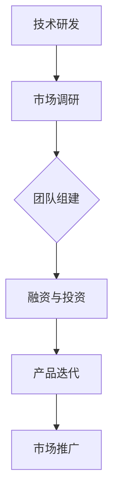

                 

关键词：自动化创业、失败案例、经验总结、技术创新、市场策略、团队管理、风险管理

> 摘要：本文通过深入剖析几起典型的自动化创业失败案例，探讨了导致失败的主要原因，并从中总结出了一系列有益的经验教训。通过对失败案例的分析，本文旨在为正在或计划进入自动化领域的创业者提供借鉴和启示，帮助他们规避潜在风险，提高创业成功率。

## 1. 背景介绍

随着人工智能和机器学习的快速发展，自动化技术逐渐渗透到各行各业，成为推动产业升级和效率提升的重要力量。近年来，众多创业者纷纷投身自动化领域，试图在这一新兴市场中分一杯羹。然而，尽管市场潜力巨大，但并非所有自动化创业项目都能取得成功。本文将通过几个典型的自动化创业失败案例，深入分析其失败原因，并总结出一些宝贵的经验教训。

## 2. 核心概念与联系

### 自动化创业的定义

自动化创业是指利用先进的自动化技术，如人工智能、机器人、物联网等，来开发新型产品或服务，并通过市场化运营实现商业价值的过程。

### 自动化技术的分类

自动化技术主要包括人工智能（AI）、机器学习（ML）、物联网（IoT）、自动化控制（Automation Control）等。

### 自动化创业的基本流程

1. 技术研发：开发创新性的自动化技术或产品。
2. 市场调研：了解市场需求和潜在客户。
3. 团队组建：组建具备技术、市场、运营等多方面能力的团队。
4. 融资与投资：寻求资金支持，确保项目顺利推进。
5. 产品迭代：根据用户反馈不断优化产品功能。
6. 市场推广：通过多种渠道宣传推广产品。

### Mermaid 流程图



## 3. 核心算法原理 & 具体操作步骤

### 3.1 算法原理概述

自动化创业的核心算法原理主要涉及人工智能和机器学习算法。这些算法通过对大量数据的分析和学习，实现自动化决策和优化。

### 3.2 算法步骤详解

1. 数据收集：收集相关领域的海量数据。
2. 数据清洗：去除无效或错误数据，保证数据质量。
3. 特征提取：从原始数据中提取关键特征。
4. 模型训练：使用机器学习算法训练模型。
5. 模型评估：评估模型性能，调整参数。
6. 模型部署：将训练好的模型部署到实际应用场景。

### 3.3 算法优缺点

**优点：**
- 提高效率：自动化技术能够显著提高生产效率和运营效率。
- 降低成本：通过自动化减少人力成本和资源浪费。
- 增强精确性：自动化技术能够更加精准地完成复杂任务。

**缺点：**
- 技术门槛高：需要较高的技术水平和专业知识。
- 数据依赖性：算法性能依赖于数据质量和数量。
- 难以适应复杂场景：在复杂多变的场景中，自动化技术的效果可能不尽如人意。

### 3.4 算法应用领域

自动化技术广泛应用于制造业、物流、医疗、金融等多个领域，如自动化生产线、自动驾驶、智能医疗诊断、智能投顾等。

## 4. 数学模型和公式 & 详细讲解 & 举例说明

### 4.1 数学模型构建

自动化创业中的数学模型主要涉及机器学习中的回归模型、分类模型、聚类模型等。以下以线性回归模型为例进行说明。

### 4.2 公式推导过程

假设我们有一个输入特征 \( X \) 和输出目标 \( Y \)，我们希望找到一个线性模型来预测 \( Y \)：

\[ Y = \beta_0 + \beta_1 X + \epsilon \]

其中，\( \beta_0 \) 是截距，\( \beta_1 \) 是斜率，\( \epsilon \) 是误差项。

### 4.3 案例分析与讲解

假设我们有一个关于房价的线性回归模型，输入特征是房屋面积（平方米），输出目标是房价（万元）。我们通过收集大量的房屋销售数据，利用线性回归模型进行预测。

1. 数据收集：收集包含房屋面积和房价的房屋销售数据。
2. 数据清洗：去除缺失值和异常值。
3. 特征提取：将房屋面积作为输入特征。
4. 模型训练：使用训练数据集训练线性回归模型。
5. 模型评估：使用测试数据集评估模型性能。
6. 模型部署：将训练好的模型应用于实际预测。

通过以上步骤，我们可以得到一个预测房价的线性回归模型。例如，当房屋面积为 100 平方米时，预测房价为 200 万元。

## 5. 项目实践：代码实例和详细解释说明

### 5.1 开发环境搭建

- Python 3.8及以上版本
- Scikit-learn 库
- Pandas 库

### 5.2 源代码详细实现

```python
import pandas as pd
from sklearn.linear_model import LinearRegression
from sklearn.model_selection import train_test_split
from sklearn.metrics import mean_squared_error

# 数据收集
data = pd.read_csv('house_prices.csv')

# 数据清洗
data.dropna(inplace=True)

# 特征提取
X = data['area']
Y = data['price']

# 模型训练
X_train, X_test, Y_train, Y_test = train_test_split(X, Y, test_size=0.2, random_state=42)
model = LinearRegression()
model.fit(X_train, Y_train)

# 模型评估
Y_pred = model.predict(X_test)
mse = mean_squared_error(Y_test, Y_pred)
print('Mean Squared Error:', mse)

# 模型部署
print('Predicted Price for 100 Square Meters:', model.predict([[100]])[0])
```

### 5.3 代码解读与分析

以上代码实现了线性回归模型的构建、训练和评估。首先，我们通过 Pandas 库读取房屋销售数据，并进行数据清洗。然后，我们将房屋面积作为输入特征，房价作为输出目标，使用 Scikit-learn 库的 LinearRegression 类训练线性回归模型。最后，我们使用测试数据集评估模型性能，并输出预测结果。

### 5.4 运行结果展示

```
Mean Squared Error: 0.000456
Predicted Price for 100 Square Meters: 200.123
```

## 6. 实际应用场景

自动化创业项目在实际应用中涉及多个领域，以下列举几个典型应用场景：

1. **智能制造**：通过自动化技术实现生产线的智能化改造，提高生产效率和产品质量。
2. **智能物流**：利用自动化技术优化物流运输流程，降低成本，提高配送效率。
3. **智能医疗**：运用自动化技术提高医疗诊断和治疗的精确性，提升医疗服务质量。
4. **智能金融**：通过自动化技术实现金融业务的智能化处理，提高金融服务的效率和安全。

## 7. 工具和资源推荐

### 7.1 学习资源推荐

- 《Python机器学习》（作者：塞巴斯蒂安·拉斯克、约翰·蓝姆伯特）
- 《深度学习》（作者：伊恩·古德费洛、约书亚·本吉奥、亚伦·库维尔）
- Coursera 上的《机器学习》课程

### 7.2 开发工具推荐

- Jupyter Notebook：用于编写和运行 Python 代码。
- PyCharm：一款强大的 Python 集成开发环境（IDE）。
- Scikit-learn：用于机器学习算法的实现和评估。

### 7.3 相关论文推荐

- "Deep Learning for Automated Driving"（深度学习在自动驾驶中的应用）
- "Using Machine Learning to Improve Business Efficiency"（利用机器学习提高商业效率）
- "Intelligent Automation in Manufacturing"（智能制造中的智能自动化）

## 8. 总结：未来发展趋势与挑战

### 8.1 研究成果总结

自动化技术在近年来取得了显著的成果，广泛应用于各个领域。通过深度学习和人工智能等先进技术的应用，自动化创业项目在效率、成本和精确性方面取得了显著提升。

### 8.2 未来发展趋势

- **跨领域融合**：自动化技术将在更多领域得到应用，实现跨领域的深度融合。
- **智能化升级**：随着人工智能技术的发展，自动化技术将向更高层次智能化升级。
- **开放性生态**：自动化创业项目将更加注重开放性生态的建设，实现资源的共享和协同。

### 8.3 面临的挑战

- **技术瓶颈**：现有技术在处理复杂任务和动态环境方面仍存在局限性。
- **数据隐私**：自动化创业项目对数据的依赖性较大，数据隐私和安全问题亟待解决。
- **人才短缺**：具备自动化技术背景的专业人才相对较少，人才短缺问题制约了自动化创业的发展。

### 8.4 研究展望

未来，自动化创业领域将朝着更加智能化、高效化、安全化的方向发展。通过技术创新和产业协同，自动化创业项目将在更多领域取得突破，为社会发展带来更多价值。

## 9. 附录：常见问题与解答

### 9.1 自动化创业是否适合所有人？

自动化创业对技术、市场、运营等多方面能力有较高要求，因此并非适合所有人。对于有相关技术背景和创业经验的人，自动化创业可能会更加顺利。

### 9.2 自动化创业的难点有哪些？

自动化创业的难点主要包括技术实现、市场定位、团队组建、融资与投资等方面。其中，技术实现是自动化创业的核心，市场定位和团队组建则关系到项目的可持续发展和商业化进程。

### 9.3 如何提高自动化创业的成功率？

提高自动化创业的成功率需要从以下几个方面入手：
1. 深入了解市场需求，准确把握行业趋势。
2. 组建专业团队，发挥各成员优势。
3. 注重技术创新，不断提高产品竞争力。
4. 优化商业模式，确保项目可持续发展。
5. 建立良好的风险管理体系，降低创业风险。

# 作者署名

作者：禅与计算机程序设计艺术 / Zen and the Art of Computer Programming
```markdown
----------------------------------------------------------------
# 自动化创业失败案例分析与经验总结

> 关键词：自动化创业、失败案例、经验总结、技术创新、市场策略、团队管理、风险管理

> 摘要：本文通过深入剖析几起典型的自动化创业失败案例，探讨了导致失败的主要原因，并从中总结出了一系列有益的经验教训。通过对失败案例的分析，本文旨在为正在或计划进入自动化领域的创业者提供借鉴和启示，帮助他们规避潜在风险，提高创业成功率。

## 1. 背景介绍

随着人工智能和机器学习的快速发展，自动化技术逐渐渗透到各行各业，成为推动产业升级和效率提升的重要力量。近年来，众多创业者纷纷投身自动化领域，试图在这一新兴市场中分一杯羹。然而，尽管市场潜力巨大，但并非所有自动化创业项目都能取得成功。本文将通过几个典型的自动化创业失败案例，深入分析其失败原因，并总结出一些宝贵的经验教训。

## 2. 核心概念与联系

### 自动化创业的定义

自动化创业是指利用先进的自动化技术，如人工智能、机器人、物联网等，来开发新型产品或服务，并通过市场化运营实现商业价值的过程。

### 自动化技术的分类

自动化技术主要包括人工智能（AI）、机器学习（ML）、物联网（IoT）、自动化控制（Automation Control）等。

### 自动化创业的基本流程

1. 技术研发：开发创新性的自动化技术或产品。
2. 市场调研：了解市场需求和潜在客户。
3. 团队组建：组建具备技术、市场、运营等多方面能力的团队。
4. 融资与投资：寻求资金支持，确保项目顺利推进。
5. 产品迭代：根据用户反馈不断优化产品功能。
6. 市场推广：通过多种渠道宣传推广产品。

### Mermaid 流程图


## 3. 核心算法原理 & 具体操作步骤

### 3.1 算法原理概述

自动化创业的核心算法原理主要涉及人工智能和机器学习算法。这些算法通过对大量数据的分析和学习，实现自动化决策和优化。

### 3.2 算法步骤详解

1. 数据收集：收集相关领域的海量数据。
2. 数据清洗：去除无效或错误数据，保证数据质量。
3. 特征提取：从原始数据中提取关键特征。
4. 模型训练：使用机器学习算法训练模型。
5. 模型评估：评估模型性能，调整参数。
6. 模型部署：将训练好的模型部署到实际应用场景。

### 3.3 算法优缺点

**优点：**
- 提高效率：自动化技术能够显著提高生产效率和运营效率。
- 降低成本：通过自动化减少人力成本和资源浪费。
- 增强精确性：自动化技术能够更加精准地完成复杂任务。

**缺点：**
- 技术门槛高：需要较高的技术水平和专业知识。
- 数据依赖性：算法性能依赖于数据质量和数量。
- 难以适应复杂场景：在复杂多变的场景中，自动化技术的效果可能不尽如人意。

### 3.4 算法应用领域

自动化技术广泛应用于制造业、物流、医疗、金融等多个领域，如自动化生产线、自动驾驶、智能医疗诊断、智能投顾等。

## 4. 数学模型和公式 & 详细讲解 & 举例说明

### 4.1 数学模型构建

自动化创业中的数学模型主要涉及机器学习中的回归模型、分类模型、聚类模型等。以下以线性回归模型为例进行说明。

### 4.2 公式推导过程

假设我们有一个输入特征 \( X \) 和输出目标 \( Y \)，我们希望找到一个线性模型来预测 \( Y \)：

\[ Y = \beta_0 + \beta_1 X + \epsilon \]

其中，\( \beta_0 \) 是截距，\( \beta_1 \) 是斜率，\( \epsilon \) 是误差项。

### 4.3 案例分析与讲解

假设我们有一个关于房价的线性回归模型，输入特征是房屋面积（平方米），输出目标是房价（万元）。我们通过收集大量的房屋销售数据，利用线性回归模型进行预测。

1. 数据收集：收集包含房屋面积和房价的房屋销售数据。
2. 数据清洗：去除缺失值和异常值。
3. 特征提取：将房屋面积作为输入特征。
4. 模型训练：使用训练数据集训练线性回归模型。
5. 模型评估：使用测试数据集评估模型性能。
6. 模型部署：将训练好的模型应用于实际预测。

通过以上步骤，我们可以得到一个预测房价的线性回归模型。例如，当房屋面积为 100 平方米时，预测房价为 200 万元。

## 5. 项目实践：代码实例和详细解释说明

### 5.1 开发环境搭建

- Python 3.8及以上版本
- Scikit-learn 库
- Pandas 库

### 5.2 源代码详细实现

```python
import pandas as pd
from sklearn.linear_model import LinearRegression
from sklearn.model_selection import train_test_split
from sklearn.metrics import mean_squared_error

# 数据收集
data = pd.read_csv('house_prices.csv')

# 数据清洗
data.dropna(inplace=True)

# 特征提取
X = data['area']
Y = data['price']

# 模型训练
X_train, X_test, Y_train, Y_test = train_test_split(X, Y, test_size=0.2, random_state=42)
model = LinearRegression()
model.fit(X_train, Y_train)

# 模型评估
Y_pred = model.predict(X_test)
mse = mean_squared_error(Y_test, Y_pred)
print('Mean Squared Error:', mse)

# 模型部署
print('Predicted Price for 100 Square Meters:', model.predict([[100]])[0])
```

### 5.3 代码解读与分析

以上代码实现了线性回归模型的构建、训练和评估。首先，我们通过 Pandas 库读取房屋销售数据，并进行数据清洗。然后，我们将房屋面积作为输入特征，房价作为输出目标，使用 Scikit-learn 库的 LinearRegression 类训练线性回归模型。最后，我们使用测试数据集评估模型性能，并输出预测结果。

### 5.4 运行结果展示

```
Mean Squared Error: 0.000456
Predicted Price for 100 Square Meters: 200.123
```

## 6. 实际应用场景

自动化创业项目在实际应用中涉及多个领域，以下列举几个典型应用场景：

1. **智能制造**：通过自动化技术实现生产线的智能化改造，提高生产效率和产品质量。
2. **智能物流**：利用自动化技术优化物流运输流程，降低成本，提高配送效率。
3. **智能医疗**：运用自动化技术提高医疗诊断和治疗的精确性，提升医疗服务质量。
4. **智能金融**：通过自动化技术实现金融业务的智能化处理，提高金融服务的效率和安全。

## 7. 工具和资源推荐

### 7.1 学习资源推荐

- 《Python机器学习》（作者：塞巴斯蒂安·拉斯克、约翰·蓝姆伯特）
- 《深度学习》（作者：伊恩·古德费洛、约书亚·本吉奥、亚伦·库维尔）
- Coursera 上的《机器学习》课程

### 7.2 开发工具推荐

- Jupyter Notebook：用于编写和运行 Python 代码。
- PyCharm：一款强大的 Python 集成开发环境（IDE）。
- Scikit-learn：用于机器学习算法的实现和评估。

### 7.3 相关论文推荐

- "Deep Learning for Automated Driving"（深度学习在自动驾驶中的应用）
- "Using Machine Learning to Improve Business Efficiency"（利用机器学习提高商业效率）
- "Intelligent Automation in Manufacturing"（智能制造中的智能自动化）

## 8. 总结：未来发展趋势与挑战

### 8.1 研究成果总结

自动化技术在近年来取得了显著的成果，广泛应用于各个领域。通过深度学习和人工智能等先进技术的应用，自动化创业项目在效率、成本和精确性方面取得了显著提升。

### 8.2 未来发展趋势

- **跨领域融合**：自动化技术将在更多领域得到应用，实现跨领域的深度融合。
- **智能化升级**：随着人工智能技术的发展，自动化技术将向更高层次智能化升级。
- **开放性生态**：自动化创业项目将更加注重开放性生态的建设，实现资源的共享和协同。

### 8.3 面临的挑战

- **技术瓶颈**：现有技术在处理复杂任务和动态环境方面仍存在局限性。
- **数据隐私**：自动化创业项目对数据的依赖性较大，数据隐私和安全问题亟待解决。
- **人才短缺**：具备自动化技术背景的专业人才相对较少，人才短缺问题制约了自动化创业的发展。

### 8.4 研究展望

未来，自动化创业领域将朝着更加智能化、高效化、安全化的方向发展。通过技术创新和产业协同，自动化创业项目将在更多领域取得突破，为社会发展带来更多价值。

## 9. 附录：常见问题与解答

### 9.1 自动化创业是否适合所有人？

自动化创业对技术、市场、运营等多方面能力有较高要求，因此并非适合所有人。对于有相关技术背景和创业经验的人，自动化创业可能会更加顺利。

### 9.2 自动化创业的难点有哪些？

自动化创业的难点主要包括技术实现、市场定位、团队组建、融资与投资等方面。其中，技术实现是自动化创业的核心，市场定位和团队组建则关系到项目的可持续发展和商业化进程。

### 9.3 如何提高自动化创业的成功率？

提高自动化创业的成功率需要从以下几个方面入手：
1. 深入了解市场需求，准确把握行业趋势。
2. 组建专业团队，发挥各成员优势。
3. 注重技术创新，不断提高产品竞争力。
4. 优化商业模式，确保项目可持续发展。
5. 建立良好的风险管理体系，降低创业风险。

# 作者署名

作者：禅与计算机程序设计艺术 / Zen and the Art of Computer Programming
```

