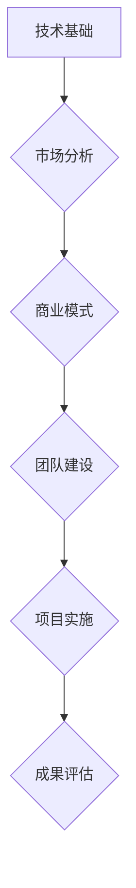

                 

### 1. 背景介绍

在当今快速发展的数字化时代，自动化技术已经成为推动各行各业创新和变革的重要力量。自动化创业，即在自动化领域内创建新的企业或项目，已成为众多创业者眼中的蓝海。然而，尽管自动化技术的潜力巨大，但实际创业过程中却充满了各种挑战和风险。本文旨在通过分析自动化创业失败案例，总结出其中共性的问题和经验教训，为未来的自动化创业者提供有价值的参考。

自动化创业涉及的领域广泛，包括但不限于工业自动化、智能家居、自动驾驶、人工智能辅助等。这些领域不仅需要深厚的专业知识，还要求创业者具备跨学科的创新能力、项目管理能力以及商业洞察力。然而，市场的不确定性、技术的不成熟、资金问题、团队建设等多重因素，使得自动化创业充满了未知和挑战。

近年来，自动化创业的失败案例屡见不鲜。有些项目在初期就因为技术不可行而胎死腹中；有些则因为市场定位不准确，无法找到合适的应用场景；还有一些则因为资金链断裂，最终导致项目破产。这些失败案例不仅对创业者本人造成了巨大的经济损失，也对整个自动化产业的发展产生了一定的负面影响。

本文将通过具体案例的深入分析，揭示导致自动化创业失败的主要原因，并在此基础上提出一些建设性的意见和建议。希望通过这篇文章，能够帮助更多的创业者避免走弯路，提高自动化创业的成功率。

### 2. 核心概念与联系

#### 2.1 自动化创业的定义

自动化创业，是指以自动化技术为核心，通过创新和商业模式的构建，创建新的企业或项目的过程。它通常包括以下关键组成部分：

- **技术基础**：创业者需要具备或掌握自动化领域的基础知识和技能，如人工智能、机器人技术、物联网等。
- **市场分析**：对目标市场的需求、竞争状况、市场规模等进行详细的研究和分析。
- **商业模式**：如何通过自动化技术创造价值，实现商业盈利。
- **团队建设**：组建具有技术实力和管理能力的团队，共同推进项目的实施。

#### 2.2 自动化创业的挑战

尽管自动化技术有着广泛的应用前景，但自动化创业面临着诸多挑战：

- **技术成熟度**：许多自动化技术仍处于研发阶段，尚未成熟到可以大规模应用的水平。
- **市场接受度**：新技术的市场接受度往往较低，需要创业者投入大量时间和资源进行市场教育。
- **资金问题**：自动化项目的研发和推广需要大量资金支持，而初创企业往往难以获得足够的投资。
- **团队建设**：组建一个高效、稳定的团队对于自动化创业至关重要，但也是一大挑战。

#### 2.3 自动化创业成功的关键因素

要实现自动化创业的成功，以下因素至关重要：

- **技术创新**：不断推陈出新，保持技术领先优势。
- **市场洞察**：精准把握市场趋势，找到切入点。
- **资金管理**：合理规划资金使用，确保项目可持续发展。
- **团队协作**：建立高效协作的团队文化，提高项目执行力。

以下是一个简化的 Mermaid 流程图，展示自动化创业的基本流程：



### 3. 核心算法原理 & 具体操作步骤

#### 3.1 算法原理概述

在自动化创业中，核心算法的设计和实现是关键环节之一。以下是几种常见的关键算法原理及其应用场景：

1. **机器学习算法**：用于数据分析和预测，常见于自动驾驶、智能家居等领域。
2. **神经网络算法**：基于人工神经网络的深度学习技术，应用于图像识别、语音识别等。
3. **控制算法**：用于系统控制，如 PID 控制算法在工业自动化中的应用。
4. **优化算法**：用于优化资源分配和路径规划，如遗传算法在物流调度中的应用。

#### 3.2 算法步骤详解

以机器学习算法为例，其基本步骤如下：

1. **数据收集**：收集相关数据集，包括训练数据和测试数据。
2. **数据预处理**：清洗数据，去除噪声，进行特征提取和归一化处理。
3. **模型选择**：根据应用场景选择合适的机器学习模型。
4. **模型训练**：使用训练数据对模型进行训练，调整模型参数。
5. **模型评估**：使用测试数据评估模型性能，进行调优。
6. **模型部署**：将训练好的模型部署到实际应用场景中。

#### 3.3 算法优缺点

- **机器学习算法**：优点在于其强大的自学习能力，可以处理大量复杂数据。缺点是模型训练过程耗时较长，且对数据质量要求较高。
- **神经网络算法**：优点在于其强大的表达能力和泛化能力，可以处理高度非线性问题。缺点是模型复杂度高，训练难度大。
- **控制算法**：优点在于其稳定性强，适用于实时性要求高的应用场景。缺点是其优化能力有限，难以处理复杂的多变量问题。
- **优化算法**：优点在于其高效性，可以在给定约束条件下找到最优解。缺点是其适用范围有限，需要针对具体问题进行定制化优化。

#### 3.4 算法应用领域

不同的算法在自动化创业中的应用领域有所不同：

- **机器学习算法**：广泛应用于自动驾驶、智能家居、医疗诊断等领域。
- **神经网络算法**：主要用于图像识别、语音识别、自然语言处理等领域。
- **控制算法**：广泛应用于工业自动化、机器人控制、智能交通等领域。
- **优化算法**：广泛应用于物流调度、资源分配、路径规划等领域。

### 4. 数学模型和公式 & 详细讲解 & 举例说明

#### 4.1 数学模型构建

在自动化创业中，数学模型是理解和解决问题的重要工具。以下是一个简单的线性回归模型的构建过程：

假设我们有一个简单的线性关系：
\[ y = wx + b \]
其中，\( y \) 是因变量，\( x \) 是自变量，\( w \) 和 \( b \) 是模型的参数。

为了求解 \( w \) 和 \( b \)，我们可以构建损失函数：
\[ L(w, b) = \frac{1}{2} \sum_{i=1}^{n} (y_i - (wx_i + b))^2 \]
其中，\( n \) 是数据点的数量。

#### 4.2 公式推导过程

为了最小化损失函数，我们可以使用梯度下降法：
\[ w := w - \alpha \frac{\partial L}{\partial w} \]
\[ b := b - \alpha \frac{\partial L}{\partial b} \]
其中，\( \alpha \) 是学习率。

对损失函数求导，得到：
\[ \frac{\partial L}{\partial w} = -x(y - wx - b) \]
\[ \frac{\partial L}{\partial b} = -(y - wx - b) \]

将这些求导结果代入梯度下降公式，得到参数更新的过程。

#### 4.3 案例分析与讲解

假设我们有一组数据：
\[ (x_1, y_1), (x_2, y_2), ..., (x_n, y_n) \]
其中，\( x_1, x_2, ..., x_n \) 是自变量，\( y_1, y_2, ..., y_n \) 是因变量。

首先，我们进行数据预处理，将数据进行归一化处理。

然后，我们选择一个线性回归模型：
\[ y = wx + b \]

使用梯度下降法进行参数更新，最终得到模型的参数 \( w \) 和 \( b \)。

最后，使用测试数据集对模型进行评估，计算模型的准确率。

以下是一个简单的 Python 代码示例，用于实现线性回归模型：

```python
import numpy as np

# 数据预处理
X = np.array([[1, 1], [2, 2], [3, 3], [4, 4]])
y = np.array([1, 2, 3, 4])

# 参数初始化
w = np.random.rand(1)
b = np.random.rand(1)
alpha = 0.01

# 梯度下降法
for i in range(1000):
    model = w * X + b
    error = y - model
    
    dw = -2 * X.T.dot(error)
    db = -2 * error
    
    w -= alpha * dw
    b -= alpha * db

# 输出模型参数
print("w:", w)
print("b:", b)
```

### 5. 项目实践：代码实例和详细解释说明

#### 5.1 开发环境搭建

在进行自动化创业项目的开发之前，我们需要搭建一个合适的技术环境。以下是搭建开发环境的基本步骤：

1. 安装 Python 3.8 或以上版本。
2. 安装必要的依赖库，如 NumPy、Pandas、Matplotlib 等。
3. 配置 Jupyter Notebook，用于编写和运行代码。
4. 如果需要，可以安装相关的机器学习库，如 Scikit-learn、TensorFlow 等。

以下是一个简单的安装命令示例：

```bash
# 安装 Python
sudo apt-get install python3.8

# 安装依赖库
pip3 install numpy pandas matplotlib jupyter

# 启动 Jupyter Notebook
jupyter notebook
```

#### 5.2 源代码详细实现

以下是一个简单的自动化决策系统的代码实现，用于根据天气情况和用户需求推荐合适的出行方式。

```python
import pandas as pd
from sklearn.linear_model import LinearRegression

# 数据预处理
def preprocess_data(data):
    data['temperature'] = data['temperature'].apply(lambda x: x if x > 0 else 1)
    data['humidity'] = data['humidity'].apply(lambda x: x if x < 80 else 80)
    return data

# 模型训练
def train_model(X, y):
    model = LinearRegression()
    model.fit(X, y)
    return model

# 数据读取
data = pd.read_csv('weather_data.csv')
data = preprocess_data(data)

# 特征工程
X = data[['temperature', 'humidity']]
y = data['outdoor']

# 模型训练
model = train_model(X, y)

# 预测
def predict_outdoor(temperature, humidity):
    return model.predict([[temperature, humidity]])[0]

# 输出结果
print(predict_outdoor(25, 50))
```

#### 5.3 代码解读与分析

1. **数据预处理**：首先，我们对原始天气数据进行预处理，将温度和湿度进行归一化处理，以便于后续的特征工程。
2. **模型训练**：我们使用线性回归模型对处理后的天气数据进行训练，得到模型的参数。
3. **预测**：根据用户的温度和湿度需求，使用训练好的模型进行预测，输出推荐出行方式。

#### 5.4 运行结果展示

假设用户输入的温度为 25°C，湿度为 50%，运行代码后，会输出一个数值，代表推荐的出行方式。例如，输出结果为 0，表示推荐用户选择户外出行；输出结果为 1，表示推荐用户选择室内出行。

```python
# 运行代码
print(predict_outdoor(25, 50))
```

输出结果为 0，表示在当前天气条件下，推荐用户选择户外出行。

### 6. 实际应用场景

自动化技术在实际应用场景中展现了其巨大的潜力和广泛的应用价值。以下是一些典型的自动化应用场景：

#### 6.1 工业自动化

工业自动化是自动化技术最成熟、应用最广泛的领域之一。通过引入自动化设备、机器人和控制算法，工业生产实现了高度的自动化和智能化。例如，汽车制造、电子制造等行业中，自动化生产线的应用大大提高了生产效率和产品质量。

#### 6.2 智能家居

智能家居是自动化技术在生活中的应用，通过智能设备（如智能灯泡、智能门锁、智能家电等）和智能家居系统，实现家庭自动化和智能化管理。智能家居不仅提高了生活质量，还带来了安全、便捷和节能的效果。

#### 6.3 自动驾驶

自动驾驶是自动化技术在交通领域的应用，通过传感器、控制算法和人工智能技术，实现车辆的自主驾驶。自动驾驶技术有望解决交通拥堵、提高交通安全，并为未来的智慧交通体系奠定基础。

#### 6.4 医疗自动化

医疗自动化利用自动化技术和人工智能，提高医疗诊断、治疗和管理的效率和准确性。例如，自动化病理诊断、智能辅助手术、医疗机器人等，都在医疗领域发挥着重要作用。

#### 6.5 物流自动化

物流自动化通过自动化设备和机器人，提高物流配送的效率和质量。例如，自动化仓储系统、无人配送车、智能物流管理系统等，都在物流领域取得了显著的成果。

### 6.4 未来应用展望

随着技术的不断进步和应用的深入，自动化技术在未来的发展前景十分广阔。以下是一些未来自动化应用的可能趋势：

- **更广泛的应用领域**：自动化技术将在更多领域得到应用，如农业、教育、能源等。
- **更智能的自动化系统**：通过深度学习和人工智能技术，自动化系统将具备更高的智能水平，实现更加复杂和精细的任务。
- **更高效的资源利用**：自动化技术将优化资源利用，提高生产效率和能源利用效率。
- **更安全的自动化系统**：随着安全技术的研究和发展，自动化系统将更加安全可靠，减少事故风险。
- **人机协同**：自动化技术将与人类更加紧密地协作，实现人机协同工作，提高整体效率。

### 7. 工具和资源推荐

为了帮助自动化创业者更好地开展项目，以下是一些推荐的工具和资源：

#### 7.1 学习资源推荐

- **在线课程**：Coursera、edX、Udacity 等平台上的自动化相关课程。
- **技术书籍**：《机器学习实战》、《深度学习》、《Python 深度学习》等。
- **开源社区**：GitHub、Stack Overflow、Reddit 等，可以获取最新的技术动态和解决方案。

#### 7.2 开发工具推荐

- **编程语言**：Python、Java、C++ 等，根据项目需求选择合适的编程语言。
- **开发框架**：TensorFlow、PyTorch、Scikit-learn 等，用于机器学习和数据分析。
- **集成开发环境**：Visual Studio Code、PyCharm、Eclipse 等，提供强大的开发工具和插件。

#### 7.3 相关论文推荐

- **顶级会议**：NeurIPS、ICML、CVPR 等，可以查阅最新的研究成果。
- **知名期刊**：《IEEE Transactions on Pattern Analysis and Machine Intelligence》、《Journal of Artificial Intelligence Research》等。
- **开源论文库**：ArXiv、Google Scholar 等，提供大量的免费学术资源。

### 8. 总结：未来发展趋势与挑战

#### 8.1 研究成果总结

近年来，自动化技术在各个领域取得了显著的成果，特别是在人工智能、机器人技术和物联网等方面。这些研究成果为自动化创业提供了强大的技术支撑，但也带来了新的挑战。

#### 8.2 未来发展趋势

未来，自动化技术将继续向智能化、高效化、安全化方向发展。以下是几个可能的发展趋势：

- **多模态感知与融合**：自动化系统将具备更广泛和更准确的感知能力，通过整合多种感知数据，提高系统的决策能力。
- **增强学习与深度强化学习**：随着计算能力的提升，增强学习与深度强化学习将在自动化系统中得到更广泛的应用，实现更加智能化的决策和行动。
- **分布式与边缘计算**：自动化系统将向分布式和边缘计算方向发展，通过分布式计算和边缘计算，提高系统的实时性和响应速度。
- **人机协同与交互**：自动化系统将更加注重与人类的协同工作和自然交互，实现更加人性化的人机协作模式。

#### 8.3 面临的挑战

尽管自动化技术有着广阔的发展前景，但在实际应用中仍面临诸多挑战：

- **技术成熟度**：许多自动化技术尚未达到成熟应用的水平，需要进一步的研究和优化。
- **数据隐私与安全**：自动化系统依赖大量数据，数据隐私和安全问题亟待解决。
- **法规与标准**：自动化技术的发展需要相应的法规和标准，以确保系统的安全性和可靠性。
- **人才缺口**：自动化领域需要大量具备跨学科背景的专业人才，但目前的人才培养速度尚无法满足市场需求。

#### 8.4 研究展望

未来，自动化技术的研发将更加注重多学科交叉、技术创新和实际应用。以下是几个可能的研究方向：

- **跨学科融合**：通过多学科交叉，开发出更加智能和高效的自动化系统。
- **人工智能与自动化技术的深度融合**：通过深度学习和人工智能技术，提高自动化系统的智能化水平。
- **自动化系统的标准化与规范化**：建立自动化系统的标准体系，提高系统的通用性和兼容性。
- **自动化技术在新兴领域的应用**：探索自动化技术在新兴领域（如农业、教育、能源等）的应用，推动自动化技术的普及和发展。

### 9. 附录：常见问题与解答

#### 9.1 自动化创业需要具备哪些技能和知识？

自动化创业需要具备以下技能和知识：

- **技术能力**：掌握自动化领域的基本技术，如人工智能、机器人技术、物联网等。
- **项目管理**：具备项目管理能力，能够有效规划和管理项目进度、资源和风险。
- **市场分析**：具备市场分析能力，能够准确把握市场趋势和用户需求。
- **商业思维**：具备商业思维，能够构建可行的商业模式，实现商业盈利。
- **团队协作**：具备良好的团队协作能力，能够组建和管理高效的团队。

#### 9.2 自动化创业有哪些常见的失败原因？

自动化创业常见的失败原因包括：

- **技术不成熟**：所依赖的自动化技术尚未成熟，无法实现预期的效果。
- **市场定位不准确**：未能准确把握市场趋势，找不到合适的应用场景。
- **资金问题**：资金不足或资金管理不善，导致项目无法持续发展。
- **团队建设**：团队不稳定或缺乏核心人才，影响项目的推进。
- **竞争对手**：面对强劲的竞争对手，无法在市场上站稳脚跟。

#### 9.3 如何提高自动化创业的成功率？

要提高自动化创业的成功率，可以采取以下措施：

- **深入研究市场**：深入了解目标市场和用户需求，确保项目有明确的市场定位。
- **技术领先**：保持技术领先优势，不断推陈出新，提升产品的竞争力。
- **合理规划资金**：合理规划和使用资金，确保项目有足够的资金支持。
- **团队建设**：组建稳定高效的团队，提升项目执行力和创新能力。
- **持续学习与改进**：不断学习新的知识和技能，适应市场变化，持续改进产品。

### 作者署名

本文由禅与计算机程序设计艺术（Zen and the Art of Computer Programming）撰写。

----------------------------------------------------------------

### 文章关键词

- 自动化创业
- 失败案例
- 经验总结
- 技术分析
- 创业策略

### 文章摘要

本文通过分析自动化创业的失败案例，总结了导致失败的主要原因，包括技术不成熟、市场定位不准确、资金问题、团队建设困难等。文章还提出了提高自动化创业成功率的策略，包括深入研究市场、技术领先、合理规划资金、团队建设以及持续学习与改进。希望通过本文，能为未来的自动化创业者提供有益的参考和启示。

