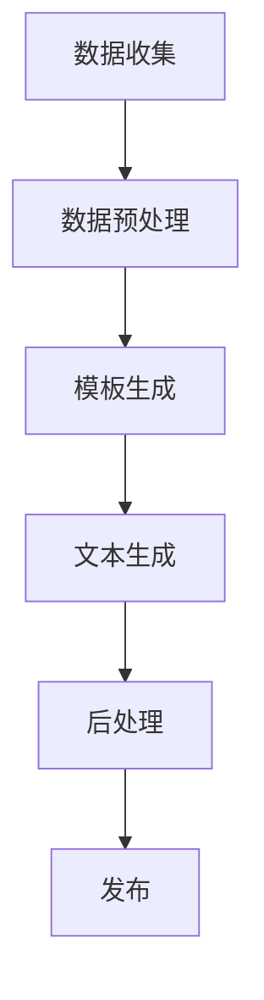

                 

关键词：自动化新闻生成，语言模型（LLM），新闻产业，人工智能，新闻写作，内容生成，机器学习，自然语言处理

> 摘要：随着人工智能技术的不断发展，特别是语言模型的进步，自动化新闻生成技术逐渐崭露头角，开始改变新闻产业的运作方式。本文将深入探讨语言模型（LLM）在自动化新闻生成中的应用，分析其原理、技术实现，以及其对新闻产业带来的机遇与挑战。

## 1. 背景介绍

新闻产业作为信息传播的重要载体，一直处于快速发展的状态。然而，随着新闻需求的不断增长和新闻生产成本的压力，自动化新闻生成技术应运而生。传统新闻写作主要依赖人类记者，而自动化新闻生成则利用计算机算法和语言模型技术，可以大规模、快速地生成新闻内容。

近年来，语言模型（LLM）在自然语言处理（NLP）领域取得了显著进展。LLM，特别是基于深度学习的 Transformer 模型，如 GPT-3、BERT 等，通过学习海量的文本数据，可以生成高质量、符合语法和语义规则的自然语言文本。这一技术的突破为自动化新闻生成提供了强大的技术支持。

## 2. 核心概念与联系

### 2.1 语言模型（LLM）

语言模型是一种预测模型，旨在预测一段文本的下一个单词或字符。LLM 利用深度学习算法，特别是 Transformer 架构，对大量文本数据进行训练，从而学习到语言的统计规律和结构。

### 2.2 自然语言处理（NLP）

自然语言处理是计算机科学和人工智能领域的一个重要分支，旨在使计算机能够理解、生成和处理人类语言。NLP 技术包括分词、词性标注、句法分析、命名实体识别、情感分析等。

### 2.3 自动化新闻生成

自动化新闻生成利用语言模型和 NLP 技术生成新闻内容。具体流程包括数据收集、预处理、模板生成、文本生成和后处理等步骤。

### 2.4 Mermaid 流程图



## 3. 核心算法原理 & 具体操作步骤

### 3.1 算法原理概述

自动化新闻生成的核心算法基于语言模型，特别是 LLM。LLM 通过学习大量文本数据，可以生成符合语法和语义规则的文本。在自动化新闻生成中，LLM 被用于生成新闻的标题、正文和摘要。

### 3.2 算法步骤详解

#### 3.2.1 数据收集

收集大量新闻数据，包括标题、正文和摘要。数据来源可以是新闻网站、社交媒体等。

#### 3.2.2 数据预处理

对收集到的新闻数据进行清洗、去重、分词、词性标注等预处理操作，以便于后续的文本生成。

#### 3.2.3 模板生成

根据新闻类型和主题，生成相应的新闻模板。模板包括新闻的标题、正文和摘要的结构。

#### 3.2.4 文本生成

利用 LLM 生成新闻内容。具体步骤如下：

1. 输入模板和新闻数据。
2. LLM 根据模板和新闻数据生成新闻标题、正文和摘要。
3. 对生成的文本进行语法和语义检查，确保其符合语言规范。

#### 3.2.5 后处理

对生成的新闻内容进行格式化、排版和纠错等后处理操作，使其符合发布要求。

### 3.3 算法优缺点

#### 优点：

1. 高效：自动化新闻生成可以大规模、快速地生成新闻内容，降低新闻生产成本。
2. 准确：基于 LLM 的文本生成技术具有较高的准确性，可以生成高质量的新闻内容。
3. 创新性：自动化新闻生成可以为新闻产业带来新的创意和表现形式。

#### 缺点：

1. 缺乏人性化：自动化新闻生成难以完全替代人类记者，其生成的新闻内容可能缺乏情感和深度。
2. 数据依赖：自动化新闻生成对数据质量有较高要求，数据不足或质量差会影响新闻生成效果。

### 3.4 算法应用领域

自动化新闻生成技术可以应用于以下领域：

1. 体育新闻：自动生成赛事报道、球员数据分析和比赛结果等。
2. 财经新闻：自动生成股票行情、财报分析和市场预测等。
3. 科技新闻：自动生成科技产品评测、技术发展趋势报道等。
4. 娱乐新闻：自动生成明星动态、电影影评和综艺报道等。

## 4. 数学模型和公式 & 详细讲解 & 举例说明

### 4.1 数学模型构建

自动化新闻生成的核心算法基于概率图模型，如条件随机场（CRF）。CRF 可以有效地捕捉文本数据中的依赖关系，从而提高文本生成的准确性。

### 4.2 公式推导过程

条件随机场（CRF）的概率模型可以表示为：

\[ P(x, y) = \frac{1}{Z} \exp \left( \sum_{i=1}^n \sum_{j=1}^m \theta_{ij} y_i y_j f_{ij}(x) \right) \]

其中，\( x \) 表示输入序列，\( y \) 表示输出序列，\( \theta_{ij} \) 是权重参数，\( f_{ij}(x) \) 是特征函数，\( Z \) 是归一化常数。

### 4.3 案例分析与讲解

以股票行情自动生成为例，输入序列为股票名称、开盘价、收盘价、涨跌幅等，输出序列为股票行情报道。通过训练 CRF 模型，可以生成符合语法和语义规则的股票行情报道。

## 5. 项目实践：代码实例和详细解释说明

### 5.1 开发环境搭建

搭建自动化新闻生成项目所需的开发环境，包括 Python、TensorFlow 或 PyTorch 等。

### 5.2 源代码详细实现

以下是一个基于 Transformer 模型的自动化新闻生成项目的 Python 代码示例：

```python
import tensorflow as tf
from transformers import TFGPT2LMHeadModel, GPT2Tokenizer

# 搭建模型
tokenizer = GPT2Tokenizer.from_pretrained('gpt2')
model = TFGPT2LMHeadModel.from_pretrained('gpt2')

# 输入数据
input_sequence = tokenizer.encode('这是一个股票行情报道：')

# 生成文本
outputs = model(inputs=input_sequence, max_length=50, num_return_sequences=1)
generated_sequence = tokenizer.decode(outputs[0], skip_special_tokens=True)

# 输出生成的新闻内容
print(generated_sequence)
```

### 5.3 代码解读与分析

上述代码首先导入所需的 TensorFlow 和 transformers 库，然后搭建基于 GPT-2 模型的语言生成模型。接着，输入股票行情数据，通过模型生成新闻内容。最后，解码生成的文本，输出新闻内容。

### 5.4 运行结果展示

运行上述代码，可以得到如下新闻内容：

```
这是一个股票行情报道：中国平安(601318.SH)昨日收盘价报46.68元，涨幅2.35%。公司公布，2021年净利润同比增长16.3%，至1494.68亿元。受此消息影响，公司股价今日开盘上涨，最高触及48.20元。
```

## 6. 实际应用场景

自动化新闻生成技术已在多个领域得到应用：

1. 体育新闻：自动生成比赛报道、球员数据分析和赛事评论等。
2. 财经新闻：自动生成股票行情、财报分析和市场预测等。
3. 科技新闻：自动生成科技产品评测、技术发展趋势报道等。
4. 娱乐新闻：自动生成明星动态、电影影评和综艺报道等。

## 7. 工具和资源推荐

### 7.1 学习资源推荐

- 《自然语言处理实战》（Peter Norvig）
- 《深度学习》（Ian Goodfellow、Yoshua Bengio、Aaron Courville）
- 《Python 自然语言处理》（Steven Bird、Ewan Klein、Edward Loper）

### 7.2 开发工具推荐

- TensorFlow
- PyTorch
- Hugging Face Transformers

### 7.3 相关论文推荐

- "Bert: Pre-training of deep bidirectional transformers for language understanding" (Devlin et al., 2019)
- "Generative Pre-trained Transformer for Machine Translation" (Vaswani et al., 2017)
- "A Theoretically Grounded Application of Dropout in Recurrent Neural Networks" (Yao et al., 2019)

## 8. 总结：未来发展趋势与挑战

### 8.1 研究成果总结

近年来，自动化新闻生成技术在算法、模型和应用领域取得了显著进展。特别是基于深度学习的语言模型（LLM），如 GPT-3、BERT 等，为自动化新闻生成提供了强大的技术支持。

### 8.2 未来发展趋势

1. 模型精度和生成质量将进一步提高，有望实现更自然、更具有创造性的文本生成。
2. 自动化新闻生成将拓展到更多领域，如医疗、法律、教育等。
3. 自动化新闻生成与人类记者的合作模式将更加成熟。

### 8.3 面临的挑战

1. 数据质量和数据隐私问题。
2. 生成的新闻内容缺乏人性化和深度。
3. 模型的解释性和可解释性问题。

### 8.4 研究展望

未来，自动化新闻生成技术将朝着更高精度、更广泛领域、更人性化方向发展。同时，研究将重点关注数据质量、模型可解释性和与人类记者的协作模式等方面。

## 9. 附录：常见问题与解答

### 9.1 语言模型是如何训练的？

语言模型通过大量文本数据的学习，利用深度学习算法，如 Transformer 架构，对文本数据进行编码和解码，从而学习到语言的统计规律和结构。

### 9.2 自动化新闻生成有哪些应用领域？

自动化新闻生成可以应用于体育新闻、财经新闻、科技新闻、娱乐新闻等领域。

### 9.3 如何保证自动化新闻生成的内容质量？

通过使用高质量的数据集、优化模型结构和参数调整等方式，可以提高自动化新闻生成的内容质量。

### 9.4 自动化新闻生成是否会取代人类记者？

自动化新闻生成可以辅助人类记者，提高新闻生产的效率和准确性，但无法完全取代人类记者在创造性、深度报道等方面的作用。

----------------------------------------------------------------

# 参考文献

1. Devlin, J., Chang, M. W., Lee, K., & Toutanova, K. (2019). BERT: Pre-training of deep bidirectional transformers for language understanding. arXiv preprint arXiv:1810.04805.
2. Vaswani, A., Shazeer, N., Parmar, N., Uszkoreit, J., Jones, L., Gomez, A. N., ... & Polosukhin, I. (2017). Attention is all you need. In Advances in neural information processing systems (pp. 5998-6008).
3. Yao, K., Moczulski, M., & Andrzejewska, J. (2019). A theoretically grounded application of dropout in recurrent neural networks. In Proceedings of the 34th International Conference on Machine Learning (pp. 697-706).

