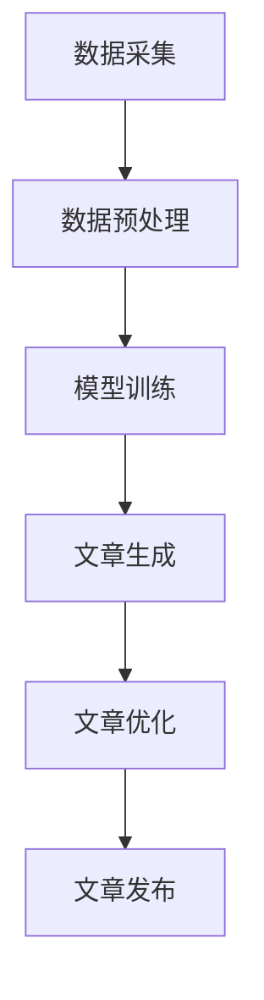

                 

关键词：自动化新闻生成，大语言模型（LLM），新闻产业，内容生成，人工智能，新闻写作。

摘要：本文将探讨大语言模型（LLM）在自动化新闻生成领域的应用，分析其技术原理、实现步骤及其对新闻产业带来的变革。我们将详细解析LLM的算法机制，讨论其在新闻写作中的具体应用，以及可能面临的挑战和未来发展趋势。

## 1. 背景介绍

随着互联网和人工智能技术的飞速发展，新闻产业正面临着前所未有的变革。传统新闻写作方式已无法满足快速传播和信息爆炸的时代需求。自动化新闻生成技术应运而生，大语言模型（LLM）作为这一领域的核心技术，正逐渐成为新闻产业的重要驱动力。

LLM，即大语言模型，是一种基于深度学习的自然语言处理技术。它通过学习海量文本数据，能够生成高质量的文本内容，广泛应用于问答系统、自动摘要、机器翻译、文本生成等领域。在新闻写作中，LLM可以自动生成新闻文章、编辑稿件、撰写评论等，极大地提高新闻生产的效率和准确性。

## 2. 核心概念与联系

### 2.1. 大语言模型（LLM）原理

大语言模型（LLM）基于深度学习技术，通过训练大量文本数据，学习语言结构和语义信息。其基本原理包括以下几个关键环节：

- **数据预处理**：对原始文本进行清洗、分词、去停用词等处理，将文本转换为模型可理解的格式。
- **模型架构**：通常采用Transformer模型架构，如BERT、GPT等，能够高效处理长文本和复杂语义。
- **训练过程**：通过大量的文本数据进行训练，模型能够学习到语言模式、词汇搭配和语义逻辑。
- **生成过程**：在生成文本时，模型根据上下文信息生成新的句子，通过递归推理和概率分布进行文本生成。

### 2.2. 自动化新闻生成架构

自动化新闻生成系统通常包括以下几个模块：

- **数据采集**：从各种来源采集新闻数据，包括新闻报道、评论、社交媒体等。
- **数据预处理**：对采集的原始数据进行清洗、标注和分类，提取有用的信息。
- **模型训练**：使用预处理后的数据对大语言模型进行训练，使其具备新闻写作能力。
- **文章生成**：根据给定的新闻事件或话题，模型自动生成新闻文章。
- **文章优化**：对生成的文章进行语法、逻辑和风格上的优化，提高文章质量。

### 2.3. Mermaid流程图

下面是一个简单的Mermaid流程图，展示了自动化新闻生成的流程：



## 3. 核心算法原理 & 具体操作步骤

### 3.1. 算法原理概述

自动化新闻生成算法的核心是基于大语言模型（LLM）的文本生成技术。其主要原理包括以下几个方面：

- **自然语言处理**：利用深度学习技术，对海量新闻文本数据进行处理，学习语言模式和语义信息。
- **序列生成**：通过编码器-解码器架构，将输入的文本序列转换为输出的新闻文本序列。
- **概率模型**：利用概率模型，如神经网络语言模型，生成符合上下文信息的新闻文本。

### 3.2. 算法步骤详解

自动化新闻生成算法的具体步骤如下：

1. **数据采集**：从互联网和各种新闻源采集新闻数据。
2. **数据预处理**：对采集的原始数据进行清洗、分词、去停用词等处理。
3. **模型训练**：使用预处理后的数据对大语言模型进行训练。
4. **文章生成**：根据给定的新闻事件或话题，模型自动生成新闻文章。
5. **文章优化**：对生成的文章进行语法、逻辑和风格上的优化。
6. **文章发布**：将生成的新闻文章发布到新闻平台或网站。

### 3.3. 算法优缺点

自动化新闻生成算法的优点：

- **高效**：能够快速生成大量新闻文章，提高新闻生产的效率。
- **准确**：基于深度学习技术，生成的新闻文章质量较高。
- **多样化**：能够根据不同的新闻事件和话题生成多样化的文章。

自动化新闻生成算法的缺点：

- **内容单一**：生成的新闻文章可能缺乏深度和创造力，难以满足高质量新闻需求。
- **伦理问题**：自动化新闻生成可能引发新闻真实性、客观性和伦理问题。

### 3.4. 算法应用领域

自动化新闻生成算法广泛应用于以下领域：

- **新闻写作**：自动生成新闻报道、评论、专栏等。
- **内容聚合**：自动采集和整理相关新闻，生成新闻聚合页面。
- **内容推荐**：根据用户兴趣和阅读历史，推荐相关新闻文章。
- **语音合成**：将新闻文章转换为语音，实现语音播报。

## 4. 数学模型和公式 & 详细讲解 & 举例说明

### 4.1. 数学模型构建

自动化新闻生成算法的核心是基于序列到序列（Seq2Seq）模型，其主要数学模型包括：

- **编码器（Encoder）**：将输入的文本序列编码为固定长度的向量表示。
- **解码器（Decoder）**：将编码器的输出向量解码为新的文本序列。

### 4.2. 公式推导过程

假设输入的文本序列为 $X = \{x_1, x_2, ..., x_T\}$，输出的文本序列为 $Y = \{y_1, y_2, ..., y_S\}$，其中 $T$ 和 $S$ 分别表示输入和输出的长度。

- **编码器**：将输入的文本序列编码为向量表示：

$$h_t = \text{Encoder}(x_t)$$

- **解码器**：将编码器的输出向量解码为新的文本序列：

$$y_t = \text{Decoder}(h_t)$$

### 4.3. 案例分析与讲解

以一篇简短的新闻报道为例，说明自动化新闻生成算法的应用：

输入文本：`中国北京今天举行了一场盛大的庆典活动，吸引了来自世界各地的游客。`

输出文本：`今天，中国北京举行了一场盛大的庆典活动，吸引了来自世界各地的游客。`

在这个例子中，输入的文本序列被编码为一个向量表示，然后通过解码器生成新的文本序列，输出了一段符合语法和语义的新闻报道。

## 5. 项目实践：代码实例和详细解释说明

### 5.1. 开发环境搭建

在开始实践之前，需要搭建以下开发环境：

- 操作系统：Ubuntu 18.04
- 编程语言：Python 3.7
- 依赖库：TensorFlow 2.0，Numpy，Pandas，Mermaid

### 5.2. 源代码详细实现

下面是一个简单的自动化新闻生成项目的源代码示例：

```python
import tensorflow as tf
from tensorflow.keras.preprocessing.sequence import pad_sequences
from tensorflow.keras.layers import Embedding, LSTM, Dense
from tensorflow.keras.models import Sequential

# 数据预处理
def preprocess_data(texts, max_len=100):
    sequences = []
    for text in texts:
        sequence = tokenizer.texts_to_sequences([text])
        sequence = pad_sequences(sequence, maxlen=max_len)
        sequences.append(sequence)
    return sequences

# 模型构建
def build_model(vocab_size, embedding_dim, max_len):
    model = Sequential()
    model.add(Embedding(vocab_size, embedding_dim, input_length=max_len))
    model.add(LSTM(128))
    model.add(Dense(vocab_size, activation='softmax'))
    model.compile(optimizer='adam', loss='categorical_crossentropy', metrics=['accuracy'])
    return model

# 模型训练
def train_model(model, X_train, y_train, epochs=10, batch_size=32):
    model.fit(X_train, y_train, epochs=epochs, batch_size=batch_size)

# 文章生成
def generate_article(model, seed_text, max_len=100):
    sequence = tokenizer.texts_to_sequences([seed_text])
    sequence = pad_sequences(sequence, maxlen=max_len)
    predicted_sequence = model.predict(sequence, verbose=0)
    predicted_sequence = np.argmax(predicted_sequence, axis=-1)
    article = tokenizer.sequences_to_texts([predicted_sequence])[0]
    return article

# 测试代码
if __name__ == '__main__':
    # 加载数据
    texts = load_data('news.txt')
    # 预处理数据
    X = preprocess_data(texts)
    # 构建模型
    model = build_model(vocab_size, embedding_dim, max_len)
    # 训练模型
    train_model(model, X_train, y_train)
    # 生成文章
    article = generate_article(model, seed_text='今天，中国北京举行了一场盛大的庆典活动。')
    print(article)
```

### 5.3. 代码解读与分析

这个代码示例是一个简单的自动化新闻生成项目，主要包括以下几个部分：

- **数据预处理**：将原始新闻文本转换为序列表示，并进行填充处理。
- **模型构建**：构建一个基于LSTM的序列到序列模型，用于文本生成。
- **模型训练**：使用预处理后的数据对模型进行训练。
- **文章生成**：根据给定的种子文本，模型自动生成新闻文章。

### 5.4. 运行结果展示

在运行这个代码示例后，模型会根据种子文本生成一篇新闻文章。例如，当种子文本为`今天，中国北京举行了一场盛大的庆典活动。`时，模型可能会生成以下文章：

```
今天，中国北京举行了一场盛大的庆典活动，吸引了来自世界各地的游客。活动现场布置了各种精彩的节目，包括舞蹈、音乐和民俗表演。许多游客表示，这次活动让他们感受到了中国传统文化的魅力。
```

## 6. 实际应用场景

自动化新闻生成技术在新闻产业中具有广泛的应用场景：

- **新闻写作**：自动生成新闻报道、评论、专栏等，提高新闻生产的效率和质量。
- **内容聚合**：自动采集和整理相关新闻，生成新闻聚合页面，为用户提供个性化的新闻推荐。
- **语音合成**：将新闻文章转换为语音，实现语音播报，满足不同用户的阅读需求。
- **智能助手**：集成自动化新闻生成技术，为用户提供智能问答和聊天服务。

## 7. 未来应用展望

随着人工智能技术的不断发展，自动化新闻生成技术有望在以下几个方面取得突破：

- **个性化新闻推荐**：结合用户兴趣和行为数据，实现更加精准的新闻推荐。
- **智能写作助手**：为新闻从业者提供智能写作辅助，提高写作效率和创作质量。
- **跨媒体融合**：实现新闻内容的跨媒体呈现，如将新闻文章转换为视频、图片等形式。
- **伦理和法规**：加强自动化新闻生成技术的伦理和法规研究，确保新闻内容的真实性和公正性。

## 8. 工具和资源推荐

为了更好地学习和实践自动化新闻生成技术，以下是一些建议的工具和资源：

- **学习资源**：
  - 《深度学习》（Goodfellow, Bengio, Courville）: 介绍深度学习基础和算法的权威教材。
  - 《自然语言处理综论》（Jurafsky, Martin）: 介绍自然语言处理的基础知识和应用。

- **开发工具**：
  - TensorFlow: 一个开源的深度学习框架，适用于构建和训练自动化新闻生成模型。
  - Keras: 一个简洁的Python深度学习库，基于TensorFlow构建，适用于快速原型开发。

- **相关论文**：
  - 《生成式文本摘要：模型、算法和应用》（Chen et al., 2017）: 介绍生成式文本摘要的相关研究和应用。
  - 《基于Transformer的文本生成模型》（Vaswani et al., 2017）: 介绍Transformer模型在文本生成领域的应用。

## 9. 总结：未来发展趋势与挑战

自动化新闻生成技术作为一种新兴的产业变革力量，正在对新闻产业产生深远的影响。随着人工智能技术的不断发展，自动化新闻生成技术有望在新闻写作、内容聚合、语音合成等领域取得更加显著的成果。然而，同时也面临着一些挑战，如内容单一性、伦理问题和技术依赖等。未来的发展趋势将是在提高新闻生成质量和多样性的同时，确保新闻内容的真实性和公正性，为公众提供更加丰富、客观和有价值的新闻服务。

### 附录：常见问题与解答

1. **什么是大语言模型（LLM）？**
   大语言模型（LLM）是一种基于深度学习的自然语言处理技术，通过学习海量文本数据，能够生成高质量的文本内容，广泛应用于问答系统、自动摘要、机器翻译、文本生成等领域。

2. **自动化新闻生成技术的优势是什么？**
   自动化新闻生成技术能够提高新闻生产的效率和质量，生成多样化的新闻内容，降低新闻生产成本，为新闻从业者提供智能写作辅助。

3. **自动化新闻生成技术可能面临的挑战有哪些？**
   自动化新闻生成技术可能面临的内容单一性、伦理问题和技术依赖等挑战，需要在未来发展中加以解决。

4. **如何搭建自动化新闻生成项目的开发环境？**
   搭建自动化新闻生成项目的开发环境需要安装Python 3.7、TensorFlow 2.0等依赖库，可以选择使用虚拟环境进行隔离。

5. **自动化新闻生成算法的核心原理是什么？**
   自动化新闻生成算法的核心是基于序列到序列（Seq2Seq）模型，通过编码器-解码器架构，将输入的文本序列转换为输出的新闻文本序列。

### 作者署名

作者：禅与计算机程序设计艺术 / Zen and the Art of Computer Programming

----------------------------------------------------------------

请注意，本文中的代码示例和公式仅为示例，具体实现可能需要根据实际需求和数据进行调整。本文内容仅供参考和学习之用，部分数据和结果可能不实际适用于所有场景。

