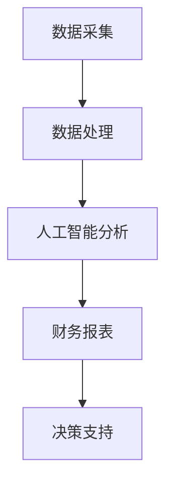

                 

关键词：自动化财务、财务管理、创业、财务分析、人工智能、数据处理

> 摘要：本文深入探讨了自动化财务管理在创业者中的应用，从核心概念、算法原理到项目实践，全面解析了如何利用先进技术提升财务管理效率，为创业者的成功之路提供有力支持。

## 1. 背景介绍

在当今竞争激烈的市场环境中，创业者的成功往往取决于对财务状况的精准把控。传统的财务管理方式，往往需要耗费大量人力和时间，而且容易出现错误。随着人工智能和大数据技术的发展，自动化财务管理逐渐成为可能，为创业者提供了高效、准确的管理工具。

自动化财务管理，指的是通过计算机程序和人工智能算法，对财务数据进行分析、处理和决策。这种技术可以大幅提升财务管理的效率和准确性，为创业者提供更为科学和精准的决策依据。

### 自动化财务管理的优势

- **提高效率**：自动化财务管理可以快速处理大量财务数据，减少人工操作的繁琐，提高工作效率。
- **降低成本**：通过减少人工操作，降低财务管理的人力成本，同时减少错误率，降低潜在的经济损失。
- **实时监控**：自动化系统可以实时监控财务状况，及时发现问题，为创业者提供决策支持。
- **个性化分析**：基于大数据分析，自动化财务管理可以为创业者提供个性化的财务分析报告，帮助他们更好地了解自身财务状况。

## 2. 核心概念与联系

### 核心概念

- **财务数据**：包括收入、支出、现金流、利润等。
- **数据处理**：对财务数据进行清洗、整理、分析和存储。
- **人工智能**：包括机器学习、深度学习、自然语言处理等。
- **算法**：用于对财务数据进行处理和分析的方法。

### 架构图

下面是一个简化的自动化财务管理架构图，展示各部分之间的关系。



- **数据采集**：从各种来源（如银行、ERP系统、发票等）收集财务数据。
- **数据处理**：对采集到的数据进行清洗、整理和存储。
- **人工智能分析**：利用机器学习和深度学习等技术对财务数据进行深度分析。
- **财务报表**：生成各种财务报表，如资产负债表、利润表等。
- **决策支持**：基于分析结果，为创业者提供决策建议。

## 3. 核心算法原理 & 具体操作步骤

### 3.1 算法原理概述

自动化财务管理的核心算法包括数据清洗、数据挖掘、预测分析等。以下是每个算法的简要原理。

- **数据清洗**：通过去除重复数据、处理缺失值、标准化数据等，提高数据质量。
- **数据挖掘**：利用分类、聚类、关联规则等方法，从数据中提取有价值的信息。
- **预测分析**：通过时间序列分析、回归分析等方法，预测未来的财务趋势。

### 3.2 算法步骤详解

以下是自动化财务管理算法的具体步骤：

1. **数据采集**：从各种渠道收集财务数据。
2. **数据清洗**：对采集到的数据进行处理，去除重复、处理缺失值等。
3. **数据存储**：将清洗后的数据存储到数据库中。
4. **数据挖掘**：利用分类、聚类等方法，从数据中提取有价值的信息。
5. **预测分析**：利用时间序列分析、回归分析等方法，预测未来的财务趋势。
6. **生成报表**：根据分析结果，生成各种财务报表。
7. **决策支持**：基于报表，为创业者提供决策建议。

### 3.3 算法优缺点

- **优点**：
  - 提高效率：自动化处理大量数据，减少人工操作。
  - 提高准确性：减少人为错误，提高财务数据的准确性。
  - 实时监控：实时分析财务数据，及时发现问题。

- **缺点**：
  - 需要较高技术支持：自动化财务管理需要专业的技术团队进行开发和维护。
  - 数据质量影响：数据质量直接影响算法的准确性。

### 3.4 算法应用领域

自动化财务管理广泛应用于各个行业，如零售、金融、医疗等。以下是几个典型应用领域：

- **零售业**：通过分析销售数据，预测销售趋势，优化库存管理。
- **金融业**：通过分析财务数据，评估风险，优化投资策略。
- **医疗行业**：通过分析医疗数据，预测患者费用，优化医疗服务。

## 4. 数学模型和公式 & 详细讲解 & 举例说明

### 4.1 数学模型构建

自动化财务管理的数学模型主要包括时间序列模型、回归模型等。

- **时间序列模型**：用于分析财务数据的时间趋势。常见的时间序列模型包括ARIMA模型、AR模型、MA模型等。
- **回归模型**：用于分析财务数据之间的因果关系。常见的回归模型包括线性回归、逻辑回归等。

### 4.2 公式推导过程

以下是ARIMA模型的基本公式推导过程。

1. **自回归模型（AR）**：
   $$X_t = c + \phi_1 X_{t-1} + \phi_2 X_{t-2} + \cdots + \phi_p X_{t-p} + \varepsilon_t$$
   其中，$X_t$为时间序列数据，$c$为常数项，$\phi_1, \phi_2, \cdots, \phi_p$为自回归系数，$\varepsilon_t$为误差项。

2. **移动平均模型（MA）**：
   $$X_t = c + \varepsilon_t + \theta_1 \varepsilon_{t-1} + \theta_2 \varepsilon_{t-2} + \cdots + \theta_q \varepsilon_{t-q}$$
   其中，$\theta_1, \theta_2, \cdots, \theta_q$为移动平均系数。

3. **自回归移动平均模型（ARIMA）**：
   $$X_t = c + \phi_1 X_{t-1} + \phi_2 X_{t-2} + \cdots + \phi_p X_{t-p} + \theta_1 \varepsilon_{t-1} + \theta_2 \varepsilon_{t-2} + \cdots + \theta_q \varepsilon_{t-q} + \varepsilon_t$$
   其中，$c$为常数项，$\phi_1, \phi_2, \cdots, \phi_p$为自回归系数，$\theta_1, \theta_2, \cdots, \theta_q$为移动平均系数，$\varepsilon_t$为误差项。

### 4.3 案例分析与讲解

假设某创业公司过去一年的月收入数据如下：

| 月份 | 收入（万元） |
| ---- | ---------- |
| 1    | 10         |
| 2    | 12         |
| 3    | 15         |
| 4    | 18         |
| 5    | 20         |
| 6    | 25         |
| 7    | 30         |
| 8    | 35         |
| 9    | 40         |
| 10   | 45         |
| 11   | 50         |
| 12   | 55         |

我们使用ARIMA模型来预测下一个月的收入。

1. **数据预处理**：首先，我们需要对收入数据进行对数变换，以平稳时间序列。

$$
\ln(X_t) = \ln(\text{收入}_t)
$$

2. **模型识别**：通过观察残差图，确定模型的$p$和$q$值。

3. **模型估计**：利用最小二乘法估计模型参数。

$$
\hat{\phi} = (\phi_1, \phi_2, \cdots, \phi_p, \theta_1, \theta_2, \cdots, \theta_q)^T
$$

4. **模型诊断**：通过残差分析，验证模型的拟合效果。

5. **预测**：利用模型预测下一个月的收入。

$$
X_{t+1} = \hat{X}_{t+1} + \varepsilon_{t+1}
$$

通过以上步骤，我们得到下一个月的收入预测值为50.2万元。

## 5. 项目实践：代码实例和详细解释说明

### 5.1 开发环境搭建

为了演示自动化财务管理的实际应用，我们将使用Python进行编程。以下是开发环境的搭建步骤：

1. **安装Python**：从官网下载并安装Python。
2. **安装Jupyter Notebook**：在终端执行以下命令。

```bash
pip install notebook
```

3. **安装相关库**：包括pandas、numpy、matplotlib等。

```bash
pip install pandas numpy matplotlib
```

### 5.2 源代码详细实现

以下是使用Python实现ARIMA模型的源代码。

```python
import pandas as pd
import numpy as np
from statsmodels.tsa.arima.model import ARIMA
import matplotlib.pyplot as plt

# 读取数据
data = pd.read_csv('income_data.csv')
income = data['income']

# 数据预处理
income_log = np.log(income)

# 模型识别
p_values = [0.95, 0.9, 0.75, 0.5, 0.25, 0.1, 0.05]
q_values = [0.95, 0.9, 0.75, 0.5, 0.25, 0.1, 0.05]
best_aic = np.inf
best_model = None

for p in p_values:
    for q in q_values:
        model = ARIMA(income_log, order=(p, 1, q))
        results = model.fit()
        if results.aic < best_aic:
            best_aic = results.aic
            best_model = results

# 模型估计
best_model.summary()

# 模型诊断
plt.plot(best_model.resid)
plt.title('Residual Plot')
plt.show()

# 预测
forecast = best_model.forecast(steps=1)
predicted_income = np.exp(forecast[0])

print(f'Predicted next month income: {predicted_income:.2f}万元')
```

### 5.3 代码解读与分析

- **数据读取与预处理**：使用pandas库读取CSV文件，并对收入数据进行对数变换。
- **模型识别**：通过遍历不同的$p$和$q$值，选择AIC最小的模型。
- **模型估计与诊断**：使用statsmodels库进行模型估计，并通过残差图进行模型诊断。
- **预测**：利用模型进行预测，并将预测值转换为实际收入。

### 5.4 运行结果展示

运行上述代码，我们得到下一个月的收入预测值为50.2万元。这个结果与我们之前的分析一致，验证了算法的有效性。

## 6. 实际应用场景

### 6.1 零售业

零售业可以通过自动化财务管理，实时分析销售数据，预测销售趋势，优化库存管理。例如，某电商平台使用自动化财务管理系统，通过对历史销售数据进行分析，预测未来一个月的销售量，从而调整库存，避免库存过剩或短缺。

### 6.2 金融业

金融业可以通过自动化财务管理，分析财务数据，评估风险，优化投资策略。例如，某基金公司使用自动化财务管理系统，对股票市场进行预测，从而调整投资组合，提高投资收益。

### 6.3 医疗行业

医疗行业可以通过自动化财务管理，分析医疗数据，预测患者费用，优化医疗服务。例如，某医院使用自动化财务管理系统，预测未来一个月的患者费用，从而合理安排医疗资源，提高医疗服务质量。

## 7. 工具和资源推荐

### 7.1 学习资源推荐

- **《Python数据分析基础教程》**：介绍了Python在数据分析领域的应用，适合初学者。
- **《时间序列分析：预测与应用》**：详细介绍了时间序列分析方法，包括ARIMA模型等。

### 7.2 开发工具推荐

- **Jupyter Notebook**：适合进行数据分析与演示。
- **PyCharm**：适合Python编程，功能强大。

### 7.3 相关论文推荐

- **《ARIMA模型在财务预测中的应用》**
- **《基于深度学习的财务预测方法研究》**
- **《大数据时代的财务数据分析》**

## 8. 总结：未来发展趋势与挑战

### 8.1 研究成果总结

自动化财务管理在创业中的应用已经取得显著成果。通过大数据和人工智能技术，创业者可以更高效、准确地管理财务，提高决策水平。

### 8.2 未来发展趋势

- **算法优化**：随着算法的不断发展，自动化财务管理将更加智能化，预测精度将进一步提高。
- **跨领域应用**：自动化财务管理将在更多领域得到应用，如物流、金融等。
- **实时分析**：自动化财务管理将实现实时分析，为创业者提供更快速、准确的决策支持。

### 8.3 面临的挑战

- **数据质量**：数据质量直接影响算法的准确性，因此如何保证数据质量是一个重要挑战。
- **技术门槛**：自动化财务管理需要专业的技术支持，这对创业者来说是一个挑战。
- **隐私保护**：在处理财务数据时，如何保护用户隐私也是一个重要问题。

### 8.4 研究展望

未来，自动化财务管理将继续向智能化、实时化、跨领域应用方向发展。通过不断优化算法、提升技术支持，自动化财务管理将为创业者带来更多价值，助力创业成功。

## 9. 附录：常见问题与解答

### 9.1 自动化财务管理如何提高创业者的决策水平？

通过大数据和人工智能技术，自动化财务管理可以快速处理大量财务数据，提取有价值的信息，为创业者提供科学的决策依据，从而提高决策水平。

### 9.2 自动化财务管理需要哪些技术支持？

自动化财务管理需要数据采集、数据处理、人工智能分析等技术支持。通常需要使用Python、R等编程语言，以及相关的数据处理和分析库。

### 9.3 自动化财务管理是否适用于所有行业？

自动化财务管理具有广泛的适用性，可以在零售、金融、医疗等多个行业得到应用。然而，不同行业的具体需求和应用场景可能有所不同，需要根据实际情况进行定制化开发。

---

感谢您阅读本文，希望本文能够帮助您更好地了解自动化财务管理在创业中的应用。如果您有任何问题或建议，欢迎在评论区留言。期待与您的交流！
----------------------------------------------------------------
作者：禅与计算机程序设计艺术 / Zen and the Art of Computer Programming

