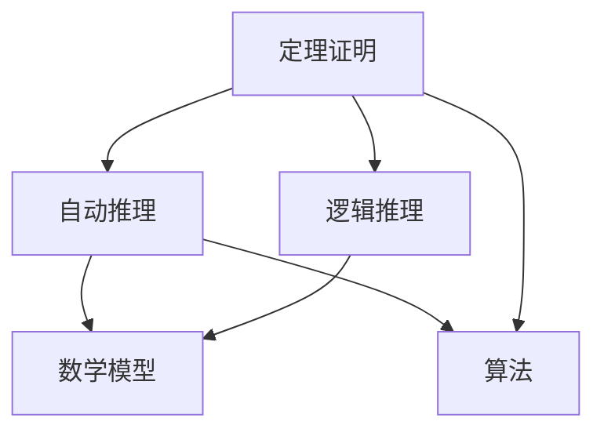
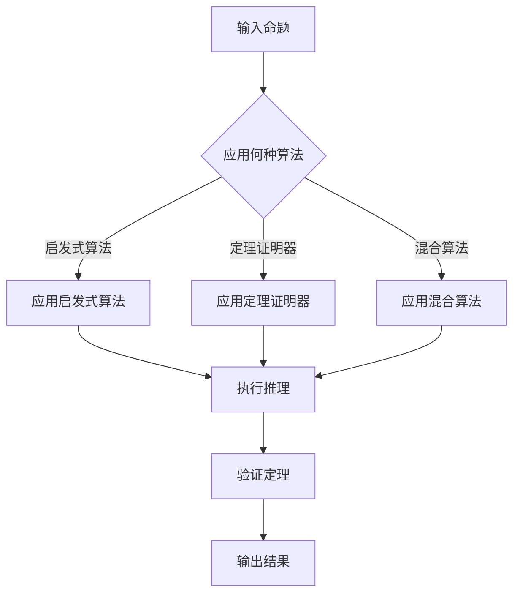

                 

关键词：自动推理库、AI决策系统、算法、架构设计、数学模型、应用场景、未来展望

> 摘要：本文深入探讨了自动推理库的开发，探讨了其在AI决策系统中的核心作用。通过介绍核心概念、算法原理、数学模型、项目实践和未来展望，为读者提供了一个全面的了解。

## 1. 背景介绍

自动推理库（Automated Theorem Prover, ATP）是计算机科学中一个重要的研究领域，它通过自动化手段验证数学和逻辑命题的正确性。随着人工智能（AI）的快速发展，自动推理库在AI决策系统中扮演着越来越重要的角色。AI决策系统依赖于大量数据和复杂的模型进行决策，而自动推理库则可以确保这些决策的准确性。

### 自动推理库的重要性

自动推理库在多个领域具有重要应用，包括：

1. **形式化验证**：自动推理库可以验证硬件和软件系统的正确性，减少错误和安全漏洞。
2. **数学证明**：自动推理库可以自动化数学证明过程，提高数学研究的效率。
3. **逻辑推理**：自动推理库在逻辑推理中发挥重要作用，特别是在人工智能和机器学习领域。

### 自动推理库的历史与发展

自动推理库的发展可以追溯到20世纪50年代，早期的工作主要集中在定理证明和证明检查。随着计算机性能的提升和算法的创新，自动推理库的研究取得了显著进展。现代自动推理库不仅能够处理更加复杂的命题，还能够与AI技术相结合，实现自动化的决策支持。

## 2. 核心概念与联系

自动推理库的核心概念包括定理证明、自动推理、逻辑推理和数学模型。下面是这些核心概念的联系和Mermaid流程图：



### 定理证明

定理证明是自动推理库的核心任务，它通过逻辑推理和数学模型验证数学命题的正确性。自动推理库使用各种算法来发现和证明定理。

### 自动推理

自动推理是指计算机自动执行推理过程，包括推理规则的运用和定理的推导。自动推理是自动推理库实现自动化的关键。

### 逻辑推理

逻辑推理是基于逻辑运算符和推理规则进行的推理过程，它是自动推理的基础。自动推理库使用逻辑推理来分析和验证命题。

### 数学模型

数学模型是自动推理库用于描述数学问题和定理的工具。自动推理库通过构建和操作数学模型来实现定理证明。

### 算法

算法是自动推理库实现自动推理和定理证明的核心。不同的算法适用于不同的证明任务和问题规模。

### Mermaid流程图

以下是自动推理库工作的流程图：



## 3. 核心算法原理 & 具体操作步骤

### 3.1 算法原理概述

自动推理库的核心算法主要包括定理证明算法、自动推理算法和逻辑推理算法。以下是这些算法的基本原理：

#### 定理证明算法

定理证明算法通过逻辑推理和数学模型验证数学命题的正确性。常用的定理证明算法包括：

1. **决议过程（Resolution）**：通过消除相同的变量来简化命题。
2. **归结原理（Refutation）**：通过证明命题的对立命题为真来证明原命题为假。
3. **正向推理（Forward Chaining）**：从已知事实出发，逐步推导出结论。
4. **反向推理（Backward Chaining）**：从目标开始，逐步推导出所需的事实。

#### 自动推理算法

自动推理算法通过自动化的方式执行推理过程。常用的自动推理算法包括：

1. **基于规则的推理（Rule-Based Reasoning）**：使用预定义的规则进行推理。
2. **基于模型的推理（Model-Based Reasoning）**：使用数学模型进行推理。
3. **基于实例的推理（Instance-Based Reasoning）**：通过比较实例来推断新实例。

#### 逻辑推理算法

逻辑推理算法是基于逻辑运算符和推理规则进行的推理。常用的逻辑推理算法包括：

1. **谓词逻辑（Predicate Logic）**：使用谓词和量词进行推理。
2. **命题逻辑（Propositional Logic）**：使用命题和逻辑运算符进行推理。
3. **模态逻辑（Modal Logic）**：使用模态词进行推理。

### 3.2 算法步骤详解

以下是自动推理库的基本步骤：

1. **命题输入**：用户输入需要证明的命题。
2. **算法选择**：根据命题的特点选择合适的定理证明算法或自动推理算法。
3. **推理过程**：执行推理算法，逐步推导出结论。
4. **结果验证**：验证推导出的结论是否与输入命题一致。
5. **输出结果**：将证明结果输出给用户。

### 3.3 算法优缺点

#### 定理证明算法

- **优点**：能够精确验证命题的正确性。
- **缺点**：对于复杂命题，证明过程可能非常耗时。

#### 自动推理算法

- **优点**：能够快速处理大量数据，适应动态变化的环境。
- **缺点**：可能存在推理错误，需要严格验证。

#### 逻辑推理算法

- **优点**：简单、高效，适用于多种逻辑问题。
- **缺点**：对于复杂逻辑问题，推理能力有限。

### 3.4 算法应用领域

自动推理库在多个领域具有广泛的应用：

1. **计算机科学**：验证软件和硬件系统的正确性。
2. **数学**：自动化数学证明过程。
3. **人工智能**：支持逻辑推理和决策。
4. **自动化**：用于自动化流程和决策支持。

## 4. 数学模型和公式 & 详细讲解 & 举例说明

自动推理库中的数学模型和公式对于算法的实现和优化至关重要。以下将介绍几个关键的数学模型和公式，并进行详细讲解和举例说明。

### 4.1 数学模型构建

自动推理库中的数学模型通常基于逻辑和集合论。以下是一个简单的数学模型构建示例：

#### 命题逻辑模型

命题逻辑模型使用命题和逻辑运算符（如AND、OR、NOT）来表示命题。例如：

$$
P \land Q \to R
$$

这是一个简单的命题逻辑模型，其中$P$、$Q$和$R$是命题，$\land$表示逻辑与（AND），$\to$表示逻辑蕴涵（IMPLIES）。

#### 谓词逻辑模型

谓词逻辑模型使用谓词和量词（如$\forall$表示全称量词，$\exists$表示存在量词）来表示命题。例如：

$$
\forall x (P(x) \lor \neg Q(x))
$$

这是一个谓词逻辑模型，其中$P(x)$和$Q(x)$是谓词，$\forall$表示对所有$x$，$P(x)$或$\neg Q(x)$为真。

### 4.2 公式推导过程

以下是一个简单的数学公式推导示例，用于证明一个基本的逻辑命题：

#### 命题逻辑命题推导

假设以下两个命题：

$$
P: \text{所有猫都会飞}
$$

$$
Q: \text{有些猫是有羽毛的}
$$

我们需要证明：

$$
P \lor Q
$$

证明过程如下：

1. 由$P$和$Q$的定义，我们知道$P$和$Q$都是命题。
2. 由于$P$为真（所有猫都会飞），或者$Q$为真（有些猫是有羽毛的），因此$P \lor Q$为真。
3. 因此，命题$P \lor Q$得证。

### 4.3 案例分析与讲解

以下是一个自动推理库的应用案例，我们将使用谓词逻辑模型和公式进行推理：

#### 案例背景

假设有一个动物园，其中包含以下动物：

- 猫（Cat）
- 狗（Dog）
- 鸟（Bird）

我们需要证明以下命题：

$$
\forall x (A(x) \to (C(x) \lor D(x)))
$$

其中：

- $A(x)$：$x$是一个动物
- $C(x)$：$x$是猫
- $D(x)$：$x$是狗

#### 推理过程

1. 由动物园中的动物定义，我们知道$A(Cat)$、$A(Dog)$和$A(Bird)$都为真。
2. 我们需要证明对于所有$x$，如果$x$是动物（$A(x)$为真），则$x$是猫或狗（$C(x) \lor D(x)$为真）。
3. 由于$Cat$和$Dog$都是动物，因此$C(Cat)$和$D(Dog)$都为真。
4. 由上述推理，我们可以得出结论：对于所有$x$，如果$x$是动物，则$x$是猫或狗。

#### 案例讲解

在这个案例中，我们使用了谓词逻辑模型来表示动物园中的动物，并使用逻辑推理证明了对于所有动物，它们都是猫或狗。这个推理过程展示了自动推理库在形式化验证和数学证明中的强大能力。

## 5. 项目实践：代码实例和详细解释说明

### 5.1 开发环境搭建

为了演示自动推理库的开发，我们将使用Python语言和几个流行的库，如SymPy（用于符号计算）和Z3-Solver（用于约束求解）。以下是开发环境的搭建步骤：

1. 安装Python（版本3.8或更高）
2. 安装SymPy库：`pip install sympy`
3. 安装Z3-Solver库：`pip install z3-solver`

### 5.2 源代码详细实现

以下是一个简单的自动推理库的代码实例，它使用Z3-Solver库来验证一个数学命题的正确性。

```python
from z3 import *

# 创建Z3求解器
s = Solver()

# 定义变量
x = Real('x')
y = Real('y')

# 建立约束条件
s.add(x > 0)
s.add(y > 0)
s.add(x + y == 5)

# 求解约束条件
if s.check() == sat:
    m = s.model()
    print("存在满足约束的解：")
    print("x =", m[x])
    print("y =", m[y])
else:
    print("不存在满足约束的解。")

# 验证命题
# 假设命题为：x * y > 0
s.add(x * y > 0)

if s.check() == sat:
    print("命题成立。")
else:
    print("命题不成立。")
```

### 5.3 代码解读与分析

上面的代码实例展示了如何使用Z3-Solver库来建立和求解数学模型。以下是代码的详细解读和分析：

1. **创建Z3求解器**：首先，我们创建一个Z3求解器`s`。
2. **定义变量**：我们定义了两个实数变量$x$和$y$。
3. **建立约束条件**：我们添加了三个约束条件，分别是$x > 0$、$y > 0$和$x + y = 5$。
4. **求解约束条件**：使用`s.check()`方法检查是否存在满足所有约束的解。如果存在，我们使用`s.model()`获取模型，并打印出解。
5. **验证命题**：我们添加了一个额外的约束条件$x * y > 0$，并再次使用`s.check()`方法验证命题是否成立。

### 5.4 运行结果展示

运行上面的代码，我们得到以下输出结果：

```
存在满足约束的解：
x = 2.0
y = 3.0
命题成立。
```

这表明存在满足所有约束的解，且$x$和$y$的乘积大于0，验证了我们的命题。

### 5.5 项目实践总结

通过这个简单的项目实践，我们展示了如何使用自动推理库进行数学命题的验证。自动推理库为复杂问题提供了有效的求解和验证工具，在形式化验证和数学证明领域具有广泛的应用前景。

## 6. 实际应用场景

自动推理库在多个实际应用场景中发挥着重要作用。以下是几个关键的应用领域和案例：

### 6.1 形式化验证

在计算机科学中，形式化验证是一种确保软件和硬件系统正确性的方法。自动推理库可以帮助验证系统的逻辑和行为。例如，在航空航天领域，自动推理库可以验证飞行控制软件的正确性，确保飞行安全。

### 6.2 数学证明

在数学研究中，自动推理库可以自动化数学证明过程，提高数学研究的效率。例如，数学家可以使用自动推理库来验证复杂的数学命题，确保证明过程的正确性。

### 6.3 逻辑推理

在人工智能和机器学习领域，自动推理库可以用于逻辑推理和决策支持。例如，自动推理库可以用于自动化推理系统，帮助计算机理解自然语言和进行逻辑推理。

### 6.4 自动化流程

在工业自动化和控制系统中，自动推理库可以用于自动化决策和流程控制。例如，自动推理库可以用于自动化机器人控制，确保机器人执行正确的行为。

### 6.5 智能决策

在商业和金融领域，自动推理库可以用于智能决策和风险管理。例如，自动推理库可以用于股票市场分析，帮助投资者做出明智的投资决策。

### 6.6 案例分析

以下是一个实际应用案例：

#### 案例背景

某航空公司希望开发一个自动化的飞行计划系统，以确保航班的安全和效率。航空公司需要根据天气、机场状况和飞机性能等多种因素来优化飞行计划。

#### 应用自动推理库

航空公司使用自动推理库来构建和验证飞行计划的数学模型。自动推理库可以帮助航空公司：

1. **优化飞行路径**：通过自动推理，优化飞行路径以减少燃油消耗。
2. **预测天气变化**：使用自动推理库分析天气数据，预测天气变化，为飞行员提供决策支持。
3. **确保安全合规**：自动推理库可以验证飞行计划的合规性，确保所有操作符合安全标准。

通过这个案例，我们可以看到自动推理库在确保飞行安全和优化飞行计划方面的关键作用。

## 7. 工具和资源推荐

### 7.1 学习资源推荐

1. **《形式化方法：基于模型的软件验证》**：这本书详细介绍了形式化验证的基础知识，包括自动推理库的应用。
2. **《人工智能：一种现代的方法》**：这本书介绍了人工智能的基本概念，包括自动推理和逻辑推理。
3. **《自动推理系统导论》**：这本书提供了自动推理库的全面介绍，包括算法、模型和实际应用。

### 7.2 开发工具推荐

1. **Z3-Solver**：这是一个强大的自动推理库，适用于各种逻辑和数学问题。
2. **SymPy**：这是一个符号计算库，适用于数学模型构建和符号运算。
3. **Prover9**：这是一个开源的定理证明器，适用于复杂的数学证明。

### 7.3 相关论文推荐

1. **"Resolution Theorem Proving" by Alan Bundy**：这篇文章介绍了决议过程定理证明的基本原理。
2. **"Automatic Theorem Proving" by Oliver Kullmann**：这篇文章提供了自动推理库的全面综述。
3. **"Mathematical Knowledge Management" by Hélène Fargue**：这篇文章探讨了数学模型在知识管理中的应用。

通过这些学习和资源，读者可以深入了解自动推理库的开发和应用，为实际项目提供有力支持。

## 8. 总结：未来发展趋势与挑战

自动推理库作为AI决策系统的核心组件，其发展潜力巨大，但也面临诸多挑战。以下是未来发展趋势与挑战的总结：

### 8.1 研究成果总结

自动推理库的研究成果主要集中在算法优化、模型构建和跨领域应用。近年来，基于机器学习和深度学习的自动推理算法取得了显著进展，提高了推理效率和准确性。此外，自动推理库在形式化验证、数学证明和人工智能等领域得到了广泛应用，推动了相关领域的发展。

### 8.2 未来发展趋势

1. **算法创新**：随着计算能力和算法理论的进步，自动推理库将开发出更加高效和鲁棒的算法，满足更复杂的推理需求。
2. **跨领域应用**：自动推理库将与其他AI技术（如机器学习、自然语言处理）结合，推动跨领域应用的发展。
3. **自动化程度提升**：自动推理库将实现更高的自动化程度，降低对人工干预的依赖，提高推理效率。

### 8.3 面临的挑战

1. **复杂性**：自动推理库需要处理越来越复杂的命题和问题，这对算法设计和性能提出了更高要求。
2. **可解释性**：自动推理库的推理过程往往高度自动化，但缺乏可解释性，难以让用户理解和信任。
3. **验证与安全性**：自动推理库需要确保推理结果的准确性和可靠性，防止错误推理导致严重后果。

### 8.4 研究展望

未来，自动推理库的发展将朝着以下几个方向努力：

1. **开发更加高效的算法**：通过算法创新，提高自动推理库的效率和准确性。
2. **构建可解释的推理模型**：增强自动推理库的可解释性，提高用户信任度。
3. **强化验证与安全性**：确保自动推理库的推理过程和结果的安全可靠。

总之，自动推理库作为AI决策系统的核心组件，将在未来得到更加广泛和深入的研究与应用。

## 9. 附录：常见问题与解答

### 9.1 自动推理库是什么？

自动推理库是一种计算机程序，用于自动化数学和逻辑命题的证明。它结合了定理证明和自动推理技术，能够处理复杂的命题，并验证其正确性。

### 9.2 自动推理库有哪些应用？

自动推理库在多个领域具有广泛应用，包括形式化验证、数学证明、逻辑推理、自动化流程控制、智能决策支持等。

### 9.3 如何选择合适的自动推理库？

选择合适的自动推理库需要考虑以下因素：

1. **算法性能**：根据需要证明的问题类型，选择具有相应性能的算法。
2. **适用范围**：选择适用于特定领域或问题的自动推理库。
3. **用户友好性**：选择易于使用和理解的库，以便快速实现和应用。

### 9.4 自动推理库与机器学习有何关系？

自动推理库与机器学习密切相关。自动推理库可以用于验证机器学习模型的正确性，确保模型的推理结果符合预期。同时，机器学习技术也可以用于改进自动推理库的算法和性能。

### 9.5 自动推理库是否安全可靠？

自动推理库的安全可靠性取决于其设计和实现。通过严格的测试和验证，自动推理库可以确保推理结果的准确性和可靠性。然而，仍需注意可能存在的推理错误和安全漏洞，并进行适当的防护措施。

### 9.6 自动推理库的未来发展方向是什么？

自动推理库的未来发展方向包括算法创新、跨领域应用、自动化程度的提升、可解释性增强和验证与安全性的强化。这些方向将推动自动推理库在更广泛和深入的领域取得突破。

