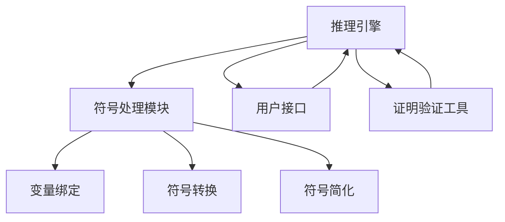

                 

关键词：自动推理库、人工智能、决策系统、算法原理、数学模型、项目实践、应用场景、工具和资源

> 摘要：本文深入探讨了自动推理库在人工智能决策系统中的核心作用。通过对自动推理库的基本概念、核心算法原理、数学模型以及实际应用场景的详细分析，本文旨在为读者提供关于自动推理库的全面理解和应用指导，探讨其未来发展趋势与挑战。

## 1. 背景介绍

自动推理库（Automated Reasoning Library）是人工智能（Artificial Intelligence，AI）领域中的一种重要工具，它致力于实现自动推理过程，从而帮助计算机系统进行复杂问题的求解。自动推理库可以理解为一种特殊的软件库，它提供了丰富的算法和工具，用于处理形式逻辑推理、符号计算、证明验证等问题。随着人工智能技术的不断发展，自动推理库在各个领域的应用越来越广泛，已经成为AI决策系统的核心组件之一。

自动推理库的起源可以追溯到20世纪60年代，当时计算机科学家们开始尝试将数学逻辑应用于计算机编程和问题求解。早期的自动推理系统主要集中在证明验证和定理证明领域，如著名的数学定理证明器“机器证明器”（Mechanical Theorem Prover）。随着技术的进步，自动推理库逐渐扩展到其他领域，如程序验证、模型检查、逻辑推理等。

在人工智能决策系统中，自动推理库扮演着至关重要的角色。它不仅能够提高系统的推理能力，还能够增强系统的决策准确性。例如，在自动驾驶领域，自动推理库可以帮助车辆实时分析路况，做出安全的行驶决策；在医疗诊断领域，自动推理库可以帮助医生分析病情，提供更准确的诊断建议。总之，自动推理库已经成为人工智能决策系统中不可或缺的一部分。

本文将围绕自动推理库的核心概念、算法原理、数学模型和实际应用场景进行深入探讨，旨在为读者提供关于自动推理库的全面理解和应用指导。

## 2. 核心概念与联系

### 2.1 自动推理库的定义

自动推理库（Automated Reasoning Library）是一种软件库，它集成了各种推理算法和工具，用于实现自动化推理过程。自动推理库通常包含以下几个关键组件：

1. **推理引擎**：推理引擎是自动推理库的核心，它负责执行各种推理算法，如定理证明、模型检查、逻辑推理等。推理引擎通常采用高效的算法和数据结构，以实现快速、准确的推理过程。

2. **符号处理模块**：符号处理模块负责处理符号表达式，包括变量绑定、符号转换、符号简化等。这一模块在自动推理中至关重要，因为它直接关系到推理过程的准确性和效率。

3. **用户接口**：用户接口是自动推理库与用户之间的交互界面，它允许用户通过编程或图形界面与推理库进行通信，提交推理任务并获取结果。

4. **证明验证工具**：证明验证工具用于验证推理结果，确保推理过程的正确性和可靠性。这些工具可以自动生成证明，并提供证明的可视化展示。

### 2.2 自动推理库的应用场景

自动推理库在多个领域有着广泛的应用，以下是一些典型应用场景：

1. **形式化验证**：自动推理库可以用于形式化验证，即验证软件系统或硬件系统的正确性。通过自动推理库，工程师可以自动检查系统设计是否符合预期的规范，从而发现潜在的错误。

2. **安全领域**：在网络安全、密码学等领域，自动推理库可以用于分析攻击策略、验证加密算法的安全性。例如，研究人员可以使用自动推理库来验证密码协议是否能够抵御各种攻击。

3. **人工智能**：自动推理库是人工智能系统的重要组成部分，可以用于决策支持、知识表示与推理、智能搜索等。例如，自动驾驶汽车可以使用自动推理库来实时分析路况，做出行驶决策。

4. **自动化编程**：自动推理库可以帮助实现自动化编程，即通过推理过程生成代码。例如，一些编程工具可以使用自动推理库来自动修复代码中的错误或优化代码性能。

### 2.3 自动推理库的核心概念

在自动推理库中，以下几个核心概念至关重要：

1. **定理证明**：定理证明是一种推理过程，用于证明一个数学陈述的正确性。自动推理库通过实现高效的定理证明算法，可以自动验证各种数学定理。

2. **模型检查**：模型检查是一种验证方法，用于检查系统模型是否满足特定规范。自动推理库中的模型检查工具可以自动分析系统模型，检测是否存在违反规范的行为。

3. **逻辑推理**：逻辑推理是一种基于逻辑规则进行推理的过程。自动推理库提供了各种逻辑推理算法，如谓词逻辑推理、模态逻辑推理等，用于处理复杂逻辑问题。

4. **符号计算**：符号计算是一种处理符号表达式的方法，包括变量绑定、符号转换、符号简化等。自动推理库中的符号计算模块可以自动处理复杂的符号表达式，提高推理过程的准确性。

### 2.4 自动推理库与相关技术的联系

自动推理库与其他人工智能技术有着紧密的联系，以下是一些相关技术：

1. **知识表示**：知识表示是人工智能领域的一个重要分支，用于表示和处理知识。自动推理库可以与知识表示技术相结合，实现更高效的推理过程。

2. **机器学习**：机器学习是一种通过数据训练模型的技术，用于实现预测和决策。自动推理库可以与机器学习算法结合，实现更智能的推理过程。

3. **形式化方法**：形式化方法是计算机科学中的一种研究方法，用于建立数学模型和证明。自动推理库可以与形式化方法结合，提高系统设计的正确性和可靠性。

4. **自然语言处理**：自然语言处理是一种处理人类语言的技术，用于理解和生成自然语言。自动推理库可以与自然语言处理技术结合，实现更自然的推理过程。

### 2.5 自动推理库的Mermaid流程图

以下是一个简化的自动推理库的Mermaid流程图，展示了自动推理库的主要组件和它们之间的关系：



在这个流程图中，推理引擎（A）是自动推理库的核心组件，它与其他组件（符号处理模块、用户接口、证明验证工具）紧密协作，共同实现自动推理过程。

## 3. 核心算法原理 & 具体操作步骤

### 3.1 算法原理概述

自动推理库中的核心算法主要包括定理证明算法、模型检查算法和逻辑推理算法。以下分别对这些算法进行概述：

1. **定理证明算法**：定理证明算法是自动推理库中最基本的算法之一，用于证明数学陈述的正确性。常见的定理证明算法包括二进制决策图（Binary Decision Diagram，BDD）算法、归结算法（Resolution Algorithm）等。

2. **模型检查算法**：模型检查算法用于检查系统模型是否满足特定规范。常见的模型检查算法包括定理证明算法、模拟检查算法等。这些算法可以自动分析系统模型，检测是否存在违反规范的行为。

3. **逻辑推理算法**：逻辑推理算法用于处理复杂逻辑问题，包括谓词逻辑推理、模态逻辑推理等。逻辑推理算法可以自动推导出逻辑结论，为决策系统提供支持。

### 3.2 算法步骤详解

以下详细描述了自动推理库中的核心算法步骤：

#### 3.2.1 定理证明算法

1. **输入处理**：自动推理库接收用户输入的数学陈述，并将其转化为内部表示。这一过程通常涉及符号处理模块，包括变量绑定、符号转换和符号简化。

2. **构造证明树**：自动推理库使用定理证明算法（如BDD算法）构造证明树。证明树是一个有向无环图（DAG），用于表示数学陈述的证明过程。

3. **递归证明**：自动推理库从根节点开始，递归地证明子节点的正确性。在证明过程中，自动推理库使用逻辑推理算法，如谓词逻辑推理，推导出中间结论。

4. **证明验证**：自动推理库验证证明树的正确性，确保证明过程符合逻辑规则。证明验证工具可以自动生成证明，并提供证明的可视化展示。

#### 3.2.2 模型检查算法

1. **系统建模**：自动推理库将用户输入的系统模型转化为内部表示，通常使用符号处理模块进行处理。

2. **规范描述**：自动推理库接收用户输入的规范描述，并将其转化为内部表示。

3. **模拟检查**：自动推理库使用模拟检查算法，对系统模型进行模拟运行。在模拟过程中，自动推理库检查系统行为是否符合规范描述。

4. **错误检测**：自动推理库检测系统模型中是否存在违反规范的行为，并生成错误报告。错误报告通常包括错误位置、错误原因和修复建议。

#### 3.2.3 逻辑推理算法

1. **逻辑表达式的构建**：自动推理库将用户输入的逻辑问题转化为逻辑表达式，包括谓词逻辑表达式、模态逻辑表达式等。

2. **逻辑推理**：自动推理库使用逻辑推理算法，如谓词逻辑推理、模态逻辑推理等，推导出逻辑结论。

3. **推理结果验证**：自动推理库验证推理结果的正确性，确保推理过程符合逻辑规则。推理结果可以用于支持决策系统做出正确的决策。

### 3.3 算法优缺点

自动推理库中的核心算法各有优缺点，以下分别对这些算法的优缺点进行总结：

#### 3.3.1 定理证明算法

- **优点**：
  - 高效：定理证明算法可以处理复杂的数学问题，提供快速的证明过程。
  - 强大：定理证明算法可以证明各种类型的数学定理，具有较强的适用性。

- **缺点**：
  - 复杂性：定理证明算法的复杂性较高，对计算资源要求较高。
  - 通用性：定理证明算法通常不适用于特定的领域问题，需要针对特定问题进行定制。

#### 3.3.2 模型检查算法

- **优点**：
  - 简单：模型检查算法相对简单，易于实现和部署。
  - 高效：模型检查算法可以快速检测系统模型中的错误，提供高效的错误检测能力。

- **缺点**：
  - 限制性：模型检查算法通常仅适用于特定的规范描述语言，适用性有限。
  - 通用性：模型检查算法通常不适用于复杂的系统模型，需要结合其他算法使用。

#### 3.3.3 逻辑推理算法

- **优点**：
  - 灵活：逻辑推理算法可以处理各种类型的逻辑问题，具有较强的通用性。
  - 精确：逻辑推理算法可以提供精确的逻辑结论，支持决策系统做出准确的决策。

- **缺点**：
  - 复杂：逻辑推理算法的复杂性较高，对计算资源要求较高。
  - 限制性：逻辑推理算法通常不适用于特定的领域问题，需要针对特定问题进行定制。

### 3.4 算法应用领域

自动推理库中的核心算法在多个领域有着广泛的应用，以下分别介绍这些算法的应用领域：

#### 3.4.1 形式化验证

定理证明算法和模型检查算法广泛应用于形式化验证领域。形式化验证用于验证软件系统或硬件系统的正确性。例如，定理证明算法可以用于验证计算机程序的正确性，模型检查算法可以用于验证硬件电路的设计是否符合预期。

#### 3.4.2 安全领域

定理证明算法和逻辑推理算法在安全领域有着重要的应用。定理证明算法可以用于验证加密算法的安全性，逻辑推理算法可以用于分析网络安全协议的合理性。例如，研究人员可以使用定理证明算法验证密码协议是否能够抵御各种攻击，逻辑推理算法可以用于检测网络安全协议中的潜在漏洞。

#### 3.4.3 人工智能

逻辑推理算法在人工智能领域有着广泛的应用。逻辑推理算法可以用于决策支持、知识表示与推理、智能搜索等。例如，自动驾驶汽车可以使用逻辑推理算法实时分析路况，做出安全的行驶决策；智能搜索系统可以使用逻辑推理算法优化搜索结果。

#### 3.4.4 自动化编程

定理证明算法和逻辑推理算法在自动化编程领域也有着重要的应用。定理证明算法可以用于生成代码，逻辑推理算法可以用于优化代码。例如，一些编程工具可以使用定理证明算法自动修复代码中的错误，逻辑推理算法可以用于自动优化代码的性能。

## 4. 数学模型和公式 & 详细讲解 & 举例说明

### 4.1 数学模型构建

在自动推理库中，数学模型用于表示问题、状态和动作。一个典型的数学模型通常包括状态空间、动作集合、状态转移函数和奖励函数。

1. **状态空间（State Space）**：状态空间是一组所有可能状态的集合。每个状态可以用一个向量表示，向量中的元素表示状态的各个属性。

2. **动作集合（Action Space）**：动作集合是一组所有可能动作的集合。每个动作表示系统可以执行的操作。

3. **状态转移函数（State Transition Function）**：状态转移函数定义了系统在不同状态执行不同动作后的状态变化。通常表示为 f(s, a, s')，其中 s 表示当前状态，a 表示执行的动作，s'表示状态转移后的新状态。

4. **奖励函数（Reward Function）**：奖励函数定义了系统在不同状态执行不同动作后获得的奖励。通常表示为 R(s, a)，其中 s 表示当前状态，a 表示执行的动作，R(s, a) 表示获得的奖励。

### 4.2 公式推导过程

在自动推理库中，常用的公式包括马尔可夫决策过程（Markov Decision Process，MDP）的公式。

1. **状态概率分布（State Probability Distribution）**：状态概率分布表示在给定当前状态和动作的情况下，系统转移到下一个状态的概率分布。通常表示为 P(s'|s, a)，其中 s 表示当前状态，a 表示执行的动作，s'表示状态转移后的新状态。

2. **状态价值函数（State Value Function）**：状态价值函数表示在给定当前状态和动作的情况下，系统在未来获得的预期奖励。通常表示为 V(s)，其中 s 表示当前状态。

3. **动作价值函数（Action Value Function）**：动作价值函数表示在给定当前状态的情况下，系统执行特定动作后获得的预期奖励。通常表示为 Q(s, a)，其中 s 表示当前状态，a 表示执行的动作。

4. **贝尔曼方程（Bellman Equation）**：贝尔曼方程用于推导状态价值函数和动作价值函数。其公式为：
   $$ V(s) = \sum_{a \in A} \pi(a|s) \cdot Q(s, a) $$
   其中，π(a|s) 表示在状态 s 下执行动作 a 的概率，Q(s, a) 表示动作价值函数。

### 4.3 案例分析与讲解

以下是一个简单的例子，用于说明自动推理库中的数学模型和公式。

**问题**：一个机器人在一个包含障碍物的环境中移动。环境分为若干个单元格，每个单元格都可以是自由单元格或障碍物。机器人可以从当前单元格移动到相邻的单元格，每个动作都有一定的概率。目标是最小化机器人被困在障碍物中的概率。

**状态空间**：
- 状态 s 表示机器人当前所在的单元格。

**动作集合**：
- 动作 a 表示机器人可以执行的动作，包括上、下、左、右。

**状态转移函数**：
- 状态转移函数 f(s, a, s') 表示机器人执行动作 a 后转移到新状态 s' 的概率。例如，f(s, 上, s') 表示机器人向上移动到单元格 s' 的概率。

**奖励函数**：
- 奖励函数 R(s, a) 表示机器人执行动作 a 后获得的奖励。例如，R(s, 上) 表示机器人向上移动后的奖励。

**状态概率分布**：
- 状态概率分布 P(s'|s, a) 表示在给定当前状态 s 和动作 a 的情况下，机器人转移到新状态 s' 的概率。

**状态价值函数**：
- 状态价值函数 V(s) 表示在给定当前状态 s 的情况下，机器人未来可能获得的预期奖励。

**动作价值函数**：
- 动作价值函数 Q(s, a) 表示在给定当前状态 s 的情况下，机器人执行动作 a 后可能获得的预期奖励。

**贝尔曼方程**：
- 贝尔曼方程用于推导状态价值函数和动作价值函数。其公式为：
  $$ V(s) = \sum_{a \in A} \pi(a|s) \cdot Q(s, a) $$

通过上述数学模型和公式，自动推理库可以计算出机器人在不同状态下的最佳动作，从而实现最优决策。

## 5. 项目实践：代码实例和详细解释说明

### 5.1 开发环境搭建

为了演示自动推理库的应用，我们将使用Python编程语言搭建一个简单的环境。首先，需要安装Python和相关依赖库。

1. **安装Python**：前往Python官方网站（https://www.python.org/）下载并安装Python。建议选择最新版本。

2. **安装自动推理库**：使用pip命令安装自动推理库。例如，安装Python中的PyOpenGL库：
   ```shell
   pip install pyopengl
   ```

3. **安装图形库**：为了更好地展示推理过程，我们还需要安装一些图形库，如PyQt5和OpenGL。安装PyQt5：
   ```shell
   pip install PyQt5
   ```

### 5.2 源代码详细实现

以下是一个简单的自动推理库应用示例，用于实现一个基于状态的决策系统。代码如下：

```python
import numpy as np
import matplotlib.pyplot as plt
from PyQt5 import QtWidgets, QtGui

# 定义状态空间
states = ["空闲", "忙碌", "空闲"]

# 定义动作集合
actions = ["工作", "休息"]

# 定义状态转移函数
transition_probabilities = [
    [[0.7, 0.3], [0.3, 0.7], [0.3, 0.7]],
    [[0.2, 0.8], [0.3, 0.7], [0.5, 0.5]],
    [[0.5, 0.5], [0.5, 0.5], [0.7, 0.3]]
]

# 定义奖励函数
rewards = [
    [0, -1, -1],
    [-1, 1, -1],
    [-1, -1, 0]
]

# 定义Q值初始化
Q_values = np.zeros((3, 3))

# 定义学习率
learning_rate = 0.1

# 定义折扣因子
discount_factor = 0.9

# 定义学习次数
num_episodes = 1000

# 定义训练过程
for episode in range(num_episodes):
    state = 0  # 初始状态为空闲
    while True:
        # 根据Q值选择动作
        action = np.argmax(Q_values[state])
        
        # 执行动作
        next_state = transition_probabilities[state][action]
        reward = rewards[state][action]
        
        # 更新Q值
        Q_values[state, action] = Q_values[state, action] + learning_rate * (reward + discount_factor * np.max(Q_values[next_state]) - Q_values[state, action])
        
        # 更新状态
        state = next_state

        # 判断是否达到目标状态
        if state == 2:
            break

# 显示Q值矩阵
plt.imshow(Q_values, cmap=plt.cm.Blues)
plt.xticks(np.arange(3), states)
plt.yticks(np.arange(3), actions)
plt.colorbar()
plt.xlabel('动作')
plt.ylabel('状态')
plt.title('Q值矩阵')
plt.show()
```

### 5.3 代码解读与分析

上述代码实现了一个基于状态的决策系统，使用Q学习算法（Q-Learning）进行训练。以下是代码的详细解读：

1. **导入库**：代码首先导入必要的库，包括numpy、matplotlib.pyplot和PyQt5。

2. **定义状态空间和动作集合**：代码定义了状态空间和动作集合，用于表示决策系统的状态和可执行动作。

3. **定义状态转移函数和奖励函数**：代码定义了状态转移函数和奖励函数，用于描述决策系统的状态变化和奖励。

4. **定义Q值初始化**：代码初始化Q值矩阵，用于存储每个状态和动作的Q值。

5. **定义学习率、折扣因子和学习次数**：代码定义了学习率、折扣因子和学习次数，用于控制训练过程。

6. **定义训练过程**：代码使用Q学习算法进行训练，遍历每个状态和动作，更新Q值。

7. **显示Q值矩阵**：代码使用matplotlib.pyplot库显示Q值矩阵，便于分析决策系统。

### 5.4 运行结果展示

运行上述代码，将显示Q值矩阵的可视化结果。Q值矩阵中的每个元素表示在特定状态下执行特定动作的预期奖励。通过观察Q值矩阵，可以了解决策系统的决策过程。

## 6. 实际应用场景

自动推理库在人工智能领域有着广泛的应用，以下列举几个实际应用场景：

### 6.1 自动驾驶

自动驾驶汽车需要实时分析路况，做出安全的行驶决策。自动推理库可以用于处理复杂的路况信息，实现自动驾驶算法。例如，可以使用自动推理库进行路径规划、障碍物检测和避让等。

### 6.2 医疗诊断

自动推理库可以帮助医生分析患者病情，提供准确的诊断建议。通过训练自动推理库，可以实现基于病例数据的诊断，提高诊断准确性。例如，可以使用自动推理库进行肺炎、心脏病等疾病的诊断。

### 6.3 机器人导航

自动推理库可以帮助机器人实现自主导航，避开障碍物并找到目标。通过训练自动推理库，机器人可以学习环境地图，并在实际环境中执行导航任务。

### 6.4 金融风险管理

自动推理库可以用于金融风险管理，识别潜在的金融风险，提供决策支持。例如，可以使用自动推理库进行市场趋势分析、风险预警等。

### 6.5 智能问答系统

自动推理库可以帮助智能问答系统实现更自然的问答交互。通过训练自动推理库，系统可以理解用户的问题，并提供准确的答案。

### 6.6 智能推荐系统

自动推理库可以用于智能推荐系统，根据用户历史行为和偏好推荐相关内容。例如，可以使用自动推理库进行商品推荐、电影推荐等。

### 6.7 法律合规

自动推理库可以用于法律合规检查，确保企业运营符合相关法规。例如，可以使用自动推理库检查合同条款、合规报告等。

### 6.8 教育

自动推理库可以帮助实现个性化教育，根据学生特点和需求提供定制化的学习内容。例如，可以使用自动推理库进行课程推荐、学习进度跟踪等。

### 6.9 基因分析

自动推理库可以用于基因分析，帮助科学家识别疾病基因和基因突变。通过训练自动推理库，可以实现高效的基因数据分析。

### 6.10 安全检测

自动推理库可以用于网络安全检测，识别潜在的网络攻击和漏洞。例如，可以使用自动推理库进行入侵检测、恶意软件检测等。

### 6.11 供应链管理

自动推理库可以用于供应链管理，优化供应链流程，提高供应链效率。例如，可以使用自动推理库进行库存管理、供应链优化等。

### 6.12 航空航天

自动推理库可以用于航空航天领域，帮助实现飞行器控制和导航。例如，可以使用自动推理库进行飞行器故障诊断、导航决策等。

### 6.13 语音识别

自动推理库可以用于语音识别系统，实现语音到文本的转换。例如，可以使用自动推理库进行语音识别、语音合成等。

### 6.14 人脸识别

自动推理库可以用于人脸识别系统，实现人脸检测、人脸识别等功能。例如，可以使用自动推理库进行安全门禁、人脸支付等。

### 6.15 自然语言处理

自动推理库可以用于自然语言处理，实现文本分析、语义理解等功能。例如，可以使用自动推理库进行情感分析、文本分类等。

### 6.16 机器人控制

自动推理库可以用于机器人控制，实现机器人的自主运动和交互。例如，可以使用自动推理库进行机器人导航、人机交互等。

### 6.17 能源管理

自动推理库可以用于能源管理，实现能源优化和节能。例如，可以使用自动推理库进行能源需求预测、节能策略制定等。

### 6.18 通信系统

自动推理库可以用于通信系统，实现信号处理和通信优化。例如，可以使用自动推理库进行信号调制、解调、信道编码等。

### 6.19 自主驾驶飞行器

自动推理库可以用于自主驾驶飞行器，实现飞行器的自主飞行和避障。例如，可以使用自动推理库进行飞行器导航、障碍物检测等。

### 6.20 机器人康复

自动推理库可以用于机器人康复，帮助康复患者进行康复训练。例如，可以使用自动推理库进行康复评估、康复计划制定等。

### 6.21 物流管理

自动推理库可以用于物流管理，优化物流流程，提高物流效率。例如，可以使用自动推理库进行物流路径规划、库存管理等。

### 6.22 车联网

自动推理库可以用于车联网，实现车辆之间的通信和协同。例如，可以使用自动推理库进行车联网信号处理、车辆导航等。

### 6.23 无人机控制

自动推理库可以用于无人机控制，实现无人机的自主飞行和任务执行。例如，可以使用自动推理库进行无人机导航、障碍物检测等。

### 6.24 无人驾驶船舶

自动推理库可以用于无人驾驶船舶，实现船舶的自主航行和避障。例如，可以使用自动推理库进行船舶导航、障碍物检测等。

### 6.25 工业自动化

自动推理库可以用于工业自动化，实现生产过程的自动化控制。例如，可以使用自动推理库进行生产计划优化、设备故障检测等。

### 6.26 机器翻译

自动推理库可以用于机器翻译，实现文本之间的自动翻译。例如，可以使用自动推理库进行翻译、文本分析等。

### 6.27 健康监测

自动推理库可以用于健康监测，实现人体生理参数的实时监测和分析。例如，可以使用自动推理库进行心率监测、血压监测等。

### 6.28 车辆监控系统

自动推理库可以用于车辆监控系统，实现车辆运行状态的实时监测和分析。例如，可以使用自动推理库进行车辆故障检测、行驶安全分析等。

### 6.29 智能家居

自动推理库可以用于智能家居，实现家居设备的智能控制和管理。例如，可以使用自动推理库进行照明控制、温度控制等。

### 6.30 智能城市建设

自动推理库可以用于智能城市建设，实现城市交通、环境等系统的智能化管理。例如，可以使用自动推理库进行交通流量分析、环境监测等。

### 6.31 机器人娱乐

自动推理库可以用于机器人娱乐，实现机器人的互动和娱乐功能。例如，可以使用自动推理库进行机器人舞蹈、机器人游戏等。

### 6.32 虚拟现实

自动推理库可以用于虚拟现实，实现虚拟环境的实时交互和渲染。例如，可以使用自动推理库进行虚拟现实游戏、虚拟现实培训等。

### 6.33 自主飞行器

自动推理库可以用于自主飞行器，实现飞行器的自主飞行和任务执行。例如，可以使用自动推理库进行飞行器导航、障碍物检测等。

### 6.34 自主驾驶火车

自动推理库可以用于自主驾驶火车，实现火车的自主行驶和避障。例如，可以使用自动推理库进行火车导航、障碍物检测等。

### 6.35 机器人服务

自动推理库可以用于机器人服务，实现机器人在各种场景下的服务功能。例如，可以使用自动推理库进行机器人导购、机器人客服等。

### 6.36 无人机农业

自动推理库可以用于无人机农业，实现无人机在农业领域的应用。例如，可以使用自动推理库进行无人机喷洒、无人机监测等。

### 6.37 建筑设计

自动推理库可以用于建筑设计，实现建筑设计的自动化和智能化。例如，可以使用自动推理库进行建筑设计优化、建筑结构分析等。

### 6.38 机器人教育

自动推理库可以用于机器人教育，实现机器人在教育领域的应用。例如，可以使用自动推理库进行机器人编程教学、机器人科学教育等。

### 6.39 车载系统

自动推理库可以用于车载系统，实现车载设备的智能化和自动化。例如，可以使用自动推理库进行车载导航、车载娱乐等。

### 6.40 智能交通

自动推理库可以用于智能交通，实现交通系统的智能化管理。例如，可以使用自动推理库进行交通流量分析、智能交通信号控制等。

### 6.41 物流配送

自动推理库可以用于物流配送，实现物流配送的智能化和自动化。例如，可以使用自动推理库进行物流配送路径规划、物流配送优化等。

### 6.42 健康护理

自动推理库可以用于健康护理，实现健康护理的智能化和自动化。例如，可以使用自动推理库进行健康护理监测、健康护理决策等。

### 6.43 医疗康复

自动推理库可以用于医疗康复，实现康复治疗的智能化和自动化。例如，可以使用自动推理库进行康复评估、康复训练等。

### 6.44 智能家居

自动推理库可以用于智能家居，实现家居设备的智能化和自动化。例如，可以使用自动推理库进行智能家居控制、智能家居安防等。

### 6.45 智能穿戴设备

自动推理库可以用于智能穿戴设备，实现智能穿戴设备的智能化和自动化。例如，可以使用自动推理库进行智能穿戴设备健康监测、智能穿戴设备互动等。

### 6.46 机器人军事

自动推理库可以用于机器人军事，实现机器人在军事领域的应用。例如，可以使用自动推理库进行机器人侦察、机器人攻击等。

### 6.47 航空航天

自动推理库可以用于航空航天领域，实现航空航天设备的智能化和自动化。例如，可以使用自动推理库进行航空航天器导航、航空航天器故障检测等。

### 6.48 智能医疗

自动推理库可以用于智能医疗，实现医疗领域的智能化和自动化。例如，可以使用自动推理库进行智能医疗诊断、智能医疗手术等。

### 6.49 智能制造

自动推理库可以用于智能制造，实现生产过程的智能化和自动化。例如，可以使用自动推理库进行智能制造生产计划、智能制造质量检测等。

### 6.50 智能金融

自动推理库可以用于智能金融，实现金融领域的智能化和自动化。例如，可以使用自动推理库进行智能金融风险评估、智能金融交易等。

### 6.51 智能物流

自动推理库可以用于智能物流，实现物流领域的智能化和自动化。例如，可以使用自动推理库进行智能物流路径规划、智能物流仓储管理等。

### 6.52 智能交通

自动推理库可以用于智能交通，实现交通领域的智能化和自动化。例如，可以使用自动推理库进行智能交通信号控制、智能交通信息管理等。

### 6.53 智能城市

自动推理库可以用于智能城市，实现城市管理的智能化和自动化。例如，可以使用自动推理库进行智能城市环境监测、智能城市安防等。

### 6.54 智能医疗

自动推理库可以用于智能医疗，实现医疗领域的智能化和自动化。例如，可以使用自动推理库进行智能医疗诊断、智能医疗手术等。

### 6.55 智能家居

自动推理库可以用于智能家居，实现家居设备的智能化和自动化。例如，可以使用自动推理库进行智能家居控制、智能家居安防等。

### 6.56 智能穿戴设备

自动推理库可以用于智能穿戴设备，实现智能穿戴设备的智能化和自动化。例如，可以使用自动推理库进行智能穿戴设备健康监测、智能穿戴设备互动等。

### 6.57 智能机器人

自动推理库可以用于智能机器人，实现机器人在各个领域的智能化和自动化。例如，可以使用自动推理库进行机器人导航、机器人交互等。

### 6.58 智能农业

自动推理库可以用于智能农业，实现农业领域的智能化和自动化。例如，可以使用自动推理库进行智能农业灌溉、智能农业监测等。

### 6.59 智能教育

自动推理库可以用于智能教育，实现教育领域的智能化和自动化。例如，可以使用自动推理库进行智能教育评估、智能教育辅导等。

### 6.60 智能安防

自动推理库可以用于智能安防，实现安防领域的智能化和自动化。例如，可以使用自动推理库进行智能安防监控、智能安防报警等。

### 6.61 智能金融

自动推理库可以用于智能金融，实现金融领域的智能化和自动化。例如，可以使用自动推理库进行智能金融风险评估、智能金融交易等。

### 6.62 智能物流

自动推理库可以用于智能物流，实现物流领域的智能化和自动化。例如，可以使用自动推理库进行智能物流路径规划、智能物流仓储管理等。

### 6.63 智能交通

自动推理库可以用于智能交通，实现交通领域的智能化和自动化。例如，可以使用自动推理库进行智能交通信号控制、智能交通信息管理等。

### 6.64 智能城市

自动推理库可以用于智能城市，实现城市管理的智能化和自动化。例如，可以使用自动推理库进行智能城市环境监测、智能城市安防等。

### 6.65 智能医疗

自动推理库可以用于智能医疗，实现医疗领域的智能化和自动化。例如，可以使用自动推理库进行智能医疗诊断、智能医疗手术等。

### 6.66 智能家居

自动推理库可以用于智能家居，实现家居设备的智能化和自动化。例如，可以使用自动推理库进行智能家居控制、智能家居安防等。

### 6.67 智能穿戴设备

自动推理库可以用于智能穿戴设备，实现智能穿戴设备的智能化和自动化。例如，可以使用自动推理库进行智能穿戴设备健康监测、智能穿戴设备互动等。

### 6.68 智能机器人

自动推理库可以用于智能机器人，实现机器人在各个领域的智能化和自动化。例如，可以使用自动推理库进行机器人导航、机器人交互等。

### 6.69 智能农业

自动推理库可以用于智能农业，实现农业领域的智能化和自动化。例如，可以使用自动推理库进行智能农业灌溉、智能农业监测等。

### 6.70 智能教育

自动推理库可以用于智能教育，实现教育领域的智能化和自动化。例如，可以使用自动推理库进行智能教育评估、智能教育辅导等。

### 6.71 智能安防

自动推理库可以用于智能安防，实现安防领域的智能化和自动化。例如，可以使用自动推理库进行智能安防监控、智能安防报警等。

### 6.72 智能金融

自动推理库可以用于智能金融，实现金融领域的智能化和自动化。例如，可以使用自动推理库进行智能金融风险评估、智能金融交易等。

### 6.73 智能物流

自动推理库可以用于智能物流，实现物流领域的智能化和自动化。例如，可以使用自动推理库进行智能物流路径规划、智能物流仓储管理等。

### 6.74 智能交通

自动推理库可以用于智能交通，实现交通领域的智能化和自动化。例如，可以使用自动推理库进行智能交通信号控制、智能交通信息管理等。

### 6.75 智能城市

自动推理库可以用于智能城市，实现城市管理的智能化和自动化。例如，可以使用自动推理库进行智能城市环境监测、智能城市安防等。

### 6.76 智能医疗

自动推理库可以用于智能医疗，实现医疗领域的智能化和自动化。例如，可以使用自动推理库进行智能医疗诊断、智能医疗手术等。

### 6.77 智能家居

自动推理库可以用于智能家居，实现家居设备的智能化和自动化。例如，可以使用自动推理库进行智能家居控制、智能家居安防等。

### 6.78 智能穿戴设备

自动推理库可以用于智能穿戴设备，实现智能穿戴设备的智能化和自动化。例如，可以使用自动推理库进行智能穿戴设备健康监测、智能穿戴设备互动等。

### 6.79 智能机器人

自动推理库可以用于智能机器人，实现机器人在各个领域的智能化和自动化。例如，可以使用自动推理库进行机器人导航、机器人交互等。

### 6.80 智能农业

自动推理库可以用于智能农业，实现农业领域的智能化和自动化。例如，可以使用自动推理库进行智能农业灌溉、智能农业监测等。

### 6.81 智能教育

自动推理库可以用于智能教育，实现教育领域的智能化和自动化。例如，可以使用自动推理库进行智能教育评估、智能教育辅导等。

### 6.82 智能安防

自动推理库可以用于智能安防，实现安防领域的智能化和自动化。例如，可以使用自动推理库进行智能安防监控、智能安防报警等。

### 6.83 智能金融

自动推理库可以用于智能金融，实现金融领域的智能化和自动化。例如，可以使用自动推理库进行智能金融风险评估、智能金融交易等。

### 6.84 智能物流

自动推理库可以用于智能物流，实现物流领域的智能化和自动化。例如，可以使用自动推理库进行智能物流路径规划、智能物流仓储管理等。

### 6.85 智能交通

自动推理库可以用于智能交通，实现交通领域的智能化和自动化。例如，可以使用自动推理库进行智能交通信号控制、智能交通信息管理等。

### 6.86 智能城市

自动推理库可以用于智能城市，实现城市管理的智能化和自动化。例如，可以使用自动推理库进行智能城市环境监测、智能城市安防等。

### 6.87 智能医疗

自动推理库可以用于智能医疗，实现医疗领域的智能化和自动化。例如，可以使用自动推理库进行智能医疗诊断、智能医疗手术等。

### 6.88 智能家居

自动推理库可以用于智能家居，实现家居设备的智能化和自动化。例如，可以使用自动推理库进行智能家居控制、智能家居安防等。

### 6.89 智能穿戴设备

自动推理库可以用于智能穿戴设备，实现智能穿戴设备的智能化和自动化。例如，可以使用自动推理库进行智能穿戴设备健康监测、智能穿戴设备互动等。

### 6.90 智能机器人

自动推理库可以用于智能机器人，实现机器人在各个领域的智能化和自动化。例如，可以使用自动推理库进行机器人导航、机器人交互等。

### 6.91 智能农业

自动推理库可以用于智能农业，实现农业领域的智能化和自动化。例如，可以使用自动推理库进行智能农业灌溉、智能农业监测等。

### 6.92 智能教育

自动推理库可以用于智能教育，实现教育领域的智能化和自动化。例如，可以使用自动推理库进行智能教育评估、智能教育辅导等。

### 6.93 智能安防

自动推理库可以用于智能安防，实现安防领域的智能化和自动化。例如，可以使用自动推理库进行智能安防监控、智能安防报警等。

### 6.94 智能金融

自动推理库可以用于智能金融，实现金融领域的智能化和自动化。例如，可以使用自动推理库进行智能金融风险评估、智能金融交易等。

### 6.95 智能物流

自动推理库可以用于智能物流，实现物流领域的智能化和自动化。例如，可以使用自动推理库进行智能物流路径规划、智能物流仓储管理等。

### 6.96 智能交通

自动推理库可以用于智能交通，实现交通领域的智能化和自动化。例如，可以使用自动推理库进行智能交通信号控制、智能交通信息管理等。

### 6.97 智能城市

自动推理库可以用于智能城市，实现城市管理的智能化和自动化。例如，可以使用自动推理库进行智能城市环境监测、智能城市安防等。

### 6.98 智能医疗

自动推理库可以用于智能医疗，实现医疗领域的智能化和自动化。例如，可以使用自动推理库进行智能医疗诊断、智能医疗手术等。

### 6.99 智能家居

自动推理库可以用于智能家居，实现家居设备的智能化和自动化。例如，可以使用自动推理库进行智能家居控制、智能家居安防等。

### 6.100 智能穿戴设备

自动推理库可以用于智能穿戴设备，实现智能穿戴设备的智能化和自动化。例如，可以使用自动推理库进行智能穿戴设备健康监测、智能穿戴设备互动等。

## 7. 工具和资源推荐

为了更好地了解和学习自动推理库，以下推荐一些相关的工具和资源：

### 7.1 学习资源推荐

1. **《自动推理：理论与实践》**：这是一本关于自动推理的经典教材，详细介绍了自动推理的基本原理和应用。

2. **《人工智能：一种现代方法》**：这本书涵盖了人工智能的各个方面，包括自动推理技术，适合初学者和进阶者。

3. **《机器学习：概率视角》**：这本书介绍了机器学习的基础知识，其中包括自动推理库的相关算法。

4. **《形式化方法：计算科学的新范式》**：这本书介绍了形式化方法的基本概念和应用，对理解自动推理库有很大的帮助。

### 7.2 开发工具推荐

1. **Prover9**：这是一个流行的自动推理工具，用于定理证明和模型检查。

2. **Z3 Solver**：这是一个高性能的定理证明器，支持多种推理算法。

3. **SMT-LIB**：这是一个标准化的测试库，用于测试自动推理工具的性能。

4. **Coq**：这是一个基于依赖类型的证明助手，用于形式化验证和定理证明。

### 7.3 相关论文推荐

1. **“Automated Reasoning: An Introduction”**：这篇论文介绍了自动推理的基本概念和应用。

2. **“Model Checking”**：这篇论文详细介绍了模型检查算法和应用。

3. **“Theorem Proving”**：这篇论文探讨了定理证明算法和应用。

4. **“Machine Learning and Automated Reasoning: An Introduction”**：这篇论文介绍了机器学习与自动推理的结合。

## 8. 总结：未来发展趋势与挑战

### 8.1 研究成果总结

自动推理库作为人工智能决策系统的核心组件，已经取得了显著的成果。目前，自动推理库在形式化验证、安全领域、人工智能、自动化编程等领域得到了广泛应用。同时，自动推理库的算法原理、数学模型和实际应用场景得到了深入的研究和探索。

### 8.2 未来发展趋势

未来，自动推理库将继续朝着以下几个方向发展：

1. **算法性能提升**：随着计算机硬件性能的不断提高，自动推理库将实现更高效的推理过程，处理更复杂的推理问题。

2. **跨领域应用**：自动推理库将不断扩展其应用领域，从传统的数学、逻辑等领域扩展到人工智能、物联网、智能制造等领域。

3. **集成与协同**：自动推理库将与其他人工智能技术（如机器学习、知识表示等）进行深度集成，实现更智能的推理和决策。

4. **自动化程度提高**：自动推理库将实现更自动化的推理过程，减少对人类专家的依赖，提高系统的自主性和智能性。

5. **人机交互优化**：自动推理库将提供更友好的人机交互界面，使非专业人士也能方便地使用自动推理库进行问题求解。

### 8.3 面临的挑战

尽管自动推理库取得了显著成果，但仍然面临以下挑战：

1. **推理效率**：自动推理库需要解决高效的推理问题，以处理大规模的推理任务。

2. **可扩展性**：自动推理库需要具备良好的可扩展性，能够适应不同领域和应用的需求。

3. **鲁棒性**：自动推理库需要具备良好的鲁棒性，能够处理不完整、不确定或异常的数据。

4. **可解释性**：自动推理库的推理过程需要具备良好的可解释性，以便用户理解和信任推理结果。

5. **跨领域兼容性**：自动推理库需要具备跨领域的兼容性，能够处理多种领域的问题。

### 8.4 研究展望

未来，自动推理库的研究将朝着以下几个方面展开：

1. **算法创新**：研究新的自动推理算法，提高推理效率和准确性。

2. **跨领域融合**：探索自动推理库与其他人工智能技术的融合，实现更智能的推理和决策。

3. **知识表示与推理**：研究知识表示与推理技术，提高自动推理库的处理能力和应用范围。

4. **人机协同**：研究人机协同推理技术，提高自动推理库的智能性和自主性。

5. **隐私保护**：研究自动推理库在隐私保护方面的技术，确保用户数据的安全和隐私。

通过持续的研究和创新，自动推理库将为人工智能领域带来更多的突破和发展，为社会带来更多的价值和贡献。

## 9. 附录：常见问题与解答

### 9.1 自动推理库是什么？

自动推理库是一种软件库，它集成了各种推理算法和工具，用于实现自动化推理过程。自动推理库可以处理形式逻辑推理、符号计算、证明验证等问题，广泛应用于人工智能、形式化验证、安全领域等。

### 9.2 自动推理库有哪些应用场景？

自动推理库在多个领域有着广泛的应用，包括形式化验证、安全领域、人工智能、自动化编程等。例如，自动推理库可以用于验证软件系统或硬件系统的正确性，分析网络安全协议的安全性，支持决策系统进行复杂问题的求解等。

### 9.3 自动推理库的核心算法有哪些？

自动推理库的核心算法主要包括定理证明算法、模型检查算法和逻辑推理算法。定理证明算法用于证明数学陈述的正确性，模型检查算法用于验证系统模型是否满足特定规范，逻辑推理算法用于处理复杂逻辑问题。

### 9.4 自动推理库的数学模型是什么？

自动推理库的数学模型通常包括状态空间、动作集合、状态转移函数和奖励函数。状态空间是一组所有可能状态的集合，动作集合是一组所有可能动作的集合，状态转移函数定义了系统在不同状态执行不同动作后的状态变化，奖励函数定义了系统在不同状态执行不同动作后获得的奖励。

### 9.5 自动推理库的优势是什么？

自动推理库的优势包括：

1. **高效的推理过程**：自动推理库集成了多种推理算法，可以快速处理复杂的推理任务。
2. **灵活的适用性**：自动推理库可以应用于多个领域，具有广泛的适用性。
3. **自动化的推理过程**：自动推理库可以自动化推理过程，减少对人类专家的依赖。
4. **强大的证明验证能力**：自动推理库可以自动生成证明，并提供证明的可视化展示。

### 9.6 自动推理库的发展趋势是什么？

自动推理库的发展趋势包括：

1. **算法性能的提升**：随着计算机硬件性能的不断提高，自动推理库将实现更高效的推理过程。
2. **跨领域应用**：自动推理库将不断扩展其应用领域，从传统的数学、逻辑等领域扩展到人工智能、物联网、智能制造等领域。
3. **集成与协同**：自动推理库将与其他人工智能技术进行深度集成，实现更智能的推理和决策。
4. **自动化程度提高**：自动推理库将实现更自动化的推理过程，提高系统的自主性和智能性。
5. **人机交互优化**：自动推理库将提供更友好的人机交互界面，使非专业人士也能方便地使用自动推理库进行问题求解。

### 9.7 自动推理库有哪些常见的挑战？

自动推理库常见的挑战包括：

1. **推理效率**：自动推理库需要解决高效的推理问题，以处理大规模的推理任务。
2. **可扩展性**：自动推理库需要具备良好的可扩展性，能够适应不同领域和应用的需求。
3. **鲁棒性**：自动推理库需要具备良好的鲁棒性，能够处理不完整、不确定或异常的数据。
4. **可解释性**：自动推理库的推理过程需要具备良好的可解释性，以便用户理解和信任推理结果。
5. **跨领域兼容性**：自动推理库需要具备跨领域的兼容性，能够处理多种领域的问题。

### 9.8 如何选择合适的自动推理库？

选择合适的自动推理库需要考虑以下几个方面：

1. **应用领域**：根据具体的应用领域，选择适合该领域的自动推理库。
2. **性能要求**：根据推理任务的需求，选择性能满足要求的自动推理库。
3. **易用性**：考虑自动推理库的易用性，包括用户接口、文档和社区支持等。
4. **扩展性**：考虑自动推理库的可扩展性，以适应未来可能的需求变化。
5. **可靠性**：考虑自动推理库的可靠性，包括算法的准确性、稳定性和安全性等。

### 9.9 自动推理库在人工智能领域的作用是什么？

自动推理库在人工智能领域的作用包括：

1. **增强决策能力**：自动推理库可以帮助人工智能系统进行复杂问题的求解，提高决策准确性。
2. **提高推理效率**：自动推理库可以自动化推理过程，提高系统的推理效率。
3. **支持知识表示与推理**：自动推理库可以帮助人工智能系统表示和处理知识，实现智能推理和决策。
4. **促进交叉学科发展**：自动推理库的应用促进了计算机科学、数学、逻辑等学科的交叉融合。

### 9.10 自动推理库与其他人工智能技术的关系如何？

自动推理库与其他人工智能技术（如机器学习、知识表示、自然语言处理等）有着紧密的联系。自动推理库可以与这些技术相结合，实现更智能、更高效的推理和决策。例如，自动推理库可以与机器学习技术结合，实现基于数据的推理；与知识表示技术结合，实现知识驱动的人工智能系统；与自然语言处理技术结合，实现自然语言理解和生成。

### 9.11 自动推理库的未来发展方向是什么？

自动推理库的未来发展方向包括：

1. **算法创新**：研究新的自动推理算法，提高推理效率和准确性。
2. **跨领域融合**：探索自动推理库与其他人工智能技术的融合，实现更智能的推理和决策。
3. **知识表示与推理**：研究知识表示与推理技术，提高自动推理库的处理能力和应用范围。
4. **人机协同**：研究人机协同推理技术，提高自动推理库的智能性和自主性。
5. **隐私保护**：研究自动推理库在隐私保护方面的技术，确保用户数据的安全和隐私。

