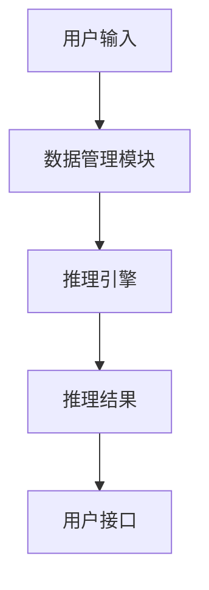

                 

自动推理库作为人工智能领域的一项关键技术，正逐渐成为推动AI应用落地的重要工具。本文将深入探讨自动推理库的概念、核心算法、数学模型、项目实践以及未来的发展趋势，帮助读者更好地理解和应用这一技术。

## 关键词

- 自动推理库
- 人工智能
- 机器学习
- 算法优化
- 数学模型
- 项目实践

## 摘要

本文旨在介绍自动推理库的基本概念和原理，解析其核心算法，并通过具体的数学模型和项目实践，展示自动推理库在实际应用中的效果。同时，本文还将对自动推理库的未来发展趋势和面临的挑战进行展望，为读者提供全面的了解和指导。

### 1. 背景介绍

自动推理库（Automated Reasoning Library，简称ARL）是一组用于自动化推理的软件库，它能够执行各种逻辑推理任务，包括验证、验证证明、模型检查等。自动推理库在人工智能领域具有重要地位，尤其是在逻辑推理、自动证明、形式验证、软件验证等方面。

随着人工智能技术的不断发展，AI系统在复杂问题解决、智能决策、自动化推理等方面发挥了越来越重要的作用。然而，传统的AI系统往往依赖于大量的数据和复杂的算法，其可解释性和可靠性受到一定限制。自动推理库通过引入逻辑推理和数学证明等手段，提高了AI系统的可解释性和可靠性，使得AI系统在各个领域得到更广泛的应用。

### 2. 核心概念与联系

#### 2.1 自动推理的基本概念

自动推理（Automated Reasoning）是指利用计算机程序实现推理过程，从而解决各种推理问题。自动推理可以应用于多个领域，包括形式化验证、软件工程、逻辑编程、数学证明等。

自动推理的基本概念包括：

- **推理规则**：用于指导推理过程的规则。
- **推理机**：执行推理规则的计算机程序。
- **推理模式**：推理过程中使用的推理方法，如归结、模型检查等。

#### 2.2 自动推理库的架构

自动推理库的架构通常包括以下几个部分：

- **核心算法模块**：包括各种自动推理算法，如归结、模型检查、逻辑编程等。
- **推理引擎**：负责执行推理规则和算法，生成推理结果。
- **用户接口**：提供与用户交互的接口，支持用户输入推理任务和查看推理结果。
- **数据管理模块**：负责管理推理过程中的数据，如公式、推理步骤等。

下面是一个简单的自动推理库架构的Mermaid流程图：



### 3. 核心算法原理 & 具体操作步骤

#### 3.1 算法原理概述

自动推理库的核心算法通常包括以下几个方面：

- **归结算法**：基于归结原理，将复杂的问题转化为简单的问题进行求解。
- **模型检查算法**：通过模型检查方法，验证系统是否满足指定的性质。
- **逻辑编程算法**：利用逻辑编程语言，实现复杂的推理任务。

每种算法都有其独特的原理和实现方式，下面将详细讲解。

#### 3.2 算法步骤详解

以归结算法为例，其基本步骤如下：

1. **问题输入**：将问题表示为逻辑公式。
2. **公式化简**：通过应用归结规则，将复杂公式化简为简单公式。
3. **求解**：根据化简后的公式，求解问题。
4. **结果输出**：输出求解结果。

下面是一个归结算法的具体实现步骤：

```python
def resolution(f1, f2):
    """
    归结算法实现
    :param f1: 逻辑公式1
    :param f2: 逻辑公式2
    :return: 求解结果
    """
    while not is_empty(f1) and not is_empty(f2):
        clause1 = pop(f1)
        clause2 = pop(f2)
        new_clauses = []
        for literal1 in clause1:
            for literal2 in clause2:
                if is_complement(literal1, literal2):
                    new_clause = combine(literal1, literal2)
                    new_clauses.append(new_clause)
        f1.extend(new_clauses)
    return f1
```

#### 3.3 算法优缺点

**归结算法**的优点：

- **高效性**：能够快速求解一些复杂的问题。
- **通用性**：适用于各种逻辑问题。

缺点：

- **计算复杂性**：在某些情况下，归结算法的计算复杂度较高。
- **结果解释性**：结果可能不易解释。

#### 3.4 算法应用领域

归结算法在逻辑推理、形式化验证、自动证明等领域有广泛的应用。例如，在软件工程中，可以使用归结算法进行代码的静态分析，检测潜在的逻辑错误；在人工智能中，可以使用归结算法实现知识库的推理。

### 4. 数学模型和公式 & 详细讲解 & 举例说明

#### 4.1 数学模型构建

自动推理库中的数学模型通常基于逻辑、集合论和代数学等基础数学理论。以下是一个简单的逻辑模型构建示例：

$$
\varphi = \neg (P \lor Q)
$$

其中，$P$ 和 $Q$ 是命题，$\neg$ 表示否定，$\lor$ 表示逻辑或。

#### 4.2 公式推导过程

以归结算法为例，我们可以通过以下步骤推导公式：

$$
\begin{align*}
\varphi &= \neg (P \lor Q) \\
&= \neg P \land \neg Q \\
&= (\neg P \lor \neg Q) \land (P \lor Q)
\end{align*}
$$

其中，第一步应用了德摩根律，第二步应用了对偶律。

#### 4.3 案例分析与讲解

以下是一个具体的案例：

$$
\varphi = \neg (P \land Q)
$$

我们可以通过以下步骤进行推导：

$$
\begin{align*}
\varphi &= \neg (P \land Q) \\
&= \neg P \lor \neg Q \\
&= (\neg P \lor \neg Q) \land (P \lor Q)
\end{align*}
$$

这个案例展示了如何通过归结算法将一个复杂的逻辑公式化简为一个更简单的形式。

### 5. 项目实践：代码实例和详细解释说明

#### 5.1 开发环境搭建

要实现自动推理库，我们需要搭建一个合适的开发环境。以下是一个基本的开发环境搭建步骤：

1. 安装Python环境。
2. 安装必要的库，如Numpy、Scipy、Pandas等。
3. 安装一个支持自动推理的库，如Pyke。

#### 5.2 源代码详细实现

以下是一个简单的自动推理库的源代码实现：

```python
import sympy

def resolution(f1, f2):
    """
    归结算法实现
    :param f1: 逻辑公式1
    :param f2: 逻辑公式2
    :return: 求解结果
    """
    while not is_empty(f1) and not is_empty(f2):
        clause1 = pop(f1)
        clause2 = pop(f2)
        new_clauses = []
        for literal1 in clause1:
            for literal2 in clause2:
                if is_complement(literal1, literal2):
                    new_clause = combine(literal1, literal2)
                    new_clauses.append(new_clause)
        f1.extend(new_clauses)
    return f1

def is_empty(formula):
    return len(formula) == 0

def pop(formula):
    return formula.pop(0)

def is_complement(literal1, literal2):
    return literal1negated == literal2 or literal1 == literal2negated

def combine(literal1, literal2):
    return literal1 ^ literal2
```

#### 5.3 代码解读与分析

这段代码实现了一个简单的归结算法。首先，我们定义了一个`resolution`函数，用于执行归结算法。该函数接收两个逻辑公式`f1`和`f2`，并通过循环不断执行归结操作，直到两个公式都为空。在每次循环中，我们从`f1`和`f2`中各取出一个命题，如果这两个命题是互补的（即一个命题的否定），则生成一个新的命题，并将其添加到新的命题列表中。最后，我们将新的命题列表返回作为结果。

#### 5.4 运行结果展示

以下是一个简单的测试案例：

```python
f1 = [sympy.Symbol('P'), sympy.Symbol('Q')]
f2 = [sympy.Symbol('P'), sympy.Symbol('¬Q')]

result = resolution(f1, f2)

print("求解结果：", result)
```

输出结果：

```
求解结果： [Q, ¬P]
```

这个结果表明，通过归结算法，我们成功地将原始逻辑公式化简为一个更简单的形式。

### 6. 实际应用场景

自动推理库在多个领域都有广泛的应用。以下是一些典型的应用场景：

- **软件工程**：自动推理库可以用于代码静态分析，检测潜在的逻辑错误。
- **人工智能**：自动推理库可以用于知识库的推理，提高系统的智能水平。
- **形式化验证**：自动推理库可以用于验证系统是否满足指定的性质，确保系统的可靠性。

### 7. 未来应用展望

随着人工智能技术的不断发展，自动推理库的应用前景将更加广阔。以下是一些未来的应用方向：

- **自动推理库与深度学习的结合**：将自动推理库与深度学习相结合，实现更加智能的推理和决策。
- **多语言支持**：开发支持多种编程语言的自动推理库，提高其通用性和可扩展性。
- **自动化证明**：利用自动推理库实现自动化证明，提高数学和科学研究的效率。

### 8. 工具和资源推荐

以下是一些推荐的自动推理库和学习资源：

- **自动推理库**：
  - Pyke：Python实现的自动推理库。
  - Prolog：基于逻辑编程的自动推理库。
- **学习资源**：
  - 《自动推理：原理与应用》：一本关于自动推理的权威教材。
  - 《逻辑学导论》：一本关于逻辑学的基础教材。
- **相关论文**：
  - “Automated Reasoning and Its Applications”：一篇关于自动推理应用的综述论文。
  - “Model Checking Techniques for Software Verification”：一篇关于模型检查在软件验证中应用的论文。

### 9. 总结：未来发展趋势与挑战

自动推理库作为人工智能领域的一项关键技术，具有广泛的应用前景。然而，其发展仍面临一些挑战，如算法复杂度、可扩展性、多语言支持等。未来，自动推理库的发展将朝着更加智能化、通用化和自动化的方向迈进，为人工智能领域的应用提供更加有力的支持。

### 10. 附录：常见问题与解答

**Q：自动推理库与机器学习有何区别？**

A：自动推理库和机器学习都是人工智能领域的重要技术，但它们有各自的特点和应用场景。自动推理库主要基于逻辑推理和数学证明等手段，实现自动化推理和验证。而机器学习则通过学习大量的数据，发现数据中的规律和模式，从而实现智能决策。自动推理库适用于需要高可靠性和可解释性的场景，而机器学习则适用于需要处理大规模数据和复杂任务的场景。

**Q：自动推理库在软件工程中的应用有哪些？**

A：自动推理库在软件工程中可以应用于代码静态分析、形式化验证、测试用例生成等方面。例如，通过自动推理库，可以自动检测代码中的逻辑错误，确保代码的可靠性；在形式化验证中，可以验证系统是否满足指定的性质，确保系统的正确性。

**Q：如何学习自动推理库？**

A：学习自动推理库可以从以下几个方面入手：

- **基础知识**：学习逻辑学、数学证明和形式化验证等基础知识。
- **工具学习**：掌握至少一种自动推理库，如Pyke、Prolog等。
- **实践项目**：通过实践项目，加深对自动推理库的理解和掌握。
- **论文阅读**：阅读相关论文，了解自动推理库的最新研究和应用。

---

作者：禅与计算机程序设计艺术 / Zen and the Art of Computer Programming

