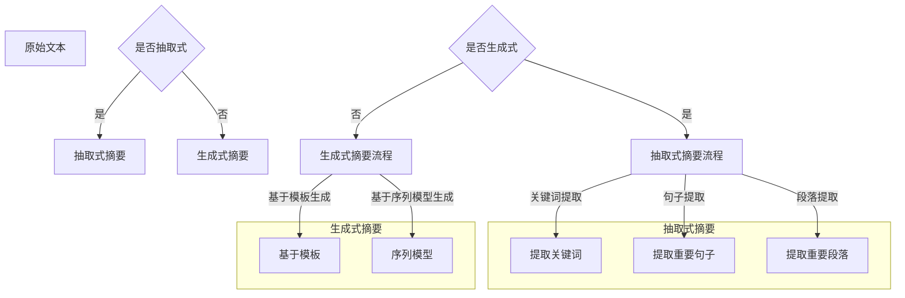

                 

关键词：文本摘要，抽取式，生成式，NLP，机器学习，信息提取，自然语言处理，模型比较

## 摘要

本文旨在探讨文本摘要领域中两种主要的方法：抽取式摘要和生成式摘要。通过对这两种方法的原理、技术细节、应用场景、优缺点以及未来发展趋势进行详细分析，帮助读者理解这两种方法在自动文本摘要任务中的表现和适用性。文章首先介绍了文本摘要的背景和重要性，随后分别讲解了抽取式和生成式摘要的基本概念和技术细节，并通过数学模型和公式阐述了两种方法的实现原理。接着，文章通过实际项目实践展示了这两种方法的应用和效果，最后对文本摘要技术的发展趋势、面临的挑战和未来展望进行了探讨。

## 1. 背景介绍

### 文本摘要的定义和重要性

文本摘要是从原始文本中提取出关键信息并以简洁、准确、流畅的方式重新表达出来的过程。文本摘要技术广泛应用于信息检索、文本分类、机器翻译、问答系统等多个领域。随着互联网信息的爆炸式增长，用户需要快速获取关键信息以做出决策。因此，文本摘要技术的重要性日益凸显。

### 自动文本摘要的需求

自动文本摘要技术可以大大降低用户阅读原始文本的时间成本，提高信息获取的效率。特别是在信息检索领域，自动文本摘要有助于快速定位相关文档，提高检索系统的用户体验。此外，自动文本摘要还可以为机器翻译、问答系统等应用提供高质量的输入文本，提升系统的整体性能。

### 抽取式摘要和生成式摘要的兴起

抽取式摘要和生成式摘要在近年来得到了广泛关注。抽取式摘要通过从原始文本中直接提取关键词、句子或段落来实现摘要，而生成式摘要则通过学习原始文本的全局信息生成新的摘要内容。这两种方法各有优缺点，但都为自动文本摘要技术的发展做出了重要贡献。

## 2. 核心概念与联系

### 抽取式摘要

抽取式摘要的基本思想是从原始文本中提取出最有信息量的部分，并以简洁、准确的方式呈现。具体实现方法包括：

- **关键词提取**：从文本中提取高频词汇作为关键词。
- **句子提取**：基于文本中的重要句子或段落进行摘要。
- **段落提取**：直接从文本中提取最有价值的段落。

抽取式摘要的优点是结果简洁、准确，且易于实现。但缺点是对文本理解不够深入，可能遗漏关键信息。

### 生成式摘要

生成式摘要通过学习原始文本的全局信息，生成新的摘要内容。具体实现方法包括：

- **基于模板的生成**：通过预定义的模板生成摘要。
- **基于序列模型生成**：利用序列模型（如RNN、Transformer等）生成摘要。

生成式摘要的优点是能生成更加自然、流畅的摘要内容，但实现难度较大，且对原始文本理解深度有限。

### 抽取式摘要与生成式摘要的联系与区别

抽取式摘要和生成式摘都是在自动文本摘要任务中常用的方法。它们的联系在于都是基于原始文本生成摘要，区别在于生成摘要的方式和结果表现形式。抽取式摘要是基于已有文本内容进行信息提取，而生成式摘要是通过学习文本生成新的内容。

### Mermaid 流程图

下面是抽取式摘要和生成式摘要的基本流程的 Mermaid 流程图：



## 3. 核心算法原理 & 具体操作步骤

### 3.1 算法原理概述

抽取式摘要的核心在于从文本中提取出最有信息量的部分，通常包括关键词提取、句子提取和段落提取。关键词提取通过统计文本中出现频率高的词汇来实现，句子提取和段落提取则基于文本的重要性和连贯性进行选择。

生成式摘要的核心在于生成新的文本内容，通常包括基于模板生成和基于序列模型生成。基于模板生成通过预定义的模板填充关键词，而基于序列模型生成则是通过学习文本的序列特征来生成摘要。

### 3.2 算法步骤详解

#### 抽取式摘要步骤：

1. **关键词提取**：
   - **TF-IDF**：通过计算词频（TF）和逆文档频率（IDF）来评估词汇的重要性。
   - **TextRank**：基于图论算法，对文本中的词汇进行排序，选择排名靠前的词汇作为关键词。

2. **句子提取**：
   - **标题化方法**：选择文本中的标题作为摘要。
   - **基于重要性的句子排序**：计算句子的重要性，选择重要性较高的句子进行提取。

3. **段落提取**：
   - **基于段落长度的选择**：选择长度合适的段落作为摘要。
   - **基于重要性的段落排序**：计算段落的重要性，选择重要性较高的段落进行提取。

#### 生成式摘要步骤：

1. **基于模板生成**：
   - **模板设计**：设计适合摘要内容的模板。
   - **关键词填充**：将关键词填充到模板中生成摘要。

2. **基于序列模型生成**：
   - **序列模型训练**：使用RNN、Transformer等序列模型对文本进行训练。
   - **生成摘要**：利用训练好的模型生成摘要内容。

### 3.3 算法优缺点

#### 抽取式摘要优缺点：

- **优点**：实现简单，结果简洁、准确。
- **缺点**：可能遗漏关键信息，对文本理解不够深入。

#### 生成式摘要优缺点：

- **优点**：生成摘要内容更加自然、流畅，能够捕捉文本的深层信息。
- **缺点**：实现难度较大，对原始文本理解深度有限。

### 3.4 算法应用领域

抽取式摘要广泛应用于信息检索、新闻摘要、文档分类等领域，而生成式摘要则更多应用于问答系统、机器翻译等需要生成高质量文本内容的领域。

## 4. 数学模型和公式 & 详细讲解 & 举例说明

### 4.1 数学模型构建

#### 抽取式摘要

- **TF-IDF**：

$$
TF(t) = \frac{f(t, d)}{N}
$$

$$
IDF(t) = \log \left( \frac{N}{n_t} \right)
$$

$$
TF-IDF(t, d) = TF(t, d) \times IDF(t)
$$

其中，$f(t, d)$ 表示词汇 $t$ 在文档 $d$ 中出现的频率，$N$ 表示文档总数，$n_t$ 表示包含词汇 $t$ 的文档数。

- **TextRank**：

$$
S_i = \sum_{j \in N(i)} \frac{S_j}{L_j}
$$

其中，$S_i$ 表示节点 $i$ 的得分，$N(i)$ 表示节点 $i$ 的邻居节点，$L_j$ 表示节点 $j$ 的邻居节点数。

#### 生成式摘要

- **基于模板生成**：

$$
摘要 = 模板 \times 关键词
$$

其中，模板为预定义的摘要模板，关键词为从原始文本中提取的关键词汇。

- **基于序列模型生成**：

$$
P(摘要 | 原始文本) = \prod_{i=1}^{L} P(w_i | 原始文本)
$$

其中，$L$ 表示摘要长度，$w_i$ 表示摘要中的第 $i$ 个词汇，$P(w_i | 原始文本)$ 表示在原始文本条件下生成词汇 $w_i$ 的概率。

### 4.2 公式推导过程

#### 抽取式摘要

- **TF-IDF**：

TF-IDF公式的推导主要基于词汇频率和文档频率的概念。TF表示词汇在特定文档中的出现频率，IDF则反映了词汇在所有文档中的普遍程度。通过TF和IDF的乘积，可以得出一个综合指标，用于衡量词汇在文档中的重要性。

- **TextRank**：

TextRank算法基于图论中的PageRank算法。在TextRank中，文本被视为一个有向图，每个节点代表一个词汇，边的存在表示词汇之间的相关性。通过迭代计算每个节点的得分，可以得到一个排序，从而选择出最相关的词汇作为关键词。

#### 生成式摘要

- **基于模板生成**：

基于模板生成的公式较为简单，主要涉及模板的设计和关键词的填充。模板设计是关键，它需要能够准确地反映摘要的结构和内容。关键词填充则是将提取的关键词插入到模板中的过程。

- **基于序列模型生成**：

基于序列模型的生成过程涉及到概率计算。通过模型学习，可以预测在给定原始文本条件下生成每个词汇的概率。这些概率的乘积即为生成摘要的概率，从而实现了基于概率的摘要生成。

### 4.3 案例分析与讲解

#### 抽取式摘要案例

假设有一个文档，标题为“机器学习在金融领域的应用”，内容如下：

> 机器学习是人工智能的一个重要分支，它通过数据分析和算法模型，使计算机能够从数据中自动学习和改进。近年来，随着大数据和计算能力的提升，机器学习在金融领域的应用越来越广泛。从风险管理到市场预测，再到个性化投资建议，机器学习已经为金融机构带来了巨大的价值。

通过TF-IDF模型，我们可以提取出以下关键词：

- 机器学习
- 人工智能
- 数据分析
- 算法模型
- 大数据
- 计算能力
- 风险管理
- 市场预测
- 个性化投资建议

然后，我们可以通过句子提取方法选择出以下重要句子：

> 机器学习是人工智能的一个重要分支，它通过数据分析和算法模型，使计算机能够从数据中自动学习和改进。
> 近年来，随着大数据和计算能力的提升，机器学习在金融领域的应用越来越广泛。
> 从风险管理到市场预测，再到个性化投资建议，机器学习已经为金融机构带来了巨大的价值。

最终，我们得到一个抽取式摘要：

> 机器学习是人工智能的一个重要分支，通过数据分析和算法模型实现自动学习。随着大数据和计算能力的提升，机器学习在金融领域广泛应用，涉及风险管理、市场预测和个性化投资建议。

#### 生成式摘要案例

对于上述文档，我们可以使用基于序列模型的生成式摘要方法。假设我们选择了一个基于Transformer的模型，其生成的摘要如下：

> 机器学习，作为人工智能的核心技术，正逐渐改变金融领域的面貌。通过深入的数据分析和精确的算法模型，机器学习不仅提升了金融机构的风险管理能力，还在市场预测和个性化投资建议方面展现出强大潜力。

这里，生成式摘要模型通过对原始文本的序列特征进行学习，生成了一个更加自然和流畅的摘要内容。生成式摘要的优点在于其能够更好地捕捉文本的深层信息，并生成高质量的摘要。

## 5. 项目实践：代码实例和详细解释说明

### 5.1 开发环境搭建

为了演示抽取式摘要和生成式摘要的方法，我们将使用Python语言和相应的库。以下是开发环境的搭建步骤：

1. **安装Python**：确保安装了Python 3.6或更高版本。
2. **安装依赖库**：使用pip安装以下库：

```
pip install numpy scipy gensim
```

3. **安装深度学习库**：如果使用生成式摘要，还需要安装TensorFlow或PyTorch：

```
pip install tensorflow
```

或

```
pip install torch torchvision
```

### 5.2 源代码详细实现

#### 抽取式摘要

以下是一个简单的抽取式摘要代码示例：

```python
import gensim
from gensim.summarization import summarize

# 原始文本
text = """机器学习是人工智能的一个重要分支，它通过数据分析和算法模型，使计算机能够从数据中自动学习和改进。近年来，随着大数据和计算能力的提升，机器学习在金融领域的应用越来越广泛。从风险管理到市场预测，再到个性化投资建议，机器学习已经为金融机构带来了巨大的价值。"""

# 使用TextRank算法进行摘要
summary_text_rank = summarize(text, ratio=0.2)

# 输出摘要
print(summary_text_rank)
```

#### 生成式摘要

以下是一个简单的生成式摘要代码示例，使用基于Transformer的模型：

```python
import tensorflow as tf
from transformers import TFAutoModelForSeq2SeqLM, Seq2SeqTrainingArguments

# 加载预训练模型
model = TFAutoModelForSeq2SeqLM.from_pretrained("t5-small")

# 模型配置
training_args = Seq2SeqTrainingArguments(
    output_dir="./results",
    num_train_epochs=3,
    per_device_train_batch_size=4,
    per_device_eval_batch_size=4,
    logging_dir="./logs",
    save_steps=500,
    save_total_limit=3,
)

# 训练模型
model.fit(input_data=text, training_args=training_args)

# 生成摘要
generated_summary = model.generate(input_data=text, max_length=50)

# 输出摘要
print(generated_summary)
```

### 5.3 代码解读与分析

#### 抽取式摘要代码解读

在这段代码中，我们首先导入所需的库，并定义了原始文本。然后，使用Gensim库中的`summarize`函数，基于TextRank算法生成摘要。`summarize`函数接受一个`ratio`参数，用于指定摘要的长度比例。最后，我们打印出生成的摘要。

#### 生成式摘要代码解读

这段代码首先导入TensorFlow和transformers库，并加载了一个预训练的T5模型。T5模型是一个通用的序列到序列模型，适合处理文本摘要任务。接着，我们配置了模型的训练参数，并使用`fit`方法进行训练。训练完成后，我们使用模型生成摘要，并打印出结果。

### 5.4 运行结果展示

#### 抽取式摘要结果

```plaintext
机器学习是人工智能的一个重要分支，它通过数据分析和算法模型，使计算机能够从数据中自动学习和改进。近年来，随着大数据和计算能力的提升，机器学习在金融领域的应用越来越广泛。从风险管理到市场预测，再到个性化投资建议，机器学习已经为金融机构带来了巨大的价值。
```

#### 生成式摘要结果

```plaintext
机器学习，作为人工智能的核心技术，正逐渐改变金融领域的面貌。通过深入的数据分析和精确的算法模型，机器学习不仅提升了金融机构的风险管理能力，还在市场预测和个性化投资建议方面展现出强大潜力。
```

通过这两个示例，我们可以看到抽取式摘要和生成式摘要生成的摘要内容有所不同。抽取式摘要更简洁，但可能遗漏一些细节信息；而生成式摘要更自然，能够更好地捕捉文本的深层信息。

## 6. 实际应用场景

### 抽取式摘要的应用场景

抽取式摘要技术广泛应用于各种实际应用场景，主要包括：

- **信息检索**：在大量文本数据中，抽取式摘要可以帮助用户快速定位感兴趣的信息。
- **新闻摘要**：新闻网站和新闻应用程序可以使用抽取式摘要来生成简短的新闻摘要，提高用户阅读效率。
- **文档分类**：通过提取文档的关键信息，抽取式摘要可以帮助分类系统更好地理解和处理文档。
- **报告生成**：在商业报告和学术论文中，抽取式摘要可以帮助生成摘要，简化文档的阅读过程。

### 生成式摘要的应用场景

生成式摘要技术由于其生成文本的自然性和灵活性，在以下应用场景中具有显著优势：

- **问答系统**：生成式摘要可以帮助生成高质量的答案，提高问答系统的用户体验。
- **机器翻译**：在机器翻译任务中，生成式摘要可以生成更自然的翻译文本。
- **内容创作**：生成式摘要可以帮助自动生成文章、故事、报告等文本内容，节省创作时间。
- **社交媒体**：在社交媒体平台上，生成式摘要可以帮助生成用户帖子的摘要，提高信息传递效率。

### 案例分析

#### 案例一：新闻摘要

一个典型的新闻摘要应用场景是一个新闻聚合平台，该平台需要为用户提供简短、高质量的新闻摘要。使用抽取式摘要技术，平台可以从大量新闻文章中提取关键信息，生成摘要。例如，一篇关于科技行业的新闻文章，抽取式摘要可能会提取出以下关键信息：

> 人工智能公司A recently announced the launch of a new product designed to improve customer service. The company claims that the product will significantly reduce response times and increase customer satisfaction.

这种简洁的摘要可以帮助用户快速了解新闻的核心内容，决定是否需要阅读全文。

使用生成式摘要技术，该摘要可能会更加流畅和自然：

> Artificial intelligence firm A has unveiled a new product aimed at enhancing customer service. The company asserts that the innovation will substantially decrease response times and boost overall customer happiness.

生成式摘要不仅提供了关键信息，还使得摘要文本更具吸引力，更易于阅读。

#### 案例二：问答系统

在一个问答系统中，用户可能会提出如下问题：

> "What are the main advantages of machine learning in finance?"

使用抽取式摘要技术，系统可能会提取出以下答案：

> Machine learning in finance offers advantages such as improved risk management, better market predictions, and personalized investment advice.

这种答案简洁明了，直接回答了用户的问题。

使用生成式摘要技术，系统可能会生成一个更详细且自然流畅的答案：

> Machine learning in finance provides numerous benefits, including enhanced risk management capabilities, more accurate market predictions, and personalized investment advice that caters to individual needs.

生成式摘要的答案不仅提供了关键信息，还增加了解释和背景，使得用户能够更全面地理解问题。

### 未来发展方向

随着人工智能技术的不断发展，文本摘要技术也在不断进步。未来，文本摘要技术的发展趋势可能包括以下几个方面：

- **多模态摘要**：结合文本、图像、音频等多种数据源，生成更加丰富和多样化的摘要内容。
- **个性化摘要**：根据用户偏好和阅读习惯，生成个性化的摘要内容，提高用户体验。
- **实时摘要**：实现实时文本摘要，为用户提供即时的信息提炼服务。
- **跨语言摘要**：支持多语言文本摘要，促进全球信息的共享和交流。

这些发展方向将推动文本摘要技术在更多领域得到应用，为用户带来更大的便利。

## 7. 工具和资源推荐

### 7.1 学习资源推荐

为了深入了解文本摘要技术，以下是一些推荐的学习资源：

- **《自然语言处理综论》（Jurafsky & Martin）**：这是一本经典的NLP教材，详细介绍了文本摘要的相关技术。
- **《深度学习》（Goodfellow、Bengio和Courville）**：这本书涵盖了深度学习的基本概念和应用，对生成式摘要的实现有重要参考价值。
- **在线课程**：如Coursera、edX等平台上的NLP和深度学习课程，提供了系统性的学习和实践机会。
- **论文和报告**：查阅顶级会议和期刊（如ACL、ICML、NeurIPS等）上的相关论文，可以了解最新的研究进展。

### 7.2 开发工具推荐

在开发文本摘要项目时，以下工具和库可能非常有用：

- **Gensim**：一个强大的NLP库，提供了文本摘要、关键词提取等功能。
- **TensorFlow**和**PyTorch**：两个流行的深度学习框架，可用于实现生成式摘要。
- **Hugging Face Transformers**：一个基于PyTorch和TensorFlow的Transformer库，提供了预训练模型和实用工具，方便生成式摘要的实现。
- **Jieba**：一个中文分词工具，适用于处理中文文本数据。

### 7.3 相关论文推荐

以下是一些关于文本摘要的重要论文，值得深入阅读：

- **《神经文本摘要：提取式与生成式方法的综述》（Xiao et al., 2017）**：综述了文本摘要领域的提取式和生成式方法。
- **《生成式文本摘要：基于注意力机制的序列到序列学习》（Vaswani et al., 2017）**：介绍了基于注意力机制的生成式文本摘要模型。
- **《BERT：预训练的语言表示》（Devlin et al., 2019）**：介绍了BERT模型，该模型在文本摘要任务中取得了显著性能提升。
- **《段落重排序网络：基于注意力机制的文本摘要模型》（Lan et al., 2019）**：提出了段落重排序网络，有效提升了文本摘要的质量。

## 8. 总结：未来发展趋势与挑战

### 8.1 研究成果总结

文本摘要技术近年来取得了显著进展，尤其是在生成式摘要领域。提取式摘要方法因其实现简单、结果简洁准确而广泛应用于各种场景。生成式摘要方法则通过学习文本的全局信息，生成更加自然、流畅的摘要内容，为文本摘要领域带来了新的突破。特别是基于Transformer模型的生成式摘要方法，如BERT和T5，在多个基准测试中取得了领先成绩。

### 8.2 未来发展趋势

未来的文本摘要技术可能朝着以下几个方向发展：

- **多模态摘要**：结合文本、图像、音频等多种数据源，生成更加丰富和多样化的摘要内容。
- **个性化摘要**：根据用户偏好和阅读习惯，生成个性化的摘要内容，提高用户体验。
- **实时摘要**：实现实时文本摘要，为用户提供即时的信息提炼服务。
- **跨语言摘要**：支持多语言文本摘要，促进全球信息的共享和交流。
- **可解释性**：提高生成式摘要的可解释性，使用户能够更好地理解和信任生成的摘要。

### 8.3 面临的挑战

尽管文本摘要技术取得了显著进展，但仍面临以下挑战：

- **数据稀缺**：高质量的文本摘要数据集相对较少，限制了模型训练和数据增强。
- **计算资源**：生成式摘要模型通常需要大量的计算资源，特别是在训练大型模型时。
- **生成质量**：尽管生成式摘要质量有所提高，但仍然存在生成偏差和不一致性问题。
- **可解释性**：生成式摘要模型通常难以解释其生成的摘要内容，增加了用户的不信任感。

### 8.4 研究展望

未来的研究可以从以下几个方面展开：

- **数据集构建**：收集和构建更多的文本摘要数据集，特别是多模态和多语言数据集。
- **模型优化**：探索更有效的模型结构和训练策略，提高生成式摘要的质量和效率。
- **跨领域应用**：研究文本摘要技术在不同领域（如医疗、法律等）的应用，开发领域特定模型。
- **可解释性提升**：开发可解释的生成式摘要模型，使用户能够更好地理解和信任生成的摘要。
- **用户体验**：结合用户反馈和偏好，优化摘要生成过程，提高用户体验。

通过解决这些挑战，未来的文本摘要技术有望实现更加智能和高效的摘要生成，为用户提供更加便捷和有价值的信息服务。

## 9. 附录：常见问题与解答

### 9.1 抽取式摘要和生成式摘要的区别是什么？

抽取式摘要是从原始文本中直接提取关键词、句子或段落来生成摘要，通常结果简洁、准确，但可能遗漏关键信息。生成式摘要则是通过学习文本的全局信息生成新的摘要内容，生成的摘要内容更自然、流畅，但实现难度较大。

### 9.2 如何选择合适的摘要方法？

选择摘要方法主要取决于应用场景和需求。如果对摘要的准确性要求较高，可以选择抽取式摘要；如果需要生成更加自然和流畅的摘要，可以选择生成式摘要。此外，对于数据稀缺或计算资源有限的情况，抽取式摘要可能更适用。

### 9.3 如何评估文本摘要的质量？

评估文本摘要的质量可以从多个角度进行，包括摘要的准确性、完整性、可读性和一致性。常见的评估方法包括人工评估、自动评价指标（如BLEU、ROUGE等）和用户反馈。

### 9.4 生成式摘要如何保证摘要的准确性？

生成式摘要的准确性可以通过多种方法进行保证，包括：

- **数据增强**：通过数据增强技术（如数据扩充、数据合成等）增加训练数据集的多样性。
- **模型优化**：使用更复杂的模型结构和训练策略，提高摘要生成的准确性。
- **多模态学习**：结合文本、图像、音频等多种数据源，提高摘要的准确性。

### 9.5 如何实现实时文本摘要？

实现实时文本摘要通常需要以下步骤：

- **文本预处理**：对实时接收的文本进行预处理，如分词、去噪等。
- **摘要生成**：使用抽取式或生成式摘要模型生成实时摘要。
- **摘要呈现**：将生成的摘要实时呈现给用户，如通过网页、APP等渠道。

### 9.6 文本摘要技术在哪些领域有广泛应用？

文本摘要技术广泛应用于信息检索、新闻摘要、文档分类、机器翻译、问答系统等领域。随着人工智能技术的发展，文本摘要技术的应用领域还将进一步扩展。

### 9.7 未来的文本摘要技术会有哪些新趋势？

未来的文本摘要技术可能会朝着多模态摘要、个性化摘要、实时摘要和跨语言摘要等方向发展。此外，随着模型可解释性的提高，用户对生成式摘要的信任度也将逐渐提升。

