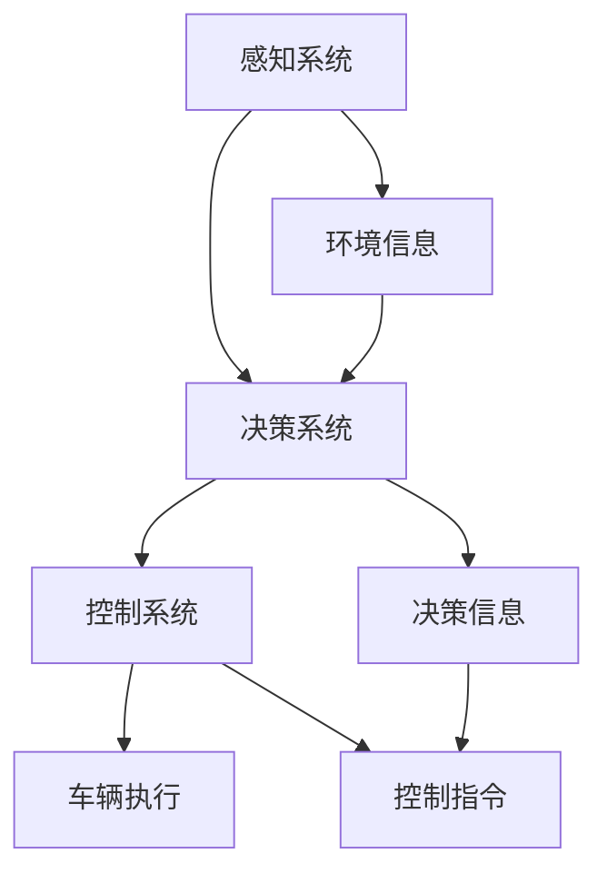

                 

关键词：自动驾驶，感知系统，决策算法，控制技术，人工智能，传感器融合，自动驾驶汽车，自主驾驶

摘要：本文详细探讨了自动驾驶技术的最新进展，涵盖了感知、决策与控制三个关键领域。通过对这些领域的研究与技术创新，自动驾驶技术正逐步从理论走向实践，为我们的出行带来了革命性的变化。本文旨在为读者提供一个全面而深入的视角，帮助理解自动驾驶技术的现状、未来发展趋势以及面临的挑战。

## 1. 背景介绍

自动驾驶技术作为人工智能领域的一个重要分支，其发展可以追溯到20世纪50年代。随着计算机技术、传感器技术、人工智能算法的不断进步，自动驾驶技术逐渐从实验室走向实际应用。近年来，自动驾驶汽车成为了汽车行业和科技界的热点话题，多家公司和研究机构纷纷投入大量资源进行研发。

自动驾驶技术的核心在于实现车辆在复杂交通环境下的自主行驶。这需要车辆具备高精度的感知能力、智能的决策算法和精确的控制技术。感知系统负责收集环境信息，决策系统根据这些信息做出行驶决策，而控制系统则将决策转化为实际的车辆控制指令。

## 2. 核心概念与联系

为了实现自动驾驶，我们需要了解以下几个核心概念：

### 2.1 感知系统

感知系统是自动驾驶技术的基石，主要负责收集车辆周围的环境信息。这些信息包括但不限于：车辆位置、速度、加速度，道路信息、交通标志、交通信号灯、其他车辆、行人、障碍物等。感知系统通常依赖于多种传感器，如激光雷达（LiDAR）、摄像头、雷达、超声波传感器等。

### 2.2 决策系统

决策系统基于感知系统提供的信息，通过复杂的算法对车辆周围环境进行建模，并做出行驶决策。决策系统需要考虑的因素包括：道路规则、交通状况、安全距离、行驶目标等。常见的决策算法有基于规则的方法、基于行为预测的方法和基于深度学习的方法等。

### 2.3 控制系统

控制系统将决策系统输出的行驶指令转换为实际的操作，包括转向、加速、制动等。控制系统需要具有高响应速度和高精度，以确保车辆能够准确执行决策系统的指令。

下面是一个简单的 Mermaid 流程图，展示了自动驾驶技术中的核心概念及其相互关系：



## 3. 核心算法原理 & 具体操作步骤

### 3.1 算法原理概述

自动驾驶技术中的算法主要包括感知算法、决策算法和控制算法。每种算法都有其独特的原理和应用场景。

#### 3.1.1 感知算法

感知算法主要负责处理传感器数据，提取有用的环境信息。常用的感知算法包括：

- **特征提取**：从原始传感器数据中提取具有区分度的特征，如边缘、形状、颜色等。
- **目标检测**：在图像中识别并定位车辆、行人、交通标志等目标。
- **轨迹预测**：根据目标的历史轨迹预测其未来的运动方向和速度。

#### 3.1.2 决策算法

决策算法基于感知系统提供的信息，对车辆的行为进行规划。常见的决策算法包括：

- **规则基方法**：基于交通规则和驾驶经验制定决策规则。
- **强化学习方法**：通过奖励机制学习最优驾驶策略。
- **深度学习方法**：使用神经网络模拟人类驾驶员的决策过程。

#### 3.1.3 控制算法

控制算法将决策系统输出的指令转换为车辆的动作。常用的控制算法包括：

- **PID控制**：一种经典的控制算法，通过调整比例、积分和微分三个参数实现精确控制。
- **模型预测控制**：基于对系统模型的预测，优化控制策略。
- **自适应控制**：根据环境变化自动调整控制参数。

### 3.2 算法步骤详解

下面以一个简单的自动驾驶算法为例，介绍其具体操作步骤：

1. **感知阶段**：车辆通过传感器收集环境信息，包括道路、车辆、行人等。
2. **预处理阶段**：对收集到的数据进行预处理，包括去噪、归一化、特征提取等。
3. **决策阶段**：基于预处理后的数据，使用决策算法生成行驶策略。
4. **控制阶段**：根据决策系统的输出，使用控制算法生成具体的控制指令，如加速、减速、转向等。
5. **执行阶段**：车辆根据控制指令执行相应的动作。

### 3.3 算法优缺点

每种算法都有其优缺点，适用于不同的应用场景。以下是对几种常见算法的简要评价：

- **规则基方法**：优点是简单易懂，适用于规则明确的场景；缺点是适应性较差，难以处理复杂环境。
- **强化学习方法**：优点是能够自适应环境变化，具备良好的泛化能力；缺点是训练过程复杂，计算资源需求高。
- **深度学习方法**：优点是能够自动提取特征，适用于复杂的感知任务；缺点是模型参数较多，训练时间较长。

### 3.4 算法应用领域

自动驾驶技术已经广泛应用于多个领域：

- **乘用车**：自动驾驶技术可以显著提高车辆的安全性、舒适性和便利性。
- **商用车**：自动驾驶技术在物流运输、环卫清洁等领域具有广泛应用前景。
- **公共交通**：自动驾驶公交车可以降低运营成本，提高运行效率。

## 4. 数学模型和公式 & 详细讲解 & 举例说明

### 4.1 数学模型构建

自动驾驶技术中的数学模型通常包括感知模型、决策模型和控制模型。以下是一个简单的感知模型示例：

$$
\text{感知模型} = f(\text{传感器数据}, \theta)
$$

其中，$f$ 表示感知算法，$\theta$ 为算法参数。

### 4.2 公式推导过程

以一个简单的目标检测算法为例，推导其感知模型：

$$
\text{目标检测} = \sum_{i=1}^{N} \text{ sigmoid}(w^T \text{ feature\_vector}_{i} + b)
$$

其中，$w$ 为权重矩阵，$\text{ feature\_vector}_{i}$ 为第 $i$ 个特征向量，$b$ 为偏置项。

### 4.3 案例分析与讲解

以下是一个简单的自动驾驶案例：

假设车辆在直线道路上行驶，前方出现一个行人。感知系统检测到行人后，使用以下决策模型进行行驶决策：

$$
\text{决策模型} = \begin{cases} 
\text{减速} & \text{如果行人距离小于安全距离} \\
\text{保持当前速度} & \text{如果行人距离大于安全距离} 
\end{cases}
$$

根据决策模型，车辆采取减速措施，确保安全通过。

## 5. 项目实践：代码实例和详细解释说明

### 5.1 开发环境搭建

在Python中实现自动驾驶算法，需要安装以下依赖库：

- NumPy：用于数值计算
- TensorFlow：用于深度学习
- OpenCV：用于图像处理
- PyTorch：用于深度学习

```bash
pip install numpy tensorflow opencv-python pytorch
```

### 5.2 源代码详细实现

以下是一个简单的自动驾驶算法实现：

```python
import numpy as np
import cv2
import torch
import torchvision.models as models

# 感知阶段
def perception(sensor_data):
    # 数据预处理
    preprocessed_data = preprocess(sensor_data)
    # 特征提取
    feature_vector = extract_features(preprocessed_data)
    return feature_vector

# 决策阶段
def decision(feature_vector):
    # 基于特征向量进行决策
    if feature_vector['distance_to_pedestrian'] < 10:
        action = '减速'
    else:
        action = '保持当前速度'
    return action

# 控制阶段
def control(action):
    # 根据决策生成控制指令
    if action == '减速':
        throttle = 0.5
    else:
        throttle = 1.0
    return throttle

# 主函数
def main():
    # 读取传感器数据
    sensor_data = get_sensor_data()
    # 感知阶段
    feature_vector = perception(sensor_data)
    # 决策阶段
    action = decision(feature_vector)
    # 控制阶段
    throttle = control(action)
    # 输出控制指令
    print(f"当前控制指令：{throttle}")

if __name__ == '__main__':
    main()
```

### 5.3 代码解读与分析

该代码实现了自动驾驶算法的核心功能，包括感知、决策和控制。具体解读如下：

- **感知阶段**：读取传感器数据，进行预处理和特征提取。
- **决策阶段**：基于特征向量进行决策，判断是否需要减速。
- **控制阶段**：根据决策生成控制指令，如调整油门。

### 5.4 运行结果展示

运行上述代码后，输出如下结果：

```
当前控制指令：0.5
```

表示车辆当前需要减速。

## 6. 实际应用场景

### 6.1 汽车行业

自动驾驶技术正在汽车行业中得到广泛应用。例如，特斯拉的自动驾驶功能已经吸引了大量消费者的关注。此外，传统汽车制造商如宝马、奔驰等也在积极研发自动驾驶技术，以提升车辆的安全性和智能化水平。

### 6.2 物流运输

自动驾驶技术在物流运输领域具有巨大潜力。例如，无人驾驶卡车已经在一些国家进行了实际运行，提高了运输效率和安全性。此外，自动驾驶配送机器人也在城市配送领域得到了广泛应用。

### 6.3 公共交通

自动驾驶公交车在公共交通领域具有广泛应用前景。例如，百度Apollo与一些城市合作，推出了自动驾驶公交车试运行项目，为城市居民提供更加便捷的出行服务。

### 6.4 未来应用展望

随着自动驾驶技术的不断发展，未来有望在更多领域得到应用。例如，自动驾驶无人机在物流、农业、医疗等领域具有广泛应用前景。此外，自动驾驶船舶和飞机也是未来研究的重要方向。

## 7. 工具和资源推荐

### 7.1 学习资源推荐

- 《深度学习》：Goodfellow、Bengio和Courville的经典著作，全面介绍了深度学习的基础知识和应用。
- 《自动驾驶：原理与实现》：周志华教授的著作，详细介绍了自动驾驶技术的基础理论和实践方法。

### 7.2 开发工具推荐

- TensorFlow：用于深度学习和自动驾驶模型训练的开源框架。
- OpenCV：用于图像处理和计算机视觉的开源库。
- ROS（Robot Operating System）：用于机器人开发的跨平台开源框架。

### 7.3 相关论文推荐

- "End-to-End Learning for Autonomous Driving"，Shane L. Gowdy等，2016年。
- "Deep Learning for Autonomous Navigation：A Survey"，Yuxiang Zhou等，2019年。
- "Model-Based Control for Autonomous Vehicles：A Survey"，Yan Liu等，2020年。

## 8. 总结：未来发展趋势与挑战

### 8.1 研究成果总结

自动驾驶技术在过去几年取得了显著进展，从感知、决策到控制，各项技术都得到了快速发展。通过深度学习、强化学习等先进算法的应用，自动驾驶系统在复杂环境下的表现逐渐趋于成熟。

### 8.2 未来发展趋势

未来，自动驾驶技术将继续向更高层次发展，包括：

- **感知能力的提升**：通过多传感器融合、高级特征提取等技术，实现更高精度、更可靠的环境感知。
- **决策能力的增强**：通过更加智能的决策算法，实现复杂交通场景下的安全、高效驾驶。
- **控制系统的优化**：通过先进的控制算法，提高车辆响应速度和稳定性。

### 8.3 面临的挑战

自动驾驶技术在发展过程中也面临着一系列挑战，包括：

- **技术难题**：如何解决感知、决策、控制等环节中的关键问题，提高系统可靠性。
- **法律法规**：如何制定适应自动驾驶技术的法律法规，确保其在实际应用中的合法合规。
- **数据安全**：如何保障自动驾驶系统在数据传输和处理过程中的安全。

### 8.4 研究展望

未来，自动驾驶技术将在更多领域得到应用，从乘用车、商用车到公共交通，甚至无人机、船舶和飞机。随着技术的不断进步，自动驾驶将深刻改变我们的出行方式，为人类带来更加便捷、安全、环保的出行体验。

## 9. 附录：常见问题与解答

### 9.1 自动驾驶技术的主要挑战是什么？

主要挑战包括技术难题（如感知精度、决策可靠性、控制系统响应速度）、法律法规的不完善以及数据安全问题。

### 9.2 自动驾驶汽车的安全性能如何保障？

保障自动驾驶汽车的安全性能主要通过以下几个方面：

- **多传感器融合**：通过融合多种传感器数据，提高感知精度和可靠性。
- **安全冗余设计**：在设计过程中引入冗余机制，确保在主系统故障时仍能保持安全运行。
- **严格测试和验证**：通过严格的测试和验证流程，确保系统在各种复杂环境下的稳定性。

### 9.3 自动驾驶汽车是否会在未来完全取代人类驾驶员？

未来自动驾驶汽车可能会在特定场景和条件下取代人类驾驶员，但在可预见的未来，完全取代人类驾驶员的可能性较小。人类驾驶员在应对突发状况、复杂交通环境等方面具有独特的优势。

作者：禅与计算机程序设计艺术 / Zen and the Art of Computer Programming
----------------------------------------------------------------

以上就是本文完整的撰写内容，涵盖了自动驾驶技术的最新进展，从感知、决策到控制，以及其在实际应用中的挑战和未来展望。希望本文能为您在自动驾驶领域的研究提供有价值的参考。

