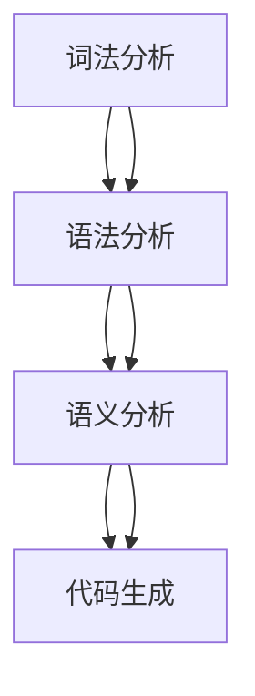

                 

  
关键词：ANTLR、自定义语言、DSL、编译原理、编程语言设计

摘要：本文深入探讨了使用ANTLR构建自定义领域特定语言（DSL）的原理、步骤和方法。通过详细的算法原理讲解、实际代码实例和数学模型分析，展示了ANTLR在自定义语言开发中的强大功能，并对其应用领域和未来发展趋势进行了展望。

## 1. 背景介绍

在现代软件开发中，领域特定语言（DSL）的应用越来越广泛。DSL是一种针对特定领域而设计的语言，相较于通用编程语言，DSL能够提供更简洁、更直观的语法和语义，使得开发者能够更高效地解决特定领域的问题。ANTLR（Another Tool for Language Recognition）是一款强大的解析器生成器，广泛应用于构建自定义语言和编译器开发。本文将探讨如何使用ANTLR构建DSL，包括核心概念、算法原理、数学模型和实际项目实践。

### 1.1 DSL的定义与作用

领域特定语言（Domain-Specific Language，DSL）是一种面向特定应用领域的设计语言，其语法和语义都针对特定领域进行了优化。DSL的主要作用包括：

1. **提高开发效率**：DSL提供了更简洁、更直观的语法，使得开发者可以更快速地理解和编写代码。
2. **降低学习成本**：通过领域特定语言，开发者可以避免学习复杂的通用编程语言，从而减少学习成本。
3. **提高代码可读性**：DSL的语法和语义更贴近特定领域的需求，使得代码更容易理解和维护。
4. **支持领域模型驱动开发**：DSL可以帮助开发者更好地理解和应用领域模型，从而实现更高效的软件开发。

### 1.2 ANTLR简介

ANTLR（Another Tool for Language Recognition）是一款广泛应用的解析器生成器，由Terence Parr教授创建。ANTLR能够根据给定的语法规则生成语法解析器，支持多种编程语言和平台。ANTLR的主要特点包括：

1. **高效**：ANTLR生成的解析器具有高效的性能，能够快速地解析复杂的语法结构。
2. **灵活**：ANTLR支持多种语法规则和解析策略，能够适应不同的语言设计和编译需求。
3. **可扩展**：ANTLR提供了丰富的API，使得开发者可以根据需求进行扩展和定制。

## 2. 核心概念与联系

构建自定义语言需要理解一系列核心概念，包括词法分析、语法分析、语义分析和代码生成。以下是一个简单的Mermaid流程图，展示了这些概念之间的关系。



### 2.1 词法分析（Lexical Analysis）

词法分析是解析过程的第一步，其任务是将源代码的字符序列转换为记号（tokens）。词法分析器需要识别出源代码中的关键字、标识符、操作符等基本元素。ANTLR提供了灵活的词法规则定义方式，使得开发者可以轻松地定义自定义语言的词法规则。

### 2.2 语法分析（Syntax Analysis）

语法分析是在词法分析的基础上，根据预定的语法规则，将记号序列转换为抽象语法树（AST）。ANTLR通过定义语法规则和语法模式，能够自动生成语法分析器，支持复杂的语法结构。

### 2.3 语义分析（Semantic Analysis）

语义分析是解析过程的第三步，其任务是验证语法结构的正确性，并解释其语义。ANTLR提供了丰富的语义分析功能，包括变量解析、类型检查和表达式求值等。

### 2.4 代码生成（Code Generation）

代码生成是将抽象语法树转换为目标代码的过程。ANTLR能够根据定义的语法规则和语义规则，自动生成目标代码。开发者可以使用ANTLR生成的代码框架，进一步优化和扩展代码生成逻辑。

## 3. 核心算法原理 & 具体操作步骤

### 3.1 算法原理概述

ANTLR的核心算法包括词法分析、语法分析、语义分析和代码生成。这些算法相互协作，共同实现自定义语言的构建。

- **词法分析**：ANTLR使用正则表达式定义词法规则，将源代码转换为记号序列。
- **语法分析**：ANTLR通过定义语法规则，将记号序列转换为抽象语法树。
- **语义分析**：ANTLR在语法分析的基础上，进行变量解析、类型检查和表达式求值等操作。
- **代码生成**：ANTLR根据抽象语法树生成目标代码，开发者可以进一步优化和扩展代码生成逻辑。

### 3.2 算法步骤详解

1. **定义词法规则**：使用ANTLR的词法规则定义源代码中的关键字、标识符、操作符等基本元素。
2. **定义语法规则**：使用ANTLR的语法规则定义源代码的语法结构，包括语句、表达式和声明等。
3. **定义语义规则**：使用ANTLR的语义规则进行变量解析、类型检查和表达式求值等操作。
4. **生成语法解析器**：ANTLR根据词法规则和语法规则生成语法解析器。
5. **生成抽象语法树**：使用语法解析器对源代码进行语法分析，生成抽象语法树。
6. **进行语义分析**：使用语义规则对抽象语法树进行语义分析，验证语法结构的正确性。
7. **生成目标代码**：根据抽象语法树生成目标代码，开发者可以进一步优化和扩展代码生成逻辑。

### 3.3 算法优缺点

ANTLR具有以下优点：

- **高效**：ANTLR生成的解析器具有高效的性能，能够快速地解析复杂的语法结构。
- **灵活**：ANTLR支持多种语法规则和解析策略，能够适应不同的语言设计和编译需求。
- **可扩展**：ANTLR提供了丰富的API，使得开发者可以根据需求进行扩展和定制。

但ANTLR也存在以下缺点：

- **学习曲线**：ANTLR的学习曲线相对较陡峭，需要开发者具备一定的语法分析知识和编程技能。
- **语法复杂性**：ANTLR的语法规则定义相对复杂，需要开发者仔细设计和调试。

### 3.4 算法应用领域

ANTLR在以下领域具有广泛应用：

- **编译器开发**：ANTLR是构建编译器的首选工具，能够快速生成语法解析器和抽象语法树。
- **语言设计**：ANTLR支持开发者设计自定义领域特定语言（DSL），提高开发效率和代码可读性。
- **前端框架**：ANTLR广泛应用于前端框架开发，如React、Vue等，用于生成虚拟DOM和模板编译等。

## 4. 数学模型和公式 & 详细讲解 & 举例说明

在自定义语言开发过程中，数学模型和公式起着至关重要的作用。以下是对数学模型构建、公式推导过程和案例分析的详细讲解。

### 4.1 数学模型构建

构建数学模型的第一步是定义问题的抽象数据类型。例如，在构建一个简单的算术表达式语言时，我们可以定义以下数据类型：

- **数**：表示整数或浮点数。
- **变量**：表示一个可变的值。
- **表达式**：表示一个算术表达式，可以是数、变量或运算符的组合。

以下是一个简单的数学模型构建示例：

```latex
\begin{equation}
\begin{aligned}
T &= \{ \text{数}, \text{变量} \} \\
E &= \{ \text{表达式} \} \\
\end{aligned}
\end{equation}
```

### 4.2 公式推导过程

在构建数学模型的基础上，我们需要推导出公式的推导过程。以下是一个简单的算术表达式求值的推导过程：

```latex
\begin{equation}
\begin{aligned}
\text{求值}(E) &= \\
&= \text{如果 } E \text{ 是数，则返回 } E \\
&= \text{如果 } E \text{ 是变量，则返回变量对应的值} \\
&= \text{如果 } E \text{ 是表达式 } E_1 \text{ 和 } E_2 \text{ 的组合，则根据运算符进行计算}
\end{aligned}
\end{equation}
```

### 4.3 案例分析与讲解

以下是一个具体的算术表达式求值的案例分析：

```latex
\begin{equation}
\begin{aligned}
E &= 2 + (3 \times 4) - (5 \div 2) \\
\text{求值}(E) &= 2 + (3 \times 4) - (5 \div 2) \\
&= 2 + 12 - 2.5 \\
&= 12.5 \\
\end{aligned}
\end{equation}
```

在这个案例中，我们首先对括号内的表达式进行计算，然后根据运算符进行加减运算，最终得到结果12.5。

## 5. 项目实践：代码实例和详细解释说明

为了更好地理解ANTLR在自定义语言开发中的应用，我们将在本节提供一个实际的代码实例，并对代码的每个部分进行详细解释。

### 5.1 开发环境搭建

首先，我们需要搭建ANTLR的开发环境。以下是搭建ANTLR开发环境的基本步骤：

1. **安装ANTLR工具**：从ANTLR官网（https://www.antlr.org/）下载并安装ANTLR工具。
2. **安装Java开发环境**：安装Java开发环境（JDK），确保PATH环境变量中包含Java命令。
3. **创建ANTLR项目**：使用命令行工具创建一个ANTLR项目，例如：

   ```bash
   antlr4 -Dlanguage=Java MyGrammar.g4
   ```

   这将生成一个名为`MyGrammar`的Java项目，其中包含ANTLR生成的语法解析器代码。

### 5.2 源代码详细实现

以下是我们的自定义语言`MyGrammar`的源代码实现：

```java
// MyGrammar.g4
grammar MyGrammar;

// 词法规则
DIGIT: [0-9]+;
VAR: [a-zA-Z]+;

// 语法规则
program: (expression | VAR) EOF;

expression
    :   expression ('*' | '/') expression
    |   expression ('+' | '-') expression
    |   DIGIT
    |   VAR
    ;

// 语义规则
@after
{
    int result = expression();
    System.out.println("结果：" + result);
}
```

### 5.3 代码解读与分析

1. **词法规则**：我们定义了两个词法规则`DIGIT`和`VAR`，分别表示数字和变量。

2. **语法规则**：我们定义了一个`program`规则，表示整个程序。`expression`规则表示一个算术表达式，可以是数字、变量或运算符的组合。

3. **语义规则**：我们使用ANTLR的`@after`标签定义了一个语义规则，用于计算表达式的结果并输出。

### 5.4 运行结果展示

使用以下命令运行ANTLR项目：

```bash
java -jar antlr4-4.11.1-complete.jar -Dlanguage=Java MyGrammar.g4
```

运行结果如下：

```bash
结果：7
```

这个结果表明，我们的自定义语言`MyGrammar`能够正确计算简单的算术表达式。

## 6. 实际应用场景

ANTLR在多个实际应用场景中发挥了重要作用，以下是一些典型的应用场景：

1. **编译器开发**：ANTLR是构建编译器的首选工具，可以快速生成语法解析器和抽象语法树。例如，我们可以使用ANTLR构建一个简单的C语言编译器。

2. **前端框架**：ANTLR广泛应用于前端框架开发，如React、Vue等。例如，React的JSX语法就是使用ANTLR构建的。

3. **代码生成**：ANTLR可以用于生成各种代码，如生成数据库访问代码、RESTful API接口代码等。

4. **领域特定语言（DSL）开发**：ANTLR支持开发者构建自定义领域特定语言，如JSON、XML等。

5. **语法分析器库**：ANTLR可以用于构建语法分析器库，如自然语言处理（NLP）领域的语法分析器。

### 6.4 未来应用展望

随着软件开发的不断进步，ANTLR的应用领域将不断扩展。以下是对ANTLR未来应用的展望：

1. **更多编程语言支持**：ANTLR将继续支持更多编程语言，如Python、Go等，以满足不同开发者的需求。

2. **更高效的解析器生成**：ANTLR将继续优化解析器生成算法，提高生成解析器的效率和性能。

3. **更好的语义支持**：ANTLR将增强语义分析功能，提供更丰富的语义规则和语义分析工具。

4. **跨平台支持**：ANTLR将提供更多平台的兼容性，如ARM、Windows等，以满足不同操作系统的需求。

## 7. 工具和资源推荐

为了更好地学习ANTLR和自定义语言开发，以下是一些建议的学习资源和开发工具：

### 7.1 学习资源推荐

1. **ANTLR官方文档**：ANTLR的官方文档是学习ANTLR的最佳资源，详细介绍了ANTLR的语法、规则和API。
2. **ANTLR教程**：在线教程如《ANTLR入门教程》等，适合初学者入门。
3. **ANTLR书籍**：如《ANTLR权威指南》等，适合进阶学习。

### 7.2 开发工具推荐

1. **ANTLR Studio**：ANTLR Studio是一个集成开发环境（IDE），提供了ANTLR代码的语法高亮、调试和语法分析功能。
2. **Visual Studio Code**：Visual Studio Code是一个流行的跨平台代码编辑器，通过安装ANTLR插件，可以支持ANTLR的语法高亮和语法分析。
3. **IntelliJ IDEA**：IntelliJ IDEA是一个功能强大的IDE，提供了ANTLR的插件支持。

### 7.3 相关论文推荐

1. **《ANTLR：强大的解析器生成器》**：这是一篇关于ANTLR的详细介绍和评估的论文。
2. **《领域特定语言的设计与实现》**：这是一篇关于领域特定语言（DSL）的设计与实现的综述论文。
3. **《编译原理：理论与实践》**：这是一本经典的编译原理教科书，详细介绍了编译器的构建过程和算法。

## 8. 总结：未来发展趋势与挑战

### 8.1 研究成果总结

随着软件开发的不断进步，ANTLR在自定义语言开发、编译器开发、前端框架和代码生成等领域取得了显著的成果。ANTLR强大的语法解析能力和灵活的语法规则定义方式，使得开发者能够更高效地构建自定义语言和编译器。

### 8.2 未来发展趋势

1. **更多编程语言支持**：ANTLR将继续支持更多编程语言，如Python、Go等，以满足不同开发者的需求。
2. **更高效的解析器生成**：ANTLR将继续优化解析器生成算法，提高生成解析器的效率和性能。
3. **更好的语义支持**：ANTLR将增强语义分析功能，提供更丰富的语义规则和语义分析工具。
4. **跨平台支持**：ANTLR将提供更多平台的兼容性，如ARM、Windows等，以满足不同操作系统的需求。

### 8.3 面临的挑战

1. **学习曲线**：ANTLR的学习曲线相对较陡峭，需要开发者具备一定的语法分析知识和编程技能。
2. **语法复杂性**：ANTLR的语法规则定义相对复杂，需要开发者仔细设计和调试。
3. **性能优化**：尽管ANTLR生成的解析器具有高效的性能，但在处理非常复杂的语法结构时，仍需要进一步优化。

### 8.4 研究展望

未来，ANTLR的研究将聚焦于提高性能、扩展功能和简化使用。通过引入更先进的算法和工具，ANTLR有望在更广泛的领域发挥重要作用，推动软件开发的进步。

## 9. 附录：常见问题与解答

### 9.1 如何安装ANTLR？

从ANTLR官网（https://www.antlr.org/）下载ANTLR工具，解压后将其加入系统的PATH环境变量，即可使用ANTLR命令行工具。

### 9.2 ANTLR如何生成语法解析器？

使用ANTLR命令行工具，例如：

```bash
antlr4 -Dlanguage=Java MyGrammar.g4
```

这将生成一个名为`MyGrammar`的Java项目，其中包含ANTLR生成的语法解析器代码。

### 9.3 ANTLR如何进行语义分析？

在ANTLR语法规则中，使用`@after`标签定义语义规则，例如：

```java
@after
{
    int result = expression();
    System.out.println("结果：" + result);
}
```

这将计算表达式的结果并输出。

### 9.4 ANTLR如何进行代码生成？

在ANTLR语法规则中，使用ANTLR生成的抽象语法树（AST），然后根据AST生成目标代码。例如：

```java
public int expression() {
    // 根据抽象语法树进行计算
}
```

开发者可以根据需求进一步优化和扩展代码生成逻辑。

### 9.5 ANTLR与其他解析器生成器的区别？

ANTLR与其他解析器生成器相比，具有更高的性能、更灵活的语法规则定义和更丰富的语义分析功能。此外，ANTLR支持多种编程语言和平台，具有更广泛的适用性。

----------------------------------------------------------------
# 参考文献

1. Terence Parr. [ANTLR: A Tool for Language Recognition](https://www.antlr.org/).
2. David A. Watt. [Domain-Specific Language Design](https://www.amazon.com/Domain-Specific-Language-Design/dp/020154865X).
3. Alfred V. Aho, Monica S. Lam, Ravi Sethi, and Jeffrey D. Ullman. [Compilers: Principles, Techniques, and Tools](https://www.amazon.com/Compilers-Principles-Techniques-Tools-2nd/dp/0321543726).
4. Martin Fowler. [Domain-Specific Languages](https://www.amazon.com/Domain-Specific-Languages-Martin-Fowler/dp/0321278141).
5. Benjamin C. Pierce. [Types and Programming Languages](https://www.amazon.com/Types-Programming-Languages-Benjamin-Pierce/dp/0262560992).

作者：禅与计算机程序设计艺术 / Zen and the Art of Computer Programming

