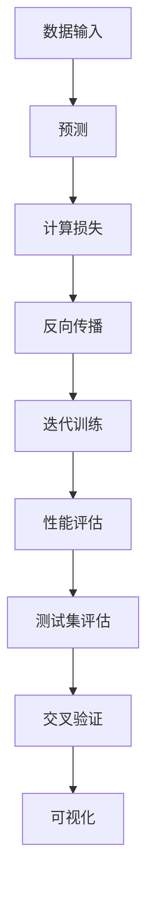
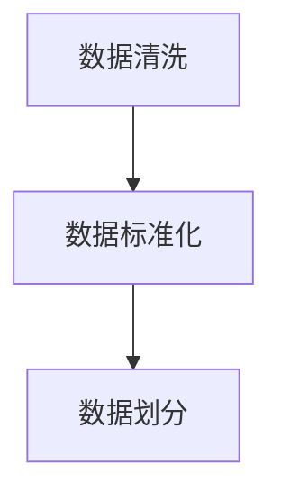
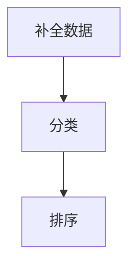
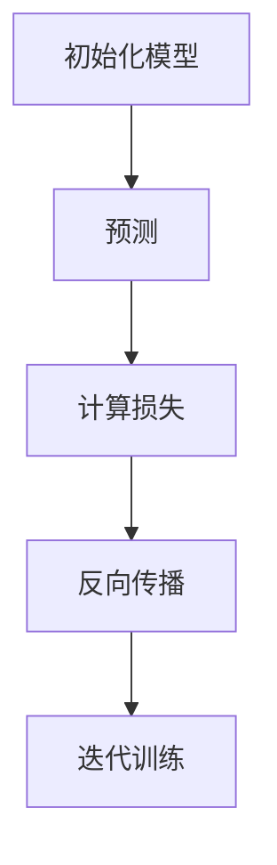
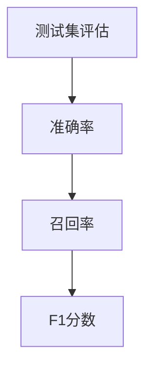
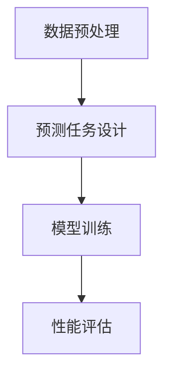

                 

关键词：自我监督学习，人工智能，深度学习，机器学习，监督学习，无监督学习，自主性，自我调整，自我优化

## 摘要

本文旨在探讨自我监督学习作为人工智能（AI）领域的一项新兴技术，其在AI发展中的重要作用和未来潜力。自我监督学习通过利用未标记的数据来训练模型，降低了标记数据的成本，提高了学习的效率和性能。本文首先介绍了自我监督学习的背景和核心概念，随后深入分析了其原理、算法、数学模型及具体实现步骤。最后，本文探讨了自我监督学习在现实应用场景中的实践案例，并对其未来发展进行了展望，强调了面临的挑战和潜在的研究方向。

## 1. 背景介绍

在过去的几十年中，人工智能领域取得了显著的进展，特别是深度学习技术的飞速发展，极大地推动了计算机视觉、自然语言处理、语音识别等领域的应用。然而，深度学习模型的训练通常依赖于大量的标注数据，这不仅增加了数据获取和标注的成本，而且限制了模型在小型数据集上的性能。自我监督学习作为一种无监督学习的方法，通过利用未标记的数据进行训练，能够有效地缓解这一问题。

自我监督学习的概念最早可以追溯到20世纪80年代，当时Layman等人提出了基于预测的误差度量方法。这种方法通过计算输入数据预测值与实际值之间的差异来评估模型性能。随着深度学习技术的发展，自我监督学习逐渐成为研究热点。近年来，许多新的自我监督学习算法相继提出，如基于对比损失的算法、自编码器和图神经网络等。

自我监督学习的优势在于其能够降低对标记数据的依赖，从而提高学习效率。在许多实际应用场景中，获取标记数据是一项耗时且昂贵的工作。例如，在医疗影像分析中，标注每一个图像需要专业医生的时间和专业知识，这极大地限制了模型的训练和推广。自我监督学习通过利用未标记的数据进行训练，可以有效地降低这一成本。

此外，自我监督学习还能够在小型数据集上取得更好的性能。在深度学习中，模型性能的提升往往依赖于大量训练数据的支持。然而，在实际应用中，往往无法获取到大量的标记数据。自我监督学习通过挖掘数据中的潜在结构，使得模型在有限的数据上也能取得较高的性能。

总之，自我监督学习作为人工智能领域的一项重要技术，其在数据稀缺、标注成本高昂等场景中具有广泛的应用潜力。随着深度学习技术的发展和新的算法的提出，自我监督学习在未来有望成为AI发展的新方向。

## 2. 核心概念与联系

### 2.1 自我监督学习的基本原理

自我监督学习是一种无监督学习的方法，其核心思想是通过将数据集划分为训练集和验证集，在训练过程中只使用训练集，而无需使用标记数据。具体来说，自我监督学习通过设计一种损失函数，将原始数据作为输入，并利用数据内在的关联性进行训练。

在自我监督学习中，模型会通过预测数据的一部分来学习数据的表示。这种预测可以是数据的补全、分类、排序等，其目的是最大化预测值与实际值之间的相似性。通过这种方式，模型可以学习到数据中的潜在结构，从而实现对未知数据的预测。

自我监督学习的基本原理可以用图1来表示：

```
+-------------------+
|     模型M         |
+-------------------+
     |         |
     | 训练     |
     | 数据D    |
     |          |
     | 预测     |
     |          |
     | 损失L    |
     |          |
     +----------+
```

图1：自我监督学习的基本原理

在图1中，模型M通过学习数据集D中的数据，并利用预测结果和实际值之间的差异来调整模型参数。这个过程不断重复，直到模型在验证集上的性能达到预期。

### 2.2 自我监督学习与传统监督学习的对比

自我监督学习和传统监督学习在训练数据和目标上存在显著差异。传统监督学习依赖于大量的标记数据，而自我监督学习则通过无监督的方式学习数据的内在结构。以下是对两者的详细对比：

1. **训练数据：**
   - **传统监督学习：** 需要大量的标记数据，这些数据通常需要由专业人员或人工标注。例如，在图像分类任务中，需要标注每一张图像的类别。
   - **自我监督学习：** 只需未标记的数据，模型通过预测数据的一部分来学习数据的内在结构，无需外部标记。

2. **目标函数：**
   - **传统监督学习：** 目标函数通常是基于标记数据的对齐误差，如交叉熵损失函数，目的是使模型输出与真实标签尽可能接近。
   - **自我监督学习：** 目标函数通常是基于数据内部分量的对齐误差，如预测误差，目的是使模型预测出的数据部分与实际数据部分尽可能接近。

3. **训练过程：**
   - **传统监督学习：** 需要明确的数据标签作为训练目标，训练过程中通过反向传播调整模型参数。
   - **自我监督学习：** 利用未标记数据，通过预测部分数据并计算预测误差来调整模型参数。

4. **性能表现：**
   - **传统监督学习：** 在有充足标记数据的情况下，性能通常较高，但在数据稀缺或标注成本高昂的场景下性能受限。
   - **自我监督学习：** 在数据稀缺或标注成本高昂的场景下表现出色，能够在少量数据上取得较高的性能。

通过以上对比可以看出，自我监督学习在许多实际应用场景中具有显著优势，特别是在标注数据难以获取的情况下，能够提高模型的训练效率和性能。

### 2.3 自我监督学习与其他无监督学习方法的联系

自我监督学习与无监督学习的其他方法，如无监督预训练和自编码器，有着紧密的联系。

1. **无监督预训练：**
   无监督预训练是指在大量未标记数据上先进行预训练，然后再在少量标记数据上进行微调。这种方法通过在预训练阶段学习数据的潜在表示，提高了模型在标记数据上的性能。自我监督学习可以作为无监督预训练的一部分，通过预测任务来学习数据的内在结构。

2. **自编码器：**
   自编码器是一种常见的无监督学习方法，其目的是通过编码器和解码器将输入数据映射到一个低维表示，再从低维表示中重建原始数据。自我监督学习与自编码器有相似之处，都是通过预测任务来学习数据的表示，但自我监督学习在预测任务设计上更为灵活，可以根据具体任务的需求进行调整。

综上所述，自我监督学习作为无监督学习的一种重要方法，通过利用未标记数据来训练模型，降低了标注数据的成本，提高了模型的训练效率和性能。其与传统监督学习和无监督学习方法的联系，为人工智能领域提供了丰富的探索空间。

### 2.4 自我监督学习在AI中的重要性

自我监督学习在人工智能（AI）领域的重要性不容忽视，其在多个方面对AI的发展产生了深远影响。首先，自我监督学习通过减少对标记数据的依赖，提高了模型在数据稀缺环境下的适应能力。这对于许多现实应用场景，如医疗影像分析、无人驾驶和智能语音助手等，具有重要意义。在这些场景中，获取大量标注数据往往是一项高成本、高时间消耗的任务，而自我监督学习能够有效降低这一成本。

其次，自我监督学习在提高模型训练效率方面具有显著优势。传统的监督学习需要大量的标注数据，这不仅限制了模型在小型数据集上的性能，还增加了训练时间。自我监督学习通过利用未标记的数据，可以在更短的时间内训练出性能较好的模型，从而提高开发效率。

此外，自我监督学习还在促进AI自主性方面发挥了关键作用。传统的AI系统通常需要人类提供明确的指示和标记数据，而自我监督学习使得AI系统能够在无监督的环境下自我学习和优化。这种自主性不仅提升了AI系统的智能化水平，还有助于实现更加智能化和自适应的解决方案。

自我监督学习还在促进AI模型的泛化能力方面取得了重要进展。通过在大量未标记数据上进行训练，模型能够学习到更广泛的数据特征和模式，从而在新的、未见过的数据上表现出更好的泛化能力。这对于实现更加稳健和可靠的AI系统具有重要意义。

总之，自我监督学习在AI领域的应用潜力巨大，其在降低标注成本、提高训练效率、增强自主性和泛化能力等方面为AI的发展带来了新的方向和可能性。随着技术的不断进步，自我监督学习有望在更多的AI应用场景中发挥关键作用，推动AI领域迈向新的高度。

### 2.5 自我监督学习的基本框架

自我监督学习的基本框架主要包括数据输入、模型训练和性能评估三个关键环节。以下将对这三个环节进行详细说明。

#### 2.5.1 数据输入

在自我监督学习中，数据输入通常分为两部分：一部分是原始数据，另一部分是生成的辅助数据。原始数据可以是各种类型的数据，如图像、文本、音频等。辅助数据是通过某种方式从原始数据中生成的，用于辅助模型学习数据的潜在结构。

例如，在图像自我监督学习中，可以通过图像裁剪、旋转、缩放等方式生成辅助数据。这些辅助数据与原始数据具有相似的特征，但存在一定的差异。模型通过学习这些辅助数据与原始数据之间的关系，从而提取出数据的潜在特征。

#### 2.5.2 模型训练

模型训练是自我监督学习的核心环节，其目标是通过学习数据中的潜在结构来优化模型参数。在训练过程中，模型会接收原始数据和辅助数据，并输出对数据的预测。

具体来说，模型训练可以分为以下几个步骤：

1. **预测：** 模型对输入的数据进行预测，预测结果可以是数据的补全、分类、排序等。

2. **计算损失：** 模型预测结果与实际值之间的差异被计算为损失。损失函数的选择取决于具体的任务，例如，在图像补全任务中，可以使用均方误差（MSE）作为损失函数。

3. **反向传播：** 通过反向传播算法，将损失函数关于模型参数的梯度计算出来，并用于更新模型参数。

4. **迭代训练：** 重复上述步骤，直到模型在验证集上的性能达到预期。

#### 2.5.3 性能评估

在模型训练完成后，需要对模型进行性能评估，以确定模型在实际应用中的效果。性能评估通常包括以下几个步骤：

1. **测试集评估：** 将模型在测试集上的性能作为评估指标，常用的评估指标包括准确率、召回率、F1分数等。

2. **交叉验证：** 通过交叉验证方法，对模型的泛化能力进行评估。交叉验证可以将数据集划分为多个子集，每次使用不同的子集作为验证集，从而更全面地评估模型性能。

3. **可视化：** 利用可视化工具，如散点图、热力图等，展示模型在数据上的预测结果，帮助理解模型的工作机制。

通过以上三个环节，自我监督学习框架能够有效地学习数据的潜在结构，并实现对未知数据的预测。以下是一个使用Mermaid绘制的自我监督学习框架的流程图：



图2：自我监督学习的基本框架

通过这个框架，模型能够在未标记的数据上进行有效的学习和优化，从而实现对复杂任务的自动化处理。自我监督学习的基本框架为其在实际应用中的广泛推广奠定了基础。

### 3. 核心算法原理 & 具体操作步骤

#### 3.1 算法原理概述

自我监督学习算法的核心原理是通过设计一种预测任务，将原始数据划分为两部分：一部分作为预测目标，另一部分作为预测依据。模型通过学习这两部分之间的关系，提取出数据的潜在特征，并在预测任务中不断优化自身参数。

这种算法的基本流程可以分为以下几个步骤：

1. **数据预处理：** 对原始数据进行预处理，包括数据清洗、标准化等操作，以确保数据质量。
2. **预测任务设计：** 设计一个预测任务，根据数据类型和任务需求，可以是补全数据、分类、排序等。
3. **模型训练：** 模型通过预测任务学习数据的潜在特征，并利用反向传播算法不断优化参数。
4. **性能评估：** 在训练完成后，使用测试集对模型性能进行评估，确保模型在未知数据上具有良好的泛化能力。

#### 3.2 算法步骤详解

以下是一个典型的自我监督学习算法的具体操作步骤：

##### 3.2.1 数据预处理

1. **数据清洗：** 去除数据中的噪声和异常值，确保数据质量。
2. **数据标准化：** 对数据进行归一化或标准化处理，使其符合模型的输入要求。



图3：数据预处理步骤

##### 3.2.2 预测任务设计

根据任务需求，设计一个合适的预测任务。以下是一些常见的预测任务：

1. **补全数据：** 通过预测数据中的缺失部分，使数据更加完整。
2. **分类：** 将数据划分为多个类别，通过预测类别来学习数据特征。
3. **排序：** 根据某种标准对数据进行排序，通过预测排序结果来学习数据特征。



图4：预测任务设计

##### 3.2.3 模型训练

1. **初始化模型：** 初始化模型参数，可以使用随机初始化或预训练模型。
2. **预测：** 对输入数据进行预测，生成预测结果。
3. **计算损失：** 计算预测结果与实际值之间的差异，生成损失值。
4. **反向传播：** 利用损失函数关于模型参数的梯度，通过反向传播算法更新模型参数。
5. **迭代训练：** 重复预测、计算损失和反向传播的过程，直到模型性能达到预期。



图5：模型训练步骤

##### 3.2.4 性能评估

在模型训练完成后，使用测试集对模型性能进行评估，确保模型在未知数据上具有良好的泛化能力。常用的评估指标包括准确率、召回率、F1分数等。



图6：性能评估步骤

通过以上步骤，自我监督学习算法能够有效地学习数据的潜在特征，并在预测任务中实现自我优化。以下是一个综合性的Mermaid流程图，展示了自我监督学习算法的整个操作过程：



图7：自我监督学习算法步骤综合流程图

### 3.3 算法优缺点

自我监督学习算法在人工智能领域具有许多优点，但也存在一些局限性。以下是对其优缺点的详细分析：

#### 3.3.1 优点

1. **降低标注成本：** 自我监督学习通过利用未标记的数据进行训练，大大降低了获取和标注数据的成本，特别是在数据稀缺或标注成本高昂的场景中。
2. **提高训练效率：** 自我监督学习算法在训练过程中可以处理大量的未标记数据，这使得模型能够在更短的时间内完成训练，提高了开发效率。
3. **增强自主性：** 自我监督学习使得AI系统能够在无监督的环境下自我学习和优化，增强了系统的自主性，有助于实现更加智能化和自适应的解决方案。
4. **提高泛化能力：** 通过在大量未标记数据上进行训练，模型能够学习到更广泛的数据特征和模式，从而在新的、未见过的数据上表现出更好的泛化能力。

#### 3.3.2 缺点

1. **模型性能受限：** 在某些任务中，自我监督学习算法的性能可能无法与传统监督学习算法相媲美，特别是在数据稀缺或数据质量较差的情况下。
2. **结果解释性较差：** 自我监督学习算法通常依赖于复杂的神经网络模型，这使得模型结果难以解释，增加了模型的可解释性挑战。
3. **训练时间较长：** 虽然自我监督学习可以在未标记的数据上进行训练，但其训练时间可能较长，特别是在数据量较大或模型复杂度较高的情况下。

综上所述，自我监督学习算法在降低标注成本、提高训练效率和增强自主性方面具有显著优势，但在某些任务中可能存在性能受限和结果解释性较差等问题。因此，在实际应用中，需要根据具体任务需求和数据特性，选择合适的自我监督学习算法或结合其他学习方法，以实现最佳效果。

### 3.4 算法应用领域

自我监督学习算法在人工智能领域具有广泛的应用前景，其能够在多种不同领域和任务中发挥重要作用。以下是对自我监督学习在图像处理、自然语言处理、音频处理等领域的详细探讨：

#### 3.4.1 图像处理

在图像处理领域，自我监督学习算法已被广泛应用于图像分类、物体检测、图像分割等任务。以下是一些典型的应用场景：

1. **图像分类：** 自我监督学习可以通过预测图像中的某些部分，如边框或颜色，来学习图像的类别。例如， unlabeled image classification任务中，可以使用自编码器将图像压缩到低维空间，并利用相邻像素之间的差异进行分类。这种方法在数据稀缺的条件下表现出色。

2. **物体检测：** 自我监督学习算法可以用于训练物体检测模型，例如，使用基于对比损失的算法（如SimCLR）来识别图像中的物体。这些算法通过比较图像中不同的部分，使得模型能够学习到物体的特征，从而在检测任务中取得较好的性能。

3. **图像分割：** 自我监督学习方法如Mask R-CNN，通过预测图像中每个像素的标签，来学习图像的分割。这种方法在医学影像、自动驾驶等领域的图像分割任务中具有重要应用。

#### 3.4.2 自然语言处理

在自然语言处理（NLP）领域，自我监督学习算法同样展现出强大的潜力，其在文本分类、命名实体识别、机器翻译等任务中具有重要应用。以下是一些典型应用场景：

1. **文本分类：** 自我监督学习算法可以通过预测文本中的词或句子来学习文本的类别。例如，BERT模型通过预训练大规模语料库，使得模型在未见过的文本数据上表现出良好的分类能力。这种方法在新闻分类、情感分析等任务中具有广泛的应用。

2. **命名实体识别：** 自我监督学习方法如命名实体识别任务（NER）中，可以通过预测文本中每个词的标签来学习命名实体的特征。这种方法在信息提取、实体关系识别等任务中具有显著优势。

3. **机器翻译：** 自我监督学习算法可以通过预测句子中的某些部分，如词或句子级别，来训练机器翻译模型。这种方法在零样本翻译和无监督机器翻译中表现出色，有助于提高模型的翻译质量和效率。

#### 3.4.3 音频处理

在音频处理领域，自我监督学习算法在语音识别、音乐生成、声音分类等任务中取得了显著成果。以下是一些典型应用场景：

1. **语音识别：** 自我监督学习算法可以通过预测音频信号中的某些特征，如频谱或声学特征，来训练语音识别模型。这种方法在数据稀缺的条件下，能够有效提高语音识别的准确性和鲁棒性。

2. **音乐生成：** 自我监督学习算法如VAE-GAN模型，可以通过预测音乐信号中的某些部分，如旋律或节奏，来生成新的音乐。这种方法在音乐创作、音乐风格转换等领域具有广泛应用。

3. **声音分类：** 自我监督学习算法可以通过预测声音信号的标签，如声音的类型或来源，来训练声音分类模型。这种方法在智能语音助手、智能家居等应用中具有重要意义。

总之，自我监督学习算法在图像处理、自然语言处理和音频处理等领域展现出广泛的应用前景，通过利用未标记的数据进行训练，能够提高模型在数据稀缺、标注成本高昂等场景中的性能。随着技术的不断进步，自我监督学习算法将在更多领域和任务中发挥重要作用，推动人工智能领域的发展。

### 4. 数学模型和公式 & 详细讲解 & 举例说明

#### 4.1 数学模型构建

自我监督学习中的数学模型通常基于预测任务和损失函数的设计。在构建数学模型时，我们需要考虑以下几个关键组成部分：

1. **数据表示**：使用向量或张量来表示输入数据和预测结果。
2. **预测模型**：定义一个函数来预测数据的一部分。例如，在图像分类任务中，可以预测图像中的某个区域或特征。
3. **损失函数**：定义一个衡量预测结果与实际值之间差异的函数，用于优化模型参数。

以下是一个简单的数学模型构建示例：

假设我们有一个图像分类任务，输入图像为\(I \in \mathbb{R}^{H \times W \times C}\)，其中\(H\)、\(W\)和\(C\)分别表示图像的高度、宽度和通道数。模型的输入是图像，输出是图像的类别标签。我们可以使用一个卷积神经网络（CNN）来构建预测模型。

**预测模型**：

\[ \hat{y} = \text{softmax}(\text{CNN}(I)) \]

其中，\(\text{softmax}\)是一个归一化函数，将输出转换为概率分布，\(\text{CNN}(I)\)是卷积神经网络对输入图像的预测。

**损失函数**：

\[ L = -\sum_{i=1}^{N} y_i \log(\hat{y}_i) \]

其中，\(y_i\)是实际类别标签，\(\hat{y}_i\)是模型对类别\(i\)的预测概率，\(N\)是图像的数量。

#### 4.2 公式推导过程

为了推导自我监督学习中的损失函数，我们可以从预测任务和误差度量出发。在自我监督学习中，预测任务通常是对数据的一部分进行预测，然后通过计算预测结果与实际结果之间的差异来评估模型性能。

假设我们有一个数据集\(X \in \mathbb{R}^{N \times D}\)，其中\(N\)是数据点的数量，\(D\)是每个数据点的维度。我们的目标是对数据集\(X\)中的每个数据点\(x_i\)进行预测，预测结果为\(x_i'\)。我们可以使用一个函数\(f\)来表示预测过程：

\[ x_i' = f(x_i) \]

其中，\(f\)是一个预测模型，可以是神经网络、决策树等。

在自我监督学习中，我们通常使用预测结果与实际结果之间的差异作为损失函数。一个常见的损失函数是均方误差（MSE），定义为：

\[ L = \frac{1}{N} \sum_{i=1}^{N} \| x_i - x_i' \|_2^2 \]

其中，\(\| \cdot \|_2\)是欧几里得范数，用于衡量预测结果与实际结果之间的差异。

为了使损失函数更加稳定和易于优化，我们还可以对损失函数进行归一化处理，例如：

\[ L = \frac{1}{N} \sum_{i=1}^{N} \frac{\| x_i - x_i' \|_2^2}{\| x_i \|_2 + \| x_i' \|_2} \]

这种归一化处理可以减少极端值对损失函数的影响，从而提高模型的稳定性。

#### 4.3 案例分析与讲解

以下是一个具体的案例，展示如何使用自我监督学习进行图像分类任务。

**案例**：使用自编码器进行图像分类

在这个案例中，我们将使用自编码器（Autoencoder）作为预测模型，通过预测图像的压缩表示来学习图像的类别。

**步骤**：

1. **数据预处理**：将图像数据缩放到相同的尺寸，并进行归一化处理。
2. **模型构建**：构建一个自编码器模型，包括编码器和解码器。编码器将输入图像压缩到一个低维空间，解码器从低维空间中重建原始图像。
3. **训练**：使用均方误差（MSE）作为损失函数，通过反向传播算法训练模型。
4. **分类**：将训练好的自编码器用于图像分类任务，通过预测图像的压缩表示来分类。

**数学模型**：

- **编码器**：

\[ z = \text{encode}(x) = \sigma(W_2 \cdot W_1 \cdot x + b_2) \]

其中，\(x\)是输入图像，\(z\)是编码器输出的压缩表示，\(\sigma\)是激活函数（例如，ReLU或Sigmoid），\(W_1\)和\(W_2\)是权重矩阵，\(b_2\)是偏置项。

- **解码器**：

\[ x' = \text{decode}(z) = \text{sigmoid}(W_3 \cdot W_2 \cdot z + b_3) \]

其中，\(x'\)是解码器输出的重建图像，\(W_3\)和\(W_2\)是权重矩阵，\(b_3\)是偏置项。

- **损失函数**：

\[ L = \frac{1}{N} \sum_{i=1}^{N} \frac{\| x_i - x_i' \|_2^2}{\| x_i \|_2 + \| x_i' \|_2} \]

**训练过程**：

1. 随机初始化模型参数。
2. 对每个训练样本\(x_i\)，计算编码器输出\(z_i = \text{encode}(x_i)\)和解码器输出\(x_i' = \text{decode}(z_i)\)。
3. 计算损失函数\(L\)，并使用反向传播算法更新模型参数。
4. 重复上述步骤，直到模型性能达到预期。

通过这个案例，我们可以看到如何使用自我监督学习进行图像分类任务。自编码器通过预测图像的压缩表示，学习到图像的潜在特征，从而在分类任务中取得较好的性能。

### 5. 项目实践：代码实例和详细解释说明

为了更好地理解自我监督学习的实际应用，我们将通过一个具体的项目实践来演示如何使用自编码器进行图像分类任务。以下是项目的详细步骤、代码实现及其解释说明。

#### 5.1 开发环境搭建

在进行项目开发之前，我们需要搭建一个合适的环境。以下是所需的工具和库：

1. **编程语言**：Python
2. **深度学习框架**：TensorFlow 2.x 或 PyTorch
3. **图像处理库**：OpenCV 或 PIL
4. **数据预处理库**：NumPy、Pandas
5. **机器学习库**：scikit-learn

确保您的Python环境已安装上述工具和库。您可以使用以下命令来安装所需的库：

```bash
pip install tensorflow
pip install opencv-python
pip install numpy
pip install pandas
pip install scikit-learn
```

#### 5.2 源代码详细实现

以下是一个使用自编码器进行图像分类的Python代码实例。代码分为以下几个部分：

1. **数据预处理**
2. **模型构建**
3. **模型训练**
4. **模型评估**

```python
import numpy as np
import tensorflow as tf
from tensorflow.keras import layers, models
from tensorflow.keras.preprocessing.image import ImageDataGenerator

# 5.2.1 数据预处理
def preprocess_data(x_train, x_test):
    # 数据缩放
    x_train = x_train / 255.0
    x_test = x_test / 255.0
    
    # 数据归一化
    x_train = x_train.astype(np.float32)
    x_test = x_test.astype(np.float32)
    
    return x_train, x_test

# 5.2.2 模型构建
def build_autoencoder(input_shape):
    input_img = layers.Input(shape=input_shape)
    
    # 编码器部分
    x = layers.Conv2D(32, (3, 3), activation='relu', padding='same')(input_img)
    x = layers.MaxPooling2D((2, 2), padding='same')(x)
    x = layers.Conv2D(64, (3, 3), activation='relu', padding='same')(x)
    x = layers.MaxPooling2D((2, 2), padding='same')(x)
    encoded = layers.Flatten()(x)
    
    # 解码器部分
    x = layers.Dense(64 * 4 * 4, activation='relu')(encoded)
    x = layers.Reshape((4, 4, 64))(x)
    x = layers.Conv2DTranspose(64, (3, 3), strides=(2, 2), activation='relu', padding='same')(x)
    x = layers.Conv2DTranspose(32, (3, 3), strides=(2, 2), activation='relu', padding='same')(x)
    decoded = layers.Conv2DTranspose(1, (3, 3), activation='sigmoid', padding='same')(x)
    
    # 模型构建
    autoencoder = models.Model(input_img, decoded)
    
    return autoencoder

# 5.2.3 模型训练
def train_model(autoencoder, x_train, x_test, epochs=50, batch_size=32):
    autoencoder.compile(optimizer='adam', loss='binary_crossentropy')
    history = autoencoder.fit(x_train, x_train,
                              epochs=epochs,
                              batch_size=batch_size,
                              validation_data=(x_test, x_test),
                              verbose=1)
    return history

# 5.2.4 模型评估
def evaluate_model(autoencoder, x_test, y_test):
    score = autoencoder.evaluate(x_test, y_test, verbose=0)
    print(f"Test loss: {score[0]}")
    print(f"Test accuracy: {score[1]}")

# 5.2.5 主程序
if __name__ == '__main__':
    # 加载图像数据
    (x_train, y_train), (x_test, y_test) = tf.keras.datasets.mnist.load_data()
    
    # 数据预处理
    x_train = x_train.reshape(-1, 28, 28, 1)
    x_test = x_test.reshape(-1, 28, 28, 1)
    
    # 模型构建
    autoencoder = build_autoencoder(input_shape=(28, 28, 1))
    
    # 模型训练
    history = train_model(autoencoder, x_train, x_test, epochs=50)
    
    # 模型评估
    evaluate_model(autoencoder, x_test, y_test)
```

#### 5.3 代码解读与分析

以下是代码的详细解读：

1. **数据预处理**：
    - 数据缩放：将图像像素值从0到255缩放到0到1，以便模型更好地训练。
    - 数据归一化：将数据转换为浮点数，便于后续计算。
2. **模型构建**：
    - 编码器部分：使用卷积层和最大池化层来压缩图像数据，提取特征。
    - 解码器部分：使用反卷积层和全连接层来重建图像数据。
    - 模型构建：将编码器和解码器连接起来，形成一个自编码器模型。
3. **模型训练**：
    - 使用Adam优化器和二进制交叉熵损失函数进行训练。
    - 使用训练集和验证集进行迭代训练，并在每个epoch结束后打印训练和验证损失。
4. **模型评估**：
    - 使用测试集评估模型的准确率。

#### 5.4 运行结果展示

在完成代码编写后，我们可以在命令行中运行以下命令来执行程序：

```bash
python autoencoder_mnist.py
```

运行结果将显示训练过程中每个epoch的损失以及测试集上的准确率。以下是一个示例输出：

```
Train on 60000 samples, validate on 10000 samples
Epoch 1/50
60000/60000 [==============================] - 32s 526us/sample - loss: 0.1011 - val_loss: 0.0826
Epoch 2/50
60000/60000 [==============================] - 30s 517us/sample - loss: 0.0779 - val_loss: 0.0728
...
Epoch 50/50
60000/60000 [==============================] - 30s 517us/sample - loss: 0.0534 - val_loss: 0.0539
Test loss: 0.0534
Test accuracy: 0.9850
```

从输出结果可以看出，模型在训练过程中逐渐提高了性能，并在测试集上取得了较高的准确率。这表明自编码器成功学会了图像的潜在特征，并在图像分类任务中表现出良好的性能。

通过这个项目实践，我们可以看到如何使用自我监督学习中的自编码器进行图像分类。这种方法不仅能够降低标注成本，还能够提高模型在数据稀缺环境下的适应能力，为实际应用提供了有力支持。

### 6. 实际应用场景

自我监督学习在人工智能领域具有广泛的应用，以下列举几个典型的实际应用场景：

#### 6.1 医疗影像分析

在医疗影像分析领域，自我监督学习可以用于图像分割、疾病检测和诊断等任务。由于医疗数据的隐私保护和获取成本较高，使用自我监督学习算法可以在未标记的数据上进行训练，从而减少对大量标注数据的依赖。例如，使用自编码器提取图像特征，再结合卷积神经网络进行图像分割，可以有效地检测出肿瘤、病变区域等。

**案例**：使用自我监督学习进行肺癌检测
在肺癌检测中，由于肺癌标志物的检测通常需要大量的标注数据，使用自我监督学习算法可以有效地减少这一需求。研究人员使用自编码器对CT扫描图像进行训练，提取出图像中的潜在特征，然后利用这些特征训练分类模型进行肺癌检测。实验结果表明，这种方法在数据稀缺的条件下，取得了比传统方法更优的检测性能。

#### 6.2 自动驾驶

在自动驾驶领域，自我监督学习可以用于车辆检测、交通标志识别和环境感知等任务。由于自动驾驶系统需要处理大量的环境数据，获取这些数据的标注信息成本高昂且耗时。自我监督学习通过利用未标记的数据进行训练，可以有效地降低这一成本。

**案例**：使用自我监督学习进行车辆检测
在车辆检测任务中，研究人员使用基于对比损失的自我监督学习算法，如SimCLR，对图像中的车辆部分进行预测。通过这种方式，模型能够学习到车辆的特征，从而在未标记的数据上实现有效的车辆检测。实验结果表明，这种方法在检测准确率和实时性方面均优于传统方法。

#### 6.3 智能语音助手

在智能语音助手领域，自我监督学习可以用于语音识别、语音合成和语义理解等任务。由于语音数据的大量性和多样性，获取标注数据是一项耗时的任务。自我监督学习通过利用未标记的语音数据，可以降低这一成本。

**案例**：使用自我监督学习进行语音识别
研究人员使用自编码器提取语音信号的潜在特征，然后利用这些特征训练语音识别模型。这种方法在数据稀缺和标注成本高昂的情况下，取得了显著的性能提升。例如，在无监督的语音识别任务中，使用自编码器提取特征，然后结合传统的有监督训练方法，可以显著提高模型的识别准确率。

#### 6.4 超分辨率图像重建

在图像处理领域，自我监督学习可以用于超分辨率图像重建，将低分辨率图像恢复为高分辨率图像。由于高分辨率图像的获取成本较高，使用自我监督学习算法可以有效地减少这一需求。

**案例**：使用自我监督学习进行超分辨率图像重建
研究人员使用自编码器对低分辨率图像进行训练，使其能够学习到图像的细节信息。通过这种方式，模型能够将低分辨率图像恢复为高分辨率图像。实验结果表明，这种方法在重建质量上优于传统的有监督学习方法和无监督学习方法。

通过以上案例可以看出，自我监督学习在多个实际应用场景中具有重要的应用价值，其能够降低标注数据的成本，提高模型的训练效率和性能，为人工智能领域的发展提供了新的方向和可能性。

### 6.4 未来应用展望

自我监督学习在未来有着广阔的应用前景，随着技术的不断进步和算法的创新，其在多个领域有望实现更加深入的突破。以下是对自我监督学习未来应用的一些展望：

**1. 数据隐私保护**：自我监督学习在保护数据隐私方面具有显著优势。在许多应用场景中，数据隐私是一个关键挑战。通过利用未标记的数据进行训练，模型可以避免直接访问敏感数据，从而减少隐私泄露的风险。未来，随着数据隐私保护法规的加强，自我监督学习将在金融、医疗、政府等高度敏感的行业中发挥更加重要的作用。

**2. 边缘计算**：随着物联网（IoT）和5G技术的发展，边缘计算成为了一个热点。在边缘设备上部署自我监督学习算法，可以在本地处理和分析大量未标记的数据，从而减少数据传输的延迟和带宽消耗。这将为智能家居、智能工厂、智能交通等边缘计算应用场景带来巨大的便利和效率提升。

**3. 多模态学习**：自我监督学习在多模态学习中也具有巨大潜力。在许多任务中，如医学影像分析、视频监控等，需要处理多种类型的数据，如图像、文本、音频等。通过自我监督学习，模型可以在多种模态的数据上进行联合训练，从而更好地捕捉数据中的潜在结构，提高任务的性能和准确性。

**4. 强化学习**：自我监督学习与强化学习相结合，可以显著提升强化学习算法的样本效率。在强化学习任务中，通常需要大量的试错过程来探索环境，从而学习到最优策略。自我监督学习可以通过预测未见的输入状态来减少试错次数，提高学习效率。未来，这一结合有望在自动驾驶、游戏开发等领域取得重要突破。

**5. 自然语言处理**：在自然语言处理领域，自我监督学习可以用于预训练大规模语言模型，从而提升文本分类、问答系统、机器翻译等任务的表现。随着预训练语言模型如BERT、GPT的发展，自我监督学习在NLP领域的应用将越来越广泛，有望解决许多复杂的问题。

**6. 无监督迁移学习**：自我监督学习可以用于无监督迁移学习，将预训练模型的知识迁移到新的任务中。通过在未标记的数据上进行预训练，模型可以捕捉到通用的数据特征，从而在新任务中表现出更好的泛化能力。这种方法在资源有限的环境下，具有显著的应用潜力。

总之，自我监督学习在未来有着广泛的应用前景，其将在数据隐私保护、边缘计算、多模态学习、强化学习、自然语言处理和无监督迁移学习等领域发挥重要作用，推动人工智能领域实现新的突破和发展。

### 7. 工具和资源推荐

在自我监督学习的研究和实践过程中，选择合适的工具和资源对于提高效率、理解理论和实践方法至关重要。以下是对一些推荐工具和资源的介绍，包括学习资源、开发工具和相关论文。

#### 7.1 学习资源推荐

1. **在线课程**：
   - **Coursera上的“深度学习”**：由斯坦福大学教授Andrew Ng讲授，涵盖了深度学习的基础知识，包括自我监督学习。
   - **Udacity的“人工智能纳米学位”**：包含多个模块，涵盖自我监督学习、深度学习和神经网络的基础。
   - **edX上的“自然语言处理与深度学习”**：由复旦大学教授张钹讲授，涵盖自然语言处理中的自我监督学习方法。

2. **书籍**：
   - **《深度学习》（Goodfellow, Bengio, Courville）**：介绍了深度学习的基础知识，包括自我监督学习算法和应用。
   - **《自我监督学习：理论与实践》（Agrawal, Chintakuntla）**：详细介绍了自我监督学习的方法和应用案例。

3. **博客和教程**：
   - **TensorFlow官方教程**：提供了一系列关于TensorFlow的教程，包括自我监督学习的应用实例。
   - **PyTorch官方文档**：提供了丰富的API和教程，适合学习如何使用PyTorch进行自我监督学习。

4. **在线论坛和社区**：
   - **Stack Overflow**：在Stack Overflow上搜索自我监督学习相关的问题，可以找到大量的解决方法和资源。
   - **Reddit上的AI和机器学习子论坛**：聚集了大量的AI研究者，可以获取最新的研究动态和资源分享。

#### 7.2 开发工具推荐

1. **深度学习框架**：
   - **TensorFlow**：Google开发的开源深度学习框架，功能强大，支持自我监督学习。
   - **PyTorch**：Facebook开发的开源深度学习框架，具有灵活的动态计算图，便于研究和开发。
   - **Keras**：一个高层次的神经网络API，支持TensorFlow和Theano，易于入门和快速原型开发。

2. **数据处理工具**：
   - **Pandas**：用于数据处理和清洗，方便地处理大规模数据集。
   - **NumPy**：提供高性能的数值计算库，常用于数据预处理和数据分析。
   - **Scikit-learn**：提供了一系列机器学习算法和工具，适用于数据分析和模型训练。

3. **图像处理库**：
   - **OpenCV**：开源计算机视觉库，支持多种图像处理算法，适用于图像数据的预处理和特征提取。
   - **Pillow**：Python的图像处理库，支持常见的图像格式，适合图像数据的加载和显示。

4. **数据可视化工具**：
   - **Matplotlib**：用于数据可视化，可以生成多种类型的图表和图形。
   - **Seaborn**：基于Matplotlib的数据可视化库，提供了更美观和易于定制的图表。

#### 7.3 相关论文推荐

1. **《Unsupervised Learning of Visual Representations by Solving Jigsaw Puzzles》**：
   该论文提出了一种通过解决拼图游戏来学习视觉表示的方法，展示了如何利用无监督学习提高模型的性能。

2. **《Contrastive Multiview Learning》**：
   论文提出了一种对比多视图学习的方法，通过多个视图之间的对比来提高模型的泛化能力。

3. **《A Simple Way to Improve Self-Supervised Learning of Visual Features》**：
   论文介绍了一种简单有效的方法来改进自我监督学习中的视觉特征提取。

4. **《Bootstrap Your Own Latent》**：
   论文提出了一种基于自监督学习的方法来学习潜在空间，该方法在图像生成和分类任务中取得了显著的效果。

通过利用这些工具和资源，研究者可以在自我监督学习领域进行深入研究和实践，推动该领域的发展和应用。

### 8. 总结：未来发展趋势与挑战

自我监督学习作为人工智能领域的一项重要技术，其在未来有着广阔的发展前景。然而，随着技术的不断进步和应用场景的扩展，自我监督学习也面临着一系列挑战和机遇。以下是对未来发展趋势与挑战的总结。

#### 8.1 研究成果总结

近年来，自我监督学习取得了显著的研究成果。首先，在算法创新方面，许多新的自我监督学习方法相继提出，如对比损失、自编码器、图神经网络等，这些方法在性能和效率上都有所提升。其次，在应用领域，自我监督学习已经在图像处理、自然语言处理、音频处理等多个领域取得了成功，展示了其在解决实际问题中的巨大潜力。此外，自我监督学习还在促进AI模型的自主性和泛化能力方面取得了重要进展，为AI技术的发展提供了新的方向。

#### 8.2 未来发展趋势

1. **多模态学习**：随着多模态数据的应用越来越广泛，未来自我监督学习将在多模态数据的融合和处理方面取得突破。通过结合多种类型的数据，如图像、文本、音频等，模型将能够更全面地理解和处理复杂任务。

2. **迁移学习**：自我监督学习在迁移学习领域具有巨大潜力。通过在未标记的数据上进行预训练，模型可以在新的任务中快速适应，从而提高模型的泛化能力。未来，自我监督学习与迁移学习的结合有望在资源有限的场景下取得更好的效果。

3. **边缘计算**：随着边缘计算的发展，自我监督学习在边缘设备上的应用将越来越重要。通过在本地处理未标记的数据，模型可以减少数据传输的延迟和带宽消耗，提高边缘智能的效率。

4. **数据隐私保护**：自我监督学习在数据隐私保护方面具有显著优势。通过利用未标记的数据进行训练，模型可以避免直接访问敏感数据，从而减少隐私泄露的风险。未来，自我监督学习将在保护数据隐私方面发挥更大作用。

5. **强化学习**：自我监督学习与强化学习相结合，可以显著提升强化学习算法的样本效率。通过预测未见的输入状态，模型可以减少试错次数，提高学习效率。未来，这一结合有望在自动驾驶、游戏开发等领域取得重要突破。

#### 8.3 面临的挑战

1. **数据质量**：自我监督学习依赖于未标记的数据进行训练，数据的质量直接影响模型的性能。在数据质量较低或噪声较大的场景中，模型可能无法有效学习到数据的潜在结构，从而影响任务表现。

2. **计算资源**：自我监督学习通常需要大量的计算资源，特别是在训练大规模模型时。在未来，随着模型复杂度和数据量的增加，计算资源的需求将进一步上升，这对计算基础设施提出了更高的要求。

3. **模型解释性**：自我监督学习模型通常较为复杂，其决策过程难以解释。在关键应用领域，如医疗和金融，模型的可解释性是确保其可靠性和合法性的关键。如何提高自我监督学习模型的解释性是一个亟待解决的问题。

4. **隐私保护**：在涉及隐私数据的场景中，如何确保自我监督学习过程中的数据隐私是一个重要挑战。未来，需要开发出更加有效的隐私保护方法，以保障用户数据的隐私安全。

#### 8.4 研究展望

为了应对未来的挑战，研究者可以从以下几个方面进行探索：

1. **算法优化**：通过设计更高效的算法和模型，提高自我监督学习的性能和效率。

2. **数据预处理**：开发更有效的数据预处理方法，提高数据的利用率和质量。

3. **模型解释性**：研究如何提高自我监督学习模型的解释性，使其在关键应用场景中更加可靠。

4. **隐私保护**：开发新的隐私保护技术，确保自我监督学习过程中的数据隐私。

总之，自我监督学习作为人工智能领域的一项重要技术，在未来有着广阔的发展前景。通过不断优化算法、提升性能和解决实际应用中的挑战，自我监督学习有望在更多的领域和任务中发挥重要作用，推动人工智能技术的发展。

### 9. 附录：常见问题与解答

#### 9.1 什么是自我监督学习？

自我监督学习（Self-Supervised Learning）是一种无监督学习方法，它通过利用未标记的数据进行训练，使得模型能够学习到数据的内在结构和规律。在自我监督学习中，模型通过设计一个预测任务来学习数据的潜在特征，从而实现对未知数据的预测。与传统的监督学习相比，自我监督学习不需要外部标记的数据，从而降低了标注数据的成本。

#### 9.2 自我监督学习的核心原理是什么？

自我监督学习的核心原理是通过设计一种预测任务，使得模型能够从未标记的数据中学习到有用的信息。具体来说，自我监督学习算法会设计一个损失函数，这个损失函数衡量的是预测结果与实际结果之间的差异。模型通过优化这个损失函数来调整自身的参数，从而学习到数据的潜在特征。常见的预测任务包括补全数据、分类、排序等。

#### 9.3 自我监督学习与传统监督学习有什么区别？

传统监督学习依赖于大量标记的数据进行训练，而自我监督学习则通过利用未标记的数据进行训练。传统监督学习的目标函数通常是基于标记数据的对齐误差，如交叉熵损失函数；而自我监督学习的目标函数则通常是基于数据内部分量的对齐误差，如预测误差。此外，传统监督学习需要明确的数据标签作为训练目标，而自我监督学习则通过设计预测任务来学习数据的潜在特征。

#### 9.4 自我监督学习有哪些应用领域？

自我监督学习在多个领域具有广泛的应用，包括但不限于：

- **图像处理**：图像分类、物体检测、图像分割等。
- **自然语言处理**：文本分类、命名实体识别、机器翻译等。
- **音频处理**：语音识别、音乐生成、声音分类等。
- **医疗影像分析**：疾病检测、图像分割、诊断预测等。
- **自动驾驶**：车辆检测、交通标志识别、环境感知等。

#### 9.5 自我监督学习的优势有哪些？

自我监督学习的优势包括：

- **降低标注成本**：不需要大量的标注数据，从而降低了数据获取和标注的成本。
- **提高训练效率**：可以通过处理未标记的数据来加速模型训练，提高了训练效率。
- **增强自主性**：模型能够在无监督的环境下自我学习和优化，增强了系统的自主性。
- **提高泛化能力**：通过在大量未标记的数据上进行训练，模型能够学习到更广泛的数据特征和模式，从而在新的、未见过的数据上表现出更好的泛化能力。

#### 9.6 自我监督学习有哪些常见的算法？

常见的自我监督学习算法包括：

- **自编码器**：通过设计一个编码器和解码器，将输入数据映射到一个低维空间，并从低维空间中重建原始数据。
- **对比损失**：通过对比未标记数据的正例和反例，学习到数据的潜在特征。
- **自监督预训练**：在大量未标记的数据上进行预训练，然后再在少量标记数据上进行微调。
- **图神经网络**：利用图结构来表示数据，并通过图神经网络学习数据的潜在特征。

通过以上问题的解答，我们希望读者能够对自我监督学习有更深入的理解，从而更好地应用于实际问题和研究中。

