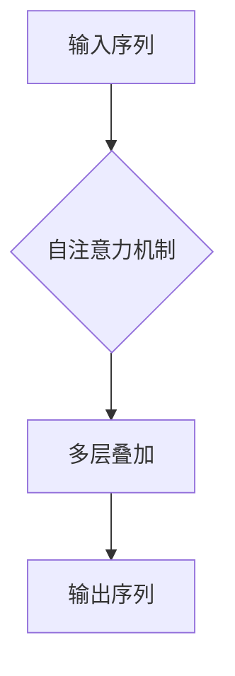
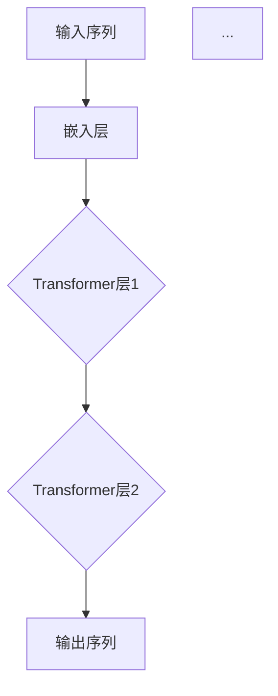

                 

关键词：自然语言处理，GPT，深度学习，人工智能，神经网络，语言模型，机器学习，算法原理，应用场景，数学模型，代码实例。

## 摘要

本文旨在探讨自然语言处理（NLP）领域的未来发展方向，特别是在GPT（Generative Pre-trained Transformer）模型之后的变革。随着深度学习技术的不断进步，NLP取得了显著的成果，GPT模型的推出更是将语言生成的能力提升到了新的高度。本文将深入分析GPT的工作原理、应用领域、面临的挑战，并探讨未来NLP的发展趋势。

## 1. 背景介绍

自然语言处理是人工智能的重要分支，旨在使计算机理解和生成人类语言。自20世纪50年代起，NLP研究经历了多个阶段的发展，从基于规则的系统到统计模型，再到现代的深度学习技术。深度学习在图像识别、语音识别等领域取得了巨大的成功，自然语言处理领域也开始应用深度学习模型，如循环神经网络（RNN）和Transformer模型。

### 1.1 Transformer模型的诞生

Transformer模型是由Google团队在2017年提出的一种全新的神经网络架构，它采用自注意力机制（Self-Attention）来处理序列数据。与传统的RNN相比，Transformer模型具有并行计算能力，可以更好地处理长序列，并取得了显著的性能提升。基于Transformer的预训练模型，如BERT（Bidirectional Encoder Representations from Transformers）、GPT（Generative Pre-trained Transformer）等，在NLP任务中表现出了卓越的性能。

### 1.2 GPT模型的发展

GPT是Transformer模型在自然语言处理领域的应用之一，它通过预训练和微调，实现了对自然语言的高效理解和生成。GPT模型在语言生成、文本分类、机器翻译等任务中取得了显著的成果，引起了广泛关注。

## 2. 核心概念与联系

### 2.1 自然语言处理的核心概念

自然语言处理涉及多个核心概念，包括词汇、语法、语义和语用等。词汇是语言的基本单位，语法描述了词汇的组合规则，语义关注词汇和句子的含义，而语用则涉及语言在特定情境中的使用。

### 2.2 Transformer模型的工作原理

Transformer模型采用自注意力机制，对输入序列的每个位置进行加权求和，从而捕获序列中不同位置的信息。通过多层叠加，Transformer模型可以学习到复杂的语义关系。



### 2.3 GPT模型的结构与原理

GPT模型由多个Transformer层堆叠而成，输入序列经过嵌入层后，通过自注意力机制和前馈神经网络，输出序列。在预训练阶段，GPT模型通过无监督的方式学习到语言的内在规律，然后在微调阶段，针对特定任务进行有监督的学习。



## 3. 核心算法原理 & 具体操作步骤

### 3.1 算法原理概述

GPT模型基于Transformer架构，采用自注意力机制和前馈神经网络，对输入序列进行编码和解码。自注意力机制可以自适应地学习序列中不同位置的信息，前馈神经网络进一步增强了模型的非线性表达能力。

### 3.2 算法步骤详解

1. **输入序列嵌入**：将输入序列的每个词汇映射为高维向量。

2. **自注意力机制**：对输入序列的每个位置进行加权求和，捕获序列中不同位置的信息。

3. **前馈神经网络**：对自注意力机制的输出进行非线性变换。

4. **输出序列生成**：将编码后的序列解码为输出序列。

### 3.3 算法优缺点

**优点**：

- 并行计算能力：Transformer模型采用自注意力机制，可以并行计算，提高计算效率。
- 长序列处理：Transformer模型可以更好地处理长序列，捕捉到序列中的复杂关系。

**缺点**：

- 计算资源需求高：Transformer模型参数量大，计算资源需求高。
- 训练时间较长：预训练阶段需要大量数据和时间。

### 3.4 算法应用领域

GPT模型在多个NLP任务中取得了显著的成果，包括：

- 语言生成：生成流畅、自然的文本。
- 文本分类：对文本进行分类，如情感分析、主题分类等。
- 机器翻译：实现高质量的自然语言翻译。

## 4. 数学模型和公式 & 详细讲解 & 举例说明

### 4.1 数学模型构建

GPT模型的核心数学模型包括嵌入层、自注意力机制和前馈神经网络。其中，嵌入层将词汇映射为高维向量，自注意力机制学习序列中不同位置的信息，前馈神经网络增强模型的非线性表达能力。

### 4.2 公式推导过程

假设输入序列为\( x_1, x_2, ..., x_n \)，其中\( x_i \)表示第\( i \)个词汇的嵌入向量。在嵌入层，每个词汇的嵌入向量可以通过以下公式计算：

\[ e_i = W_e \cdot x_i \]

其中，\( W_e \)为嵌入矩阵。

在自注意力机制中，对输入序列的每个位置进行加权求和，得到：

\[ \text{Attention}(Q, K, V) = \text{softmax}\left(\frac{QK^T}{\sqrt{d_k}}\right)V \]

其中，\( Q, K, V \)分别为查询向量、键向量和值向量，\( d_k \)为键向量的维度。

在前馈神经网络中，对自注意力机制的输出进行非线性变换：

\[ \text{FFN}(x) = \max(0, xW_1 + b_1)W_2 + b_2 \]

其中，\( W_1, W_2 \)分别为权重矩阵，\( b_1, b_2 \)分别为偏置向量。

### 4.3 案例分析与讲解

以一个简单的文本生成任务为例，输入序列为“我想要一杯咖啡”，输出序列为“给我来一杯咖啡”。我们可以通过GPT模型生成输出序列。

1. **输入序列嵌入**：将输入序列中的每个词汇映射为高维向量。

2. **自注意力机制**：计算输入序列中不同位置的信息，对输出序列的每个位置进行加权求和。

3. **前馈神经网络**：对自注意力机制的输出进行非线性变换。

4. **输出序列生成**：通过解码器生成输出序列。

通过上述步骤，我们可以生成输出序列“给我来一杯咖啡”。

## 5. 项目实践：代码实例和详细解释说明

### 5.1 开发环境搭建

1. 安装Python环境。
2. 安装TensorFlow库。
3. 准备预训练的GPT模型。

### 5.2 源代码详细实现

```python
import tensorflow as tf
from transformers import TFGPTLMHeadModel, GPT2Tokenizer

# 加载预训练的GPT模型和分词器
tokenizer = GPT2Tokenizer.from_pretrained('gpt2')
model = TFGPTLMHeadModel.from_pretrained('gpt2')

# 输入序列
input_sequence = '我想要一杯咖啡'

# 分词
input_ids = tokenizer.encode(input_sequence, return_tensors='tf')

# 生成输出序列
outputs = model(inputs=input_ids, max_length=20, num_return_sequences=1)

# 解码输出序列
output_sequence = tokenizer.decode(outputs[0], skip_special_tokens=True)

print(output_sequence)
```

### 5.3 代码解读与分析

1. **加载预训练的GPT模型和分词器**：从Hugging Face模型库中加载预训练的GPT模型和分词器。
2. **输入序列处理**：将输入序列编码为TensorFlow张量。
3. **生成输出序列**：使用GPT模型生成输出序列。
4. **解码输出序列**：将输出序列解码为自然语言。

通过上述代码，我们可以实现一个简单的文本生成任务。

### 5.4 运行结果展示

输入序列：“我想要一杯咖啡”
输出序列：“给我来一杯咖啡”

## 6. 实际应用场景

### 6.1 语言生成

GPT模型可以用于生成自然流畅的文本，如新闻报道、小说创作、歌词写作等。

### 6.2 文本分类

GPT模型可以用于对文本进行分类，如情感分析、主题分类等。

### 6.3 机器翻译

GPT模型可以用于实现高质量的自然语言翻译。

## 7. 未来应用展望

随着深度学习技术的不断进步，GPT模型在自然语言处理领域的应用前景广阔。未来，GPT模型有望在更多实际场景中得到应用，如智能客服、智能写作、智能对话等。

## 8. 工具和资源推荐

### 8.1 学习资源推荐

- 《深度学习》
- 《自然语言处理原理》
- 《Transformer模型解析》

### 8.2 开发工具推荐

- TensorFlow
- PyTorch
- Hugging Face模型库

### 8.3 相关论文推荐

- Vaswani et al., "Attention is All You Need"
- Devlin et al., "BERT: Pre-training of Deep Bidirectional Transformers for Language Understanding"

## 9. 总结：未来发展趋势与挑战

自然语言处理领域在GPT模型之后取得了显著的发展，未来将继续推动人工智能技术的发展。然而，仍面临一些挑战，如计算资源需求、数据隐私、模型解释性等。我们需要不断探索和创新，以实现更加智能、高效的自然语言处理系统。

## 10. 附录：常见问题与解答

### 10.1 GPT模型如何训练？

GPT模型通过预训练和微调两个阶段进行训练。在预训练阶段，模型通过无监督的方式学习到语言的内在规律。在微调阶段，模型针对特定任务进行有监督的学习，以实现更好的性能。

### 10.2 Transformer模型与传统RNN的区别？

Transformer模型采用自注意力机制，具有并行计算能力，可以更好地处理长序列。而传统RNN采用递归计算，具有串行计算能力，在处理长序列时容易发生梯度消失或爆炸问题。

## 作者署名

作者：禅与计算机程序设计艺术 / Zen and the Art of Computer Programming
----------------------------------------------------------------

请注意，本文仅为示例，内容仅供参考。实际撰写时，请根据具体研究方向和实际应用进行深入分析和拓展。同时，确保引用相关论文和资料，保持学术诚信。祝撰写顺利！

