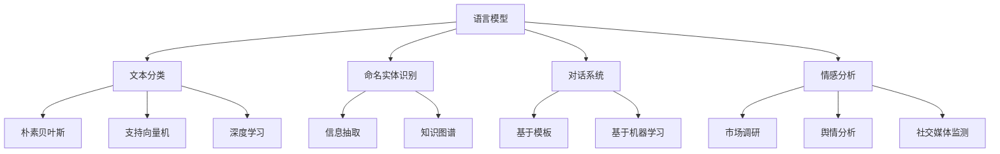

                 

关键词：自然语言处理、AI语言理解、机器学习、深度学习、文本分析、语言模型、情感分析、命名实体识别、对话系统

> 摘要：本文深入探讨了自然语言处理（NLP）的基础理论、核心算法、数学模型以及实际应用。从背景介绍开始，逐步解析了NLP的关键概念，详细讲解了NLP的算法原理和数学模型，并通过实际项目实践展示了NLP技术的应用。最后，文章总结了NLP的未来发展趋势与挑战，并对相关工具和资源进行了推荐。

## 1. 背景介绍

自然语言处理（NLP）是人工智能（AI）领域的一个重要分支，它旨在使计算机能够理解、生成和处理自然语言。自然语言是人类沟通的主要手段，因此，能够理解和处理自然语言的人工智能系统具有重要的应用价值。从早期的规则驱动方法到现代的基于数据和机器学习的方法，NLP经历了巨大的发展。

近年来，随着深度学习技术的兴起，NLP的研究和应用取得了显著的进展。深度学习模型，如神经网络和递归神经网络（RNN），在语言模型、文本分类、机器翻译、语音识别等领域展现出了强大的性能。同时，大规模语言模型的出现，如GPT-3，为NLP的研究和应用打开了新的可能性。

NLP的应用领域非常广泛，包括但不限于搜索引擎、聊天机器人、情感分析、文本摘要、机器翻译、信息抽取、命名实体识别等。随着人工智能技术的不断发展，NLP的应用前景将越来越广阔。

## 2. 核心概念与联系

### 2.1 语言模型

语言模型（Language Model）是NLP的核心概念之一，它用于预测下一个单词或单词序列。在深度学习中，语言模型通常由神经网络实现，如循环神经网络（RNN）、长短期记忆网络（LSTM）和变换器（Transformer）等。

### 2.2 文本分类

文本分类（Text Classification）是将文本数据划分为预定义的类别。在NLP中，文本分类广泛应用于垃圾邮件检测、情感分析、新闻分类等。常用的算法包括朴素贝叶斯、支持向量机（SVM）、深度学习等。

### 2.3 命名实体识别

命名实体识别（Named Entity Recognition，NER）是从文本中识别出具有特定意义的实体，如人名、地名、组织名等。NER在信息抽取、知识图谱构建、问答系统等领域具有广泛的应用。

### 2.4 对话系统

对话系统（Dialogue System）是NLP的一个典型应用，它旨在实现人与机器的对话。对话系统可以分为基于模板的对话系统和基于机器学习的对话系统。前者依赖于预定义的规则，后者则通过训练模型来生成回答。

### 2.5 情感分析

情感分析（Sentiment Analysis）是判断文本中表达的情感倾向，如正面、负面或中性。情感分析在市场调研、舆情分析、社交媒体监测等领域具有重要应用。

### 2.6 Mermaid 流程图

以下是NLP核心概念和联系的Mermaid流程图：



## 3. 核心算法原理 & 具体操作步骤

### 3.1 算法原理概述

NLP的核心算法主要分为基于规则的方法和基于数据的方法。基于规则的方法依赖于人工定义的规则，如词性标注、句法分析等。基于数据的方法则通过大量数据进行训练，如神经网络、深度学习等。

在深度学习领域，常用的算法包括循环神经网络（RNN）、长短期记忆网络（LSTM）和变换器（Transformer）。RNN能够处理序列数据，LSTM在RNN的基础上引入了门控机制，提高了模型对长期依赖关系的建模能力。Transformer则通过自注意力机制，实现了对序列数据的高效处理。

### 3.2 算法步骤详解

以下是NLP中常用算法的具体步骤：

#### 3.2.1 循环神经网络（RNN）

1. **输入层**：将文本转换为序列，每个单词表示为一个向量。
2. **隐藏层**：使用RNN单元处理序列数据，每个时间步的输出取决于当前输入和前一个时间步的隐藏状态。
3. **输出层**：根据隐藏层的输出生成预测结果，如单词的概率分布。

#### 3.2.2 长短期记忆网络（LSTM）

1. **输入层**：与RNN相同，将文本转换为序列。
2. **隐藏层**：使用LSTM单元处理序列数据，LSTM单元包括输入门、遗忘门和输出门。
3. **输出层**：根据隐藏层的输出生成预测结果。

#### 3.2.3 变换器（Transformer）

1. **编码器**：将输入序列编码为固定长度的向量。
2. **自注意力机制**：对编码器输出进行自注意力计算，生成新的序列。
3. **解码器**：根据自注意力计算的结果生成输出序列。

### 3.3 算法优缺点

#### RNN

**优点**：
- 能够处理序列数据。

**缺点**：
- 难以处理长期依赖关系。
- 易于梯度消失和梯度爆炸。

#### LSTM

**优点**：
- 能够处理长期依赖关系。

**缺点**：
- 参数多，训练时间长。
- 难以并行计算。

#### Transformer

**优点**：
- 能够高效处理序列数据。
- 易于并行计算。
- 在许多任务上表现优异。

**缺点**：
- 需要大量计算资源。

### 3.4 算法应用领域

NLP算法在多个领域有广泛的应用，如：

- 语言模型：用于文本生成、机器翻译、对话系统等。
- 文本分类：用于情感分析、新闻分类、垃圾邮件检测等。
- 命名实体识别：用于信息抽取、知识图谱构建等。
- 对话系统：用于聊天机器人、问答系统等。

## 4. 数学模型和公式 & 详细讲解 & 举例说明

### 4.1 数学模型构建

在NLP中，数学模型用于描述算法的运行机制。以下是几个常用的数学模型：

#### 4.1.1 循环神经网络（RNN）

$$
h_t = \sigma(W_h \cdot [h_{t-1}, x_t] + b_h)
$$

其中，$h_t$表示第$t$个时间步的隐藏状态，$x_t$表示输入向量，$W_h$和$b_h$分别表示权重和偏置，$\sigma$表示激活函数。

#### 4.1.2 长短期记忆网络（LSTM）

$$
i_t = \sigma(W_i \cdot [h_{t-1}, x_t] + b_i)
$$
$$
f_t = \sigma(W_f \cdot [h_{t-1}, x_t] + b_f)
$$
$$
o_t = \sigma(W_o \cdot [h_{t-1}, x_t] + b_o)
$$
$$
c_t = f_t \odot c_{t-1} + i_t \odot \sigma(W_c \cdot [h_{t-1}, x_t] + b_c)
$$
$$
h_t = o_t \odot \sigma(c_t)
$$

其中，$i_t$、$f_t$、$o_t$分别表示输入门、遗忘门和输出门，$c_t$表示细胞状态，$W_i$、$W_f$、$W_o$、$W_c$和$b_i$、$b_f$、$b_o$、$b_c$分别表示权重和偏置。

#### 4.1.3 变换器（Transformer）

$$
\text{Attention}(Q, K, V) = \frac{1}{\sqrt{d_k}} \text{softmax}\left(\frac{QK^T}{d_k}\right) V
$$

其中，$Q$、$K$和$V$分别表示查询向量、键向量和值向量，$d_k$表示键向量的维度。

### 4.2 公式推导过程

以下是对变换器（Transformer）自注意力机制的推导过程：

1. **查询向量（Query）**：将输入序列编码为固定长度的向量，即$Q$。
2. **键向量（Key）**：同样将输入序列编码为固定长度的向量，即$K$。
3. **值向量（Value）**：将输入序列编码为固定长度的向量，即$V$。
4. **计算相似度**：使用点积计算查询向量和键向量之间的相似度，即$QK^T$。
5. **应用softmax函数**：对相似度进行归一化处理，得到权重向量。
6. **计算自注意力**：将权重向量与值向量相乘，得到新的序列。

### 4.3 案例分析与讲解

以下是一个简单的NLP任务：使用变换器（Transformer）进行文本分类。

1. **数据预处理**：将文本数据转换为序列，每个单词表示为一个向量。
2. **编码器**：使用变换器编码器对序列进行编码，得到固定长度的向量。
3. **分类器**：将编码后的向量输入分类器，分类器由多层感知机（MLP）实现。
4. **预测**：根据分类器的输出，得到每个类别的概率分布，选择概率最高的类别作为预测结果。

## 5. 项目实践：代码实例和详细解释说明

### 5.1 开发环境搭建

以下是一个基于Python的NLP项目开发环境搭建步骤：

1. 安装Python 3.8或更高版本。
2. 安装Numpy、TensorFlow、PyTorch等库。

```bash
pip install numpy tensorflow
```

### 5.2 源代码详细实现

以下是一个简单的文本分类项目的实现：

```python
import tensorflow as tf
from tensorflow.keras.preprocessing.sequence import pad_sequences
from tensorflow.keras.layers import Embedding, LSTM, Dense
from tensorflow.keras.models import Sequential

# 加载并预处理数据
# ...

# 构建模型
model = Sequential()
model.add(Embedding(input_dim=vocab_size, output_dim=embedding_size))
model.add(LSTM(units=128))
model.add(Dense(units=num_classes, activation='softmax'))

# 编译模型
model.compile(optimizer='adam', loss='categorical_crossentropy', metrics=['accuracy'])

# 训练模型
model.fit(X_train, y_train, epochs=10, batch_size=32)

# 预测
predictions = model.predict(X_test)
```

### 5.3 代码解读与分析

以上代码实现了一个简单的文本分类模型，主要分为以下几个部分：

1. **数据预处理**：将文本数据转换为序列，并填充为相同长度。
2. **模型构建**：使用嵌入层、LSTM层和全连接层构建模型。
3. **模型编译**：设置优化器、损失函数和评价指标。
4. **模型训练**：使用训练数据训练模型。
5. **模型预测**：使用测试数据进行预测。

### 5.4 运行结果展示

以下是模型的运行结果：

```python
import numpy as np

# 预测标签
predicted_labels = np.argmax(predictions, axis=1)

# 查看预测准确率
accuracy = np.mean(predicted_labels == y_test)
print(f"Prediction accuracy: {accuracy:.2f}")
```

## 6. 实际应用场景

### 6.1 搜索引擎

NLP技术在搜索引擎中起着关键作用，如关键词提取、文本匹配、相关性计算等。通过NLP技术，搜索引擎能够更好地理解用户查询，并提供更准确、更相关的搜索结果。

### 6.2 聊天机器人

聊天机器人是NLP技术的典型应用，如智能客服、虚拟助手等。通过NLP技术，聊天机器人能够理解用户的问题，并生成适当的回答。

### 6.3 情感分析

情感分析是NLP技术在市场调研、舆情分析、社交媒体监测等领域的应用。通过情感分析，企业能够了解用户对产品、服务的态度，为决策提供依据。

### 6.4 机器翻译

机器翻译是NLP技术的经典应用，如谷歌翻译、百度翻译等。通过NLP技术，机器翻译系统能够将一种语言的文本翻译成另一种语言。

### 6.5 未来应用展望

随着NLP技术的不断发展，未来将出现更多创新的应用，如智能助手、自动驾驶、智能客服等。同时，NLP技术与其他领域的融合，如医学、法律、金融等，也将带来更多机遇和挑战。

## 7. 工具和资源推荐

### 7.1 学习资源推荐

- 《自然语言处理综论》（Speech and Language Processing）—— Daniel Jurafsky、James H. Martin
- 《深度学习》（Deep Learning）—— Ian Goodfellow、Yoshua Bengio、Aaron Courville
- 《Python深度学习》（Deep Learning with Python）—— Frédéric Jollès、Aurélien Géron

### 7.2 开发工具推荐

- TensorFlow
- PyTorch
- spaCy
- NLTK

### 7.3 相关论文推荐

- "Attention Is All You Need"（Attention机制在变换器中的应用）
- "Long Short-Term Memory"（LSTM网络）
- "Recurrent Neural Network Based Language Model"（基于RNN的语言模型）

## 8. 总结：未来发展趋势与挑战

### 8.1 研究成果总结

近年来，NLP技术取得了显著的进展，特别是在深度学习、变换器等领域的突破。这些研究成果为NLP的应用提供了强大的技术支持。

### 8.2 未来发展趋势

未来，NLP技术将在更多领域得到应用，如医疗、金融、法律等。同时，NLP技术与其他领域的融合将带来更多创新。

### 8.3 面临的挑战

尽管NLP技术取得了显著进展，但仍然面临一些挑战，如数据质量、模型解释性、多语言支持等。

### 8.4 研究展望

未来，NLP研究将继续深入，探索更多高效、可靠的算法和模型。同时，NLP技术的实际应用也将不断拓展，为人类生活带来更多便利。

## 9. 附录：常见问题与解答

### Q：NLP与机器学习有何区别？

A：NLP是机器学习的一个分支，专注于处理和理解自然语言。而机器学习是更广泛的领域，包括各种算法和技术，如分类、回归、聚类等。

### Q：如何评估NLP模型的性能？

A：评估NLP模型性能的方法有多种，如准确率、召回率、F1值等。具体选择取决于应用场景和任务目标。

### Q：NLP技术的实际应用有哪些？

A：NLP技术的实际应用非常广泛，包括搜索引擎、聊天机器人、情感分析、机器翻译、信息抽取等。

## 作者署名

作者：禅与计算机程序设计艺术 / Zen and the Art of Computer Programming
----------------------------------------------------------------

以上就是本文完整的文章内容，希望对您有所帮助。如需进一步讨论或咨询，请随时提出。

