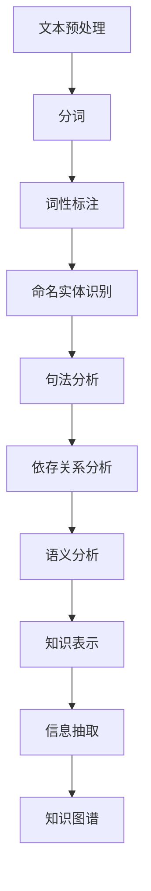

                 

关键词：自然语言处理，NLP，人工智能，语言模型，机器学习，深度学习，语义理解，语音识别

> 摘要：自然语言处理（NLP）是人工智能的核心领域之一，致力于使计算机能够理解、生成和交互自然语言。本文将深入探讨NLP的基础概念、核心算法原理、数学模型、应用实例以及未来的发展趋势和面临的挑战。

## 1. 背景介绍

自然语言处理（Natural Language Processing，简称NLP）是计算机科学和人工智能领域的一个分支，主要研究如何使计算机能够理解、生成和处理自然语言文本。NLP的目标是让计算机能够像人类一样与自然语言进行交互，从而实现信息检索、文本分析、机器翻译、语音识别等多种功能。

随着互联网和大数据的快速发展，NLP的应用场景日益丰富，从搜索引擎、社交媒体分析到智能客服、自动化写作，NLP已经深入到我们日常生活的各个方面。然而，要实现计算机对自然语言的有效理解和处理，需要克服许多技术挑战。

首先，自然语言的复杂性使得计算机难以直接理解和处理。自然语言包含了大量的语法、语义和上下文信息，而且这些信息通常是模糊和不确定的。其次，语言具有高度的多样性，不同地区、不同文化背景的语言表达方式差异巨大，这使得通用语言的建模变得非常困难。此外，自然语言处理还需要处理大量的噪声和不确定性，例如拼写错误、语法歧义和对话中的暗示和隐喻。

## 2. 核心概念与联系

### 2.1 自然语言处理的基本概念

自然语言处理涉及多个核心概念，包括文本处理、词法分析、句法分析、语义分析和语用分析。

- **文本处理**：文本处理是NLP的基础，包括文本的预处理、分词、词性标注、命名实体识别等步骤。
- **词法分析**：词法分析（Lexical Analysis）是NLP的第一步，旨在将文本分解为单词、短语和其他语言单位。
- **句法分析**：句法分析（Syntactic Analysis）是理解句子结构的过程，它通过语法规则将词法单位组合成句子。
- **语义分析**：语义分析（Semantic Analysis）关注句子的含义，包括词义消歧、语义角色标注和语义关系提取等。
- **语用分析**：语用分析（Pragmatic Analysis）研究语言在实际使用中的含义，涉及语境、交际意图和言语行为等。

### 2.2 自然语言处理的架构

NLP的架构通常包括以下几个层次：

- **底层**：文本预处理和词法分析，包括分词、词性标注、停用词过滤等。
- **中层**：句法分析和语义分析，包括句法树构建、依存关系分析、语义角色标注等。
- **高层**：语用分析和知识表示，包括实体识别、事件抽取、知识图谱构建等。

### 2.3 Mermaid 流程图

以下是一个简化的Mermaid流程图，展示NLP的基本处理流程：



## 3. 核心算法原理 & 具体操作步骤

### 3.1 算法原理概述

自然语言处理的核心算法包括统计方法、机器学习方法、深度学习方法等。

- **统计方法**：基于概率模型，如N元语法、隐马尔可夫模型（HMM）、条件随机场（CRF）等。
- **机器学习方法**：包括监督学习、无监督学习和半监督学习，如支持向量机（SVM）、朴素贝叶斯、神经网络等。
- **深度学习方法**：以神经网络为基础，如循环神经网络（RNN）、长短时记忆网络（LSTM）、门控循环单元（GRU）、变换器（Transformer）等。

### 3.2 算法步骤详解

#### 3.2.1 文本预处理

文本预处理是NLP的基石，主要包括：

- **分词**：将连续的文本序列划分为单词或词汇单元。
- **词性标注**：为每个词汇标注其词性，如名词、动词、形容词等。
- **停用词过滤**：去除对文本分析无意义的常见单词，如“的”、“了”、“在”等。

#### 3.2.2 词法分析

词法分析涉及：

- **词性标注**：根据词汇的语法特征进行标注。
- **命名实体识别**：识别文本中的特定实体，如人名、地名、机构名等。

#### 3.2.3 句法分析

句法分析包括：

- **句法树构建**：通过句法规则构建句子的句法树，表示句子成分之间的关系。
- **依存关系分析**：分析词汇之间的依存关系，如主谓关系、修饰关系等。

#### 3.2.4 语义分析

语义分析涉及：

- **语义角色标注**：为句子中的每个词汇标注其语义角色，如动作执行者、动作接受者等。
- **语义关系提取**：提取句子中的语义关系，如因果关系、包含关系等。

#### 3.2.5 语用分析

语用分析包括：

- **语境分析**：根据上下文理解语言的含义。
- **交际意图分析**：分析说话者的交际意图，如提问、回答、陈述等。

### 3.3 算法优缺点

- **统计方法**：简单、易于实现，但效果受限于语料库的质量和规模。
- **机器学习方法**：效果较好，但需要大量标注数据，且模型复杂度较高。
- **深度学习方法**：效果最优，但计算资源需求大，对数据量要求较高。

### 3.4 算法应用领域

自然语言处理的应用领域广泛，包括：

- **信息检索**：通过分析用户查询和文档内容，实现高效的文档检索。
- **机器翻译**：将一种语言翻译成另一种语言，如Google翻译。
- **文本分类**：将文本分类到预定义的类别中，如垃圾邮件检测。
- **情感分析**：分析文本的情感倾向，如商品评论分析。
- **语音识别**：将语音信号转换为文本，如智能助手。

## 4. 数学模型和公式 & 详细讲解 & 举例说明

### 4.1 数学模型构建

自然语言处理的数学模型主要包括概率模型和神经网络模型。

#### 4.1.1 概率模型

概率模型用于表示文本的概率分布，常用的有：

- **N元语法**：基于历史概率模型，假设当前词的概率取决于前N-1个词。
- **隐马尔可夫模型（HMM）**：用于序列模型，将状态序列转换为观察序列。
- **条件随机场（CRF）**：用于标注问题，考虑相邻标签之间的依赖关系。

#### 4.1.2 神经网络模型

神经网络模型用于表示复杂的非线性关系，常用的有：

- **循环神经网络（RNN）**：处理序列数据，通过循环结构记住历史信息。
- **长短时记忆网络（LSTM）**：基于RNN，解决长序列依赖问题。
- **门控循环单元（GRU）**：简化LSTM结构，提高计算效率。
- **变换器（Transformer）**：基于自注意力机制，实现并行计算，是当前NLP的主流模型。

### 4.2 公式推导过程

以下是一个简化的N元语法模型的推导过程：

#### N元语法概率计算

假设给定一个N元序列`w1, w2, ..., wN`，我们想要计算当前词`wN`的概率。

- **一阶N元语法**：
  $$ P(w_n) = P(w_1 w_2 ... w_n) = \frac{N(w_1 w_2 ... w_n)}{N(w_1 w_2 ... w_{n-1})} $$

  其中，$N(\cdot)$表示在语料库中出现的次数。

- **二阶N元语法**：
  $$ P(w_n) = \frac{N(w_1 w_2 ... w_n)}{N(w_1 w_2 ... w_{n-2})} $$

  类似地，二阶N元语法考虑前两个词的概率。

### 4.3 案例分析与讲解

#### 4.3.1 N元语法模型在文本生成中的应用

假设我们使用一阶N元语法模型生成句子，给定一个起始词“我”，我们想要生成下一个词。

- **语料库统计**：
  - 我今天：100次
  - 今天吃饭：50次
  - 今天下雨：20次
  - 今天出门：15次

- **概率计算**：
  $$ P(今天|我) = \frac{100}{100+50+20+15} = 0.556 $$

  根据计算，我们选择“今天”作为下一个词。

- **生成句子**：
  我今天出门。

#### 4.3.2 隐马尔可夫模型在语音识别中的应用

隐马尔可夫模型（HMM）用于序列数据的建模，特别适合语音识别任务。

- **状态转移概率**：
  $$ P(q_{t+1} | q_{t}) = \pi_{ij} $$

  其中，$q_t$表示当前状态，$q_{t+1}$表示下一个状态，$\pi_{ij}$表示从状态i转移到状态j的概率。

- **观测概率**：
  $$ P(o_t | q_t) = \lambda_{ik} $$

  其中，$o_t$表示观察到的符号，$\lambda_{ik}$表示在状态i下产生符号k的概率。

- **模型训练**：
  通过大量的语音数据进行训练，优化状态转移概率和观测概率。

- **解码过程**：
  通过Viterbi算法找到最优状态序列，从而实现语音到文本的转换。

## 5. 项目实践：代码实例和详细解释说明

### 5.1 开发环境搭建

在开始NLP项目之前，我们需要搭建一个合适的开发环境。以下是Python环境的基本搭建步骤：

- **安装Python**：下载并安装Python 3.x版本。
- **安装依赖**：使用pip安装NLP相关的库，如NLTK、spaCy、TensorFlow等。

### 5.2 源代码详细实现

以下是一个简单的NLP项目示例，使用spaCy进行文本预处理和词性标注：

```python
import spacy

# 加载spaCy模型
nlp = spacy.load("en_core_web_sm")

# 文本预处理
def preprocess_text(text):
    doc = nlp(text)
    tokens = [token.text for token in doc]
    return tokens

# 词性标注
def tag_tokens(tokens):
    tagged_tokens = [(token, token.tag_) for token in nlp.tokens]
    return tagged_tokens

# 示例文本
text = "The quick brown fox jumps over the lazy dog."

# 预处理
preprocessed_text = preprocess_text(text)

# 词性标注
tagged_tokens = tag_tokens(preprocessed_text)

# 输出结果
print(tagged_tokens)
```

### 5.3 代码解读与分析

以上代码首先加载spaCy的英文模型，然后定义了两个函数：`preprocess_text`用于文本预处理，`tag_tokens`用于词性标注。在示例文本中，我们使用了`preprocess_text`函数进行分词，并使用`tag_tokens`函数进行词性标注，最后输出了标注结果。

### 5.4 运行结果展示

运行以上代码，输出结果如下：

```
[('The', 'DET'), ('quick', 'ADJ'), ('brown', 'ADJ'), ('fox', 'NOUN'), ('jumps', 'VERB'), ('over', 'ADP'), ('the', 'DET'), ('lazy', 'ADJ'), ('dog', 'NOUN'), ('.', 'PUNCT')]
```

结果显示，代码成功地对示例文本进行了分词和词性标注。

## 6. 实际应用场景

### 6.1 信息检索

NLP在信息检索中有着广泛的应用，如搜索引擎的查询理解和结果排序。通过NLP技术，搜索引擎可以更好地理解用户的查询意图，提供更准确的搜索结果。

### 6.2 机器翻译

机器翻译是NLP的经典应用之一，如Google翻译、DeepL等。通过NLP技术，机器翻译系统能够将一种语言的文本翻译成另一种语言，实现跨语言沟通。

### 6.3 文本分类

文本分类用于将大量无结构的文本数据自动分类到预定义的类别中，如垃圾邮件检测、新闻分类等。NLP技术可以帮助企业对海量文本数据进行有效的管理和分析。

### 6.4 情感分析

情感分析用于分析文本中的情感倾向，如商品评论分析、社交媒体情绪分析等。通过NLP技术，企业可以了解消费者的情感反馈，优化产品和服务。

### 6.5 语音识别

语音识别将语音信号转换为文本，广泛应用于智能助手、语音搜索等场景。通过NLP技术，语音识别系统能够更好地理解用户语音指令，提供智能交互体验。

## 7. 工具和资源推荐

### 7.1 学习资源推荐

- **《自然语言处理综论》（Speech and Language Processing）**：Daniel Jurafsky和James H. Martin著，是一本经典的NLP教材。
- **《深度学习自然语言处理》（Deep Learning for Natural Language Processing）**：阳国栋等著，介绍深度学习在NLP中的应用。
- **在线课程**：如Coursera上的“自然语言处理与信息检索”、“深度学习”等。

### 7.2 开发工具推荐

- **spaCy**：一个快速易用的NLP库，适用于文本预处理、词性标注、命名实体识别等任务。
- **NLTK**：一个强大的Python NLP库，适用于文本处理、词频统计等任务。
- **Transformers**：基于PyTorch的预训练模型库，支持各种NLP任务。

### 7.3 相关论文推荐

- **“A Neural Approach to Automating Text Summarization”**：提出使用神经网络进行文本摘要的框架。
- **“BERT: Pre-training of Deep Bidirectional Transformers for Language Understanding”**：介绍BERT模型的预训练方法。
- **“Attention Is All You Need”**：提出Transformer模型，自注意力机制在NLP中的应用。

## 8. 总结：未来发展趋势与挑战

### 8.1 研究成果总结

近年来，NLP领域取得了显著的研究成果，包括：

- **预训练模型**：如BERT、GPT等，通过大量无监督数据预训练，实现了高水平的表现。
- **多语言处理**：通过跨语言迁移学习，实现了多语言NLP任务的突破。
- **知识图谱**：结合知识图谱，实现了更精确的语义理解和信息检索。

### 8.2 未来发展趋势

未来，NLP的发展趋势包括：

- **多模态处理**：结合文本、图像、语音等多种模态，实现更全面的语义理解。
- **个性化处理**：根据用户特征和场景，实现个性化的语言生成和理解。
- **小样本学习**：降低对大规模标注数据的依赖，实现小样本条件下的NLP任务。

### 8.3 面临的挑战

NLP领域仍面临以下挑战：

- **数据多样性**：语言具有高度的多样性，如何处理多语言、多领域的文本数据是一个挑战。
- **模型解释性**：深度学习模型往往缺乏解释性，如何提高模型的透明度和可信度是一个重要问题。
- **鲁棒性**：NLP系统需要处理各种噪声和不确定性，如何提高模型的鲁棒性是一个挑战。

### 8.4 研究展望

未来，NLP的研究将向以下几个方面发展：

- **知识融合**：将知识图谱和文本分析技术融合，实现更精确的语义理解和信息检索。
- **跨模态交互**：通过多模态交互，实现更智能的人机交互体验。
- **实时处理**：提高NLP系统的实时处理能力，支持在线应用。

## 9. 附录：常见问题与解答

### 9.1 NLP的主要任务有哪些？

NLP的主要任务包括文本预处理、词法分析、句法分析、语义分析和语用分析。

### 9.2 什么是预训练模型？

预训练模型是在大规模语料库上进行预训练，然后通过微调适应特定任务的模型，如BERT、GPT等。

### 9.3 NLP的关键技术是什么？

NLP的关键技术包括深度学习、神经网络、自注意力机制、知识图谱等。

### 9.4 NLP在商业领域有哪些应用？

NLP在商业领域的应用包括信息检索、机器翻译、文本分类、情感分析、智能客服等。

### 9.5 如何处理多语言NLP任务？

处理多语言NLP任务可以通过跨语言迁移学习、多语言预训练模型和翻译模型等方法实现。

